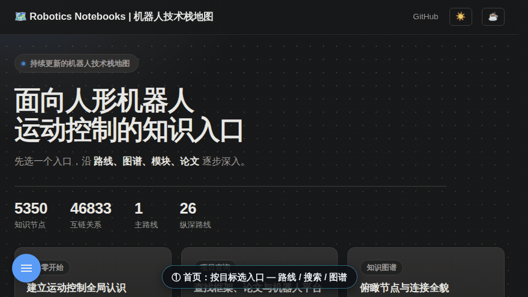

# Robotics_Notebooks

机器人技术栈知识库 / Robotics research and engineering wiki.

---

## 在线演示

↑ [在线站点](https://imchong.github.io/Robotics_Notebooks/)使用方式：**首页**按目标选入口（路线 / 搜索 / 图谱）——点「项目查询 / 知识图谱」会滚到对应模块并顺时针描边高亮；搜索框输入关键词即时命中知识页；[**知识图谱**](https://imchong.github.io/Robotics_Notebooks/graph.html)中每个点是一个知识页，颜色代表技术社区，连线是页面互链——悬停看简介，滚轮缩放、拖拽平移，点击节点打开详情侧栏并一键进知识页，支持 2D / 3D 视图切换。

---

## 适合谁

想系统学人形机器人运动控制 / 强化学习 / 模仿学习，有一定编程基础（Python / C++）与本科数学基础。

不知道从哪开始？先走 [运动控制主路线](roadmap/motion-control.md)；已有明确方向时，按目标选一条 [纵深路线](roadmap/README.md)。

---

## 这个项目是什么

`Robotics_Notebooks` 是一个**机器人工程知识库**，不是资源收集箱。它把机器人技术栈拆成互联的知识页面——每个概念解释清楚是什么、为什么重要、和哪些概念相关。

**不是**：教科书（不系统讲理论）、笔记堆（有结构和依赖关系）、工具文档。

---

## 从哪里开始

| 你的目标 | 入口 |
|---------|------|
| 可视化探索知识图谱 | [知识图谱](https://imchong.github.io/Robotics_Notebooks/graph.html) |
| 有一条路线照着走 | [运动控制成长路线](roadmap/motion-control.md) |
| 先看纵深总目录再选方向 | [路线总览](roadmap/README.md) |
| 用遥操作采集数据并实时操控人形（含全身 + 手指） | [遥操作（Teleoperation）](roadmap/depth-teleoperation.md) |
| 设计力矩控制关节电机 | [力矩电机设计（Torque Motor Design）](roadmap/depth-torque-motor-design.md) |
| 学传统模型控制（MPC/WBC）| [传统控制（Classical Control）](roadmap/depth-classical-control.md) |
| 设计人形整机硬件（机械 + 电气 + 通信） | [整机硬件（Humanoid Hardware）](roadmap/depth-humanoid-hardware-design.md) |
| 学安全控制（CLF/CBF）| [安全控制（Safe Control）](roadmap/depth-safe-control.md) |
| 让研发闭环自己变强（递归自我改进） | [递归自我改进（RSI）](roadmap/depth-rsi.md) |
| 做接触丰富的操作任务 | [接触操作（Contact Manipulation）](roadmap/depth-contact-manipulation.md) |
| 让机器人自主从 A 到 B | [导航（Navigation）](roadmap/depth-navigation.md) |
| 给策略挑网络结构（骨干 / 动作头 / 多模态基座） | [模型架构（Model Architecture）](roadmap/depth-model-architecture.md) |
| 学模仿学习与技能迁移 | [模仿学习（Imitation Learning）](roadmap/depth-imitation-learning.md) |
| 用强化学习做运动控制 | [强化学习运动控制（RL Locomotion）](roadmap/depth-rl-locomotion.md) |
| 让机器人边走边动手 | [移动操作（Loco-Manipulation）](roadmap/depth-loco-manipulation.md) |
| 让机器人追球射门打比赛 | [人形足球（Humanoid Soccer）](roadmap/depth-humanoid-soccer.md) |
| 把人体/动物动作变成人形或四足参考轨迹 | [动作重定向（Motion Retargeting）](roadmap/depth-motion-retargeting.md) |
| 让一群人形同台跳舞变队形炫技 | [人形群控展演（Swarm Performance）](roadmap/depth-humanoid-swarm-performance.md) |
| 让仿真训好的策略稳上真机 | [仿真到真机迁移（Sim2Real）](roadmap/depth-sim2real.md) |
| 让两台人形在擂台上对打 | [人形拳击（Humanoid Boxing）](roadmap/depth-humanoid-boxing.md) |
| 让机器人读完一条示范就会新任务 | [具身上下文学习（ICL）](roadmap/depth-icl.md) |
| 做人形全身行为基础模型 | [人形行为基础模型（BFM）](roadmap/depth-bfm.md) |
| 证明/证伪一个具身模型（含运控模型）到底好不好 | [具身测评（Embodied Evaluation）](roadmap/depth-embodied-eval.md) |
| 让机器人看地形越障 | [感知越障（Perceptive Locomotion）](roadmap/depth-perceptive-locomotion.md) |
| 用生成模型造人形动作 | [动作生成（Motion Generation）](roadmap/depth-motion-generation.md) |
| 理解从扩散去噪到流匹配的机器人动作策略 | [扩散与流匹配策略（Diffusion & Flow Matching）](roadmap/depth-robotics-diffusion-dit-flow.md) |
| 让机器人听懂指令干活 | [视觉-语言-动作模型（VLA）](roadmap/depth-vla.md) |
| 把真实世界变成可训练/可评测的仿真资产 | [真实到仿真（Real2Sim）](roadmap/depth-real2sim.md) |
| 为具身模型建一条可交付的数据供给管线 | [具身数据（Embodied Data）](roadmap/depth-embodied-data.md) |
| 让策略预知动作如何改变世界 | [世界-动作模型（WAM）](roadmap/depth-wam.md) |
| 浏览所有知识页 | [完整页面目录](catalog.md) |
| 搜索特定概念 | [站点搜索](https://imchong.github.io/Robotics_Notebooks/) |

> 二十七条纵深路线按各方向**起点里程碑的历史顺序**排列（与首页按钮一致）：遥操作（Goertz 主从机械手，1954）→ 力矩电机设计（磁场定向控制 FOC，1971）→ 传统控制（ZMP 判据，1972）→ 整机硬件设计（WABOT-1 全尺寸人形整机，1973）→ 安全控制（CLF，1983）→ 递归自我改进（EURISKO 自改启发式，1983）→ 接触操作（阻抗控制，1985）→ 导航（概率 SLAM，1986）→ 模型架构（反向传播，1986）→ 模仿学习（行为克隆，1988）→ 强化学习（Q-learning，1989）→ 移动操作（移动操作臂协调控制，1994）→ 人形足球（首届 RoboCup，1997）→ 动作重定向（Gleicher 动作重定向，1998）→ 人形群控展演（央视春晚 540 台 Alpha 1S 群舞，2016）→ 仿真到真机（域随机化 DR，2017）→ 人形拳击（MuJoCo 人形对抗自博弈，2017）→ 上下文学习（One-Shot Imitation Learning，NeurIPS 2017）→ 行为基础模型（DeepMimic 动作跟踪谱系，2018）→ 具身模型测评（RLBench 标准化视觉操作评测套件，2019）→ 感知越障（2020s 感知策略浪潮）→ 动作生成（MDM 扩散动作生成，2022）→ 扩散与流匹配策略（Diffusion Policy，2023）→ 视觉–语言–动作（RT-2 确立 VLA，2023）→ 真实到仿真（3D Gaussian Splatting 规模化重建，2023）→ 具身数据（Open X-Embodiment 跨具身数据聚合，2023）→ 世界–动作模型（World Action Models 综述形式化，2026）。越靠前的方向理论积淀越深，越靠后的方向越依赖学习方法与算力。

---

## 许可证

本项目采用 [MIT License](LICENSE)。

想参与维护或补充页面？见 [CONTRIBUTING.md](CONTRIBUTING.md)。

---

## ⭐ 星标趋势

> 点击图表打开 [Plotly 交互版](https://imchong.github.io/Robotics_Notebooks/star-history.html)（可缩放、悬停查看数值；另可切换每日星数、节点数趋势、每日节点数、纵深数趋势）。GitHub README 不执行 JavaScript，因此这里展示静态预览图。
