## Actor / Critic / Disc 网络结构详解

### 1. Model 类继承关系

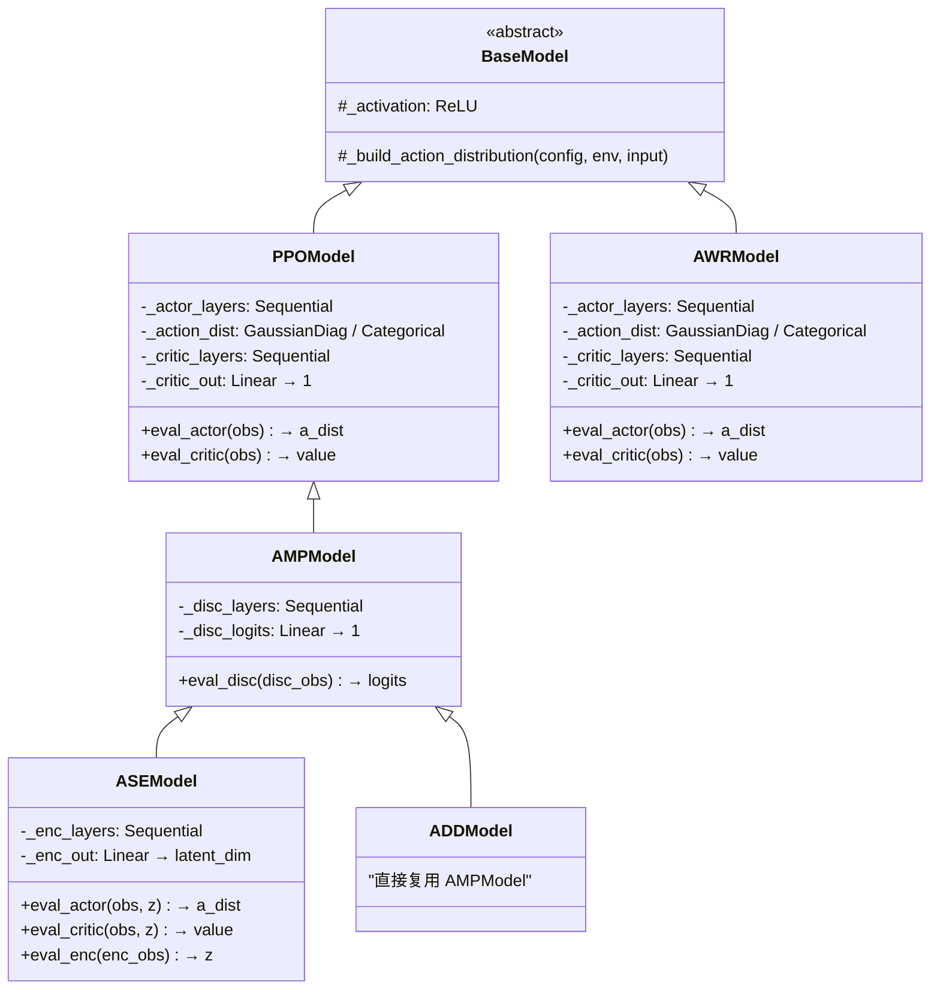

### 2. 可用的网络骨干 (net_builder)

`net_builder` 通过字符串名称查找 Python 模块，调用其 `build_net()` 函数生成 `nn.Sequential`：

```mermaid
flowchart TB
    subgraph "net_builder.build_net(net_name, input_dict, activation)"
        NB["根据 net_name 字符串<br/>查找 globals() 中对应模块"]
    end

    NB --> N1
    NB --> N2
    NB --> N3
    NB --> N4
    NB --> N5
    NB --> N6

    subgraph N1 ["fc_2layers_128units"]
        direction LR
        N1A["Linear(in, 128)"] --> N1B["ReLU"] --> N1C["Linear(128, 64)"] --> N1D["ReLU"]
    end

    subgraph N2 ["fc_2layers_256units"]
        direction LR
        N2A["Linear(in, 256)"] --> N2B["ReLU"] --> N2C["Linear(256, 128)"] --> N2D["ReLU"]
    end

    subgraph N3 ["fc_2layers_512units"]
        direction LR
        N3A["Linear(in, 512)"] --> N3B["ReLU"] --> N3C["Linear(512, 256)"] --> N3D["ReLU"]
    end

    subgraph N4 ["fc_2layers_1024units"]
        direction LR
        N4A["Linear(in, 1024)"] --> N4B["ReLU"] --> N4C["Linear(1024, 512)"] --> N4D["ReLU"]
    end

    subgraph N5 ["fc_3layers_1024units"]
        direction LR
        N5A["Linear(in, 1024)"] --> N5B["ReLU"] --> N5C["Linear(1024, 1024)"] --> N5D["ReLU"] --> N5E["Linear(1024, 512)"] --> N5F["ReLU"]
    end

    subgraph N6 ["cnn_3conv_1fc_0"]
        direction LR
        N6A["Conv2d(in,32,k=8,s=4)"] --> N6B["ReLU"] --> N6C["Conv2d(32,64,k=4,s=2)"] --> N6D["ReLU"] --> N6E["Conv2d(64,64,k=3,s=1)"] --> N6F["ReLU"] --> N6G["Flatten"] --> N6H["Linear(*, 512)"] --> N6I["ReLU"]
    end

    style N4 fill:#E8F5E9,stroke:#2E7D32
    style N5 fill:#FFF3E0,stroke:#E65100
```

### 3. Actor 网络完整结构

以 PPO + `fc_2layers_1024units` 为例（连续动作空间，`actor_std_type: FIXED`）：

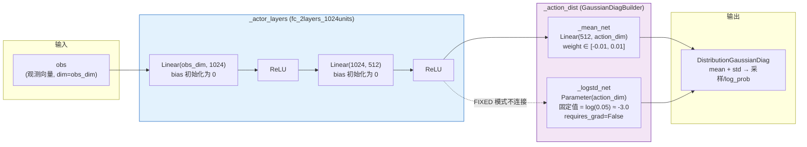

**std_type 三种模式对比**：

| StdType | `_logstd_net` | 含义 | 梯度 |
|---------|---------------|------|------|
| `FIXED` | `Parameter(requires_grad=False)` | 固定标准差，不会改变 | 不回传 |
| `CONSTANT` | `Parameter(requires_grad=True)` | 全局可学习标准差（所有状态共享） | 回传 |
| `VARIABLE` | `Linear(512, action_dim)` | 状态依赖的标准差（输入 h） | 回传 |

### 4. Critic 网络完整结构

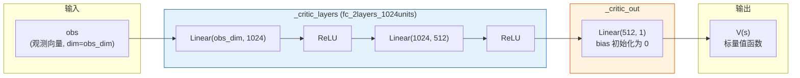

### 5. Discriminator 网络完整结构 (AMP/ASE/ADD)

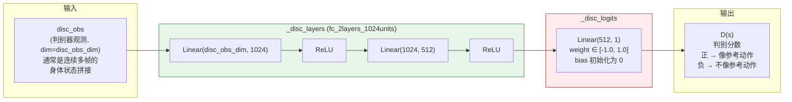

### 6. ASE 额外的 Encoder 网络

ASE 在 AMP 基础上新增了 **Encoder** 和 **Latent Space**，Actor/Critic 的输入也变为 `[obs, z]` 拼接：

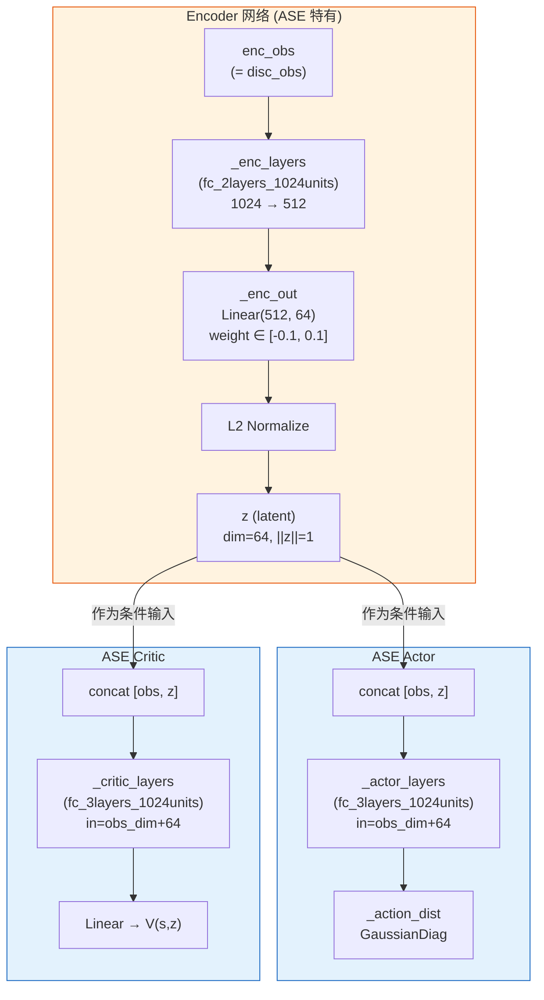

### 7. 各算法的网络配置汇总

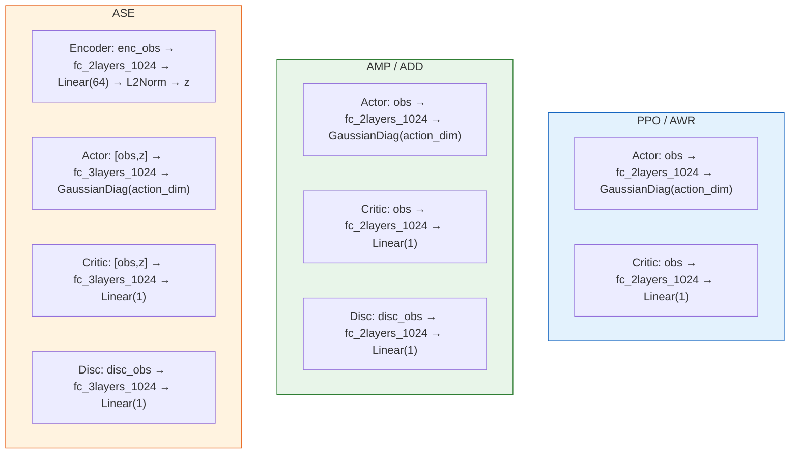

### 关键总结

| 网络 | 输入 | 骨干 | 输出头 | 作用 |
|------|------|------|--------|------|
| **Actor** | obs (PPO/AMP) 或 [obs, z] (ASE) | `fc_2layers_1024` 或 `fc_3layers_1024` | `GaussianDiagBuilder` → mean + std | 输出动作分布，用于采样动作 |
| **Critic** | 同 Actor 输入 | 同上 | `Linear(hidden, 1)` | 输出状态价值 V(s)，用于 GAE 优势估计 |
| **Disc** | disc_obs（连续多帧身体状态拼接） | `fc_2layers_1024` 或 `fc_3layers_1024` | `Linear(hidden, 1)` | AMP 判别器，区分"像参考动作"vs"不像"，输出作为奖励信号 |
| **Encoder** | enc_obs（= disc_obs） | `fc_2layers_1024` | `Linear(hidden, 64)` + L2 归一化 | ASE 特有，将动作片段编码为单位球上的潜变量 z |

**设计上的共同模式**：所有网络都是 **骨干（nn.Sequential）+ 任务特定输出头** 的两段式结构。骨干通过 `net_builder` 根据字符串名称动态构建，输出头在各自的 Model 类中硬编码。这样做到了骨干复用、输出头各异。


## 四种输出头，分别在做什么？

把整个训练过程想象成一个**学武术的故事**：

---

### 1. Actor 输出头 — "身体"，决定怎么动

> **问题**：给定当前看到的画面（obs），我接下来应该做什么动作？

Actor 就像一个人的**运动神经系统**。它看到当前的状态（比如"我现在站着，左脚在前"），然后输出一个动作指令（比如"右腿抬高 30 度，左手向前伸"）。

```
输入: 当前身体状态 obs
      ↓
  骨干网络（提取特征）
      ↓
  ┌─────────────────────────┐
  │ _mean_net: Linear → 动作均值  │  ← "我觉得应该往这个方向动"
  │ _logstd_net: 标准差          │  ← "我有多不确定"
  └─────────────────────────┘
      ↓
  输出: 高斯分布 → 从中采样一个具体动作
```

**大白话**：Actor 就是"做动作的人"。它输出的不是一个精确动作，而是一个**概率分布**——"我大概要做这个动作（均值），但可能偏差一点点（标准差）"。训练初期标准差大，动作很随机（瞎试）；训练后期标准差小，动作很精准。

---

### 2. Critic 输出头 — "教练的打分牌"，评估当前局势好不好

> **问题**：我现在这个状态，未来大概能拿多少分？

Critic 就像一个旁观的**教练**，它不做动作，只负责打分。

```
输入: 当前身体状态 obs
      ↓
  骨干网络（提取特征）
      ↓
  ┌───────────────────────┐
  │ _critic_out: Linear → 1个数字 │  ← "这个局面值 85 分"
  └───────────────────────┘
      ↓
  输出: V(s) 一个标量分数
```

**大白话**：Critic 就是"打分的裁判"。它告诉 Actor——"你现在这个姿势不错，预计能拿 85 分"或者"你快摔倒了，只能拿 10 分"。Actor 根据这个评分来调整策略：哪些动作让分数变高了，就多做；让分数变低了，就少做。

**为什么需要它？** 因为训练中一个回合很长，最终的奖励要很久之后才知道。Critic 的作用就是**提前预估未来的总奖励**，这样 Actor 不用等到回合结束才知道"刚才那个动作好不好"，可以立刻得到反馈。

---

### 3. Discriminator 输出头 — "裁判的真假鉴定"，判断动作像不像人

> **问题**：这段动作是真人做的还是 AI 做的？

Discriminator（判别器）就像一个**鉴定师**，它看一段连续的身体运动，然后判断"这像真人动作吗？"

```
输入: 连续多帧的身体状态 disc_obs
      ↓
  骨干网络（提取特征）
      ↓
  ┌───────────────────────┐
  │ _disc_logits: Linear → 1个数字 │  ← 正数="像真的" / 负数="像假的"
  └───────────────────────┘
      ↓
  输出: D(s) 一个判别分数
```

**大白话**：想象一个"验钞机"。你把一段动作片段塞进去：
- 如果是从**真人动捕数据**里取出来的 → 它应该输出"**真的**"（正分数）
- 如果是 **AI 自己做出来**的 → 它会输出"**假的**"（负分数）

然后这个判别分数会**转化成奖励**给 Actor。Actor 的目标就变成了：做出来的动作要能**骗过判别器**，让判别器也觉得"这像真人做的"。

这就是 **AMP（Adversarial Motion Prior）** 的核心思想——Actor 和 Discriminator 在**对抗博弈**：
- Actor 努力做得更像真人 → 骗过 Discriminator
- Discriminator 努力提高鉴别能力 → 不被骗

最终两者都变强，Actor 就学会了**自然的动作风格**。

---

### 4. Encoder 输出头 — "技能分类器"，把动作编码成技能标签

> **问题**：这段动作属于哪一种"风格/技能"？

Encoder（编码器）是 **ASE（Adversarial Skill Embeddings）** 特有的，它把一段动作编码成一个**潜变量 z**（一个 64 维的向量，被归一化到单位球上）。

```
输入: 连续多帧的身体状态 enc_obs
      ↓
  骨干网络（提取特征）
      ↓
  ┌───────────────────────────┐
  │ _enc_out: Linear → 64维向量   │
  │ L2 Normalize → ||z|| = 1     │  ← "这段动作属于技能 z"
  └───────────────────────────┘
      ↓
  输出: z（单位球上的一个点）
```

**大白话**：假设你有很多种动作数据——走路、跑步、踢腿、后空翻。Encoder 的工作就像一个"**自动分类器**"：
- 看到一段走路动作 → 编码成 z₁ 方向
- 看到一段后空翻 → 编码成 z₂ 方向（和 z₁ 方向很不同）

然后 Actor 的输入变成 `[obs, z]`，意思是"在当前状态下，**按照 z 代表的那种风格**来做动作"。这样一个 Actor 就能做出**多种不同的技能**，只需要切换 z 就行了。

---

### 四个输出头的关系一图总结

```
                     真人动作数据
                         │
                         ▼
        ┌─────── Discriminator ◄──────┐
        │        "这像真人吗？"         │
        │         输出判别分数          │
        │              │               │
        │         转化为奖励            │
        │              │               │
        │              ▼               │
        │    ┌──── Critic ────┐        │
        │    │ "当前局面值多少分" │        │
        │    │   预估未来总奖励  │        │
        │    └───────┬────────┘        │
        │            │                 │
        │       指导优势计算             │
        │            │                 │
        │            ▼                 │
        │    ┌──── Actor ─────┐        │
        │    │ "我该做什么动作"  │ ──AI动作──┘
        │    │   输出动作分布   │
        │    └───────┬────────┘
        │            │
        │       [ASE 额外]
        │            │
        │            ▼
        │    ┌──── Encoder ───┐
        │    │ "这是哪种技能"   │
        │    │  编码成 z 向量   │──── z 反馈给 Actor/Critic
        │    └────────────────┘       作为条件输入
        │
   训练循环不断迭代
```

| 输出头 | 一句话 | 输出什么 | 被谁用 |
|--------|--------|----------|--------|
| **Actor** | 做动作的人 | 动作的概率分布（均值+标准差） | 环境执行动作 |
| **Critic** | 打分的裁判 | 一个分数（状态价值） | Actor 学习时计算"优势" |
| **Discriminator** | 验钞机/鉴定师 | 一个分数（真/假） | 转化为奖励信号给 Actor |
| **Encoder** | 技能分类器 | 64 维潜变量 z | 作为条件输入给 Actor 和 Critic |


## 网络是同时训练的吗？——训练顺序与关联关系

**简短回答：是的，在一次更新中所有网络是"同时"训练的。** 它们的 loss 被加在一起，走一次 `backward()`，一个优化器同时更新所有参数。

但"同时"只是表面现象，背后有严格的**数据依赖链**。下面从最简单的 PPO 讲到最复杂的 ASE。

---

### 1. PPO / AWR — 最简单的情况：Actor + Critic 同时更新

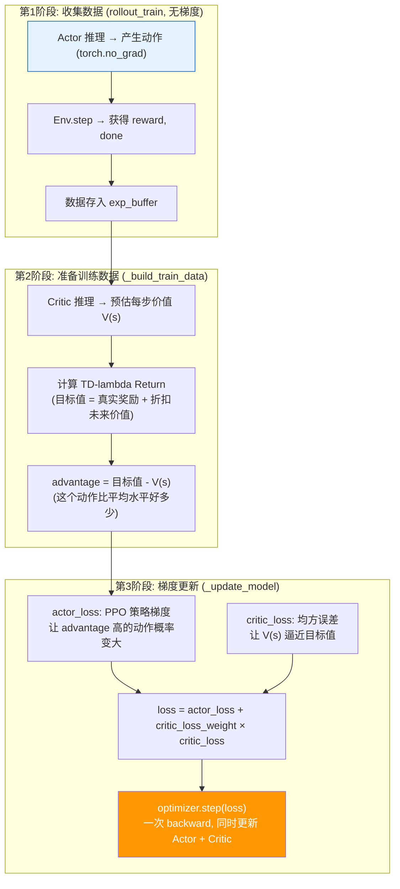

**关键点**：Critic 的预估值在第2阶段已经 `.detach()` 了（不参与梯度计算），它只是提供一个"参考基线"。到第3阶段，Actor 和 Critic 各自的 loss 加在一起，一次 `backward()` 同时更新两者。

---

### 2. AMP / ADD — 加入 Discriminator 的三方联动

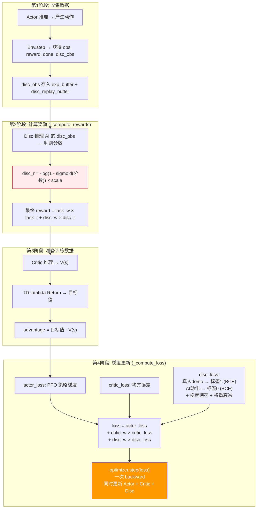

**关键洞察**：Discriminator 有**两个角色**，分别在不同阶段发挥作用：

| 阶段 | Disc 的角色 | 是否计算梯度 |
|------|-----------|------------|
| 第2阶段（计算奖励） | 当"裁判"，给 AI 动作打分转化为 reward | `torch.no_grad`，**不回传梯度** |
| 第4阶段（更新模型） | 当"学生"，自己学习如何更好地分辨真假 | **回传梯度**，更新 Disc 参数 |

这形成了一个**对抗循环**：
- Disc 打分 → 转化成 reward → 指导 Actor 学习（Actor 间接受 Disc 影响）
- Disc 自己也在学习变得更好 → 给出更准确的分数 → Actor 需要更努力

---

### 3. ASE — 四个网络的完整联动

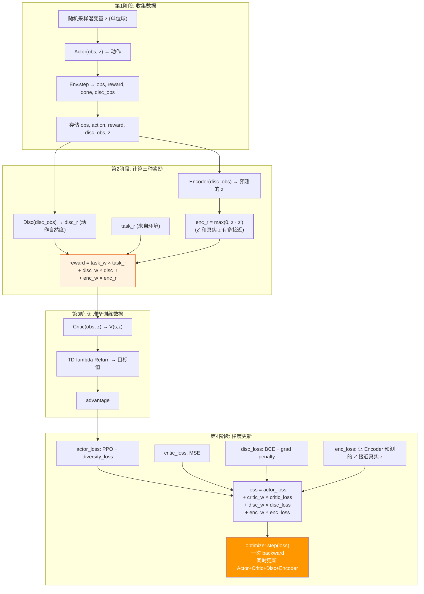

---

### 总结：一次迭代中各网络的"时间线"

```mermaid
gantt
    title 一次训练迭代中各网络的活动时间线
    dateFormat X
    axisFormat %s

    section 第1阶段 收集数据
    Actor 推理 (no_grad)         :a1, 0, 10

    section 第2阶段 计算奖励
    Disc 推理打分 (no_grad)      :d1, 10, 15
    Enc 推理打分 (no_grad, ASE)  :e1, 10, 15

    section 第3阶段 准备数据
    Critic 推理估值 (no_grad)    :c1, 15, 20
    计算 advantage               :c2, 20, 22

    section 第4阶段 梯度更新
    Actor loss 计算              :crit1, 22, 26
    Critic loss 计算             :crit2, 22, 26
    Disc loss 计算               :crit3, 22, 26
    Enc loss 计算 (ASE)          :crit4, 22, 26
    合并loss + backward + step   :crit5, 26, 30
```

### 用大白话说清楚

**所有网络用的是一个优化器，走一次 `loss.backward()`。** 具体来说：

```python
# ppo_agent._compute_loss() 核心逻辑
loss = actor_loss + critic_w * critic_loss           # PPO

# amp_agent._compute_loss() 在此基础上
loss = loss + disc_w * disc_loss                     # +AMP

# ase_agent._compute_loss() 在此基础上
loss = loss + enc_w * enc_loss                       # +ASE

# 然后一步到位
optimizer.step(loss)  # 一次 backward，所有网络参数同时更新
```

| 问题 | 回答 |
|------|------|
| **是同时训练吗？** | 是。所有 loss 加在一起，一次 backward，一个优化器 step |
| **有先后依赖吗？** | 有。**数据准备**有严格的先后顺序（Disc/Enc 先算 reward → Critic 算 advantage → 然后才能计算 loss），但**参数更新**是同时的 |
| **为什么能同时？** | 因为各个 loss 作用在不同的网络参数上：actor_loss 的梯度只流过 Actor 参数，disc_loss 的梯度只流过 Disc 参数，互不干扰 |
| **权重如何平衡？** | 通过 `critic_loss_weight`、`disc_loss_weight`、`enc_loss_weight` 控制各网络学习的相对速度 |


## 核心原理：梯度只沿着计算图流动

一次 `backward()` 确实对**所有参数**计算了梯度，然后优化器也确实**同时更新了所有参数**。但关键是——**如果某个 loss 的计算图根本没经过某个网络的参数，那该参数的梯度对这个 loss 就是 0。**

用一个极简的例子说明：

```python
# 假设有两个完全独立的网络
net_A = Linear(10, 5)   # 参数: w_A
net_B = Linear(10, 5)   # 参数: w_B

# 各自计算 loss
loss_A = net_A(input_1).sum()    # 计算图只经过 w_A
loss_B = net_B(input_2).sum()    # 计算图只经过 w_B

# 加在一起
total_loss = loss_A + loss_B

# 一次 backward
total_loss.backward()
```

此时会发生什么？

| 参数 | `loss_A` 对它的梯度 | `loss_B` 对它的梯度 | 总梯度 |
|------|-------------------|-------------------|--------|
| `w_A` | **有值**（因为 `loss_A` 经过了 `net_A`） | **0**（因为 `loss_B` 完全没碰 `net_A`） | = `∂loss_A/∂w_A` |
| `w_B` | **0**（因为 `loss_A` 完全没碰 `net_B`） | **有值**（因为 `loss_B` 经过了 `net_B`） | = `∂loss_B/∂w_B` |

**加法的导数是各项导数之和。某一项对某个参数没有依赖关系，导数就是 0，加了也等于没加。**

---

## 结合 MimicKit 代码验证

以 AMP 为例，看 `_compute_loss` 的实际代码。

`amp_agent.py` 第 118-128 行：

```118:128:mimickit/learning/amp_agent.py
    def _compute_loss(self, batch):
        info = super()._compute_loss(batch)

        disc_info = self._compute_disc_loss(batch)
        disc_loss = disc_info["disc_loss"]

        loss = info["loss"]
        loss = loss + self._disc_loss_weight * disc_loss
        info["loss"] = loss
        info = {**info, **disc_info}
        return info
```

其中 `super()._compute_loss()` 来自 `ppo_agent.py` 第 169-182 行：

```169:182:mimickit/learning/ppo_agent.py
    def _compute_loss(self, batch):
        batch["norm_obs"] = self._obs_norm.normalize(batch["obs"])
        batch["norm_action"] = self._a_norm.normalize(batch["action"])

        critic_info = self._compute_critic_loss(batch)
        actor_info = self._compute_actor_loss(batch)

        critic_loss = critic_info["critic_loss"]
        actor_loss = actor_info["actor_loss"]

        loss = actor_loss + self._critic_loss_weight * critic_loss

        info = {"loss":loss, **critic_info, **actor_info}
        return info
```

最终的 total loss 是：

```python
total_loss = actor_loss + critic_w * critic_loss + disc_w * disc_loss
```

现在来跟踪每个 loss 的**计算图**经过了哪些网络参数：

### actor_loss 的计算图

```198:213:mimickit/learning/ppo_agent.py
    def _compute_actor_loss(self, batch):
        norm_obs = batch["norm_obs"]
        norm_a = batch["norm_action"]
        old_a_logp = batch["a_logp"]
        adv = batch["adv"]
        # ...
        a_dist = self._model.eval_actor(norm_obs)  # ← 经过 Actor 网络
        a_logp = a_dist.log_prob(norm_a)

        a_ratio = torch.exp(a_logp - old_a_logp)
        # ...
        actor_loss = -torch.mean(actor_loss)
```

`eval_actor` 经过了 `_actor_layers` + `_action_dist`。所以：

> **actor_loss 的计算图只包含 Actor 的参数**

### critic_loss 的计算图

```184:196:mimickit/learning/ppo_agent.py
    def _compute_critic_loss(self, batch):
        norm_obs = batch["norm_obs"]
        tar_val = batch["tar_val"]
        pred = self._model.eval_critic(norm_obs)  # ← 经过 Critic 网络
        pred = pred.squeeze(-1)

        diff = tar_val - pred
        loss = torch.mean(torch.square(diff))
```

`eval_critic` 经过了 `_critic_layers` + `_critic_out`。而 `tar_val` 在 `_build_train_data` 中已经 `.detach()` 了，它只是一个**数值常量**，不携带任何计算图。

> **critic_loss 的计算图只包含 Critic 的参数**

### disc_loss 的计算图

```130:149:mimickit/learning/amp_agent.py
    def _compute_disc_loss(self, batch):
        disc_obs = batch["disc_obs"]
        disc_demo_obs = batch["disc_obs_demo"]
        # ...
        disc_agent_logit = self._model.eval_disc(norm_disc_obs)      # ← 经过 Disc 网络
        disc_demo_logit = self._model.eval_disc(norm_disc_obs_demo)  # ← 经过 Disc 网络

        disc_loss_agent = self._disc_loss_neg(disc_agent_logit)
        disc_loss_demo = self._disc_loss_pos(disc_demo_logit)
        disc_loss = 0.5 * (disc_loss_agent + disc_loss_demo)
```

`eval_disc` 经过了 `_disc_layers` + `_disc_logits`。输入的 `disc_obs` 和 `disc_demo_obs` 都是从 buffer 中取出来的数据（没有梯度），不会连回 Actor 或 Critic。

> **disc_loss 的计算图只包含 Discriminator 的参数**

---

## 一图看透全局

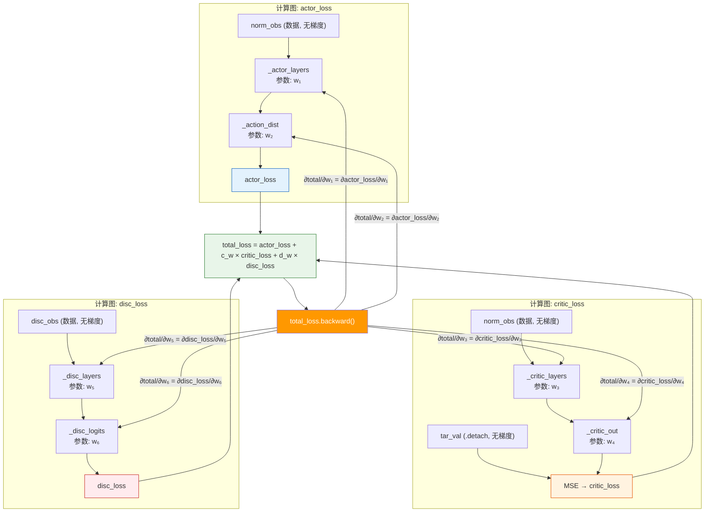

---

## 数学上为什么成立？

加法的偏导数具有**可分解性**：


$\frac{\partial \text{total\_loss}}{\partial w_i} = \frac{\partial \text{actor\_loss}}{\partial w_i} + c_w \cdot \frac{\partial \text{critic\_loss}}{\partial w_i} + d_w \cdot \frac{\partial \text{disc\_loss}}{\partial w_i}$


以 Actor 的参数 \( w_1 \) 为例：

- \( $\frac{\partial \text{actor\_loss}}{\partial w_1}$ \) = **有值**（actor_loss 经过了 \( w_1 \)）
- \( $\frac{\partial \text{critic\_loss}}{\partial w_1}$ \) = **0**（critic_loss 的计算过程完全没碰 \( w_1 \)）
- \( $\frac{\partial \text{disc\_loss}}{\partial w_1}$ \) = **0**（disc_loss 的计算过程完全没碰 \( w_1 \)）

所以：

$\frac{\partial \text{total\_loss}}{\partial w_1} = \frac{\partial \text{actor\_loss}}{\partial w_1} + 0 + 0$


**等价于只用 actor_loss 单独对 Actor 做 backward。** 对 Critic 和 Disc 同理。

---

## 那 loss_weight 有什么用？

既然各网络的梯度互不影响，`disc_loss_weight=5` 的意义就不是"平衡不同网络"，而是**控制 Disc 参数更新的步长大小**：

```python
total_loss = actor_loss + 1.0 * critic_loss + 5.0 * disc_loss
```

对于 Disc 参数来说：

$\frac{\partial \text{total\_loss}}{\partial w_{\text{disc}}} = 5.0 \times \frac{\partial \text{disc\_loss}}{\partial w_{\text{disc}}}$


相当于把 Disc 的梯度**放大了 5 倍**，让判别器每步学得更快。这和用不同学习率的效果类似，但实现更简洁——只需一个优化器。

---

### 一句话总结

**加在一起的 loss 做一次 backward，PyTorch 的自动微分会让梯度只沿着各自的计算图流动。某个 loss 没经过某个网络，那个网络的参数对这个 loss 的梯度天然就是 0，加了也白加。所以效果等价于各网络"各管各的"，只是写法上合并在了一起。**