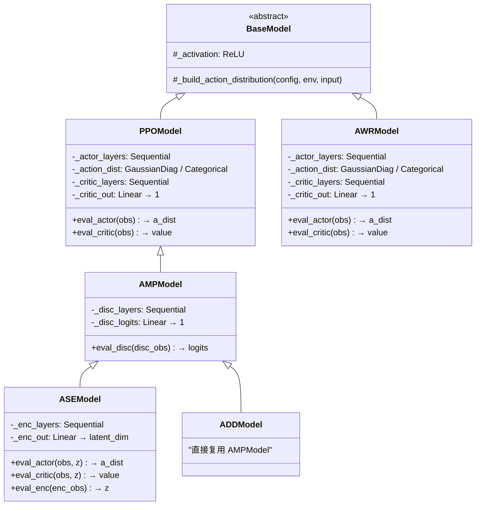
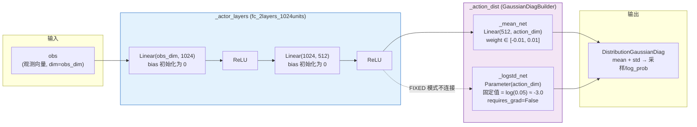
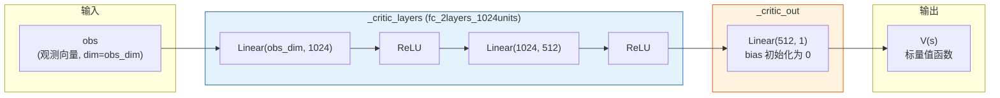
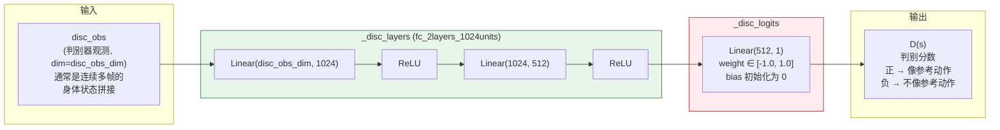
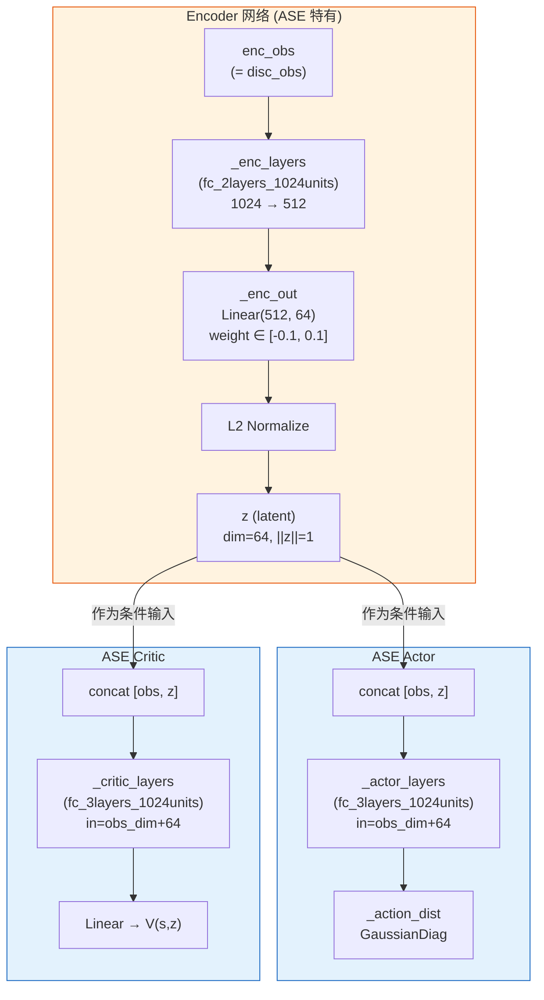
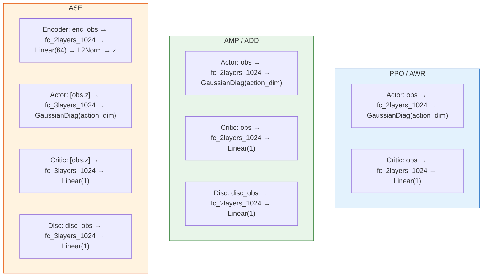

## Actor / Critic / Disc 网络结构详解

### 1. Model 类继承关系



### 2. 可用的网络骨干 (net_builder)

`net_builder` 通过字符串名称查找 Python 模块，调用其 `build_net()` 函数生成 `nn.Sequential`：

```mermaid
flowchart TB
    subgraph "net_builder.build_net(net_name, input_dict, activation)"
        NB["根据 net_name 字符串<br/>查找 globals() 中对应模块"]
    end

    NB --> N1
    NB --> N2
    NB --> N3
    NB --> N4
    NB --> N5
    NB --> N6

    subgraph N1 ["fc_2layers_128units"]
        direction LR
        N1A["Linear(in, 128)"] --> N1B["ReLU"] --> N1C["Linear(128, 64)"] --> N1D["ReLU"]
    end

    subgraph N2 ["fc_2layers_256units"]
        direction LR
        N2A["Linear(in, 256)"] --> N2B["ReLU"] --> N2C["Linear(256, 128)"] --> N2D["ReLU"]
    end

    subgraph N3 ["fc_2layers_512units"]
        direction LR
        N3A["Linear(in, 512)"] --> N3B["ReLU"] --> N3C["Linear(512, 256)"] --> N3D["ReLU"]
    end

    subgraph N4 ["fc_2layers_1024units"]
        direction LR
        N4A["Linear(in, 1024)"] --> N4B["ReLU"] --> N4C["Linear(1024, 512)"] --> N4D["ReLU"]
    end

    subgraph N5 ["fc_3layers_1024units"]
        direction LR
        N5A["Linear(in, 1024)"] --> N5B["ReLU"] --> N5C["Linear(1024, 1024)"] --> N5D["ReLU"] --> N5E["Linear(1024, 512)"] --> N5F["ReLU"]
    end

    subgraph N6 ["cnn_3conv_1fc_0"]
        direction LR
        N6A["Conv2d(in,32,k=8,s=4)"] --> N6B["ReLU"] --> N6C["Conv2d(32,64,k=4,s=2)"] --> N6D["ReLU"] --> N6E["Conv2d(64,64,k=3,s=1)"] --> N6F["ReLU"] --> N6G["Flatten"] --> N6H["Linear(*, 512)"] --> N6I["ReLU"]
    end

    style N4 fill:#E8F5E9,stroke:#2E7D32
    style N5 fill:#FFF3E0,stroke:#E65100
```



### 3. Actor 网络完整结构

以 PPO + `fc_2layers_1024units` 为例（连续动作空间，`actor_std_type: FIXED`）：



**std_type 三种模式对比**：

| StdType | `_logstd_net` | 含义 | 梯度 |
|---------|---------------|------|------|
| `FIXED` | `Parameter(requires_grad=False)` | 固定标准差，不会改变 | 不回传 |
| `CONSTANT` | `Parameter(requires_grad=True)` | 全局可学习标准差（所有状态共享） | 回传 |
| `VARIABLE` | `Linear(512, action_dim)` | 状态依赖的标准差（输入 h） | 回传 |

### 4. Critic 网络完整结构



### 5. Discriminator 网络完整结构 (AMP/ASE/ADD)



### 6. ASE 额外的 Encoder 网络

ASE 在 AMP 基础上新增了 **Encoder** 和 **Latent Space**，Actor/Critic 的输入也变为 `[obs, z]` 拼接：



### 7. 各算法的网络配置汇总



### 关键总结

| 网络 | 输入 | 骨干 | 输出头 | 作用 |
|------|------|------|--------|------|
| **Actor** | obs (PPO/AMP) 或 [obs, z] (ASE) | `fc_2layers_1024` 或 `fc_3layers_1024` | `GaussianDiagBuilder` → mean + std | 输出动作分布，用于采样动作 |
| **Critic** | 同 Actor 输入 | 同上 | `Linear(hidden, 1)` | 输出状态价值 V(s)，用于 GAE 优势估计 |
| **Disc** | disc_obs（连续多帧身体状态拼接） | `fc_2layers_1024` 或 `fc_3layers_1024` | `Linear(hidden, 1)` | AMP 判别器，区分"像参考动作"vs"不像"，输出作为奖励信号 |
| **Encoder** | enc_obs（= disc_obs） | `fc_2layers_1024` | `Linear(hidden, 64)` + L2 归一化 | ASE 特有，将动作片段编码为单位球上的潜变量 z |

**设计上的共同模式**：所有网络都是 **骨干（nn.Sequential）+ 任务特定输出头** 的两段式结构。骨干通过 `net_builder` 根据字符串名称动态构建，输出头在各自的 Model 类中硬编码。这样做到了骨干复用、输出头各异。


## 四种输出头，分别在做什么？

把整个训练过程想象成一个**学武术的故事**：

---

### 1. Actor 输出头 — "身体"，决定怎么动

> **问题**：给定当前看到的画面（obs），我接下来应该做什么动作？

Actor 就像一个人的**运动神经系统**。它看到当前的状态（比如"我现在站着，左脚在前"），然后输出一个动作指令（比如"右腿抬高 30 度，左手向前伸"）。

```
输入: 当前身体状态 obs
      ↓
  骨干网络（提取特征）
      ↓
  ┌─────────────────────────┐
  │ _mean_net: Linear → 动作均值  │  ← "我觉得应该往这个方向动"
  │ _logstd_net: 标准差          │  ← "我有多不确定"
  └─────────────────────────┘
      ↓
  输出: 高斯分布 → 从中采样一个具体动作
```

**大白话**：Actor 就是"做动作的人"。它输出的不是一个精确动作，而是一个**概率分布**——"我大概要做这个动作（均值），但可能偏差一点点（标准差）"。训练初期标准差大，动作很随机（瞎试）；训练后期标准差小，动作很精准。

---

### 2. Critic 输出头 — "教练的打分牌"，评估当前局势好不好

> **问题**：我现在这个状态，未来大概能拿多少分？

Critic 就像一个旁观的**教练**，它不做动作，只负责打分。

```
输入: 当前身体状态 obs
      ↓
  骨干网络（提取特征）
      ↓
  ┌───────────────────────┐
  │ _critic_out: Linear → 1个数字 │  ← "这个局面值 85 分"
  └───────────────────────┘
      ↓
  输出: V(s) 一个标量分数
```

**大白话**：Critic 就是"打分的裁判"。它告诉 Actor——"你现在这个姿势不错，预计能拿 85 分"或者"你快摔倒了，只能拿 10 分"。Actor 根据这个评分来调整策略：哪些动作让分数变高了，就多做；让分数变低了，就少做。

**为什么需要它？** 因为训练中一个回合很长，最终的奖励要很久之后才知道。Critic 的作用就是**提前预估未来的总奖励**，这样 Actor 不用等到回合结束才知道"刚才那个动作好不好"，可以立刻得到反馈。

---

### 3. Discriminator 输出头 — "裁判的真假鉴定"，判断动作像不像人

> **问题**：这段动作是真人做的还是 AI 做的？

Discriminator（判别器）就像一个**鉴定师**，它看一段连续的身体运动，然后判断"这像真人动作吗？"

```
输入: 连续多帧的身体状态 disc_obs
      ↓
  骨干网络（提取特征）
      ↓
  ┌───────────────────────┐
  │ _disc_logits: Linear → 1个数字 │  ← 正数="像真的" / 负数="像假的"
  └───────────────────────┘
      ↓
  输出: D(s) 一个判别分数
```

**大白话**：想象一个"验钞机"。你把一段动作片段塞进去：
- 如果是从**真人动捕数据**里取出来的 → 它应该输出"**真的**"（正分数）
- 如果是 **AI 自己做出来**的 → 它会输出"**假的**"（负分数）

然后这个判别分数会**转化成奖励**给 Actor。Actor 的目标就变成了：做出来的动作要能**骗过判别器**，让判别器也觉得"这像真人做的"。

这就是 **AMP（Adversarial Motion Prior）** 的核心思想——Actor 和 Discriminator 在**对抗博弈**：
- Actor 努力做得更像真人 → 骗过 Discriminator
- Discriminator 努力提高鉴别能力 → 不被骗

最终两者都变强，Actor 就学会了**自然的动作风格**。

---

### 4. Encoder 输出头 — "技能分类器"，把动作编码成技能标签

> **问题**：这段动作属于哪一种"风格/技能"？

Encoder（编码器）是 **ASE（Adversarial Skill Embeddings）** 特有的，它把一段动作编码成一个**潜变量 z**（一个 64 维的向量，被归一化到单位球上）。

```
输入: 连续多帧的身体状态 enc_obs
      ↓
  骨干网络（提取特征）
      ↓
  ┌───────────────────────────┐
  │ _enc_out: Linear → 64维向量   │
  │ L2 Normalize → ||z|| = 1     │  ← "这段动作属于技能 z"
  └───────────────────────────┘
      ↓
  输出: z（单位球上的一个点）
```

**大白话**：假设你有很多种动作数据——走路、跑步、踢腿、后空翻。Encoder 的工作就像一个"**自动分类器**"：
- 看到一段走路动作 → 编码成 z₁ 方向
- 看到一段后空翻 → 编码成 z₂ 方向（和 z₁ 方向很不同）

然后 Actor 的输入变成 `[obs, z]`，意思是"在当前状态下，**按照 z 代表的那种风格**来做动作"。这样一个 Actor 就能做出**多种不同的技能**，只需要切换 z 就行了。

---

### 四个输出头的关系一图总结

```
                     真人动作数据
                         │
                         ▼
        ┌─────── Discriminator ◄──────┐
        │        "这像真人吗？"         │
        │         输出判别分数          │
        │              │               │
        │         转化为奖励            │
        │              │               │
        │              ▼               │
        │    ┌──── Critic ────┐        │
        │    │ "当前局面值多少分" │        │
        │    │   预估未来总奖励  │        │
        │    └───────┬────────┘        │
        │            │                 │
        │       指导优势计算             │
        │            │                 │
        │            ▼                 │
        │    ┌──── Actor ─────┐        │
        │    │ "我该做什么动作"  │ ──AI动作──┘
        │    │   输出动作分布   │
        │    └───────┬────────┘
        │            │
        │       [ASE 额外]
        │            │
        │            ▼
        │    ┌──── Encoder ───┐
        │    │ "这是哪种技能"   │
        │    │  编码成 z 向量   │──── z 反馈给 Actor/Critic
        │    └────────────────┘       作为条件输入
        │
   训练循环不断迭代
```

| 输出头 | 一句话 | 输出什么 | 被谁用 |
|--------|--------|----------|--------|
| **Actor** | 做动作的人 | 动作的概率分布（均值+标准差） | 环境执行动作 |
| **Critic** | 打分的裁判 | 一个分数（状态价值） | Actor 学习时计算"优势" |
| **Discriminator** | 验钞机/鉴定师 | 一个分数（真/假） | 转化为奖励信号给 Actor |
| **Encoder** | 技能分类器 | 64 维潜变量 z | 作为条件输入给 Actor 和 Critic |