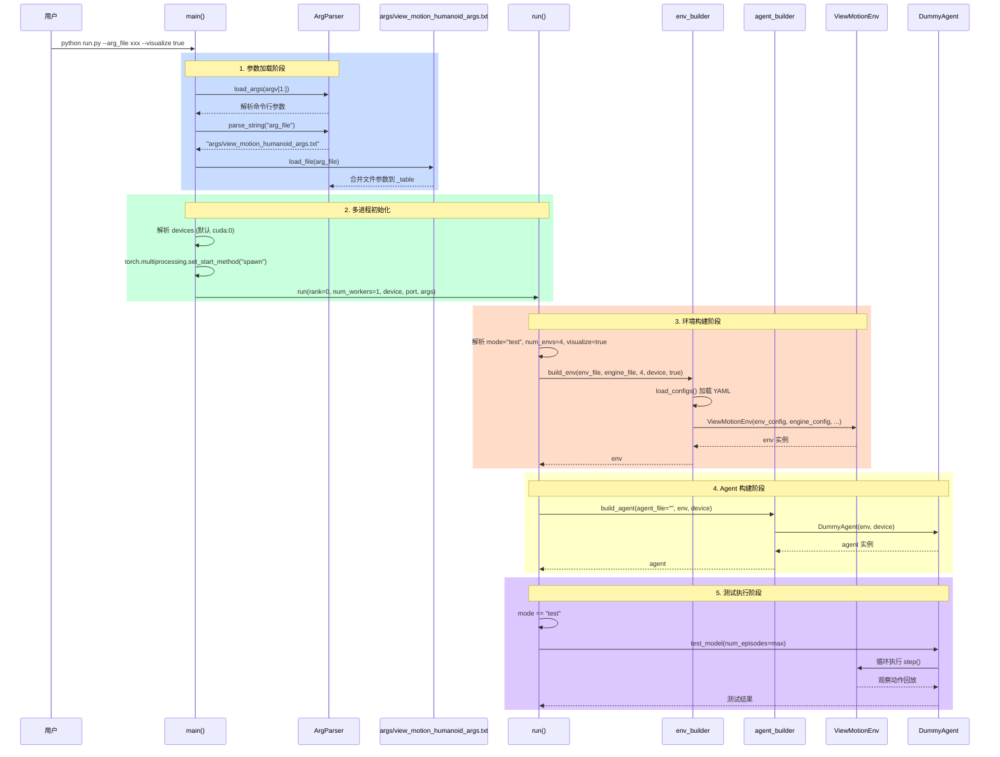
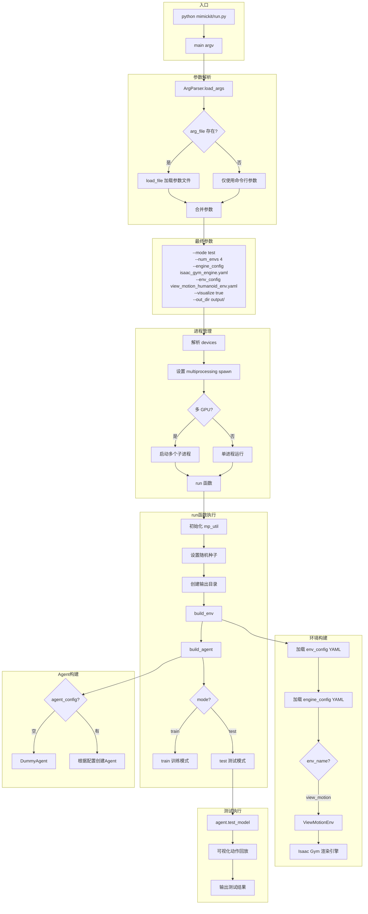
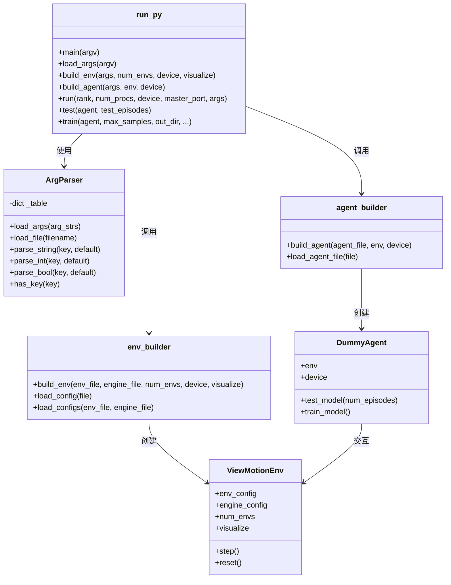
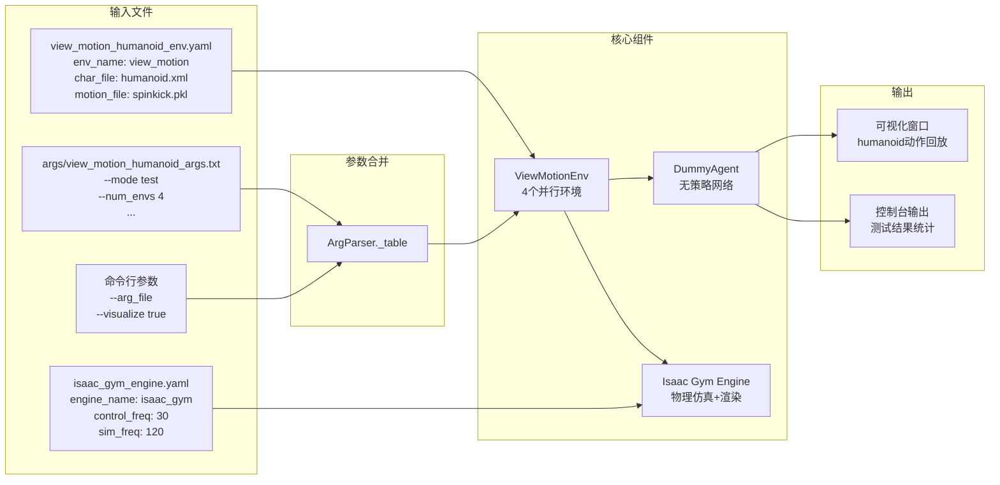

现在我已经了解了完整的运行流程。下面是详细的 Mermaid UML 图分析：

## 运行流程分析

### 1. 时序图 (Sequence Diagram)

### 2. 流程图 (Flowchart)

### 3. 类图 (Class Diagram)

### 4. 数据流图

## 关键流程总结

| 阶段 | 关键操作 | 涉及文件/模块 |
|------|----------|---------------|
| **1. 参数加载** | 命令行参数 + 文件参数合并 | `ArgParser`, `view_motion_humanoid_args.txt` |
| **2. 配置解析** | 加载环境和引擎 YAML | `env_builder.load_configs()` |
| **3. 环境构建** | 根据 `env_name=view_motion` 创建 `ViewMotionEnv` | `env_builder.build_env()` |
| **4. Agent 构建** | 无 `agent_config` → 创建 `DummyAgent` | `agent_builder.build_agent()` |
| **5. 测试执行** | `mode=test` → 调用 `agent.test_model()` | `run.test()` |
| **6. 可视化** | `visualize=true` → Isaac Gym 渲染动作回放 | Isaac Gym Engine |

这个命令的核心目的是：**在 Isaac Gym 仿真器中可视化查看 humanoid（人形机器人）执行 spinkick（旋转踢）动作的参考轨迹**。