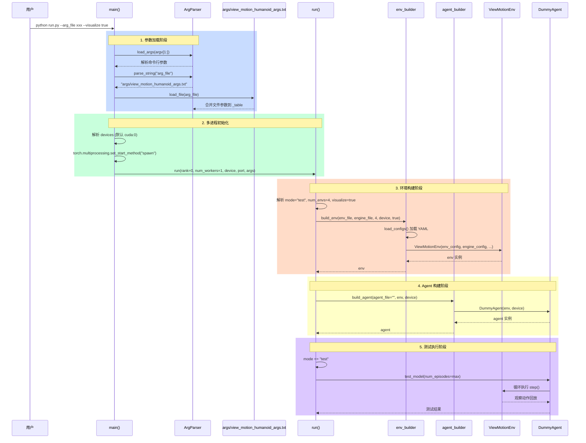
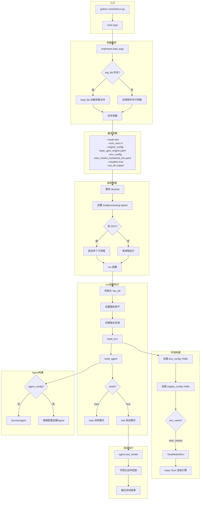
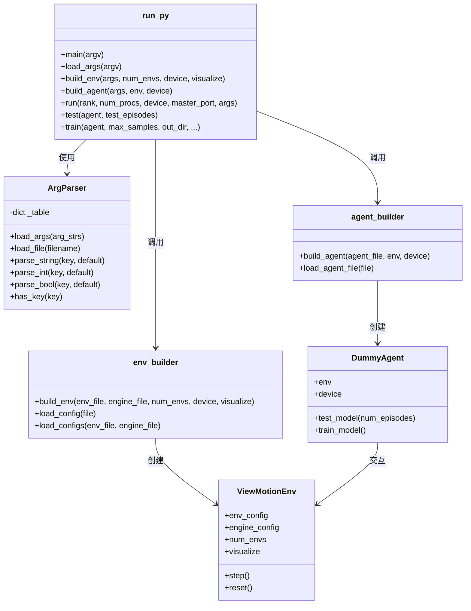
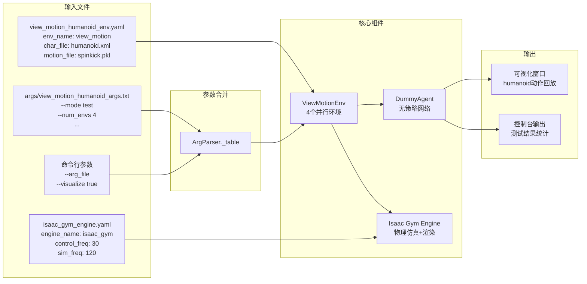
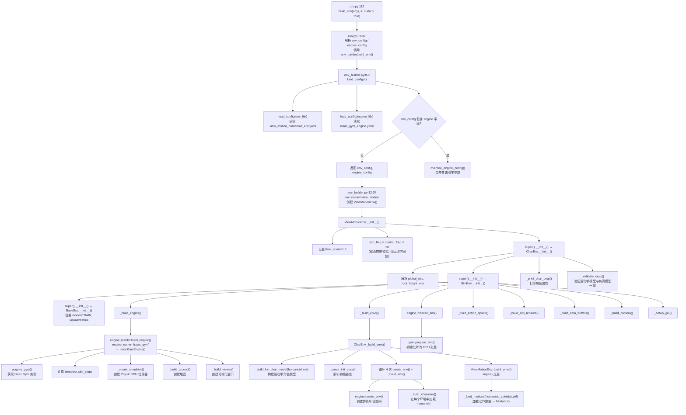
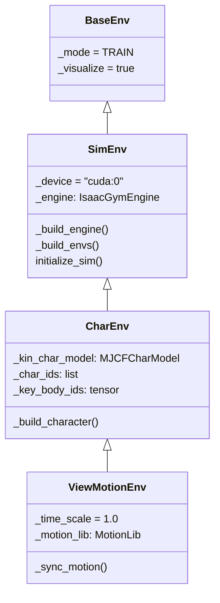
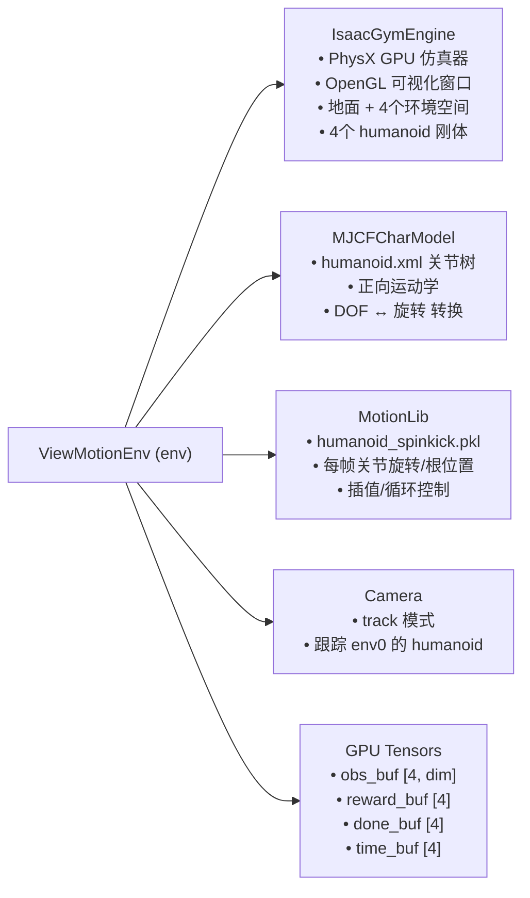
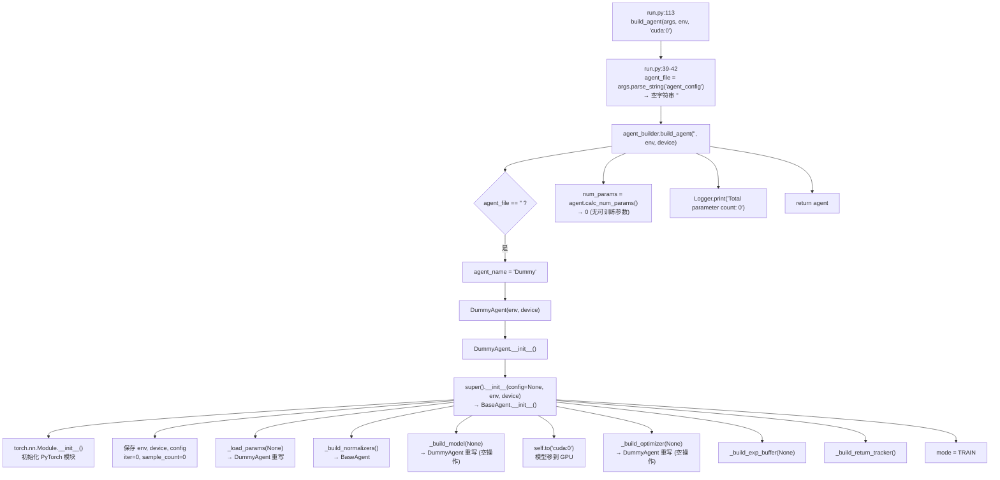
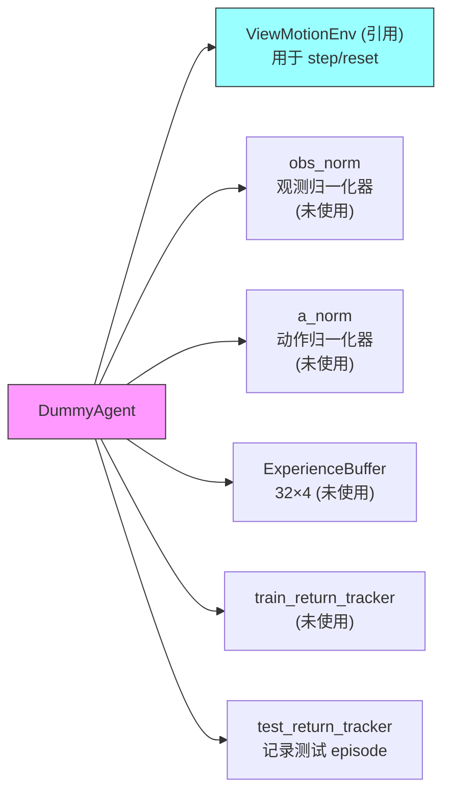

现在我已经了解了完整的运行流程。下面是详细的 Mermaid UML 图分析：

## 运行流程分析

### 1. 时序图 (Sequence Diagram)



### 2. 流程图 (Flowchart)



### 3. 类图 (Class Diagram)



### 4. 数据流图



## 关键流程总结

| 阶段 | 关键操作 | 涉及文件/模块 |
|------|----------|---------------|
| **1. 参数加载** | 命令行参数 + 文件参数合并 | `ArgParser`, `view_motion_humanoid_args.txt` |
| **2. 配置解析** | 加载环境和引擎 YAML | `env_builder.load_configs()` |
| **3. 环境构建** | 根据 `env_name=view_motion` 创建 `ViewMotionEnv` | `env_builder.build_env()` |
| **4. Agent 构建** | 无 `agent_config` → 创建 `DummyAgent` | `agent_builder.build_agent()` |
| **5. 测试执行** | `mode=test` → 调用 `agent.test_model()` | `run.test()` |
| **6. 可视化** | `visualize=true` → Isaac Gym 渲染动作回放 | Isaac Gym Engine |

这个命令的核心目的是：**在 Isaac Gym 仿真器中可视化查看 humanoid（人形机器人）执行 spinkick（旋转踢）动作的参考轨迹**。


## `env = build_env(args, num_envs, device, visualize)` 全链路解析

这一行代码触发了一个**深层调用链**，总共涉及 6 个类、4 层继承、约 20 个关键步骤。

### 整体调用链 Mermaid 图



---

### 分阶段详解

#### 第 1 阶段：参数提取 + 配置加载

```33:37:mimickit/run.py
def build_env(args, num_envs, device, visualize):
    env_file = args.parse_string("env_config")
    engine_file = args.parse_string("engine_config")
    env = env_builder.build_env(env_file, engine_file, num_envs, device, visualize)
    return env
```

```57:65:mimickit/envs/env_builder.py
def load_configs(env_file, engine_file):
    env_config = load_config(env_file)
    engine_config = load_config(engine_file)
    if ("engine" in env_config):
        env_engine_config = env_config["engine"]
        engine_config = override_engine_config(env_engine_config, engine_config)
    return env_config, engine_config
```

- 从 args 中取出两个 YAML 路径
- 加载并解析为字典：

| 配置文件 | 关键字段 |
|---------|---------|
| `view_motion_humanoid_env.yaml` | `env_name="view_motion"`, `char_file`, `motion_file`, `key_bodies`, `episode_length=20s` |
| `isaac_gym_engine.yaml` | `engine_name="isaac_gym"`, `control_mode="pos"`, `control_freq=30`, `sim_freq=120` |

---

#### 第 2 阶段：ViewMotionEnv 构造（4 层继承链）

构造顺序（由内到外触发 `super().__init__`）：



**执行顺序**（缩进表示调用深度）：

```
ViewMotionEnv.__init__()                          # view_motion_env.py:11
├── self._time_scale = 1.0                        # 动作回放速度
├── engine_config["sim_freq"] = 30                # ⚠ 关键! 强制 sim_freq = control_freq
│                                                  # 原来 sim_freq=120, 现在改为 30
│                                                  # 取消子步物理模拟 (sim_steps = 30/30 = 1)
│                                                  # 因为 view_motion 只做运动学回放, 不需要物理
│
└── CharEnv.__init__()                            # char_env.py:18
    ├── self._global_obs = False
    ├── self._root_height_obs = True
    │
    └── SimEnv.__init__()                         # sim_env.py:21
        ├── BaseEnv.__init__(visualize=True)       # 设置基础属性
        ├── self._device = "cuda:0"
        ├── self._episode_length = 20.0            # 秒
        │
        ├── _build_engine()                        # 【见第3阶段】
        ├── _build_envs()                          # 【见第4阶段】
        ├── engine.initialize_sim()                # 【见第5阶段】
        ├── _build_action_space()                  # 【见第6阶段】
        ├── _build_sim_tensors()                   # 【见第7阶段】
        ├── _build_data_buffers()                  # 【见第8阶段】
        ├── _build_camera()                        # 【见第9阶段】
        └── _setup_gui()                           # 【见第10阶段】
    
    ├── _print_char_prop()                         # 打印: DoFs 数, 总质量
    └── _validate_envs()                           # 验证仿真模型 == 运动学模型
```

---

#### 第 3 阶段：构建物理引擎

```46:86:mimickit/engines/isaac_gym_engine.py
class IsaacGymEngine(engine.Engine):
    def __init__(self, config, num_envs, device, visualize):
        self._gym = gymapi.acquire_gym()           # 获取 Isaac Gym C++ 实例
        // ... 计算时间步 ...
        self._sim = self._create_simulator(...)     # 创建 PhysX GPU 仿真器
        self._build_ground()                        # 创建地面平面
        if (visualize):
            self._build_viewer()                    # 创建 OpenGL 可视化窗口
```

| 操作 | 说明 |
|------|------|
| `acquire_gym()` | 获取 Isaac Gym 底层 C++ 接口 |
| `timestep = 1/30 ≈ 0.0333s` | 控制频率 30Hz |
| `sim_steps = 30/30 = 1` | 每个控制步仅 1 个物理步（ViewMotionEnv 强制修改后） |
| `_create_simulator()` | 创建 PhysX GPU 仿真器，设置重力、接触参数等 |
| `_build_ground()` | 添加地面碰撞平面 |
| `_build_viewer()` | 创建 OpenGL 渲染窗口 |

---

#### 第 4 阶段：构建环境和角色

```51:67:mimickit/envs/char_env.py
def _build_envs(self, env_config, num_envs):
    char_file = env_config["char_file"]
    self._build_kin_char_model(char_file)    # 解析 humanoid.xml → 运动学模型
    self._parse_init_pose(init_pose, ...)    # 初始姿态 (默认零姿态)
    for e in range(num_envs):                 # 循环 4 次
        env_id = self._engine.create_env()    # 创建仿真空间
        self._build_env(env_id, env_config)   # 加载角色到环境中
```

```19:24:mimickit/envs/view_motion_env.py
def _build_envs(self, env_config, num_envs):
    super()._build_envs(env_config, num_envs)  # 先执行上面的 CharEnv 逻辑
    motion_file = env_config["motion_file"]
    self._load_motions(motion_file)             # 加载动作数据
```

具体子步骤：

| 步骤 | 操作 | 产物 |
|------|------|------|
| 4a | `_build_kin_char_model("humanoid.xml")` | 解析 MuJoCo XML，构建 `MJCFCharModel`（关节树、自由度映射） |
| 4b | `_parse_init_pose()` | 初始根位置、朝向、关节角度（全零） |
| 4c | `create_env()` × 4 | 在 Isaac Gym 中创建 4 个 2.5m×2.5m 的仿真空间 |
| 4d | `_build_character()` × 4 | 在每个空间中加载 humanoid 关节体，**disable_motors=True**（因为只回放不控制） |
| 4e | `_load_motions("humanoid_spinkick.pkl")` | 加载动作数据 → `MotionLib`（帧序列、关节旋转、根轨迹） |

---

#### 第 5 阶段：初始化仿真张量

```108:112:mimickit/engines/isaac_gym_engine.py
def initialize_sim(self):
    self._gym.prepare_sim(self._sim)    # GPU 端分配所有刚体状态张量
    self._build_sim_tensors()            # 包装为 PyTorch 张量 (零拷贝)
    self._refresh_sim_tensors()          # 从 GPU 同步最新状态
```

这一步之后，所有刚体的位置、速度、关节角等都可以直接通过 PyTorch 张量高效访问。

---

#### 第 6 阶段：构建动作空间

```121:152:mimickit/envs/char_env.py
def _build_action_space(self):
    control_mode = self._engine.get_control_mode()  # "pos"
    dof_low, dof_high = self._engine.get_obj_dof_limits(0, char_id)
    low, high = self._build_action_bounds_pos(dof_low, dof_high)
    action_space = spaces.Box(low=low, high=high)
```

根据 `control_mode="pos"` 和关节限位，构建 `gymnasium.spaces.Box` 动作空间。

---

#### 第 7-8 阶段：构建数据缓冲区

| 缓冲区 | 形状 | 用途 |
|--------|------|------|
| `_env_ids` | `[4]` | 环境编号 [0,1,2,3] |
| `_reward_buf` | `[4]` | 每步奖励 |
| `_done_buf` | `[4]` | 是否结束 |
| `_timestep_buf` | `[4]` | 步数计数器 |
| `_time_buf` | `[4]` | 时间计数器（秒） |
| `_obs_buf` | `[4, obs_dim]` | 观测缓冲区 |
| `_key_body_ids` | `[5]` | head, right_hand, left_hand, right_foot, left_foot 的 body ID |
| `_ref_body_pos` | `[4, num_bodies, 3]` | 参考 body 位置（用于渲染关键点） |

---

#### 第 9-10 阶段：可视化设置

```347:363:mimickit/envs/char_env.py
def _build_camera(self, env_config):
    cam_mode = camera.CameraMode["track"]    # 跟踪模式
    self._camera = camera.Camera(mode=cam_mode, engine=self._engine,
                                 pos=cam_pos, target=cam_target,
                                 track_env_id=0, track_obj_id=char_id)
```

```220:233:mimickit/envs/sim_env.py
def _setup_gui(self):
    # ENTER 键: 暂停/播放切换
    self._engine.register_keyboard_callback("ENTER", toggle_play)
    # SPACE 键: 单步前进
    self._engine.register_keyboard_callback("SPACE", one_step)
```

---

### 最终产物

第 112 行执行完毕后，`env` 变量是一个 `ViewMotionEnv` 实例，内部包含：




已经掌握了完整的调用链。下面是详细解释：

---

## `agent = build_agent(args, env, device)` 全链路解析

### 整体调用链



---

### 第 1 步：参数提取 + Agent 类型判断

```39:42:mimickit/run.py
def build_agent(args, env, device):
    agent_file = args.parse_string("agent_config")
    agent = agent_builder.build_agent(agent_file, env, device)
    return agent
```

- 从 args 中查找 `agent_config`
- 当前的 `view_motion_humanoid_args.txt` 中**没有**这个参数，所以 `agent_file = ""`（默认空字符串）

```5:16:mimickit/learning/agent_builder.py
def build_agent(agent_file, env, device):
    if (agent_file is None or agent_file == ""):
        agent_name = "Dummy"
    // ...
    if (agent_name == "Dummy"):
        import learning.dummy_agent as dummy_agent
        agent = dummy_agent.DummyAgent(env=env, device=device)
```

- `agent_file` 为空 → `agent_name = "Dummy"` → 创建 `DummyAgent`

---

### 第 2 步：DummyAgent 构造（继承 BaseAgent → torch.nn.Module）

```8:11:mimickit/learning/dummy_agent.py
class DummyAgent(base_agent.BaseAgent):
    def __init__(self, env, device):
        super().__init__(None, env, device)
        return
```

传入 `config=None`，触发 `BaseAgent.__init__`：

```27:49:mimickit/learning/base_agent.py
class BaseAgent(torch.nn.Module):
    def __init__(self, config, env, device):
        super().__init__()              # ① torch.nn.Module 初始化
        self._env = env                 # ② 保存环境引用
        self._device = device           # ③ 保存设备
        self._iter = 0                  # ④ 训练迭代计数器
        self._sample_count = 0          # ⑤ 总样本计数器
        self._config = config           # ⑥ config = None
        self._load_params(config)       # ⑦ 加载超参数
        self._build_normalizers()       # ⑧ 构建归一化器
        self._build_model(config)       # ⑨ 构建神经网络
        self.to(self._device)           # ⑩ 移到 GPU
        self._build_optimizer(config)   # ⑪ 构建优化器
        self._build_exp_buffer(config)  # ⑫ 构建经验缓冲区
        self._build_return_tracker()    # ⑬ 构建回报追踪器
        self._mode = AgentMode.TRAIN    # ⑭ 模式设为 TRAIN
        self._curr_obs = None           # ⑮ 当前观测 (待 reset 填充)
        self._curr_info = None          # ⑯ 当前信息 (待 reset 填充)
```

每一步在 DummyAgent 中的具体行为：

| 步骤 | 方法 | DummyAgent 的行为 |
|------|------|------------------|
| ⑦ | `_load_params(None)` | **DummyAgent 重写**，硬编码默认参数（见下） |
| ⑧ | `_build_normalizers()` | **BaseAgent 执行**，构建观测归一化器和动作归一化器 |
| ⑨ | `_build_model(None)` | **DummyAgent 重写**，空操作 `return`，不创建任何网络 |
| ⑩ | `self.to("cuda:0")` | 将模块移到 GPU（实际没有参数可移） |
| ⑪ | `_build_optimizer(None)` | **DummyAgent 重写**，空操作 `return`，不创建优化器 |
| ⑫ | `_build_exp_buffer(None)` | **BaseAgent 执行**，创建长度 32 的经验缓冲区 |
| ⑬ | `_build_return_tracker()` | **BaseAgent 执行**，创建训练/测试回报追踪器 |

---

### 第 3 步：DummyAgent 重写的关键方法

#### `_load_params` — 硬编码超参数

```16:22:mimickit/learning/dummy_agent.py
    def _load_params(self, config):
        self._discount = 0.99
        self._iters_per_output = 100
        self._normalizer_samples = 10000
        self._test_episodes = 10
        self._steps_per_iter = 32
```

注意：这些参数在 `view_motion` 的 test 模式下**不会被使用**（它们是训练用的），真正起作用的是 `run.py:124` 中从 args 解析的 `test_episodes`。

#### `_decide_action` — 零动作策略

```27:41:mimickit/learning/dummy_agent.py
    def _decide_action(self, obs, info):
        num_envs = obs.shape[0]
        a_space = self._env.get_action_space()
        a_dtype = torch_util.numpy_dtype_to_torch(a_space.dtype)
        if (isinstance(a_space, spaces.Box)):
            a_dim = a_space.low.shape[0]
            a = torch.zeros([num_envs, a_dim], device=self._device, dtype=a_dtype)
        // ...
        return a, a_info
```

**永远返回全零动作张量**，形状为 `[4, dof_dim]`。在 `ViewMotionEnv` 中 `_apply_action()` 是空操作，所以这个零动作不会影响任何东西 — 角色姿态完全由 `_sync_motion()` 从动作文件驱动。

#### `_build_model` / `_update_model` — 空操作

```43:48:mimickit/learning/dummy_agent.py
    def _build_model(self, config):
        return

    def _update_model(self):
        info = dict()
        return info
```

不创建神经网络，不更新参数。

---

### 第 4 步：BaseAgent 执行的构建方法

#### `_build_normalizers()` — 观测和动作归一化器

```159:165:mimickit/learning/base_agent.py
    def _build_normalizers(self):
        obs_space = self._env.get_obs_space()     # 触发一次 env.reset() 获取观测维度
        self._obs_norm = normalizer.Normalizer(obs_space.shape, ...)
        self._a_norm = self._build_action_normalizer()
```

这一步会**首次调用 `env.reset()`** 来获取观测空间维度，创建两个归一化器：
- `_obs_norm`：观测归一化（均值/标准差追踪）
- `_a_norm`：动作归一化（根据动作空间上下界计算）

#### `_build_exp_buffer()` — 经验缓冲区

```201:206:mimickit/learning/base_agent.py
    def _build_exp_buffer(self, config):
        buffer_length = self._get_exp_buffer_length()  # DummyAgent 返回 32
        batch_size = self.get_num_envs()                # 4
        self._exp_buffer = experience_buffer.ExperienceBuffer(buffer_length=32, batch_size=4, ...)
```

创建一个 `32×4` 的经验缓冲区（虽然在 test 模式下不会被使用）。

#### `_build_return_tracker()` — 回报追踪器

```208:211:mimickit/learning/base_agent.py
    def _build_return_tracker(self):
        self._train_return_tracker = return_tracker.ReturnTracker(4, "cuda:0")
        self._test_return_tracker = return_tracker.ReturnTracker(4, "cuda:0")
```

创建两个追踪器（训练用 + 测试用），记录每个环境的累计奖励和 episode 计数。

---

### 第 5 步：参数统计 + 返回

```35:38:mimickit/learning/agent_builder.py
    num_params = agent.calc_num_params()
    Logger.print("Total parameter count: {}".format(num_params))
    return agent
```

```141:144:mimickit/learning/base_agent.py
    def calc_num_params(self):
        params = self.parameters()
        num_params = sum(p.numel() for p in params if p.requires_grad)
        return num_params
```

DummyAgent 没有任何神经网络，所以 `num_params = 0`。控制台输出：

```
Building Dummy agent
Total parameter count: 0
```

---

### 最终产物



### 对比：DummyAgent vs 真正的训练 Agent

| 特性 | DummyAgent (当前) | PPOAgent (训练时) |
|------|-------------------|-------------------|
| 神经网络 | 无 | Actor + Critic 网络 |
| 参数数量 | 0 | 数万~数百万 |
| 优化器 | 无 | Adam |
| `_decide_action()` | 返回全零 | 通过网络推理策略分布并采样 |
| `_update_model()` | 空操作 | PPO 梯度更新 |
| 用途 | 仅驱动环境循环，配合 ViewMotionEnv 回放动作 | 训练强化学习策略 |

DummyAgent 存在的意义就是**提供一个最轻量的 Agent 壳**，让 `test_model()` 的循环能跑起来，而实际的角色姿态完全由 `ViewMotionEnv._sync_motion()` 从动作文件驱动。