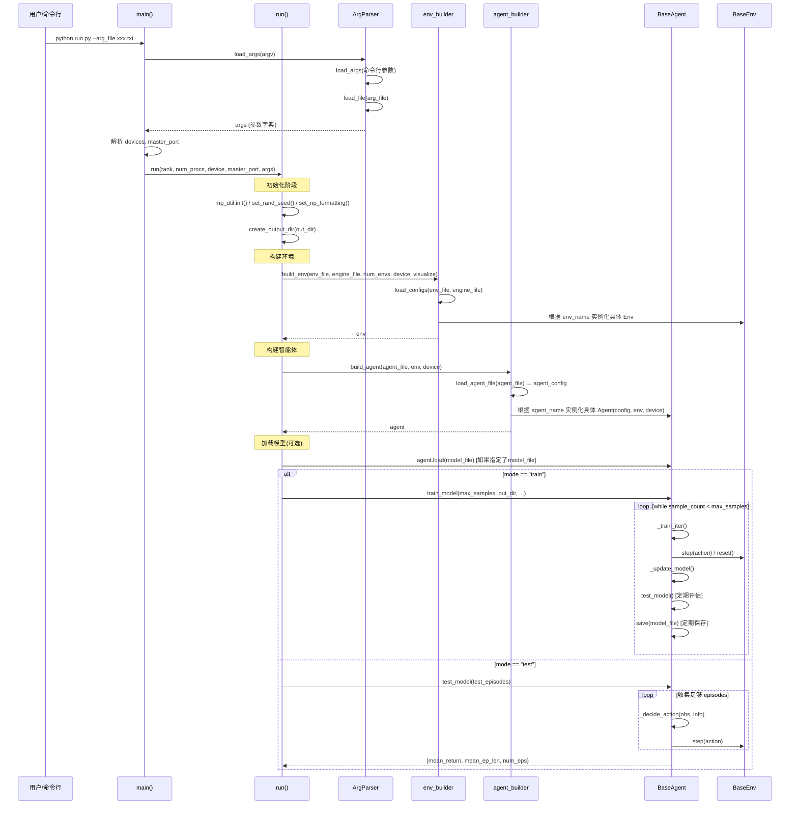
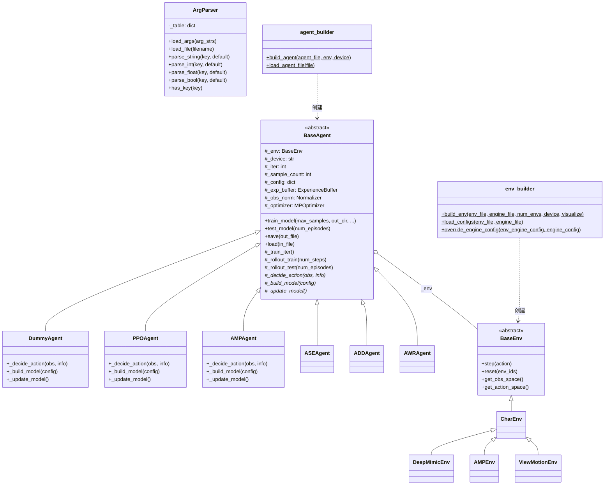
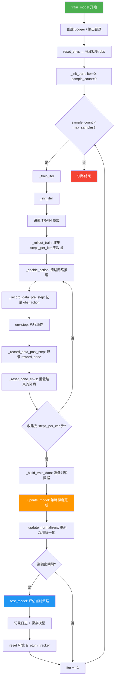
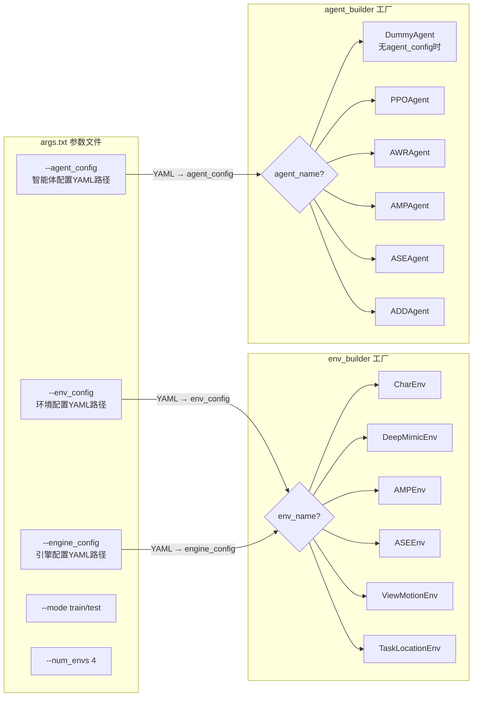

### 1. 总体流程（顺序图）

### 2. 类关系图

### 3. 训练循环详细流程

### 4. 配置文件与工厂模式映射

---

### 流程总结

| 阶段 | 入口函数 | 核心逻辑 |
|------|---------|---------|
| **load_args** | `run.py → load_args()` | `ArgParser` 先解析命令行 `--key value`，再加载 `arg_file` 文件补充参数，存入 `_table` 字典 |
| **build_env** | `run.py → build_env()` | 读取 `env_config` + `engine_config` 两个 YAML，根据 `env_name` 通过工厂模式创建对应的环境实例（如 `ViewMotionEnv`, `AMPEnv` 等） |
| **build_agent** | `run.py → build_agent()` | 读取 `agent_config` YAML，根据 `agent_name` 工厂创建智能体；无配置时默认 `DummyAgent`。Agent 初始化时自动构建 normalizer → model → optimizer → exp_buffer |
| **train** | `BaseAgent.train_model()` | 核心循环：`rollout_train`（收集数据） → `_build_train_data` → `_update_model`（策略更新） → 定期 `test_model` 评估并保存 |
| **test** | `BaseAgent.test_model()` | 切换到 TEST 模式，使用 `torch.no_grad()` 运行策略，收集足够 episodes 后统计 mean_return 等指标 |

**关键设计模式**：
- **工厂模式**：`env_builder` 和 `agent_builder` 都根据 YAML 配置中的名称字符串动态创建具体实例
- **模板方法**：`BaseAgent` 定义了训练/测试的骨架流程，子类只需实现 `_decide_action()`、`_build_model()`、`_update_model()` 三个抽象方法
- **多进程支持**：`main()` 通过 `torch.multiprocessing` 支持多 GPU 训练，每个进程独立调用 `run()`