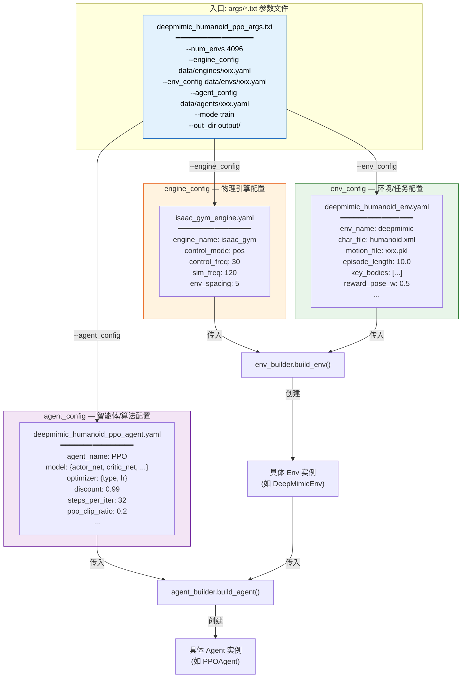
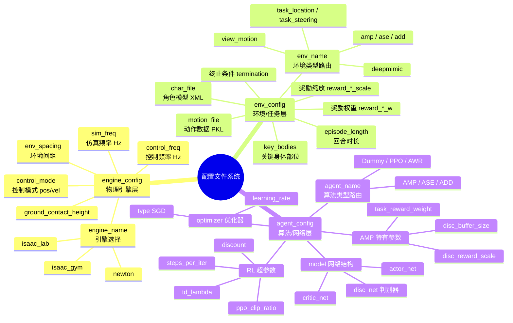
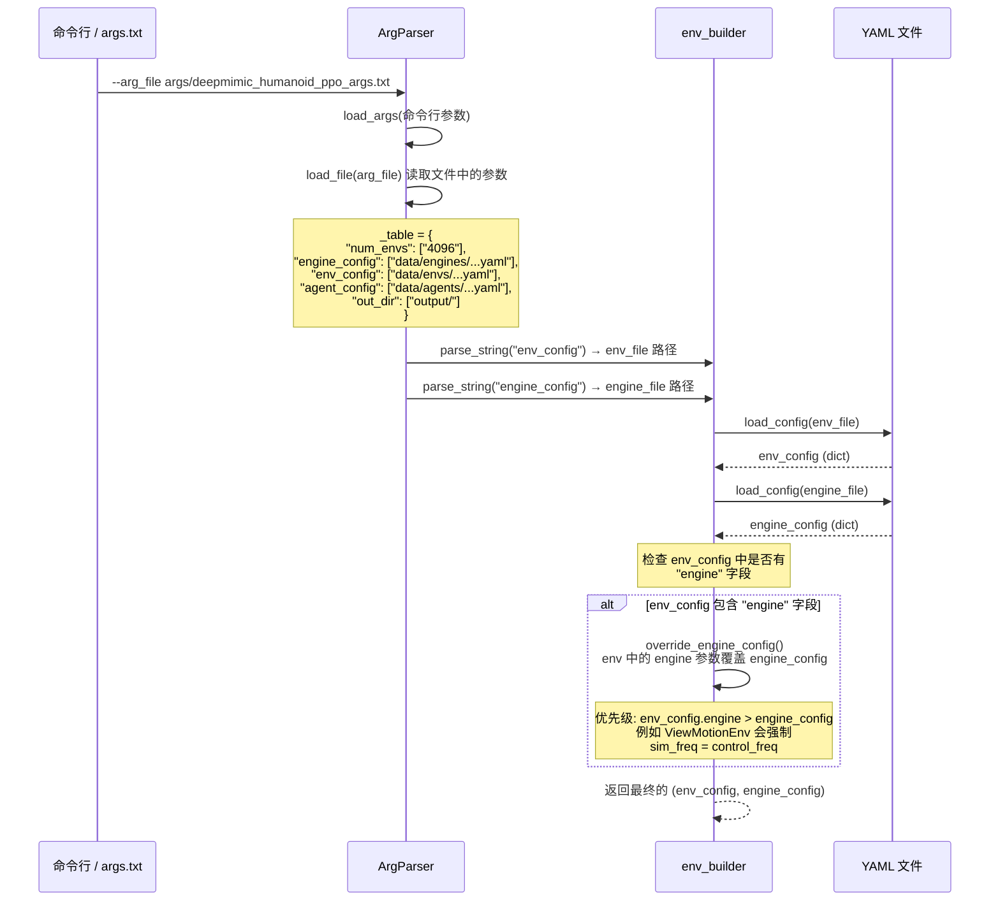
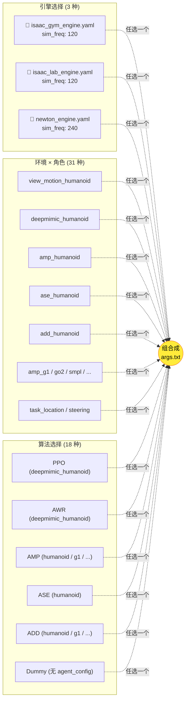

### 1. 配置文件的整体架构

### 2. 三类配置的职责划分

### 3. 配置加载与覆盖机制

### 4. 不同实验方案的配置组合

---

### 每个配置文件的字段详解

#### engine_config — 物理引擎配置

| 字段 | 类型 | 含义 | 示例 |
|------|------|------|------|
| `engine_name` | string | 物理引擎选择，决定用哪个仿真器 | `"isaac_gym"` / `"isaac_lab"` / `"newton"` |
| `control_mode` | string | 控制方式 | `"pos"` (位置控制) |
| `control_freq` | int | 控制频率 (Hz)，Agent 做决策的频率 | `30` |
| `sim_freq` | int | 仿真频率 (Hz)，物理模拟步进频率 | `120` (即每个控制步内仿真 4 次) |
| `env_spacing` | float | 多环境间的空间间距 (m) | `5` |
| `ground_contact_height` | float | 地面接触检测高度阈值 | `0.3` |

#### env_config — 环境/任务配置

| 字段 | 类型 | 含义 | 谁消费 |
|------|------|------|--------|
| `env_name` | string | **路由键**，决定创建哪个 Env 类 | `env_builder` |
| `char_file` | string | 角色 MJCF/XML 模型文件路径 | `CharEnv` |
| `motion_file` | string | 参考动作数据文件 | `ViewMotionEnv` / `DeepMimicEnv` 等 |
| `key_bodies` | list | 关键身体部位名称，用于奖励计算和可视化 | 各 Env |
| `contact_bodies` | list | 允许接触地面的身体部位 | `DeepMimicEnv` |
| `episode_length` | float | 回合最大时长 (秒) | `BaseEnv` |
| `reward_*_w` | float | 各奖励分量权重 | 各 Env |
| `reward_*_scale` | float | 各奖励分量缩放因子 | 各 Env |
| `init_pose` | list | 初始姿态 (根位置 + 关节角) | `CharEnv` |
| `engine` (可选) | dict | 覆盖 engine_config 的参数 | `env_builder.override_engine_config()` |

#### agent_config — 智能体/算法配置

| 字段 | 类型 | 含义 | 谁消费 |
|------|------|------|--------|
| `agent_name` | string | **路由键**，决定创建哪个 Agent 类 | `agent_builder` |
| `model.actor_net` | string | Actor 网络结构 | `BaseAgent._build_model()` |
| `model.critic_net` | string | Critic 网络结构 | `BaseAgent._build_model()` |
| `model.disc_net` | string | 判别器网络 (AMP 专属) | `AMPAgent` |
| `optimizer.type` | string | 优化器类型 | `MPOptimizer` |
| `optimizer.learning_rate` | float | 学习率 | `MPOptimizer` |
| `discount` | float | 折扣因子 γ | `BaseAgent` |
| `steps_per_iter` | int | 每次迭代采集步数 | `BaseAgent._rollout_train()` |
| `iters_per_output` | int | 每多少次迭代输出/评估一次 | `BaseAgent.train_model()` |
| `ppo_clip_ratio` | float | PPO 裁剪比率 | `PPOAgent` |
| `td_lambda` | float | GAE lambda 参数 | `PPOAgent` |
| `disc_*` | various | 判别器相关超参数 (AMP/ASE/ADD) | 对应 Agent |

### 核心设计理念

**三层解耦，自由组合**：配置系统将"用什么引擎仿真"、"仿真什么环境和任务"、"用什么算法训练"三个维度彻底分离。你可以像搭积木一样，通过修改 `args.txt` 中的三行路径来自由组合不同的引擎、环境和算法，而不需要修改任何代码。

**覆盖机制**：`env_config` 中可选的 `engine` 字段能够覆盖 `engine_config` 中的值（如 `ViewMotionEnv` 强制让 `sim_freq = control_freq`），这使得特殊环境可以对引擎参数做强制约束，同时保持通用引擎配置的复用性。