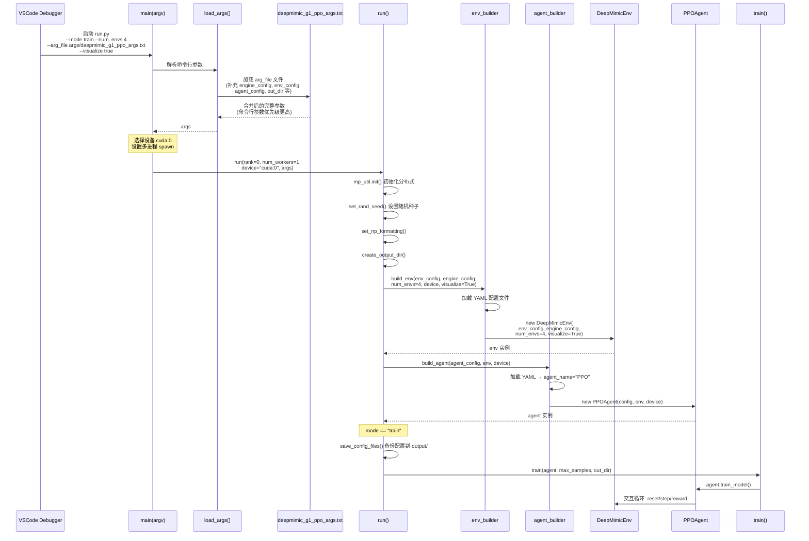
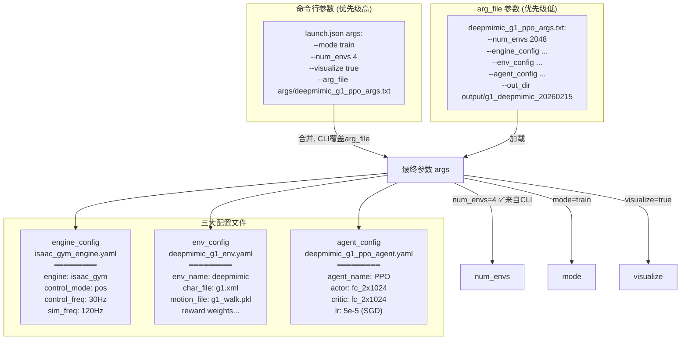
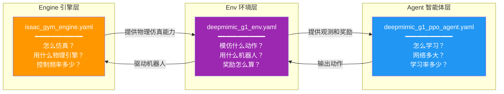
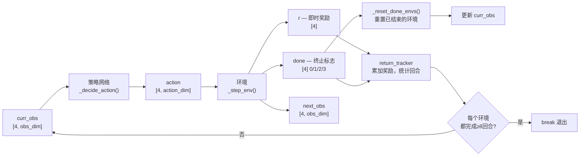

https://xbpeng.github.io/projects/DeepMimic/index.html
https://ar5iv.labs.arxiv.org/html/1804.02717?_immersive_translate_auto_translate=1
https://xbpeng.github.io/projects/DeepMimic/DeepMimic_2018.pdf
https://github.com/xbpeng/MimicKit/blob/main/docs/README_DeepMimic.md

# 《DeepMimic》论文

在《DeepMimic》论文的第 4 部分（Background），作者设定了标准**强化学习（RL）**问题的数学框架，用于训练物理仿真角色。以下是该部分公式的详细解释：

### 1. 期望回报（Expected Return）

角色的目标是通过学习最优参数 $\theta^*$ 来最大化其**期望回报 $J(\theta)$**： $$J(\theta) = \mathbb{E}_{\tau \sim p_{\theta}(\tau)} \left[ \sum_{t=0}^{T} \gamma^t r_t \right]$$

- **$J(\theta)$**：表示在策略参数为 $\theta$ 时，智能体在一个回合内能获得的平均总奖励。
- **$\mathbb{E}_{\tau \sim p_{\theta}(\tau)}$**：表示对所有可能的**轨迹（Trajectory）$\tau$** 求期望。
- **$\sum_{t=0}^{T} \gamma^t r_t$**：这是轨迹的回报总和。其中 $r_t$ 是第 $t$ 步的标量奖励，反映了该动作的优劣。
- **$\gamma \in$**：**折扣因子（Discount Factor）**，用于确保在无限时长的情况下回报依然有限，同时也体现了对即时奖励的偏好。

### 2. 轨迹概率分布（Trajectory Distribution）

轨迹 $\tau$ 是由状态和动作组成的序列 $(s_0, a_0, s_1, \dots, s_T)$，其分布由下式诱导： $$p_{\theta}(\tau) = p(s_0) \prod_{t=0}^{T-1} p(s_{t+1}|s_t, a_t) \pi_{\theta}(a_t|s_t)$$

- **$p(s_0)$**：初始状态分布。
- **$p(s_{t+1}|s_t, a_t)$**：**环境动力学（Dynamics）**，即在当前状态执行某动作后转移到下一状态的概率。
- **$\pi_{\theta}(a_t|s_t)$**：**参数化策略**，即在给定状态下选择动作 $a$ 的概率分布。

### 3. 策略梯度（Policy Gradient）

为了优化参数 $\theta$，作者使用了策略梯度方法，通过对期望回报求梯度来更新参数： $$\nabla_{\theta} J(\theta) = \mathbb{E}_{s_t \sim d_{\theta}(s_t), a_t \sim \pi_{\theta}(a_t|s_t)} \left[ \nabla_{\theta} \log(\pi_{\theta}(a_t|s_t)) \mathcal{A}_t \right]$$

- **$\nabla_{\theta} J(\theta)$**：期望回报相对于参数 $\theta$ 的梯度。
- **$d_{\theta}(s_t)$**：在策略 $\pi_{\theta}$ 下的状态分布。
- **$\log(\pi_{\theta}(a_t|s_t))$**：动作概率的对数，梯度运算会沿此方向调整动作概率。
- **$\mathcal{A}_t$**：**优势函数（Advantage Function）**。

### 4. 优势函数与价值函数（Advantage and Value Functions）

优势函数用于衡量在特定状态下采取某个动作比平均水平好多少： $$\mathcal{A}_t = R_t - V(s_t)$$

- **$R_t = \sum_{l=0}^{T-t} \gamma^l r_{t+l}$**：从时间 $t$ 开始到回合结束的**实际折扣回报**。
- **$V(s_t)$**：**价值函数**，它估计了从状态 $s_t$ 开始遵循当前策略所能获得的平均预期回报： $$V(s_t) = \mathbb{E} [R_t | \pi_{\theta}, s_t]$$

**核心逻辑**：策略梯度的作用是**增加**那些导致比预期回报更高（$\mathcal{A}_t > 0$）的动作的可能性，同时**减少**那些回报低于预期（$\mathcal{A}_t < 0$）的动作的可能性。

在本文的具体实现中，作者采用了**近端策略优化算法（PPO）**，并结合 **TD($\lambda$)** 训练价值函数，使用**广义优势估计（GAE($\lambda$)）**来计算梯度所需的优势值。

如果您需要更深入的公式推导或想了解这些公式在 PPO 算法中是如何具体变形的，我可以为您生成一份**定制报告**。

### $\theta$ 和 $\psi$ 分别是什么参数？

根据提供的源代码，在《DeepMimic》的算法框架中，$\theta$ 和 $\psi$ 分别代表两个不同神经网络的参数：

- **$\theta$ 是策略网络（Policy Network） $\pi_{\theta}$ 的参数**：
    
    - **功能**：策略网络负责将智能体观察到的状态 $s$（以及目标 $g$）映射到具体的**动作分布**上。
    - **优化目标**：强化学习的目标是找到最优参数 $\theta^*$，以最大化角色的**期望回报** $J(\theta)$。在更新时，通过策略梯度来调整这些参数，从而增加高回报动作出现的可能性。
- **$\psi$ 是价值函数网络（Value Function Network） $V_{\psi}$ 的参数**：
    
    - **功能**：价值网络用于**估计平均回报**，即预测从当前状态 $s$ 开始并遵循当前策略所能获得的长期收益。
    - **作用**：在训练过程中，价值函数通过预测值 $V(s_t)$ 来帮助计算**优势函数 $\mathcal{A}_t$**，从而减小梯度估计的方差，使策略更新更加稳定。

**简而言之，$\theta$ 决定角色“怎么做”（动作），而 $\psi$ 负责判断当前处境“有多好”（评估）。**

### TD(λ) and GAE(λ) 是什么？

在《DeepMimic》的训练过程中，**TD($\lambda$)** 和 **GAE($\lambda$)** 是两个至关重要的“平衡工具”，用于让神经网络（价值网络和策略网络）学得更稳、更快。

以下是通俗易懂的解释：

#### 1. TD($\lambda$)：更聪明地“估分”

TD($\lambda$) 主要用于训练**价值函数（Value Function）**，即评估一个状态“有多好”。

- **面临的难题（偏差与方差的权衡）**：
    - **只看一步 (TD(0))**：就像考试只看下一道题的对错。优点是很快就能得到反馈（方差低），缺点是看不远，容易对长远结果产生误判（偏差大）。
    - **看完整场 (Monte-Carlo)**：直到角色跳完整个舞或摔倒才给分。优点是很真实（无偏差），但因为一整套动作中随机因素太多，得分波动极大，网络很难学（方差高）。
- **TD($\lambda$) 的做法**：它是一个**指数加权平均值**。它不是只看 1 步或只看最后一步，而是把看 1 步、2 步、... 到 $n$ 步的结果都按比例混合在一起。
- **通俗比喻**：评价一个运动员的表现，既看他当下的动作（短视），也参考他整场比赛的最终得分（长远），TD($\lambda$) 负责调节这两者的**权重比例**。

#### 2. GAE($\lambda$)：更稳定地“改进”

GAE 全称是**广义优势估计（Generalized Advantage Estimator）**，主要用于更新**策略网络（Policy Network）**。

- **核心作用**：它用来计算**优势值（Advantage, $\mathcal{A}_t$）**。优势值告诉角色：“你刚才那个动作，比你平时的平均水平好（或差）多少？”。
- **为什么需要它**：如果只用实际得分来训练，训练过程会非常不稳定，角色可能因为一次偶然的成功或失败而产生错误的学习方向。
- **它的妙处**：GAE($\lambda$) 采用了与 TD($\lambda$) 类似的技巧，通过引入 $\lambda$ 参数来平衡优势估计的准确性和稳定性。它能有效**减小梯度的噪声（方差）**，让角色在学习后空翻、侧踢等高难度动作时，更新步调更加平稳。

#### 总结

- **TD($\lambda$)**：让**价值网络**对环境的“打分”更精准。
- **GAE($\lambda$)**：让**策略网络**在改进动作时不会因为偶尔的意外而“跑偏”。
- 在本文中，作者将 $\lambda$ 设置为 **0.95**，这是为了在保证学习速度的同时，尽可能降低训练的波动。


# MimicKit DeepMimic - g1_walk

```JSON
		{
            "name": "MimicKit: 训练 (Train)",
            "type": "python",
            "request": "launch",
            "program": "${workspaceFolder}/mimickit/run.py",
            "console": "integratedTerminal",
            "justMyCode": true,
            "stopOnEntry": true,
            "python": "${userHome}/miniconda3/envs/env_mimickit_isaacgym/bin/python",
            "cwd": "${workspaceFolder}",
            "env": {
                "LD_LIBRARY_PATH": "${userHome}/miniconda3/envs/env_mimickit_isaacgym/lib:${env:LD_LIBRARY_PATH}"
            },
            "args": [
                "--mode", "train",
                "--num_envs", "4096",
                "--arg_file", "args/deepmimic_g1_ppo_args.txt",
                "--visualize", "false"
            ]
        }
```

```bash
tensorboard --logdir /home/chong/Desktop/Project/RobotMimic/MimicKit/output
```

```JSON
		{
            "name": "MimicKit: 测试 (Test)",
            "type": "python",
            "request": "launch",
            "program": "${workspaceFolder}/mimickit/run.py",
            "console": "integratedTerminal",
            "justMyCode": true,
            "stopOnEntry": false,
            "python": "${userHome}/miniconda3/envs/env_mimickit_isaacgym/bin/python",
            "cwd": "${workspaceFolder}",
            "env": {
                "LD_LIBRARY_PATH": "${userHome}/miniconda3/envs/env_mimickit_isaacgym/lib:${env:LD_LIBRARY_PATH}"
            },
            "args": [
                "--mode", "test",
                "--num_envs", "8",
                "--arg_file", "args/deepmimic_g1_ppo_args.txt",
                "--visualize", "true",
                "--model_file", "output/g1_deepmimic_20260215/model.pt"
            ]
        }
```

# MimicKit DeepMimic - g1_walk 理解

现在我已经掌握了完整的运行逻辑，下面用 Mermaid UML 图来帮你理解。

---

## 运行逻辑概览

选中的 `launch.json` 配置会启动 `mimickit/run.py`，传入参数 `--mode train --num_envs 4 --arg_file args/deepmimic_g1_ppo_args.txt --visualize true`。以下是完整的运行流程：

### 1. 整体调用流程（时序图）



### 2. 参数合并与覆盖关系（类图/结构图）



### 3. 核心构建流程（流程图）

```mermaid
flowchart TB
    START["VSCode 启动调试<br/>python mimickit/run.py"] --> PARSE["解析参数<br/>load_args(argv)"]
    PARSE --> ARGFILE{"arg_file<br/>存在?"}
    ARGFILE -->|是| LOAD_FILE["加载 deepmimic_g1_ppo_args.txt<br/>合并到 args (CLI参数优先)"]
    ARGFILE -->|否| SKIP["跳过"]
    LOAD_FILE --> DEVICE
    SKIP --> DEVICE

    DEVICE["选择设备 devices=[cuda:0]<br/>设置 multiprocessing spawn"] --> FORK{"num_workers<br/>> 1?"}
    FORK -->|是| MP["启动多进程 worker"]
    FORK -->|否| SINGLE["单进程执行"]
    MP --> RUN
    SINGLE --> RUN

    RUN["run(rank, num_workers, device, args)"] --> INIT["初始化:<br/>1. mp_util.init()<br/>2. set_rand_seed()<br/>3. set_np_formatting()<br/>4. create_output_dir()"]

    INIT --> BUILD_ENV["build_env()"]
    BUILD_ENV --> LOAD_YAML["加载 YAML 配置:<br/>deepmimic_g1_env.yaml<br/>isaac_gym_engine.yaml"]
    LOAD_YAML --> ENV_MATCH{"env_name?"}
    ENV_MATCH -->|deepmimic| CREATE_ENV["创建 DeepMimicEnv<br/>num_envs=4, visualize=True<br/>引擎: IsaacGym<br/>角色: G1 机器人<br/>动作: g1_walk.pkl"]

    CREATE_ENV --> BUILD_AGENT["build_agent()"]
    BUILD_AGENT --> AGENT_MATCH{"agent_name?"}
    AGENT_MATCH -->|PPO| CREATE_AGENT["创建 PPOAgent<br/>Actor: fc_2layers_1024units<br/>Critic: fc_2layers_1024units<br/>Optimizer: SGD, lr=5e-5"]

    CREATE_AGENT --> MODE{"mode?"}
    MODE -->|train| SAVE_CFG["save_config_files()<br/>备份配置到 output/"]
    MODE -->|test| TEST["test(agent, test_episodes)"]
    SAVE_CFG --> TRAIN["train(agent, max_samples, out_dir)<br/>━━━━━━━━━━━━━━━<br/>agent.train_model()<br/>PPO 训练循环"]

    style START fill:#4CAF50,color:white
    style TRAIN fill:#2196F3,color:white
    style TEST fill:#FF9800,color:white
    style CREATE_ENV fill:#9C27B0,color:white
    style CREATE_AGENT fill:#E91E63,color:white
```



---

## 关键要点总结

1. **参数优先级**：命令行参数 (`--num_envs 4`) 会覆盖 arg_file 中的值 (`--num_envs 2048`)，所以实际只会创建 **4 个**并行环境（而非 2048 个），这是调试友好的配置。

2. **三层配置体系**：
   - **Engine** (`isaac_gym_engine.yaml`)：物理仿真引擎配置 — IsaacGym, 位控模式, 120Hz 仿真 / 30Hz 控制
   - **Env** (`deepmimic_g1_env.yaml`)：环境配置 — DeepMimic 算法, G1 机器人, 步行动作参考, 奖励权重
   - **Agent** (`deepmimic_g1_ppo_agent.yaml`)：智能体配置 — PPO 算法, 双层 1024 单元全连接网络

3. **核心流程**：`解析参数 → 构建环境(DeepMimicEnv) → 构建智能体(PPOAgent) → 训练循环(agent.train_model())`

4. **`stopOnEntry: true`** 表示调试器会在程序入口处暂停，方便你单步调试。

这三个文件我在之前的分析中已经读取过，下面直接为你详细解析每个配置文件的作用。

---

## 1. Engine 配置：`data/engines/isaac_gym_engine.yaml`

```1:8:data/engines/isaac_gym_engine.yaml
engine_name: "isaac_gym"
    
control_mode: "pos"
control_freq: 30
sim_freq: 120
env_spacing: 5
    
ground_contact_height: 0.3
```

**作用**：配置**物理仿真引擎**的底层参数，决定"仿真世界如何运转"。

| 参数 | 值 | 含义 |
|---|---|---|
| `engine_name` | `isaac_gym` | 使用 NVIDIA IsaacGym 作为物理仿真引擎 |
| `control_mode` | `pos` | **位置控制**模式（PD控制器跟踪目标关节角度），而非力矩控制 |
| `control_freq` | `30` | 控制策略的执行频率 — 每秒发送 **30 次**动作指令 |
| `sim_freq` | `120` | 物理仿真步进频率 — 每秒仿真 **120 步**（即每次控制之间仿真 4 步，提高物理精度） |
| `env_spacing` | `5` | 多个并行环境之间的间距 — **5 米**，避免机器人相互干扰 |
| `ground_contact_height` | `0.3` | 地面接触检测高度阈值 — **0.3 米**以下视为与地面接触 |

**一句话总结**：这个文件告诉系统"用什么物理引擎、怎么控制机器人、仿真精度多高"。

---

## 2. Env 配置：`data/envs/deepmimic_g1_env.yaml`

```1:41:data/envs/deepmimic_g1_env.yaml
env_name: "deepmimic"

char_file: "data/assets/g1/g1.xml"
camera_mode: "track"

episode_length: 10.0 # seconds
global_obs: True
root_height_obs: True
pose_termination: True
pose_termination_dist: 1.0 # m
enable_phase_obs: False
enable_tar_obs: True
num_phase_encoding: 4
tar_obs_steps: [1, 2, 3]
rand_reset: True
zero_center_action: True
log_tracking_error: False

ref_char_offset: [2.0, 0.0, 0.0] # m
init_pose: [0, 0, 0.8, 0, 0, 0, 0, 0, 0, 0, 0, 0, 0, 0, 0, 0, 0, 0, 0, 0, 0, 0, 0, 0, 1.57, 0, 0, 0, 0, 0, 0, 1.57, 0, 0, 0]

enable_early_termination: True
key_bodies: ["left_ankle_roll_link", "right_ankle_roll_link", "head_link", "left_wrist_yaw_link", "right_wrist_yaw_link"]
contact_bodies: ["left_knee_link", "left_ankle_pitch_link", "left_ankle_roll_link", "right_knee_link", "right_ankle_pitch_link", "right_ankle_roll_link"]
#contact_bodies: ["left_knee_link", "left_ankle_pitch_link", "left_ankle_roll_link", "right_knee_link", "right_ankle_pitch_link", "right_ankle_roll_link", "left_elbow_link", "left_wrist_roll_link", "left_wrist_pitch_link", "left_wrist_yaw_link", "right_elbow_link", "right_wrist_roll_link", "right_wrist_pitch_link", "right_wrist_yaw_link"] # cartwheel

motion_file: "data/motions/g1/g1_walk.pkl"

joint_err_w: [1.0, 1.0, 1.0, 0.6, 0.5, 0.5, 1.0, 1.0, 1.0, 0.6, 0.5, 0.5, 1.0, 1.0, 1.0, 0.0, 1.0, 1.0, 1.0, 0.6, 0.5, 0.5, 0.5, 1.0, 1.0, 1.0, 0.6, 0.5, 0.5, 0.5]

reward_pose_w: 0.5
reward_vel_w: 0.1
reward_root_pose_w: 0.15
reward_root_vel_w: 0.1
reward_key_pos_w: 0.15

reward_pose_scale: 0.25
reward_vel_scale: 0.01
reward_root_pose_scale: 5.0
reward_root_vel_scale: 1.0
reward_key_pos_scale: 10.0
```

**作用**：配置**强化学习环境**的所有细节，决定"机器人在什么任务场景下学习"。

按功能模块拆解：

### 基本设置
| 参数 | 值 | 含义 |
|---|---|---|
| `env_name` | `deepmimic` | 使用 DeepMimic 动作模仿算法环境 |
| `char_file` | `g1.xml` | **宇树 G1 人形机器人**的 MJCF/URDF 模型文件 |
| `camera_mode` | `track` | 摄像机跟踪机器人移动 |
| `motion_file` | `g1_walk.pkl` | **参考动作数据** — G1 的步行动作捕捉/轨迹文件 |

### 观测空间 (Observation)
| 参数 | 值 | 含义 |
|---|---|---|
| `global_obs` | `True` | 使用全局坐标系下的观测 |
| `root_height_obs` | `True` | 观测中包含根节点(骨盆)高度 |
| `enable_phase_obs` | `False` | 不包含相位信息观测 |
| `enable_tar_obs` | `True` | 包含**目标动作观测**（未来参考姿态） |
| `tar_obs_steps` | `[1, 2, 3]` | 提供未来 1/2/3 步的目标姿态作为观测 |

### 回合控制 (Episode)
| 参数 | 值 | 含义 |
|---|---|---|
| `episode_length` | `10.0` | 每个回合最长 **10 秒** |
| `rand_reset` | `True` | 重置时随机选择参考动作的起始时刻（而非总从头开始） |
| `enable_early_termination` | `True` | 允许提前终止（如摔倒时） |
| `pose_termination` | `True` | 姿态偏差过大时终止 |
| `pose_termination_dist` | `1.0` | 姿态偏差超过 **1 米**时提前终止 |

### 身体部位定义
| 参数 | 含义 |
|---|---|
| `key_bodies` | 脚踝、头部、手腕 — 奖励函数中重点关注的**关键部位** |
| `contact_bodies` | 膝盖、脚踝 — 允许与地面接触的**合法接触部位** |

### 奖励函数 (Reward) — DeepMimic 的核心

**权重**（各项奖励的重要性占比，总和 = 1.0）：

| 奖励项 | 权重 | 含义 |
|---|---|---|
| `reward_pose_w` | **0.50** | 关节姿态匹配（最重要） |
| `reward_root_pose_w` | 0.15 | 根节点位姿匹配 |
| `reward_key_pos_w` | 0.15 | 关键部位位置匹配 |
| `reward_vel_w` | 0.10 | 关节速度匹配 |
| `reward_root_vel_w` | 0.10 | 根节点速度匹配 |

**scale** 参数控制各项奖励对误差的敏感度（scale 越大 → 对误差的惩罚越狠）。

**一句话总结**：这个文件定义了"G1 机器人在 IsaacGym 中模仿步行动作的完整任务——观测什么、奖励什么、何时终止"。

---

## 3. Agent 配置：`data/agents/deepmimic_g1_ppo_agent.yaml`

```1:30:data/agents/deepmimic_g1_ppo_agent.yaml
agent_name: "PPO"

model:
  actor_net: "fc_2layers_1024units"
  actor_init_output_scale: 0.01
  actor_std_type: "FIXED"
  action_std: 0.05
  
  critic_net: "fc_2layers_1024units"

optimizer:
    type: "SGD"
    learning_rate: 5e-5

discount: 0.99
steps_per_iter: 32
iters_per_output: 100
test_episodes: 32
normalizer_samples: 100000000

update_epochs: 5
batch_size: 4
td_lambda: 0.95
ppo_clip_ratio: 0.2
norm_adv_clip: 4.0
action_bound_weight: 10.0
action_entropy_weight: 0.0
action_reg_weight: 0.0
critic_loss_weight: 1.0
```

**作用**：配置**强化学习算法（PPO）和神经网络**，决定"智能体如何学习"。

### 网络架构 (Model)
| 参数 | 值 | 含义 |
|---|---|---|
| `actor_net` | `fc_2layers_1024units` | Actor 网络 — **2 层全连接，每层 1024 个神经元** |
| `critic_net` | `fc_2layers_1024units` | Critic 网络 — 同样结构 |
| `actor_init_output_scale` | `0.01` | Actor 输出层初始化权重很小，保证训练初期动作幅度小 |
| `actor_std_type` | `FIXED` | 动作方差**固定**（不随训练更新） |
| `action_std` | `0.05` | 固定的动作标准差 — **0.05**（探索幅度很小，适合精细动作模仿） |

### 优化器
| 参数 | 值 | 含义 |
|---|---|---|
| `type` | `SGD` | 使用随机梯度下降优化器 |
| `learning_rate` | `5e-5` | 学习率 **0.00005**（非常保守，保证训练稳定） |

### PPO 超参数
| 参数 | 值 | 含义 |
|---|---|---|
| `discount` | `0.99` | 折扣因子 γ — 高度重视长期回报 |
| `td_lambda` | `0.95` | GAE 的 λ 参数 — 在偏差和方差间折中 |
| `ppo_clip_ratio` | `0.2` | PPO 剪切比例 — 限制策略更新幅度 |
| `update_epochs` | `5` | 每批数据重复训练 **5 轮** |
| `batch_size` | `4` | Mini-batch 大小为 4 |
| `steps_per_iter` | `32` | 每次迭代收集 **32 步**经验数据 |

### 损失函数权重
| 参数 | 值 | 含义 |
|---|---|---|
| `action_bound_weight` | `10.0` | 动作越界惩罚权重（强制动作在合理范围内） |
| `action_entropy_weight` | `0.0` | 不鼓励探索（熵正则化关闭） |
| `action_reg_weight` | `0.0` | 无动作正则化 |
| `critic_loss_weight` | `1.0` | Critic 损失权重 |

**一句话总结**：这个文件定义了"用 PPO 算法、双层1024全连接网络、SGD 优化器来训练策略，动作探索极小(std=0.05)，学习率很低(5e-5)——稳扎稳打地学习精确的动作模仿"。

---

## 三者的关系



简单来说：**Engine** 是底层物理世界，**Env** 在其上定义了"模仿步行"的任务，**Agent** 是在这个任务中学习的 PPO 大脑。三者自底向上，协同完成"G1 机器人学习步行"这一目标。

## def _rollout_test(self, num_episodes) 

mimickit/learning/base_agent.py
### 第 299 行

```python
action, action_info = self._decide_action(self._curr_obs, self._curr_info)
```

| 参数                | 形状                       | 含义                                    |
| ----------------- | ------------------------ | ------------------------------------- |
| `self._curr_obs`  | `[num_envs, obs_dim]`    | 当前所有并行环境的**观测向量**（包含机器人关节角度、速度、目标姿态等） |
| `self._curr_info` | `dict`                   | 当前环境的**附加信息**（辅助数据，如相位等）              |
| `action`          | `[num_envs, action_dim]` | 策略网络输出的**动作向量**（每个关节的目标位置偏移量）         |
| `action_info`     | `dict`                   | 动作的**附加信息**（如动作分布的 log_prob 等，测试时不使用） |

---

### 第 301 行

```python
next_obs, r, done, next_info = self._step_env(action)
```

| 参数 | 形状 | 含义 |
|---|---|---|
| `next_obs` | `[num_envs, obs_dim]` | 执行动作后的**下一步观测** |
| `r` | `[num_envs]` | 每个环境获得的**即时奖励**（姿态匹配、速度匹配等加权求和） |
| `done` | `[num_envs]` | 每个环境的**终止标志**，取值为 `DoneFlags` 枚举 |
| `next_info` | `dict` | 下一步的附加信息 |

其中 `done` 的取值含义：

| 枚举值 | 数值 | 含义 |
|---|---|---|
| `NULL` | 0 | 未结束，继续运行 |
| `FAIL` | 1 | 失败终止（如摔倒、姿态偏差超过 1m） |
| `SUCC` | 2 | 成功终止 |
| `TIME` | 3 | 时间耗尽（超过 10 秒 episode_length） |

---

### 第 302 行

```python
self._test_return_tracker.update(r, done)
```

这个调用做两件事（参考 `return_tracker.py`）：
- **累加奖励**：`self._return_buf += reward` — 为每个环境累加当前回合的总回报
- **检测回合结束**：当 `done != NULL` 时，用增量加权平均更新 `_mean_return` 和 `_mean_ep_len`，然后清零该环境的 buffer，并将 `_eps_per_env_buf[env_id] += 1`

---

### 第 304 行

```python
self._curr_obs, self._curr_info = self._reset_done_envs(done)
```

只重置**已结束**的环境（`done != NULL` 的那些），未结束的环境保持当前状态不变。重置后返回所有环境的最新观测。

---

### 第 306-308 行

```python
eps_per_env = self._test_return_tracker.get_eps_per_env()
if (torch.all(eps_per_env > min_eps_per_env - 1)):
    break
```

| 参数 | 形状 | 含义 |
|---|---|---|
| `eps_per_env` | `[num_envs]` | 每个并行环境**已完成的回合数**（长整型计数器） |
| `min_eps_per_env` | 标量 `int` | 每个环境至少需要完成的回合数 = `ceil(test_episodes / num_envs)` = `ceil(32 / 4)` = **8** |

退出条件：`torch.all(eps_per_env > min_eps_per_env - 1)` 等价于 `torch.all(eps_per_env >= 8)`，即**所有 4 个环境都至少完成了 8 个回合**才退出循环。

这样设计的原因是代码注释写的：

> *mitigate bias in the return estimate towards shorter episodes*

如果只要求"总共完成 32 个回合"就停止，可能某些环境完成了很多短回合（比如频繁摔倒的），而其他环境一个都没完成，导致评估结果偏向短回合（低质量）。要求每个环境都完成 8 个回合，保证了评估的**均衡性**。

---

### 总结 — 一步循环的数据流




## def train_model(self, max_samples, out_dir, save_int_models, logger_type)

下面逐行解释 `train_model` 方法（第 51-90 行）：

---

### 函数签名（第 51 行）

```51:51:mimickit/learning/base_agent.py
    def train_model(self, max_samples, out_dir, save_int_models, logger_type):
```

**参数说明：**

| 参数 | 含义 |
| --- | --- |
| `max_samples` | 训练的最大样本数量，作为训练循环的终止条件。当累计采集的样本数 `_sample_count` 达到此值时停止训练 |
| `out_dir` | 输出目录路径，用于保存最终模型文件（`model.pt`）和训练日志文件（`log.txt`） |
| `save_int_models` | 布尔值，是否保存中间模型快照。如果为 `True`，会在训练过程中按迭代次数定期保存带编号的模型文件 |
| `logger_type` | 日志记录器类型，支持 `"tb"`（TensorBoard）和 `"wandb"`（Weights & Biases） |

---

### 初始化阶段（第 52-66 行）

```52:52:mimickit/learning/base_agent.py
        start_time = time.time()
```
**第 52 行**：记录训练开始的时间戳，后续用于计算训练的墙上时钟时间（wall time）。

```54:56:mimickit/learning/base_agent.py
        out_model_file = os.path.join(out_dir, "model.pt")
        log_file = os.path.join(out_dir, "log.txt")
        self._logger = self._build_logger(logger_type, log_file, self._config)
```
**第 54 行**：拼接最终模型文件的保存路径，格式为 `<out_dir>/model.pt`。
**第 55 行**：拼接日志文件路径，格式为 `<out_dir>/log.txt`。
**第 56 行**：根据 `logger_type` 构建日志记录器。查看 `_build_logger`（第 217-229 行）可知：`"tb"` 创建 TensorBoard logger，`"wandb"` 创建 W&B logger，并配置输出文件。

```58:63:mimickit/learning/base_agent.py
        if (save_int_models):
            int_out_dir = os.path.join(out_dir, "int_models")
            if (mp_util.is_root_proc() and not os.path.exists(int_out_dir)):
                os.makedirs(int_out_dir, exist_ok=True)
        else:
            int_out_dir = ""
```
**第 58-63 行**：如果需要保存中间模型：
- 构建中间模型目录路径 `<out_dir>/int_models`
- `mp_util.is_root_proc()` 检查当前是否为主进程（多进程分布式训练时只由主进程创建目录，避免竞态条件）
- 目录不存在则创建
- 如果不需要保存中间模型，`int_out_dir` 设为空字符串（后续 `_output_train_model` 会据此跳过中间模型保存）

```65:66:mimickit/learning/base_agent.py
        self._curr_obs, self._curr_info = self._reset_envs()
        self._init_train()
```
**第 65 行**：重置所有环境，获取初始观测（observations）和环境信息（info）。`_reset_envs` 不传参时重置全部环境。
**第 66 行**：初始化训练状态——将迭代次数和样本计数归零，清空经验缓冲区，重置回报追踪器（参见第 236-242 行）。

---

### 训练主循环（第 68-88 行）

```68:69:mimickit/learning/base_agent.py
        while self._sample_count < max_samples:
            train_info = self._train_iter()
```
**第 68 行**：训练主循环，以累计样本数未达到 `max_samples` 为继续条件。
**第 69 行**：执行一次训练迭代。`_train_iter`（第 244-265 行）会依次：
1. 切换到训练模式
2. 执行 `_steps_per_iter` 步的环境交互（rollout），收集经验数据
3. 构建训练数据
4. 更新模型参数
5. 在需要时更新 normalizer
6. 返回训练信息字典（包含损失、回报、episode 长度等）

```71:72:mimickit/learning/base_agent.py
            self._sample_count = self._update_sample_count()
            output_iter = (self._iter % self._iters_per_output == 0) or (self._sample_count >= max_samples)
```
**第 71 行**：更新累计样本数。`_update_sample_count` 从经验缓冲区获取总样本数，并通过 `mp_util.reduce_sum` 跨进程求和（支持分布式训练）。
**第 72 行**：判断当前迭代是否为"输出迭代"——每隔 `_iters_per_output` 次输出一次，或者训练即将结束时也输出。`_iters_per_output` 由配置文件中的 `iters_per_output` 设定。

```74:75:mimickit/learning/base_agent.py
            if (output_iter):
                test_info = self.test_model(self._test_episodes)
```
**第 74-75 行**：在输出迭代时，运行测试评估。`test_model`（第 92-103 行）会切换到测试模式，使用无梯度推理运行 `_test_episodes` 个 episode，返回测试回报和 episode 长度。

```77:79:mimickit/learning/base_agent.py
            env_diag_info = self._env.get_diagnostics()
            self._log_train_info(train_info, test_info, env_diag_info, start_time) 
            self._logger.print_log()
```
**第 77 行**：获取环境诊断信息（如任务特定的指标）。
**第 78 行**：将训练信息、测试信息、环境诊断信息和运行时间统一记录到 logger 中。`_log_train_info`（第 377-420 行）会记录迭代次数、墙上时钟时间、样本数、测试/训练回报、episode 长度、观测 normalizer 的均值/标准差等。
**第 79 行**：将当前迭代的日志打印到控制台。

> **注意**：这里有一个潜在 bug——如果 `output_iter` 为 `False`，`test_info` 不会在第 75 行被赋值，但第 78 行仍然会引用它。第一次非输出迭代时 `test_info` 尚未定义，会导致 `NameError`。不过在实际运行中，如果 `_iters_per_output` 从 0 开始计数（`self._iter` 初始为 0），第一次循环 `0 % N == 0` 总为 `True`，所以 `test_info` 会在首次循环被赋值，后续引用的是上一次输出迭代的值。

```81:86:mimickit/learning/base_agent.py
            if (output_iter):
                self._logger.write_log()
                self._output_train_model(self._iter, out_model_file, int_out_dir)

                self._train_return_tracker.reset()
                self._curr_obs, self._curr_info = self._reset_envs()
```
**第 81-82 行**：在输出迭代时，将日志写入文件（写入磁盘上的 `log.txt` 以及 TensorBoard/W&B）。
**第 83 行**：保存模型。`_output_train_model`（第 444-450 行）会保存 `model.pt`（最终模型），如果 `int_out_dir` 非空还会保存 `model_0000000XXX.pt` 格式的中间模型快照。
**第 85 行**：重置训练回报追踪器，清除之前累积的回报统计，为下一轮统计做准备。
**第 86 行**：重置所有环境，获得新的初始观测。这使得每个输出周期的统计都是从干净的环境状态开始。

```88:88:mimickit/learning/base_agent.py
            self._iter += 1
```
**第 88 行**：迭代计数器加 1，进入下一轮循环。

---

### 函数结束（第 90 行）

```90:90:mimickit/learning/base_agent.py
        return
```
**第 90 行**：训练循环结束，函数返回。

---

### 总结

这个 `train_model` 方法是强化学习训练的**主入口**，整体流程是：

1. **准备**：设置输出路径、日志器、中间模型目录
2. **初始化**：重置环境、清零计数器
3. **训练循环**：
   - 每次迭代执行 rollout + 模型更新
   - 每隔 N 次迭代（或训练结束时）执行测试评估、保存模型、写入日志、重置环境
1. **终止条件**：累计样本数达到 `max_samples`

## Sample & Episode

用一个简单的类比来解释：

---

### Sample（样本）= 一步

机器人走**一步**就是一个 sample。具体来说就是：

> 观察环境 → 策略网络输出动作 → 环境执行动作 → 获得奖励

这个循环执行一次 = **1 个 sample**。

代码中 `self._sample_count` 统计的就是从训练开始到现在，所有并行环境**总共走了多少步**。比如 4 个环境各走了 32 步，就是 128 个 samples。

---

### Episode（回合）= 一局

机器人从**站起来到摔倒**（或跑满 10 秒）的完整过程就是一个 episode。

一个 episode 结束的原因有三种：
- 摔倒了（FAIL）
- 成功了（SUCC）
- 时间到了（TIME，跑满 10 秒）

结束后环境重置，机器人重新开始，进入下一个 episode。

---

### 它们的关系

```
Episode 1（一局）
├── sample 1（第1步）
├── sample 2（第2步）
├── sample 3（第3步）
├── ...
└── sample N（摔倒了，这局结束）

Episode 2（下一局）
├── sample 1
├── sample 2
├── ...
```

**一个 episode 包含很多 samples**。如果机器人走得稳，一个 episode 最多有 300 个 samples（10秒 × 30Hz）；如果一上来就摔倒，可能只有几个 samples。

---

### 对应到代码

```68:72:mimickit/learning/base_agent.py
        while self._sample_count < max_samples:
            train_info = self._train_iter()
            
            self._sample_count = self._update_sample_count()
            output_iter = (self._iter % self._iters_per_output == 0) or (self._sample_count >= max_samples)
```

- `max_samples`：训练到**总共走了这么多步**才停止（控制训练总量）
- `self._test_episodes = 32`：测试时跑 **32 局**来评估表现（控制评估精度）

简单记：**sample 是步，episode 是局**。训练按步数算进度，评估按局数算效果。


## `joint_err_w`

---

`joint_err_w` 是**关节误差权重**（Joint Error Weight），用于在奖励函数中控制**每个关节的姿态匹配重要程度**。

数组中有 30 个值，对应 G1 机器人除根节点（root）外的 30 个关节，按 XML 中的定义顺序一一对应：

| 索引 | 关节名 | 部位 | 权重 | 含义 |
|---|---|---|---|---|
| 0 | left_hip_pitch | 左髋(俯仰) | **1.0** | 重要 |
| 1 | left_hip_roll | 左髋(翻滚) | **1.0** | 重要 |
| 2 | left_hip_yaw | 左髋(偏航) | **1.0** | 重要 |
| 3 | left_knee | 左膝 | **0.6** | 中等 |
| 4 | left_ankle_pitch | 左踝(俯仰) | **0.5** | 较低 |
| 5 | left_ankle_roll | 左踝(翻滚) | **0.5** | 较低 |
| 6 | right_hip_pitch | 右髋(俯仰) | **1.0** | 重要 |
| 7 | right_hip_roll | 右髋(翻滚) | **1.0** | 重要 |
| 8 | right_hip_yaw | 右髋(偏航) | **1.0** | 重要 |
| 9 | right_knee | 右膝 | **0.6** | 中等 |
| 10 | right_ankle_pitch | 右踝(俯仰) | **0.5** | 较低 |
| 11 | right_ankle_roll | 右踝(翻滚) | **0.5** | 较低 |
| 12 | waist_yaw | 腰(偏航) | **1.0** | 重要 |
| 13 | waist_roll | 腰(翻滚) | **1.0** | 重要 |
| 14 | waist_pitch | 腰(俯仰) | **1.0** | 重要 |
| 15 | head | 头部 | **0.0** | 忽略 |
| 16 | left_shoulder_pitch | 左肩(俯仰) | **1.0** | 重要 |
| 17 | left_shoulder_roll | 左肩(翻滚) | **1.0** | 重要 |
| 18 | left_shoulder_yaw | 左肩(偏航) | **1.0** | 重要 |
| 19 | left_elbow | 左肘 | **0.6** | 中等 |
| 20 | left_wrist_roll | 左腕(翻滚) | **0.5** | 较低 |
| 21 | left_wrist_pitch | 左腕(俯仰) | **0.5** | 较低 |
| 22 | left_wrist_yaw | 左腕(偏航) | **0.5** | 较低 |
| 23 | right_shoulder_pitch | 右肩(俯仰) | **1.0** | 重要 |
| 24 | right_shoulder_roll | 右肩(翻滚) | **1.0** | 重要 |
| 25 | right_shoulder_yaw | 右肩(偏航) | **1.0** | 重要 |
| 26 | right_elbow | 右肘 | **0.6** | 中等 |
| 27 | right_wrist_roll | 右腕(翻滚) | **0.5** | 较低 |
| 28 | right_wrist_pitch | 右腕(俯仰) | **0.5** | 较低 |
| 29 | right_wrist_yaw | 右腕(偏航) | **0.5** | 较低 |

---

### 设计规律

权重体现了对步行任务的**优先级分层**：

| 权重 | 部位 | 原因 |
|---|---|---|
| **1.0** | 髋关节、腰、肩 | 近端大关节，决定整体姿态和平衡 |
| **0.6** | 膝盖、肘部 | 中间关节，重要但容差稍大 |
| **0.5** | 脚踝、手腕 | 末端关节，步行时精确匹配的优先级较低 |
| **0.0** | 头部 | 完全忽略，头部姿态对步行不重要 |

### 如何生效

从 `_parse_joint_err_weights` 的代码可以看到，这些权重最终传入奖励函数的 `joint_rot_err_w` 参数，计算 `reward_pose`（姿态匹配奖励）时作为加权系数——权重高的关节如果偏离参考动作，惩罚更大；权重为 0 的关节（头部）则完全不参与误差计算。