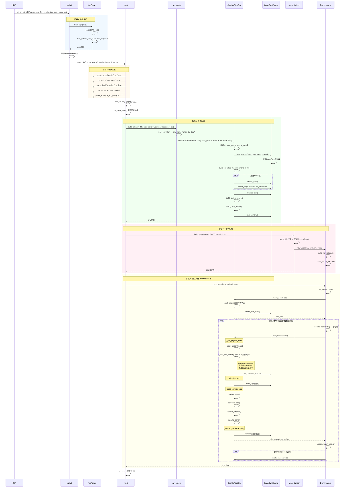

# 相关链接
- https://github.com/xbpeng/MimicKit
- https://arxiv.org/abs/2510.13794

# 常用指令

```bash
pip check
```

```bash
tensorboard \\
	--logdir=/home/chong/Desktop/Project/RobotMimic/MimicKit/output/ \\
	--port=6006 \\
	--samples_per_plugin scalars=999999
```

# 学习计划

```bash
DeepMimic (2018) ──────────────────────────────────────────────────┐
    │                                                              │
    │  手工设计跟踪奖励                                              │
    │  需要精确的参考动作对齐                                         │
    │                                                              │
    ▼                                                              │
AMP (2021) ────────────────────────────────────────────────────────┤
    │                                                              │
    │  判别器自动学习风格奖励                                         │
    │  可结合任务目标（location/steering）                            │
    │                                                              │
    ▼                                                              │
ASE (2022) ────────────────────────────────────────────────────────┤
    │                                                              │
    │  学习技能嵌入空间                                              │
    │  支持多动作数据集                                              │
    │                                                              │
    ▼                                                              │
ADD (2025) ────────────────────────────────────────────────────────┘
    │
    │  差分判别器，更好的时序建模
    │  结合跟踪奖励和对抗学习
```

## 第一阶段：基础入门（1-2天）

**1. 环境测试与动作可视化**

```bash
# 1.1 DOF测试 - 理解关节自由度
python mimickit/run.py --arg_file args/dof_test_humanoid_args.txt --visualize true --mode test

# 1.2 动作可视化 - 了解参考动作数据格式
python mimickit/run.py --arg_file args/view_motion_humanoid_args.txt --visualize true
```

**学习目标**

- 熟悉项目结构和运行方式
- 理解角色模型的关节结构
- 了解动作数据的表示方式



## **第二阶段：核心算法学习（3-5天）**

**2. DeepMimic - 基础动作模仿**

```bash
# 2.1 训练基础人形模仿（PPO算法）
python mimickit/run.py --arg_file args/deepmimic_humanoid_ppo_args.txt --visualize true

# 2.2 测试预训练模型
python mimickit/run.py --arg_file args/deepmimic_humanoid_ppo_args.txt --mode test --model_file data/models/deepmimic_humanoid_spinkick_model.pt --visualize true --num_envs 4

# 2.3 可选：尝试AWR算法
python mimickit/run.py --arg_file args/deepmimic_humanoid_awr_args.txt --visualize true
```

**学习目标**

- 理解DeepMimic的跟踪奖励设计
- 对比PPO和AWR两种RL算法
- 掌握训练参数调整

## **第三阶段：对抗学习方法（3-5天）**

**3. AMP - 对抗动作先验**

```bash
# 3.1 基础AMP训练
python mimickit/run.py --arg_file args/amp_humanoid_args.txt --visualize true

# 3.2 带任务目标的AMP - 位置导航
python mimickit/run.py --arg_file args/amp_location_humanoid_args.txt --visualize true

# 3.3 带任务目标的AMP - 方向控制
python mimickit/run.py --arg_file args/amp_steering_humanoid_args.txt --visualize true
```

**学习目标**

- 理解判别器如何替代手工设计的奖励
- 掌握AMP如何结合任务目标
- 对比DeepMimic和AMP的差异

**4. ASE - 对抗技能嵌入**

```bash
# 4.1 ASE训练（使用多动作数据集）
python mimickit/run.py --arg_file args/ase_humanoid_args.txt --visualize true
```

**学习目标**

- 理解技能嵌入空间的概念
- 学习如何从多个动作片段中学习

## **第四阶段：最新算法（2-3天）**

**5. ADD - 对抗差分判别器**

```bash
# 5.1 ADD训练
python mimickit/run.py --arg_file args/add_humanoid_args.txt --visualize true

# 5.2 测试预训练模型
python mimickit/run.py --arg_file args/add_humanoid_args.txt --mode test --model_file data/models/add_humanoid_spinkick_model.pt --visualize true --num_envs 4
```

**学习目标**

- 理解ADD相比AMP的改进
- 掌握差分判别器的工作原理

## **第五阶段：机器人迁移应用（3-5天）**

**6. 迁移到真实机器人模型**

```bash
# 6.1 G1人形机器人
python mimickit/run.py --arg_file args/view_motion_g1_args.txt --visualize true
python mimickit/run.py --arg_file args/deepmimic_g1_ppo_args.txt --visualize true
python mimickit/run.py --arg_file args/amp_g1_args.txt --visualize true
python mimickit/run.py --arg_file args/add_g1_args.txt --visualize true

# 6.2 Go2四足机器人
python mimickit/run.py --arg_file args/view_motion_go2_args.txt --visualize true
python mimickit/run.py --arg_file args/deepmimic_go2_ppo_args.txt --visualize true

# 6.3 Pi+ 机器人
python mimickit/run.py --arg_file args/deepmimic_pi_plus_ppo_args.txt --visualize true
```

**学习目标**

- 理解如何将算法应用到不同机器人
- 掌握动作重定向的概念

## **第六阶段：进阶应用（2-3天）**

**7. 复杂场景与道具交互**

```bash
# 7.1 持剑盾的角色
python mimickit/run.py --arg_file args/view_motion_humanoid_sword_shield_args.txt --visualize true
python mimickit/run.py --arg_file args/amp_steering_humanoid_sword_shield_args.txt --visualize true
python mimickit/run.py --arg_file args/ase_humanoid_sword_shield_args.txt --visualize true

# 7.2 跳马动作
python mimickit/run.py --arg_file args/vault_humanoid_args.txt --visualize true
```

**学习目标**

- 理解物体交互的处理方式
- 掌握复杂动作的训练技巧