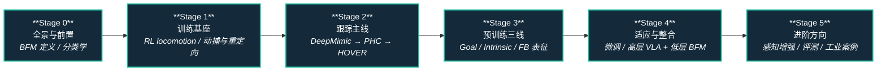

# 路线（纵深）：如果目标是 BFM（人形行为基础模型）

**摘要**：面向"想用一个 checkpoint 控住人形全身"的纵深路线，从 RL locomotion 与动捕数据基座、动作跟踪谱系（DeepMimic → ASE → PHC → MaskedMimic → HOVER），到预训练三线与适应两线，再到"高层 VLA + 低层 BFM"层次化整合与进阶方向，按 Stage 0–5 串通核心方法；本路线是 [运动控制主路线](motion-control.md) 的一条分支，与 [VLA 纵深](depth-vla.md) 构成"身体级协调 / 任务级语义"的姊妹路线。

## 路线一览

## 这条路径怎么用

- 目标读者是能在仿真里训练 locomotion 策略、想进入"人形全身行为先验"方向的人
- BFM 解决 **身体级协调**：一个 checkpoint 覆盖跟踪、抗扰与多接口全身控制；它不负责语言理解与任务语义，那是 [VLA 纵深](depth-vla.md) 的主题
- 每个阶段都有前置知识、核心问题、推荐做什么、推荐读什么、学完输出什么

**和主路线的关系：**
- 本路线是主路线 L5（RL 与模仿学习）之后偏"全身控制侧"的进阶方向，训练侧大量复用 [RL 纵深](depth-rl-locomotion.md) 的经验（PPO、reward 设计、sim2real）
- 动作数据侧与 [模仿学习纵深](depth-imitation-learning.md) 的 motion retargeting 阶段共享管线
- 如果最终目标是"听懂指令的人形整机"，走完 Stage 4 后与 [VLA 纵深](depth-vla.md) 汇合成"高层 VLA + 低层 BFM"双栈

---

## Stage 0 行为基础模型全景与前置

**先分清 BFM 与任务专用 RL、与 VLA 的边界，再进谱系，否则 41 篇论文会读成一锅粥。**

### 前置知识
- Python + PyTorch 熟练
- 理解 RL 基本概念（参考 [Reinforcement Learning](../wiki/methods/reinforcement-learning.md)）
- 对 VLM / VLA 有概念级了解（知道它们管语义，不管全身协调）

### 核心问题
- BFM 与任务专用 RL 的本质区别：跨任务行为先验 + 少 / 零重训适应
- BFM 与 VLA 在机器人栈里各自解决哪一层的问题、为什么常常叠加而不是二选一
- BFM taxonomy 怎么切：预训练三线 × 适应两线

### 推荐做什么
- 精读 BFM 综述 taxonomy，把 41 篇论文地图过一遍，标出自己方向的 3 篇精读
- 用分类学页给 VLM / VLN / VLA / WAM / BFM 各找一个代表工作，写一页纸对照表

### 推荐读什么
- [Behavior Foundation Model](../wiki/concepts/behavior-foundation-model.md)（本仓库）— taxonomy 主入口
- [BFM 41 篇技术地图](../wiki/overview/bfm-41-papers-technology-map.md)（本仓库）
- [VLM / VLN / VLA / VLX / 世界模型分类学](../wiki/comparisons/vlm-vln-vla-vlx-world-model-taxonomy.md)（本仓库）
- [Foundation Policy](../wiki/concepts/foundation-policy.md)（本仓库）— 与 BFM 的母子概念关系

### 学完输出什么
- 能一句话说清 BFM 是什么、不是什么
- 能把任意一篇 BFM 论文放进"预训练三线 × 适应两线"的格子

---

## Stage 1 训练基座：RL locomotion 与动捕数据

**BFM 的两条腿：一条是大规模并行 RL 训练管线，另一条是动捕数据与重定向。**

### 前置知识
- [RL 纵深路线](depth-rl-locomotion.md) Stage 0–2 水平：能在仿真里训练 locomotion 策略
- Stage 0 内容

### 核心问题
- 人形全身 RL 与四足 locomotion 的训练差异（自由度、支撑域、reward 设计）
- 动捕数据（AMASS）长什么样，motion retargeting 要解决什么问题
- 参考动作数据的质量与覆盖度如何影响下游行为先验

### 推荐做什么
- 在 Isaac Lab / legged_gym 里训练一个人形行走策略，熟悉全身 RL 管线
- 用一套 AMASS 数据跑通 retargeting 到目标人形模型，检查关节限位与穿模

### 推荐读什么
- [Motion Retargeting](../wiki/concepts/motion-retargeting.md) 与 [Motion Retargeting Pipeline](../wiki/concepts/motion-retargeting-pipeline.md)（本仓库）
- [AMASS](../wiki/entities/amass.md) 与 [人形参考动作数据集对比](../wiki/comparisons/humanoid-reference-motion-datasets.md)（本仓库）
- [Humanoid-X](../wiki/entities/dataset-bfm-humanoid-x.md) 等 dataset-bfm 系列（本仓库）
- [Reward 设计](../wiki/concepts/reward-design.md)（本仓库）

### 学完输出什么
- 一条能从动捕数据走到仿真参考轨迹的完整数据管线
- 对"数据侧"与"训练侧"各自瓶颈的第一手判断

---

## Stage 2 跟踪主线：从 DeepMimic 到 HOVER

**BFM 的第一条主干：动作跟踪谱系一步步走向"多模式统一控制"。**

### 前置知识
- Stage 1 内容

### 核心问题
- DeepMimic 怎么用模仿 reward 把动捕片段变成可执行策略
- ASE 的对抗式技能嵌入与 DeepMimic 逐片段跟踪的区别
- PHC → MaskedMimic 如何做到"全库跟踪 + 部分目标控制"
- HOVER 的多模式统一（跟踪 / 速度 / 关节多接口共享一个 policy）解决什么工程问题

### 推荐做什么
- 用 PHC / MaskedMimic 开源实现在仿真里跑一个人形动作跟踪 demo
- 对比"单片段模仿"与"全库跟踪"策略在未见动作上的表现

### 推荐读什么
- 谱系锚点：[DeepMimic](../wiki/entities/paper-hrl-stack-11-deepmimic.md)、[ASE](../wiki/entities/paper-bfm-25-ase.md)、[PHC](../wiki/entities/paper-bfm-22-phc.md)、[MaskedMimic](../wiki/entities/paper-bfm-17-maskedmimic.md)、[HOVER](../wiki/entities/paper-bfm-14-hover.md)（本仓库）
- [SONIC](../wiki/methods/sonic-motion-tracking.md) 与 [BeyondMimic](../wiki/methods/beyondmimic.md)（本仓库）— 工程可用的跟踪基座
- [Whole-Body Tracking Pipeline](../wiki/concepts/whole-body-tracking-pipeline.md)（本仓库）
- [Query：人形动作跟踪方法选型](../wiki/queries/humanoid-motion-tracking-method-selection.md)（本仓库）

### 学完输出什么
- 一个跑通的人形动作跟踪 demo
- 能说清谱系每一步"多了什么能力、付出了什么代价"

---

## Stage 3 预训练三线：Goal / Intrinsic / FB 表征

**跟踪只是入口：BFM 的核心主张是预训练出可复用的行为先验。**

### 前置知识
- Stage 2 内容

### 核心问题
- 预训练三线的信号与代价：goal-conditioned（跟踪驱动）、intrinsic-reward（技能发现）、forward–backward（无 reward 表征）
- FB 表征为什么能做到"测试时给 reward 即时出策略"（零样本 RL）
- 技能发现（DIAYN 一系）与动捕驱动预训练的互补关系
- 多模式控制接口（掩码 / 潜变量）怎么设计

### 推荐做什么
- 精读 BFM-Zero / MetaMotivo，推导 FB 表征的数学骨架
- 在小环境里复现一个 DIAYN 式技能发现实验，观察技能多样性

### 推荐读什么
- 三线分类页：[FB 表征](../wiki/overview/bfm-category-01-forward-backward-representation.md)、[Goal-conditioned](../wiki/overview/bfm-category-02-goal-conditioned-learning.md)、[Intrinsic-reward](../wiki/overview/bfm-category-03-intrinsic-reward-pretraining.md)（本仓库）
- 代表工作：[BFM4Humanoid](../wiki/entities/paper-behavior-foundation-model-humanoid.md)、[BFM-Zero](../wiki/entities/paper-bfm-zero.md)、[MetaMotivo](../wiki/entities/paper-bfm-02-metamotivo.md)、[DIAYN](../wiki/entities/paper-bfm-30-diayn.md)（本仓库）

### 学完输出什么
- 能向同事讲清三条预训练线的信号来源、适用场景与代价
- 对多模式控制接口（掩码 / 潜变量）的直觉

---

## Stage 4 适应与整合：微调、层次化与双栈

**预训练出的行为先验怎么用：微调、层次化，以及当前人形系统的主流工程形态——高层 VLA + 低层 BFM。**

### 前置知识
- Stage 3 内容
- [VLA 纵深](depth-vla.md) Stage 2 水平（知道 VLA 输出什么）

### 核心问题
- 适应两线：微调（LoRA / task token）vs 层次化（高层规划 + BFM 低层执行）
- 为什么端到端"语言 → 全身关节"目前难以直接训练（数据稀缺、控制频率、安全性）
- 层次化接口怎么设计：文本 / 潜向量 / motion token / 参考轨迹，各自的表达力与带宽
- LangWBC、LeVERB、GR00T-WholeBodyControl 各自的分层切法差在哪
- 开环级联的 exposure bias 怎么闭环（ReactiveBFM）

### 推荐做什么
- 读 GR00T-WholeBodyControl / LeVERB 的接口定义，画出各自的分层数据流图
- 在仿真里把一个语言指令 pipeline 接到动作跟踪低层（哪怕先用有限状态机中转）

### 推荐读什么
- 适应两线分类页：[Adaptation](../wiki/overview/bfm-category-04-adaptation.md) 与 [Hierarchical](../wiki/overview/bfm-category-05-hierarchical-control.md)（本仓库）
- [LangWBC](../wiki/entities/paper-bfm-37-langwbc.md) 与 [LeVERB](../wiki/entities/paper-bfm-36-leverb.md)（本仓库）
- [GR00T-WholeBodyControl](../wiki/entities/gr00t-wholebodycontrol.md) 与 [Humanoid-VLA](../wiki/entities/paper-loco-manip-161-121-humanoid-vla.md)（本仓库）
- [ReactiveBFM](../wiki/entities/paper-reactivebfm.md)（本仓库）

### 学完输出什么
- 能为"人形 + 语言任务"设计一套分层方案，并说清接口选型的取舍
- 对"什么该端到端、什么该分层"有基于数据 / 频率 / 安全的判断

---

## Stage 5 进阶方向

### 前置知识
- Stage 4 内容

**方向 A：感知增强**
- 让 BFM 带上环境感知，从"闭眼跟踪"走向"看着环境协调全身"
- 关键词：[Perceptive BFM](../wiki/entities/paper-perceptive-bfm.md)、[感知越障纵深路线](depth-perceptive-locomotion.md)

**方向 B：RL 微调与自改进**
- 用 RL / 真机数据闭环继续改进预训练行为先验
- 关键词：[ENPIRE](../wiki/methods/enpire.md)、[安全真机 RL 微调](../wiki/concepts/safe-real-world-rl-fine-tuning.md)

**方向 C：移动操作扩展**
- 把行为先验从"跟踪动作"扩展到"边走边操作"
- 关键词：[Loco-Manipulation](../wiki/tasks/loco-manipulation.md)、[移动操作纵深路线](depth-mobile-manipulation.md)

**方向 D：评测、选型与工业级案例**
- 建立自己的评测基线，跟踪工业界的整机方案
- 关键词：[Query：人形动作跟踪方法选型](../wiki/queries/humanoid-motion-tracking-method-selection.md)、[AgiBot BFM-2](../wiki/entities/agibot-bfm-2.md)

---

## 快速入口汇总

| 阶段 | 核心问题 | 本仓库入口 |
|------|---------|-----------|
| Stage 0 | BFM 定义与分类学 | [Behavior Foundation Model](../wiki/concepts/behavior-foundation-model.md) |
| Stage 1 | 训练与数据基座 | [Motion Retargeting Pipeline](../wiki/concepts/motion-retargeting-pipeline.md) |
| Stage 2 | 动作跟踪谱系 | [BFM 41 篇技术地图](../wiki/overview/bfm-41-papers-technology-map.md) |
| Stage 3 | 预训练三线 | [FB 表征](../wiki/overview/bfm-category-01-forward-backward-representation.md) |
| Stage 4 | 适应与双栈整合 | [GR00T-WholeBodyControl](../wiki/entities/gr00t-wholebodycontrol.md) |
| Stage 5 | 进阶方向 | [Perceptive BFM](../wiki/entities/paper-perceptive-bfm.md) |

## 和其他页面的关系

- 完整成长路线参考：[主路线：运动控制算法工程师成长路线](motion-control.md)
- 其它纵深路径：
  - [VLA（视觉-语言-动作模型）](depth-vla.md) — 姊妹路线：BFM 管身体级协调，VLA 管任务级语义
  - [WAM（世界–动作模型）](depth-wam.md) — 前向后果耦合；可与 VLA / BFM 分层叠用
  - [人形 RL 运动控制](depth-rl-locomotion.md) — 本路线的训练侧前置
  - [动作重定向（人体动作 → 机器人参考轨迹）](depth-motion-retargeting.md) — Stage 1 动捕数据基座的展开版
  - [动作生成（文本/多模态 → 人形动作）](depth-motion-generation.md) — 行为先验的显式轨迹层表达
  - [模仿学习与技能迁移](depth-imitation-learning.md) — 动作数据与 retargeting 的展开版
  - [移动操作（Loco-Manipulation）](depth-mobile-manipulation.md) — Stage 5 方向 C 的展开版
  - [感知越障（Perceptive Locomotion）](depth-perceptive-locomotion.md) — Stage 5 方向 A 的邻接路线
  - [传统模型控制（LIP/ZMP → MPC → WBC）](depth-classical-control.md)
  - [安全控制（CLF/CBF）](depth-safe-control.md)
  - [接触丰富的操作任务](depth-contact-manipulation.md)
  - [导航（SLAM → VLN → 导航 VLA）](depth-navigation.md)
- 人形控制全景图：[Humanoid Control Roadmap](../wiki/roadmaps/humanoid-control-roadmap.md)
- 技术栈地图：[tech-map/dependency-graph.md](../tech-map/dependency-graph.md)

## 参考来源

本路线基于以下原始资料的归纳：

- [Behavior Foundation Model](../wiki/concepts/behavior-foundation-model.md) 与 [BFM 41 篇技术地图](../wiki/overview/bfm-41-papers-technology-map.md)
- "DeepMimic: Example-Guided Deep Reinforcement Learning of Physics-Based Character Skills" (Peng et al., 2018) — 动作跟踪谱系起点
- "A Survey of Behavior Foundation Model" (Yuan et al., 2025, arXiv:2506.20487) — BFM taxonomy 主参考
- "HOVER: Versatile Neural Whole-Body Controller for Humanoid Robots" (He et al., 2024) — 多模式统一控制代表
