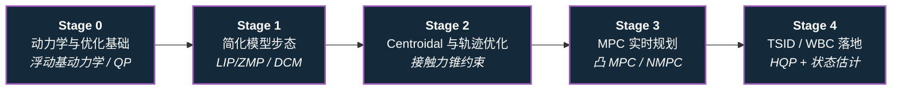

# 路线（纵深）：如果目标是传统模型控制（LIP/ZMP → MPC → WBC）

**摘要**：面向"想用基于模型的传统控制栈驱动人形机器人"的纵深路线，从简化模型（LIP/ZMP）到 Centroidal 轨迹优化、MPC，再到 TSID/WBC 与真机状态估计，按 Stage 0–4 串通核心方法；本路线是 [运动控制主路线](motion-control.md) 的一条分支。

## 路线一览

## 这条路径怎么用

- 目标读者是想系统掌握 model-based 人形控制主干、而非直接上 RL 的工程师或研究者
- 需要线性代数、基础动力学直觉；凸优化会随路线逐步补
- 每个阶段有前置知识、核心问题、推荐做什么、学完输出什么

**和主路线的关系：**
- 本路线就是主路线 L2–L4 的"传统控制主干"纵深展开版：主路线求广度，本路线求把每一层写成可运行的控制器
- 如果你走 [RL 纵深](depth-rl-locomotion.md) 到 Stage 3 需要和 MPC/WBC 结合，本路线是对应的理论与工程补给线
- 学完本路线，再看 [WBC vs RL](../wiki/comparisons/wbc-vs-rl.md) 和 [MPC vs RL](../wiki/comparisons/mpc-vs-rl.md) 会有完全不同的判断力

---

## Stage 0 动力学与优化基础

### 前置知识
- 线性代数（矩阵运算、最小二乘）
- 刚体力学基本直觉（力、力矩、惯量）
- Python 熟练

### 核心问题
- 浮动基（floating-base）动力学和固定基机械臂动力学差在哪
- 为什么现代人形控制器几乎都归结为解 QP
- 最优控制问题的标准形式长什么样

### 推荐读什么
- [Floating-Base Dynamics](../wiki/concepts/floating-base-dynamics.md)
- [Quadratic Programming](../wiki/formalizations/quadratic-programming.md)
- [Optimal Control](../wiki/concepts/optimal-control.md)
- [LQR](../wiki/formalizations/lqr.md)
- [Modern Robotics 教材](../wiki/entities/modern-robotics-book.md) — Chapter 8（动力学）
- [Query：Pinocchio 快速上手](../wiki/queries/pinocchio-quick-start.md)
- [建模与求解（控制问题框架）](../wiki/concepts/modeling-and-solving-for-control.md) — 先确定状态/输入/动力学与约束，再选 QP/MPC/iLQR/RL 等求解器，是 Model-based 与 Learning-based 的共同上游

### 推荐做什么
- 用 [Pinocchio](../wiki/entities/pinocchio.md) 加载一个人形 URDF，计算质心、惯量矩阵和重力项
- 用 CVXPY 手写一个小 QP（例如带约束的最小二乘），理解约束激活的含义

### 学完输出什么
- 能写出浮动基动力学方程 \(M\dot v + h = S^\top\tau + J_c^\top f_c\) 并解释每一项
- 能把一个简单控制问题手工转成 QP 标准形式

---

## Stage 1 简化模型步态（LIP/ZMP → DCM）

### 核心问题
- 为什么人形步行可以先用线性倒立摆（LIP）近似
- ZMP 稳定判据到底在说什么、什么时候失效
- Capture Point / DCM 相比 ZMP 多解决了什么问题

### 推荐读什么
- [LIP / ZMP](../wiki/concepts/lip-zmp.md)
- [ZMP-LIP 形式化](../wiki/formalizations/zmp-lip.md)
- [Capture Point / DCM](../wiki/concepts/capture-point-dcm.md)
- [Locomotion 任务地图](../wiki/tasks/locomotion.md) 与 [Footstep Planning](../wiki/concepts/footstep-planning.md)
- [SLIP + VMC（弹簧负载倒立摆与虚拟模型控制）](../wiki/methods/slip-vmc.md) — LIP 之后、WBC 之前的中间简化层：弹簧腿近似支撑相 + 虚拟阻抗力映射到关节力矩
- Kajita et al., *Biped Walking Pattern Generation by using Preview Control of ZMP* (2003)

### 推荐做什么
- 实现一维 LIP 模型，用 ZMP preview control 生成质心轨迹
- 加入 DCM 反馈，观察推一把（push recovery）后落脚点如何调整

### 学完输出什么
- 能推导 LIP 动力学并解释 ZMP 与支撑多边形的关系
- 能生成一段能跟踪的质心 + 落脚点参考轨迹

---

## Stage 2 Centroidal 动力学与轨迹优化

### 核心问题
- Centroidal dynamics 为什么是"全身动力学"和"简化模型"之间的最佳折中
- 接触力锥（friction cone / contact wrench cone）约束怎么进优化
- 轨迹优化（TO）和实时控制的分工是什么

### 推荐读什么
- [Centroidal Dynamics](../wiki/concepts/centroidal-dynamics.md)
- [Contact Wrench Cone](../wiki/formalizations/contact-wrench-cone.md)
- [Friction Cone](../wiki/formalizations/friction-cone.md)
- [Trajectory Optimization](../wiki/methods/trajectory-optimization.md)
- Orin et al., *Centroidal dynamics of a humanoid robot* (2013)

### 推荐做什么
- 用 [Crocoddyl](../wiki/entities/crocoddyl.md) 或手写 DDP 求解一个 centroidal 轨迹优化问题
- 对比有 / 无摩擦锥约束时优化出的接触力差异

### 学完输出什么
- 能写出 centroidal momentum 动力学并解释角动量项的作用
- 能对一段步态离线求解出物理可行的质心 + 接触力轨迹

---

## Stage 3 MPC 实时规划

### 核心问题
- 把 Stage 2 的优化放进实时循环需要牺牲什么（模型精度 vs. 求解频率）
- 凸 MPC 和 NMPC 各适合什么场景
- LQR / iLQR 和 MPC 是什么关系

### 推荐读什么
- [Model Predictive Control (MPC)](../wiki/methods/model-predictive-control.md)
- [Nonlinear MPC](../wiki/methods/nonlinear-model-predictive-control.md)
- [SRBD + 凸 MPC + WBC](../wiki/concepts/srbd-convex-mpc-wbc.md) — 单刚体近似质心运动的凸 MPC 分层架构，人形实时行走的工程主流折中
- [Centroidal NMPC + WBC 栈](../wiki/methods/centroidal-nmpc-wbc-stack.md) — 质心动力学 + 非线性 MPC，比凸 SRBD-MPC 更高保真的传统控制顶层
- [LQR / iLQR](../wiki/methods/lqr-ilqr.md)
- [MPC vs RL](../wiki/comparisons/mpc-vs-rl.md)
- [Query：MPC 求解器选型](../wiki/queries/mpc-solver-selection.md) 与 [Query：MPC 调参指南](../wiki/queries/mpc-tuning-guide.md)
- Di Carlo et al., *Dynamic Locomotion in the MIT Cheetah 3 Through Convex Model-Predictive Control* (2018)

### 推荐做什么
- 实现一个基于简化模型（LIP 或 single rigid body）的凸 MPC，在仿真里跟踪速度指令
- 调 horizon 长度和求解频率，观察对稳定性和计算量的影响

### 学完输出什么
- 能解释 receding horizon 的工作方式和 warm start 的意义
- 一个能在仿真里实时跑的简化模型 MPC 步态控制器

---

## Stage 4 TSID / WBC 与真机落地

### 核心问题
- MPC 输出的质心/接触计划怎么变成每个关节的力矩
- TSID 和 HQP 任务分层怎么设计（接触约束 > 质心跟踪 > 姿态 > 正则化）
- 真机上状态估计误差和接触检测误差怎么处理

### 推荐读什么
- [TSID](../wiki/concepts/tsid.md) 与 [TSID 形式化](../wiki/formalizations/tsid-formulation.md)
- [Whole-Body Control](../wiki/concepts/whole-body-control.md)
- [HQP](../wiki/concepts/hqp.md)
- [MPC-WBC 集成](../wiki/concepts/mpc-wbc-integration.md)
- [State Estimation](../wiki/concepts/state-estimation.md) 与 [Contact Estimation](../wiki/concepts/contact-estimation.md)
- [Query：WBC 实现指南](../wiki/queries/wbc-implementation-guide.md) 与 [Query：WBC 调参指南](../wiki/queries/wbc-tuning-guide.md)

### 推荐做什么
- 用 TSID（或 [Drake](../wiki/entities/drake.md) / 自研 QP）实现一个站立平衡 WBC，接上 Stage 3 的 MPC 输出
- 给仿真加观测噪声与接触延迟，验证估计器 + WBC 的鲁棒性

### 学完输出什么
- 一条"MPC → WBC → 关节力矩"的完整仿真控制链
- 能解释任务优先级冲突时 HQP 的行为，并知道真机部署时先查哪些信号

---

## 快速入口汇总

| 阶段 | 核心问题 | 本仓库入口 |
|------|---------|-----------|
| Stage 0 | 动力学与 QP 基础 | [Floating-Base Dynamics](../wiki/concepts/floating-base-dynamics.md) |
| Stage 1 | 简化模型步态 | [LIP / ZMP](../wiki/concepts/lip-zmp.md) |
| Stage 2 | Centroidal 与 TO | [Centroidal Dynamics](../wiki/concepts/centroidal-dynamics.md) |
| Stage 3 | 实时 MPC | [Model Predictive Control](../wiki/methods/model-predictive-control.md) |
| Stage 4 | TSID / WBC | [Whole-Body Control](../wiki/concepts/whole-body-control.md) |

## 和其他页面的关系

- 完整成长路线参考：[主路线：运动控制算法工程师成长路线](motion-control.md)
- 其它纵深路径：
  - [遥操作（人形全身遥操作 + 手指遥操作 → 示范数据/实时接管）](depth-teleoperation.md)
  - [力矩控制电机设计（指标 → 电磁热 → FOC 力矩闭环）](depth-torque-motor-design.md) — Stage 4 WBC 输出的关节力矩由这条路线的力矩闭环兑现
  - [人形 RL 运动控制](depth-rl-locomotion.md)
  - [模仿学习与技能迁移](depth-imitation-learning.md)
  - [安全控制（CLF/CBF）](depth-safe-control.md)
  - [接触丰富的操作任务](depth-contact-manipulation.md)
  - [感知越障（Perceptive Locomotion）](depth-perceptive-locomotion.md)
  - [导航（SLAM → VLN → 导航 VLA）](depth-navigation.md)
  - [Loco-Manipulation（移动操作）](depth-loco-manipulation.md)
  - [动作重定向（人体动作 → 机器人参考轨迹）](depth-motion-retargeting.md)
  - [动作生成（文本/多模态 → 人形动作）](depth-motion-generation.md)
  - [VLA（视觉-语言-动作模型）](depth-vla.md)
  - [WAM（世界–动作模型）](depth-wam.md)
  - [BFM（人形行为基础模型）](depth-bfm.md)
  - [人形足球（全向行走 → 感知踢球 → 多机战术）](depth-humanoid-soccer.md)
  - [人形群控展演（群舞同步 → 编队走位 → 群体特技）](depth-humanoid-swarm-performance.md)
  - [人形拳击（动作跟踪 → 潜空间技能 → 对抗自博弈）](depth-humanoid-boxing.md)
  - [Sim2Real（域差画像 → 执行器对齐 → 鲁棒训练 → 真机部署）](depth-sim2real.md)
  - [Real2Sim（真实世界 → 可仿真资产/场景/孪生）](depth-real2sim.md)
- 关联知识页：
  - [Optimal Control](../wiki/concepts/optimal-control.md)
  - [LIP / ZMP](../wiki/concepts/lip-zmp.md)
  - [Centroidal Dynamics](../wiki/concepts/centroidal-dynamics.md)
  - [Model Predictive Control](../wiki/methods/model-predictive-control.md)
  - [Whole-Body Control](../wiki/concepts/whole-body-control.md)
  - [WBC vs RL 对比](../wiki/comparisons/wbc-vs-rl.md)

## 参考来源

本路线基于以下原始资料的归纳：

- [LIP / ZMP](../wiki/concepts/lip-zmp.md)
- [Centroidal Dynamics](../wiki/concepts/centroidal-dynamics.md)
- [Model Predictive Control](../wiki/methods/model-predictive-control.md)
- [TSID 形式化](../wiki/formalizations/tsid-formulation.md)
- Kajita et al., *Biped Walking Pattern Generation by using Preview Control of ZMP* (2003)
- Di Carlo et al., *Convex Model-Predictive Control for Quadruped Locomotion* (2018)
- [Modern Robotics 教材](../wiki/entities/modern-robotics-book.md)
