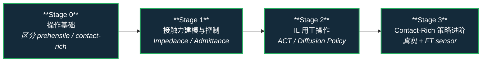

# 路线（纵深）：如果目标是接触丰富的操作任务

**摘要**：面向"装配、拧螺丝、插拔等需要精细接触"的操作任务的纵深路线，按 Stage 0–3 串通从阻抗控制到 ACT / Diffusion Policy 的核心方法；本路线是 [运动控制主路线](motion-control.md) 的一条分支。

## 路线一览

## 这条路径怎么用

- 目标读者是有 RL/IL 基础、想深入操作任务的工程师
- 需要了解基础动力学和控制，Python 编程熟练
- 每个阶段有前置知识、核心问题、推荐做什么、学完输出什么

**和主路线的关系：**
- 操作任务与 locomotion 共享 WBC / 阻抗控制 / 接触建模基础
- 本路线大量交叉 [模仿学习纵深](depth-imitation-learning.md)，因为 contact-rich 任务现在主流方案是 IL
- 不少 Sim2Real 经验也可以从 [RL 纵深](depth-rl-locomotion.md) Stage 4 借用

---

## Stage 0 操作基础

### 前置知识
- 机器人运动学基础（正逆运动学）
- 基础控制理论（PID、阻抗控制概念）
- Python + ROS 或类似框架

### 核心问题
- 什么叫"接触丰富"，和 free-space manipulation 有什么区别
- 刚性抓取和顺应性控制分别适合什么场景

### 推荐读什么
- [Manipulation](../wiki/tasks/manipulation.md)
- [Contact-Rich Manipulation](../wiki/concepts/contact-rich-manipulation.md)
- Mason, *Mechanics of Robotic Manipulation* — Chapter 1-2

### 学完输出什么
- 能区分 prehensile / non-prehensile / contact-rich 操作
- 理解阻抗控制（impedance control）的基本原理

---

## Stage 1 接触力建模与控制

### 核心问题
- 怎么建模接触力和摩擦
- 阻抗控制 vs. 导纳控制 vs. 力控有什么区别

### 推荐读什么
- [Contact Dynamics](../wiki/concepts/contact-dynamics.md)
- [Force Control 基础](../wiki/concepts/force-control-basics.md)
- [Impedance Control](../wiki/concepts/impedance-control.md) 与 [力位混合控制](../wiki/concepts/hybrid-force-position-control.md)
- [Whole-Body Control](../wiki/concepts/whole-body-control.md)
- Hogan, *Impedance Control* (1985)

### 推荐做什么
- 在 MuJoCo 或 Isaac Sim 中实现一个 impedance controller，完成推箱子任务
- 观察接触刚度参数对稳定性的影响

### 学完输出什么
- 能写出 impedance control 的数学形式
- 能解释 soft contact 模型（MuJoCo）vs. hard contact 的区别

---

## Stage 2 模仿学习用于操作

### 核心问题
- 为什么 contact-rich 任务适合 IL 而不是 RL
- ACT 和 Diffusion Policy 各适合什么场景

### 推荐读什么
- [Imitation Learning](../wiki/methods/imitation-learning.md)
- [Behavior Cloning](../wiki/methods/behavior-cloning.md)
- [Diffusion Policy](../wiki/methods/diffusion-policy.md) 与 [Action Chunking](../wiki/methods/action-chunking.md)
- [Bimanual Manipulation](../wiki/tasks/bimanual-manipulation.md)
- [Query：操作任务里的模仿学习](../wiki/queries/il-for-manipulation.md)
- [数据手套 vs 视觉遥操作](../wiki/comparisons/data-gloves-vs-vision-teleop.md) — 采集方案选型
- Zhao et al., *Learning Fine-Grained Bimanual Manipulation with Low-Cost Hardware* (ACT, 2023)

### 推荐做什么
- 用 ACT 框架收集遥操作数据并训练一个抓取策略
- 对比 chunk size 对 contact-rich 任务成功率的影响

### 学完输出什么
- 能解释 ACT 的 action chunking 机制和 Diffusion Policy 的多模态优势
- 能设计一个 contact-rich 任务的数据采集方案

---

## Stage 3 Contact-Rich 策略进阶

### 核心问题
- 如何在 sim2real 中处理 contact-rich 任务的接触不一致问题
- 有哪些专门针对 contact-rich 的学习方法

### 推荐读什么
- [Query：接触丰富操作实践指南](../wiki/queries/contact-rich-manipulation-guide.md)
- [Demo Data Collection Guide](../wiki/queries/demo-data-collection-guide.md)
- [Tactile Sensing](../wiki/concepts/tactile-sensing.md) 与 [视触融合](../wiki/concepts/visuo-tactile-fusion.md)
- [触觉阻抗控制](../wiki/methods/tactile-impedance-control.md) 与 [In-Hand Reorientation](../wiki/methods/in-hand-reorientation.md)
- [Query：RL 中的触觉反馈](../wiki/queries/tactile-feedback-in-rl.md)
- Luo et al., *DEFT: Dexterous Fine-Grained Manipulation Transformer* (2024)

### 推荐做什么
- 尝试在真机上部署 ACT 策略，使用 FT sensor 记录接触力
- 分析失败案例，找出接触力误差模式

### 学完输出什么
- 能识别 contact-rich sim2real 迁移的主要瓶颈
- 能设计 FT sensor feedback 的简单修正机制

---

## 和其他页面的关系

- 完整成长路线参考：[主路线：运动控制算法工程师成长路线](motion-control.md)
- 其它纵深路径：
  - [人形 RL 运动控制](depth-rl-locomotion.md)
  - [传统模型控制（LIP/ZMP → MPC → WBC）](depth-classical-control.md)
  - [模仿学习与技能迁移](depth-imitation-learning.md)
  - [安全控制（CLF/CBF）](depth-safe-control.md)
  - [感知越障（Perceptive Locomotion）](depth-perceptive-locomotion.md)
  - [导航（SLAM → VLN → 导航 VLA）](depth-navigation.md)
  - [移动操作（Loco-Manipulation）](depth-mobile-manipulation.md) — 本路线向"移动中操作"的扩展版
  - [动作重定向（人体动作 → 机器人参考轨迹）](depth-motion-retargeting.md) — 灵巧手交互重定向的邻接路线
  - [动作生成（文本/多模态 → 人形动作）](depth-motion-generation.md)
  - [VLA（视觉-语言-动作模型）](depth-vla.md)
  - [BFM（人形行为基础模型）](depth-bfm.md)
- 关联知识页：
  - [Manipulation](../wiki/tasks/manipulation.md)
  - [Contact-Rich Manipulation](../wiki/concepts/contact-rich-manipulation.md)
  - [Bimanual Manipulation](../wiki/tasks/bimanual-manipulation.md)
  - [Imitation Learning](../wiki/methods/imitation-learning.md)
  - [Behavior Cloning](../wiki/methods/behavior-cloning.md)
  - [Query：接触丰富操作实践指南](../wiki/queries/contact-rich-manipulation-guide.md)

## 参考来源

本路线基于以下原始资料的归纳：

- [Manipulation](../wiki/tasks/manipulation.md)
- [Contact-Rich Manipulation](../wiki/concepts/contact-rich-manipulation.md)
- [Contact Dynamics](../wiki/concepts/contact-dynamics.md)
- Zhao et al., *Learning Fine-Grained Bimanual Manipulation with Low-Cost Hardware* (ACT, 2023)
- Hogan, *Impedance Control* (1985)
- Mason, *Mechanics of Robotic Manipulation*
