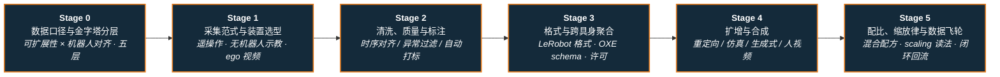

# 路线（纵深）：如果目标是具身数据（采集 → 清洗标注 → 格式聚合 → 扩增合成 → 配比与飞轮）

**摘要**：面向"想把具身数据当成一条可交付的工程管线来做"的纵深路线，从数据口径与金字塔分层（可扩展性 × 机器人对齐两轴、真机/UMI/Ego-Exo/仿真/通用五层），到采集范式与装置选型（遥操作 · 无机器人示教 · 第一视角人视频 · 动捕），再到清洗质量与自动标注（时序对齐 / 异常过滤 / 重定向误差修复 / VLM 打标）、格式与跨具身聚合（LeRobot 格式 · Open X-Embodiment schema · 数据集与许可选型）、扩增与合成（重定向 / 仿真与 Real2Sim / 生成式增强 / 人视频置换 teleop），最后到配比、缩放律与数据飞轮闭环，按 Stage 0–5 串通核心方法；本路线是 [训练数据管线知识链](../wiki/overview/hub-data-pipeline.md) 的路线化展开，也是 [模仿学习纵深](depth-imitation-learning.md)、[VLA 纵深](depth-vla.md)、[BFM 纵深](depth-bfm.md) 共同的**上游供给侧**。

## 路线一览

## 这条路径怎么用

- 目标读者是"要为一个具身模型（VLA / BFM / WAM / 操作策略）负责数据供给"的人——主战场是采集台账、清洗管线、数据集格式、配比配方与数据飞轮基建，而不是训练算法本身
- 具身数据解决的是 **"策略吃什么"**：它不负责把策略训好（那是 [模仿学习纵深](depth-imitation-learning.md)、[RL 纵深](depth-rl-locomotion.md) 的主题），也不负责证明策略好不好（那是 [具身模型测评纵深](depth-embodied-eval.md) 的主题）；它负责把**物理世界压成可审计、可复用、可缩放的训练资产**
- 每个阶段都有前置知识、核心问题、推荐做什么、推荐读什么、学完输出什么

**和主路线的关系：**
- 本路线是主路线 **L5（学习方法）与 L7（数据/评测基础设施）** 里"训练输入从哪来"环节的展开版；不需要走完 L5 也能单独进入——只要能录下一条带时间戳的观测–动作序列即可起步
- Stage 1 的遥操作采集与 [遥操作纵深](depth-teleoperation.md) 共享同一套硬件与接管口径，区别在于本路线关心的是**采完之后数据还能不能用**；Stage 4 的重定向与 [动作重定向纵深](depth-motion-retargeting.md) 共享映射管线
- 本路线与 [Real2Sim 纵深](depth-real2sim.md) 是**同一供给问题的两条腿**：Real2Sim 造仿真侧资产，本路线管真机与人侧数据的全生命周期，Stage 4 是二者的汇合点

---

## Stage 0 数据口径与金字塔分层：先钉死什么算"具身数据"

**第一课不是采数，而是先分清"录到了"和"能训练"——大量采集止步于一堆带时间戳的视频，缺本体状态、缺动作语义、缺成败标签，进不了任何策略。**

### 前置知识
- 知道一条训练样本至少要有观测（图像 / 本体状态）、动作、时间轴三件套
- 了解 [模仿学习](../wiki/methods/imitation-learning.md) 与 [行为克隆](../wiki/methods/behavior-cloning.md) 对数据分布的基本要求

### 核心问题
- **具身数据 ≠ 互联网数据**：训练需要速度、姿态、力触、egocentric 视觉、接触滑移等**物理量**，不能像 LLM 那样纯爬文本（见 [人形机器人数据采集产业地图](../wiki/queries/humanoid-robot-data-collection-landscape.md)）
- **五层金字塔与两条轴**：[Data Pyramid](../wiki/entities/paper-data-pyramid-embodied-manipulation.md)（arXiv:2607.24744）以 **可扩展性 × 机器人对齐** 两轴把生态排成真机 / UMI / Ego-Exo / 仿真 / 通用五层——越往上越贵越对齐，越往下越便宜越不对齐，任何配方本质是在这两轴上取点
- **data ≠ 可训练数据**：原始 MoCap / 视频常缺接触与力信息或存在形态差距，需经质量评估与重定向方可入策略（见 [训练数据管线知识链](../wiki/overview/hub-data-pipeline.md)）
- **四轴质量口径**：物理可行性、接触一致性、形态差距、规模与多样性——先有口径才能谈"多少数据够"（见 [Motion Data Quality](../wiki/concepts/motion-data-quality.md)）

### 推荐做什么
- 把手上任意一批采集录像按五层金字塔归位，逐条标出它缺哪些物理量、需要补什么才能进策略
- 给目标任务写一页"数据规格书"：观测键、动作语义、控制频率、成败标签、必须保留的元数据（本体、场景、操作者）

### 推荐读什么
- [Data Pyramid for Embodied Manipulation](../wiki/entities/paper-data-pyramid-embodied-manipulation.md)（本仓库）— 五层金字塔与三类基础模型的数据配方视角，本阶段的骨架页
- [训练数据管线（知识链汇总）](../wiki/overview/hub-data-pipeline.md)（本仓库）— 原始动作 → 质量评估 → 重定向 → 策略输入的端到端链路
- [Motion Data Quality（动作数据质量维度）](../wiki/concepts/motion-data-quality.md)（本仓库）— 四轴质量口径及其与重定向必要性的因果
- [人形训练数据管线选型指南](../wiki/queries/humanoid-training-data-pipeline.md)（本仓库）— 参考运动来源 / 重定向方案 / 训练范式三层互相约束的决策树

### 学完输出什么
- 一页目标任务的数据规格书（观测键 / 动作语义 / 频率 / 标签 / 元数据）
- 能一句话说清自己要的数据在金字塔哪一层，为此放弃了可扩展性还是对齐度

---

## Stage 1 采集范式与装置选型：谁来产生这些物理量

**采集的成本结构决定整条管线的天花板：同一笔预算，是买遥操作台、发无机器人示教夹爪，还是收第一视角人视频，会把数据量与对齐度拉到完全不同的量级。**

### 前置知识
- Stage 0 内容
- 了解 [遥操作](../wiki/tasks/teleoperation.md) 的基本形态（VR / 外骨骼 / 主从）

### 核心问题
- **六条并行范式**：野外机器人飞轮、VR/外骨骼遥操作、可穿戴无机器人采集、服务换数据、消费品侧传感、标注与场景（地产）层——[人形机器人数据采集产业地图](../wiki/queries/humanoid-robot-data-collection-landscape.md) 给出了每条范式的代表节点与商业结构
- **有机器人 vs 无机器人**：遥操作数据天然与本体对齐但吞吐低；UMI 式手持采集（如 [HandUMI](../wiki/entities/handumi.md)、[BifrostUMI](../wiki/entities/paper-bifrost-umi.md)）脱离机器人采集，吞吐高但要在下游补回本体对齐
- **灵巧采集的传感器选型**：数据手套 vs 视觉遥操作在精度、成本、遮挡鲁棒性、力反馈上各有硬边界（见 [数据手套 vs 视觉遥操作](../wiki/comparisons/data-gloves-vs-vision-teleop.md)）
- **第一视角人视频**：把人变成分布式采集者（[Ego 专题 · 数据采集](../wiki/overview/ego-category-01-data-collection.md)）；[EgoMimic](../wiki/entities/paper-ego-03-egomimic.md) 报告人类数据的缩放效率高于等量机器人数据，但视点与手–爪差异必须在下游对齐
- **质检是稀缺项而非摄像头数量**：采集正在商品化，差异化落在"谁能判断哪些片段可学"（产业地图结论 2）

### 推荐做什么
- 对同一任务分别用遥操作与无机器人示教各采 20 条，记录**单位时间有效样本数**与**下游可用率**，把成本结构算成"每条可用轨迹多少钱/多少分钟"
- 搭一个最小采集台账：每条 episode 记录操作者、场景、本体、失败原因，为 Stage 2 的过滤留下依据

### 推荐读什么
- [Query：人形机器人数据采集产业地图](../wiki/queries/humanoid-robot-data-collection-landscape.md)（本仓库）— 六条范式与独立实体索引，本阶段的全景页
- [操作任务演示数据收集指南](../wiki/queries/demo-data-collection-guide.md) · [灵巧操作数据采集指南](../wiki/queries/dexterous-data-collection-guide.md)（本仓库）— 硬件选型、质量保障与常见陷阱
- [数据手套 vs 视觉遥操作](../wiki/comparisons/data-gloves-vs-vision-teleop.md)（本仓库）— 灵巧采集的选型对照
- [HandUMI](../wiki/entities/handumi.md) · [BifrostUMI](../wiki/entities/paper-bifrost-umi.md)（本仓库）— 无机器人示教接口的夹爪侧与人形全身侧两种形态
- [ACE-Data-0](../wiki/entities/paper-ace-data-0.md)（本仓库）— 把真实家居做成时空校准录制工作室（150 h / 17M 帧 / 75k episodes）的场景化采集样本
- [EgoScale](../wiki/methods/egoscale.md) · [EgoMimic](../wiki/entities/paper-ego-03-egomimic.md)（本仓库）— 第一视角人视频作为可缩放监督源

### 学完输出什么
- 一张"范式 × 单位可用轨迹成本 × 对齐度"的选型表
- 一套带元数据的采集台账模板，能追溯任意一条轨迹的来源与失败原因

---

## Stage 2 清洗、质量与标注：把脏数据变成专家轨迹

**采集端的每一个毫秒抖动、每一次犹豫、每一处重定向穿模，都会在训练时变成策略的分布熵——清洗不是可选项，是模仿学习不学偏的前提。**

### 前置知识
- Stage 1 内容
- 会写基本的时序重采样与插值，了解关节限位/速度限幅等物理校验

### 核心问题
- **时序对齐**：遥操作时控制信号与图像帧存在 **10–100 ms 的非恒定延迟**，需用 NTP 或硬件触发对齐后重采样到固定控制频率（如 50 Hz），否则动作与视觉状态错配（见 [具身数据清洗](../wiki/concepts/embodied-data-cleaning.md)）
- **异常轨迹过滤三件套**：物理校验（关节限位 / 角速度 / 瞬时接触力）、任务成败判定、平滑度检查（二阶导突变）
- **重定向误差修复**：人手与灵巧手拓扑不同，映射后需小型 IK 微调消除"隔空移物"；[HumanNet](../wiki/entities/humannet.md) 给出的 robot-ready 判据是**重定向误差 < 15 mm、有效帧覆盖率 > 60%**
- **分段与剪辑**：剔除首尾静止期，只留对任务有实质贡献的交互片段，提高信息密度
- **自动标注**：用 VLM 为海量原始轨迹生成文本描述与成功率标签，是把清洗从人力密集变成可缩放的关键（见 [Auto-labeling Pipelines](../wiki/methods/auto-labeling-pipelines.md)）
- **失败数据不是垃圾**：成败标签本身是监督信号，[Data Pyramid](../wiki/entities/paper-data-pyramid-embodied-manipulation.md) 把"失败恢复"列为六大开放挑战之一——一刀切只留成功轨迹会丢掉恢复能力

### 推荐做什么
- 对一批原始 episode 跑一遍"对齐 → 物理校验 → 成败判定 → 剪辑"四步，统计每一步的淘汰率，找出真正的产能瓶颈
- 用一个 VLM 给同一批轨迹自动打标，人工抽检 50 条算准确率，判断自动标注能否替代人工质检

### 推荐读什么
- [Embodied Data Cleaning（具身数据清洗）](../wiki/concepts/embodied-data-cleaning.md)（本仓库）— 时序对齐 / 异常过滤 / 重定向修复 / 分段剪辑四步管线，本阶段的核心页
- [Auto-labeling Pipelines](../wiki/methods/auto-labeling-pipelines.md)（本仓库）— VLM 自动生成描述与成功率标签
- [HumanNet](../wiki/entities/humannet.md)（本仓库）— 采集 → 处理 → 标注三阶段大规模管线，含 robot-ready 子集的量化判据
- [灵巧操作数据管线与 RL 训练基建指南](../wiki/queries/dexterous-manipulation-data-pipeline.md)（本仓库）— 清洗产物如何接上训练基建
- [Motion Data Quality](../wiki/concepts/motion-data-quality.md)（本仓库）— 用四轴口径给清洗结果打分

### 学完输出什么
- 一条可复跑的清洗脚本 + 每步淘汰率报表
- 一份自动标注 vs 人工质检的准确率对照，能说清哪些标签必须留人

---

## Stage 3 格式、数据集与跨具身聚合：让数据能被别人（和明天的自己）读懂

**格式决定复用半径。同一批轨迹，写成自定义 pickle 只有自己能训，写成通用 schema 就能进联合训练、进公开榜、进别人的消融。**

### 前置知识
- Stage 2 内容
- 了解一个开源训练框架的数据接口（如 LeRobot dataset）

### 核心问题
- **统一的是 schema，不是动力学**：[Open X-Embodiment](../wiki/concepts/open-x-embodiment.md)（[arXiv:2310.08864](https://arxiv.org/abs/2310.08864)）把 **60+ 数据集、22 类本体、超过 100 万条轨迹** 整理到相对统一的格式，价值先在数据基础设施、然后才在 RT-X 模型；但统一只发生在存储 schema 与常见末端动作层，**并没有消除本体差异**（见 [OXE 详情页](../wiki/entities/paper-open-x-embodiment.md)）
- **元数据必须随轨迹走**：每个 episode 要保留本体、数据源、任务文本、观测键、动作语义与时间结构，否则统一张量会掩盖不可比数据
- **正迁移不是必然**：RT-X 实际只选了 9 种本体入同一模型，结论支持"数据多样性帮助迁移"，不支持"训一次就能零样本控任意机器人"
- **工具链与格式生态**：[LeRobot](../wiki/entities/lerobot.md) 把采集、训练、仿真评测与部署收进同一套数据抽象，是当前最省事的落地格式选择之一
- **数据集选型与许可**：参考运动与操作数据集在规模、模态、许可上差异巨大（[数据集选型对照](../wiki/comparisons/humanoid-reference-motion-datasets.md)）；[NVIDIA Physical AI 数据集](../wiki/entities/nvidia-physical-ai-datasets.md) 等集合存在**部分子集门控**，选型时须先核查可商用边界

### 推荐做什么
- 把自己一批数据导出成 LeRobot 兼容格式，跑通"别人 clone 下来能直接训"的最小闭环
- 挑 3 个公开数据集（如 [AMASS](../wiki/entities/amass.md)、[AgiBot World 2026](../wiki/entities/agibot-world-2026.md)、[Humanoid Everyday](../wiki/entities/humanoid-everyday-dataset.md)），逐条核对模态、许可与本体元数据是否齐备

### 推荐读什么
- [Open X-Embodiment](../wiki/concepts/open-x-embodiment.md) 与 [OXE / RT-X 详情页](../wiki/entities/paper-open-x-embodiment.md)（本仓库）— 跨具身聚合的边界与正迁移证据链
- [LeRobot（Hugging Face）](../wiki/entities/lerobot.md)（本仓库）— 采集–训练–评测–部署同框的数据抽象
- [人形参考运动与操作数据集选型](../wiki/comparisons/humanoid-reference-motion-datasets.md)（本仓库）— AMASS / LAFAN1 / OMOMO / PHUMA / Humanoid Everyday 的对照
- [AgiBot World 2026](../wiki/entities/agibot-world-2026.md) · [NVIDIA Physical AI 数据集](../wiki/entities/nvidia-physical-ai-datasets.md)（本仓库）— 真机操作与官方合集两类公开数据源，注意门控与许可
- [das-datakit](../wiki/entities/cn-os-das-datakit.md) · [DataEval](../wiki/entities/cn-os-dataeval.md)（本仓库）— MCAP 解析/转换与数据集评测的开源工具侧

### 学完输出什么
- 一份自己数据的格式说明（schema + 元数据字段 + 许可）
- 能说清跨具身聚合在自己场景下**能借到什么、借不到什么**

---

## Stage 4 扩增与合成：用便宜的数据换贵的数据

**真机轨迹是金字塔顶端最贵的一层。这一阶段的全部工作，是用重定向、仿真、生成与人视频把便宜层的数据"折算"成对齐层的有效样本。**

### 前置知识
- Stage 3 内容
- 了解 [动作重定向](../wiki/concepts/motion-retargeting.md) 与 [Sim2Real](../wiki/concepts/sim2real.md) 的基本概念

### 核心问题
- **重定向：人 → 本体**：把人体动捕/视频映射到机器人骨架，是把 Ego-Exo 层折算到真机层的主路径；物理可靠性需专门数据集与流程保障（如 [PHUMA](../wiki/entities/dataset-bfm-phuma.md)），细节见 [动作重定向纵深](depth-motion-retargeting.md)
- **仿真与 Real2Sim：场景 → 可训练环境**：仿真数据易于缩放但多样性受限于物理引擎建模能力；把真实场景压成可训练资产的做法见 [Real2Sim 纵深](depth-real2sim.md) 与 [SimFoundry](../wiki/entities/paper-simfoundry-real2sim-scene-generation.md)
- **生成式增强：长尾 → 样本**：用扩散/视频编辑针对性合成长尾失败与罕见交互，低成本扩充演示库（见 [Generative Data Augmentation](../wiki/methods/generative-data-augmentation.md)）
- **人视频置换 teleop（可量化）**：[Perceptron Isaac 0.5](../wiki/entities/perceptron-isaac-05.md) 在固定 80:30:30 通用:ego:UMI 混合下报告——通用视频从 1k h 升到 1M h，达到同一 held-out 动作损失所需的 teleop 从约 **5.9k h 降到 28 h（约 210×）**；这是目前少数给出"置换等高线"而非单点结论的开源对照
- **扩增的失真边界**：合成数据同样要过 Stage 2 的清洗口径，否则只是把 gap 从采集端搬到了训练集里

### 推荐做什么
- 为同一任务准备三份等预算数据（纯真机 / 真机+仿真 / 真机+人视频），在同一策略上比下游成功率，量出自己场景的"折算率"
- 挑一类长尾失败（滑脱、遮挡、错抓），用生成式增强补 200 条，验证补的是不是模型真正缺的分布

### 推荐读什么
- [Generative Data Augmentation](../wiki/methods/generative-data-augmentation.md)（本仓库）— 长尾与罕见物理交互的低成本合成
- [Perceptron Isaac 0.5](../wiki/entities/perceptron-isaac-05.md)（本仓库）— 通用视频置换 teleop 的开源等高线，本阶段最可操作的量化锚点
- [EgoScale](../wiki/methods/egoscale.md)（本仓库）— 人视频预训练 + 小规模视点对齐 mid-training 的两段式配方
- [Real2Sim 纵深](depth-real2sim.md) 与 [SimFoundry](../wiki/entities/paper-simfoundry-real2sim-scene-generation.md)（本仓库）— 仿真侧资产供给的姊妹路线
- [PHUMA](../wiki/entities/dataset-bfm-phuma.md) 与 [动作重定向纵深](depth-motion-retargeting.md)（本仓库）— 人 → 本体折算的物理可靠性侧

### 学完输出什么
- 一张自己场景的"便宜数据 → 有效真机样本"折算率表
- 能说清哪些能力可以用合成数据补、哪些必须真机采

---

## Stage 5 配比、缩放律与数据飞轮：从"攒数据"到"数据会自己长"

### 前置知识
- Stage 0–4 内容
- 了解 [具身规模法则](../wiki/concepts/embodied-scaling-laws.md) 的基本读法

**方向 A：混合配比是配方问题，不是加总问题**
- 五层金字塔的取点即配方：[Data Pyramid](../wiki/entities/paper-data-pyramid-embodied-manipulation.md) 从数据配方视角分析具身脑 / VLA / WAM 三类基础模型，说明同一批数据对不同模型族的价值并不相同
- 跨形态混合训练常优于单一形态，且**多样性往往比单任务高精度更重要**（[Embodied Scaling Laws](../wiki/concepts/embodied-scaling-laws.md) 核心观察 1–2）；但混合比例本身是超参，需要自己的消融

**方向 B：缩放曲线怎么读（也怎么被误读）**
- **开源可对照**：[EgoScale](../wiki/methods/egoscale.md) 在 1k–20k h egocentric 轨迹上报告验证损失与数据规模近 log-linear，并与真机灵巧后训练表现强相关
- **闭源自报需降权**：[Dyna-2](../wiki/entities/dyna-2.md)（1k–1M h 人→机）、[GEN-1.5](../wiki/entities/generalist-gen15-one-shot.md)、[Skild S1](../wiki/entities/skild-s1.md)（1k→100k h；未见任务 ICL 66% vs 语言 9%）指标域与协议各不相同，**宜对照读而非合并曲线**
- **参数缩放不能替代具身监督**：[RynnBrain 1.1](../wiki/entities/paper-rynnbrain-1-1.md) 在统一配方下显示推理密集型认知上 matched Qwen3.5 出现负缩放、定位上最大 Qwen 仍低于最小 RynnBrain——显式空间/具身监督与参数缩放是互补关系

**方向 C：数据飞轮与评测回流**
- 飞轮 = "采集–清洗–训练–部署"自动化闭环，靠 Scaling Law 让覆盖与性能自我强化（见 [Data Flywheel](../wiki/concepts/data-flywheel.md)）
- 野外闭环的学术锚点是 [RPDF / Scanford](../wiki/entities/paper-scanford-robot-powered-data-flywheel.md)：机器人边干活边用任务结构自动标注，闭环微调
- 飞轮的刹车是评测：没有可信的验收口径，回流数据只会放大既有偏差——评测侧见 [具身模型测评纵深](depth-embodied-eval.md) 与 [具身评测基准知识链](../wiki/overview/hub-embodied-eval-benchmark.md)

**方向 D：与整机栈汇合**
- 本路线的产物直接决定 [VLA 纵深](depth-vla.md)、[BFM 纵深](depth-bfm.md)、[WAM 纵深](depth-wam.md) 的上限；数据侧的每一个口径缺失，最终都会以"策略在真机上莫名其妙失败"的形式暴露
- 产业侧的场景所有权与标注层（自建工厂 vs 现有物业、人类质检供应商）正在成为隐形基建，选型时值得纳入（见 [人形机器人数据采集产业地图](../wiki/queries/humanoid-robot-data-collection-landscape.md)）

---

## 快速入口汇总

| 阶段 | 核心问题 | 本仓库入口 |
|------|---------|-----------|
| Stage 0 | 数据口径与金字塔分层 | [Data Pyramid for Embodied Manipulation](../wiki/entities/paper-data-pyramid-embodied-manipulation.md) |
| Stage 1 | 采集范式与装置选型 | [人形机器人数据采集产业地图](../wiki/queries/humanoid-robot-data-collection-landscape.md) |
| Stage 2 | 清洗、质量与标注 | [具身数据清洗](../wiki/concepts/embodied-data-cleaning.md) |
| Stage 3 | 格式与跨具身聚合 | [Open X-Embodiment](../wiki/concepts/open-x-embodiment.md) |
| Stage 4 | 扩增与合成 | [Generative Data Augmentation](../wiki/methods/generative-data-augmentation.md) |
| Stage 5 | 配比、缩放律与飞轮 | [Embodied Scaling Laws](../wiki/concepts/embodied-scaling-laws.md) · [Data Flywheel](../wiki/concepts/data-flywheel.md) |

## 和其他页面的关系

- 完整成长路线参考：[主路线：运动控制算法工程师成长路线](motion-control.md)（本路线是 L5/L7 训练输入与数据基础设施环节的展开版）
- 知识链汇总页：[训练数据管线（知识链汇总）](../wiki/overview/hub-data-pipeline.md) — 本路线的 wiki 侧枢纽
- 姊妹路线：[Real2Sim（真实世界 → 可仿真资产/场景/孪生）](depth-real2sim.md) — 仿真侧资产供给，与本路线在 Stage 4 汇合
- 其它纵深路径：
  - [遥操作（人形全身遥操作 + 手指遥操作 → 示范数据/实时接管）](depth-teleoperation.md) — Stage 1 采集装置的硬件侧展开
  - [模仿学习与技能迁移](depth-imitation-learning.md) — 本路线产物的第一消费者
  - [动作重定向（人体动作 → 机器人参考轨迹）](depth-motion-retargeting.md) — Stage 4 人 → 本体折算的方法侧
  - [具身模型测评（认知 → 世界模型保真 → 策略成功率 → sim↔real 校准）](depth-embodied-eval.md) — 飞轮的验收侧
  - [VLA（视觉-语言-动作模型）](depth-vla.md)
  - [BFM（人形行为基础模型）](depth-bfm.md)
  - [WAM（世界–动作模型）](depth-wam.md)
  - [ICL（具身上下文学习）](depth-icl.md)
  - [人形 RL 运动控制](depth-rl-locomotion.md)
  - [Sim2Real（域差画像 → 执行器对齐 → 鲁棒训练 → 真机部署）](depth-sim2real.md)
  - [接触丰富的操作任务](depth-contact-manipulation.md)
  - [Loco-Manipulation（移动操作）](depth-loco-manipulation.md)
  - [感知越障（Perceptive Locomotion）](depth-perceptive-locomotion.md)
  - [导航（SLAM → VLN → 导航 VLA）](depth-navigation.md)
  - [动作生成（文本/多模态 → 人形动作）](depth-motion-generation.md)
  - [传统模型控制（LIP/ZMP → MPC → WBC）](depth-classical-control.md)
  - [人形整机硬件设计（指标预算 → 机械 → 电气 → 通信 → 整机验收）](depth-humanoid-hardware-design.md)
  - [力矩控制电机设计（指标 → 电磁热 → FOC 力矩闭环）](depth-torque-motor-design.md)
  - [安全控制（CLF/CBF）](depth-safe-control.md)
  - [人形足球（全向行走 → 感知踢球 → 多机战术）](depth-humanoid-soccer.md)
  - [人形群控展演（群舞同步 → 编队走位 → 群体特技）](depth-humanoid-swarm-performance.md)
  - [人形拳击（动作跟踪 → 潜空间技能 → 对抗自博弈）](depth-humanoid-boxing.md)
- 人形控制全景图：[Humanoid Control Roadmap](../wiki/roadmaps/humanoid-control-roadmap.md)
- 技术栈地图：[tech-map/dependency-graph.md](../tech-map/dependency-graph.md)

## 参考来源

本路线基于以下 wiki 编译页与原始资料的归纳：

- [Data Pyramid for Embodied Manipulation](../wiki/entities/paper-data-pyramid-embodied-manipulation.md) 与 [data_pyramid_embodied_manipulation_arxiv_2607_24744.md](../sources/papers/data_pyramid_embodied_manipulation_arxiv_2607_24744.md)
- [Query：人形机器人数据采集产业地图](../wiki/queries/humanoid-robot-data-collection-landscape.md) 与 [leoinai_humanoid_robot_datacollection_2026-09-06.md](../sources/blogs/leoinai_humanoid_robot_datacollection_2026-09-06.md)
- [具身数据清洗](../wiki/concepts/embodied-data-cleaning.md) 与 [HumanNet 论文摘录](../sources/papers/humannet.md)
- [Open X-Embodiment](../wiki/concepts/open-x-embodiment.md) 与 [OXE / RT-X 详情页](../wiki/entities/paper-open-x-embodiment.md)（[arXiv:2310.08864](https://arxiv.org/abs/2310.08864)）
- [Embodied Scaling Laws](../wiki/concepts/embodied-scaling-laws.md) 与 [egoscale_arxiv_2602_16710.md](../sources/papers/egoscale_arxiv_2602_16710.md)、[perceptron_isaac_05.md](../sources/blogs/perceptron_isaac_05.md)
- [Data Flywheel](../wiki/concepts/data-flywheel.md) 与 [scanford_robot_powered_data_flywheel_arxiv_2511_19647.md](../sources/papers/scanford_robot_powered_data_flywheel_arxiv_2511_19647.md)
- [训练数据管线（知识链汇总）](../wiki/overview/hub-data-pipeline.md)、[Motion Data Quality](../wiki/concepts/motion-data-quality.md)、[Auto-labeling Pipelines](../wiki/methods/auto-labeling-pipelines.md)
