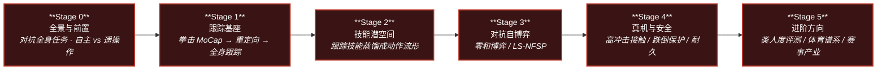

# 路线（纵深）：如果目标是人形拳击（动作跟踪 → 潜空间技能 → 对抗自博弈）

**摘要**：面向"让两台人形机器人在擂台上像人一样对打"的纵深路线，从对抗全身任务的问题定义与自主 / 遥操作两条产品路线出发，经拳击 MoCap 的全身跟踪基座、技能蒸馏到潜空间动作流形，再到两玩家零和博弈的自博弈训练与高冲击真机安全部署，按 Stage 0–5 串通核心方法；本路线是 [运动控制主路线](motion-control.md) 的一条分支。

## 路线一览

## 这条路径怎么用

- 目标读者是已经摸过全身动作跟踪或 RL locomotion、想进入**对抗性全身任务**（对手实时反制、接触不可避免、动作还要像人）的人
- 核心心智模型：拳击不是"会出拳的 locomotion"——对手是**非平稳环境**，直接在关节空间做多智能体 RL 既不稳定也不像人；**先把类人技能压进潜空间、再在潜空间上博弈**才是当前主线
- 每个阶段都有前置知识、核心问题、推荐做什么、推荐读什么、学完输出什么

**和主路线的关系：**
- 本路线是主路线 L5.3（模仿学习）之后的对抗竞技方向：Stage 1 的跟踪基座与 [动作重定向纵深](depth-motion-retargeting.md)、[BFM 纵深](depth-bfm.md) 的 DeepMimic 谱系高度重叠
- 潜空间技能表示是 [BFM 纵深](depth-bfm.md) 的核心对象，本路线聚焦"在这个潜空间上打对抗博弈"
- 对球而不是对人的竞技任务（追球、射门、多机配合）在 [人形足球纵深](depth-humanoid-soccer.md) 展开

---

## Stage 0 全景与前置：对抗全身任务与两条产品路线

**先钉死问题结构：拳击同时叠加了类人动作、实时对抗与全接触三重约束，且存在自主与遥操作两条完全不同的技术路线。**

### 前置知识
- 主路线 L3（RL 基础）与 L5.3（模仿学习）水平
- [模仿学习纵深](depth-imitation-learning.md) Stage 0–2：知道参考动作怎么变成可跟踪的策略

### 核心问题
- 拳击为什么难：对手构成非平稳环境、拳拳到肉的接触不可回避、观众还要求动作像人
- 自主路线（双智能体 RL 互博）与遥操作路线（VR 真人 pilot + 动作映射）各自的技术栈与评价指标
- 动作类人度差距在哪：Motion Turing Test 表明拳击/跳跃/跑步这类动态行为是人形离真人最远的地方

### 推荐做什么
- 对照读 RoboStriker（自主）与 REK（遥操作）两页，列一张"策略来源 / 安全机制 / 评价指标"对照表
- 看一场 REK 或 Unitree 拳击演示录像，标注哪些动作像预设脚本、哪些像实时反应

### 推荐读什么
- [RoboStriker](../wiki/entities/paper-notebook-robostriker.md)（本仓库）— 自主人形拳击的分层决策代表，本路线的锚点论文
- [REK 人形格斗联赛](../wiki/entities/rek.md)（本仓库）— VR 遥操作全接触格斗的产业样本
- [URKL 人形格斗联赛](../wiki/entities/urkl.md)（本仓库）— EngineAI 统一 T800 **自主算法** 格斗联赛
- [Towards Motion Turing Test](../wiki/entities/paper-notebook-towards-motion-turing-test.md)（本仓库）— 拳击类动态行为的类人度差距量化
- [Teleoperation 任务页](../wiki/tasks/teleoperation.md)（本仓库）— 竞技向全身遥操作的谱系位置

### 学完输出什么
- 能说清自主拳击与遥操作格斗是两个不同的问题，各自卡在哪
- 对"类人、对抗、接触"三重约束如何互相牵制有明确的问题地图

---

## Stage 1 跟踪基座：拳击 MoCap → 重定向 → 全身跟踪

**一切从数据开始：先让单台机器人把真人拳击动作（直拳、勾拳、闪避、步法）高保真跟下来。**

### 前置知识
- Stage 0 内容
- [动作重定向纵深](depth-motion-retargeting.md) Stage 0–2 水平（知道 GMR 类重定向管线怎么跑）

### 核心问题
- 拳击 MoCap 的特殊性：出拳速度快、重心转移剧烈、上下肢强耦合，重定向误差直接毁掉发力链
- 全身跟踪策略怎么训：DeepMimic 谱系的跟踪 reward 与课程设计（RoboStriker 用 46 段约 14 分钟 Xsens 数据经 GMR 重定向到 G1）
- 跟踪与风格的边界：什么时候需要 AMP 式风格先验补充逐帧跟踪

### 推荐做什么
- 找一段公开拳击 MoCap（或用视频重建），经 GMR 重定向到 G1 类人形，在仿真里训一个跟踪策略
- 对比"逐帧跟踪 reward"与"跟踪 + AMP 风格"两种训法下出拳动作的力量感差异

### 推荐读什么
- [WBT 专题](../wiki/overview/topic-wbt.md) 与 [Whole-Body Tracking Pipeline](../wiki/concepts/whole-body-tracking-pipeline.md)（本仓库）
- [GMR 重定向](../wiki/methods/motion-retargeting-gmr.md) 与 [Motion Retargeting](../wiki/concepts/motion-retargeting.md)（本仓库）
- [DeepMimic](../wiki/methods/deepmimic.md) 与 [AMP](../wiki/methods/amp-reward.md)（本仓库）
- [Query：人形运动跟踪方法选型](../wiki/queries/humanoid-motion-tracking-method-selection.md)（本仓库）

### 学完输出什么
- 一个能在仿真里跟踪拳击动作片段的全身策略
- 能判断一段拳击动作跟不好时，问题出在重定向、reward 还是课程

---

## Stage 2 技能潜空间：把跟踪技能蒸馏成动作流形

**多智能体博弈不能直接挑电机指令：先把类人技能压缩成一个低维、物理可行的潜空间动作流形。**

### 前置知识
- Stage 1 内容
- 变分自编码 / 对抗蒸馏的基本概念

### 核心问题
- 为什么要潜空间：高层博弈策略在潜空间选"动作意图"，动作天然物理可行又像人，训练也更稳定
- 潜空间怎么构造：RoboStriker 的单位超球面流形、PULSE 的 AMASS 预训练 latent、ASE 的对抗技能嵌入各自的取舍
- 技能覆盖与流形平滑的张力：拳击需要的闪避/步法/组合拳是否都被流形覆盖
- 这一层与 BFM 的关系：拳击潜空间就是一个专项化的行为基础模型

### 推荐做什么
- 把 Stage 1 的多段跟踪技能蒸馏进一个 latent 空间，随机采样 latent 检查解码动作是否全部物理可行
- 在 latent 空间做插值，观察"直拳 → 勾拳"之间的过渡动作是否自然

### 推荐读什么
- [RoboStriker](../wiki/entities/paper-notebook-robostriker.md)（本仓库）— 超球面潜空间动作流形的蒸馏做法
- [ASE](../wiki/methods/ase.md)（本仓库）— 对抗技能嵌入
- [SMPLOlympics](../wiki/entities/smplolympics.md)（本仓库）— PULSE latent 作分层 RL 动作空间的体育任务对照
- [BFM 纵深路线](depth-bfm.md)（本仓库）— 潜空间行为先验的展开版

### 学完输出什么
- 一个覆盖出拳/闪避/步法的潜空间技能流形，附随机采样与插值的可行性检查
- 能说清超球面流形、PULSE latent、ASE 嵌入三种构造的适用场景

---

## Stage 3 对抗自博弈：两玩家零和博弈与 LS-NFSP

**核心战场：把拳击建成两玩家零和马尔可夫博弈，在潜空间上用自博弈逼出攻防策略。**

### 前置知识
- Stage 2 内容
- 博弈论基础：纳什均衡、fictitious play 的直觉

### 核心问题
- 朴素自博弈为什么会循环相克（剪刀石头布式震荡），NFSP / 平均策略怎么稳住
- LS-NFSP：把 Neural Fictitious Self-Play 搬到潜空间后，训练稳定性与动作质量怎么同时保住
- 交替冻结自博弈（SMPLOlympics 击剑/拳击的做法）与并行 NFSP 的取舍
- 对手建模与课程：从固定对手、历史对手池到完整自博弈的渐进路径
- reward 设计：击中/被击中/失衡之外，怎么防止策略退化成"抱团"或"逃跑"

### 推荐做什么
- 在仿真里先跑一个"固定对手 → 历史对手池 → 自博弈"的三段课程，记录策略是否出现循环相克
- 复现一个简化版潜空间自博弈（哪怕 2D 简化模型），对比直接关节空间自博弈的收敛差异

### 推荐读什么
- [RoboStriker](../wiki/entities/paper-notebook-robostriker.md)（本仓库）— LS-NFSP 的完整做法
- [SMPLOlympics](../wiki/entities/smplolympics.md)（本仓库）— 拳击/击剑交替自博弈基线
- [MARL](../wiki/methods/marl.md)（本仓库）— 多智能体训练范式总览
- Bansal et al., *Emergent Complexity via Multi-Agent Competition* — [arXiv:1710.03748](https://arxiv.org/abs/1710.03748)：MuJoCo 人形对抗自博弈起点
- [PhysicsPingPong](../wiki/methods/table-tennis-strategy-skill-learning.md)（本仓库）— agent–agent 对打的邻接样本

### 学完输出什么
- 一个在仿真里能攻防转换的双智能体拳击对局
- 能解释 LS-NFSP 相对朴素自博弈解决了什么、代价是什么

---

## Stage 4 真机与安全：高冲击接触、跌倒保护与硬件耐久

**拳击是故意全接触的任务：被击中、失衡、摔倒是常态而非异常，安全与耐久设计决定能打几个回合。**

### 前置知识
- Stage 3 内容
- 主路线 L6（sim2real）水平

### 核心问题
- 高冲击 sim2real：拳套接触、被击穿扰动的动力学在仿真里怎么建模
- 跌倒保护：检测不可避免的摔倒并切换保护姿态，减少传感器/执行器/结构件损伤
- 力矩与速度限幅、紧急停机：竞技强度与硬件安全的边界怎么划
- 耐久工程：数十 kg 级电驱人形承受反复打击的结构与维护成本（REK 的运营侧经验）

### 推荐做什么
- 给 Stage 3 策略加被击扰动课程与跌倒保护切换，统计真机部署前的仿真损伤指标
- 按 REK 页面的安全监控结构，为自己的系统画一张"限幅 / 保护 / 停机"三层安全架构图

### 推荐读什么
- [SafeFall](../wiki/entities/paper-hrl-stack-41-safefall.md)（本仓库）— 人形跌倒保护控制
- [REK](../wiki/entities/rek.md)（本仓库）— 全接触格斗的安全监控与硬件运营
- [Unitree G1](../wiki/entities/unitree-g1.md)（本仓库）— 主力格斗平台的硬件边界
- [Query：奖励设计指南](../wiki/queries/reward-design-guide.md)（本仓库）— 安全项进 reward 的做法

### 学完输出什么
- 一套含跌倒保护与限幅停机的部署方案
- 能评估一个拳击演示的安全设计是否支撑真机长期对打

---

## Stage 5 进阶方向

### 前置知识
- Stage 4 内容

**方向 A：动作类人度评测**
- 拳击是类人度差距最大的动态行为之一：用统一评测协议量化"像不像人"，反哺技能流形与 reward 设计
- 关键词：[Towards Motion Turing Test](../wiki/entities/paper-notebook-towards-motion-turing-test.md)

**方向 B：快速运动物体交互的体育谱系**
- 从对人（拳击）到对物（羽毛球、乒乓球、足球）：共享"步法 + 时机 + 全身发力"的方法论
- 关键词：[人形羽毛球全身控制](../wiki/entities/paper-notebook-humanoid-whole-body-badminton-via-multi-stage-re.md)、[LHBS 类人羽毛球](../wiki/entities/paper-notebook-learning-human-like-badminton-skills-for-humanoi.md)、[人形足球纵深路线](depth-humanoid-soccer.md)

**方向 C：赛事与产业**
- 自主拳击与 VR 格斗联赛的产品化：售票赛事、机器人租赁与中美并行的格斗联赛叙事
- 关键词：[REK](../wiki/entities/rek.md)、[URKL](../wiki/entities/urkl.md)、[Unitree G1](../wiki/entities/unitree-g1.md)

---

## 快速入口汇总

| 阶段 | 核心问题 | 本仓库入口 |
|------|---------|-----------|
| Stage 0 | 全景与两条路线 | [RoboStriker](../wiki/entities/paper-notebook-robostriker.md) |
| Stage 1 | 跟踪基座 | [Whole-Body Tracking Pipeline](../wiki/concepts/whole-body-tracking-pipeline.md) |
| Stage 2 | 技能潜空间 | [ASE](../wiki/methods/ase.md) |
| Stage 3 | 对抗自博弈 | [SMPLOlympics](../wiki/entities/smplolympics.md) |
| Stage 4 | 真机与安全 | [SafeFall](../wiki/entities/paper-hrl-stack-41-safefall.md) |
| Stage 5 | 进阶方向 | [Towards Motion Turing Test](../wiki/entities/paper-notebook-towards-motion-turing-test.md) |

## 和其他页面的关系

- 完整成长路线参考：[主路线：运动控制算法工程师成长路线](motion-control.md)
- 其它纵深路径：
  - [人形足球（全向行走 → 感知踢球 → 多机战术）](depth-humanoid-soccer.md) — 对球竞技侧的姊妹路线
  - [动作重定向（人体动作 → 机器人参考轨迹）](depth-motion-retargeting.md) — Stage 1 数据管线的展开版
  - [BFM（人形行为基础模型）](depth-bfm.md) — Stage 2 潜空间先验的展开版
  - [模仿学习与技能迁移](depth-imitation-learning.md) — 跟踪基座的方法前置
  - [人形 RL 运动控制](depth-rl-locomotion.md) — RL 训练管线的前置
  - [Loco-Manipulation（移动操作）](depth-loco-manipulation.md)
  - [接触丰富的操作任务](depth-contact-manipulation.md)
  - [感知越障（Perceptive Locomotion）](depth-perceptive-locomotion.md)
  - [导航（SLAM → VLN → 导航 VLA）](depth-navigation.md)
  - [动作生成（文本/多模态 → 人形动作）](depth-motion-generation.md)
  - [VLA（视觉-语言-动作模型）](depth-vla.md)
  - [WAM（世界–动作模型）](depth-wam.md)
  - [力矩控制电机设计（指标 → 电磁热 → FOC 力矩闭环）](depth-torque-motor-design.md)
  - [传统模型控制（LIP/ZMP → MPC → WBC）](depth-classical-control.md)
  - [安全控制（CLF/CBF）](depth-safe-control.md)
  - [Sim2Real（域差画像 → 执行器对齐 → 鲁棒训练 → 真机部署）](depth-sim2real.md)
- 关联知识页：
  - [RoboStriker](../wiki/entities/paper-notebook-robostriker.md)
  - [REK](../wiki/entities/rek.md)
  - [SMPLOlympics](../wiki/entities/smplolympics.md)
  - [Whole-Body Tracking Pipeline](../wiki/concepts/whole-body-tracking-pipeline.md)
  - [MARL](../wiki/methods/marl.md)

## 参考来源

本路线基于以下原始资料的归纳：

- [RoboStriker 摘录](../../sources/papers/humanoid_pnb_robostriker.md)（arXiv:2601.22517）— 跟踪 → 潜空间 → LS-NFSP 的完整分层做法
- [REK 官网归档](../../sources/sites/rek-com.md) — VR 遥操作全接触格斗联赛
- [SMPLOlympics 摘录](../../sources/papers/smplolympics_arxiv_2407_00187.md)（arXiv:2407.00187）— 拳击/击剑交替自博弈基线
- Bansal et al., *Emergent Complexity via Multi-Agent Competition* (2017, arXiv:1710.03748) — MuJoCo 人形对抗自博弈起点
- [Towards Motion Turing Test 摘录](../../sources/papers/humanoid_pnb_towards-motion-turing-test.md) — 拳击类动态行为类人度差距
