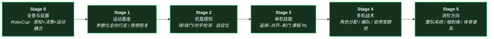

# 路线（纵深）：如果目标是人形足球（全向行走 → 感知踢球 → 多机战术）

**摘要**：面向"让人形机器人追球、射门、打整场比赛"的纵深路线，从 RoboCup 任务全景与感知–决策–运动的耦合问题出发，经参数化全向行走与跌倒恢复的运动基座、球/场地/对手的机载感知，到闭环踢球技能的课程 RL（PAiD / RoboNaldo / 教师–学生蒸馏），再到多机角色分配与战术群控，按 Stage 0–5 串通核心方法；本路线是 [运动控制主路线](motion-control.md) 的一条分支。

## 路线一览

## 这条路径怎么用

- 目标读者是已经能在仿真里训练 locomotion 策略、想把感知、单机技能与多机战术在**同一个比赛任务**里串起来的人
- 核心心智模型：人形足球不是"会走路 + 会踢球"的简单叠加——球在滚、对手在动、通信在限流，**感知–决策–运动必须在同一个闭环里实时协同**，任何一层的延迟或误差都会被比赛放大
- 每个阶段都有前置知识、核心问题、推荐做什么、推荐读什么、学完输出什么

**和主路线的关系：**
- 本路线是主路线 L5（RL / IL）之后偏"综合竞技任务"的应用方向：下身基座依赖 [RL 纵深](depth-rl-locomotion.md)，闭环射门是感知 in-the-loop 的技能学习，与 [感知越障纵深](depth-perceptive-locomotion.md) 同属"感知进策略"谱系
- 单机对抗与自博弈训练在 [人形拳击纵深](depth-humanoid-boxing.md) 展开，本路线聚焦"对球的技能 + 对队友的协作"
- 视觉检测选型等感知工程细节可在 [导航纵深](depth-navigation.md) Stage 0–1 补齐

---

## Stage 0 全景与前置：RoboCup 与感知–决策–运动耦合

**先建立问题意识：为什么足球被当作衡量人形自主能力的综合基准，难点分布在哪几层。**

### 前置知识
- 主路线 L3（RL 基础）水平；[RL 纵深](depth-rl-locomotion.md) Stage 0–2 能在仿真里训练 locomotion 策略
- 对 [强化学习](../wiki/methods/reinforcement-learning.md) 与 [模仿学习](../wiki/methods/imitation-learning.md) 的范式差异有使用级直觉

### 核心问题
- 足球任务的五层挑战：动态感知定位、闭环踢球、参数化全向行走、复杂地面稳定性、多机协作（详见任务页）
- RoboCup 各联赛（Kid/Adult-Size、SPL）的规则约束如何反过来塑造技术路线
- RL 端到端、分层状态机 + 技能库、多机战术三条主流路线各解决什么问题

### 推荐做什么
- 读任务页把五层挑战与三条技术路线过一遍，画一张"感知 / 单机技能 / 战术"分层地图
- 看一场 RoboCup Adult-Size 决赛录像，按分层地图标注每次失误发生在哪一层

### 推荐读什么
- [Humanoid Soccer 任务页](../wiki/tasks/humanoid-soccer.md)（本仓库）— 本路线的任务地图与技术路线总入口
- [Locomotion 任务页](../wiki/tasks/locomotion.md) 与 [人形多机协调](../wiki/concepts/humanoid-multi-robot-coordination.md)（本仓库）
- [Booster RoboCup Demo](../wiki/entities/booster-robocup-demo.md)（本仓库）— 一个完整比赛软件栈长什么样

### 学完输出什么
- 能解释足球为什么比单项 locomotion / 射门难，难在哪一层
- 拿到一个新系统能判断它属于 RL 端到端、分层状态机还是战术层工作

---

## Stage 1 运动基座：参数化全向行走与跌倒恢复

**比赛要求在任意时刻改变速度、频率和航向，还要在碰撞后爬起来继续踢。**

### 前置知识
- Stage 0 内容
- [RL 纵深](depth-rl-locomotion.md) Stage 2 水平：跑通过一个四足/人形 locomotion 训练管线

### 核心问题
- 参数化全向行走：速度/航向/步频命令空间怎么设计，才能支撑防守、截球与过人
- 草坪/人工草皮的不平整地面与对抗碰撞下的鲁棒性课程
- 跌倒恢复（get-up）与行走策略的切换：状态机切换还是统一策略
- 平台选型：Booster T1/K1 与 Unitree G1 的足球生态差异

### 推荐做什么
- 用 [HTWK-Gym](../wiki/methods/htwk-gym.md) 类框架训练一个参数化全向行走策略，测试急停、横移与原地转向
- 给行走策略加推搡与碰撞扰动课程，记录失稳恢复率的变化

### 推荐读什么
- [HTWK-Gym](../wiki/methods/htwk-gym.md)（本仓库）— Booster T1/K1 平台的足球专项 RL 框架
- [Balance Recovery 任务页](../wiki/tasks/balance-recovery.md)（本仓库）— 跌倒恢复谱系
- [Unitree G1](../wiki/entities/unitree-g1.md)（本仓库）— 足球科研的主力平台之一
- [WBC vs RL 对比](../wiki/comparisons/wbc-vs-rl.md)（本仓库）— 运动基座两条路线的取舍

### 学完输出什么
- 一个能接受任意速度/航向命令、被碰撞后能爬起的行走基座
- 能说清"足球用的行走"与"通用 locomotion"在命令空间与课程设计上的差异

---

## Stage 2 机载感知：球、球门、对手与自定位

**机器人必须在快速移动中识别高速滚动的球并实时更新自身位姿——感知是所有上层技能的输入。**

### 前置知识
- Stage 1 内容
- 深度学习目标检测的基本概念

### 核心问题
- 球/球门/边线/对手检测的模型选型：精度、时延与机载算力的三角权衡
- 头部关节协同的广域搜索策略：看哪里、什么时候看
- 机载定位：视觉特征 + 里程计怎么在无外部定位的场地里稳住位姿
- 感知噪声怎么建模进训练，避免 sim2real 时策略被真实检测抖动打崩

### 推荐做什么
- 在机载算力约束下跑通一个球检测模型（YOLO 系或 RF-DETR），测出端到端时延
- 录一段真实球滚动视频，对比检测结果与训练时的噪声假设差多少

### 推荐读什么
- [Object Detection](../wiki/methods/object-detection.md)（本仓库）— 检测方法谱系
- [Query：目标检测模型选型](../wiki/queries/object-detection-model-selection.md) 与 [Query：感知 backbone 选型](../wiki/queries/perception-backbone-selection.md)（本仓库）
- [Vision-Driven Reactive Soccer](../wiki/entities/paper-hrl-stack-26-learning_vision_driven_reactive_socc.md)（本仓库）— 视觉驱动反应式足球技能
- [Booster RoboCup Demo](../wiki/entities/booster-robocup-demo.md)（本仓库）— YOLOv8 感知在整队系统里的位置

### 学完输出什么
- 一条满足时延预算的机载检测 + 定位管线
- 一份"感知噪声 → 训练域随机化参数"的对照表

---

## Stage 3 单机技能：追球、对齐与射门的课程 RL

**本路线的主战场：把"追上球、对齐球、把球踢向目标"学成一个闭环技能并迁移到真机。**

### 前置知识
- Stage 1–2 内容
- [模仿学习纵深](depth-imitation-learning.md) Stage 0–1 水平（知道参考动作怎么进 RL）

### 核心问题
- 闭环踢球 vs 预设轨迹踢球：接近过程中球在动，出脚时机与力度怎么在线修正
- 两条代表路线的取舍：PAiD 的"运动跟踪 → 感知融合 → 物理对齐"渐进融合，与 RoboNaldo 的"单条人类参考 scaffold + 三阶段课程"
- 教师–学生蒸馏：教师用真值状态、学生只用含噪感知，哪些信息可以蒸、哪些必须重学
- 射门精度与球速怎么进 reward 而不牺牲步态稳定

### 推荐做什么
- 复现一条踢球课程：先真值状态学定向踢球，再蒸馏到只用机载感知的学生策略
- 逐项消融：去掉运动参考、去掉噪声建模、去掉课程分段，记录哪个环节掉点最狠

### 推荐读什么
- [Query：人形足球技能学习方法选型](../wiki/queries/humanoid-soccer-skill-learning-method-selection.md)（本仓库）— PAiD vs RoboNaldo 选型总入口
- [PAiD Framework](../wiki/methods/paid-framework.md) 与 [Learning Soccer Skills for Humanoid Robots](../wiki/entities/paper-notebook-learning-soccer-skills-for-humanoid-robots.md)（本仓库）— 渐进感知–动作融合，G1 真机 91.3% 踢球成功率
- [RoboNaldo](../wiki/entities/paper-robonaldo-humanoid-soccer-shooting.md)（本仓库）— 亚米级定点射门与 13 m/s 级触球球速
- [Learning Agile Striker Skills](../wiki/entities/paper-notebook-learning-agile-striker-skills-for-humanoid-socce.md)（本仓库）— 四阶段教师–学生蒸馏
- [Query：奖励设计指南](../wiki/queries/reward-design-guide.md)（本仓库）

### 学完输出什么
- 一个能在仿真里完成"追球 → 对齐 → 定向射门"的闭环技能，含教师–学生蒸馏版本
- 对"渐进融合"与"参考 scaffold 课程"两条路线的成本收益判断

---

## Stage 4 多机战术：角色分配、编队与低带宽群控

**单机会射门只解决一半问题：谁去踢、谁留守、如何避免工友扎堆，是战术层的正交能力。**

### 前置知识
- Stage 3 内容
- 多智能体 RL 的基本概念（CTDE、通信约束）

### 核心问题
- 集中式行为管理（behavior planner 分配角色）与去中心化 swarm（ACO 角色 + flocking 编队）的边界
- RoboCup 通信配额持续收紧下，极低带宽协调（市场拍卖、预测替代通信）怎么做
- 学习式 MARL 与规则式战术的组合：哪些层适合学、哪些层适合写
- 战术层与单机技能层的接口：给技能层下发什么粒度的命令

### 推荐做什么
- 在仿真里搭一个 2v2 对抗：先用规则式角色分配跑基线，再换成去中心化角色协商，对比进球与扎堆率
- 读 ARTEMIS 的 behavior planner 结构，画出"感知 → 战术 → 技能"的信息流图

### 推荐读什么
- [人形多机协调](../wiki/concepts/humanoid-multi-robot-coordination.md)（本仓库）— 群控范式总览
- [ARTEMIS 冠军系统](../wiki/entities/paper-notebook-a-hierarchical-model-based-system-for-high-perfo.md)（本仓库）— 集中式战术层，RoboCup 2024 Adult-Size 冠军
- [Swarm Intelligence 人形足球](../wiki/entities/paper-humanoid-soccer-swarm-intelligence.md)（本仓库）— 去中心化 4v4 对照
- [MARL](../wiki/methods/marl.md) 与 [CTDE vs 去中心化 MARL](../wiki/comparisons/ctde-vs-decentralized-marl.md)（本仓库）
- [SPL 极低带宽协调](../../sources/papers/robocup_spl_limited_communication_coordination_arxiv_2401_15026.md)（本仓库 sources）

### 学完输出什么
- 一个 2v2 仿真对抗里可运行的角色分配 + 编队方案
- 能说清集中式 / 去中心化 / 拍卖三种群控在通信预算轴上的适用区间

---

## Stage 5 进阶方向

### 前置知识
- Stage 4 内容

**方向 A：整队系统栈与赛事工程**
- 把感知、技能、战术、通信串成能打完整场比赛的工程系统，处理裁判信号、换人与异常恢复
- 关键词：[Booster RoboCup Demo](../wiki/entities/booster-robocup-demo.md)、[ARTEMIS](../wiki/entities/paper-notebook-a-hierarchical-model-based-system-for-high-perfo.md)

**方向 B：端到端与生成式路线**
- 从分层管线走向端到端：扩散模型直接从比赛录像学"感知 → 动作"
- 关键词：[SoccerDiffusion](../wiki/entities/paper-notebook-soccerdiffusion-toward-learning-end-to-end-human.md)、[HumanoidArena](../wiki/entities/paper-humanoidarena.md)（Football 任务）

**方向 C：仿真体育基准与对抗训练**
- 在统一仿真人形上做足球 1v1/2v2 与交替自博弈，对照 PPO / AMP / PULSE 基线
- 关键词：[SMPLOlympics](../wiki/entities/smplolympics.md)、[人形拳击纵深路线](depth-humanoid-boxing.md)（对抗自博弈的展开版）

**方向 D：竞技体育技能谱系**
- 足球之外的快速运动物体交互：羽毛球、乒乓球共享"步法 + 击球时机"的方法论
- 关键词：[人形羽毛球全身控制](../wiki/entities/paper-notebook-humanoid-whole-body-badminton-via-multi-stage-re.md)、[PhysicsPingPong](../wiki/methods/table-tennis-strategy-skill-learning.md)

---

## 快速入口汇总

| 阶段 | 核心问题 | 本仓库入口 |
|------|---------|-----------|
| Stage 0 | 任务全景与耦合 | [Humanoid Soccer 任务页](../wiki/tasks/humanoid-soccer.md) |
| Stage 1 | 运动基座 | [HTWK-Gym](../wiki/methods/htwk-gym.md) |
| Stage 2 | 机载感知 | [目标检测模型选型](../wiki/queries/object-detection-model-selection.md) |
| Stage 3 | 单机踢球技能 | [足球技能学习方法选型](../wiki/queries/humanoid-soccer-skill-learning-method-selection.md) |
| Stage 4 | 多机战术 | [人形多机协调](../wiki/concepts/humanoid-multi-robot-coordination.md) |
| Stage 5 | 进阶方向 | [SMPLOlympics](../wiki/entities/smplolympics.md) |

## 和其他页面的关系

- 完整成长路线参考：[主路线：运动控制算法工程师成长路线](motion-control.md)
- 其它纵深路径：
  - [遥操作（人形全身遥操作 + 手指遥操作 → 示范数据/实时接管）](depth-teleoperation.md)
  - [人形拳击（动作跟踪 → 潜空间技能 → 对抗自博弈）](depth-humanoid-boxing.md) — 对抗自博弈侧的姊妹路线
  - [人形 RL 运动控制](depth-rl-locomotion.md) — 运动基座的训练侧前置
  - [感知越障（Perceptive Locomotion）](depth-perceptive-locomotion.md) — "感知进策略"的邻接路线
  - [模仿学习与技能迁移](depth-imitation-learning.md) — 参考动作进 RL 的前置
  - [导航（SLAM → VLN → 导航 VLA）](depth-navigation.md) — 感知与定位工程的邻接路线
  - [Loco-Manipulation（移动操作）](depth-loco-manipulation.md)
  - [接触丰富的操作任务](depth-contact-manipulation.md)
  - [动作重定向（人体动作 → 机器人参考轨迹）](depth-motion-retargeting.md)
  - [动作生成（文本/多模态 → 人形动作）](depth-motion-generation.md)
  - [BFM（人形行为基础模型）](depth-bfm.md)
  - [VLA（视觉-语言-动作模型）](depth-vla.md)
  - [WAM（世界–动作模型）](depth-wam.md)
  - [力矩控制电机设计（指标 → 电磁热 → FOC 力矩闭环）](depth-torque-motor-design.md)
  - [传统模型控制（LIP/ZMP → MPC → WBC）](depth-classical-control.md)
  - [安全控制（CLF/CBF）](depth-safe-control.md)
  - [Sim2Real（域差画像 → 执行器对齐 → 鲁棒训练 → 真机部署）](depth-sim2real.md)
  - [Real2Sim（真实世界 → 可仿真资产/场景/孪生）](depth-real2sim.md)
  - [人形群控展演（群舞同步 → 编队走位 → 群体特技）](depth-humanoid-swarm-performance.md)
- 关联知识页：
  - [Humanoid Soccer 任务页](../wiki/tasks/humanoid-soccer.md)
  - [人形多机协调](../wiki/concepts/humanoid-multi-robot-coordination.md)
  - [PAiD Framework](../wiki/methods/paid-framework.md)
  - [HTWK-Gym](../wiki/methods/htwk-gym.md)
  - [MARL](../wiki/methods/marl.md)

## 参考来源

本路线基于以下原始资料的归纳：

- [Humanoid Soccer 任务页](../wiki/tasks/humanoid-soccer.md) 与 [人形多机协调](../wiki/concepts/humanoid-multi-robot-coordination.md)
- 首届 RoboCup（Nagoya, 1997）— 人形足球方向的赛事起点；RoboCup 2050 目标为整队人形对阵人类世界杯冠军
- "RoboNaldo" (arXiv:2606.11092) — 射门课程 RL 代表
- [PAiD / Learning Soccer Skills for Humanoid Robots](../wiki/entities/paper-notebook-learning-soccer-skills-for-humanoid-robots.md) — 渐进感知–动作融合代表
- [ARTEMIS](../wiki/entities/paper-notebook-a-hierarchical-model-based-system-for-high-perfo.md) (arXiv:2512.09431) — RoboCup 2024 Adult-Size 冠军系统
