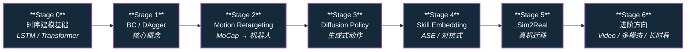

# 路线（纵深）：如果目标是模仿学习与技能迁移

**摘要**：面向"从人类演示数据让机器人学习技能"的纵深路线，从时序建模基础到 ASE / Diffusion Policy，按 Stage 0–6 串通核心方法；本路线是 [运动控制主路线](motion-control.md) 的一条分支。

## 路线一览

## 这条路径怎么用

- 目标读者是有深度学习基础、想理解如何让机器人从人类演示中学习技能的人
- 重点不是理论证明，而是：从数据到策略的完整 pipeline
- 每个阶段都有前置知识、核心问题、推荐做什么、推荐读什么、学完输出什么

**和主路线的关系：**
- 模仿学习（IL）和强化学习（RL）在很多实际项目里是组合使用，不是非此即彼
- 本路径和 [RL 纵深](depth-rl-locomotion.md) 在 Stage 3 之后有很多交叉
- 如果你不知道该走哪条，先走 IL 路径，因为它更容易出可感知的结果

---

## Stage 0 深度学习与时序建模基础

**如果已经有 PyTorch 熟练度和序列模型基础，可以跳过。**

### 前置知识
- Python 熟练
- 理解 MLP、loss、梯度反向传播
- 知道什么叫监督学习

### 核心问题
- 序列数据（关节角、MoCap、动作）怎么用神经网络建模
- RNN / LSTM / Transformer 在时序建模上的核心区别是什么
- diffusion model 在生成式建模里是什么角色

### 推荐做什么
- 用 PyTorch 跑一个 LSTM 预测简单时序数据的 Demo
- 对比 MLP 和 LSTM 在时序任务上的表现差异

### 推荐读什么
- "Illustrated Guide to LSTM" (Google Blog)
- [Transformer](../wiki/concepts/transformer.md) 与 [Diffusion Model](../wiki/concepts/diffusion-model.md)（本仓库）
- 跑通一个 Motion Transformer 官方 Demo（如果能访问）

### 学完输出什么
- 能解释为什么时序数据需要特殊建模方法
- 能用 LSTM 对简单序列做预测

---

## Stage 1 模仿学习核心概念

### 前置知识
- Stage 0 内容
- 理解什么是监督学习

### 核心问题
- Behavior Cloning 的核心思想是什么
- 为什么 BC 会有 compounding error（复合累积误差）
- DAgger 为什么能缓解 compounding error
- 模仿学习和强化学习的根本区别是什么

### 推荐做什么
- 用 BC 训练一个简单机械臂跟随演示轨迹
- 对比 BC 和 DAgger 在长时程任务上的效果差异

### 推荐读什么
- "A Reduction of Imitation Learning and Stochastic Gradient Descent to Online Learning" (Ross & Bagnell, 2010)
- [Imitation Learning](../wiki/methods/imitation-learning.md)（本仓库）
- [Behavior Cloning](../wiki/methods/behavior-cloning.md) 与 [DAgger](../wiki/methods/dagger.md)（本仓库）
- [RL vs IL 对比](../wiki/comparisons/rl-vs-il.md)（本仓库）

### 学完输出什么
- 能解释 compounding error 是什么、为什么出现
- 能在简单任务里用 BC 训练一个可用的策略

---

## Stage 2 Motion Retargeting（动作迁移）

**这是人形机器人技能学习的核心技术：从人类动作到机器人动作。**

### 前置知识
- Stage 1 内容
- 理解 kinematics 和 inverse kinematics 基础

### 核心问题
- 为什么不能直接把人类关节角度映射到机器人（骨骼结构不同）
- 怎么用 IK 或 learning-based 方法做 retargeting
- 人体动作数据的不同来源（MoCap、VRI、视频）各有什么优缺
- retargeting 后的数据还需要哪些后处理（时间对齐、重采样、姿态约束）

### 推荐做什么
- 用一套 MoCap 数据，通过 IK 或 retargeting 方法迁移到人形机器人模型上
- 观察迁移后动作的可行性（关节限位、自碰撞、地面穿透）

### 推荐读什么
- [Motion Retargeting](../wiki/concepts/motion-retargeting.md) 与 [Motion Retargeting Pipeline](../wiki/concepts/motion-retargeting-pipeline.md)（本仓库）
- [GMR vs NMR vs ReACTOR 重定向方案对比](../wiki/comparisons/gmr-vs-nmr-vs-reactor.md)（本仓库）
- [人形参考动作数据集对比](../wiki/comparisons/humanoid-reference-motion-datasets.md)（本仓库）
- "ASE: Adversarial Skill Embeddings" (Peng et al., 2022) — 有 retargeting pipeline 描述

### 学完输出什么
- 一段成功 retargeting 到人形机器人模型上的人类走路数据
- 对骨骼结构差异导致的问题有第一手直觉

---

## Stage 3 Diffusion Policy 与生成式动作

**Diffusion Policy 是 2023-2024 年在机器人模仿学习里最活跃的方向。**

### 前置知识
- Stage 2 内容
- 理解 diffusion model 的基本原理（不需要能写，但需要懂去噪过程）

### 核心问题
- Diffusion Policy 和传统 BC 的核心区别是什么
- 为什么 diffusion model 在高维动作空间表现更好
- 怎么把视觉输入结合进 diffusion policy
- diffusion 采样时间过长怎么解决

### 推荐做什么
- 用一个开源 Diffusion Policy 实现（如 RoboDiff、Diffusion Policy 官方）跑一个简单任务
- 对比 diffusion policy 和 LSTM BC 在同样任务上的效果

### 推荐读什么
- "Diffusion Policy: Visuomotor Policy Learning via Action Diffusion" (Chi et al., 2023)
- [Diffusion Policy](../wiki/methods/diffusion-policy.md)（本仓库）
- [Action Chunking](../wiki/methods/action-chunking.md) 与 [BC with Transformer](../wiki/methods/bc-with-transformer.md)（本仓库）— ACT 一系的核心机制

### 学完输出什么
- 一个用 Diffusion Policy 训练的动作策略
- 能解释 diffusion process 在机器人动作生成里的优势

---

## Stage 4 技能嵌入与对抗式学习

**单个技能会了，怎么让机器人同时掌握多个技能、并在新场景里组合？**

### 前置知识
- Stage 3 内容

### 核心问题
- 什么是 skill embedding，为什么需要把技能压缩到隐空间
- 对抗式模仿学习（ASE）和普通 BC 的区别是什么
- 怎么在一个隐空间里做技能插值和组合
- 为什么 latent variable 能帮助解决 compounding error

### 推荐做什么
- 读懂 ASE 的方法 pipeline
- 在能找到的开源代码上跑一个 two-skill interpolation 实验

### 推荐读什么
- [ASE](../wiki/methods/ase.md) 与 [AMP Reward](../wiki/methods/amp-reward.md)（本仓库）
- [Learning from Play (LMP)](../wiki/methods/learning-from-play-lmp.md)（本仓库）
- [人形 AMP / Motion Prior 综述地图](../wiki/overview/humanoid-amp-motion-prior-survey.md)（本仓库）— AMP 家族全景
- "Learning Latent Plans from Play" (Lynch et al., 2020)

### 学完输出什么
- 能解释 skill embedding 的意义
- 对对抗式学习方法在机器人技能学习里的作用有直观理解

---

## Stage 5 仿真到真实迁移

**模仿学习训练的策略，迁移到真实机器人上会遇到哪些问题？**

### 前置知识
- Stage 4 内容
- 理解 sim2real gap 的基本概念

### 核心问题
- IL 训练数据和真实机器人动作空间的差异怎么处理
- 观测空间不匹配（相机角度、传感器噪声）怎么处理
- 在线微调（online fine-tuning）对 IL 策略有没有用
- 怎么判断一个 IL 策略是"真的学会了"还是"在记忆演示"

### 推荐做什么
- 给 Stage 2/3 训练的策略加动作空间噪声和观测噪声，观察鲁棒性
- 设计一个简单的 domain randomization 实验

### 推荐读什么
- [Sim2Real](../wiki/concepts/sim2real.md)（本仓库）
- [Domain Randomization](../wiki/concepts/domain-randomization.md)（本仓库）

### 学完输出什么
- 对 IL 策略的 sim2real 差距有第一手认识
- 能设计针对性的 DR 实验来提升策略鲁棒性

---

## Stage 6 进阶方向

### 前置知识
- Stage 5 内容

**方向 A：Video-based IL**
- 用 RGB 视频而非 MoCap 做动作迁移
- 关键词：Pose estimation、Video imitation、[Mimic-Video](../wiki/methods/mimic-video.md)、[WiLoR](../wiki/methods/wilor.md)

**方向 B：Multi-modal IL**
- 结合视觉、触觉、力传感器做多模态技能学习
- 关键词：multimodal、haptic、[视触融合](../wiki/concepts/visuo-tactile-fusion.md)

**方向 C：Long-horizon 任务 / VLA**
- 把多个技能串成一个长序列；用语言指令驱动技能组合
- 关键词：task planning、skill chaining、[VLA](../wiki/methods/vla.md)、[π0](../wiki/methods/π0-policy.md)

**方向 D：Humanoid 全身动作跟踪**
- 走路、跑步、跳跃、平衡等全身技能跟踪
- 关键词：[Whole-Body Tracking Pipeline](../wiki/concepts/whole-body-tracking-pipeline.md)、[BeyondMimic](../wiki/methods/beyondmimic.md)、[Sonic](../wiki/methods/sonic-motion-tracking.md)
- 选型参考：[Query：人形动作跟踪方法选型](../wiki/queries/humanoid-motion-tracking-method-selection.md)

---

## 快速入口汇总

| 阶段 | 核心问题 | 本仓库入口 |
|------|---------|-----------|
| Stage 0 | 时序建模基础 | [Transformer](../wiki/concepts/transformer.md) |
| Stage 1 | BC / DAgger | [Behavior Cloning](../wiki/methods/behavior-cloning.md) |
| Stage 2 | Motion Retargeting | [Motion Retargeting Pipeline](../wiki/concepts/motion-retargeting-pipeline.md) |
| Stage 3 | Diffusion Policy | [Diffusion Policy](../wiki/methods/diffusion-policy.md) |
| Stage 4 | Skill Embedding | [ASE](../wiki/methods/ase.md) |
| Stage 5 | Sim2Real | [Sim2Real](../wiki/concepts/sim2real.md) |

## 和其他页面的关系

- 完整成长路线参考：[主路线：运动控制算法工程师成长路线](motion-control.md)
- 其它纵深路径：
  - [人形 RL 运动控制](depth-rl-locomotion.md)
  - [力矩控制电机设计（指标 → 电磁热 → FOC 力矩闭环）](depth-torque-motor-design.md)
  - [传统模型控制（LIP/ZMP → MPC → WBC）](depth-classical-control.md)
  - [安全控制（CLF/CBF）](depth-safe-control.md)
  - [接触丰富的操作任务](depth-contact-manipulation.md)
  - [感知越障（Perceptive Locomotion）](depth-perceptive-locomotion.md)
  - [导航（SLAM → VLN → 导航 VLA）](depth-navigation.md)
  - [Loco-Manipulation（移动操作）](depth-loco-manipulation.md)
  - [动作重定向（人体动作 → 机器人参考轨迹）](depth-motion-retargeting.md) — Stage 2 的展开版
  - [动作生成（文本/多模态 → 人形动作）](depth-motion-generation.md) — Stage 3 生成式建模在人体动作侧的展开版
  - [VLA（视觉-语言-动作模型）](depth-vla.md) — Stage 6 方向 C 的展开版
  - [WAM（世界–动作模型）](depth-wam.md)
  - [BFM（人形行为基础模型）](depth-bfm.md) — Stage 6 方向 D 的展开版
- 人形控制全景图：[Humanoid Control Roadmap](../wiki/roadmaps/humanoid-control-roadmap.md)
- 技术栈地图：[tech-map/dependency-graph.md](../tech-map/dependency-graph.md)

## 参考来源

本路线基于以下原始资料的归纳：

- [Imitation Learning](../wiki/methods/imitation-learning.md)
- [Behavior Cloning](../wiki/methods/behavior-cloning.md)
- [DAgger](../wiki/methods/dagger.md)
- [Motion Retargeting](../wiki/concepts/motion-retargeting.md)
- "Diffusion Policy" (Chi et al., 2023)
- "ASE: Adversarial Skill Embeddings" (Peng et al., 2022)
