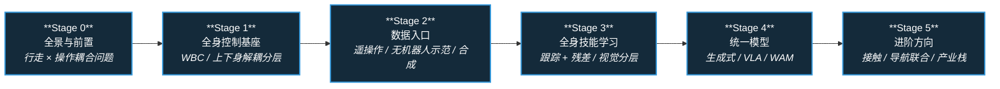

# 路线（纵深）：如果目标是 Loco-Manipulation（移动操作）

**摘要**：面向"让机器人边走边动手（搬箱、开门、端托盘）"的纵深路线，从行走与操作的全身耦合问题出发，经全身控制基座、遥操作与数据采集、全身技能学习，到统一生成式模型与导航–操作联合，按 Stage 0–5 串通核心方法；本路线是 [运动控制主路线](motion-control.md) 的一条分支。

## 路线一览

## 这条路径怎么用

- 目标读者是已经分别摸过 locomotion 和 manipulation、想把两者在动力学与控制层面真正耦合起来的人
- 核心心智模型：移动操作不是"行走 + 操作"的简单叠加——手臂运动会干扰质心平衡，步态振动会干扰操作精度，**全身协调层**才是主角
- 每个阶段都有前置知识、核心问题、推荐做什么、推荐读什么、学完输出什么

**和主路线的关系：**
- 本路线是主路线 L4（WBC）与 L5（RL / IL）之后的综合应用方向，对应 L7.3 操作层的全身化扩展
- 上肢精细接触问题在 [接触操作纵深](depth-contact-manipulation.md) 展开，本路线聚焦"移动中的操作"
- 高层语义接口（听懂"把箱子搬到厨房"）依赖 [VLA 纵深](depth-vla.md)，全身行为先验依赖 [BFM 纵深](depth-bfm.md)

---

## Stage 0 全景与前置：行走 × 操作的耦合问题

**先建立问题意识：为什么"独立优化行走和操作再简单合并"通常不可行。**

### 前置知识
- 主路线 L2–L4 水平：理解浮动基动力学、质心动力学与 WBC 的基本概念
- 分别跑过一个 locomotion 策略和一个桌面操作策略（仿真即可）

### 核心问题
- 全身动力学耦合：手臂运动如何干扰质心平衡、步态如何干扰末端精度
- 接触丰富与多约束：足端地形接触与末端物体接触怎么并发管理
- 移动操作任务谱系：家务 / 体育 / 极端环境 / 人机协作各自考验什么能力

### 推荐做什么
- 在仿真里给行走中的人形加一个 2 kg 手持负载，观察不做补偿时的失稳模式
- 读任务页把 2024–2026 技术路线（分层 / 生成式 / VLA / 残差 / 触觉增强）过一遍，画一张自己的分类表

### 推荐读什么
- [Loco-Manipulation 任务页](../wiki/tasks/loco-manipulation.md)（本仓库）— 本路线的任务地图与技术路线总入口
- [Whole-Body Control](../wiki/concepts/whole-body-control.md) 与 [Whole-Body Coordination](../wiki/concepts/whole-body-coordination.md)（本仓库）
- [Manipulation 任务地图](../wiki/tasks/manipulation.md) 与 [Humanoid Locomotion](../wiki/tasks/humanoid-locomotion.md)（本仓库）
- [ULTRA 统一移动操作综述](../wiki/tasks/ultra-survey.md)（本仓库）

### 学完输出什么
- 能解释移动操作为什么比"行走 + 操作"难，难在哪一层
- 拿到一篇新论文能判断它属于分层、生成式、VLA 还是残差路线

---

## Stage 1 全身控制基座：WBC 与上下身解耦分层

**工程上最常见的第一步：下身管平衡与行走，上身管操作目标，中间用接口解耦。**

### 前置知识
- Stage 0 内容
- [RL 纵深路线](depth-rl-locomotion.md) Stage 0–2 水平：能在仿真里训练 locomotion 策略

### 核心问题
- 经典分层（HLC 给末端目标 + LLC 全身执行）与端到端全身策略的取舍
- HOMIE / FALCON 一系上下身解耦的接口设计：上身关节目标 + 下身速度/姿态命令
- 感知怎么进低层：高程图 / 深度如何让 LLC 在楼梯与非结构化地形上稳住操作（PILOT）
- 力交互场景（推重物、拖拽）下 MPC 与 RL 怎么组合

### 推荐做什么
- 复现一个上下身解耦的开源工作（如 HOMIE 思路）：下身 RL 行走 + 上身关节直接跟踪
- 对比"上身固定 / 上身随机动作"两种课程下，下身策略的抗扰能力

### 推荐读什么
- [HOMIE](../wiki/entities/paper-loco-manip-161-040-homie.md) 与 [FALCON](../wiki/entities/paper-loco-manip-161-109-falcon.md)（本仓库）— 上下身解耦锚点
- [PILOT](../wiki/entities/paper-pilot-perceptive-loco-manipulation.md)（本仓库）— 感知统一低层 LLC
- [运动基座与全身跟踪（loco-manip 161 分类）](../wiki/overview/loco-manip-161-category-01-motion-base-wbt.md) 与 [上身接口](../wiki/overview/loco-manip-161-category-02-upper-body-interface.md)（本仓库）
- [MPC-WBC 集成](../wiki/concepts/mpc-wbc-integration.md)（本仓库）

### 学完输出什么
- 一个"下身行走 + 上身跟踪"的分层全身控制 demo
- 能说清解耦接口（关节 / 末端 / 速度命令）各自的表达力边界

---

## Stage 2 数据入口：遥操作、无机器人示范与合成数据

**移动操作的数据比桌面操作贵一个量级：全身遥操作、可穿戴采集与合成生成是三大入口。**

### 前置知识
- Stage 1 内容

### 核心问题
- 全身遥操作的方案谱系：外骨骼 / VR / 动捕，各自的带宽与成本
- 无机器人示范（UMI 一系、可穿戴设备）怎么绕过昂贵的真机采集
- 合成数据路线：单条演示怎么扩成千条轨迹（HumanoidMimicGen）、3DGS 合成怎么替代遥操作（LEGS）
- 人类视频（egocentric）到机器人动作的映射还差什么

### 推荐做什么
- 用键盘 / VR 在仿真里遥操作一个人形完成"走过去 + 拿起箱子"，感受接口带宽瓶颈
- 读 HumanoidMimicGen 的技能片段适配管线，画出"1 条演示 → 1000 条轨迹"的数据流图

### 推荐读什么
- [Teleoperation 任务页](../wiki/tasks/teleoperation.md)（本仓库）
- [数据与遥操作（loco-manip 161 分类）](../wiki/overview/loco-manip-161-category-07-data-teleop.md) 与 [Loco-Manip 8 篇数据入口技术地图](../wiki/overview/loco-manip-8-papers-technology-map.md)（本仓库）
- [HumanoidMimicGen](../wiki/entities/paper-humanoidmimicgen.md) 与 [LEGS](../wiki/entities/paper-legs-embodied-gaussian-splatting-vla.md)（本仓库）
- [HALOMI](../wiki/entities/paper-halomi-humanoid-loco-manipulation.md)（本仓库）— 主动感知 + 无机器人示范

### 学完输出什么
- 能为给定预算（有 / 无真机、有 / 无动捕）选出可行的数据采集方案
- 一份自己任务上的数据入口对比笔记（遥操作 / 无机器人示范 / 合成）

---

## Stage 3 全身技能学习：跟踪 + 残差与视觉分层

**有了数据和基座，怎么把"搬箱子、开门"这类全身技能真正学出来并迁移到真机。**

### 前置知识
- Stage 2 内容
- [模仿学习纵深](depth-imitation-learning.md) Stage 2–3 水平（retargeting 与 Diffusion Policy）

### 核心问题
- 预训练全身先验 + 物体条件残差（ResMimic）为什么比从零训任务策略高效
- 视觉分层 sim2real（VisualMimic）：关键点跟踪低层 + 深度 visuomotor 高层怎么切
- 负载与动力学变化怎么在线适配（SplitAdapter 的因子化 latent）
- 全身模仿的数据侧技巧：上身全库 + 下身精选库（CWI）解决什么问题

### 推荐做什么
- 在开源全身跟踪基座（GMT / SONIC 类）上加一个物体条件残差任务，跑通仿真搬箱
- 逐项消融：去掉预训练先验、去掉残差、去掉物体观测，记录哪个环节掉点最狠

### 推荐读什么
- [ResMimic](../wiki/entities/paper-resmimic.md) 与 [VisualMimic](../wiki/entities/paper-notebook-visualmimic.md)（本仓库）
- [CWI](../wiki/entities/paper-cwi-composite-humanoid-whole-body-imitation.md) 与 [CoorDex](../wiki/entities/paper-coordex-dexterous-humanoid-loco-manipulation.md)（本仓库）
- [SplitAdapter](../wiki/entities/paper-splitadapter-load-aware-loco-manipulation.md)（本仓库）
- [Whole-Body Tracking Pipeline](../wiki/concepts/whole-body-tracking-pipeline.md)（本仓库）

### 学完输出什么
- 一个能在仿真里完成"走近 + 全身接触搬运"的技能策略
- 对"先验 + 残差"与"从零端到端"两条路线的成本收益判断

---

## Stage 4 统一模型：生成式、VLA 与 WAM

**前沿主战场：把视觉、语言和全身动作放进一个模型，或用世界模型联合预测未来与动作。**

### 前置知识
- Stage 3 内容
- [VLA 纵深](depth-vla.md) Stage 2 水平（知道 VLA 的三段式结构）

### 核心问题
- 统一生成式路线（diffusion / flow matching 全身序列）与分层路线的边界在哪
- 移动操作 WAM 怎么把"预测未来"与"移动 / 操作双动作头"联合（ABot-M0.5、MotionWAM）
- 统一全身 motion token 为什么能让腿执行任务驱动行为（踩踏板、踢球）
- VLA 扩展到全身移动操作还缺什么（数据、频率、安全）

### 推荐做什么
- 读 MotionWAM / ABot-M0.5 的架构图，标出"世界预测"与"动作生成"的信息流交汇点
- 用一个开源 VLA 在移动操作仿真基准（RoboCasa 类）上跑评测，记录失败模式

### 推荐读什么
- [VLA 与世界模型（loco-manip 161 分类）](../wiki/overview/loco-manip-161-category-09-vla-world-models.md)（本仓库）
- [MotionWAM](../wiki/entities/paper-motionwam-humanoid-loco-manipulation-wam.md) 与 [ABot-M0.5](../wiki/entities/paper-abot-m05-mobile-manipulation-wam.md)（本仓库）
- [World Action Models（WAM）](../wiki/concepts/world-action-models.md) 与 [VLA](../wiki/methods/vla.md)（本仓库）
- [人形 Loco-Manip 161 篇技术地图](../wiki/overview/humanoid-loco-manip-161-papers-technology-map.md)（本仓库）— 十类能力形成顺序全景

### 学完输出什么
- 能画出"分层 / 生成式 / VLA / WAM"四条路线的架构对比图
- 一份移动操作基准上的 VLA 评测与失败模式分析

---

## Stage 5 进阶方向

### 前置知识
- Stage 4 内容

**方向 A：接触丰富的全身交互**
- 从"搬规则箱子"到倚靠、翻越、多点接触交互
- 关键词：[Loco-Manip 接触五段链路技术地图](../wiki/overview/loco-manip-contact-technology-map.md)、[接触操作纵深路线](depth-contact-manipulation.md)

**方向 B：导航–操作联合**
- 开放词汇移动操作（OVMM）：导航到哪、以什么姿态到，直接决定操作成败
- 关键词：[3D-IC](../wiki/entities/paper-3d-ic-joint-navigation-manipulation-planning.md)、[导航纵深路线](depth-navigation.md)

**方向 C：触觉与力觉增强**
- 把接触信号纳入全身策略，而不是只靠视觉与本体感受
- 关键词：[Humanoid Transformer with Touch Dreaming](../wiki/methods/humanoid-transformer-touch-dreaming.md)、[视触融合](../wiki/concepts/visuo-tactile-fusion.md)

**方向 D：产业级长程自主栈**
- 跟踪工业界把移动操作串成长时程任务的整机方案
- 关键词：[Flexion Reflect v1.0](../wiki/entities/flexion-reflect-v1.md)、[Curr-0](../wiki/entities/current-robotics-curr0.md)

---

## 快速入口汇总

| 阶段 | 核心问题 | 本仓库入口 |
|------|---------|-----------|
| Stage 0 | 行走 × 操作耦合 | [Loco-Manipulation 任务页](../wiki/tasks/loco-manipulation.md) |
| Stage 1 | 全身控制基座 | [HOMIE](../wiki/entities/paper-loco-manip-161-040-homie.md) |
| Stage 2 | 数据入口 | [Loco-Manip 8 篇数据入口技术地图](../wiki/overview/loco-manip-8-papers-technology-map.md) |
| Stage 3 | 全身技能学习 | [ResMimic](../wiki/entities/paper-resmimic.md) |
| Stage 4 | 统一模型 | [人形 Loco-Manip 161 篇技术地图](../wiki/overview/humanoid-loco-manip-161-papers-technology-map.md) |
| Stage 5 | 进阶方向 | [Loco-Manip 接触五段链路技术地图](../wiki/overview/loco-manip-contact-technology-map.md) |

## 和其他页面的关系

- 完整成长路线参考：[主路线：运动控制算法工程师成长路线](motion-control.md)
- 其它纵深路径：
  - [接触丰富的操作任务](depth-contact-manipulation.md) — 上肢精细接触侧的展开版
  - [人形 RL 运动控制](depth-rl-locomotion.md) — 下身基座的训练侧前置
  - [模仿学习与技能迁移](depth-imitation-learning.md) — 数据与技能学习的前置
  - [VLA（视觉-语言-动作模型）](depth-vla.md) — Stage 4 语义接口的展开版
  - [WAM（世界–动作模型）](depth-wam.md)
  - [BFM（人形行为基础模型）](depth-bfm.md) — 全身行为先验的展开版
  - [导航（SLAM → VLN → 导航 VLA）](depth-navigation.md) — Stage 5 方向 B 的邻接路线
  - [动作重定向（人体动作 → 机器人参考轨迹）](depth-motion-retargeting.md)
  - [动作生成（文本/多模态 → 人形动作）](depth-motion-generation.md)
  - [力矩控制电机设计（指标 → 电磁热 → FOC 力矩闭环）](depth-torque-motor-design.md)
  - [传统模型控制（LIP/ZMP → MPC → WBC）](depth-classical-control.md)
  - [安全控制（CLF/CBF）](depth-safe-control.md)
  - [感知越障（Perceptive Locomotion）](depth-perceptive-locomotion.md)
- 人形控制全景图：[Humanoid Control Roadmap](../wiki/roadmaps/humanoid-control-roadmap.md)
- 技术栈地图：[tech-map/dependency-graph.md](../tech-map/dependency-graph.md)

## 参考来源

本路线基于以下原始资料的归纳：

- [Loco-Manipulation 任务页](../wiki/tasks/loco-manipulation.md) 与 [人形 Loco-Manip 161 篇技术地图](../wiki/overview/humanoid-loco-manip-161-papers-technology-map.md)
- "Coordinating Locomotion and Manipulation of a Mobile Manipulator" (Yamamoto & Yun, 1994) — 移动操作协调控制起点
- "HOMIE: Humanoid Loco-Manipulation with Isomorphic Exoskeleton Cockpit" (2025) — 上下身解耦与遥操作数据入口代表
- "ResMimic: Residual Learning for Whole-Body Loco-Manipulation" (2025, arXiv:2510.05070) — 先验 + 残差路线代表
