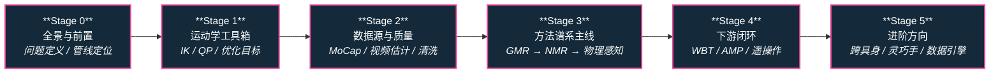

# 路线（纵深）：如果目标是动作重定向（人体动作 → 机器人参考轨迹）

**摘要**：面向"想把人体动捕/视频/生成动作变成机器人可执行参考轨迹"的纵深路线，从重定向的问题定义与数据管线定位、运动学优化工具箱、参考动作数据源与质量控制，到方法谱系主线（运动学优化 GMR → 学习式 NMR → 物理感知 ReActor / SPIDER / DynaRetarget），再到下游跟踪训练闭环与进阶方向，按 Stage 0–5 串通核心方法；本路线是 [运动控制主路线](motion-control.md) 的一条分支，向上承接 [动作生成纵深](depth-motion-generation.md) 的运动学输出，向下供给 [BFM 纵深](depth-bfm.md) 与 [模仿学习纵深](depth-imitation-learning.md) 的训练数据。

## 路线一览

## 这条路径怎么用

- 目标读者是想搭"人体参考动作 → 机器人可执行轨迹"数据管线的人——模仿学习、全身跟踪（WBT）、AMP 风格先验的训练数据几乎都要穿过这道闸
- 动作重定向解决 **跨骨架映射**：源（人/动物）与目标（机器人）的骨架拓扑、肢体比例、关节限位、质量分布都不同，直接复制关节角会产生脚滑、穿模、超限等伪影
- 每个阶段都有前置知识、核心问题、推荐做什么、推荐读什么、学完输出什么

**和主路线的关系：**
- 本路线是主路线 L2（运动学）与 L5（RL 与模仿学习）之间偏"数据侧"的展开：L2 的 FK/IK 是 Stage 1 的直接前置
- [模仿学习纵深](depth-imitation-learning.md) Stage 2 与 [BFM 纵深](depth-bfm.md) Stage 1 都只给了重定向一个阶段的篇幅；本路线把这一步展开成完整谱系
- 如果关心"参考动作从哪来"的上游问题（文本/多模态生成动作），走 [动作生成纵深](depth-motion-generation.md)

---

## Stage 0 重定向全景与前置

**先分清"动画重定向"与"机器人重定向"的评价标准差异，再看方法，否则会用错误的指标选错误的路线。**

### 前置知识
- Python 熟练，能读懂旋转表示（四元数 / 旋转矩阵 / 6D）
- 理解正运动学（FK）概念（参考主路线 L2）

### 核心问题
- 重定向到底在解什么：保留运动语义与风格的同时满足目标骨架的可执行性
- 动画界（像不像）与机器人界（能不能跟得上）的评价线为什么不同
- 重定向在训练数据管线里的位置：采集 → 清洗 → 重定向 → 跟踪训练

### 推荐做什么
- 读专题汇总页，把"概念 / 流水线 / 选型 / 数据 / 下游"五层入口过一遍
- 找一段公开动捕数据，直接把人体关节角复制到人形模型上，观察脚滑与穿模——建立"为什么必须重定向"的第一手直觉

### 推荐读什么
- [Motion Retargeting](../wiki/concepts/motion-retargeting.md)（本仓库）— 概念主入口
- [动作重定向专题汇总](../wiki/overview/topic-motion-retargeting.md)（本仓库）
- [Character Animation vs Robotics](../wiki/concepts/character-animation-vs-robotics.md)（本仓库）— 两界评价标准差异
- [Motion Retargeting Pipeline](../wiki/concepts/motion-retargeting-pipeline.md)（本仓库）— 管线定位

### 学完输出什么
- 能一句话说清重定向解决什么、为什么不能跳过
- 能画出"采集 → 重定向 → 训练"数据管线并标出误差来源

---

## Stage 1 运动学基础与优化工具箱

**重定向的经典形态是一个带约束的优化问题：目标函数、约束、求解器三件套要先备齐。**

### 前置知识
- Stage 0 内容
- 线性代数与最小二乘

### 核心问题
- 重定向优化目标怎么写：末端位置约束、关节限位、平滑项、接触约束各自的数学形式
- IK 的数值解法族：Gauss–Newton / Levenberg–Marquardt / 拟牛顿各自适用什么规模
- 关节空间直接映射（scale + offset）与任务空间 IK 的取舍

### 推荐做什么
- 用 Pinocchio 或 MuJoCo 对一个人形模型手写一个末端约束 IK，验证关节限位处理
- 把同一段动作分别用关节空间映射与任务空间 IK 重定向，对比末端误差

### 推荐读什么
- [Motion Retargeting Objective](../wiki/formalizations/motion-retargeting-objective.md)（本仓库）— 优化目标形式化
- [Gauss–Newton](../wiki/methods/gauss-newton.md)、[Levenberg–Marquardt](../wiki/methods/levenberg-marquardt.md)、[L-BFGS](../wiki/methods/l-bfgs.md)（本仓库）— 求解器族
- [Motion Retargeting](../wiki/concepts/motion-retargeting.md) 的"主要方法"分节（本仓库）

### 学完输出什么
- 一个能跑的末端约束 IK 重定向脚本
- 能为给定任务写出合理的重定向目标函数与约束集

---

## Stage 2 参考动作数据源与质量控制

**垃圾进垃圾出：重定向管线的上限由参考数据的质量与覆盖度决定。**

### 前置知识
- Stage 1 内容

### 核心问题
- 三类数据源的取舍：光学动捕（AMASS / LAFAN1）、视频估计（GVHMR / SAM 3D Body）、低成本方案（FreeMoCap）
- SMPL 系表示为什么成为事实标准，重定向前要做哪些统一化
- 数据质量维度：脚滑、漂移、穿透、抖动怎么量化与过滤
- 数据集的"重定向就绪度"怎么评估

### 推荐做什么
- 下载一段 AMASS 数据与一段视频估计（GVHMR）数据，对比两者的脚部接触质量
- 给自己的管线加一个质量过滤器（脚滑速度阈值 + 关节速度上限），统计过滤比例

### 推荐读什么
- [AMASS](../wiki/entities/amass.md) 与 [LAFAN1](../wiki/entities/lafan1-dataset.md)（本仓库）— 动捕数据基座
- [人形参考动作数据集对比](../wiki/comparisons/humanoid-reference-motion-datasets.md)（本仓库）— 选型主入口
- [GVHMR](../wiki/entities/gvhmr.md)、[SAM 3D Body](../wiki/entities/sam-3d-body.md)、[FreeMoCap](../wiki/entities/freemocap.md)（本仓库）— 视频/低成本采集
- [Motion Data Quality](../wiki/concepts/motion-data-quality.md) 与 [LiMMT / GQS 动作数据整编](../wiki/methods/limmt-gqs-motion-curation.md)（本仓库）— 质量量化

### 学完输出什么
- 一份自己方向的数据源选型表（成本 / 质量 / 覆盖度三列）
- 一个带质量过滤的参考动作预处理脚本

---

## Stage 3 方法谱系主线：从 GMR 到物理感知重定向

**围绕"像不像"与"能不能跟得上"，三类路线泾渭分明：运动学优化、学习式映射、物理感知优化。**

### 前置知识
- Stage 2 内容
- 理解 RL 基本概念（物理感知路线会用到）

### 核心问题
- GMR 的运动学 IK/QP 路线：为什么"先几何对齐、物理留给下游"能覆盖大多数场景
- NMR 的学习式整段映射：仿真锚定的配对数据怎么造、非自回归推理换来什么
- 物理感知路线：ReActor 的双层 RL、SPIDER 的采样式优化、DynaRetarget 的增量 SBTO 各自把物理约束放在哪一层
- OmniRetarget 一系为什么强调"交互保留"（人-物-地形的空间关系）

### 推荐做什么
- 用 GMR 开源实现把一套 AMASS 数据重定向到 Unitree G1 等目标模型，检查关节限位与穿模
- 精读 GMR vs NMR vs ReActor 对比页，为自己的场景（离线数据生产 / 实时遥操 / 高动态技能）选一条主路线并说明理由

### 推荐读什么
- [GMR](../wiki/methods/motion-retargeting-gmr.md)、[NMR](../wiki/methods/neural-motion-retargeting-nmr.md)、[ReActor](../wiki/methods/reactor-physics-aware-motion-retargeting.md)（本仓库）— 三条代表路线
- [GMR vs NMR vs ReActor 选型对比](../wiki/comparisons/gmr-vs-nmr-vs-reactor.md)（本仓库）— 谱系主入口
- [DynaRetarget / SBTO](../wiki/methods/dynaretarget-sbto-motion-retargeting.md) 与 [SPIDER](../wiki/methods/spider-physics-informed-dexterous-retargeting.md)（本仓库）— 物理感知扩展
- [OmniRetarget](../wiki/entities/paper-hrl-stack-03-omniretarget.md) 与 [Retargeting Matters](../wiki/entities/paper-hrl-stack-01-retargeting_matters.md)（本仓库）— 交互保留与重定向质量对下游的影响

### 学完输出什么
- 一条跑通的"AMASS → 目标人形"重定向管线
- 能说清三类路线"数据来自哪里、误差在哪里修、推理预算多大"的取舍

---

## Stage 4 下游闭环：重定向产物怎么进入训练与遥操作

**重定向不是终点：产物要经得起全身跟踪训练与实时遥操作的检验。**

### 前置知识
- Stage 3 内容
- [RL 纵深路线](depth-rl-locomotion.md) Stage 0–2 水平（能在仿真里训练策略）

### 核心问题
- 重定向轨迹进入 WBT 训练的完整链路：参考轨迹 → 模仿 reward → 跟踪策略
- "看起来在学、实际上在追不可行轨迹"：重定向伪影如何拖垮下游训练
- 实时遥操作对重定向的额外要求：延迟预算、滑窗推理、安全限幅
- AMP 风格先验与逐帧跟踪对重定向质量的敏感度差异

### 推荐做什么
- 把 Stage 3 的重定向产物喂给一个开源 WBT 训练管线（如 BeyondMimic），观察跟踪误差与失败片段
- 对同一段数据做"有/无质量过滤"两组训练，对比收敛速度——验证 Retargeting Matters 的结论

### 推荐读什么
- [Whole-Body Tracking Pipeline](../wiki/concepts/whole-body-tracking-pipeline.md) 与 [WBT 专题汇总](../wiki/overview/topic-wbt.md)（本仓库）
- [SONIC](../wiki/methods/sonic-motion-tracking.md) 与 [BeyondMimic](../wiki/methods/beyondmimic.md)（本仓库）— 跟踪侧消费者
- [Query：人形动作跟踪方法选型](../wiki/queries/humanoid-motion-tracking-method-selection.md)（本仓库）
- [Teleoperation](../wiki/tasks/teleoperation.md)（本仓库）— 实时重定向的应用面

### 学完输出什么
- 一条从参考动作走到可跟踪策略的端到端管线
- 对"重定向质量 ↔ 下游训练效果"的因果链有实验级认识

---

## Stage 5 进阶方向

### 前置知识
- Stage 4 内容

**方向 A：跨具身重定向**
- 把同一套参考动作映射到异构形态（四足、异构人形、机械臂）
- 关键词：[STMR 四足重定向](../wiki/entities/stmr-quadruped-retargeting.md)、[PAN Motion Retargeting](../wiki/entities/pan-motion-retargeting.md)、[Any2Any 跨具身 WBT](../wiki/entities/paper-any2any-cross-embodiment-wbt.md)、[跨具身专题](../wiki/overview/topic-cross-embodiment.md)、[Query：跨具身迁移策略](../wiki/queries/cross-embodiment-transfer-strategy.md)

**方向 B：灵巧手与交互保留重定向**
- 手-物接触的拓扑保持：从全身骨架级映射细化到接触级映射
- 关键词：[TopoRetarget](../wiki/methods/toporetarget-interaction-preserving-dexterous-retargeting.md)、[SPIDER](../wiki/methods/spider-physics-informed-dexterous-retargeting.md)、[DynaRetarget vs TopoRetarget 对比](../wiki/comparisons/dynaretarget-vs-toporetarget-retargeting.md)

**方向 C：生成动作的重定向**
- 参考动作不再来自动捕，而来自文本/多模态生成模型；重定向成为"生成 → 执行"的中间层
- 关键词：[Gen2Humanoid](../wiki/entities/gen2humanoid.md)、[动作生成纵深路线](depth-motion-generation.md)

**方向 D：重定向即数据引擎**
- 大规模重定向管线为 BFM / 全身跟踪基座批量生产训练数据
- 关键词：[OmniRetarget 数据集](../wiki/entities/omniretarget-dataset.md)、[Query：人形训练数据管线](../wiki/queries/humanoid-training-data-pipeline.md)、[BFM 纵深路线](depth-bfm.md)

---

## 快速入口汇总

| 阶段 | 核心问题 | 本仓库入口 |
|------|---------|-----------|
| Stage 0 | 问题定义与管线定位 | [Motion Retargeting](../wiki/concepts/motion-retargeting.md) |
| Stage 1 | IK / 优化目标 | [Motion Retargeting Objective](../wiki/formalizations/motion-retargeting-objective.md) |
| Stage 2 | 数据源与质量 | [人形参考动作数据集对比](../wiki/comparisons/humanoid-reference-motion-datasets.md) |
| Stage 3 | 方法谱系选型 | [GMR vs NMR vs ReActor](../wiki/comparisons/gmr-vs-nmr-vs-reactor.md) |
| Stage 4 | 下游跟踪闭环 | [Whole-Body Tracking Pipeline](../wiki/concepts/whole-body-tracking-pipeline.md) |
| Stage 5 | 进阶方向 | [动作重定向专题汇总](../wiki/overview/topic-motion-retargeting.md) |

## 和其他页面的关系

- 完整成长路线参考：[主路线：运动控制算法工程师成长路线](motion-control.md)
- 其它纵深路径：
  - [动作生成（文本/多模态 → 人形动作）](depth-motion-generation.md) — 姊妹路线：生成负责"造动作"，重定向负责"落到机器人"
  - [模仿学习与技能迁移](depth-imitation-learning.md) — 本路线 Stage 4 下游的策略学习侧
  - [BFM（人形行为基础模型）](depth-bfm.md) — Stage 5 方向 D 的主要数据消费者
  - [人形 RL 运动控制](depth-rl-locomotion.md) — 跟踪训练的训练侧前置
  - [接触丰富的操作任务](depth-contact-manipulation.md) — 方向 B 灵巧手接触的邻接路线
  - [传统模型控制（LIP/ZMP → MPC → WBC）](depth-classical-control.md)
  - [安全控制（CLF/CBF）](depth-safe-control.md)
  - [导航（SLAM → VLN → 导航 VLA）](depth-navigation.md)
  - [移动操作（Loco-Manipulation）](depth-mobile-manipulation.md)
  - [感知越障（Perceptive Locomotion）](depth-perceptive-locomotion.md)
  - [VLA（视觉-语言-动作模型）](depth-vla.md)
- 人形控制全景图：[Humanoid Control Roadmap](../wiki/roadmaps/humanoid-control-roadmap.md)
- 技术栈地图：[tech-map/dependency-graph.md](../tech-map/dependency-graph.md)

## 参考来源

本路线基于以下原始资料的归纳：

- [Motion Retargeting](../wiki/concepts/motion-retargeting.md) 与 [动作重定向专题汇总](../wiki/overview/topic-motion-retargeting.md)
- [GMR vs NMR vs ReActor 选型对比](../wiki/comparisons/gmr-vs-nmr-vs-reactor.md)
- "Retargetting Motion to New Characters" (Gleicher, SIGGRAPH 1998) — 动作重定向问题的奠基工作
- "Retargeting Matters: General Motion Retargeting for Humanoid Motion Tracking" (GMR, arXiv:2505.02833) — 重定向质量对下游跟踪的影响
