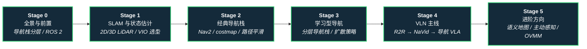

# 路线（纵深）：如果目标是导航（SLAM → Nav2 → VLN → 导航 VLA）

**摘要**：面向"让机器人知道自己在哪、该往哪走"的纵深路线，从导航栈分层与 SLAM / 状态估计基座，到经典 ROS 2 导航闭环，再到学习型导航、视觉–语言导航（VLN）与导航 VLA / WAM 前沿，按 Stage 0–5 串通核心方法；本路线是 [运动控制主路线](motion-control.md) 的一条分支。

## 路线一览

## 这条路径怎么用

- 目标读者是想让机器人（轮式底盘、四足或人形）自主从 A 点到 B 点的人——从"有地图按坐标走"一直到"听懂语言指令找目标"
- 核心心智模型：导航是 **定位—建图—规划—执行** 的分层闭环；经典栈解决"往哪走"，学习型与 VLN 解决"语义目标"与"非结构化地形"
- 每个阶段都有前置知识、核心问题、推荐做什么、推荐读什么、学完输出什么

**和主路线的关系：**
- 主路线聚焦关节层运动控制；本路线占据其上的 **任务规划与空间智能层**，输出速度命令或路点给低层执行
- 腿式平台的局部越障在 [感知越障纵深](depth-perceptive-locomotion.md) 展开，本路线聚焦全局导航与语义接地
- "导航到了怎么动手"是 [Loco-Manipulation 纵深](depth-loco-manipulation.md) 的主题，Stage 5 的 OVMM 方向是两条路线的交汇点

---

## Stage 0 全景与前置：导航栈分层与 ROS 2

**先建立分层直觉：语义目标、全局路径、局部运动、底层执行各在哪一层，谁给谁下命令。**

### 前置知识
- Python / C++ 基础
- 对坐标变换（旋转矩阵、四元数、TF 树）有基本概念

### 核心问题
- 导航栈为什么分层：语义 / 全局 / 局部 / 执行各解决什么、接口是什么（`cmd_vel`、路点、关节命令）
- ROS 2 在导航系统里扮演什么角色（节点、话题、TF、生命周期）
- 轮式 / 四足 / 人形平台的导航栈差异主要在哪一层

### 推荐做什么
- 用 PythonRobotics 跑通 EKF 定位、A* / RRT* 规划、DWA 局部避障的教学示例，建立算法直觉
- 装一个 ROS 2 工作空间，用 turtlebot 仿真跑通"建图 → 定位 → 点到点导航"闭环

### 推荐读什么
- [导航·SLAM·自动驾驶开源栈总览](../wiki/overview/navigation-slam-autonomy-stack.md)（本仓库）— 本路线的开源栈地图总入口
- [ROS 2 基础](../wiki/concepts/ros2-basics.md)（本仓库）
- [PythonRobotics](../wiki/entities/python-robotics.md)（本仓库）— 算法层入门示例集
- [分层四足导航栈](../wiki/concepts/hierarchical-quadruped-navigation-stack.md)（本仓库）— 腿式平台的分层参照

### 学完输出什么
- 能画出一张四层导航栈框图并标出每层的输入输出
- 一个跑通的 ROS 2 建图 + 导航仿真 demo

---

## Stage 1 SLAM 与状态估计

**"我在哪"是一切导航的前提：2D/3D 激光、视觉与惯性各有一条成熟工具链。**

### 前置知识
- Stage 0 内容
- 理解贝叶斯滤波 / 最小二乘的基本思想

### 核心问题
- 2D 激光 SLAM（slam_toolbox / Cartographer）与 3D LIO（FAST-LIO / LIO-SAM）各适合什么场景
- 视觉 SLAM（ORB-SLAM3 / VINS）与激光路线的失效模式差异（弱纹理、动态物体、光照）
- 里程计漂移、回环检测与全局一致性怎么权衡
- 状态估计与传感器融合怎么给下游提供稳定位姿

### 推荐做什么
- 用 slam_toolbox 在仿真里建一张 2D 地图，再用 AMCL 重定位
- 拿一个公开数据集跑 FAST-LIO 与 ORB-SLAM3，各自记录漂移与失效场景

### 推荐读什么
- [LiDAR / LIO / VIO 开源选型对比](../wiki/comparisons/lidar-slam-lio-vio-selection.md)（本仓库）— 选型主入口
- [SLAM Toolbox](../wiki/entities/slam-toolbox.md)、[Cartographer](../wiki/entities/cartographer.md)、[FAST-LIO](../wiki/entities/fast-lio.md)、[ORB-SLAM3](../wiki/entities/orb-slam3.md)（本仓库）
- [State Estimation](../wiki/concepts/state-estimation.md) 与 [Sensor Fusion](../wiki/concepts/sensor-fusion.md)（本仓库）
- [Ultra-Fusion](../wiki/entities/paper-ultra-fusion-multi-sensor-slam.md)（本仓库）— 韧性多传感器融合前沿
- [CO-Calib](../wiki/entities/paper-co-calib-multi-fisheye-calibration.md)（本仓库）— 多鱼眼标定 failure-oriented 分析：可观测性引导选帧将 Kalibr 类管线成功率 68.1%→99.3%，多相机 VIO/SLAM 外参标定的前置工具

### 学完输出什么
- 能为给定平台（室内 AMR / 野外四足 / 手持建图）选出合理的 SLAM 配置
- 对激光 / 视觉两条路线的失效模式有第一手记录

---

## Stage 2 经典导航栈：Nav2 与路径规划

**ROS 2 时代的导航中枢：把地图、定位、全局规划、局部控制拼成一个可靠闭环。**

### 前置知识
- Stage 1 内容

### 核心问题
- Nav2 的行为树架构：全局规划器、控制器、恢复行为怎么协作
- costmap 分层（静态 / 障碍 / 膨胀）与参数调优的常见坑
- 全局路径为什么还要平滑：曲率连续、可跟踪的轨迹怎么优化出来
- 四足 / 人形接 Nav2 时，`cmd_vel` 接口与步态执行的适配问题

### 推荐做什么
- 在仿真里完整调一遍 Nav2：换全局规划器、调 costmap 膨胀半径、观察狭窄通道通过率
- 给一条 A* 路径加平滑优化（最小化 jerk / 曲率），对比跟踪误差

### 推荐读什么
- [Navigation2（Nav2）](../wiki/entities/navigation2.md)（本仓库）
- [平滑导航路径生成](../wiki/methods/smooth-navigation-path-generation.md)（本仓库）
- [RoamerX（智身四足导航栈）](../wiki/entities/roamerx-navigation.md)（本仓库）— Nav2 在四足上的增强实践
- [Isaac ROS Visual SLAM](../wiki/entities/isaac-ros-visual-slam.md)（本仓库）— GPU 加速感知建图选项

### 学完输出什么
- 一个调通的 Nav2 仿真系统，能在含障碍环境里可靠点到点
- 一份自己的 costmap / 规划器调参笔记

---

## Stage 3 学习型导航

**经典栈在非结构化环境与"无先验地图"场景遇到天花板：学习型方法从这里接手。**

### 前置知识
- Stage 2 内容
- 了解 RL 与模仿学习基本概念（[RL 纵深](depth-rl-locomotion.md) / [模仿学习纵深](depth-imitation-learning.md) Stage 0–1 水平）

### 核心问题
- 分层学习导航：语义目标 → 全局路径 → 局部策略怎么分层训练与组合
- 无显式地图导航（HiPAN）怎么只靠机载深度在窄通道 / 死胡同里决策
- 扩散策略导航（NoMaD / NavDP）为什么适合多峰的"往哪走"分布
- 人形第一视角导航（EgoNav / LookOut / FocusNav）与轮式平台的差异

### 推荐做什么
- 复现一个开源学习型导航工作（NoMaD / NavDP 类）在仿真里的训练或推理
- 把学习型局部策略接到 Stage 2 的全局规划下，跑长距离混合任务

### 推荐读什么
- [分层四足导航栈](../wiki/concepts/hierarchical-quadruped-navigation-stack.md) 与 [HiPAN](../wiki/methods/hipan.md)（本仓库）
- [NoMaD](../wiki/entities/paper-notebook-nomad-goal-masked-diffusion-policies-for-navigat.md) 与 [NavDP](../wiki/entities/paper-notebook-navdp-learning-sim-to-real-navigation-diffusion.md)（本仓库）
- [EgoNav](../wiki/entities/paper-notebook-egonav.md)、[LookOut](../wiki/entities/paper-notebook-lookout.md)、[FocusNav](../wiki/entities/paper-notebook-focusnav.md)（本仓库）— 人形导航深读锚点
- [SRU](../wiki/entities/paper-sru-spatially-enhanced-recurrent-memory.md)（本仓库）— 给 RNN 补空间配准能力的循环单元，端到端 RL 无地图导航，Unitree B2W 真机零样本 50–120 m 长程目标导航
- [Paper Notebooks · Navigation 分类](../wiki/overview/paper-notebook-category-08-navigation.md)（本仓库）— 深读论文全景入口

### 学完输出什么
- 一个"经典全局 + 学习局部"的混合导航 demo
- 能判断给定场景该用经典栈、学习型还是混合方案

---

## Stage 4 VLN 主线：从 R2R 到导航 VLA

**语义接地登场：让机器人听懂"穿过客厅，在冰箱左侧停下"。**

### 前置知识
- Stage 3 内容
- 对 VLM / LLM 有使用级直觉（[VLA 纵深](depth-vla.md) Stage 0 水平）

### 核心问题
- VLN 任务定义与评价：语言–视觉接地、路径效率，离散动作图 vs 连续环境（R2R → VLN-CE）
- 七年演进的"减负"主线：预训练、拓扑建图、大规模数据生成到视频 VLA（NaVid）
- 四条可复现范式（模块化地图 / LLM 推理 / 扩散端到端 / 导航 VLA）各自的工程门槛
- 腿式平台怎么接 VLN（NaVILA 的"语言 → 中层命令 → locomotion 策略"分层）

### 推荐做什么
- 在 Habitat / Matterport3D 上跑通一个 VLN baseline，提交一次标准评测
- 按四范式路径挑一条复现（推荐从模块化 VLFM 一系入手），记录每步的工程坑

### 推荐读什么
- [视觉–语言导航（VLN）任务页](../wiki/tasks/vision-language-navigation.md)（本仓库）— 主线索引页
- [VLN 10 篇论文技术地图](../wiki/overview/vln-10-papers-technology-map.md) 与 [VLN 开源复现四范式](../wiki/overview/vln-open-source-repro-paradigms.md)（本仓库）
- [Matterport3D Simulator](../wiki/entities/matterport3d-simulator.md) 与 [Habitat-Sim](../wiki/entities/habitat-sim.md)（本仓库）
- [NaVILA](../wiki/entities/paper-notebook-navila-legged-robot-vision-language-action-model.md) 与 [Qwen-RobotNav](../wiki/entities/qwen-robot-nav.md)（本仓库）— 腿式 / 通才导航 VLA 锚点

### 学完输出什么
- 一次标准 VLN 基准上的复现与评测记录
- 能说清"导航是否应并入统一 VLA"这个选型问题的两面证据

---

## Stage 5 进阶方向

### 前置知识
- Stage 4 内容

**方向 A：语义地图与 3D 场景图**
- 从占据栅格到"知道那是什么"的地图表示
- 关键词：[vS-Graphs](../wiki/entities/paper-vs-graphs-visual-slam-scene-graph.md)、[3D 空间 VQA](../wiki/concepts/3d-spatial-vqa.md)

**方向 B：主动感知与无先验地图导航**
- 视场受限时"为看见而行动"的规划
- 关键词：[FLAP](../wiki/entities/paper-flap-fov-active-perception-3d-navigation.md)、[HiPAN](../wiki/methods/hipan.md)

**方向 C：导航–操作联合（OVMM）**
- 导航终点姿态直接决定操作成败，分阶段流水线的错配怎么闭环
- 关键词：[3D-IC](../wiki/entities/paper-3d-ic-joint-navigation-manipulation-planning.md)、[REALM](../wiki/entities/paper-realm-last-3-meter-vln-grounding.md)、[Loco-Manipulation 纵深路线](depth-loco-manipulation.md)

**方向 D：导航世界模型与新载体**
- 用 WAM 联合预测未来观测与动作；空中 VLN 等新设定
- 关键词：[NavWAM](../wiki/entities/paper-navwam-goal-conditioned-visual-navigation-wam.md)、[WorldVLN](../wiki/entities/paper-worldvln-aerial-vln-wam.md)、[PanoWorld（真实世界全景可控生成）](../wiki/entities/paper-panoworld-real-world-panoramic-generation.md)、[社会导航](../wiki/entities/paper-notebook-learning-social-navigation-from-positive-and-neg.md)

---

## 快速入口汇总

| 阶段 | 核心问题 | 本仓库入口 |
|------|---------|-----------|
| Stage 0 | 导航栈分层 | [导航·SLAM·自动驾驶开源栈总览](../wiki/overview/navigation-slam-autonomy-stack.md) |
| Stage 1 | SLAM 与状态估计 | [LiDAR / LIO / VIO 选型对比](../wiki/comparisons/lidar-slam-lio-vio-selection.md) |
| Stage 2 | 经典导航栈 | [Navigation2（Nav2）](../wiki/entities/navigation2.md) |
| Stage 3 | 学习型导航 | [分层四足导航栈](../wiki/concepts/hierarchical-quadruped-navigation-stack.md) |
| Stage 4 | VLN 主线 | [视觉–语言导航（VLN）](../wiki/tasks/vision-language-navigation.md) |
| Stage 5 | 进阶方向 | [3D-IC](../wiki/entities/paper-3d-ic-joint-navigation-manipulation-planning.md) |

## 和其他页面的关系

- 完整成长路线参考：[主路线：运动控制算法工程师成长路线](motion-control.md)
- 其它纵深路径：
  - [遥操作（人形全身遥操作 + 手指遥操作 → 示范数据/实时接管）](depth-teleoperation.md)
  - [感知越障（Perceptive Locomotion）](depth-perceptive-locomotion.md) — 腿式平台局部越障的展开版
  - [Loco-Manipulation（移动操作）](depth-loco-manipulation.md) — Stage 5 方向 C 的邻接路线
  - [VLA（视觉-语言-动作模型）](depth-vla.md) — Stage 4 语义接地的模型侧展开版
  - [WAM（世界–动作模型）](depth-wam.md)
  - [BFM（人形行为基础模型）](depth-bfm.md)
  - [人形 RL 运动控制](depth-rl-locomotion.md)
  - [模仿学习与技能迁移](depth-imitation-learning.md)
  - [动作重定向（人体动作 → 机器人参考轨迹）](depth-motion-retargeting.md)
  - [动作生成（文本/多模态 → 人形动作）](depth-motion-generation.md)
  - [力矩控制电机设计（指标 → 电磁热 → FOC 力矩闭环）](depth-torque-motor-design.md)
  - [传统模型控制（LIP/ZMP → MPC → WBC）](depth-classical-control.md)
  - [安全控制（CLF/CBF）](depth-safe-control.md)
  - [接触丰富的操作任务](depth-contact-manipulation.md)
  - [人形足球（全向行走 → 感知踢球 → 多机战术）](depth-humanoid-soccer.md)
  - [人形群控展演（群舞同步 → 编队走位 → 群体特技）](depth-humanoid-swarm-performance.md)
  - [人形拳击（动作跟踪 → 潜空间技能 → 对抗自博弈）](depth-humanoid-boxing.md)
  - [Sim2Real（域差画像 → 执行器对齐 → 鲁棒训练 → 真机部署）](depth-sim2real.md)
  - [Real2Sim（真实世界 → 可仿真资产/场景/孪生）](depth-real2sim.md)
- 人形控制全景图：[Humanoid Control Roadmap](../wiki/roadmaps/humanoid-control-roadmap.md)
- 技术栈地图：[tech-map/dependency-graph.md](../tech-map/dependency-graph.md)

## 参考来源

本路线基于以下原始资料的归纳：

- [导航·SLAM·自动驾驶开源栈总览](../wiki/overview/navigation-slam-autonomy-stack.md) 与 [VLN 10 篇论文技术地图](../wiki/overview/vln-10-papers-technology-map.md)
- "On the Representation and Estimation of Spatial Uncertainty" (Smith & Cheeseman, 1986) — 概率 SLAM 起点
- "Vision-and-Language Navigation: Interpreting Visually-Grounded Navigation Instructions in Real Environments" (Anderson et al., 2018) — R2R 任务确立
- "NaVILA: Legged Robot Vision-Language-Action Model for Navigation" (2024) — 腿式导航 VLA 代表
