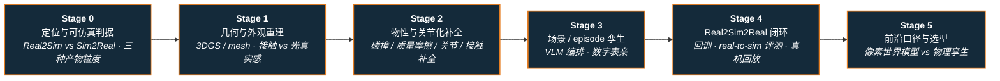

# 路线（纵深）：如果目标是 Real2Sim（真实世界 → 可仿真资产/场景/孪生）

**摘要**：面向"想把真实世界变成能在仿真里训练与评测的资产"的纵深路线，从"可仿真（simulation-ready）"判据与 Real2Sim vs Sim2Real 定位，到几何与外观重建（3DGS / mesh、接触动力学 vs 光真实感）、物性与关节化补全（碰撞体 / 质量摩擦 / 关节推断 / 接触引导遮挡补全 / sim-ready 资产生成），再到场景与 episode 孪生编排（VLM-agent 编排 · 数字表亲）与 Real2Sim2Real 闭环（回仿真训练 / real-to-sim 评测 / 真机回放收尾），最后到前沿口径与选型（像素世界模型 vs 物理孪生），按 Stage 0–5 串通核心方法；本路线是 [Sim2Real 纵深](depth-sim2real.md) 的**反向补集**，也是 [运动控制主路线](motion-control.md) L6/L7 仿真资产与评测环节的展开版。

## 路线一览

## 这条路径怎么用

- 目标读者是"手上有真机 / 真实场景的图像、视频、点云或交互录像，想把它变成能在仿真里训练策略、批量生成数据、或做可复现评测的资产"的人——主战场是操作场景孪生、人–场景交互重建、可训练视觉环境与仿真评测基础设施
- Real2Sim 解决的是 **"仿真侧资产从哪来"**：它不负责把策略训好（那是 [RL 纵深](depth-rl-locomotion.md)、[模仿学习纵深](depth-imitation-learning.md) 的主题），也不负责把策略搬上真机（那是 [Sim2Real 纵深](depth-sim2real.md) 的主题）；它负责把**真实世界压成物理可信、可回放、可扩增的仿真资产**
- 每个阶段都有前置知识、核心问题、推荐做什么、推荐读什么、学完输出什么

**和主路线的关系：**
- 本路线是主路线 **L6（综合实战 · sim2real 闭环）与 L7（评测 / 数据基础设施）** 里"仿真资产与评测"环节的展开版；不需要先走完 L6 也能单独进入——只要能在一个物理引擎里加载并 rollout 一个场景即可起步
- Stage 1 的接触几何与 [接触操作纵深](depth-contact-manipulation.md) 共享"接触可信"的判据；Stage 3 的人–场景交互与 [动作重定向纵深](depth-motion-retargeting.md)、[动作生成纵深](depth-motion-generation.md) 共享"人体运动进场景"的表征
- 本路线与 [Sim2Real 纵深](depth-sim2real.md) 是**同一条 gap 谱系的两端**：Real2Sim 先在仿真侧把 gap 修小，Sim2Real 残差适配再在真机侧吸收剩下的残差——正交互补，工程上常串联而非二选一（见 [Sim2Real 残差适配 vs Real2Sim 真机回放对比](../wiki/comparisons/sim2real-vs-real2sim-fine-tuning.md)）

---

## Stage 0 定位与"可仿真"判据：先钉死什么叫"能仿真"

**Real2Sim 的第一课不是重建，而是先分清"看起来对"和"仿真里能跑"——大量重建止步于好看的稠密网格，一放进接触求解器就穿透、抖动、悬空。**

### 前置知识
- 会用一个物理引擎（[MuJoCo](../wiki/entities/mujoco.md) 或 [Isaac Lab](../wiki/entities/isaac-gym-isaac-lab.md)）加载并 rollout 一个场景
- 了解 [Sim2Real](../wiki/concepts/sim2real.md) 的 domain gap 概念（本路线是它的资产侧上游）

### 核心问题
- **Real2Sim vs Sim2Real 的分工**：Sim2Real 迁移**策略**、Real2Sim 构造**资产**；二者正交互补，Real2Sim 缩小的恰恰是 Sim2Real 残差适配要在真机上吸收的量
- **"simulation-ready" 的判据**：可碰撞、不自穿透、有质量/摩擦、关节可动、能被策略 rollout——评价口径应含**跟踪失败率 / 仿真吞吐 / real-to-sim 相关性**，而非只比渲染逼真度
- **三种产物粒度**：物体/资产孪生 → 场景孪生 → **episode 孪生**（含执行器、轨迹、接触与任务语义）；粒度越大越贴近"回放 / 评测 / 学策略"叙事
- **gap 的物理根因分层**：几何/URDF → 刚体动力学 → 接触/摩擦 → 执行器四层，Real2Sim 主要修前三层（几何、接触、物性），执行器层仍归 Sim2Real

### 推荐做什么
- 拿一份自己重建的稠密 mesh / 点云丢进物理引擎跑 10 秒，逐条记录穿透、抖动、悬空等"看着对、仿真里废"的失效，形成"可仿真判据 checklist"
- 给自己的目标任务判定需要的产物粒度（物体 / 场景 / episode），并写清各自要保留哪些物理量

### 推荐读什么
- [Sim2Real](../wiki/concepts/sim2real.md)（本仓库）— Real2Sim 资产与迁移总图的概念枢纽
- [Sim2Real 残差适配 vs Real2Sim 真机回放 vs 真机直接微调](../wiki/comparisons/sim2real-vs-real2sim-fine-tuning.md)（本仓库）— 把 Real2Sim 放进"gap 在哪被消化"的三分谱系
- [物理保真度 ↔ sim2real gap](../wiki/concepts/physics-fidelity-sim2real-gap.md)（本仓库）— 几何/刚体/接触/执行器四层因果
- [CRISP（Contact-guided Real2Sim）](../wiki/methods/crisp-real2sim.md)（本仓库）— "可仿真而非好看"的代表性判据来源（跟踪失败率 55.2%→6.9%）

### 学完输出什么
- 一张"可仿真判据 × 常见失效"对照表
- 能一句话说清 Real2Sim 与 Sim2Real 各改哪一侧、为何正交互补

---

## Stage 1 几何与外观重建：接触动力学 vs 光真实感

**"真实"有两个正交维度：接触动力学可信（能站、能坐、不穿透）和外观光真实感（缩小视觉 domain gap）；先想清瓶颈在哪个维度，再选表示法。**

### 前置知识
- Stage 0 内容
- 了解点云 / mesh / NeRF / 3D Gaussian Splatting（3DGS）的基本表示差异

### 核心问题
- **两条"真实"维度的选型**：[CRISP](../wiki/methods/crisp-real2sim.md) 用**凸平面原语**追求接触动力学可信（脚–地、臀–椅不穿透、可 rollout）；[GS-Playground](../wiki/entities/gs-playground.md) 用批量 **3DGS** 追求外观光真实感（最高约 10⁴ FPS 视觉观测），二者不是竞品而是可串联的两段
- **单目 vs 多视角输入**：CRISP 吃互联网风格单目 RGB 视频；3DGS 重建与 360° 扫描类管线需多视角/相机矩阵
- **混合表示**：splat 背景 + 可碰撞 mesh 前景（[SimFoundry](../wiki/entities/paper-simfoundry-real2sim-scene-generation.md) 的场景表示），兼顾"看得真"与"碰得动"
- **Web 大场景 3DGS 渲染栈**：把重建资产搬上浏览器可视化与调试（[Spark](../wiki/entities/spark-3dgs-renderer.md) / [Aholo Viewer](../wiki/entities/aholo-viewer.md)）

### 推荐做什么
- 对同一场景分别用"接触优先"（平面原语/碰撞 mesh）与"外观优先"（3DGS）各做一版，对比 rollout 稳定性与视觉逼真度，把瓶颈归到接触还是视觉 gap
- 复现一条端到端"扫描 → 数字孪生 → 仿真训练"的公开管线，记录重建质量对下游策略的影响

### 推荐读什么
- [CRISP vs GS-Playground：Real2Sim 路线选型（接触动力学 vs 光真实感）](../wiki/comparisons/crisp-vs-gs-playground-real2sim.md)（本仓库）— 本阶段的核心选型页
- [CRISP（Contact-guided Real2Sim）](../wiki/methods/crisp-real2sim.md) · [GS-Playground](../wiki/entities/gs-playground.md)（本仓库）— 两条维度的代表实现
- [Flexion × Niantic × NVIDIA RGB Sim2Real 管线](../wiki/entities/flexion-niantic-nvidia-rgb-sim2real-pipeline.md)（本仓库）— 360° 扫描 → 3DGS+碰撞 mesh 的 NuRec 数字孪生 → Isaac Lab RGB 导航零样本真机
- [Spark vs Aholo：Web 大场景 3DGS 渲染选型](../wiki/comparisons/spark-vs-aholo-web-3dgs-renderers.md)（本仓库）— 重建资产的浏览器可视化栈

### 学完输出什么
- 一份本场景的"接触维度 / 外观维度"瓶颈判定与表示法选型记录
- 能说清接触几何 gap 与视觉外观 gap 的对策为何不能互相替代

---

## Stage 2 物性、接触与关节化补全：从"看得见"到"能碰撞"

**几何只是骨架；要能仿真还得补上碰撞体、质量摩擦、关节自由度，并把遮挡处缺的支撑面补回来——这一层决定资产"能不能被策略碰"。**

### 前置知识
- Stage 1 内容
- 了解碰撞体近似（凸分解）、6D 位姿估计与关节（articulation）建模的基本概念

### 核心问题
- **从几何到物理**：碰撞体分解（如 CoACD）、质量/摩擦标注（VLM 查询）、6D 位姿精化（FoundationPose 类）、导出前的穿透消解（如 PyBullet 内消解）——[SimFoundry](../wiki/entities/paper-simfoundry-real2sim-scene-generation.md) 的 Generation 阶段是完整参考
- **关节化推断**：橱柜/抽屉/门等需推断**关节轴与限位**，把静态 mesh 变成可开合的铰接资产
- **接触引导的遮挡补全**：交互时大量结构不可见（如被人挡住的椅面）；[CRISP](../wiki/methods/crisp-real2sim.md) 用**人–场景接触**推断被挡支撑面，避免"看起来对、仿真里悬空/穿透"
- **Sim-ready 资产生成（而非逐件手搓）**：[PhysX-Omni](../wiki/entities/physx-omni.md) 统一生成刚体/可变形/关节化 sim-ready 资产；[Articraft](../wiki/entities/articraft.md) 用 agentic 程序化回路 + 编译/验证反馈生成带关节限位与 PBR 的对象
- **物理一致性作为过滤器**：CRISP 用 [RL](../wiki/methods/reinforcement-learning.md) 人形控制器把"人 + 场景"压到物理可行域，把 geometry–control 绑在一起，物理不可行的重建会在 rollout 中暴露

### 推荐做什么
- 给一个重建物体补齐"碰撞体 + 质量 + 摩擦 + 关节限位"四件套，在物理引擎里验证抓取/开合不穿透
- 复现一次接触引导补全（如坐姿推断椅面），对比补全前后"能否坐稳/站起"

### 推荐读什么
- [SimFoundry（模块化 Real2Sim 场景生成）](../wiki/entities/paper-simfoundry-real2sim-scene-generation.md)（本仓库）— Extraction/Generation/Augmentation 三阶段，物性与关节化的完整工程参考
- [CRISP（Contact-guided Real2Sim）](../wiki/methods/crisp-real2sim.md)（本仓库）— 接触引导遮挡补全 + RL 物理一致性闭环
- [PhysX-Omni](../wiki/entities/physx-omni.md) · [Articraft](../wiki/entities/articraft.md)（本仓库）— sim-ready 资产的生成式与 agentic 程序化两条路线
- [接触操作纵深](depth-contact-manipulation.md)（本仓库）— "接触可信"判据的任务侧邻接路线

### 学完输出什么
- 一份把重建几何升级为可仿真资产的"物性/关节化补全 checklist"
- 能解释为什么"稠密 mesh 直接进引擎"往往产生伪碰撞，以及接触补全解决了什么

---

## Stage 3 场景 / episode 孪生与数字表亲：从单物体到可回放交互

**单个可碰撞物体还不是任务；要么拼成整场景、要么把真机交互录像复现成可回放 episode，并沿语义扩增出成千上万个"数字表亲"来喂训练。**

### 前置知识
- Stage 2 内容
- 了解 [VLM](../wiki/methods/vla.md) 在场景理解/物性标注/任务提议中的角色

### 核心问题
- **场景孪生 vs episode 孪生**：[SimFoundry](../wiki/entities/paper-simfoundry-real2sim-scene-generation.md) 从单段视频重建 **sim-ready 场景**；[Agentic Real2Sim](../wiki/entities/paper-agentic-real2sim.md) 把真机交互录像复现成 **MuJoCo episode 孪生**（含执行器/轨迹/接触/任务）
- **VLM-agent 编排的解耦设计**：agent 只做物体发现、关键帧、mask/tracking critic 等 **schema 约束决策**，几何与抓取 sweep 走**确定性工具**——因此开源 31B 与闭源大模型回放成功接近、成本差约一个数量级
- **数字表亲（digital cousins）作为可控域随机化**：object/scene/task cousins 是**保 affordance 的语义变体**，不是简单 pose 噪声；SimFoundry 报告三者分别约 +17%/+21%/+40% 平均任务成功率增益——把 Real2Sim 从"复刻一个场景"扩到"批量生产可训练场景"
- **人–场景交互的生成 vs 重建**：[CRISP](../wiki/methods/crisp-real2sim.md) 从视频**后向重建**可仿真人形运动；[COINS](../wiki/entities/paper-coins-compositional-human-scene-interaction.md) 按语义**前向合成**静态交互；[DIMOS](../wiki/entities/paper-dimos-human-scene-motion-synthesis.md) 用 RL 潜空间正向合成室内坐/躺/走——互补的"重建 vs 生成"

### 推荐做什么
- 从一段真机操作录像出发，跑一遍"物体发现 → 分割/位姿 → 物性 → 场景装载 → 仿真内抓取修复"，产出一个可回放 episode
- 用 object/scene/task cousins 对一个基础场景做一次可控扩增，验证 held-out 物体/布局上的泛化

### 推荐读什么
- [Agentic Real2Sim（VLM Agent 编排的物理 Real2Sim）](../wiki/entities/paper-agentic-real2sim.md)（本仓库）— episode 孪生 + 可换 VLM 后端 + 确定性工具解耦
- [SimFoundry](../wiki/entities/paper-simfoundry-real2sim-scene-generation.md)（本仓库）— 场景孪生 + 三类数字表亲的完整增扩管线
- [COINS](../wiki/entities/paper-coins-compositional-human-scene-interaction.md) · [DIMOS](../wiki/entities/paper-dimos-human-scene-motion-synthesis.md)（本仓库）— 人–场景交互的正向合成对照
- [动作生成纵深](depth-motion-generation.md) · [动作重定向纵深](depth-motion-retargeting.md)（本仓库）— "人体运动进场景"的表征邻接路线

### 学完输出什么
- 一个从真机录像复现的可回放 episode，或一套带数字表亲的场景
- 能说清场景孪生与 episode 孪生保留的物理量差异，以及为什么 agent 只做 schema 决策就够

---

## Stage 4 Real2Sim2Real 闭环：回训、real-to-sim 评测与真机回放

**重建资产的价值在于"回到仿真里被用"——用来训练可迁移策略、做可复现评测、或作为反修仿真的数据源；三条下游用途各自闭合一个环。**

### 前置知识
- Stage 3 内容
- 了解仿真训练策略再迁真机的基本闭环（可先读 [Sim2Real 纵深](depth-sim2real.md) Stage 0–2）

### 核心问题
- **用途 A · 回仿真训练策略再迁真机**：在重建场景/数字表亲上训练并零样本部署——[Flexion 管线](../wiki/entities/flexion-niantic-nvidia-rgb-sim2real-pipeline.md) 的 RGB 导航、[VIRAL](../wiki/entities/paper-viral-humanoid-visual-sim2real.md) 的视觉 loco-manipulation、SimFoundry 的 sim-to-real 操作训练（YAM/DROID 近 99–100%）
- **用途 B · real-to-sim 策略评测基础设施**：把可信仿真当**可扩展闭环评测**，用 real-to-sim 相关性把模型迭代从墙钟瓶颈转成算力瓶颈（[仿真评测基础设施](../wiki/concepts/simulation-evaluation-infrastructure.md)）；SimFoundry 报告仿真↔真机均值 **Pearson 0.911 / MMRV 0.018**；口径要清楚"可复现性 ↔ 代表性"的取舍（[Sim vs Real 评测 gap](../wiki/concepts/sim-vs-real-eval-gap.md)）；产业侧参照 [Genesis World 1.0](../wiki/entities/genesis-world-10.md)
- **用途 C · Real2Sim 真机回放作为"最后一公里"微调路线**：不在真机上训练，用真机数据反修仿真后回训策略，真机零探索风险（[Sim2Real 残差适配 vs Real2Sim 真机回放对比](../wiki/comparisons/sim2real-vs-real2sim-fine-tuning.md)）
- **闭环观**：Real2Sim 先在仿真侧把 gap 修小 → 仿真里重训 → Sim2Real 残差适配在真机侧吸收剩余残差；三者在"gap 在哪被消化"这条轴上是连续谱

### 推荐做什么
- 在一个重建场景上训一个纯 RGB 策略并做一次零样本真机（或跨仿真器 sim2sim）验证，记录重建质量对成功率的影响
- 复算一次 real-to-sim 评测：把若干 checkpoint 的仿真成功率与真机成绩做 Pearson/MMRV，判断"先在 sim 里筛 checkpoint"是否可信

### 推荐读什么
- [仿真评测基础设施](../wiki/concepts/simulation-evaluation-infrastructure.md) · [Sim vs Real 评测 gap](../wiki/concepts/sim-vs-real-eval-gap.md)（本仓库）— real-to-sim 评测的方法与口径
- [SimFoundry](../wiki/entities/paper-simfoundry-real2sim-scene-generation.md)（本仓库）— 同一套资产既评测又训练的闭环样本
- [Flexion RGB Sim2Real 管线](../wiki/entities/flexion-niantic-nvidia-rgb-sim2real-pipeline.md) · [VIRAL](../wiki/entities/paper-viral-humanoid-visual-sim2real.md)（本仓库）— 重建/渲染场景训练的视觉策略零样本落地
- [具身大模型评测基准选型闭环](../wiki/queries/embodied-eval-benchmark-selection-loop.md)（本仓库）— real-to-sim 评测在整套基准栈中的位置

### 学完输出什么
- 一份"重建资产 → 训练 / 评测 / 回放"三用途的选型记录
- 能定位一次评测结论能否外推真机（评测 gap 属于可复现性代价还是重建失真）

---

## Stage 5 前沿、口径与选型：像素世界模型 vs 物理孪生

### 前置知识
- Stage 4 内容

**方向 A：像素世界模型 vs 物理引擎孪生**
- [视频即仿真（Video-as-Simulation）](../wiki/concepts/video-as-simulation.md) 用交互式视频预测器代替刚体引擎做像素级反事实演练，与本路线的**物理引擎孪生**是两条不同范式；[Agentic Real2Sim](../wiki/entities/paper-agentic-real2sim.md) 的产物是**物理引擎 episode**，不是像素 rollout——勿混谈

**方向 B：三组核心选型**
- 接触动力学 vs 光真实感：[CRISP vs GS-Playground](../wiki/comparisons/crisp-vs-gs-playground-real2sim.md)（可串联）
- 场景孪生 vs episode 孪生：[SimFoundry](../wiki/entities/paper-simfoundry-real2sim-scene-generation.md)（场景+cousins+Pearson/MMRV）vs [Agentic Real2Sim](../wiki/entities/paper-agentic-real2sim.md)（episode twin+VLM 编排+回放成功）
- gap 在仿真侧还是真机侧消化：[Real2Sim 真机回放 vs 残差适配 vs 直接微调](../wiki/comparisons/sim2real-vs-real2sim-fine-tuning.md)

**方向 C：成熟度与开源边界**
- 许多工作 **code coming soon**（Agentic Real2Sim、SimFoundry 截至入库未挂公开仓），[CRISP](../wiki/methods/crisp-real2sim.md) / [Articraft](../wiki/entities/articraft.md) / [PhysX-Omni](../wiki/entities/physx-omni.md) 有公开代码或数据——选型前务必先核查开源状态与可复现边界

**方向 D：与整机栈汇合**
- Real2Sim 资产/评测在 [VLA 纵深](depth-vla.md)、[BFM 纵深](depth-bfm.md)、[WAM 纵深](depth-wam.md) 与 [Sim2Real 纵深](depth-sim2real.md) 中的位置；重建的可训练环境是整机栈数据与评测层的一块拼图

---

## 快速入口汇总

| 阶段 | 核心问题 | 本仓库入口 |
|------|---------|-----------|
| Stage 0 | 定位与可仿真判据 | [Sim2Real 残差适配 vs Real2Sim 真机回放](../wiki/comparisons/sim2real-vs-real2sim-fine-tuning.md) |
| Stage 1 | 几何与外观重建 | [CRISP vs GS-Playground（Real2Sim）](../wiki/comparisons/crisp-vs-gs-playground-real2sim.md) |
| Stage 2 | 物性与关节化补全 | [SimFoundry](../wiki/entities/paper-simfoundry-real2sim-scene-generation.md) |
| Stage 3 | 场景 / episode 孪生与数字表亲 | [Agentic Real2Sim](../wiki/entities/paper-agentic-real2sim.md) |
| Stage 4 | Real2Sim2Real 闭环与评测 | [仿真评测基础设施](../wiki/concepts/simulation-evaluation-infrastructure.md) |
| Stage 5 | 前沿口径与选型 | [视频即仿真](../wiki/concepts/video-as-simulation.md) |

## 和其他页面的关系

- 完整成长路线参考：[主路线：运动控制算法工程师成长路线](motion-control.md)（本路线是 L6/L7 仿真资产与评测环节的展开版）
- 姊妹路线：[Sim2Real（域差画像 → 执行器对齐 → 鲁棒训练 → 真机部署）](depth-sim2real.md) — 本路线的**反向补集**；Real2Sim 修仿真侧资产，Sim2Real 迁移到真机，工程上常串联
- 其它纵深路径：
  - [遥操作（人形全身遥操作 + 手指遥操作 → 示范数据/实时接管）](depth-teleoperation.md)
  - [接触丰富的操作任务](depth-contact-manipulation.md) — Stage 1/2"接触可信"判据的任务侧展开
  - [动作生成（文本/多模态 → 人形动作）](depth-motion-generation.md) — Stage 3 人–场景运动表征的邻接路线
  - [动作重定向（人体动作 → 机器人参考轨迹）](depth-motion-retargeting.md)
  - [人形 RL 运动控制](depth-rl-locomotion.md) — 本路线重建的环境供其训练
  - [模仿学习与技能迁移](depth-imitation-learning.md)
  - [感知越障（Perceptive Locomotion）](depth-perceptive-locomotion.md)
  - [导航（SLAM → VLN → 导航 VLA）](depth-navigation.md)
  - [Loco-Manipulation（移动操作）](depth-loco-manipulation.md)
  - [传统模型控制（LIP/ZMP → MPC → WBC）](depth-classical-control.md)
  - [安全控制（CLF/CBF）](depth-safe-control.md)
  - [力矩控制电机设计（指标 → 电磁热 → FOC 力矩闭环）](depth-torque-motor-design.md)
  - [人形足球（全向行走 → 感知踢球 → 多机战术）](depth-humanoid-soccer.md)
  - [人形群控展演（群舞同步 → 编队走位 → 群体特技）](depth-humanoid-swarm-performance.md)
  - [人形拳击（动作跟踪 → 潜空间技能 → 对抗自博弈）](depth-humanoid-boxing.md)
  - [BFM（人形行为基础模型）](depth-bfm.md)
  - [VLA（视觉-语言-动作模型）](depth-vla.md)
  - [WAM（世界–动作模型）](depth-wam.md)
- 人形控制全景图：[Humanoid Control Roadmap](../wiki/roadmaps/humanoid-control-roadmap.md)
- 技术栈地图：[tech-map/dependency-graph.md](../tech-map/dependency-graph.md)

## 参考来源

本路线基于以下 wiki 编译页与原始资料的归纳：

- [CRISP（Real2Sim 方法页）](../wiki/methods/crisp-real2sim.md) 与 [CRISP（ICLR 2026）论文摘录](../sources/papers/crisp_real2sim_iclr2026.md)
- [SimFoundry](../wiki/entities/paper-simfoundry-real2sim-scene-generation.md) 与 [simfoundry_arxiv_2606_28276.md](../sources/papers/simfoundry_arxiv_2606_28276.md)
- [Agentic Real2Sim](../wiki/entities/paper-agentic-real2sim.md) 与 [agentic_real2sim_arxiv_2607_19190.md](../sources/papers/agentic_real2sim_arxiv_2607_19190.md)
- [CRISP vs GS-Playground（Real2Sim）](../wiki/comparisons/crisp-vs-gs-playground-real2sim.md) 与 [gs_playground.md 仓库归档](../sources/repos/gs_playground.md)
- [Sim2Real 残差适配 vs Real2Sim 真机回放对比](../wiki/comparisons/sim2real-vs-real2sim-fine-tuning.md)
- [Flexion × Niantic × NVIDIA RGB Sim2Real 管线](../wiki/entities/flexion-niantic-nvidia-rgb-sim2real-pipeline.md) 与 [flexion_niantic_nvidia_sim2real_rgb_2026-07-20.md](../sources/blogs/flexion_niantic_nvidia_sim2real_rgb_2026-07-20.md)
- [仿真评测基础设施](../wiki/concepts/simulation-evaluation-infrastructure.md) 与 [Sim vs Real 评测 gap](../wiki/concepts/sim-vs-real-eval-gap.md)
