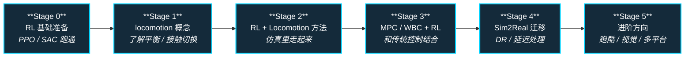

# 路线（纵深）：如果目标是人形 RL 运动控制

**摘要**：面向"想用强化学习做人形 locomotion"的快速纵深路线，从 RL 基础到 sim2real，按 Stage 0–5 串通核心方法；本路线是 [运动控制主路线](motion-control.md) 的一条分支。

## 路线一览

## 这条路径怎么用

- 目标读者是有编程基础、想快速把 RL 和人形 locomotion 串起来的人
- 不需要从头学完所有控制理论，但 RL 基础和 locomotion 概念必须有
- 每个阶段都有前置知识、核心问题、推荐做什么、推荐读什么、学完输出什么

**和主路线的关系：**
- 本路径是主路线的"快速分支版本"
- 如果你在某个阶段遇到理论卡点，回到 [主路线：运动控制成长路线](motion-control.md) 查对应章节

---

## Stage 0 RL 基础准备

**如果已经有 RL 基础，可以跳过这个阶段。**

### 前置知识
- Python 熟练
- 深度学习基础（知道 MLP、loss、梯度反向传播是什么）
- 一点概率统计直觉

### 核心问题
- RL 在解决什么问题
- Policy gradient 和 Q-learning 的核心区别是什么
- PPO 为什么是当前最主流的机器人 RL 算法

### 推荐做什么
- 用 Stable-Baselines3 或 Spinning Up 跑一个倒立摆或 HalfCheetah 环境
- 对比 on-policy（PPO）和 off-policy（SAC）的训练曲线

### 推荐读什么
- Spinning Up (OpenAI) — Part 1: Key Concepts
- [Reinforcement Learning](../wiki/methods/reinforcement-learning.md)（本仓库）

### 学完输出什么
- 能解释什么是 MDP、policy、value function、return
- 能在简单环境里用 PPO 训练一个可用的策略

---

## Stage 1 人形 locomotion 概念基础

**不做 model-based control 的人形 RL，也需要懂 locomotion 在解决什么问题。**

### 前置知识
- Stage 0 内容
- 刚体动力学基本直觉（力、力矩、加速度）

### 核心问题
- 人形机器人在 locomotion 时面临的核心挑战是什么
- 为什么平衡、接触切换、高维动作空间是难题
- RL 在 locomotion 里能解决什么问题、不能解决什么

### 推荐做什么
- 读 2-3 篇 recent humanoid RL 论文的 related work / introduction（不用全懂，大概知道大家在解决什么问题）
- 在 IsaacGym 或 Mujoco 里跑通一个人形环境

### 推荐读什么
- [Locomotion](../wiki/tasks/locomotion.md)（本仓库）
- [WBC vs RL](../wiki/comparisons/wbc-vs-rl.md)（本仓库）

### 学完输出什么
- 能解释为什么 RL 适合做 locomotion
- 能在仿真里让一个人形模型站起来走几步

---

## Stage 2 RL + Locomotion 核心方法

### 前置知识
- Stage 0 + Stage 1 内容
- 理解 reward shaping、termination condition、observation space 设计

### 核心问题
- 人形 RL 的 reward 怎么设计（平衡 reward + 前进 reward + 平滑 reward）
- 观测空间怎么构建（关节角、角速度、IMU、接触状态）
- 动作空间是 position、velocity 还是 torque
- 训练不稳定的原因是什么（sparse reward、early termination、exploration）

### 推荐做什么
- 自己设计一个简单人形 RL reward，在 IsaacGym 或 Mujoco Humanoid 里训练
- 对比不同 action space（position / velocity / torque）的训练效果
- 调一调 reward weight 看看对步态的影响

### 推荐读什么
- "Emergence of Locomotion Behaviours in Rich Environments" (Heess et al., 2017)
- legged_gym README 和代码
- [Reinforcement Learning](../wiki/methods/reinforcement-learning.md)（本仓库）

### 学完输出什么
- 一个能在平地上稳定行走的人形 RL 策略（仿真内）
- 对 reward 设计有第一手直觉

---

## Stage 3 MPC / WBC + RL 组合框架

**纯 RL 很难直接用到高精度控制场景，需要和传统控制框架结合。**

### 前置知识
- Stage 2 内容
- 理解 MPC 和 WBC 是什么（不需要能写，但需要懂基本思想）

### 核心问题
- RL 策略和 MPC / WBC 怎么组合
- 常见框架：RL 训练低层策略 + MPC 做高层规划；RL 提供 prior 给优化器
- 什么时候该用 RL，什么时候该用 MPC

### 推荐做什么
- 读 1-2 篇 RL + WBC / MPC 结合的论文（推荐：AMP、DeepMimic、MimicKit）
- 理解"RL 提供动作 prior，QP/WBC 负责实时跟踪"这个模式

### 推荐读什么
- "AMP: Adversarial Motion Priors" (Peng et al., 2021)
- [Whole-Body Control](../wiki/concepts/whole-body-control.md)（本仓库）
- [Model Predictive Control (MPC)](../wiki/methods/model-predictive-control.md)（本仓库）

### 学完输出什么
- 能解释 RL 和 MPC / WBC 各自的适用场景
- 能判断一个新问题是适合 RL 解还是 MPC 解

---

## Stage 4 Sim2Real 迁移

**仿真里能跑是真机部署的前提，但不是全部。**

### 前置知识
- Stage 3 内容
- 理解 Domain Randomization 的原理

### 核心问题
- 为什么 sim2real gap 存在（物理参数不准、执行延迟、传感噪声）
- Domain Randomization 的正确打开方式（随机化哪些参数、范围怎么定）
- 动作延迟怎么处理
- 在线微调什么时候有用、什么时候没用

### 推荐做什么
- 给 Stage 2 训练好的策略加 DR，再零样本迁移到更难的仿真地形
- 调 DR 范围，观察策略鲁棒性变化

### 推荐读什么
- [Sim2Real](../wiki/concepts/sim2real.md)（本仓库）
- [Domain Randomization](../wiki/concepts/domain-randomization.md)（本仓库）
- [System Identification](../wiki/concepts/system-identification.md)（本仓库）

### 学完输出什么
- 一次 sim2real 实验记录（哪怕只是仿真内不同地形的迁移）
- 对 DR 参数设置的直觉

---

## Stage 5 进阶方向

### 前置知识
- Stage 4 内容

根据研究方向选一个深入：

**方向 A：更复杂的 locomotion**
- 跑、跳、楼梯、崎岖地形
- 关键词：CPI、NMPC、WBC、RL + sim2real

**方向 B：模仿学习初始化**
- 用 MoCap 数据初始化 RL 策略
- 关键词：ASE、CALM、DeepMimic

**方向 C：视觉 + locomotion**
- 端到端视觉策略
- 关键词：perception、terrain mapping、learning-based navigation

**方向 D：单位置适配**
- 一个策略迁移到不同机器人形态
- 关键词：domain randomization、meta-learning、multi-task RL

### 推荐读什么
- 参考 [Humanoid Control Roadmap](../wiki/roadmaps/humanoid-control-roadmap.md) 的进阶专题部分

---

## 快速入口汇总

| 阶段 | 核心问题 | 本仓库入口 |
|------|---------|-----------|
| Stage 0 | RL 基础 | [Reinforcement Learning](../wiki/methods/reinforcement-learning.md) |
| Stage 1 | locomotion 概念 | [Locomotion](../wiki/tasks/locomotion.md) |
| Stage 2 | RL + locomotion 方法 | [Reinforcement Learning](../wiki/methods/reinforcement-learning.md) |
| Stage 3 | RL + 控制组合 | [Whole-Body Control](../wiki/concepts/whole-body-control.md) |
| Stage 4 | Sim2Real | [Sim2Real](../wiki/concepts/sim2real.md) |

## 和其他页面的关系

- 完整成长路线参考：[主路线：运动控制算法工程师成长路线](motion-control.md)
- 其它纵深路径：
  - [模仿学习与技能迁移](depth-imitation-learning.md)
  - [安全控制（CLF/CBF）](depth-safe-control.md)
  - [接触丰富的操作任务](depth-contact-manipulation.md)
- 人形控制全景图：[Humanoid Control Roadmap](../wiki/roadmaps/humanoid-control-roadmap.md)
- 技术栈地图：[tech-map/dependency-graph.md](../tech-map/dependency-graph.md)

## 参考来源

本路线基于以下原始资料的归纳：

- [Reinforcement Learning](../wiki/methods/reinforcement-learning.md)
- [Locomotion](../wiki/tasks/locomotion.md)
- [WBC vs RL 对比](../wiki/comparisons/wbc-vs-rl.md)
- [Sim2Real](../wiki/concepts/sim2real.md)
- "AMP: Adversarial Motion Priors" (Peng et al., 2021)
