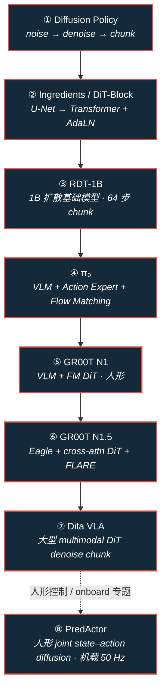
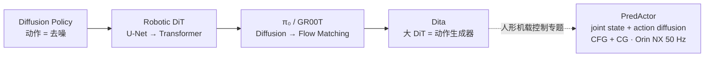

# 路线（纵深）：扩散与流匹配策略（Diffusion & Flow Matching）

**摘要**：面向「已会 BC/ACT，想沿 **Diffusion Policy → Transformer 去噪 → 大型 RDT → Flow Matching VLA → NVIDIA 人形 DiT** 读透八篇代表作」的专题路线；与 [VLA 纵深](depth-vla.md) Stage 1–2 重叠，但按 **动作生成机制演进** 排序，并区分 **图像 DiT / DiT-Block IL / Dita VLA** 命名。

## 路线一览

## 这条路径怎么用

- **推荐度（用户策展）**：①②④⑤⑥⑧为 ★★★★★；③⑦为 ★★★★☆；③适合理解 **十亿级 Robotics Diffusion Transformer**，⑦与②的 IL 配方互补、偏 **OXE 通才 VLA**。
- 每篇先抓 **action chunk** 与 **推理时 horizon**（receding horizon / 异步执行），再抓 **条件注入**（CNN/U-Net、adaLN、cross-attn VLM、flow 速度场）。
- [模仿学习纵深](depth-imitation-learning.md) Stage 3 已覆盖 DP 概念时可 **跳过重复**，从 Stage ② 进入。

**命名消歧**

| 简称 | 指什么 | 实体页 |
|------|--------|--------|
| 图像 DiT | ImageNet 类条件生成（Peebles & Xie） | [paper-dit-scalable-diffusion-transformers](../wiki/entities/paper-dit-scalable-diffusion-transformers.md) |
| DiT-Block Policy | 2410.10088 机器人 IL 配方 | [paper-robotic-dit-ingredients-dit-block-policy](../wiki/entities/paper-robotic-dit-ingredients-dit-block-policy.md) |
| ScaleDP | 2409.14411 DP-T 缩放（可选插读） | [paper-scaledp-scaling-diffusion-transformer-policy](../wiki/entities/paper-scaledp-scaling-diffusion-transformer-policy.md) |
| Dita | 2503.19757 通才 VLA（前序 2410.15959） | [paper-dita-scaling-diffusion-transformer-vla](../wiki/entities/paper-dita-scaling-diffusion-transformer-vla.md) |

**代码演进提示：** ⑦ 早期仓库 [zhihou7/dit_policy_vla](https://github.com/zhihou7/dit_policy_vla) 与项目页 [dit_policy_vla](https://zhihou7.github.io/dit_policy_vla/) 已演进为 canonical **[RoboDita/Dita](https://github.com/RoboDita/Dita)** + [robodita.github.io](https://robodita.github.io/)。

---

## Stage 1 · Diffusion Policy（① ★★★★★ · 先看）

### 核心问题

- **noise action → denoise → action chunk** 如何闭环？
- **Receding horizon** 与 **action horizon / execution horizon** 各指什么？

### 推荐读什么

- [Diffusion Policy 实体](../wiki/entities/paper-diffusion-policy.md) · [方法页](../wiki/methods/diffusion-policy.md) · [receding horizon](../wiki/concepts/receding-horizon-policy-execution.md)
- 项目：<https://diffusion-policy.cs.columbia.edu/> · 代码：<https://github.com/real-stanford/diffusion_policy> · arXiv：<https://arxiv.org/abs/2303.04137>

### 学完输出什么

- 能画一张 DDPM 训练/推理环，并说明为何 U-Net 成为默认去噪骨干。

---

## Stage 2 · The Ingredients for Robotic Diffusion Transformers（② ★★★★★）

### 核心问题

- DP 的 **U-Net 为什么可以换成 Transformer**？
- **DiT Block、Attention、AdaLN、action chunk、Transformer depth** 如何一起 stabilise 训练？

### 推荐读什么

- [DiT-Block Policy 实体](../wiki/entities/paper-robotic-dit-ingredients-dit-block-policy.md)
- 项目：<https://dit-policy.github.io/> · 代码：<https://github.com/SudeepDasari/dit-policy> · arXiv：<https://arxiv.org/abs/2410.10088>

### 学完输出什么

- 能解释 **adaLN-Zero** 与 DP 论文里 **cross-attn Transformer 难训** 的关系。

---

## Stage 3 · RDT-1B（③ ★★★★☆）

### 核心问题

- **Language + 多相机 RGB + robot state** 如何进 **1B 扩散 Transformer**？
- 为何输出 **未来 64 个 actions** 的 chunk？

### 推荐读什么

- [RDT-1B 实体](../wiki/entities/paper-rdt-1b.md)
- 项目：<https://rdt-robotics.github.io/rdt-robotics/> · 代码：<https://github.com/thu-ml/RoboticsDiffusionTransformer> · HF：<https://huggingface.co/robotics-diffusion-transformer/rdt-1b> · arXiv：<https://arxiv.org/abs/2410.07864>

### 学完输出什么

- 能区分 **IL 配方论文（②）** 与 **foundation-scale 预训练（③）** 的数据与算力假设。

---

## Stage 4 · π₀（④ ★★★★★ · Flow Matching 机器人入门）

### 核心问题

- **VLM + Action Expert + Flow Matching + action chunk** 如何取代多步 DDPM？
- 与 Octo / OpenVLA 动作头的差异？

### 推荐读什么

- [π₀ 实体](../wiki/entities/paper-pi0.md)
- 博客：<https://www.physicalintelligence.company/blog/pi0> · 代码：<https://github.com/Physical-Intelligence/openpi> · arXiv：<https://arxiv.org/abs/2410.24164>

### 学完输出什么

- 能说明 **flow matching 速度场** 与 **扩散噪声预测** 在训练目标上的对应直觉。

---

## Stage 5 · GR00T N1（⑤ ★★★★★ · 人形 / NVIDIA）

### 核心问题

- **Vision + Language → VLM → DiT Action Head → Flow Matching → action chunk** 双系统如何分工？

### 推荐读什么

- [GR00T N1 实体](../wiki/entities/paper-hrl-stack-34-gr00t_n1.md) · [Isaac GR00T 平台](../wiki/entities/isaac-gr00t.md)
- GEAR · 代码：<https://github.com/NVIDIA/Isaac-GR00T> · arXiv：<https://arxiv.org/abs/2503.14734>

### 学完输出什么

- 能对照 π₀ 与 GR00T 的 **embodiment 接口** 与 **数据金字塔** 差异。

---

## Stage 6 · GR00T N1.5（⑥ ★★★★★ · 紧接 N1）

### 核心问题

- **Eagle VLM → cross-attention → DiT → state + noisy actions → FM velocity → chunk** 相对 N1 改了什么？
- **FLARE** 为何让人类视频进入 post-train？

### 推荐读什么

- [GR00T N1.5 实体](../wiki/entities/paper-gr00t-n1-5.md)
- 项目：<https://research.nvidia.com/labs/gear/gr00t-n1_5/> · HF：<https://huggingface.co/nvidia/GR00T-N1.5-3B>

### 学完输出什么

- 能引用 GEAR 页上的 **语言跟随率 / 少样本 RoboCasa** 数字说明 N1→N1.5 增益。

---

## Stage 7 · Diffusion Transformer Policy / Dita（⑦ ★★★★☆）

### 核心问题

- 为何不再用 **小 diffusion action head**，而用 **大型 multimodal DiT** 对整个 **action chunk** denoise？
- 与 Octo MLP 头、OpenVLA 离散 token 的对比？

### 推荐读什么

- [Dita 实体](../wiki/entities/paper-dita-scaling-diffusion-transformer-vla.md)
- 项目：<https://robodita.github.io/> · 代码：<https://github.com/RoboDita/Dita> · arXiv：<https://arxiv.org/abs/2503.19757>（前序 <https://arxiv.org/abs/2410.15959>）

### 学完输出什么

- 能说明 **in-context 扩散 Transformer VLA** 与 ② 单任务 IL 配方的边界。

---

## 机制演进（一图串记）

## 快速入口汇总

| 序号 | 论文 | /wiki 实体 |
|------|------|-----------|
| ① | Diffusion Policy | [paper-diffusion-policy](../wiki/entities/paper-diffusion-policy.md) |
| ② | Ingredients / DiT-Block | [paper-robotic-dit-ingredients-dit-block-policy](../wiki/entities/paper-robotic-dit-ingredients-dit-block-policy.md) |
| ③ | RDT-1B | [paper-rdt-1b](../wiki/entities/paper-rdt-1b.md) |
| ④ | π₀ | [paper-pi0](../wiki/entities/paper-pi0.md) |
| ⑤ | GR00T N1 | [paper-hrl-stack-34-gr00t_n1](../wiki/entities/paper-hrl-stack-34-gr00t_n1.md) |
| ⑥ | GR00T N1.5 | [paper-gr00t-n1-5](../wiki/entities/paper-gr00t-n1-5.md) |
| ⑦ | Dita | [paper-dita-scaling-diffusion-transformer-vla](../wiki/entities/paper-dita-scaling-diffusion-transformer-vla.md) |
| ⑧ | PredActor（人形机载控制专题） | [paper-predactor](../wiki/entities/paper-predactor.md) |

## Stage 8 · PredActor（⑧ ★★★★★ · 人形扩散策略机载控制专题）

### 核心问题

- 联合预测未来状态与动作，如何让未来状态只作为**内部 steering surface**，同时把动作直接交给机器人？
- **Classifier guidance（CG）+ classifier-free guidance（CFG）** 如何在同一策略中支持目标引导与文本行为条件？
- rolling denoising 与运行时优化怎样满足 **Jetson Orin NX 上 50 Hz** 控制周期？

### 推荐读什么

- [PredActor 实体](../wiki/entities/paper-predactor.md)
- 项目页：<https://masteryip.github.io/predactor.github.io/> · 官方发布仓：<https://github.com/MasterYip/PredActor> · arXiv：<https://arxiv.org/abs/2609.24840>
- **复现边界：** 截至 2026-10-03，官方仓 README 标注 Code Coming Soon；项目页 demo 可用于观察结果，但源码、权重与运行说明尚未发布。

### 学完输出什么

- 能解释 joint state–action diffusion 与 action-only diffusion 的差别，并判断完整 callback 的 p95 是否满足 20 ms 预算。

## 和其他页面的关系

- 广义 VLA 部署与数据：[VLA 纵深](depth-vla.md)
- DP 在 IL 路线中的位置：[模仿学习纵深](depth-imitation-learning.md) Stage 3
- 人形整机栈：[BFM 纵深](depth-bfm.md) Stage 4（高层 VLA + 低层 WBC）
- 骨干族谱：[模型架构纵深](depth-model-architecture.md)
