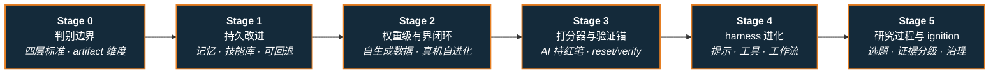

# 路线（纵深）：如果目标是 RSI（递归自我改进）

**摘要**：面向"想让研发闭环自己变强、并把这套东西用到机器人上"的纵深路线，从「四层判据 + 改的是哪个 artifact」的判别边界出发，沿着被系统改动对象逐层内收的顺序——记忆与技能库 → 权重 → 打分器与验证锚 → harness → 研究过程——串起 Reflexion / STaR / CAI / DGM / SEAL 这条主线与 ASPIRE、ENPIRE、Motus2、LWD 这条具身对照线，最后收在 ignition 门槛、证据分级与人侧选题瓶颈，按 Stage 0–5 组织；本路线是 [运动控制主路线](motion-control.md) 的一条分支，与 [具身数据纵深](depth-embodied-data.md)（把数据飞轮做成供给管线）构成"改数据 / 改改进机制本身"的姊妹路线。

## 路线一览

## 这条路径怎么用

- 目标读者是已经在用 coding agent 改训练脚本 / 改控制程序、开始想"能不能让这条闭环自己转起来"的人——主战场是研发流程本身，机器人侧的落点是真机策略与控制程序的自改进
- RSI 问的不是"AI 能不能帮我造更好的 AI"，而是 **改进后的系统是否更会完成下一次改进**；它不替代数据供给（那是 [具身数据纵深](depth-embodied-data.md)），也不替代部署期上下文适应（那是 [ICL 纵深](depth-icl.md)）
- **先读 Stage 0 再读论文**：2026 年"自进化""agent 自我改进""研发提速"同时指记忆留存、权重更新、harness 搜索与研究执行四类完全不同的东西，不先钉死四层标准与 artifact 维度，新闻与论文会被混成一锅
- 本路线的核心方法多在 agent / LLM 侧，机器人侧证据稀疏且多为闭源自报——**每个阶段都要求做一次证据分级**，这是本方向最容易翻车的地方
- 每个阶段都有前置知识、核心问题、推荐做什么、推荐读什么、学完输出什么

**和主路线的关系：**
- 本路线挂在主路线 L7（出口层：工程化与研发效率）之外的元层面：它改的是"你怎么做机器人研究"，不是某个控制器
- 起点是 EURISKO（Lenat，1983）这一支"程序自己改启发式"的前史；真正可用的一层从 2023 年之后的 agent 自进化工作开始
- 机器人侧强依赖 [具身模型测评纵深](depth-embodied-eval.md)（没有可信评测就没有 accept 门）与 [Sim2Real 纵深](depth-sim2real.md)（仿真里的自进化增益能不能落真机）

---

## Stage 0 判别边界：四层标准与 artifact 维度

**先把"改的是什么（artifact）"与"到了哪一层（1–4）"钉成两个正交坐标，再读论文，否则 Reflexion 的记忆、STaR 的权重与 DGM 的 harness 会被一起标成 RSI。**

### 前置知识
- 会用一个 coding agent 跑完整任务（读代码 → 改 → 跑测试 → 提交）
- 对 RL / 模仿学习的训练–评测循环有使用级直觉

### 核心问题
- **四层标准**：① 持久改进（变好是否留下）→ ② 有界 RSI（固定边界内 propose–eval–accept 多轮）→ ③ ignition（新版本是否更会改进）→ ④ 稳健可控（增益可迁移、可审计）；文内 2026 判断是 1–2 有较直接证据、3 尚无充分公开证据、4 远未解决
- **artifact 维度**：被改的是 **记忆 / 权重 / 打分器 / harness / 研究过程** 中的哪一个——这决定了增益能不能迁移（harness 分涨 ≠ 底座变强）
- **会自我改进 ≠ 会自我加速**：OpenAI RSI Index（GPT-5.6 Sol 57.9%）衡量"参与改进 AI"的研发能力，不是 ignition 证明
- 常见混读：把"研发提速""自生成数据训练""agent 自进化"直接读成 RSI 已实现

### 推荐做什么
- 把手上收藏的 8–10 篇"self-improving / 自进化"工作填进 **artifact × 层级** 两维表，标注它改了什么、accept 由谁把门
- 对自己的场景写一句话：我想自动化的是 **执行** 还是 **判断**？——想自动化判断的，先回到 Stage 0 重读四道门

### 推荐读什么
- [RSI 四层标准与五次边界推进](../wiki/queries/rsi-four-tier-five-pushes.md)（本仓库）— 本路线的判别底座：四层表、五次推进与 2026 信号读法
- [RSI 全谱系 survey（arXiv:2607.07663）](../wiki/entities/paper-rsi-survey-2607-07663.md)（本仓库）— 1,250 篇文献的 **改进对象 × 闭环程度** 两轴 taxonomy，把有界 self-refinement 与开放式 RSI 切开；语料与脚本已开源
- [递归自改进（宏观）](../wiki/concepts/recursive-self-improvement.md)（本仓库）— Anthropic 的完整 RSI 定义、内部生产率数字与三情景；含"具身跟随"假设
- [Awesome RSI](../wiki/entities/awesome-rsi.md)（本仓库）— 50+ 方法 / 29 基准按 **artifact × mode** 策展，是查证归类的索引入口
- [AI Auto-Research](../wiki/concepts/ai-auto-research.md)（本仓库）— 研究全生命周期自动化：与 RSI 相邻但不同的问题设定

### 学完输出什么
- 一张 artifact × 层级对照表，新论文拿来能一句话归格
- 一段能讲给同事听的区分：我们在做的是第几层、accept 的门在谁手里

---

## Stage 1 持久改进：让改进留下来（记忆与技能库）

**第一层的全部要求只有一条：这次变好必须能留到下一次；单次 CoT 更好但不落盘，不算改进。**

### 前置知识
- Stage 0 内容
- 会写 agent 的工具调用与外部状态存储（文件 / 向量库 / 技能库任一）

### 核心问题
- **记忆级自改进**：Reflexion 把失败反思写成跨任务情景记忆（HumanEval pass@1 91%），但 **参数不变**——移除记忆即回原形，这是它的能力边界
- **技能库是机器人侧的对应物**：ASPIRE 把验证修复过的控制程序蒸馏进可扩展技能库，后续任务以 in-context 技能加速适应，经验以 **代码** 而不是权重的形式留存
- **可回退性**：程序 / 记忆级改进天然可 diff、可回滚，这是它相对权重级闭环的最大工程优势
- **失败的留存比成功更值钱**：能被复用的是"什么后果不好"，而不是一条成功轨迹

### 推荐做什么
- 给自己的 agent 加一层最小持久层：把每次 propose–eval 的结果（含失败原因）落盘，跑 10 轮看第 10 轮是否明显优于第 1 轮
- 机器人侧做一次技能库实验：把一个调通的控制程序参数化存起来，换一个近邻任务，统计 token 与试错次数是否下降

### 推荐读什么
- [ASPIRE](../wiki/methods/aspire.md)（本仓库）— 逐原语多模态 trace + 进化搜索 + 技能库蒸馏；LIBERO-Pro / Robosuite / BEHAVIOR-1K 上超 CaP-Agent0 与 VLA 基线
- [RSI 四层标准与五次边界推进](../wiki/queries/rsi-four-tier-five-pushes.md) 第一次推进（本仓库）— Reflexion 谱系与"参数不变"的边界
- [karpathy/autoresearch](../wiki/entities/karpathy-autoresearch.md)（本仓库）— 三文件最小闭环：固定预算 + 固定 metric 的 keep/discard，人类迭代 program.md 作为可读技能层
- [数据飞轮](../wiki/concepts/data-flywheel.md)（本仓库）— 经验留存的数据侧同构机制

### 学完输出什么
- 一条跑得起来的 propose–eval–persist 最小闭环（可回滚、有日志）
- 一句话答辩：我的改进存在哪里、怎么回退、删掉它系统会退回什么水平

---

## Stage 2 权重级有界闭环：自生成数据与真机自进化

**从这一层开始改的是参数：系统自己造数据、自己更新权重，但边界（任务分布、评估器、安全限）仍由人冻结。**

### 前置知识
- Stage 1 内容
- 训过一个 BC / VLA 策略或做过一次 RL 后训练（[模仿学习纵深](depth-imitation-learning.md) 或 [RL 运动控制纵深](depth-rl-locomotion.md) 中段水平）

### 核心问题
- **自生成数据 → 权重**（STaR / SPIN 谱系）：目标分布与过滤规则仍是人定的，所以它是 **有界 RSI** 而不是开放式
- **模型坍缩风险**：自训练数据分布收窄会让能力静默退化，必须有外部数据或外部锚定期校验
- **机器人侧的有界权重闭环**：Motus2 把策略 / 仿真器 / 评估器收进同一套共享参数，用 DiffusionNFT + Best-of-N 闭"想象后果 → 打分 → 改策略"；MBRL + Planning 在 Put Phone / Multi-Finger 上把宏平均从 **65% → 75%**，但 simulator / evaluator 在 MBRL 阶段是 **冻结** 的
- **车队级持续改进**：LWD 用 DIVL + QAM 把部署中的成功 / 失败 / 人为干预轨迹变成单一 generalist VLA 的 offline-to-online 后训练——这是"部署不是训练终点"的真机版本
- **别把这一层读成递归加速**：闭环能净正地转几圈 ≠ 下一圈因为上一圈而转得更快

### 推荐做什么
- 在自己的任务上跑一次有界闭环：固定评估器与任务集，让 agent 只改训练配置，记录 **每轮增益** 曲线而不是只看终值
- 做一次坍缩检查：把第 N 轮模型放回原始 held-out 集，看是否出现"自评分涨、外部分跌"

### 推荐读什么
- [Motus2](../wiki/entities/paper-motus2.md)（本仓库）— 真机权重级有界闭环的代表；五任务宏平均 84%，MBRL+Planning 75%；截至入库日未开源
- [LWD](../wiki/methods/lwd.md)（本仓库）— 车队级 offline-to-online：异构部署经验 → 单一通用策略持续改进
- [RSI 四层标准与五次边界推进](../wiki/queries/rsi-four-tier-five-pushes.md) 第二次推进（本仓库）— STaR / SPIN 与"目标分布仍人类"的边界
- [具身规模法则](../wiki/concepts/embodied-scaling-laws.md) · [Bitter Lesson](../wiki/concepts/bitter-lesson.md)（本仓库）— 规模与结构之争的背景读法

### 学完输出什么
- 一份有界闭环实验记录：边界定义（谁冻结了什么）+ 每轮增益 + 坍缩检查结论
- 能说清自己的闭环停在第几轮、为什么不再涨

---

## Stage 3 打分器与验证锚：谁来判"这次改进算数"

**RSI 的成败几乎全在 accept 那一步：系统既当改进者又当评判者时，指标一定漂移。**

### 前置知识
- Stage 2 内容
- 对评测协议、held-out 划分、reward hacking 有基本警觉（[具身模型测评纵深](depth-embodied-eval.md) Stage 0–2 水平更佳）

### 核心问题
- **AI 持红笔的谱系**：CAI（人写原则、AI 对照打分）→ Self-Rewarding → Meta-Rewarding；共同问题是 **评委与回答者共盲区**，Meta-Rewarding 后期还会退化
- **外部锚必须不可被改**：隐藏测试集、编译器、证明器、真实传感器——EURISKO 改"功劳簿"、Meta-Rewarding 高分偏见都是锚被内化的后果
- **机器人侧的锚是物理**：没有自动 **reset / verify**，真机上根本凑不出 propose–eval–accept 的 eval；ENPIRE 的 EN 环节（自动 reset/verify 环境）是这条线的入场券，AutoEnvBench 与 MRU/MTU 给出机队 scaling 指标
- **公开分 / 隐藏分要分离**：只报公开分的自进化结果，默认按"可能过拟合题库"读
- **真机的 eval 很贵**：rollout 预算与并行机队决定了闭环转速，这是工程题不是算法题

### 推荐做什么
- 给自己的闭环写死 accept 规则：用什么集合、多少 seed、阈值多少、谁有否决权——写不出来就说明还不到第二层
- 搭一次 **公开分 / 隐藏分** 双轨评测，跑满 5 轮后对比两条曲线是否背离
- 真机侧：挑一个任务把 reset 与 verify 完全自动化，统计一次 eval 的墙钟与人工介入次数

### 推荐读什么
- [ENPIRE](../wiki/methods/enpire.md)（本仓库）— EN–PI–R–E 闭环：自动 reset/verify、多范式策略改进、并行 rollout；灵巧任务报告约 99% pass@8
- [真机策略 autoresearch harness 指南](../wiki/queries/real-robot-policy-autoresearch-harness.md)（本仓库）— 环境侧、范式选型、rollout 预算与机队 scaling 的实操选型
- [RSI 四层标准与五次边界推进](../wiki/queries/rsi-four-tier-five-pushes.md)「四道门」小节（本仓库）— 验证器锚、分布外、递归增益、能力–控制同步
- [RSI 全谱系 survey](../wiki/entities/paper-rsi-survey-2607-07663.md)（本仓库）— 把 self-evaluation 单列为第四技术类：evaluator 设计空间是全场共同天花板
- [具身模型测评纵深](depth-embodied-eval.md)（本仓库）— 未见集划分与过程指标的展开版

### 学完输出什么
- 一份 accept 协议文档（集合 / seed / 阈值 / 否决权），可直接贴进项目 README
- 一张公开分 vs 隐藏分双轨曲线，以及对背离的解释

---

## Stage 4 harness 进化：改提示、工具与工作流

**2026 年最活跃也最容易被高估的一层：harness 比权重便宜得多，但 harness 分涨不等于底座变强。**

### 前置知识
- Stage 3 内容
- 手写过 agent 的提示 / 工具 / 工作流编排，知道改一处会牵动哪些

### 核心问题
- **harness 是一等对象**：提示、工具、工作流、权限与运行时编排可以被程序化搜索——OPRO / ADAS / AFlow / Self-Harness / DGM / AgentX 这条线（DGM 在 SWE-bench Verified 报告 20% → 50%）
- **把 harness 变成可继承配置**：RSI-Harness 用 12 组件 inherit-by-default 的 Genome patch 层承载这件事，MetaRSI-v1 进一步在同一 loop kernel 上调度 **Data-RSI / Harness-RSI / Model-RSI** 三算子
- **门控是必需品**：HarnessBank 用语义 Harness Gene Bank + 门控筛选在冻结模型下做可信自进化（七基准 Test Pass@1 +5.1%–15.4%）——没有门控，harness 搜索就是题库过拟合
- **先省再 scale**：SoL-Pi 经 152 → 4 的 auto-research 环筛出四条效率扩展，EdgeBench 约保留 94% 分数而 token / 成本显著下降——"efficiency for efficiency"是把闭环转得更久的前提
- **迁移性检查**：进化出来的 harness 换一个任务分布、换一个底座模型还成立吗？不成立就只是局部最优配置

### 推荐做什么
- 选一条固定任务集，让 agent 只改 harness（不改权重），做 10 轮搜索，然后在 **另一组任务** 上验收——增益掉多少就是过拟合多少
- 给 harness 做版本化与门控：每次 accept 必须附带通过的隐藏集分数与成本（token / 墙钟）两栏
- 机器人侧：把"改控制程序"当 harness 搜索做一遍，对照 ASPIRE 的进化搜索设定

### 推荐读什么
- [MetaRSI-v1](../wiki/entities/paper-metarsi-v1.md)（本仓库）— Data / Harness / Model 三算子与两轴优化器；无外部 teacher 的验证设定
- [RSI-Harness](../wiki/entities/rsi-harness.md)（本仓库）— Genome 配置层与 GEE（从 session 生成 Genome）；Harness-RSI 官方实现
- [HarnessBank](../wiki/entities/paper-harnessbank.md)（本仓库）— 冻结模型下的门控式 harness 自进化
- [SoL-Pi](../wiki/entities/sol-pi.md)（本仓库）— auto-research 环筛效率扩展；先把 harness 做省再谈 scale
- [Awesome RSI Methods 页](https://prism-shadow.github.io/awesome-rsi/#methods)（外链）— 按 artifact 筛选同类工作

### 学完输出什么
- 一条带门控与成本栏的 harness 进化流水线
- 一张迁移性表：同分布增益 vs 跨分布增益，用它决定这套 harness 要不要进生产

---

## Stage 5 研究过程、ignition 门槛与治理

**最后一层把训练材料、环境与研究执行都交出去；而"下一圈是否因为上一圈更快"至今没有充分公开证据。**

### 前置知识
- Stage 0–4 内容

### 核心问题
- **第五次推进的对象是研究过程本身**：SEAL（自造训练材料）、WebEvolver（自造环境）、Motus2（真机闭环）、各 lab 的研发 Agent——研究方向与采纳权仍在人手里
- **ignition 怎么测**：任务分数涨 ≠ 更会设计改进；AI4AI-Bench 在"触及核心学习算法"这一项只有 **0.250/1.0**，AIDE² 自报 Level 1 但 **未过 ignition test**
- **失败模式是系统性的**：AutoResearchEval 归纳 45 类科研 Agent 失败，共同缺陷是稳定的 **元认知循环**（核对证据、回退、质疑路径）
- **人侧瓶颈在选题与品味**：Anthropic 的论述里，Claude 在 **目标给定** 时已能匹配或超过熟练人类执行实验，弱的是"选什么问题、信哪张图、何时停"；加速未覆盖的部分会变成新的 Amdahl 瓶颈（如人审代码）
- **具身跟随是预期不是定律**：递归智能若出现，机器人被预期跟随，但接触力、延迟、安全认证与社会时钟不跟随——见 [LLM 控制接口](../wiki/concepts/llm-robotics-control-interfaces.md) 的物理瓶颈
- **证据分级是本方向的基本功**：RSI Index、AIDE²、内部生产率数字多为厂商自报或预印本，只当方向信号

### 推荐做什么
- 把手上 5 条"RSI 进展"新闻逐条标注为 **可复现 / 闭源自报 / 假设性解释**，并写明各自的外部锚是什么
- 给自己的项目写一页"人保留什么"：选题、评测协议、安全限与否决权分别归谁——这页比任何闭环代码都重要
- 若做机器人：把 [真机 autoresearch harness 指南](../wiki/queries/real-robot-policy-autoresearch-harness.md) 的选型表填完，确认自己缺的是环境、评估还是改进范式

### 推荐读什么
- [递归自改进（宏观）](../wiki/concepts/recursive-self-improvement.md)（本仓库）— 三情景、Amdahl 瓶颈与"怎么读内部数字"对照表
- [From AGI to ASI](../wiki/entities/paper-from-agi-to-asi.md)（本仓库）— DeepMind 的四条能力路径与六类瓶颈；与 RSI 机制勿混读
- [AI Auto-Research](../wiki/concepts/ai-auto-research.md)（本仓库）— 人机共治、分层验证与跨阶段溯源
- [Datawhale RSI 科普综述（2026-09-19）](../sources/blogs/wechat_datawhale_rsi_survey_2026-09-19.md)（本仓库）— 五次推进叙事与 2026 夏信号的一手归档
- [When AI builds itself（Anthropic Institute 归档）](../sources/sites/anthropic-recursive-self-improvement.md)（本仓库）— 宏观论述原文归档

### 学完输出什么
- 一份带证据等级标注的 RSI 现状简报，能直接用于团队决策
- 一句话答辩：我的系统在第几层、改的是哪个 artifact、外部锚是什么、人保留了哪些门

---

## 快速入口汇总

| 阶段 | 核心问题 | 本仓库入口 |
|------|---------|-----------|
| Stage 0 | 四层标准与 artifact 维度 | [RSI 四层标准与五次边界推进](../wiki/queries/rsi-four-tier-five-pushes.md) |
| Stage 1 | 改进怎么留下来 | [ASPIRE](../wiki/methods/aspire.md) · [karpathy/autoresearch](../wiki/entities/karpathy-autoresearch.md) |
| Stage 2 | 权重级有界闭环 | [Motus2](../wiki/entities/paper-motus2.md) · [LWD](../wiki/methods/lwd.md) |
| Stage 3 | 打分器与验证锚 | [ENPIRE](../wiki/methods/enpire.md) · [真机 autoresearch harness](../wiki/queries/real-robot-policy-autoresearch-harness.md) |
| Stage 4 | harness 进化与门控 | [MetaRSI-v1](../wiki/entities/paper-metarsi-v1.md) · [HarnessBank](../wiki/entities/paper-harnessbank.md) |
| Stage 5 | ignition 门槛与治理 | [递归自改进](../wiki/concepts/recursive-self-improvement.md) · [AI Auto-Research](../wiki/concepts/ai-auto-research.md) |

## 和其他页面的关系

- 完整成长路线参考：[主路线：运动控制算法工程师成长路线](motion-control.md)
- 其它纵深路径：
  - [具身数据（金字塔分层 → 采集 → 清洗标注 → 格式聚合 → 扩增合成 → 配比飞轮）](depth-embodied-data.md) — 姊妹路线：改数据供给 vs 改改进机制本身
  - [具身模型测评（认知 → 世界模型保真 → 策略成功率 → sim↔real 校准）](depth-embodied-eval.md) — Stage 3 accept 门的评测底座
  - [ICL（具身上下文学习）](depth-icl.md) — 部署期不动权重的适应；与本路线的"改权重/改机制"正交
  - [Sim2Real（域差画像 → 执行器对齐 → 鲁棒训练 → 真机部署）](depth-sim2real.md) — 仿真里的自进化增益能否落真机
  - [模仿学习与技能迁移](depth-imitation-learning.md) · [人形 RL 运动控制](depth-rl-locomotion.md) — Stage 2 权重级闭环的改进范式来源
  - [WAM（世界–动作模型）](depth-wam.md) — Motus2 式"策略/想象器/评委同参"的模型侧背景
  - [VLA（视觉-语言-动作模型）](depth-vla.md) — 车队级持续改进的策略载体
  - [接触丰富的操作任务](depth-contact-manipulation.md) — 真机 reset/verify 最难的一类任务
  - [遥操作（人形全身遥操作 + 手指遥操作 → 示范数据/实时接管）](depth-teleoperation.md)
  - [Real2Sim（真实世界 → 可仿真资产/场景/孪生）](depth-real2sim.md)
  - [BFM（人形行为基础模型）](depth-bfm.md)
  - [Loco-Manipulation（移动操作）](depth-loco-manipulation.md)
  - [导航（SLAM → Nav2 → VLN → 导航 VLA）](depth-navigation.md)
  - [动作生成（文本/多模态 → 人形动作）](depth-motion-generation.md)
  - [动作重定向（人体动作 → 机器人参考轨迹）](depth-motion-retargeting.md)
  - [力矩控制电机设计（指标 → 电磁热 → FOC 力矩闭环）](depth-torque-motor-design.md)
  - [传统模型控制（LIP/ZMP → MPC → WBC）](depth-classical-control.md)
  - [人形整机硬件设计（指标预算 → 机械 → 电气 → 通信 → 整机验收）](depth-humanoid-hardware-design.md)
  - [安全控制（CLF/CBF）](depth-safe-control.md)
  - [感知越障（Perceptive Locomotion）](depth-perceptive-locomotion.md)
  - [人形足球（全向行走 → 感知踢球 → 多机战术）](depth-humanoid-soccer.md)
  - [人形群控展演（群舞同步 → 编队走位 → 群体特技）](depth-humanoid-swarm-performance.md)
  - [人形拳击（动作跟踪 → 潜空间技能 → 对抗自博弈）](depth-humanoid-boxing.md)
- 人形控制全景图：[Humanoid Control Roadmap](../wiki/roadmaps/humanoid-control-roadmap.md)
- 技术栈地图：[tech-map/dependency-graph.md](../tech-map/dependency-graph.md)

## 参考来源

本路线基于以下原始资料与 wiki 编译页的归纳：

- [RSI 四层标准与五次边界推进](../wiki/queries/rsi-four-tier-five-pushes.md) — 四层判据与五次推进叙事轴
- [RSI 全谱系 survey（arXiv:2607.07663）](../wiki/entities/paper-rsi-survey-2607-07663.md) — 两轴 taxonomy 与验证层级
- [递归自改进（概念页）](../wiki/concepts/recursive-self-improvement.md) — 宏观论述、内部数字读法与三情景
- [sources/blogs/wechat_datawhale_rsi_survey_2026-09-19.md](../sources/blogs/wechat_datawhale_rsi_survey_2026-09-19.md) — Datawhale RSI 科普综述（赵志民）
- [sources/sites/anthropic-recursive-self-improvement.md](../sources/sites/anthropic-recursive-self-improvement.md) — When AI builds itself（Anthropic Institute）
- [sources/papers/ai_auto_research_survey_2605_18661.md](../sources/papers/ai_auto_research_survey_2605_18661.md) — AI for Auto-Research 综述
- [sources/repos/awesome-rsi.md](../sources/repos/awesome-rsi.md) · [sources/sites/awesome-rsi-github-io.md](../sources/sites/awesome-rsi-github-io.md) — agent 层 RSI 文献索引
