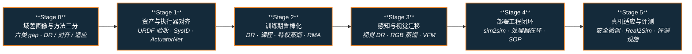

# 路线（纵深）：如果目标是 Sim2Real（仿真到真机迁移）

**摘要**：面向"想把仿真里训好的策略稳定搬上真机"的纵深路线，从 domain gap 六类来源画像与方法三分（仿真端随机化 / 分布对齐 / 真机适应），到资产与执行器对齐（SysID / ActuatorNet / BAM / PACE / SAGE）、训练期鲁棒化（DR / 课程 / 特权蒸馏 / RMA）、感知视觉迁移，再到部署工程闭环（sim2sim 回归 / 处理器在环 / 渐进 SOP）与真机安全微调、Real2Sim、评测基础设施，按 Stage 0–5 串通核心方法；本路线是 [运动控制主路线](motion-control.md) L6 综合实战的展开版，横切所有"仿真训练 → 真机部署"的纵深方向。

## 路线一览

## 这条路径怎么用

- 目标读者是已能在 Isaac Lab / MuJoCo 里训出一个能用的策略、但"一上真机就不对劲"的人——主战场是足式 locomotion、人形全身控制与操作策略的真机落地
- Sim2Real 解决 **仿真与现实的分布差**：它不负责把策略训好，那是 [RL 纵深](depth-rl-locomotion.md) 与 [模仿学习纵深](depth-imitation-learning.md) 的主题；它负责让训好的策略在真机上仍然成立
- 每个阶段都有前置知识、核心问题、推荐做什么、推荐读什么、学完输出什么

**和主路线的关系：**
- 本路线是主路线 **L6（综合实战 · sim2real 闭环）** 的展开版；走完 L5.2（能训出仿真 locomotion 策略）即可切入
- Stage 1 执行器对齐与 [力矩电机设计纵深](depth-torque-motor-design.md) 共享电机模型知识；Stage 3 与 [感知越障纵深](depth-perceptive-locomotion.md) 共享"感知进策略"的工程栈
- 若目标是"部署后继续在真机上学"，走完 Stage 5 方向 A 后接 [真机安全 RL 微调](../wiki/concepts/safe-real-world-rl-fine-tuning.md) 的三条路径展开

---

## Stage 0 域差画像与方法三分：先钉死 gap 从哪来

**先把失效归因到具体 gap 类别，再选方法，否则会陷入"无脑加 DR"的循环。**

### 前置知识
- Python + PyTorch 熟练
- 主路线 L5.2 水平（在 Isaac Lab / MuJoCo 里完整训过一个 locomotion 或操作策略）

### 核心问题
- Domain gap 的六类来源：动力学参数、执行器响应、传感器噪声、延迟与通信抖动、视觉外观、固件与总线路径
- 方法三分：**仿真端随机化**（DR）、**分布对齐**（SysID / Domain Adaptation）、**真机适应**（特权蒸馏 / RMA / 微调）各自在改哪个分布
- 为什么"仿真越逼真越好"是误区：随机化换鲁棒性 vs 对齐换精度的取舍

### 推荐做什么
- 把自己策略的真机（或 sim2sim）失效现象逐条归类到六类 gap，形成失效清单
- 给三大类方法各写一句适用判据（何时该标定、何时该随机化、何时该在线适应）

### 推荐读什么
- [Sim2Real](../wiki/concepts/sim2real.md)（本仓库）— 概念枢纽，含工程流程总览图
- [Sim2Real 方法横向对比](../wiki/comparisons/sim2real-approaches.md)（本仓库）— 三大类路线的选型决策树
- [Query：如何缩小 sim2real gap](../wiki/queries/sim2real-gap-reduction.md)（本仓库）
- Tobin et al. 2017, *Domain Randomization for Transferring Deep Neural Networks* — DR 奠基论文；Peng et al. 2018, *Sim-to-Real Transfer with Dynamics Randomization*

### 学完输出什么
- 一张"gap 来源 × 对策"映射表
- 能一句话说清 DR / SysID / RMA 分别在改训练分布、仿真分布还是策略本身

---

## Stage 1 资产与执行器对齐：把仿真拉向真机

**真机 gap 的一大半来自执行器模型不准；先对齐资产与执行器，再谈随机化。**

### 前置知识
- Stage 0 内容
- 了解 URDF/MJCF 结构与关节 PD 控制

### 核心问题
- URDF/MJCF 验收要核对什么：惯性、碰撞盒、关节轴、传动比；生成式 sim-ready 资产为何不能"生成即可用"
- SysID 标定什么：质量惯量、摩擦、延迟；chirp 激励 + CMA-ES 辨识的套路（PACE / BAM）
- Implicit vs Explicit 执行器模型的取舍；ActuatorNet（数据驱动）、BAM 扩展摩擦（解析）、Armature 补偿各适用什么执行器
- 如何量化执行器层 gap：SAGE 式仿真重放与真机日志对齐
- 并联踝等闭链机构在"训练用开环树 / 真机串并联"之间的落差

### 推荐做什么
- 对一个关节做 chirp 悬空辨识，把标定前后仿真轨迹与真机日志的 RMSE 对比
- 用 SAGE 式重放对齐给自己的平台做一份执行器 gap 画像

### 推荐读什么
- [System Identification](../wiki/concepts/system-identification.md)（本仓库）
- [Implicit / Explicit 执行器建模](../wiki/concepts/implicit-explicit-actuator-modeling.md) · [Armature 建模](../wiki/concepts/armature-modeling.md)（本仓库）
- [Actuator Network](../wiki/methods/actuator-network.md)（本仓库）— 数据驱动执行器模型
- [BAM 扩展摩擦模型](../wiki/entities/paper-bam-extended-friction-servo-actuators.md) · [PACE](../wiki/entities/paper-pace-sim2real-legged-robots.md)（本仓库）— 解析辨识两条代表路线
- [SAGE（执行器 Sim2Real 间隙估计）](../wiki/entities/sage-sim2real-actuator-gap-estimator.md)（本仓库）
- [人形机器人并联关节解算](../wiki/concepts/humanoid-parallel-joint-kinematics.md)（本仓库）

### 学完输出什么
- 一份 URDF/执行器验收 checklist 与本平台的执行器 gap 画像
- 能解释"为什么 implicit 上训的策略换 explicit 不一定直接迁移"

---

## Stage 2 训练期鲁棒化：DR · 课程 · 特权蒸馏 · 在线适应

**Stage 1 把仿真拉向真机，这一层把策略推向分布外仍然稳。**

### 前置知识
- Stage 1 内容
- 会改 RL 训练配置（reward、随机化项、课程）

### 核心问题
- DR 随机化哪些参数、范围怎么定、何时反而伤性能；DR 与课程学习怎么配合
- 特权 Teacher–Student 为什么是 sim2real 核心套路：把 RL 探索转成 Teacher 标注的监督学习
- RMA 两阶段：特权 extrinsics 训 base policy，历史轨迹监督训 adaptation module，真机秒级隐式估计环境参数
- 约束即安全层：把电机速度–扭矩包络写进训练（MUJICA、KAIST Hound MOR 约束 RL），替代"纯 DR 赌鲁棒"

### 推荐做什么
- 在自己的任务上跑"无 DR / 动力学 DR / DR + RMA"三组消融，记录训练稳定性与 sim2sim 成绩
- 为本平台写一份 DR 参数表，每项标注范围依据（标定值 ± 不确定度，而非拍脑袋）

### 推荐读什么
- [Domain Randomization](../wiki/concepts/domain-randomization.md) · [Curriculum Learning](../wiki/concepts/curriculum-learning.md)（本仓库）
- [Privileged Training](../wiki/concepts/privileged-training.md)（本仓库）
- [RMA（Rapid Motor Adaptation）](../wiki/entities/paper-rma-rapid-motor-adaptation.md)（本仓库）— 在线适应代表作
- [MUJICA](../wiki/entities/paper-mujica-wheel-legged-multi-skill.md)（本仓库）— 电机包络约束进 P3O 的零样本实例
- [执行器约束 RL 高速四足](../wiki/entities/paper-actuator-constrained-rl-high-speed-quadruped-locomotion.md)（本仓库，arXiv:2312.17507）— MOR 约束 + 减速器映射；HOUND 6.5 m/s 与高速 sim2real 消融

### 学完输出什么
- 一份带范围依据的 DR 参数表
- 能解释 RMA 两阶段各监督什么、部署时为什么不需要真机微调

---

## Stage 3 感知与视觉 Sim2Real

**状态策略迁移解决"身体"，视觉策略迁移还要解决"眼睛"。**

### 前置知识
- Stage 2 内容
- 了解深度相机 / RGB 输入策略的基本结构

### 核心问题
- 视觉 gap 的三种打法：视觉域随机化、状态 Teacher → RGB Student 蒸馏（PPO + DAgger）、用视觉基础模型替代重度 depth randomization
- 合成深度大规模预训练 + 噪声增强为何能支撑零样本真机导航（SRU）
- 3DGS / 路径追踪渲染如何缩小视觉 gap 以合成训练数据（LEGS / OASIS）

### 推荐做什么
- 给一个深度输入策略加并行深度噪声增强，对比零样本 sim2sim / 真机表现
- 任选一篇视觉 sim2real 工作，画出它在"随机化 / 蒸馏 / VFM 替代"三分中的位置

### 推荐读什么
- [GR00T-VisualSim2Real](../wiki/entities/gr00t-visual-sim2real.md)（本仓库）— PPO Teacher + DAgger RGB Student，G1 零样本
- [LadderMan](../wiki/entities/paper-ladderman-humanoid-perceptive-ladder-climbing.md)（本仓库）— 真机用 VFM 深度替代重度 depth randomization
- [SRU](../wiki/entities/paper-sru-spatially-enhanced-recurrent-memory.md)（本仓库）— 合成深度预训练 + 深度噪声增强的零样本导航
- [LEGS](../wiki/entities/paper-legs-embodied-gaussian-splatting-vla.md) · [OASIS](../wiki/entities/paper-loco-manip-04-oasis.md)（本仓库）— 3DGS / 路径追踪视觉 DR 合成数据

### 学完输出什么
- 一份"状态策略 → 视觉策略"的迁移决策记录（随机化 / 蒸馏 / VFM 三选或组合）
- 能说清视觉 gap 与动力学 gap 的对策为何不能互相替代

---

## Stage 4 部署工程闭环：sim2sim 回归 → 处理器在环 → 渐进 SOP

**上真机前把能在仿真里暴露的问题全部暴露完；上真机后按 SOP 渐进，不赌运气。**

### 前置知识
- Stage 2 内容（Stage 3 视觉部分按需）
- 了解 ROS / 实时中间件与机载计算板的基本约束

### 核心问题
- 为什么要跨仿真器回归（IsaacGym → MuJoCo sim2sim）：把"过拟合仿真器实现"与"真 gap"分开
- 中间件与频率对齐：策略频率 + 底层 PD 频率、动作/状态归一化在仿真与真机的一致性
- 处理器在环：固件调度、CAN/I2C 总线语义与抖动何时必须纳入训练闭环
- ONNX 导出与机载推理 runtime 选型；渐进式真机 SOP（吊架 → 空转 → 落地）与系统排障

### 推荐做什么
- 把策略导出 ONNX，在目标机载板上实测推理延迟与抖动
- 完整跑一遍 sim2real checklist，产出一次 sim2sim 回归报告再上真机

### 推荐读什么
- [Query：Sim2Real Checklist](../wiki/queries/sim2real-checklist.md)（本仓库）— 完整工程清单（含 3 分钟快速版）
- [处理器在环 Sim2Real](../wiki/concepts/processor-in-the-loop-sim2real.md)（本仓库）
- [Query：RL 策略真机调试 Playbook](../wiki/queries/robot-policy-debug-playbook.md)（本仓库）
- [ONNX](../wiki/entities/onnx.md) · [ONNX Runtime vs MNN vs TensorRT](../wiki/comparisons/onnxruntime-vs-mnn-vs-tensorrt.md)（本仓库）
- [Open Duck Mini](../wiki/entities/open-duck-mini.md)（本仓库）— 低成本平台全链路 sim2real 公开参考

### 学完输出什么
- 一份本平台的部署 SOP 文档与 sim2sim 回归报告
- 能定位一次真机失效属于策略问题、模型 gap 还是工程链路问题

---

## Stage 5 真机适应、Real2Sim 与评测

### 前置知识
- Stage 4 内容

**方向 A：真机安全微调与少样本适应**
- 冻结仿真策略 + 低秩残差（LoRA）+ 安全壳的收尾范式；只改执行映射不改任务意图的少样本动力学对齐
- 关键词：[真机安全 RL 微调](../wiki/concepts/safe-real-world-rl-fine-tuning.md)、[SLowRL](../wiki/entities/paper-slowrl-safe-lora-locomotion-sim2real.md)、[FADA](../wiki/entities/paper-fada-humanoid.md)、[LIFT](../wiki/entities/lift-humanoid.md)、[SplitAdapter](../wiki/entities/paper-splitadapter-load-aware-loco-manipulation.md)

**方向 B：Real2Sim 与数字孪生**
- 从单目/真机视频构造接触动力学可信的仿真资产与 digital cousins，反向补齐仿真侧
- 关键词：[CRISP](../wiki/methods/crisp-real2sim.md)、[SimFoundry](../wiki/entities/paper-simfoundry-real2sim-scene-generation.md)、[PhysX-Omni](../wiki/entities/physx-omni.md)

**方向 C：评测基础设施与 sim-vs-real 评测 gap**
- 可信仿真作为闭环评测基础设施：real-to-sim 相关性、可复现性 vs 真实代表性的取舍
- 关键词：[仿真评测基础设施](../wiki/concepts/simulation-evaluation-infrastructure.md)、[Sim vs Real 评测 gap](../wiki/concepts/sim-vs-real-eval-gap.md)、[Genesis World 1.0](../wiki/entities/genesis-world-10.md)

**方向 D：跨具身迁移与整机栈汇合**
- 换机体后是否需要重跨 domain gap；sim2real 在 VLA / BFM 整机栈中的位置
- 关键词：[跨具身策略迁移选型指南](../wiki/queries/cross-embodiment-transfer-strategy.md)、[RL 纵深](depth-rl-locomotion.md)、[BFM 纵深](depth-bfm.md)、[VLA 纵深](depth-vla.md)

---

## 快速入口汇总

| 阶段 | 核心问题 | 本仓库入口 |
|------|---------|-----------|
| Stage 0 | 域差画像与方法三分 | [Sim2Real](../wiki/concepts/sim2real.md) |
| Stage 1 | 资产与执行器对齐 | [System Identification](../wiki/concepts/system-identification.md) |
| Stage 2 | 训练期鲁棒化 | [Domain Randomization](../wiki/concepts/domain-randomization.md) |
| Stage 3 | 感知与视觉迁移 | [GR00T-VisualSim2Real](../wiki/entities/gr00t-visual-sim2real.md) |
| Stage 4 | 部署工程闭环 | [Sim2Real Checklist](../wiki/queries/sim2real-checklist.md) |
| Stage 5 | 真机适应 / Real2Sim / 评测 | [真机安全 RL 微调](../wiki/concepts/safe-real-world-rl-fine-tuning.md) |

## 和其他页面的关系

- 完整成长路线参考：[主路线：运动控制算法工程师成长路线](motion-control.md)（本路线是 L6 的展开版）
- 其它纵深路径：
  - [人形 RL 运动控制](depth-rl-locomotion.md) — 本路线消费其训练产物；训练侧直接前置
  - [力矩控制电机设计（指标 → 电磁热 → FOC 力矩闭环）](depth-torque-motor-design.md) — Stage 1 执行器模型的硬件侧展开版
  - [感知越障（Perceptive Locomotion）](depth-perceptive-locomotion.md) — Stage 3 感知进策略的任务侧展开版
  - [模仿学习与技能迁移](depth-imitation-learning.md)
  - [传统模型控制（LIP/ZMP → MPC → WBC）](depth-classical-control.md)
  - [安全控制（CLF/CBF）](depth-safe-control.md) — Stage 5 方向 A 安全壳的理论侧
  - [接触丰富的操作任务](depth-contact-manipulation.md)
  - [导航（SLAM → VLN → 导航 VLA）](depth-navigation.md)
  - [Loco-Manipulation（移动操作）](depth-loco-manipulation.md)
  - [人形足球（全向行走 → 感知踢球 → 多机战术）](depth-humanoid-soccer.md)
  - [动作重定向（人体动作 → 机器人参考轨迹）](depth-motion-retargeting.md)
  - [人形拳击（动作跟踪 → 潜空间技能 → 对抗自博弈）](depth-humanoid-boxing.md)
  - [BFM（人形行为基础模型）](depth-bfm.md)
  - [动作生成（文本/多模态 → 人形动作）](depth-motion-generation.md)
  - [VLA（视觉-语言-动作模型）](depth-vla.md)
  - [WAM（世界–动作模型）](depth-wam.md)
- 人形控制全景图：[Humanoid Control Roadmap](../wiki/roadmaps/humanoid-control-roadmap.md)
- 技术栈地图：[tech-map/dependency-graph.md](../tech-map/dependency-graph.md)

## 参考来源

本路线基于以下原始资料与 wiki 编译页的归纳：

- [Sim2Real 概念页](../wiki/concepts/sim2real.md) 与 [Sim2Real 方法横向对比](../wiki/comparisons/sim2real-approaches.md)
- [sources/papers/sim2real.md](../sources/papers/sim2real.md) — DR / RMA / InEKF ingest 摘要
- [sources/papers/rma_arxiv_2107_04034.md](../sources/papers/rma_arxiv_2107_04034.md) — RMA 一手论文摘录（RSS 2021）
- [sources/repos/xbotics-embodied-guide.md](../sources/repos/xbotics-embodied-guide.md) — Sim2Real SOP 工程步骤
- [sources/repos/sage-sim2real-actuator-gap.md](../sources/repos/sage-sim2real-actuator-gap.md) — 执行器层 gap 度量工具链
- [sources/courses/nvidia_sim_to_real_so101_isaac.md](../sources/courses/nvidia_sim_to_real_so101_isaac.md) — DR / Co-training / Cosmos / SAGE+GapONet 四类策略对照
- Tobin et al. 2017（Domain Randomization 奠基）；Peng et al. 2018（Dynamics Randomization）
