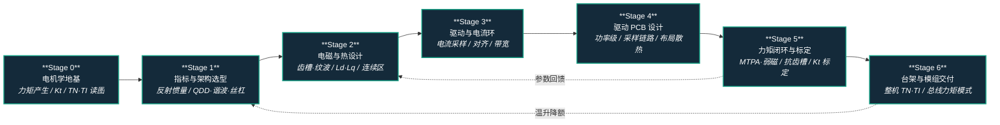

# 路线（纵深）：如果目标是力矩控制电机设计（指标 → 电磁热 → FOC 力矩闭环 → 关节模组）

**摘要**：面向"想把关节电机从任务指标一路做到可验收力矩闭环模组"的纵深路线，从电机学地基与 TN/TI 读图，到关节指标定义与执行器架构选型、电磁热设计、驱动硬件与电流环、电机驱动 PCB 设计落板，再到 FOC 力矩闭环标定补偿与台架验收交付，按 Stage 0–6 串通全流程；本路线是 [运动控制主路线](motion-control.md) 的硬件底座分支——所有控制/RL 纵深输出的关节力矩指令，最终都要靠这条路线交付的力矩闭环兑现。

## 路线一览

## 这条路径怎么用

- 目标读者是想做**力矩可控的关节执行器**的硬件/驱动/机器人工程师——不是"选一台电机装上"，而是让"给 1 Nm 就是 1 Nm"在指标、电磁、驱动、落板、标定、验收六个层面都成立
- 需要基础电磁学与电路直觉（安培力、反电势、RL 回路）；FEA 工具与控制推导会随路线逐步补
- 每个阶段有前置知识、核心问题、推荐读什么、推荐做什么、学完输出什么
- 主干工序总览可先读 [电机设计流程（规格 → 仿真 → 样机 → 控制）](../wiki/overview/motor-design-workflow.md)——本路线是它的**学习顺序展开版**：该页回答"工序有哪些"，本路线回答"按什么顺序把每道工序学成可动手的能力"

**和主路线的关系：**
- 本路线位于主路线 L0–L2 之下的**硬件底座层**，任意阶段可切入；建议在主路线 L2（动力学）前后进入，此时"关节力矩"已经从抽象符号变成物理需求
- [传统模型控制纵深](depth-classical-control.md) Stage 4 的 WBC 与 [RL 运动控制纵深](depth-rl-locomotion.md) 的策略最终都输出关节力矩指令；这条指令假设的"力矩源"就是本路线的交付物
- sim2real 里的执行器建模（[Actuator Network](../wiki/methods/actuator-network.md)、[Implicit/Explicit 建模](../wiki/concepts/implicit-explicit-actuator-modeling.md)）在 Stage 6 与台架数据闭环——硬件团队交付的不只是模组，还有它的可仿真模型

---

## Stage 0 电机学地基与读图能力

### 前置知识
- 电磁学基础（安培力、法拉第定律、磁路直觉）
- 基础电路（RL 回路、PWM 的平均电压思想）
- Python 或 MATLAB 会画曲线即可

### 核心问题
- 一台 PMSM 的力矩到底从哪来，力矩常数 \(K_t\) 与反电势常数 \(K_e\) 为什么本质是同一件事
- TN 曲线的恒转矩区 / 恒功率区由什么决定，"宣传峰值"和"连续转矩"为什么能差 3 倍
- TI 曲线的线性区、饱和区、驱动限流各说明什么

### 推荐读什么
- [电机转矩-转速曲线（TN 曲线）](../wiki/concepts/motor-torque-speed-curve.md)
- [电机转矩-电流曲线（TI 曲线）](../wiki/concepts/motor-torque-current-curve.md)
- [磁场定向控制（FOC）](../wiki/concepts/field-oriented-control.md) — 先只读"为什么要在 dq 轴看电机"的部分
- [Humanoid 执行器 102：八章技术地图](../wiki/overview/humanoid-actuator-102-technology-map.md) — 全景扫一遍，知道后面每一站在哪

### 推荐做什么
- 找一份真实关节电机/模组 datasheet（如 [高擎机电](../wiki/entities/hightorque-robotics.md) 或任意无人机外转子电机），在 TN 图上标出峰值区、连续区、基速，并推算母线电压假设
- 用 TI 数据点做线性拟合得到 \(K_t\)，找出饱和拐点，和标称值对比

### 学完输出什么
- 能解释 \(\tau = K_t i_q\) 在什么范围内成立、什么时候失效（饱和、温升、弱磁）
- 拿到任何一份电机 datasheet，能在 5 分钟内判断"它的连续能力配不配得上宣传峰值"

---

## Stage 1 关节指标定义与执行器架构选型

### 核心问题
- 从蹲起/行走/抗冲击任务怎么反推关节的峰值力矩、连续力矩、基速与力矩带宽
- 减速比 \(n\) 的双刃剑：力矩放大 \(n\) 倍、反射惯量放大 \(n^2\) 倍，抗冲击与力透明度怎么权衡
- QDD（准直驱）、谐波、行星滚柱丝杠三大物种各适合什么关节，为什么工业伺服直接上人形会掉坑

### 推荐读什么
- [Actuator 102 · 01：负载与质量螺旋](../wiki/overview/humanoid-actuator-102-load-and-mass-spiral.md) 与 [Actuator 102 · 03：减速与反射惯量](../wiki/overview/humanoid-actuator-102-gear-reflected-inertia.md)
- [Actuator 102 · 07：决策矩阵与三大物种](../wiki/overview/humanoid-actuator-102-decision-species.md) 与 [Actuator 102 · 06：工业执行器陷阱](../wiki/overview/humanoid-actuator-102-industrial-actuator-trap.md)
- [Actuator 102 · 02：旋转-直线分离架构](../wiki/overview/humanoid-actuator-102-split-architecture.md) 与 [人形腿部行星滚柱丝杠直线驱动（PRS 路线）](../wiki/concepts/planetary-roller-screw-humanoid-leg-actuation.md)
- [Humanoid Hardware 101 · 04：集成执行器](../wiki/overview/humanoid-hardware-101-integrated-actuators.md)
- [Quasi-Direct Drive for Low-Cost Compliant Robotic Manipulation](../wiki/entities/paper-notebook-quasi-direct-drive-for-low-cost-compliant-roboti.md) — QDD 路线的代表作
- [Human-Level Actuation for Humanoids](../wiki/entities/paper-notebook-human-level-actuation-for-humanoids.md) — 指标怎么定义才防"刷分"

### 推荐做什么
- 给 70 kg 人形的膝关节从任务（蹲起 1–3 s、平地行走、上楼）反推峰值/连续力矩与基速，画出目标 TN 包络草图
- 用反射惯量公式对比减速比 6:1 与 50:1 方案在落地冲击下的等效惯量与背驱力矩差异

### 学完输出什么
- 一页纸的**关节规格书**：峰值/连续力矩、峰值:持续比（目标 ≥3:1）、基速、比力矩（Nm/kg）、传动形式与冷却假设
- 能对任意人形关节说出"它选这个物种是在换什么"

---

## Stage 2 电磁与热设计：把力矩品质设计进铁芯里

### 核心问题
- 槽极配合与绕组形式怎么决定齿槽转矩与力矩纹波——力矩控制的"平滑度"在画图纸时就定了
- \(K_t\) 的线性区与磁饱和、\(L_d/L_q\) 凸极率怎么影响后面的 MTPA 与弱磁
- 为什么连续力矩是热定的：电磁给上限、热给下限

### 推荐读什么
- [电机设计流程](../wiki/overview/motor-design-workflow.md) 步骤 2–5（拓扑槽极 → FEA → 热与 CFD → 机械集成）
- [电机电磁与多物理场仿真软件选型](../wiki/comparisons/motor-em-simulation-software.md)
- [Actuator 102 · 04：热学与力矩控制](../wiki/overview/humanoid-actuator-102-thermal-and-control.md)
- [Query：人形机器人电池与热管理指南](../wiki/queries/humanoid-battery-thermal-management.md) — 关节热预算与整机热链路的衔接

### 推荐做什么
- 用 Motor-CAD / Maxwell（或免费的 FEMM）对同一定子扫 2–3 组槽极方案，对比齿槽转矩、纹波与 \(K_t\)
- 做一次温升仿真，把"允许连续工作区"画回 TN 图，体会连续区比电磁峰值缩水多少

### 学完输出什么
- 一版电磁方案与报表：齿槽转矩、力矩纹波、\(K_t\) 线性区、\(L_d/L_q\)、反电势谐波
- 能回答"这台电机的连续力矩是被绕组温升还是磁钢温升卡死的"

---

## Stage 3 驱动硬件与电流环：力矩闭环的物理底座

### 核心问题
- 相电流采样方案（低侧/在线/单电阻重构）与力矩精度的关系——采不准电流就谈不上力矩
- PWM 频率、电流环带宽、低电感高 \(K_v\) 电机的电流纹波三者怎么互相牵制
- 编码器精度、电角度零位对齐、相序错误各会造成什么症状

### 推荐读什么
- [磁场定向控制（FOC）逐步推导](../wiki/formalizations/field-oriented-control-derivation.md) — Clarke/Park 变换到电流环设计
- [控制环路延迟建模](../wiki/formalizations/control-loop-latency-modeling.md) — 采样、PWM 更新与指令延迟的预算方法
- [SimpleFOC（Arduino-FOC 生态）](../wiki/entities/simplefoc.md) — 原型级驱动栈，代码可读性最好的教学实现
- [Actuator 102 · 04：热学与力矩控制](../wiki/overview/humanoid-actuator-102-thermal-and-control.md) "控制（VI）"一节 — 电流环 >20 kHz、指令到力矩 <1 ms 的量级感

### 推荐做什么
- 用 SimpleFOC / ODrive 级开源驱动点一台云台或 QDD 电机：做极对数辨识、电角度对齐，跑通 \(i_d/i_q\) 电流闭环
- 给电流环打阶跃，测上升时间估带宽；改 PWM 频率与电流环增益，观察纹波与噪声变化

### 学完输出什么
- 一套能跑电流闭环的实物（或高保真仿真）驱动
- 能画出"力矩指令 → \(i_q^*\) → PWM → 相电流 → 电磁力矩"的信号链，并指出每一跳的误差来源

---

## Stage 4 电机驱动 PCB 设计：把电流环装进自己的板子

### 核心问题
- 功率级选型怎么跟 Stage 1 的关节规格对齐：母线电压与峰值相电流决定 MOSFET 的 \(R_{ds(on)}\)/\(Q_g\) 权衡、栅极驱动（自举还是隔离）、死区设置与母线电容容量
- Stage 3 的"采不准电流就谈不上力矩"怎么落到板上：采样电阻的开尔文接法、运放带宽与共模抑制、ADC 采样窗口与 PWM 中心对齐
- 功率回路寄生电感与开关噪声怎么被布局布线管住：层叠与接地分区、功率环路面积最小化、编码器/总线小信号与功率级的隔离
- 关节内嵌驱动板的体积与散热约束：铜皮 + 导热垫 + 外壳的散热路径怎么接进 Stage 2 的热预算，板级过流/过温/欠压保护阈值怎么定

### 推荐读什么
- [KiCad（开源 PCB EDA）](../wiki/entities/kicad.md) — 原理图 → layout → Gerber 的零许可成本工具链；[10.0 中文文档](https://docs.kicad.org/10.0/zh/) 与 `kicad-cli` 适合团队版控与打样前 DRC
- [Altium Designer](../wiki/entities/altium-designer.md) — 商业 EDA 官方文档（原理图 → 规则驱动 layout → OutJob/制造发布、ECAD-MCAD 协同）；量产向自研驱动板的常用工具链
- [SimpleFOC（Arduino-FOC 生态）](../wiki/entities/simplefoc.md) "硬件：SimpleFOCBoards" 一节 — 原理图与制板指南开源，低功率参考设计的起点；更高功率参考 ODrive / VESC / mjbots
- [开源人形机器人硬件](../wiki/entities/open-source-humanoid-hardware.md) — 自研关节驱动板的开源整机参考（ODRI Solo、Berkeley Humanoid Lite 等）
- [Humanoid Hardware 101 · 05：能源与计算电子](../wiki/overview/humanoid-hardware-101-power-compute-electronics.md) — PCB/BMS 的模块复用与 DFM 降本视角
- [CAN 总线协议](../wiki/concepts/can-bus-protocol.md) 与 [CAN vs EtherCAT 关节总线对比](../wiki/comparisons/can-vs-ethercat-joint-bus.md) — 总线接口硬件（收发器、隔离、终端电阻）在画原理图时就要定

### 推荐做什么
- 精读一块开源驱动板原理图（SimpleFOC Mini / ODrive / moteus 任一），标注功率回路、栅极驱动、电流采样链路、保护电路四条线路并画出信号流
- 自绘一版关节驱动板：三相桥 + 栅极驱动 + 相电流采样 + MCU + CAN 收发器，走完原理图 → layout → 打样 → 焊接
- 分步 bring-up：低压限流上电看栅极与相电压波形 → 校准电流采样零偏与增益 → 复跑 Stage 3 的电角度对齐与 \(i_d/i_q\) 电流闭环
- 用示波器对比采样电阻两端电压与固件 ADC 读数，量化电流测量链路的误差与噪声底；复测电流环带宽，与 Stage 3 的开源板对比找差距

### 学完输出什么
- 一块能复跑 Stage 3 电流闭环的自研驱动板，附原理图、layout 与 bring-up 记录
- 一份力矩精度的硬件误差预算表：采样电阻精度/温漂、运放失调、ADC 分辨率、死区畸变各贡献多少力矩误差——Stage 5 的标定补偿从这张表出发

---

## Stage 5 FOC 力矩闭环、标定与补偿

### 核心问题
- MTPA 与弱磁怎么按 \(L_d/L_q\) 分配 \(i_d/i_q\)，高速区力矩指令为什么必须打折
- 抗齿槽前馈、摩擦补偿放在驱动器还是上层控制器，各自的带宽与标定成本
- \(K_t\) 标定与力矩获取三条路——电流估计、关节力矩传感器、串联弹性（SEA）——怎么选
- 力矩带宽（-3 dB）怎么测，50–100 Hz 的目标对腿足意味着什么

### 推荐读什么
- [磁场定向控制（FOC）](../wiki/concepts/field-oriented-control.md) 与 [FOC 逐步推导](../wiki/formalizations/field-oriented-control-derivation.md) 的 MTPA/弱磁部分
- [Friction Compensation（摩擦补偿）](../wiki/concepts/friction-compensation.md) 与 [Joint Friction Models（关节摩擦模型）](../wiki/concepts/joint-friction-models.md)
- [Actuator 102 · 05：柔顺与感知反馈](../wiki/overview/humanoid-actuator-102-compliance-sensing.md) — 力/力矩感知与柔顺路线
- [Impedance Control（阻抗控制）](../wiki/concepts/impedance-control.md) — 力矩模式之上最常用的关节级接口

### 推荐做什么
- 台架上做 \(K_t\) 标定曲线（含饱和区与温度点），对比标称值；把标定表写进驱动固件
- 实现抗齿槽前馈 + 库仑/粘滞摩擦补偿，对比补偿前后低速力矩跟踪与背驱手感
- 对力矩环扫频，测出 -3 dB 带宽并定位瓶颈（电流环、滤波还是机械谐振）

### 学完输出什么
- 一台"给 1 Nm 就是 1 Nm"的电机：力矩精度、纹波、带宽三项指标可量化、可复测
- 能解释为什么 QDD 靠电流估计力矩可行、高减速比谐波关节往往要加力矩传感器

---

## Stage 6 台架验收与关节模组交付

### 核心问题
- 整机（电机+减速器+驱动器）TN/TI 与单电机差在哪：减速器效率、背隙、热阻会怎么改写包络
- 总线力矩模式（CAN/CAN-FD/EtherCAT）的延迟预算怎么分，1 kHz 力矩指令链路怎么验证
- 交付给控制/RL 团队时，执行器的可仿真模型（摩擦、延迟、饱和）怎么从台架数据来

### 推荐读什么
- [电机设计流程](../wiki/overview/motor-design-workflow.md) 步骤 6–8（台架 → FOC 验证 → 模组验收）
- [电机驱动器底软通信协议总览](../wiki/overview/motor-drive-firmware-bus-protocols.md)
- [Query：EtherCAT 主站优化指南](../wiki/queries/ethercat-master-optimization.md) 与 [Query：实时运控中间件配置指南](../wiki/queries/real-time-control-middleware-guide.md)
- [Actuator Network（执行器网络）](../wiki/methods/actuator-network.md)、[Implicit/Explicit 执行器建模](../wiki/concepts/implicit-explicit-actuator-modeling.md)、[Armature Modeling（电枢惯量建模）](../wiki/concepts/armature-modeling.md) — 台架数据回馈仿真的三条路
- [NeuralActuator](../wiki/entities/paper-neuralactuator-neural-actuation-modeling.md) — Transformer 执行器模型联合预测可微仿真 torque surrogate 与无 F/T 传感器外力估计，低成本舵机平台上力估计误差降至 0.12 N，可作台架数据回馈仿真的第四条路
- [Query：主流人形机器人硬件对比](../wiki/queries/hardware-comparison.md) — 对照商用模组的验收指标定位自己的水平

### 推荐做什么
- 对拖台架测整模组 TN/TI、效率地图与温升曲线，和 Stage 2 仿真对账；偏差大时回改磁路或冷却而不是只调驱动参数
- 上总线以 1 kHz 发力矩指令，测"指令 → 相电流 → 输出力矩"的端到端延迟与抖动
- 把台架数据拟合成执行器模型（解析摩擦模型或 actuator network），在 Isaac/MuJoCo 里复现台架阶跃响应

### 学完输出什么
- 一份可交付的**关节模组验收报告**：整机 TN/TI、力矩精度/带宽、温升、总线延迟
- 一个能进仿真器的执行器模型——硬件与 sim2real 从此说同一种语言

---

## 快速入口汇总

| 阶段 | 核心问题 | 本仓库入口 |
|------|---------|-----------|
| Stage 0 | 力矩从哪来、TN/TI 怎么读 | [TN 曲线](../wiki/concepts/motor-torque-speed-curve.md) |
| Stage 1 | 指标反推与三大物种选型 | [Actuator 102 · 07：决策矩阵与三大物种](../wiki/overview/humanoid-actuator-102-decision-species.md) |
| Stage 2 | 齿槽/纹波/热连续区 | [电机设计流程](../wiki/overview/motor-design-workflow.md) |
| Stage 3 | 电流采样与电流环 | [FOC 逐步推导](../wiki/formalizations/field-oriented-control-derivation.md) |
| Stage 4 | 驱动板功率级/采样链路落板 | [Humanoid Hardware 101 · 05：能源与计算电子](../wiki/overview/humanoid-hardware-101-power-compute-electronics.md) |
| Stage 5 | 力矩标定与补偿 | [磁场定向控制（FOC）](../wiki/concepts/field-oriented-control.md) |
| Stage 6 | 模组验收与总线力矩模式 | [电机驱动器底软通信协议总览](../wiki/overview/motor-drive-firmware-bus-protocols.md) |

## 和其他页面的关系

- 完整成长路线参考：[主路线：运动控制算法工程师成长路线](motion-control.md)
- 工序主干总览：[电机设计流程（规格 → 仿真 → 样机 → 控制）](../wiki/overview/motor-design-workflow.md)；本路线是其学习顺序展开版
- 其它纵深路径：
  - [传统模型控制（LIP/ZMP → MPC → WBC）](depth-classical-control.md) — Stage 4 WBC 输出的关节力矩由本路线的力矩闭环兑现
  - [人形 RL 运动控制](depth-rl-locomotion.md) — sim2real 执行器建模（Stage 5）的下游消费者
  - [安全控制（CLF/CBF）](depth-safe-control.md)
  - [接触丰富的操作任务](depth-contact-manipulation.md) — 阻抗/力控接口建立在本路线的力矩模式之上
  - [导航（SLAM → VLN → 导航 VLA）](depth-navigation.md)
  - [模仿学习与技能迁移](depth-imitation-learning.md)
  - [Loco-Manipulation（移动操作）](depth-loco-manipulation.md)
  - [动作重定向（人体动作 → 机器人参考轨迹）](depth-motion-retargeting.md)
  - [BFM（人形行为基础模型）](depth-bfm.md)
  - [感知越障（Perceptive Locomotion）](depth-perceptive-locomotion.md)
  - [动作生成（文本/多模态 → 人形动作）](depth-motion-generation.md)
  - [VLA（视觉-语言-动作模型）](depth-vla.md)
  - [WAM（世界–动作模型）](depth-wam.md)
  - [人形足球（全向行走 → 感知踢球 → 多机战术）](depth-humanoid-soccer.md)
  - [人形拳击（动作跟踪 → 潜空间技能 → 对抗自博弈）](depth-humanoid-boxing.md)
- 关联知识页：
  - [Humanoid 执行器 102：八章技术地图](../wiki/overview/humanoid-actuator-102-technology-map.md)
  - [Humanoid Hardware 101 · 04：集成执行器](../wiki/overview/humanoid-hardware-101-integrated-actuators.md)
  - [电机电磁与多物理场仿真软件选型](../wiki/comparisons/motor-em-simulation-software.md)
  - [电机转矩-电流曲线（TI 曲线）](../wiki/concepts/motor-torque-current-curve.md)
  - [Query：人形机器人硬件选型指南](../wiki/queries/humanoid-hardware-selection.md)

## 参考来源

本路线基于以下原始资料与 wiki 编译页的归纳：

- [电机设计流程（规格 → 仿真 → 样机 → 控制）](../wiki/overview/motor-design-workflow.md) 及其 sources（Motor-CAD 官方资料、电机曲线与电磁仿真 FAQ、SimpleFOC 文档）
- [Humanoid 执行器 102 系列](../wiki/overview/humanoid-actuator-102-technology-map.md)（sources：执行器 102 微信长文）
- [磁场定向控制（FOC）逐步推导](../wiki/formalizations/field-oriented-control-derivation.md)
- Blaschke, *The Principle of Field Orientation as Applied to the New Transvektor Closed-Loop Control System* (1972) — FOC 起点
- Wensing et al., *Proprioceptive Actuator Design in the MIT Cheetah* (IEEE T-RO, 2017) — QDD/本体感知执行器设计范式
- Katz, *A Low Cost Modular Actuator for Dynamic Robots* (MIT MSc thesis, 2018) — MIT Mini Cheetah 执行器全流程实例
