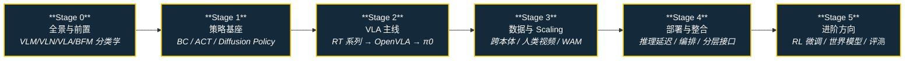

# 路线（纵深）：如果目标是 VLA（视觉-语言-动作模型）

**摘要**：面向"想让机器人听懂指令干活"的纵深路线，从具身模型分类学、模仿学习策略基座，到 VLA 语义策略主线（RT 系列 → OpenVLA → π0）、数据与 Scaling，再到部署整合与进阶方向，按 Stage 0–5 串通核心方法；本路线是 [运动控制主路线](motion-control.md) 的一条分支，与 [BFM 纵深](depth-bfm.md) 构成"任务级语义 / 身体级协调"的姊妹路线。

## 路线一览

## 这条路径怎么用

- 目标读者是有深度学习基础、想让机器人"看图、听指令、出动作"的人——主战场是操作（manipulation）任务
- VLA 解决 **任务级语义**：把 VLM 的跨模态理解接到机器人动作上；它不负责人形全身协调，那是 [BFM 纵深](depth-bfm.md) 的主题
- 每个阶段都有前置知识、核心问题、推荐做什么、推荐读什么、学完输出什么

**和主路线的关系：**
- 本路线是主路线 L5（RL 与模仿学习）之后偏"学习侧"的进阶方向，Stage 0–1 与 [模仿学习纵深](depth-imitation-learning.md) 的策略基座高度重叠
- 如果目标是"让机械臂听话干活"，走完 Stage 3 即可上手工程；Stage 4–5 面向部署与研究前沿
- 如果目标是人形全身控制或"高层 VLA + 低层 BFM"整机栈，读完 Stage 2 后切到 [BFM 纵深](depth-bfm.md)

---

## Stage 0 具身基础模型全景与前置

**先把缩写地图铺开：VLM / VLN / VLA / WAM / BFM 各管一段，混着读论文只会越读越乱。**

### 前置知识
- Python + PyTorch 熟练
- 理解 Transformer / attention（参考 [Transformer](../wiki/concepts/transformer.md)）
- 对 LLM / VLM 有使用级直觉（知道 CLIP、LLaVA 大概是什么）

### 核心问题
- VLM / VLN / VLA / 世界模型这些缩写各自指什么、边界在哪
- 什么是 foundation policy，它和"单任务策略"的本质区别是什么
- VLA 与 BFM 在机器人栈里各自解决哪一层的问题、为什么常常要叠加而不是二选一

### 推荐做什么
- 按分类学页给五类模型各找一个代表工作，写一页纸对照表
- 用 [LeRobot](../wiki/entities/lerobot.md) 跑通一个现成策略的推理 demo（只推理、不训练）

### 推荐读什么
- [VLM / VLN / VLA / VLX / 世界模型分类学](../wiki/comparisons/vlm-vln-vla-vlx-world-model-taxonomy.md)（本仓库）
- [Foundation Policy](../wiki/concepts/foundation-policy.md)（本仓库）— VLA 的母概念页
- [具身基础模型专题](../wiki/overview/topic-embodied-foundation-model.md)（本仓库）
- [Query：具身大模型家族分类学闭环](../wiki/queries/embodied-fm-taxonomy-loop.md)（本仓库）
- [LLMs-from-scratch（Raschka）](../wiki/entities/llms-from-scratch-raschka.md)（本仓库）— **可选前置**：Transformer/GPT 从零实现；配套 [YouTube 播放列表](https://www.youtube.com/playlist?list=PLTKMiZHVd_2IIEsoJrWACkIxLRdfMlw11)
- [Karpathy Zero to Hero（YouTube）](../wiki/entities/andrej-karpathy.md)（本仓库）— **可选技术轨前置**：[10 集播放列表](https://www.youtube.com/playlist?list=PLAqhIrjkxbuWI23v9cThsA9GvCAUhRvKZ)（micrograd → GPT → GPT-2）；配套 [`nn-zero-to-hero`](https://github.com/karpathy/nn-zero-to-hero)
- [Andrej Karpathy LLM 科普（YouTube）](../wiki/entities/andrej-karpathy.md)（本仓库）— **可选前置（偏直觉）**：[Intro to LLMs（~1 h）](https://www.youtube.com/watch?v=zjkBMFhNj_g) → [Deep Dive into LLMs（~3.5 h）](https://www.youtube.com/watch?v=7xTGNNLPyMI)；建立 pretrain/SFT/RLHF、工具调用与上下文窗口心智模型，再读 VLA 论文更省力

### 学完输出什么
- 能一句话说清 VLA 是什么、不是什么
- 拿到一篇新论文能放进 VLM / VLN / VLA / WAM / BFM 的正确格子里

---

## Stage 1 模仿学习策略基座

**VLA 的"动作头"建在这一层上。走过 [模仿学习纵深](depth-imitation-learning.md) Stage 0–3 的可以跳。**

### 前置知识
- Stage 0 内容
- 理解监督学习与 [Behavior Cloning](../wiki/methods/behavior-cloning.md) 基本概念

### 核心问题
- BC 的 compounding error 从哪来，为什么 action chunking 能显著缓解
- ACT（BC with Transformer）与 Diffusion Policy 的建模差异（显式回归 vs 生成式去噪）
- 为什么高维、多峰的动作分布需要生成式建模

### 推荐做什么
- 用 LeRobot / ACT 官方实现在仿真里训一个 pick-and-place 策略
- 同一任务上对比 ACT 与 Diffusion Policy 的成功率与推理延迟

### 推荐读什么
- [Action Chunking](../wiki/methods/action-chunking.md) 与 [BC with Transformer](../wiki/methods/bc-with-transformer.md)（本仓库）
- [Diffusion Policy](../wiki/methods/diffusion-policy.md) 与 [Diffusion Model](../wiki/concepts/diffusion-model.md)（本仓库）
- [Imitation Learning](../wiki/methods/imitation-learning.md)（本仓库）

### 学完输出什么
- 一个能在仿真里跑通的视觉-动作模仿策略
- 能解释 action chunking 与生成式动作头为什么成了 VLA 的标配组件

---

## Stage 2 VLA 主线：从 RT 系列到 π0

**VLA 概念由 RT-2（2023）确立：把 VLM 的语义能力直接接到机器人动作上。这是本路线的主干。**

### 前置知识
- Stage 1 内容
- 了解 VLM 的基本结构（视觉编码器 + LLM backbone）

### 核心问题
- RT-1 → RT-2 的关键跃迁：动作离散化为 token、与互联网 VQA 数据联合微调（co-fine-tuning）
- OpenVLA / Octo 的开源路线与跨本体（cross-embodiment）数据集 OXE 的作用
- π0 为什么用 flow matching 动作专家而不是自回归动作 token，π0.7 又改了什么
- SayCan 一系"LLM 高层规划"与端到端 VLA 的关系，指令增强（DIAL）解决什么问题

### 推荐做什么
- 用 OpenVLA 或 π0 开源权重在 LIBERO / 自建仿真任务上跑一轮评测
- 用 LoRA 把一个小 VLA 微调到自己的数据上，记录数据量–成功率曲线

### 推荐读什么
- [VLA](../wiki/methods/vla.md) 与 [VLA 专题](../wiki/overview/topic-vla.md)（本仓库）— 主线索引页
- [Robotics Transformer（RT 系列）](../wiki/methods/robotics-transformer-rt-series.md)、[OpenVLA](../wiki/entities/openvla.md)、[Octo](../wiki/methods/octo-model.md)（本仓库）
- [π0](../wiki/methods/π0-policy.md) 与 [π0.7](../wiki/methods/pi07-policy.md)（本仓库）
- [SayCan](../wiki/methods/saycan.md) 与 [DIAL 指令增强](../wiki/methods/dial-instruction-augmentation.md)（本仓库）

### 学完输出什么
- 能画出典型 VLA 的三段式结构（视觉编码 → 语义 backbone → 动作专家）并说清各家差异
- 一份自己任务上的 VLA 微调实验记录

---

## Stage 3 数据与 Scaling

**VLA 的瓶颈不在结构在数据：真机演示太贵，人类视频、世界模型、跨本体数据成为主战场。**

### 前置知识
- Stage 2 内容

### 核心问题
- 真机演示之外还有哪些可扩数据源：人类第一视角视频（EgoScale、HumanNet）、互联网视频（mimic-video）
- WAM（World Action Model）如何把"预测未来"与"生成动作"联合建模
- 前向 / 逆动力学解耦预训练（DeFI）解决什么问题
- 具身 Scaling Laws 目前有哪些证据、哪些只是外推

### 推荐做什么
- 按开源复现全景挑一条可在消费级 GPU 上跑通的路线，完整复现一次
- 对比"有 / 无人类视频预训练"的下游微调差距（读论文实验即可）

### 推荐读什么
- [VLA 开源复现全景 2025](../wiki/overview/vla-open-source-repro-landscape-2025.md)（本仓库）
- [EgoScale](../wiki/methods/egoscale.md)、[HumanNet](../wiki/entities/humannet.md)、[mimic-video](../wiki/methods/mimic-video.md)（本仓库）
- [World Action Models（WAM）](../wiki/concepts/world-action-models.md) 与 [Pelican-Unified 1.0](../wiki/methods/pelican-unified-1.md)（本仓库）
- [DeFI](../wiki/methods/defi-decoupled-dynamics-vla.md) 与 [具身 Scaling Laws](../wiki/concepts/embodied-scaling-laws.md)（本仓库）

### 学完输出什么
- 能说清 VLA 数据金字塔（真机演示 / 仿真 / 人类视频 / 互联网视频）各层的作用与代价
- 一次完整的开源 VLA 复现或消融记录

---

## Stage 4 部署与系统整合

**论文里的成功率不等于产线上的可用性：推理延迟、任务编排与分层接口是 VLA 落地的三大工程问题。**

### 前置知识
- Stage 3 内容

### 核心问题
- 真机部署的工程问题：推理延迟、异步 action chunk 执行（Xiaomi-Robotics-0）
- 延迟与泛化的取舍：大模型更聪明但更慢，边缘侧怎么选（延迟–泛化权衡）
- 多技能长时程任务怎么编排：行为树 + VLA 的分工边界在哪
- 当任务需要人形全身（搬箱、开门带行走）时，VLA 输出什么接口给低层——这是 [BFM 纵深](depth-bfm.md) Stage 4 的正题

### 推荐做什么
- 测量一个开源 VLA 在目标硬件上的端到端延迟（拍照 → 动作下发），画出延迟分解表
- 用行为树把 2–3 个 VLA 技能串成一个长时程任务，观察失败恢复逻辑

### 推荐读什么
- [Xiaomi-Robotics-0](../wiki/entities/xiaomi-robotics-0.md)（本仓库）— 异步 action chunk 部署
- [具身模型延迟–泛化权衡](../wiki/concepts/embodied-fm-latency-generalization-tradeoff.md)（本仓库）
- [行为树 VLA 编排](../wiki/concepts/behavior-tree-vla-orchestration.md)（本仓库）
- [Query：操作 VLA 架构选型](../wiki/queries/manipulation-vla-architecture-selection.md)（本仓库）

### 学完输出什么
- 一份目标平台上的 VLA 部署延迟分解与优化清单
- 能为"单臂桌面任务 / 移动操作 / 人形全身"三类场景分别给出 VLA 的接入方案

---

## Stage 5 进阶方向

### 前置知识
- Stage 4 内容

**方向 A：RL 微调与自改进**
- 用 RL / 真机数据闭环继续改进预训练策略
- 关键词：[ENPIRE](../wiki/methods/enpire.md)、[安全真机 RL 微调](../wiki/concepts/safe-real-world-rl-fine-tuning.md)

**方向 B：世界模型融合**
- 把"预测未来"并入策略训练或推理时预演——完整 Stage 路径见 [WAM 纵深路线](depth-wam.md)
- 关键词：[Generative World Models](../wiki/methods/generative-world-models.md)、[World Action Models](../wiki/concepts/world-action-models.md)、[WAM 纵深](depth-wam.md)

**方向 C：全身与移动操作扩展**
- 把 VLA 从桌面机械臂扩展到全身移动操作
- 关键词：[VLA 与世界模型（loco-manip 161 分类）](../wiki/overview/loco-manip-161-category-09-vla-world-models.md)、[Loco-Manipulation 纵深路线](depth-loco-manipulation.md)、[BFM 纵深路线](depth-bfm.md)

**方向 D：导航 VLA**
- 把语言接地从"怎么动手"扩展到"往哪里走"
- 关键词：[视觉–语言导航（VLN）](../wiki/tasks/vision-language-navigation.md)、[导航纵深路线](depth-navigation.md)

---

## 快速入口汇总

| 阶段 | 核心问题 | 本仓库入口 |
|------|---------|-----------|
| Stage 0 | 具身基础模型分类学 | [VLM/VLN/VLA/VLX/世界模型分类学](../wiki/comparisons/vlm-vln-vla-vlx-world-model-taxonomy.md) |
| Stage 1 | 模仿学习策略基座 | [Diffusion Policy](../wiki/methods/diffusion-policy.md) |
| Stage 2 | VLA 主线 | [VLA](../wiki/methods/vla.md) |
| Stage 3 | 数据与 Scaling | [VLA 开源复现全景 2025](../wiki/overview/vla-open-source-repro-landscape-2025.md) |
| Stage 4 | 部署与整合 | [Xiaomi-Robotics-0](../wiki/entities/xiaomi-robotics-0.md) |
| Stage 5 | 进阶方向 | [ENPIRE](../wiki/methods/enpire.md) |

## 和其他页面的关系

- 完整成长路线参考：[主路线：运动控制算法工程师成长路线](motion-control.md)
- 其它纵深路径：
  - [BFM（人形行为基础模型）](depth-bfm.md) — 姊妹路线：VLA 管任务级语义，BFM 管身体级协调
  - [WAM（世界–动作模型）](depth-wam.md) — 姊妹路线：VLA 管反应式语义策略，WAM 管前向后果耦合
  - [模仿学习与技能迁移](depth-imitation-learning.md) — 本路线 Stage 1 的展开版
  - [Loco-Manipulation（移动操作）](depth-loco-manipulation.md) — Stage 5 方向 C 的展开版
  - [导航（SLAM → VLN → 导航 VLA）](depth-navigation.md) — Stage 5 方向 D 的展开版
  - [动作生成（文本/多模态 → 人形动作）](depth-motion-generation.md) — 语义接口与分层设计的邻接路线
  - [动作重定向（人体动作 → 机器人参考轨迹）](depth-motion-retargeting.md)
  - [人形 RL 运动控制](depth-rl-locomotion.md)
  - [传统模型控制（LIP/ZMP → MPC → WBC）](depth-classical-control.md)
  - [安全控制（CLF/CBF）](depth-safe-control.md)
  - [接触丰富的操作任务](depth-contact-manipulation.md)
  - [感知越障（Perceptive Locomotion）](depth-perceptive-locomotion.md)
- 人形控制全景图：[Humanoid Control Roadmap](../wiki/roadmaps/humanoid-control-roadmap.md)
- 技术栈地图：[tech-map/dependency-graph.md](../tech-map/dependency-graph.md)

## 参考来源

本路线基于以下原始资料的归纳：

- [VLA](../wiki/methods/vla.md) 与 [VLA 专题](../wiki/overview/topic-vla.md)
- [VLA 开源复现全景 2025](../wiki/overview/vla-open-source-repro-landscape-2025.md)
- "RT-2: Vision-Language-Action Models" (Brohan et al., 2023) — VLA 概念确立
- "π0: A Vision-Language-Action Flow Model" (Black et al., 2024) — flow matching 动作专家代表
- "OpenVLA: An Open-Source Vision-Language-Action Model" (Kim et al., 2024) — 开源 VLA 与 OXE 跨本体路线
