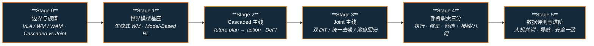

# 路线（纵深）：如果目标是 WAM（世界–动作模型）

**摘要**：面向"想让策略在出动作前显式预知世界会怎么变"的纵深路线，从 VLA / 世界模型 / WAM 的边界与 Cascaded–Joint 族谱，到生成式世界模型与动力学基座，再到 Cascaded / Joint 两条主线、部署端三类职责（执行 / 修正 / 筛选）与接触–几何扩展，按 Stage 0–5 串通核心方法；本路线是 [运动控制主路线](motion-control.md) 的一条分支，与 [VLA 纵深](depth-vla.md) 构成"反应式语义策略 / 前向耦合策略"的姊妹路线。

## 路线一览

## 这条路径怎么用

- 目标读者是已理解 VLA / 模仿学习动作头、想进入 **世界预测与动作联合建模** 的人——主战场是操作、移动操作、导航与接触丰富任务
- WAM 解决 **前向后果耦合**：动作生成必须依托对未来世界的显式（或等价）前向预测；它不替代语言语义接地，那是 [VLA 纵深](depth-vla.md) 的主题，也不替代全身运动先验，那是 [BFM 纵深](depth-bfm.md) 的主题
- 每个阶段都有前置知识、核心问题、推荐做什么、推荐读什么、学完输出什么

**和主路线的关系：**
- 本路线是主路线 L5（RL 与模仿学习）之后偏"世界模型 × 策略"的进阶方向；Stage 0–1 与 [VLA 纵深](depth-vla.md) Stage 0 / Stage 5 方向 B、以及 [Generative World Models](../wiki/methods/generative-world-models.md) 高度重叠
- 若目标是"听懂指令的桌面 VLA"，先走完 [VLA 纵深](depth-vla.md) Stage 0–2，再从本路线 Stage 0 切入即可
- 若目标是人形 loco-manip 上的实时 Joint WAM，读完 Stage 3 后接 [移动操作纵深](depth-mobile-manipulation.md) 与 [BFM 纵深](depth-bfm.md) 的低层接口

---

## Stage 0 边界与族谱：什么是 / 不是 WAM

**先钉死 \(p(a\mid o,l)\)、\(p(o'\mid o,a)\)、\(p(o',a\mid o,l)\) 三张表，再读论文，否则"带 world-model loss 的 VLA"会全部被误标成 WAM。**

### 前置知识
- Python + PyTorch 熟练
- [VLA 纵深](depth-vla.md) Stage 0–1 水平（知道 BC / action chunking / 生成式动作头）
- 对 Transformer / 扩散或流匹配有使用级直觉

### 核心问题
- VLA、独立世界模型、WAM 各自建模什么分布？边界判据是什么
- Cascaded WAM（`future plan → action`）与 Joint WAM（`future + action`）的模块边界与主要张力
- 为什么"训练时学未来视频 ≠ 推理时必须逐帧生成视频"

### 推荐做什么
- 精读概念页与综述摘要，画一张"VLA / WM / Cascaded WAM / Joint WAM"对照表（对象分布、推理路径、延迟来源）
- 从 [Awesome-WAM](../wiki/concepts/world-action-models.md) / OpenMOSS 列表挑 3 篇，各用一句话归入 Cascaded 或 Joint

### 推荐读什么
- [World Action Models（WAM）](../wiki/concepts/world-action-models.md)（本仓库）— 概念枢纽
- [VLM / VLN / VLA / VLX / 世界模型分类学](../wiki/comparisons/vlm-vln-vla-vlx-world-model-taxonomy.md)（本仓库）
- [Query：具身大模型家族分类学闭环](../wiki/queries/embodied-fm-taxonomy-loop.md)（本仓库）— WAM 对应五层闭环的 **⑤ 推演层 · 联合建模**
- Wang et al., *World Action Models* — [arXiv:2605.12090](https://arxiv.org/abs/2605.12090)

### 学完输出什么
- 能一句话说清 WAM 是什么、不是什么（相对 VLA 与外挂仿真）
- 拿到一篇新论文能放进 Cascaded / Joint（或"仅 VLA + 辅助 loss"）的正确格子

---

## Stage 1 世界模型与动力学基座

**WAM 的"世界侧"建在这一层上：没有可动作条件的前向动力学，联合建模无从谈起。**

### 前置知识
- Stage 0 内容
- 了解模型基 RL 的基本故事（想象 rollout → 规划 / 策略改进）

### 核心问题
- 生成式世界模型（视频 / 潜空间）预测什么、不预测什么；与可执行控制还隔着哪些工程约束
- 经典 Model-Based RL / planning 与综述定义的 Cascaded WAM 差在哪里（外部引擎 vs 学习策略的一部分）
- 机器人世界模型训练闭环的三条能力接口：策略内预测 / 学习型模拟器 / 可控视频

### 推荐做什么
- 读一篇生成式 WM 与一篇策略内 WM，对比"是否参与动作条件化"
- 在纸上画出一条 Cascaded 管线的信息流：观测 → 未来表征 → IDM / 动作头 → 控制

### 推荐读什么
- [Generative World Models](../wiki/methods/generative-world-models.md)（本仓库）
- [Model-Based RL](../wiki/methods/model-based-rl.md)（本仓库）
- [机器人世界模型训练闭环 taxonomy](../wiki/overview/robot-world-models-training-loop-taxonomy.md)（本仓库）
- [τ₀-World Model（τ0-WM）](../wiki/entities/tau0-world-model.md)（本仓库）— 联合预测 + 测试时修订的对照实例

### 学完输出什么
- 能解释"视频保真度高"为何不等于"动作可推断 / 可闭环"
- 一份"世界侧指标 vs 策略侧指标"双清单初稿

---

## Stage 2 Cascaded WAM：先计划未来，再解码动作

**模块清晰、便于分别迭代世界路径与策略头；主张力是两阶段信息瓶颈与对齐。**

### 前置知识
- Stage 1 内容
- 理解逆动力学（IDM）与"由未来表征反推动作"的直觉

### 核心问题
- Cascaded 的典型分解：`future plan → action`；未来载体可以是像素、流、深度、潜向量或 token
- 为什么弱化逆向模块会成为整条链路瓶颈（DeFI 对 VPP 类路径的批评）
- 解耦预训练（不同数据源上的前向 / 逆向）再耦合，解决什么问题

### 推荐做什么
- 对照 DeFI 的 GFDM + GIDM，画一张"数据源 × 预训练目标 × 下游耦合"表
- 任选一篇 Cascaded 论文，标出推理时是否仍生成完整未来视频

### 推荐读什么
- [DeFI（解耦动力学 VLA）](../wiki/methods/defi-decoupled-dynamics-vla.md)（本仓库）
- [World Action Models](../wiki/concepts/world-action-models.md) 中 Cascaded 小节（本仓库）
- [动作后果技术地图](../wiki/overview/robot-world-models-action-consequence-technology-map.md)（本仓库）— 与 Joint / 部署横切对照

### 学完输出什么
- 能画出 Cascaded WAM 的模块边界，并指出对齐失败时通常坏在哪一环
- 一份"何时选 Cascaded vs Joint"的选型便签（延迟、可解释性、数据可分训）

---

## Stage 3 Joint WAM：共享骨干下联合预测未来与动作

**耦合更紧、一致性目标更直接；主张力是推理延迟、训练目标设计与多模态扩展。**

### 前置知识
- Stage 2 内容
- 了解双 DiT / MoT / 流匹配联合去噪的基本结构（可用 DiT4DiT 作模板）

### 核心问题
- Joint 族的几种工程形态：双 DiT（Video + Action）、统一扩散去噪、潜自回归 observe–act–update
- 为什么许多 Joint WAM **训练时**视频协同监督，**推理时**可 action-only / 固定 flow 步单次前向
- 人形 loco-manip、移动操作、导航各自怎么选动作表示（motion token / latent action / waypoint）

### 推荐做什么
- 精读 DiT4DiT 或 MotionWAM 之一，画出 Video DiT ↔ Action DiT 的条件路径与推理时延分解
- 对照 ABot-M0.5 的 Dream Forcing：解释自生成视频 latent 上训逆动力学在对齐什么

### 推荐读什么
- [DiT4DiT（双 DiT 联合 VAM）](../wiki/entities/paper-dit4dit-video-action-model.md)（本仓库）
- [MotionWAM（人形 loco-manip · 实时 WAM）](../wiki/entities/paper-motionwam-humanoid-loco-manipulation-wam.md)（本仓库）
- [ABot-M0.5（移动操作 · latent action + Dream Forcing）](../wiki/entities/paper-abot-m05-mobile-manipulation-wam.md)（本仓库）
- [Pelican-Unified 1.0](../wiki/methods/pelican-unified-1.md)、[Kairos](../wiki/entities/paper-kairos-native-world-model-stack.md)（本仓库）
- [Cosmos 3](../wiki/entities/cosmos-3.md)（本仓库）— 平台级 Joint / 多任务 I/O 对照

### 学完输出什么
- 能比较至少两种 Joint 实现（扩散双塔 vs 潜自回归闭环）的延迟与闭环形态
- 一份面向目标平台的"推理是否滚未来视频"决策记录

---

## Stage 4 部署职责三分：执行 · 修正 · 筛选（+ 接触 / 几何）

**把"动作发出去以前，世界会怎样变"落到可插拔接口：直接执行、在线修正基础 VLA、或部署前筛选。**

### 前置知识
- Stage 3 内容
- 对真机部署延迟、异步 action chunk 有直觉（[VLA 纵深](depth-vla.md) Stage 4 水平更佳）

### 核心问题
- 三类职责：直接执行（DSWAM）、在线修正冻结 VLA（DynaWM）、潜变量 WM 部署筛选（DreamSteer）
- 接触丰富任务为何需要视觉–触觉联合（VT-WAM）或触觉 WM 作数据引擎（TACO）
- 4D 几何监督何时留在训练期（MECo-WAM）、何时进推理路径（RynnWorld-4D）

### 推荐做什么
- 用 [动作后果分类 01–04](../wiki/overview/wm-action-consequence-category-01-wam-action-prediction.md) 把 12 篇策展工作钉到"执行 / 修正 / 筛选 / 接触 / 几何 / 评估"格子
- 为自己的场景选一类部署接口，写清输入输出与是否冻结基础 VLA

### 推荐读什么
- [动作后果技术地图（2026-07 策展）](../wiki/overview/robot-world-models-action-consequence-technology-map.md)（本仓库）
- [DSWAM](../wiki/entities/paper-dswam-dual-system-wam.md) · [DynaWM](../wiki/entities/paper-dynawm-vla-online-correction.md) · [DreamSteer](../wiki/entities/paper-dreamsteer-vla-deployment-steering.md)（本仓库）
- [VT-WAM](../wiki/entities/paper-vt-wam-visuotactile-contact-rich.md) · [MECo-WAM](../wiki/entities/paper-meco-wam-4d-geometry-cotraining.md)（本仓库）
- [接触操作纵深](depth-contact-manipulation.md) — 力 / 触觉工程侧展开

### 学完输出什么
- 一张"我的栈该用执行 / 修正 / 筛选哪一类"的选型表
- 能说清训练期几何监督与推理期 4D 生成的延迟权衡

---

## Stage 5 数据、评测与进阶方向

### 前置知识
- Stage 4 内容

**方向 A：人–机数据与世界监督目标**
- 野外 egocentric 人数据如何与机器人遥操作共训；世界预测目标（Pixel / DINO / 3D flow）如何改变具身差距下的增益
- 关键词：[EgoWAM](../wiki/entities/paper-egowam-egocentric-human-wam-co-training.md)、[模仿学习纵深](depth-imitation-learning.md)

**方向 B：导航与空间决策中的 WAM**
- image-goal / 空中 VLN 上的 Joint 或自回归 WAM；与经典 VLN / 导航 VLA 的接口
- 关键词：[NavWAM](../wiki/entities/paper-navwam-goal-conditioned-visual-navigation-wam.md)、[WorldVLN](../wiki/entities/paper-worldvln-aerial-vln-wam.md)、[导航纵深](depth-navigation.md)

**方向 C：评测与安全一致性**
- 同时看世界侧（保真、物理常识、动作可推断性）与策略侧（成功率、长程、sim2real）；避免单侧代理
- 关键词：综述评测节、[GigaWorld-1](../wiki/entities/paper-gigaworld-1-policy-evaluation.md)、开放挑战（想象未来与真实执行的因果一致）

**方向 D：与 VLA / BFM / 移动操作整机栈汇合**
- 高层语义仍可走 VLA；全身协调走 BFM；WAM 提供后果耦合或部署筛选层
- 关键词：[VLA 纵深](depth-vla.md)、[BFM 纵深](depth-bfm.md)、[移动操作纵深](depth-mobile-manipulation.md)

---

## 快速入口汇总

| 阶段 | 核心问题 | 本仓库入口 |
|------|---------|-----------|
| Stage 0 | VLA / WM / WAM 边界与族谱 | [World Action Models](../wiki/concepts/world-action-models.md) |
| Stage 1 | 生成式 WM 与动力学基座 | [Generative World Models](../wiki/methods/generative-world-models.md) |
| Stage 2 | Cascaded 主线 | [DeFI](../wiki/methods/defi-decoupled-dynamics-vla.md) |
| Stage 3 | Joint 主线 | [DiT4DiT](../wiki/entities/paper-dit4dit-video-action-model.md) |
| Stage 4 | 部署职责三分 | [动作后果技术地图](../wiki/overview/robot-world-models-action-consequence-technology-map.md) |
| Stage 5 | 数据 / 评测 / 整机汇合 | [EgoWAM](../wiki/entities/paper-egowam-egocentric-human-wam-co-training.md) |

## 和其他页面的关系

- 完整成长路线参考：[主路线：运动控制算法工程师成长路线](motion-control.md)
- 其它纵深路径：
  - [VLA（视觉-语言-动作模型）](depth-vla.md) — 姊妹路线：VLA 管反应式语义策略，WAM 管前向后果耦合
  - [BFM（人形行为基础模型）](depth-bfm.md) — 身体级协调；可与 WAM / VLA 分层叠用
  - [模仿学习与技能迁移](depth-imitation-learning.md) — 动作头与人数据共训的展开版
  - [移动操作（Loco-Manipulation）](depth-mobile-manipulation.md) — Joint WAM 在全身任务上的主战场之一
  - [导航（SLAM → VLN → 导航 VLA）](depth-navigation.md) — Stage 5 方向 B 的展开版
  - [接触丰富的操作任务](depth-contact-manipulation.md) — Stage 4 触觉 / 力控工程侧
  - [动作生成（文本/多模态 → 人形动作）](depth-motion-generation.md)
  - [动作重定向（人体动作 → 机器人参考轨迹）](depth-motion-retargeting.md)
  - [人形 RL 运动控制](depth-rl-locomotion.md)
  - [传统模型控制（LIP/ZMP → MPC → WBC）](depth-classical-control.md)
  - [安全控制（CLF/CBF）](depth-safe-control.md)
  - [感知越障（Perceptive Locomotion）](depth-perceptive-locomotion.md)
- 人形控制全景图：[Humanoid Control Roadmap](../wiki/roadmaps/humanoid-control-roadmap.md)
- 技术栈地图：[tech-map/dependency-graph.md](../tech-map/dependency-graph.md)

## 参考来源

本路线基于以下原始资料与 wiki 编译页的归纳：

- [World Action Models（WAM）概念页](../wiki/concepts/world-action-models.md)
- [sources/papers/world_action_models_survey_2605.md](../sources/papers/world_action_models_survey_2605.md) — Wang et al., arXiv:2605.12090
- [动作后果技术地图](../wiki/overview/robot-world-models-action-consequence-technology-map.md) 与 2026-07 策展 12 篇实体页
- [机器人世界模型训练闭环 taxonomy](../wiki/overview/robot-world-models-training-loop-taxonomy.md)
- OpenMOSS [Awesome-WAM](https://github.com/OpenMOSS/Awesome-WAM)
