# 主路线：运动控制算法工程师成长路线

**首屏导读**：

- **为谁**：想做人形 / 双足运动控制的算法工程师（入门到进阶均可）。
- **怎么走**：L−1 全景入门 → L0–L7 逐层加深；各层细节见下方「摘要」与阶段速览。
- **四段骨架**：打底（L0–L3）→ 传统控制（L4）→ RL/IL（L5）→ Sim2Real 与全栈出口（L6–L7）。

**摘要**：

- **一条主线**：从 L−1 全景到 L7 出口，串通人形 / 双足运动控制。
- **L−1**：建立机器人技术栈全景心智地图与必备术语。
- **L0–L3**：数学、运动学、动力学、控制基础打底。
- **L4**：传统控制主干（LIP/ZMP → Centroidal → MPC → TSID/WBC）。
- **L5**：RL / IL 扩展层。
- **L6**：sim2real 闭环。
- **L7**：全栈视角与 2024–2026 前沿地图交还给你。

## 三句话先懂这条路线（极简版）

1. **先把传统控制主干打通**：LIP/ZMP → Centroidal → MPC → TSID/WBC。
2. **再把学习方法接上去**：RL/IL 用来补能力，不是替代控制结构。
3. **每一层都要有可运行输出**：代码、实验记录、失败复盘，缺一不可。

## 先看哪里（导航）

- 想 **30 秒先理解整个机器人技术栈**：跳到 [L−1 序言](#l1-序言机器人技术栈全景--怎么读这条路线)。
- 想 **最短可执行路径**：跳到 [最小可执行学习路径（90 天版本）](#最小可执行学习路径90-天版本)。
- 想 **完整路线**：按 L−1 → L0 → … → L7 依次阅读。
- 想 **走纵深**（各自独立路线页，按方向起点里程碑的历史排序）：
  - [如果目标是力矩控制电机设计（指标 → 电磁热 → FOC 力矩闭环 → 关节模组）](depth-torque-motor-design.md)
  - [如果目标是传统模型控制（LIP/ZMP → MPC → WBC）](depth-classical-control.md)
  - [如果目标是安全控制](depth-safe-control.md)
  - [如果目标是接触丰富的操作任务](depth-contact-manipulation.md)
  - [如果目标是导航（SLAM → VLN → 导航 VLA）](depth-navigation.md)
  - [如果目标是模仿学习与技能迁移](depth-imitation-learning.md)
  - [如果目标是 RL 运动控制](depth-rl-locomotion.md)
  - [如果目标是 Loco-Manipulation（移动操作）](depth-loco-manipulation.md)
  - [如果目标是人形足球（全向行走 → 感知踢球 → 多机战术）](depth-humanoid-soccer.md)
  - [如果目标是动作重定向（人体动作 → 机器人参考轨迹）](depth-motion-retargeting.md)
  - [如果目标是人形群控展演（群舞同步 → 编队走位 → 群体特技）](depth-humanoid-swarm-performance.md)
  - [如果目标是 Sim2Real（域差画像 → 执行器对齐 → 鲁棒训练 → 真机部署）](depth-sim2real.md)
  - [如果目标是人形拳击（动作跟踪 → 潜空间技能 → 对抗自博弈）](depth-humanoid-boxing.md)
  - [如果目标是 BFM（人形行为基础模型）](depth-bfm.md)
  - [如果目标是感知越障](depth-perceptive-locomotion.md)
  - [如果目标是动作生成（文本/多模态 → 人形动作）](depth-motion-generation.md)
  - [如果目标是 VLA（视觉-语言-动作模型）](depth-vla.md)
  - [如果目标是 Real2Sim（真实世界 → 可仿真资产/场景/孪生）](depth-real2sim.md)
  - [如果目标是 WAM（世界–动作模型）](depth-wam.md)

---

## L−1 序言：机器人技术栈全景 & 怎么读这条路线

**这一节是给完全没看过机器人的读者准备的"软着陆台阶"。** 资深读者可以直接跳到 [L0 数学与编程基础](#l0-数学与编程基础) 或 [最小可执行学习路径](#最小可执行学习路径90-天版本)。

### 30 秒看懂"一台机器人在干嘛"

把任何机器人——扫地机、机械臂、自动驾驶、人形——拆开看，都在循环跑同一个 4 步：

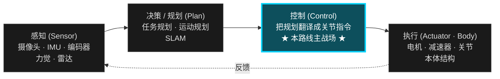

- **感知**：摄像头 / IMU / 编码器 / 力觉 / 雷达 → 让机器人知道"自己在哪、世界长什么样"。
- **决策 / 规划**：高层任务规划、运动规划、SLAM → 决定"要去哪、走哪条路"。
- **控制**：把规划目标变成关节级指令 → 决定"每个关节这一毫秒该出多少力 / 转多少角度"。
- **执行**：电机、减速器、关节、本体结构 → 把指令变成机械运动。

> **本路线只钻第三个盒子：控制。** 其它三盒在 [L7 出口层](#l7-出口从运动控制看整个机器人技术栈) 集中扫盲，给你进入对应子专题的入口。

### 为什么以"人形 / 双足"为主载体

人形 = **高自由度**（20+ 关节）+ **浮动基**（没固定在地面）+ **接触切换**（脚要轮流着地）+ **强不稳定**（重心永远想往外跑）。
学会人形控制，迁移到机械臂、四足、轮式底盘几乎都是降难度，反之不成立。所以人形是当下的"最佳教学载体"。

### 三种读者的不同读法

| 你是谁 | 推荐读法 | 不需要做什么 |
|--------|---------|------------|
| **完全外行**（想搞懂术语，能和工程师对话）| 只读每一 L 的"场景隐喻 / 学完能做什么 / 推荐读什么"和各层「英文缩写速查」 | 不需要写一行代码、不需要做练习 |
| **想入行**（程序员 / 在校生）| 跟 [最小可执行 90 天路径](#最小可执行学习路径90-天版本) → 再按 L0 → L7 全程走，每一层都做"推荐做什么" | 不需要先读完所有论文 |
| **资深从业者**（有相关经验、查漏补缺）| 直接跳 L4 / L5，重点看每层的"常见误区 / 自测题"；用 [可选纵深](#depth-optional-index) 切入研究方向 | 不需要重读 L0–L2 基础 |

### 怎么用每一层（页面格式说明）

每一个 L（除 L−1 / L7 外）都遵循同一套格式：

1. **场景隐喻** — 一句话比喻，给完全外行用
2. **为什么存在 / 上一层的局限** — 解释这一层为何不可跳过
3. **前置知识 → 核心问题 → 推荐做什么 → 推荐读什么 → 学完输出什么** — 工程化执行清单
4. **常见误区 + 自测题** — 给资深读者快速校准

### 资深读者 skip-to 矩阵

如果你已经在工作中接触过机器人控制，根据你能回答出的问题，可以直接跳到对应 L。**点击下面的按钮直达对应章节：**

<a class="btn-secondary" href="#l1-机器人学骨架" style="flex-direction:column; padding:14px 18px; text-align:center; border-radius:14px; line-height:1.5;"><strong>我会 NumPy，不懂 SE(3)</strong>→ L1 机器人学骨架</a>
<a class="btn-secondary" href="#l2-动力学与刚体建模" style="flex-direction:column; padding:14px 18px; text-align:center; border-radius:14px; line-height:1.5;"><strong>会 Pinocchio FK / Jacobian，不熟 RNEA / CRBA / ABA</strong>→ L2 动力学与刚体建模</a>
<a class="btn-secondary" href="#l4-人形运动控制主干" style="flex-direction:column; padding:14px 18px; text-align:center; border-radius:14px; line-height:1.5;"><strong>会固定基逆动力学，浮动基没碰过</strong>→ L4 人形运动控制主干</a>
<a class="btn-secondary" href="#l41-lip--zmp" style="flex-direction:column; padding:14px 18px; text-align:center; border-radius:14px; line-height:1.5;"><strong>熟 LQR / MPC，没系统学 LIP / Centroidal / WBC</strong>→ L4.1 LIP / ZMP</a>
<a class="btn-secondary" href="#l52-rl-在人形运动控制里的应用" style="flex-direction:column; padding:14px 18px; text-align:center; border-radius:14px; line-height:1.5;"><strong>会 IsaacLab PPO，不知如何和传统控制结合</strong>→ L5.2 RL 在人形运动控制里的应用</a>
<a class="btn-secondary" href="#l6-综合实战" style="flex-direction:column; padding:14px 18px; text-align:center; border-radius:14px; line-height:1.5;"><strong>跑通仿真 RL，没做过 sim2real 部署</strong>→ L6 综合实战</a>
<a class="btn-secondary" href="#l7-出口从运动控制看整个机器人技术栈" style="flex-direction:column; padding:14px 18px; text-align:center; border-radius:14px; line-height:1.5;"><strong>做过运动控制，想看当下机器人 AI 全景</strong>→ L7 出口与前沿地图</a>

**两条主线不要混着学：**
- **传统控制主线（L0–L4 + L6）：** OCP → LIP/ZMP → Centroidal → MPC → TSID/WBC → State Estimation → Sim2Real
- **Learning-based 主线（L5）：** RL 基础 → locomotion RL → imitation learning / motion prior → teacher-student
- 优先把传统主线学通，再把 RL / IL 当作扩展层接上去；否则容易只会调超参数、不理解控制结构为什么这样设计。

### 英文缩写速查（L−1 全路线鸟瞰）

| 缩写 | 英文全称 | 简要说明 |
|------|----------|----------|
| DOF | Degrees of Freedom | 机器人能独立运动的方向数；人形常见约 25 DOF。 |
| FK | Forward Kinematics | 关节角 → 末端位姿。 |
| IK | Inverse Kinematics | 末端目标 → 反推关节角。 |
| CoM | Center of Mass | 整机质心；平衡控制的核心状态之一。 |
| ZMP | Zero Moment Point | 接触面内合力矩为零的点；留在支撑多边形内则不易翻倒。 |
| DCM | Divergent Component of Motion | 发散运动分量；用于落点与平衡前瞻。 |
| CP | Capture Point | 踩下即可渐近停稳的落点；常由 DCM 导出。 |
| MPC | Model Predictive Control | 滚动时域内在线求解最优控制。 |
| WBC | Whole-Body Control | 全身多任务力矩分配与约束处理。 |
| TSID | Task-Space Inverse Dynamics | 任务空间逆动力学；WBC 常用实现框架。 |
| PID | Proportional–Integral–Derivative | 经典反馈控制；单关节保底常用。 |
| LQR | Linear Quadratic Regulator | 线性二次最优调节器；平衡 baseline。 |
| RL | Reinforcement Learning | 试错学习策略。 |
| PPO | Proximal Policy Optimization | 常用 on-policy RL 算法。 |
| IL | Imitation Learning | 从示范数据学策略。 |
| BC | Behavior Cloning | 监督模仿；IL 的最简形式。 |
| Sim2Real | Simulation to Reality | 仿真策略迁移真机。 |
| DR | Domain Randomization | 仿真随机化参数以提升真机鲁棒性。 |
| URDF | Unified Robot Description Format | 机器人连杆与关节的 XML 描述格式。 |
| MJCF | MuJoCo XML Format | MuJoCo 仿真用的模型描述格式。 |
| IMU | Inertial Measurement Unit | 惯性测量单元（加速度计 + 陀螺仪等）。 |
| SLAM | Simultaneous Localization and Mapping | 同时定位与建图。 |
| VLA | Vision–Language–Action | 视觉–语言–动作一体大模型路线。 |
| ROS | Robot Operating System | 机器人中间件与通信生态（ROS2 为新一代）。 |

> 各 L 层正文前还有**该层专用**缩写表；外行先扫本表建立「听到能对上号」的肌肉记忆即可。

### 一本贯穿全程的教材：Modern Robotics

[Modern Robotics（Lynch & Park）](../wiki/entities/modern-robotics-book.md) 是本路线 L0–L4 的"语法书"。**它不教人形 locomotion，但它把'位姿 / 速度 / 力 / 动力学'用统一的 twist / screw / wrench 语言讲清楚了。** 后面每一层下面的"推荐读什么"里会指给你具体章节，这里先说一遍它在全程的位置，避免每一层重复引用：

| Modern Robotics 章节 | 接到本路线哪一层 |
|--------------------|----------------|
| Ch 2–3：Configuration Space / Rigid-Body Motions | L0–L1（SE(3) 字母表） |
| Ch 4–6：Forward / Velocity / Inverse Kinematics | L1 |
| Ch 5、Ch 8：Statics / Dynamics of Open Chains | L2 |
| Ch 9：Trajectory Generation | L3 / L4.3 |
| Ch 11：Robot Control | L3 / L4.4 |

> Ch 7（Force Control）、Ch 10（Motion Planning）也很有价值，但相对偏离本路线主干，作为可选。

---

## 最小可执行学习路径（90 天版本）

如果你希望“少而精、尽快跑起来”，可以先只做这 5 件事：

1. 跑通一个 [Locomotion](../wiki/tasks/locomotion.md) 仿真环境（站立 + 前进）。  
2. 实现一个倒立摆 [LQR](../wiki/formalizations/lqr.md) 或简单 [MPC](../wiki/methods/model-predictive-control.md)。  
3. 跑通一个最小 [Whole-Body Control](../wiki/concepts/whole-body-control.md) / [TSID](../wiki/concepts/tsid.md) 示例。  
4. 用 PPO 训练一个基础策略，并阅读 [WBC vs RL](../wiki/comparisons/wbc-vs-rl.md) 做方法取舍。  
5. 完成一次最小 [Sim2Real](../wiki/concepts/sim2real.md) checklist（哪怕只在仿真内做 domain randomization 对比）。  

> 完成这 5 件事后，再回到 L0-L6 补理论，会更快理解“为什么要学这些”。

---

## L0 数学与编程基础

**这条不需要深入，但不能跳过。**

> **场景隐喻：** 你刚拿到一台机器人，但连"它的胳膊指哪个方向"都没法用代码描述——L0 给你"机器人世界的最底层词汇表"：向量、矩阵、旋转、变换。

> **这一层为什么存在：** 之后每一层的公式都把"位姿 / 速度 / 力"当作黑话。没有 L0，每读一行公式都要现场查。

**本阶段入口：** [线性代数学习策展（L0）](../wiki/entities/linear-algebra-curriculum.md)、[SE(3) 表示](../wiki/formalizations/se3-representation.md)、[Pinocchio](../wiki/entities/pinocchio.md)、[Crocoddyl](../wiki/entities/crocoddyl.md)（Modern Robotics 在 L−1 已介绍，下方"推荐读什么"会指出具体章节）。若背景偏 **工业臂 / 非科班自学**，可并行 [开源机器人学学习指南（qqfly）](../wiki/entities/learn-robotics-qqfly-guide.md) 的 Craig 入门与编程实践清单。

### 英文缩写速查（L0）

| 缩写 | 英文全称 | 简要说明 |
|------|----------|----------|
| SE(3) | Special Euclidean Group in 3D | 三维刚体位姿（旋转 + 平移）的数学群。 |
| SO(3) | Special Orthogonal Group in 3D | 三维旋转矩阵构成的群；\(R^\top R=I,\ \det R=1\)。 |
| PoE | Product of Exponentials | 用关节螺旋轴的矩阵指数连乘表示正运动学。 |
| FK | Forward Kinematics | 关节变量 → 末端位姿（L0 常先接触概念，L1 深入）。 |
| QP | Quadratic Programming | 二次规划；后续 MPC / WBC 的基础优化形式。 |
| SVD | Singular Value Decomposition | 奇异值分解；理解雅可比秩、冗余度时常用。 |

### 前置知识
- 高中数学 + 一点微积分直觉
- 会写 Python（能读、能改、能跑通）

### 核心问题
- 线性代数在机器人里到底怎么用（矩阵、向量、变换）
- 优化问题的直觉是什么

### 推荐做什么
- 把 Python / NumPy / Pinocchio 环境的代码跑通一套
- 不用刷题，但要有手感和直觉
- 用 Modern Robotics 配套 Python 库跑通 `MatrixExp3`、`MatrixExp6`、`FKinSpace` 这类最小函数，确认自己能把矩阵指数和刚体位姿变换连起来

### 推荐读什么
- **[线性代数学习策展](../wiki/entities/linear-algebra-curriculum.md)**（本库 L0 主入口）：[Georgia Tech *Interactive Linear Algebra*](https://textbooks.math.gatech.edu/ila/) + [Axler *Linear Algebra Done Right* 4e（PDF）](https://linear.axler.net/LADR4e.pdf) + [3Blue1Brown 几何直觉](https://www.3blue1brown.com/topics/linear-algebra)；扩展材料（Strang 18.06 等）见策展页
- [Modern Robotics](../wiki/entities/modern-robotics-book.md) Ch 2-3：Configuration Space、Rigid-Body Motions
- [SE(3) 表示](../wiki/formalizations/se3-representation.md)（本仓库）
- [Pinocchio](../wiki/entities/pinocchio.md)（本仓库）

### 学完输出什么
- 能用 NumPy 写简单矩阵运算
- 能跑通一个机械臂正运动学 Demo

### 自测题（学完应能答出）
- 旋转矩阵 \(R\) 为什么不能直接做加法 / 插值？想插值两个朝向你会用什么替代？
- 给定 SE(3) 元素 \(g = (R, p)\)，向量 \(v\) 在新坐标系下表示是什么形式？
- 矩阵指数 \(\exp([\omega]_\times)\) 和欧拉角 / 四元数描述旋转，分别的优劣是什么？

参考答案（点击展开）

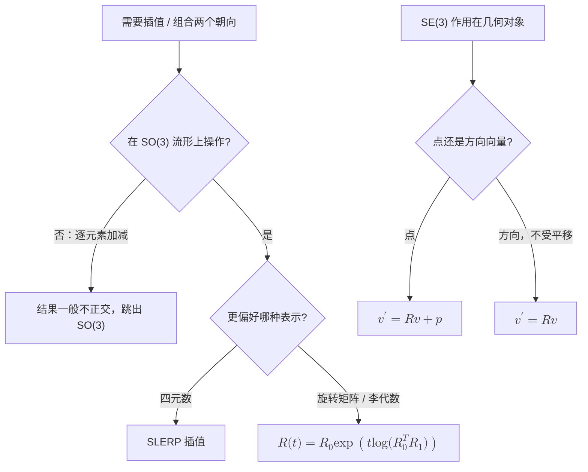

<ol>
<li><strong>R 为何不能直接相加 / 插值：</strong> 旋转矩阵属于 SO(3) 流形（\(R^\top R=I,\ \det R=1\)），不是向量空间；逐元素相加或线性插值后一般不再正交，会跳出 SO(3)。插值朝向要在流形上做：四元数 SLERP，或在李代数上 \(R(t)=R_0\exp\!\big(t\log(R_0^\top R_1)\big)\)。</li>
<li><strong>SE(3) 作用在点 / 向量：</strong> 齐次坐标下 \(\tilde v' = g\,\tilde v\)，展开即 \(v' = Rv + p\)（点，受平移）；若 \(v\) 是自由方向向量（不受平移），则只旋转 \(v' = Rv\)。关键是区分"点"与"方向"。</li>
<li><strong>矩阵指数 / 欧拉角 / 四元数：</strong> 旋转矩阵 + 矩阵指数无奇异、可直接复合、与 twist / 李代数统一（PoE、Jacobian 都基于它），但 9 数 + 6 约束冗余；欧拉角仅 3 数、直观，但有万向锁奇异、不唯一、插值差；四元数 4 数、无奇异、复合 / SLERP 高效稳定，但双重覆盖（\(q\) 与 \(-q\) 表示同一旋转）。工程上内部计算用四元数、链式 FK 用矩阵 / 矩阵指数、欧拉角只做人读的输入输出。</li>
</ol>

---

## L1 机器人学骨架

**这条是所有后续内容的基座，跳过后面一定会补。**

> **场景隐喻：** 你盯着机器人胳膊关节角度的变化，能不能马上脑补出末端走出的轨迹？L1 教你这个翻译器：关节空间 ↔ 任务空间。

> **上一层的局限：** L0 让你能写矩阵运算，但还不知道"机器人的关节角"和"末端位姿"是什么映射；L1 把这个翻译器搭起来。

**本阶段入口：** [Humanoid Robot](../wiki/entities/humanoid-robot.md)、[Pinocchio](../wiki/entities/pinocchio.md)、[Floating Base Dynamics](../wiki/concepts/floating-base-dynamics.md)。

### 英文缩写速查（L1）

| 缩写 | 英文全称 | 简要说明 |
|------|----------|----------|
| FK | Forward Kinematics | 关节角 → 末端位姿。 |
| IK | Inverse Kinematics | 末端目标 → 关节角；6R 臂常有多组解。 |
| DH | Denavit–Hartenberg | 经典连杆参数化；本路线更推荐 PoE / twist。 |
| PoE | Product of Exponentials | 螺旋轴 + 矩阵指数描述开链 FK。 |
| \(J\) / Jacobian | Manipulator Jacobian | 关节速度 → 末端 twist 的线性映射。 |
| Twist | Spatial Velocity (6D) | 刚体瞬时速度（角速度 + 线速度）。 |
| Screw | Twist + Pitch | 螺旋运动；PoE 中关节轴即 screw axis。 |
| Wrench | Spatial Force (6D) | 力 + 力矩的六维广义力。 |
| Ad | Adjoint Transformation | 在不同坐标系间变换 twist / wrench 的 \(6\times6\) 矩阵。 |

**这一层建议分三步走，不要一口气啃完：**

1. **L1.1 SE(3)、旋转与刚体变换** — 把"位姿"用数学描述清楚（旋转矩阵、齐次变换、Twist / Screw Axis、矩阵指数 / PoE）。这是后面所有内容的字母表。
2. **L1.2 正逆运动学（FK / IK）** — 关节角 ↔ 末端位姿。先用 PoE 公式手写 FK 验证 Pinocchio 的输出再说。
3. **L1.3 雅可比与速度运动学** — 关节速度 ↔ 末端速度，space Jacobian 与 body Jacobian 的区别；这是 L4 任务空间控制的入门钥匙。

> 上述三步在本文档下方"推荐做什么 / 推荐读什么 / 学完输出什么"里**统一列出**——不必拆三份执行清单，只需在心里按这个顺序推进。

### 前置知识
- L0 内容
- 刚体在三维空间里怎么旋转、怎么描述朝向

### 核心问题
- 机器人每个关节的角度和末端执行器位置是什么关系
- 怎么用数学描述这件事
- 正逆运动学是什么
- 为什么 twist、screw axis、PoE 比只记 D-H 参数更适合接后面的 Pinocchio / TSID / WBC

### 推荐做什么
- 用 Pinocchio 或 Robotics Toolbox 建模一个简单机械臂
- 写出正运动学和逆运动学代码
- 理解雅可比矩阵是什么
- 用 Modern Robotics 的 PoE 公式手写一个 2-3 自由度机械臂的 `FKinSpace` / `JacobianSpace`，再和 Pinocchio 输出对齐

### 推荐读什么
- [Modern Robotics](../wiki/entities/modern-robotics-book.md) Ch 4-6：Forward Kinematics、Velocity Kinematics、Inverse Kinematics
- [斯坦福《机器人学导论》(B站)](https://www.bilibili.com/video/BV17T421k78T/)
- 跑通 Pinocchio 官方 Tutorial
- [Humanoid Robot](../wiki/entities/humanoid-robot.md)（本仓库）
- [Floating Base Dynamics](../wiki/concepts/floating-base-dynamics.md)（本仓库）

### 学完输出什么
- 能自己建模一个简单机器人并计算正逆运动学
- 能解释雅可比矩阵在机器人里是什么、有什么用
- 能区分 space Jacobian 与 body Jacobian，并知道它们在任务空间控制里如何进入速度/力映射

### 自测题（学完应能答出）
- 给定 space Jacobian \(J_s\)，怎么算 body Jacobian \(J_b\)？两者在任务空间速度控制里的应用差别在哪？
- 6 自由度机械臂的 IK 一般有几组解？"肘部上 / 肘部下"是怎么来的？
- PoE 公式相比 D-H 参数最大的工程优势是什么？为什么 Pinocchio / TSID 都建立在 twist / screw 上？

参考答案（点击展开）

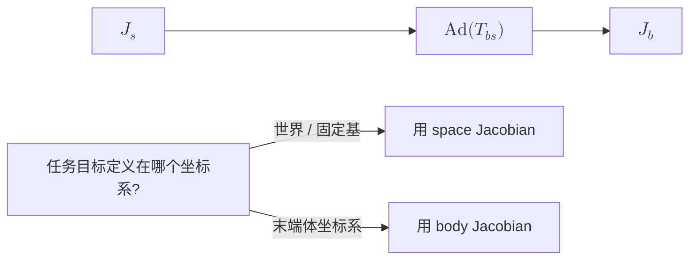

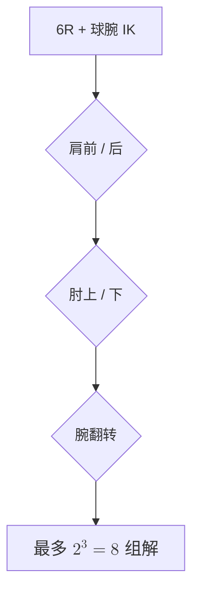

<ol>
<li><strong>space ↔ body Jacobian：</strong> \(J_b = [\mathrm{Ad}_{T_{bs}}]\,J_s\)，其中 \(T_{bs}=T_{sb}^{-1}\)、\([\mathrm{Ad}]\) 为 6×6 伴随矩阵。\(J_s\) 把关节速度映射到"在固定基坐标系下表达的"末端 twist，\(J_b\) 映射到"在末端体坐标系下表达的"twist。目标定义在哪个坐标系就用对应 Jacobian：视觉伺服 / 末端力控常用 \(J_b\)，世界系目标用 \(J_s\)。</li>
<li><strong>IK 解的个数：</strong> 带球型手腕的 6R 机械臂最多 8 组解，来自肩前 / 后、肘上 / 下、腕翻转三个二元选择（\(2^3=8\)）；一般非球腕 6R 最多可达 16 组。"肘上 / 肘下"来自求肘关节角时的 \(\pm\) 二次解——同一末端位姿，肘可朝上拱或朝下拱。</li>
<li><strong>PoE 相比 D-H：</strong> PoE 只需各关节螺旋轴 + 零位姿，几何清晰、无需在每个连杆摆 D-H 坐标系（D-H 对零位 / 坐标选取敏感、对树形与浮动基不友好）；且 PoE 天然用 twist / screw 表达，与速度运动学（Jacobian 的列即变换后的螺旋轴）、wrench、李群 / 李代数、动力学是同一套语言。Pinocchio / TSID 全程基于 twist / wrench / SE(3)，所以 PoE 衔接无缝。</li>
</ol>

---

## L2 动力学与刚体建模

**从运动学到动力学，是控制机器人最重要的跳跃。**

> **场景隐喻：** 你给机器人一个力矩，它会怎么动？L2 把"几何空间"升级成"力学空间"——从描述位姿过渡到描述运动和力的因果关系。

> **上一层的局限：** L1 运动学只回答"关节角速度 ↔ 末端速度"是怎么映射的，但不能回答"加多大力矩才能让它产生这个加速度"。没有动力学，你只能做位置控制，碰到接触、高速运动、力交互就崩。

**本阶段入口：** [Floating Base Dynamics](../wiki/concepts/floating-base-dynamics.md)、[Centroidal Dynamics](../wiki/concepts/centroidal-dynamics.md)、[Contact Dynamics](../wiki/concepts/contact-dynamics.md)、[Contact Wrench Cone](../wiki/formalizations/contact-wrench-cone.md)。

### 英文缩写速查（L2）

| 缩写 | 英文全称 | 简要说明 |
|------|----------|----------|
| RNEA | Recursive Newton–Euler Algorithm | 逆动力学：\((q,\dot q,\ddot q)\to\tau\)，\(O(n)\)。 |
| CRBA | Composite Rigid Body Algorithm | 组装质量矩阵 \(M(q)\)，\(O(n^2)\)。 |
| ABA | Articulated Body Algorithm | 正动力学：\(\tau\to\ddot q\)，\(O(n)\)，仿真常用。 |
| FB | Floating Base | 底座不固定；人形躯干为 6 自由度浮动基。 |
| CoM | Center of Mass | 质心位置；与 centroidal 动量紧密相关。 |
| CMM | Centroidal Momentum Matrix | 广义速度 → 6D 质心动量的映射 \(h_g=A_g\dot q\)。 |
| ID | Inverse Dynamics | 给定运动求所需广义力。 |
| FD | Forward Dynamics | 给定广义力求加速度。 |

**这一层建议分两步走：**

1. **L2.1 单刚体 / 固定基开链动力学** — 质量矩阵 \(M(q)\)、科里奥利 / 重力项、正逆动力学（RNEA / CRBA / ABA）。先把 Pinocchio 的 API 跑通，对照 Modern Robotics Ch 8 验证。
2. **L2.2 浮动基与接触动力学** — 把固定基的方法推广到没有固定底座 + 间歇接触的人形机器人。重点：浮动基状态表示、接触约束如何写成 Jacobian、Centroidal Momentum Matrix 的物理意义。

> 重要：进 L4 前 L2.2 必须懂，否则 LIP / Centroidal MPC / WBC 全是"魔法"。

### 前置知识
- L1 内容（运动学）
- 一点微积分和常微分方程直觉

### 核心问题
- 关节力矩怎么驱动机器人运动
- 质量矩阵、重力项、科里奥利项是什么
- 浮动基系统（人形机器人的躯干）为什么不能用固定基方法
- wrench、Jacobian transpose、虚功原理如何把任务空间力映射到关节力矩

### 推荐做什么
- 用 Pinocchio 写一个单刚体动力学正逆动力学 Demo
- 理解 centroidal dynamics 的基本形式
- 理解浮动基系统的状态表示问题
- 用 Modern Robotics Ch 8 的开链动力学接口跑一遍 `InverseDynamics` / `MassMatrix` / `ForwardDynamics`，再对照 Pinocchio 的 RNEA / CRBA / ABA

### 推荐读什么
- [Modern Robotics](../wiki/entities/modern-robotics-book.md) Ch 5、Ch 8：Statics、Dynamics of Open Chains
- Featherstone 《Robot Dynamics》相关章节
- Pinocchio 文档的 Centroidal 部分
- [Floating Base Dynamics](../wiki/concepts/floating-base-dynamics.md)（本仓库）
- [Centroidal Dynamics](../wiki/concepts/centroidal-dynamics.md)（本仓库）
- [Contact Dynamics](../wiki/concepts/contact-dynamics.md)（本仓库）

### 学完输出什么
- 能解释正逆动力学在机器人控制里的作用
- 能理解 centroidal dynamics 为什么重要
- 对"这个力矩能让机器人产生什么运动"有直觉
- 能把"任务空间力 / 接触 wrench → 关节力矩"的关系写成 Jacobian transpose 形式

### 自测题（学完应能答出）
- 写出固定基开链机器人动力学方程标准形式，分别解释 \(M(q)\)、\(C(q,\dot q)\dot q\)、\(g(q)\) 的物理意义。
- 为什么浮动基系统的状态需要 \((q, \dot q, \text{base pose}, \text{base vel})\) 而不能只用 \((q, \dot q)\)？
- 给定接触点 Jacobian \(J_c\) 和接触力 \(f_c\)，从接触力到关节力矩的映射是什么？为什么这是 WBC 的核心一步？
- RNEA / CRBA / ABA 分别求什么、计算复杂度差异在哪？Pinocchio 里典型一个 1 kHz 控制循环你会用哪个？

参考答案（点击展开）

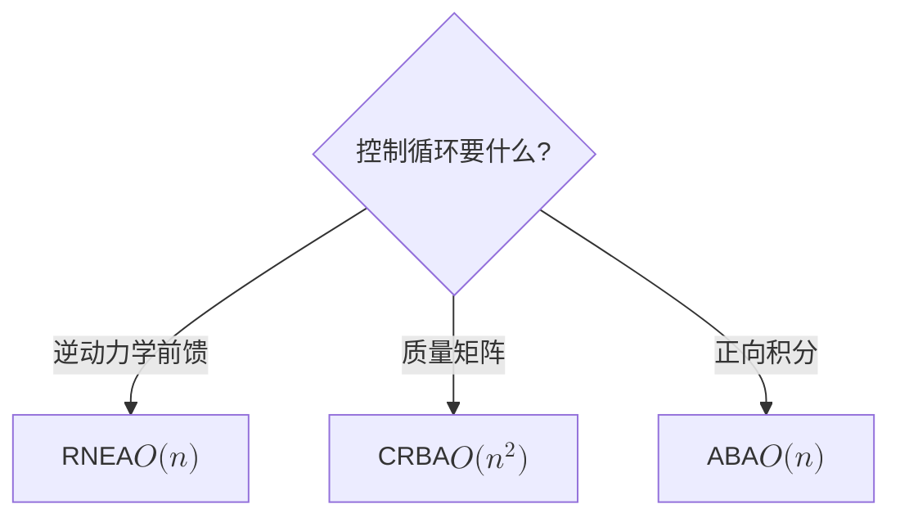

<ol>
<li><strong>固定基动力学标准形式：</strong> \(M(q)\ddot q + C(q,\dot q)\dot q + g(q) = \tau\)。\(M(q)\)：对称正定质量 / 惯量矩阵，刻画产生加速度所需的广义力（惯性）；\(C(q,\dot q)\dot q\)：科里奥利与离心项，源于惯量随构型变化及速度耦合；\(g(q)\)：重力广义力。</li>
<li><strong>浮动基为何需 base 状态：</strong> 浮动基躯干没有固定底座，其 6 维位姿本身是自由变量。只用关节量 \((q,\dot q)\) 无法表达整机在世界中的平移 / 旋转与动量，也写不出 CoM / ZMP / 接触等平衡约束，故状态须含 base pose 与 base vel，总维度约为 \((n+6)\) 位姿 + \((n+6)\) 速度。</li>
<li><strong>接触力到关节力矩：</strong> \(\tau = J_c^\top f_c\)（虚功原理 / Jacobian 转置）。这是 WBC 核心一步：机器人能直接控制的只有关节力矩 \(\tau\)，而平衡靠接触力 \(f_c\)；WBC 在动力学与接触约束下求 \((\ddot q, f_c, \tau)\)，\(J_c^\top\) 正是把"想要的接触力"翻译成"每个关节该出多少力矩"的桥梁。</li>
<li><strong>RNEA / CRBA / ABA：</strong> RNEA 求逆动力学（由 \(q,\dot q,\ddot q\) 得 \(\tau\)），\(O(n)\)；CRBA 求质量矩阵 \(M(q)\)，\(O(n^2)\)；ABA 求正动力学（由 \(\tau\) 得 \(\ddot q\)），\(O(n)\)。1 kHz WBC 循环要的是逆动力学 / 力矩前馈，用 RNEA（需要 \(M\) 喂给 QP 时再配 CRBA）；ABA 主要用于仿真器正向积分。</li>
</ol>

---

## L3 控制基础与最优化

**没有控制理论，后面的 MPC / WBC / RL 全都接不上。**

> **场景隐喻：** 你已经能算"力矩 ↔ 加速度"了，但现在的问题是：具体每一时刻该输出多少力矩，机器人才能**按你想的**轨迹运动？L3 把"算力矩"升级成"在线决策力矩"。

> **上一层的局限：** L2 动力学告诉你"输入力矩 → 输出加速度"的物理关系，但不告诉你"现在该输入多少力矩"——这是控制器的工作。L3 是 L4 所有方法（LIP / MPC / WBC）的底层语法。

**本阶段入口：** [Optimal Control](../wiki/concepts/optimal-control.md)、[LQR](../wiki/formalizations/lqr.md)、[Model Predictive Control](../wiki/methods/model-predictive-control.md)、[HQP](../wiki/concepts/hqp.md)、[Trajectory Optimization](../wiki/methods/trajectory-optimization.md)、[Numerical Optimization Curriculum](../wiki/entities/numerical-optimization-curriculum.md)（数值优化 L0+ 课程地图）。

### 英文缩写速查（L3）

| 缩写 | 英文全称 | 简要说明 |
|------|----------|----------|
| OCP | Optimal Control Problem | 最优控制问题；MPC / TrajOpt 的数学外壳。 |
| PID | Proportional–Integral–Derivative | 经典反馈；关节级跟踪保底。 |
| LQR | Linear Quadratic Regulator | 无限时域线性二次最优反馈 \(u=-Kx\)。 |
| MPC | Model Predictive Control | 有限时域滚动优化；可含约束。 |
| QP | Quadratic Programming | 二次规划；WBC / 凸 MPC 的核心求解形式。 |
| HQP | Hierarchical Quadratic Programming | 分层 QP；用零空间实现任务优先级。 |
| PD | Proportional–Derivative | 比例–微分控制；常与 computed torque 联用。 |
| CT | Computed Torque Control | 用逆动力学前馈 + 反馈跟踪期望轨迹。 |

### 前置知识
- L2 内容（动力学）
- 一点数值优化直觉（见 [Numerical Optimization Curriculum](../wiki/entities/numerical-optimization-curriculum.md)）

### 核心问题
- PID / LQR / MPC 分别在解决什么问题
- QP（二次规划）是什么，为什么在机器人控制里到处都是
- 最优控制的核心思想是什么
- 轨迹生成、反馈控制和约束优化分别处在控制栈的哪一层

### 推荐做什么
- 用 Python 写一个倒立摆的 LQR 控制器
- 用 qpOASES 或 OSQP 跑一个简单 QP
- 理解 MPC 的滚动时域思想
- 复现 Modern Robotics Ch 9 的三次/五次时间缩放轨迹，并给一个机械臂末端轨迹加 PD / computed torque tracking

### 推荐读什么
- [Modern Robotics](../wiki/entities/modern-robotics-book.md) Ch 9、Ch 11：Trajectory Generation、Robot Control
- [Underactuated Robotics](https://arxiv.org/abs/1709.10219)（TEDRAKE）
- 《Robotics: Modelling, Planning and Control》- Siciliano 相关章节
- [LQR](../wiki/formalizations/lqr.md)（本仓库）
- [Optimal Control](../wiki/concepts/optimal-control.md)（本仓库）
- [Model Predictive Control (MPC)](../wiki/methods/model-predictive-control.md)（本仓库）
- [Whole-Body Control](../wiki/concepts/whole-body-control.md)（本仓库）

### 学完输出什么
- 能解释 LQR 和 MPC 的区别
- 能理解 QP 在 WBC 里是解决什么问题的
- 能自己搭一个简单模型的 MPC
- 能说明 computed torque、PD、阻抗控制与后续 WBC 任务控制之间的关系

### 自测题（学完应能答出）
- LQR 和 MPC 在什么情况下解出来的控制律完全等价？哪些条件破坏后必须用 MPC？
- 给一个 QP 问题，怎么判断它是不是凸的？为什么 WBC 强烈倾向于凸 QP？
- HQP（Hierarchical QP）的"优先级"是怎么从数学上实现的（提示：null-space projection）？
- 阻抗控制和导纳控制的本质区别是什么？什么时候用前者、什么时候用后者？

参考答案（点击展开）

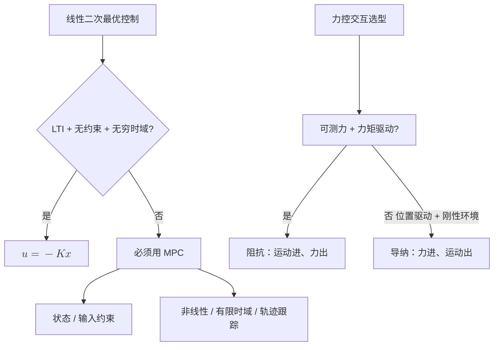

<ol>
<li><strong>LQR 与 MPC 何时等价：</strong> 当系统线性时不变、代价二次、无约束、且 MPC 预测时域趋于无穷时，MPC 的解就是无限时域 LQR 的反馈律 \(u=-Kx\)。一旦出现状态 / 输入约束（最常见）、非线性、有限 / 时变时域或需跟踪参考轨迹，就必须用 MPC。</li>
<li><strong>QP 凸性判定：</strong> 目标函数 Hessian 半正定（\(\tfrac12 x^\top P x\) 中 \(P\succeq 0\)）、约束为线性等式加凸（仿射）不等式，即为凸。WBC 偏好凸 QP，因其有唯一全局最优、求解快且确定性收敛，OSQP / qpOASES 能在 1 kHz 实时求解；非凸会有局部极小、求解时间不可控，对实时安全控制不可接受。</li>
<li><strong>HQP 优先级的数学实现：</strong> 用零空间投影（null-space projection）：先在最高优先级任务里求解，低优先级只能在不破坏高优先级的零空间内优化——\(\dot q = J_1^{+}\dot x_1 + N_1 z\)，其中 \(N_1 = I - J_1^{+}J_1\) 是任务 1 的零空间投影，逐层投影。等价地，多层 QP 把上层最优值作为下层的等式约束（lexicographic 求解）。</li>
<li><strong>阻抗 vs 导纳：</strong> 本质是因果方向相反。阻抗控制"输入运动、输出力"：按位置 / 速度偏差经 \(F=K\Delta x + D\Delta\dot x\) 生成力（力矩驱动器，环境刚则自身柔顺）；导纳控制"输入力、输出运动"：按测得外力生成位置参考（位置驱动器）。环境软 / 未知、需高带宽柔顺与碰撞安全（人形腿）用阻抗；驱动器只能精确位置控制、面对刚性环境且要高位置精度（工业装配）用导纳。</li>
</ol>

---

## L4 人形运动控制主干

**这是本路线的核心，也是当前项目的技术栈主干。**

> **场景隐喻：** 你已经能给机械臂做位置控制，但人形机器人没有固定底座、还要随时切换支撑脚——L4 教你把"通用控制理论"重新组织成"专门给人形用"的分层方法链。

> **上一层的局限：** L3 的方法（PID / LQR / MPC / QP）在固定基机器人上很直接，但人形是浮动基 + 间歇接触 + 高维欠驱动，不能直接套；需要专门的简化模型（LIP / Centroidal）和分层结构（MPC + WBC）。

**本阶段入口：** [LIP / ZMP](../wiki/concepts/lip-zmp.md)、[Capture Point / DCM](../wiki/concepts/capture-point-dcm.md)、[Centroidal Dynamics](../wiki/concepts/centroidal-dynamics.md)、[Trajectory Optimization](../wiki/methods/trajectory-optimization.md)、[MPC](../wiki/methods/model-predictive-control.md)、[TSID](../wiki/concepts/tsid.md)、[Whole-Body Control](../wiki/concepts/whole-body-control.md)。

### 英文缩写速查（L4 总览）

| 缩写 | 英文全称 | 简要说明 |
|------|----------|----------|
| LIP | Linear Inverted Pendulum | 线性倒立摆；固定 CoM 高度的步行简化模型。 |
| ZMP | Zero Moment Point | 支撑面内零力矩点；平衡判据。 |
| DCM | Divergent Component of Motion | 不稳定模态分量；落点规划常用。 |
| CP | Capture Point | 可捕获平衡的落点。 |
| CoP | Center of Pressure | 足底压力中心；接触时常与 ZMP 重合。 |
| MPC | Model Predictive Control | 在线滚动优化 CoM / 接触力 / 步态。 |
| TrajOpt | Trajectory Optimization | 离线或单段时域最优轨迹求解。 |
| TSID | Task-Space Inverse Dynamics | 任务空间逆动力学 WBC 框架。 |
| WBC | Whole-Body Control | 全身多任务力矩 QP / HQP。 |
| HQP | Hierarchical Quadratic Programming | 分层全身控制常用求解结构。 |

### L4.0 桥段：怎么把 L1–L3 串成 L4 的方法链

L4 是本路线最陡的台阶。**进入 L4.1 前先建立一个"为什么是这个顺序"的心智模型，比直接看每个子方法重要得多。**

人形控制的核心矛盾是：**全身动力学维度太高、非线性强、接触切换密集**——直接拿 L3 学到的通用 LQR / MPC 套不上去。解决方式不是发明新数学，而是按"模型从粗到细、控制从慢到快"两条轴拆分：

| 轴 | 含义 | 实例 |
|---|---|---|
| **模型粒度** | 用多少状态变量描述机器人 | LIP（3 维）→ Centroidal（6 维 momentum + 接触力）→ 全身动力学（n+6 维） |
| **控制频率** | 在哪个时间尺度上做决策 | Footstep / 高层规划（1–10 Hz）→ MPC（50–200 Hz）→ WBC（1 kHz）|

L4 的方法链就是把这两条轴**串联**起来：

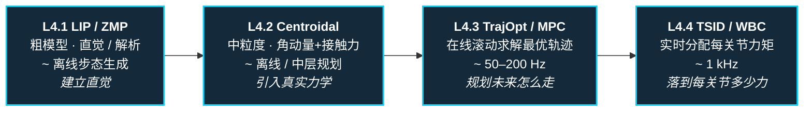

学每个子方法时，始终用三件事检查自己是否真的学懂：

1. **原理**：这个方法的状态、约束、目标函数分别是什么
2. **最小代码**：能不能用一个小例子把核心 loop 跑通
3. **局限性**：什么情况下会失效，为什么还需要下一层方法接上来

**Modern Robotics 在 L4 的位置：**

- Ch 3–5 提供任务空间位姿、twist、Jacobian、wrench 的统一语言
- Ch 8 解释开链动力学，帮助理解 Pinocchio / TSID 中的逆动力学项
- Ch 9 解释轨迹生成，是 MPC / trajectory optimization 的低维入口
- Ch 11 解释 computed torque、motion control、force control，是理解 WBC 任务层的前置材料

> Modern Robotics 本身不是人形 locomotion 教材，不会直接教 LIP/ZMP、centroidal MPC 或浮动基接触切换；它更像是这条主路线的"语法书"。学 L4 时遇到坐标变换、Jacobian、wrench、逆动力学不清楚，就回到对应章节补。

#### 方法谱系对比表（L4 + L5 一览）

这张表回答"这些名词到底是什么关系、各自适用于哪个场景"。**外行能从这里建立第一手心智地图，资深读者能用来核对自己的分类。**

| 方法 | 状态 / 模型粒度 | 主要约束 | 求解器 | 典型频率 | 典型用途 | 典型局限 |
|------|---------------|---------|--------|---------|---------|---------|
| **PID** | 关节角误差 | — | 解析 | 1 kHz+ | 单关节闭环、基础保底 | 不能处理耦合 / 多约束 |
| **LQR** | 线性化状态空间 | — | Riccati 方程 | 100 Hz+ | 平衡控制 baseline、教学 | 模型必须线性化 |
| **LIP / ZMP** | CoM 3 维 + ZMP | 支撑多边形 | Preview Control / 解析 | 离线 / 100 Hz | 平地步态、平衡判据 | 忽略角动量、忽略高度变化 |
| **Capture Point / DCM** | CoM + 散度型动量 | 支撑多边形 | 解析 | 100 Hz | 实时平衡判据、足端落点决策 | 同 LIP 假设 |
| **Centroidal Dynamics** | CoM 动量 6D + 接触力 | 接触力 cone | QP / NLP | 50–200 Hz | 中层 MPC 模型 | 仍非全身，需配 WBC |
| **Trajectory Optimization** | 全身状态轨迹 | 全动力学 + 接触 | DDP / iLQR / IPOPT | 离线 / 慢 | 离线生成参考轨迹 / 跑酷 | 不实时、初值敏感 |
| **MPC** | 简化模型 / Centroidal | 全约束 | OSQP / qpOASES / Crocoddyl | 50–500 Hz | 在线步态 + 接触力规划 | 模型简化误差、实时性挑战 |
| **TSID / WBC** | 全身关节加速度 | 接触 + 关节限位 + 任务优先级 | HQP / 多层 QP | 1 kHz | 把 MPC 参考落到每个关节力矩 | 依赖准确动力学 |
| **PPO**（RL）| 神经网络策略 | reward + curriculum + DR | 梯度 + 仿真数据 | 训练慢 / 部署快 | 端到端步态、跑酷、复杂地形 | sim2real gap、不可解释 |
| **BC / IL** | 神经网络策略 | 监督数据 | SGD | 训练慢 / 部署快 | 操作、复杂动作迁移 | compounding error |
| **DAgger** | BC + 交互式查询 | 同 BC + 在线纠错 | SGD + 仿真查询 | 训练慢 | 缓解 BC compounding | 需要可查询的 expert |
| **AMP / Motion Prior** | RL + 对抗判别器 | reward + style 判别 | 梯度 + 对抗 | 训练慢 / 部署快 | 风格化动作、模仿 MoCap | 数据采集成本高 |
| **Diffusion Policy** | 神经网络生成 action 序列 | 监督数据 | 去噪 | 训练慢 / 部署中等 | 多模态操作、抓取 | 推理延迟、训练数据要求高 |

**怎么读这张表**：
- 上半（PID → WBC）= model-based，从粗到细、从慢到快依次叠
- 下半（PPO 起）= learning-based，通常补 model-based 难处理的部分（高维、难显式建模、风格化）
- 实际系统通常 **混合使用**：MPC + WBC + RL 策略 prior + IL 数据初始化

### L4.1 LIP / ZMP

> **场景隐喻：** 想象你在走钢丝——身体重心必须始终在脚下不大的支撑面内才不会摔倒。LIP/ZMP 就是把这件事数学化。

> **上一层的局限：** L3 给了你 LQR / MPC 这些通用工具，但人形动力学几十个状态变量、非线性强，直接套太重。LIP / ZMP 是一个**极度简化的模型**（把整机当成"会走的倒立摆"），让你用最少假设理解步行和平衡。

### 英文缩写速查（L4.1）

| 缩写 | 英文全称 | 简要说明 |
|------|----------|----------|
| LIP | Linear Inverted Pendulum | 固定质心高度的线性倒立摆模型。 |
| ZMP | Zero Moment Point | 支撑多边形内的平衡判据点。 |
| DCM | Divergent Component of Motion | \(\xi=x+\dot x/\omega\)；不稳定模态。 |
| CP | Capture Point | 踩下可渐近停稳的落点。 |
| CoM | Center of Mass | 质心；LIP 水平动力学围绕其展开。 |
| CoP | Center of Pressure | 足底压力中心。 |
| SP | Support Polygon | 支撑多边形；ZMP 须留于其内。 |

**前置知识：** [L2 动力学与刚体建模](#l2-动力学与刚体建模) + [L3 控制基础与最优化](#l3-控制基础与最优化)

**核心问题：** 双足机器人怎么在地上走而不倒

**推荐做什么：**
- 实现一个最简单的 ZMP 步态生成
- 用 LIP 模型生成质心轨迹

**推荐读什么：**
- Kajita et al., "Biped walking pattern generation by using preview control of zero-moment point"
- [LIP / ZMP](../wiki/concepts/lip-zmp.md)（本仓库）
- [Capture Point / DCM](../wiki/concepts/capture-point-dcm.md)（本仓库）
- [ZMP / LIP 形式化](../wiki/formalizations/zmp-lip.md)（本仓库）

**学完输出什么：**
- 能解释 ZMP 和支撑多边形的关系
- 能用 LIP 模型生成简单步行轨迹

**自测题：**
- LIP 模型为什么需要假设 CoM 高度固定？这个假设在跳跃 / 上下楼梯时失效成什么样？
- 走路过程中 ZMP 何时会离开支撑多边形？工程上你怎么从数据里发现这件事？
- DCM / Capture Point 相比 ZMP 多解决了什么问题？

参考答案（点击展开）

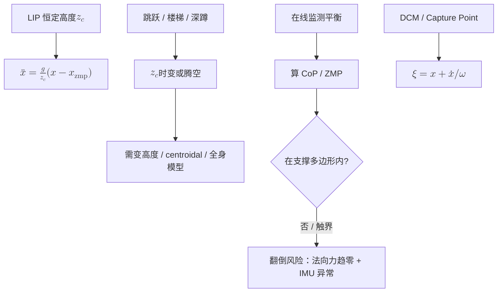

<ol>
<li><strong>LIP 为何假设 CoM 高度固定：</strong> 高度 \(z_c\) 恒定时水平动力学线性化为 \(\ddot x = \tfrac{g}{z_c}\,(x - x_{\mathrm{zmp}})\)，解析可解且 CoM 与 ZMP 成线性关系。跳跃时 CoM 高度剧变甚至腾空（接触力为零）、上下楼梯 / 深蹲时 \(z_c\) 持续变化，该线性关系失效，需要变高度模型或 centroidal / 全身动力学。</li>
<li><strong>ZMP 离开支撑多边形：</strong> ZMP 触及 / 越出支撑多边形即将翻倒（脚绕边缘转动、单边接触），此时该侧足底法向力趋零。工程上用足底力 / 力矩或压力阵列实时算 CoP（接触时 ZMP=CoP），看其是否触界；或检测足底一侧法向力趋零并叠加 IMU 出现非预期角加速度。</li>
<li><strong>DCM / Capture Point 多解决了什么：</strong> 它把 LIP 中不稳定的发散模态单独解出：\(\xi = x + \dot x/\omega\)。它前瞻地回答"想一步刹停脚该踩哪"（Capture Point 即踩下去能让 CoM 渐近停住的落点），把控制聚焦在唯一不稳定的一阶模态上，比仅判断"当前是否稳"的 ZMP 更适合实时落点规划与扰动恢复。</li>
</ol>

---

### L4.2 Centroidal Dynamics

> **场景隐喻：** LIP 把人形当成一根"会走路的杆子"。但实际上挥手、扭腰、抬腿都会产生角动量，杆子模型解释不了——L4.2 给你一个"既不太重又不太轻"的中间模型。

> **上一层的局限：** L4.1 的 LIP 简化了角动量、忽略了腿摆动质量、把支撑多边形当静态约束；真机走起来这些都不能忽略。Centroidal Dynamics 把整机投影到 6D 的 CoM 动量空间——比 LIP 更精确，又比全身动力学简单。

### 英文缩写速查（L4.2）

| 缩写 | 英文全称 | 简要说明 |
|------|----------|----------|
| CMM | Centroidal Momentum Matrix | \(h_g=A_g(q)\dot q\)；6D 质心动量映射。 |
| CoM | Center of Mass | 质心位置与动量状态的核心量。 |
| AM | Angular Momentum | 角动量；LIP 忽略、centroidal 显式保留。 |
| LM | Linear Momentum | 线动量。 |
| MOR | Model Order Reduction | 模型降阶；centroidal 相对全身动力学的定位。 |
| Wrench | Spatial Contact Wrench | 接触点 6D 力 / 力矩；驱动动量变化。 |

**前置知识：** [L4.1 LIP / ZMP](#l41-lip--zmp)

**核心问题：** LIP 简化太狠了，真实人形平衡和接触力怎么描述

**推荐做什么：**
- 用 centroidal dynamics 建模人形机器人
- 理解 centroidal momentum matrix 是什么

**推荐读什么：**
- Orin et al., "Centroidal dynamics of a humanoid robot"
- [Centroidal Dynamics](../wiki/concepts/centroidal-dynamics.md)（本仓库）
- [Contact Dynamics](../wiki/concepts/contact-dynamics.md)（本仓库）

**学完输出什么：**
- 能解释 centroidal dynamics 和 LIP 的区别
- 理解线动量、角动量在平衡控制里的作用

**自测题：**
- Centroidal Momentum Matrix \(A_g(q)\) 的维度是多少？它的零空间在物理上意味着什么？
- 为什么 Centroidal Dynamics 是 "model order reduction" 的一种？它损失了原始全身动力学的什么信息？
- 在 MPC 里使用 Centroidal Dynamics vs 全身动力学，求解延迟会差多少量级？

参考答案（点击展开）

<ol>
<li><strong>CMM 维度与零空间：</strong> \(A_g(q)\) 为 6×(n+6)（浮动基，n 个关节 + 6 维 base），把广义速度映射到 6 维质心动量（3 线动量 + 3 角动量）：\(h_g = A_g(q)\dot q\)。其零空间是"不改变整机线 / 角动量"的内部自运动（如对称挥臂相互抵消、绕 CoM 的内部重构），即动量守恒下的自由度。</li>
<li><strong>为何是 model order reduction：</strong> 它把 \((n+6)\) 维全身动力学投影到 6 维质心动量空间，只保留"合外力 / 力矩 = 动量变化率"\(\big(\dot h_g = \textstyle\sum \text{wrench} + mg\big)\)，用少量状态抓住平衡最关键的量。损失的是各肢体具体构型 / 关节级分布（同一动量可由无穷多构型实现）、关节限位与碰撞——这些由下层 WBC 补回。</li>
<li><strong>求解延迟差多少：</strong> centroidal（6 维 + 接触力，中等规模凸 QP / NLP）单步求解约亚毫秒到几毫秒，可 50–200 Hz 在线；全身动力学 MPC（\((n+6)\) 维含全约束的非线性 OCP）常几十到上百毫秒，二者约差 1–2 个数量级。故在线层多用 centroidal / 简化模型，全身动力学多用于离线 trajopt 或低频。</li>
</ol>

---

### L4.3 Trajectory Optimization / MPC

> **场景隐喻：** 上一秒看见脚滑——能不能预判未来 2 秒该往哪儿踩、并实时改步态？MPC 就是这件事的数学化：把"未来一小段时间窗"做成一个滚动求解的优化问题。

> **上一层的局限：** L4.2 的 Centroidal Dynamics 给了你一组方程，但**用这些方程在线规划 CoM 轨迹和接触力**还需要再加一层优化（Trajectory Optimization 或 MPC）。这就是从"模型"到"控制器"的过渡。

### 英文缩写速查（L4.3）

| 缩写 | 英文全称 | 简要说明 |
|------|----------|----------|
| MPC | Model Predictive Control | 滚动时域最优控制；每步只执行首段控制。 |
| TrajOpt | Trajectory Optimization | 对整段或长时域状态–控制轨迹求最优。 |
| OCP | Optimal Control Problem | 动力学 + 代价 + 约束的优化问题表述。 |
| NLP | Nonlinear Programming | 非线性规划；非凸全身 TrajOpt 常用。 |
| DDP | Differential Dynamic Programming | 微分动态规划；局部 TrajOpt 方法。 |
| iLQR | Iterative Linear Quadratic Regulator | 迭代 LQR；局部线性化 TrajOpt。 |
| RH | Receding Horizon | 滚动时域；MPC 与 TrajOpt 在线化的关键思想。 |

**前置知识：** [L4.2 Centroidal Dynamics](#l42-centroidal-dynamics) + [L3 控制基础与最优化](#l3-控制基础与最优化)

**核心问题：** 整段质心轨迹和接触力怎么规划，MPC 在线怎么做

**推荐做什么：**
- 用 CasADi 或 Crocoddyl 实现一个 centroidal MPC
- 在仿真里跑通一个双足行走 MPC

**推荐读什么：**
- "Convex MPC for Bipedal Locomotion" (Bellicoso et al.)
- [Trajectory Optimization](../wiki/methods/trajectory-optimization.md)（本仓库）
- [Model Predictive Control (MPC)](../wiki/methods/model-predictive-control.md)（本仓库）
- [MPC 调参指南](../wiki/queries/mpc-tuning-guide.md)（本仓库）
- [MPC 求解器选型](../wiki/queries/mpc-solver-selection.md)（本仓库）

**学完输出什么：**
- 能实现一个简化版的 centroidal MPC
- 能解释预测时域、代价函数设计、约束处理的思路

**自测题：**
- 给一个 MPC 跑不稳的现象（例如步态发抖），你的第一手排查顺序是什么？
- Trajectory Optimization 和 MPC 的关键区别是什么？为什么人形里这两个名词经常混用？
- Convex MPC 和 Nonlinear MPC 各适合什么任务？接触切换怎么处理？

参考答案（点击展开）

```mermaid
flowchart TD
  Bug[MPC 步态发抖] --> R1[1 参考轨迹是否抖]
  R1 --> R2[2 求解器是否收敛 / warm-start]
  R2 --> R3[3 频率 vs 求解延迟 / one-step delay]
  R3 --> R4["权重<br/>$$\Delta u$$ 过小"]
  R4 --> R5[5 接触切换约束突变 / 摩擦锥过紧]
  R5 --> R6[6 状态估计噪声与延迟]
  Mode{选型} --> Convex[Convex MPC：快、定 schedule 平地走]
  Mode --> NL[Nonlinear MPC：跑跳 / 复杂地形 / 接触优化]
```

<ol>
<li><strong>MPC 发抖排查顺序：</strong> 由外到内——① 参考是否本身抖（上游 footstep / CoM 轨迹不连续）；② 求解器是否真收敛 / 触迭代上限、有无 warm-start；③ 时序：控制频率、求解延迟、是否补偿 one-step delay；④ 权重：跟踪过硬而平滑 / 正则过软导致控制量高频震荡，加 \(\Delta u\) 惩罚；⑤ 模型 / 约束：接触切换处约束突变、摩擦锥 / ZMP 约束过紧；⑥ 状态估计噪声 / 延迟引入反馈抖动。</li>
<li><strong>TrajOpt 与 MPC 区别：</strong> Trajectory Optimization 多为离线、对整段时域一次求一条最优轨迹（可全身动力学、长时域、初值敏感）；MPC 在线滚动——每周期解短时域 OCP、只执行第一步再重规划（receding horizon），靠反馈抗扰。人形里常混用，是因为 MPC 内核每步解的正是一个小型 trajectory optimization，数学形式（OCP）相同，区别仅在"离线一次 vs 在线滚动 + 是否实时"。</li>
<li><strong>Convex vs Nonlinear MPC：</strong> Convex MPC（线性 / 凸化模型 + 凸约束）求解快、确定性，适合周期性平地行走与高频实时，接触切换靠预先给定的 contact schedule、接触力受摩擦锥线性约束；Nonlinear MPC（全 / 非线性动力学）适合跑跳、复杂地形、需同时优化接触力与姿态，接触切换可用预定时序或互补约束 / 相位优化，代价是非凸、慢、初值敏感。</li>
</ol>

---

### L4.4 TSID / Whole-Body Control

> **场景隐喻：** MPC 已经告诉你"CoM 要在哪里、足端要到哪里、躯干姿态怎么变"——但人形 25 个关节里，谁先动谁后动？谁让位给安全约束？WBC 是这个仲裁器，每个控制周期都解一个 QP / HQP 来分配每个关节的力矩。

> **上一层的局限：** L4.3 的 MPC 输出的是 CoM / 接触力 / 末端任务参考，**不直接告诉你每个关节出多少力矩**。WBC 就是把上层规划"落到下层执行"的最后一步。

### 英文缩写速查（L4.4）

| 缩写 | 英文全称 | 简要说明 |
|------|----------|----------|
| TSID | Task-Space Inverse Dynamics | 在动力学与接触约束下求 \(\tau,f\) 的任务空间框架。 |
| WBC | Whole-Body Control | 全身多任务、多约束的实时力矩分配。 |
| HQP | Hierarchical Quadratic Programming | 严格任务优先级的分层 QP。 |
| QP | Quadratic Programming | 加权 WBC 的凸优化内核。 |
| ID | Inverse Dynamics | 给定 \(\ddot q\) 求 \(\tau\)；WBC 等式约束的一部分。 |
| IC | Impedance Control | 力–运动关系整形；接触安全常高优先级。 |

**前置知识：** [L4.3 Trajectory Optimization / MPC](#l43-trajectory-optimization--mpc)

**核心问题：** 上层规划出来的参考轨迹，怎么变成每个关节该出的力

**推荐做什么：**
- 用 TSID 库实现一个全身任务控制器
- 同时处理躯干稳住、足端跟踪、接触约束

**推荐读什么：**
- Del Prete et al., "Prioritized motion-force control of constrained fully-actuated robots"
- [TSID](../wiki/concepts/tsid.md)（本仓库）
- [TSID Formulation](../wiki/formalizations/tsid-formulation.md)（本仓库）
- [Whole-Body Control](../wiki/concepts/whole-body-control.md)（本仓库）
- [WBC 实现指南](../wiki/queries/wbc-implementation-guide.md)（本仓库）
- [WBC 调参指南](../wiki/queries/wbc-tuning-guide.md)（本仓库）

**学完输出什么：**
- 能用 TSID 框架实现一个多层优先级 WBC
- 能解释任务空间目标怎么映射到关节力矩

**自测题：**
- TSID 的 QP 里典型有哪些约束（等式 / 不等式各写 2 条）？目标函数通常长什么样？
- 当上层 MPC 输出的 CoM 参考与 WBC 的接触约束冲突时，会发生什么？怎么用任务优先级处理？
- 阻抗控制为什么常常放在 WBC 任务里的较高优先级层？

参考答案（点击展开）

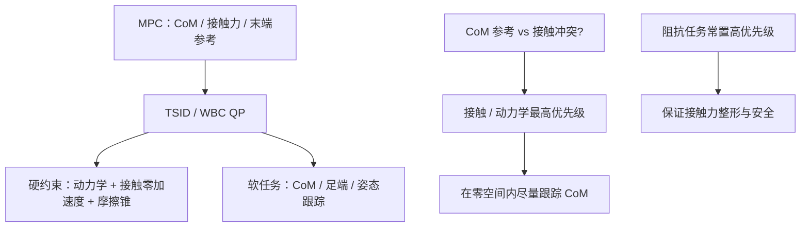

<ol>
<li><strong>TSID 的 QP 约束与目标：</strong> 等式如：① 浮动基动力学一致性 \(M\ddot q + h = S^\top \tau + J_c^\top f\)；② 刚性接触零加速度 \(J_c\ddot q + \dot J_c\dot q = 0\)。不等式如：① 接触力落在摩擦锥内；② 关节力矩 / 位置 / 速度限位（或 ZMP 在支撑多边形内）。目标函数通常是各任务加权二次跟踪误差之和 \(\sum_i w_i\lVert J_i\ddot q + \dot J_i\dot q - \ddot x_i^{\mathrm{des}}\rVert^2\)（CoM、足端、躯干姿态、姿势正则）加上对 \(\tau,f\) 的正则。</li>
<li><strong>CoM 参考与接触约束冲突：</strong> 若接触 / 动力学一致性设为硬约束，WBC 会优先保接触可行，CoM 参考只被"尽量"跟踪，出现稳态误差或被裁剪。处理：用任务优先级——接触 / 动力学放最高（硬约束），CoM 跟踪放较低优先级软任务、在不违反接触的零空间内最优逼近；HQP 严格分层，加权 QP 用大权重近似分层；必要时上层 MPC 据反馈调整参考。</li>
<li><strong>阻抗为何常居高优先级：</strong> 阻抗 / 柔顺直接关系接触稳定与交互安全。若被低优先级位置任务覆盖，易导致接触力失稳、刚性碰撞或接触跳变；把接触 / 末端的阻抗行为放在较高层，可保证无论下层如何优化姿态，接触力始终被良好整形，从而安全、柔顺地与环境交互。</li>
</ol>

---

## L5 强化学习与模仿学习

**学完 L4 后，你应该已经对 model-based control 有了完整理解。L5 是另一条路：learning-based。**

> **场景隐喻：** L4 是"我已经知道物理 + 知道目标"去算控制律；L5 反过来——让机器人**自己试出来**（RL）或**模仿人学出来**（IL）一个策略。

> **上一层的局限：** L4 的传统控制需要准确建模 + 显式目标函数；对接触切换密集、目标难写成代价函数的任务（跑、跳、复杂地形、操作），开发周期长。RL / IL 用数据补这一段——但不能替代 L4 的结构理解，否则你只会调超参数。

**本阶段入口：** [Reinforcement Learning](../wiki/methods/reinforcement-learning.md)、[Policy Optimization](../wiki/methods/policy-optimization.md)、[PPO vs SAC](../wiki/comparisons/ppo-vs-sac.md)、[Imitation Learning](../wiki/methods/imitation-learning.md)、[Behavior Cloning](../wiki/methods/behavior-cloning.md)、[DAgger](../wiki/methods/dagger.md)、[Motion Retargeting](../wiki/concepts/motion-retargeting.md)。

### 英文缩写速查（L5 总览）

| 缩写 | 英文全称 | 简要说明 |
|------|----------|----------|
| RL | Reinforcement Learning | 奖励驱动试错学习策略。 |
| IL | Imitation Learning | 从示范数据学习策略。 |
| PPO | Proximal Policy Optimization | 常用 on-policy 策略梯度算法。 |
| SAC | Soft Actor–Critic | 常用 off-policy 最大熵 RL。 |
| BC | Behavior Cloning | 状态→动作监督模仿。 |
| DAgger | Dataset Aggregation | 交互式纠错标注缓解分布漂移。 |
| AMP | Adversarial Motion Priors | 对抗式运动先验；风格化 locomotion。 |
| MoCap | Motion Capture | 人体动作捕捉数据。 |

这一阶段最容易踩的坑，是把 RL / IL 当成“跳过建模”的捷径。更稳的学习方式是：
- 把 RL / IL 看成**能力扩展层**，不是替代所有控制结构的万能钥匙
- 始终追问：这个策略学到的是高层决策、低层 tracking，还是把两者混在一起了
- 遇到 sim2real、接触切换、可解释性问题时，回到 L4 的模型与约束视角重新审题

### L5.0 桥梁：从「路牌」到可跑代码的最小闭环

进入 PPO 调参之前，建议先用 **50 行量级脚本** 把 [MDP 五元组](../wiki/formalizations/mdp.md) 与仿真步进对齐——详见 [具身 RL 最小闭环](../wiki/concepts/embodied-rl-minimal-closed-loop.md)。

**策略直觉（岔路口比喻）**：智能体没有标准答案标注，只靠环境反馈迭代；「往右走胜率 501/1000」那块牌子就是 **策略** $\pi(a|s)$。围棋落子是**离散动作**；人形关节力矩/目标是**连续动作**——载体相同，动作空间不同。工程上策略多为神经网络，用 PPO/SAC 等梯度更新。

**MDP 与 POMDP**：

| 要素 | 具身含义 | 真机注意 |
|------|----------|----------|
| $S$ | IMU、关节角、深度/点云等 | 常有噪声与延迟 |
| $A$ | 力矩、关节目标、步态参数 | 多为连续向量 |
| $R$ | 前进、平衡、抓取成功、摔倒惩罚 | 塑造行为的关键杠杆 |
| $P$ | 仿真器或真机动力学 | PyBullet / MuJoCo / Isaac 各不同 |
| $\gamma$ | 远期奖励折扣 | 影响「短视」vs「长远」 |

标准 MDP 假设全状态可观测；真机部署几乎都是 [POMDP](../wiki/formalizations/pomdp.md)——用多帧视觉 + RNN/Transformer 编码隐状态再出动作。

**PPO vs SAC 具身分工（入门速查）**：

| 算法 | 优先场景 | 核心机制 |
|------|----------|----------|
| [PPO](../wiki/methods/policy-optimization.md) | 四足/人形行走、大规模并行仿真 | Clip 限制策略更新幅度，训练稳 |
| [SAC](../wiki/comparisons/ppo-vs-sac.md) | 灵巧手、精细抓取、扰动敏感任务 | 最大熵正则，探索更充分 |

共同准则：**策略单次迭代不能跳变太大**，否则已学行为崩溃。稀疏奖励操作可叠 [HER](../wiki/methods/her.md)。

**最小闭环实验（推荐顺序）**：

1. [PyBullet](../wiki/entities/pybullet.md) KUKA 臂定点：手写 $S,A,R$ + `stepSimulation` 实现 $P$（先不接 RL）。
2. Gymnasium 玩具环境 + PPO，熟悉 on-policy API。
3. Isaac Lab 人形并行训练（见 L5.2）。

深蓝具身智能《具身智能基础》专栏第 4 篇对以上脉络有面向初学者的展开（已消化入库，**不设独立 wiki 节点**）；与 L0–L4 几何/控制主线互补，见 [专栏地图](../wiki/overview/shenlan-embodied-ai-fundamentals-series.md)。

### L5.1 强化学习基础

> **场景隐喻：** 把机器人扔进仿真器，给它定一个奖励规则（"前进 +1，摔倒 -10"），让它反复试错——它能学出一个策略。L5.1 教你这套"试错训练"框架。

> **上一层的局限：** L4 方法都依赖精确动力学 + 显式目标；当模型不准、或目标难写成代价函数时，RL 用数据驱动绕开建模。

### 英文缩写速查（L5.1）

| 缩写 | 英文全称 | 简要说明 |
|------|----------|----------|
| RL | Reinforcement Learning | 智能体与环境交互最大化累积奖励。 |
| MDP | Markov Decision Process | RL 的标准序贯决策形式化。 |
| PPO | Proximal Policy Optimization | clip 重要性比，稳定 on-policy 更新。 |
| SAC | Soft Actor–Critic | 最大熵 off-policy；样本效率通常更高。 |
| PG | Policy Gradient | 直接优化策略参数的方法族。 |
| VF | Value Function | 估计状态或状态–动作的长期回报。 |
| TRPO | Trust Region Policy Optimization | 信赖域策略优化；PPO 的前身思想。 |

**前置知识：** L2 + L3 内容（优化直觉）

**核心问题：** RL 怎么让人形机器人自己学会走路

**推荐做什么：**
- 先跑通 [具身 RL 最小闭环](../wiki/concepts/embodied-rl-minimal-closed-loop.md)：[PyBullet](../wiki/entities/pybullet.md) KUKA 定点任务，把 $S,A,R,P$ 与 `stepSimulation` 对齐（可用手写速度控制，不必先上 PPO）
- 用 PPO 在简单环境（gymnasium）里训一个策略
- 理解 reward shaping、policy gradient、value function 的意义
- 对照 [MDP](../wiki/formalizations/mdp.md) 五元组，能说清自己环境里的 $S,A,R,P,\gamma$ 各是什么

**推荐读什么：**
- [动手学强化学习（蘑菇书）](../wiki/entities/hands-on-rl-book.md) — 中文 RL 基础与 PPO/SAC 实践（[在线书](https://hrl.boyuai.com/) / [视频课](https://www.boyuai.com/elites/course/xVqhU42F5IDky94x)）
- Spinning Up (OpenAI)
- [Reinforcement Learning](../wiki/methods/reinforcement-learning.md)（本仓库）
- [Policy Optimization](../wiki/methods/policy-optimization.md)（本仓库）
- [PPO vs SAC](../wiki/comparisons/ppo-vs-sac.md)（本仓库）
- [POMDP](../wiki/formalizations/pomdp.md)（本仓库）— 真机部署前必读

**学完输出什么：**
- 能解释 PPO 的核心思路
- 能设计一个简单的 RL reward 并训练

**自测题：**
- 解释 PPO 的 clipping 机制为什么能避免 policy 更新过大；clip 阈值太大 / 太小分别会出什么问题？
- 同样数据量下 on-policy（PPO）和 off-policy（SAC）哪个样本效率高？为什么人形 RL 主流仍用 PPO？
- 给一个 reward 函数（前进项 + 平衡项 + 平滑项），如果机器人学到"小跳着前进"而不是"走路"，你会怎么改 reward？

参考答案（点击展开）

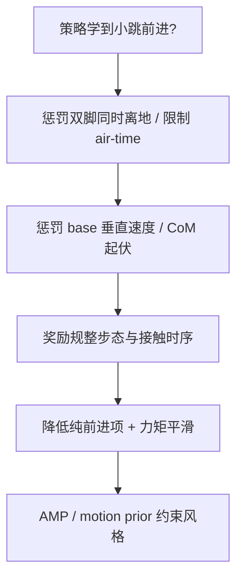

<ol>
<li><strong>PPO 的 clipping：</strong> 用重要性比 \(r=\pi_\theta/\pi_{\mathrm{old}}\)，目标取 \(\min\!\big(r\hat A,\ \mathrm{clip}(r,1-\epsilon,1+\epsilon)\hat A\big)\)。当一步更新让 \(r\) 偏离 1 过多时，clip 截断 advantage 增益，使越出信赖域的更新拿不到额外回报，从而抑制过大的策略跳变（近似信赖域）。\(\epsilon\) 太大：约束太松、更新过激、易崩；太小：更新太保守、收敛慢、样本利用率低。</li>
<li><strong>样本效率与为何仍用 PPO：</strong> 同数据量下 off-policy 的 SAC 更省样本（有 replay buffer 反复利用历史），on-policy 的 PPO 数据用完即弃。但人形 RL 主流仍用 PPO，因为大规模并行仿真（IsaacGym 上万环境）让样本"便宜"、瓶颈在 wall-clock 而非样本数，且 PPO 实现简单、超参鲁棒、与并行 on-policy 采样契合、训练稳定、易加 curriculum / DR。</li>
<li><strong>"小跳前进"如何改 reward：</strong> 多为 reward hack（前进得分未约束接触 / 腾空）。可：① 加同时双脚离地惩罚或限制 feet air-time、要求周期性单脚支撑；② 惩罚 base 垂直速度 / CoM 上下波动；③ 奖励规整步态（步频、足端轨迹、接触时序）；④ 调小纯前进项权重、加力矩 / 能量平滑惩罚抑制爆发弹跳；⑤ 用 AMP / motion prior 约束到"走"的风格。</li>
</ol>

---

### L5.2 RL 在人形运动控制里的应用

> **场景隐喻：** 通用 RL 算法直接套到人形上往往学不会——需要给它"合适的奖励 / 观测 / 动作空间 + 一堆训练 trick"。L5.2 是把 L5.1 的玩具环境落到真人形 locomotion 的工程细节。

> **上一层的局限：** L5.1 让你在 CartPole 上跑通 PPO；人形 25 DOF + 浮动基的状态空间维度高几个量级，需要 reward shaping、curriculum、early termination、特权信息、teacher-student 等专门技巧。

### 英文缩写速查（L5.2）

| 缩写 | 英文全称 | 简要说明 |
|------|----------|----------|
| DR | Domain Randomization | 仿真随机化物理 / 传感参数以缩小 sim2real gap。 |
| PD | Proportional–Derivative | 底层关节位置跟踪；RL 常输出 PD 目标。 |
| AMP | Adversarial Motion Priors | 判别器约束策略接近 MoCap 风格。 |
| ET | Early Termination | 摔倒等提前结束 episode，节省训练。 |
| Priv. | Privileged Information | 仅仿真 teacher 可见的额外状态。 |
| T–S | Teacher–Student | 全观测 teacher 蒸馏受限观测 student。 |
| Loco | Locomotion | 移动 / 步行类运动技能。 |

**前置知识：** L5.1 + L4.3/4.4

**核心问题：** RL 怎么和 MPC / WBC 结合，sim2real 怎么做到

**推荐做什么：**
- 用 IsaacGym / IsaacLab 训练一个人形行走策略
- 尝试 RL + WBC 的组合框架

**推荐读什么：**
- "DeepMimic" (Peng et al.)
- "AMP: Adversarial Motion Priors"
- legged_gym / IsaacGymEnvs
- [legged_gym](../wiki/entities/legged-gym.md)（本仓库）
- [Isaac Gym / Isaac Lab](../wiki/entities/isaac-gym-isaac-lab.md)（本仓库）
- [WBC vs RL](../wiki/comparisons/wbc-vs-rl.md)（本仓库）
- [MPC vs RL](../wiki/comparisons/mpc-vs-rl.md)（本仓库）
- [Query：开源运动控制项目导航](../wiki/queries/open-source-motion-control-projects.md)（本仓库）

**学完输出什么：**
- 能在仿真里训练一个人形行走 RL 策略
- 能解释 RL 和 WBC 各自的优势和局限

**自测题：**
- 人形 RL 通常用 position / velocity / torque 中哪种 action space？为什么 IsaacLab 默认选这种？
- "Privileged information"（特权信息）在 teacher-student 中具体是什么？为什么 student 拿不到？
- AMP / DeepMimic 这类 motion prior 方法和纯 PPO 比，最大的工程优势是什么？

参考答案（点击展开）

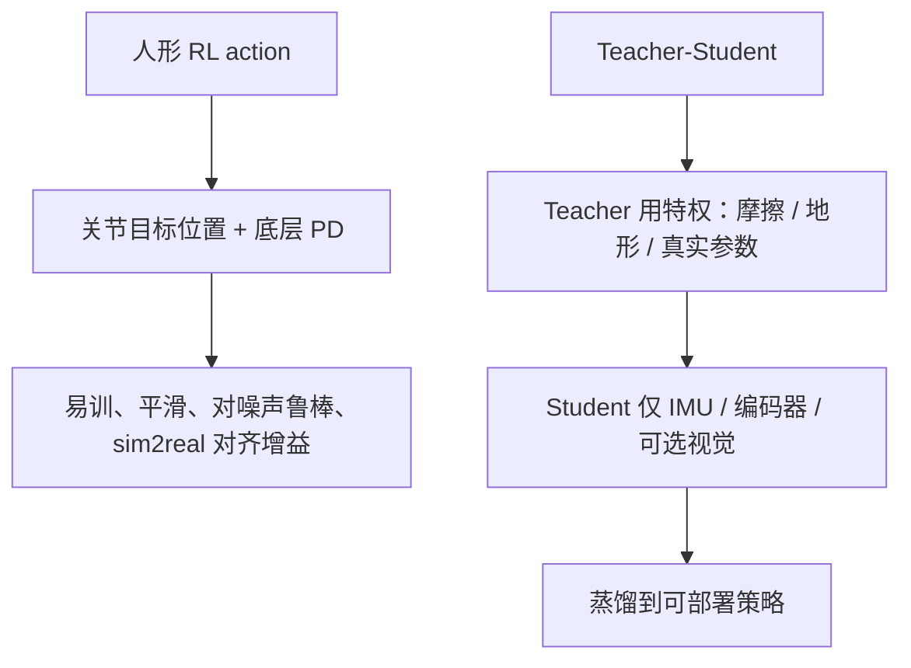

<ol>
<li><strong>action space 选择：</strong> 人形 RL 主流用 position（输出关节目标位置 / 相对默认姿态的偏移，交底层 PD 跟踪）。IsaacLab 默认这种，因为 PD 在高频跟踪、给策略一个低频平滑易学的接口，自带阻尼与稳定性、对网络输出噪声鲁棒，sim2real 时只要对齐 PD 增益即可；直接 torque 高频易抖、对延迟敏感，既难训也难迁移。</li>
<li><strong>特权信息：</strong> 指仿真可得、真机部署拿不到的精确量：真实地面摩擦 / 接触力、地形高度图、机器人质量 / 惯量、外力扰动、精确 base 速度等。teacher 用它训得又快又好；student 只能用真机可得的本体感（IMU、编码器、历史）加可选视觉，通过蒸馏 / 模仿 teacher 学到受限观测下的策略——因为部署时没有这些特权传感。</li>
<li><strong>motion prior 的工程优势：</strong> AMP / DeepMimic 用参考动作（MoCap）作先验，最大优势是免去手工设计复杂 reward——风格 / 自然度由对抗判别器或模仿误差自动提供，省掉大量 reward shaping 与调参，得到自然可迁移的步态；同时缩小探索空间、加速收敛、避免纯 PPO 学出的怪异 gait。</li>
</ol>

---

### L5.3 模仿学习

> **场景隐喻：** 与其让机器人反复试错，不如让它"看人怎么做"——MoCap、遥操作数据进来，机器人直接输出相似动作。

> **上一层的局限：** 纯 RL 在复杂动作（跳舞、操作、跑酷）上探索成本极高、reward 极难写。IL 用人类示范数据给一个**好起点**；但 IL 本身有 compounding error，通常要叠 RL 或 DAgger 才稳。

### 英文缩写速查（L5.3）

| 缩写 | 英文全称 | 简要说明 |
|------|----------|----------|
| IL | Imitation Learning | 从专家轨迹学习策略。 |
| BC | Behavior Cloning | 监督学习 \(\pi(s)\approx a_{\mathrm{expert}}\)。 |
| DAgger | Dataset Aggregation | 在策略访问状态上请 expert 重新标注。 |
| MoCap | Motion Capture | 人体 / 物体运动捕捉数据。 |
| Retarget | Motion Retargeting | 将示范骨架映射到目标机器人。 |
| ASE | Adversarial Skill Embeddings | 可组合技能嵌入的 IL / RL 框架之一。 |
| Cov. Shift | Covariate Shift | 训练与部署状态分布不一致；BC 核心难点。 |

**前置知识：** L5.1

**核心问题：** 用人类动作数据教机器人做动作

**推荐做什么：**
- 用 MoCap 数据做 motion retargeting
- 尝试 Behavior Cloning + DAgger

**推荐读什么：**
- "ASE: Adversarial Skill Embeddings"
- "DeepMimic"
- [Imitation Learning](../wiki/methods/imitation-learning.md)（本仓库）
- [Behavior Cloning](../wiki/methods/behavior-cloning.md)（本仓库）
- [DAgger](../wiki/methods/dagger.md)（本仓库）
- [Motion Retargeting](../wiki/concepts/motion-retargeting.md)（本仓库）

**学完输出什么：**
- 能把一段 MoCap 数据迁移到人形机器人上
- 能解释 DAgger 为什么比纯 BC 更好

**自测题：**
- BC 的 compounding error 在数学上意味着什么（提示：状态分布漂移）？
- DAgger 为什么能缓解 compounding error？需要付出什么额外代价？
- Motion Retargeting 时，骨骼比例不同 + 关节限位不同分别会造成什么问题？工程上如何缓解？

参考答案（点击展开）

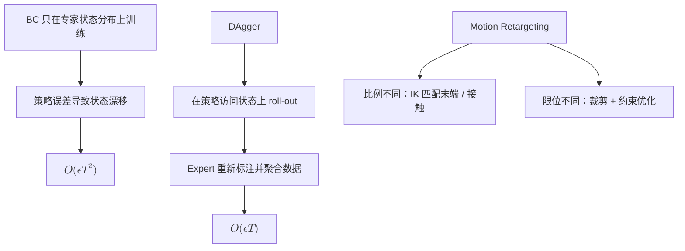

<ol>
<li><strong>BC 的 compounding error：</strong> 训练只见专家访问过的状态分布，部署时策略自身的小误差把它带到没见过的状态，误差沿时间累积（covariate shift / 状态分布漂移）。数学上若每步误差为 \(\epsilon\)，总误差随时域 \(T\) 呈 \(O(\epsilon T^2)\) 二次放大——一旦偏离，后续状态分布与训练分布失配，错误自我强化。</li>
<li><strong>DAgger 为何缓解、代价：</strong> DAgger 让策略在自己访问的状态上 roll-out，再请 expert 对这些状态标注正确动作并聚合进数据集迭代，使训练分布逐渐覆盖策略实际遭遇的状态，消除 covariate shift，把误差从 \(O(\epsilon T^2)\) 降到 \(O(\epsilon T)\)。代价：需要一个可随时查询的在线 expert 持续标注（成本高），且在真机上 roll-out 不成熟策略可能不安全。</li>
<li><strong>Motion Retargeting 的两类问题：</strong> 骨骼比例不同——照搬关节角会使末端（手 / 脚）错位、脚穿地 / 打滑，应按比例缩放并用 IK 匹配末端 / 接触关键点而非照抄关节角；关节限位不同——源动作可能超出物理限位致不可行 / 饱和，应裁剪 / 重映射到可行范围或在优化中加限位约束并重分配。工程上多用 IK + 优化的 retargeting（匹配 CoM / 脚接触 / 末端轨迹）并叠加接触与限位约束。</li>
</ol>

---

## L6 综合实战

**到这里，你应该已经对运动控制和学习两条路都有理解了。最后一步是让它们真正串起来。**

> **场景隐喻：** 仿真里走得再好看，真机上摔得最惨——L6 教你怎么填这个"仿真到现实"的鸿沟。

> **上一层的局限：** L4 / L5 都在仿真里假设理想：传感器无噪声、执行器无延迟、动力学完全已知。真机里这三条全都不成立，需要 system identification + domain randomization + teacher-student 等专门桥接技术。

**本阶段入口：** [Sim2Real](../wiki/concepts/sim2real.md)、[System Identification](../wiki/concepts/system-identification.md)、[Domain Randomization](../wiki/concepts/domain-randomization.md)、[Sim2Real Checklist](../wiki/queries/sim2real-checklist.md)、[机器人策略调试手册](../wiki/queries/robot-policy-debug-playbook.md)。

### 英文缩写速查（L6）

| 缩写 | 英文全称 | 简要说明 |
|------|----------|----------|
| Sim2Real | Simulation to Reality | 仿真训练策略部署到真机。 |
| SysID | System Identification | 辨识质量、摩擦、延迟等真实参数。 |
| DR | Domain Randomization | 训练期随机化以覆盖真机不确定性。 |
| T–S | Teacher–Student | 特权 teacher 蒸馏部署 student。 |
| Gap | Sim-to-Real Gap | 仿真与真机动力学 / 传感差异。 |
| Lat. | Actuator Latency | 执行器与通信延迟；RL 策略尤其敏感。 |

### 前置知识
- L4 全流程
- L5 RL 和 IL 的基本操作

### 核心问题
- 怎么从训练到部署形成闭环
- 怎么把仿真训练结果迁移到真实机器人
- 怎么设计一个完整的 RL + WBC pipeline

### 推荐做什么
- 设计并训练一个完整的人形 RL + WBC pipeline
- 做一次 sim2real 迁移
- 调 domain randomization 参数观察效果

### 推荐读什么
- [Sim2Real](../wiki/concepts/sim2real.md)（本仓库）
- [System Identification](../wiki/concepts/system-identification.md)（本仓库）
- [Domain Randomization](../wiki/concepts/domain-randomization.md)（本仓库）
- [Sim2Real Checklist](../wiki/queries/sim2real-checklist.md)（本仓库）
- [Sim2Real 工程 Checklist](../wiki/queries/sim2real-checklist.md#快速部署检查)（本仓库）
- [机器人策略调试手册](../wiki/queries/robot-policy-debug-playbook.md)（本仓库）

### 学完输出什么
- 一个能跑的人形 RL 策略（仿真内）
- 一次 sim2real 迁移实验记录
- 对整个 pipeline 的理解文档

### 自测题（学完应能答出）
- 给定一个仿真训好的 PPO 策略，列出真机部署前必须做的 5 件事。
- Domain Randomization 范围选过大 / 过小分别会出什么问题？你怎么定 DR 边界？
- 执行器延迟在 sim2real 里为什么对 RL 策略的破坏性比对传统 MPC 更大？

参考答案（点击展开）

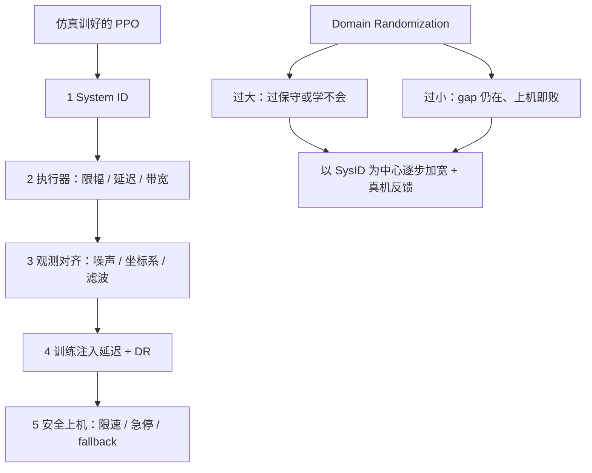

<ol>
<li><strong>真机部署前必做 5 件事：</strong>
<ol>
<li><strong>System Identification：</strong>辨识真实质量 / 惯量、关节摩擦、PD 增益、力矩-电流曲线。</li>
<li><strong>执行器建模：</strong>加入力矩限幅、传动延迟 / 带宽、电机一阶滞后。</li>
<li><strong>观测对齐：</strong>传感器噪声 / 偏置 / 延迟、坐标系与单位、滤波与训练时一致。</li>
<li><strong>训练侧鲁棒化：</strong>在训练中注入延迟 / 噪声 / 外扰并做 Domain Randomization 提升鲁棒。</li>
<li><strong>安全与渐进上机：</strong>限位限速、力矩饱和、急停、吊装 / 逐步放权并备好 fallback 控制器。</li>
</ol>
</li>
<li><strong>DR 范围过大 / 过小：</strong> 太大——任务过难，策略学得过度保守（蹲低、慢动作）牺牲性能甚至学不会（信号被噪声淹没）；太小——覆盖不到真机参数，sim2real gap 仍大、上机即败（过拟合仿真）。定边界：以辨识值为中心、按硬件不确定度（传感 / 装配 / 磨损）设范围并逐步加宽（curriculum），用真机 / 留出验证反馈调，在仍能收敛的前提下尽量覆盖真实分布。</li>
<li><strong>执行器延迟为何对 RL 更致命：</strong> RL 策略是高带宽、对观测-动作时序拟合极紧的反应式映射，且常隐式假设零延迟；延迟引入相位滞后，把训练时学到的紧反馈变成震荡 / 正反馈，又不可解释、无显式相位裕度可调。传统 MPC / WBC 有显式模型，可把延迟纳入预测（time-delay model、Smith predictor）并有稳定裕度概念，相对更可控。</li>
</ol>

---

## L7 出口：从运动控制看整个机器人技术栈

**这一层不教你写代码，它的目的是：在你已经看完 L0–L6 后，给你"机器人全栈"的最后一块拼图，让你能和这个领域任何方向的工程师对话。**

读到这里，你已经知道"控制盒子"在做什么。本节给出 [L−1 30 秒全景图](#30-秒看懂一台机器人在干嘛) 里其它三盒，以及当下 2024–2026 真正最活跃的几个方向。每块都不深入，只给：**它是什么 → 和运动控制怎么接 → 推荐 1 个入口页**。

### 英文缩写速查（L7 总览）

| 缩写 | 英文全称 | 简要说明 |
|------|----------|----------|
| SE | State Estimation | 融合多传感器估计本体状态。 |
| SLAM | Simultaneous Localization and Mapping | 定位与建图同时进行。 |
| MP | Motion Planning | 无碰撞路径 / 轨迹规划。 |
| VLA | Vision–Language–Action | 语言 + 视觉驱动动作的大模型。 |
| FM | Foundation Model | 大规模预训练后微调的通用模型。 |
| BFM | Behavior Foundation Model | 面向机器人行为的基础模型方向。 |
| LoCo-Manip | Loco-Manipulation | 移动中同时操作（走 + 搬）。 |

### L7.1 感知层（Perception / SLAM / 状态估计）

### 英文缩写速查（L7.1）

| 缩写 | 英文全称 | 简要说明 |
|------|----------|----------|
| SE | State Estimation | 融合 IMU、编码器、视觉等估计位姿与速度。 |
| SLAM | Simultaneous Localization and Mapping | 未知环境中同时建图与定位。 |
| IMU | Inertial Measurement Unit | 惯性测量；高频本体运动感知。 |
| RGB-D | RGB + Depth | 彩色加深度相机；3D 感知常用输入。 |
| VO | Visual Odometry | 纯视觉估计相机 / 机体运动。 |
| SEM | Semantic Segmentation | 像素级语义；场景理解入口。 |

**它是什么**：让机器人从摄像头 / IMU / 雷达 / 编码器 / 力觉等传感器中估出"自身位姿 + 世界几何 + 物体属性"。核心子领域：
- **State Estimation**：融合 IMU + 编码器 + 视觉，估出机器人本体在世界里的 6D 位姿与速度。
- **SLAM**：同时建图 + 定位，让机器人在未知环境里也知道自己在哪。
- **3D 感知 / 物体识别 / 语义分割**：把 RGB-D / 点云变成"地上有个箱子、距我 0.5 m"。

**和运动控制怎么接**：
- 运动控制需要 **准确的本体状态**（关节角、躯干位姿、足端是否着地）。状态估计差一点，下游 WBC / MPC 全乱套。L4 的 TSID / WBC 实际上严重依赖一个低延迟的状态估计器。
- 真机 sim2real（L6）gap 一大半来自 **执行器模型不准** + **状态估计噪声**。

**入口页**：[State Estimation](../wiki/concepts/state-estimation.md) · [SLAM (本仓库相关)](../wiki/tasks/locomotion.md)

### L7.2 决策与规划层（Motion Planning / Task Planning）

### 英文缩写速查（L7.2）

| 缩写 | 英文全称 | 简要说明 |
|------|----------|----------|
| MP | Motion Planning | 几何或动力学约束下的路径 / 轨迹规划。 |
| RRT | Rapidly-exploring Random Tree | 采样规划；高维空间常用。 |
| CHOMP | Covariant Hamiltonian Optimization for Motion Planning | 轨迹优化类运动规划。 |
| HTN | Hierarchical Task Network | 分层任务分解规划。 |
| PDDL | Planning Domain Definition Language | 符号任务规划标准语言。 |
| FP | Footstep Planning | 人形落点与步态时序规划。 |

**它是什么**：在感知建好的地图上，回答"先去哪、再去哪、用什么动作过去"。核心子领域：
- **Motion Planning**：A* / RRT / RRT* / CHOMP / TrajOpt → 给出无碰撞轨迹。
- **Task Planning / HTN / PDDL**：把"把杯子放到桌上"分解成"接近 → 抓 → 移动 → 放"。
- **Footstep Planning**（人形特有）：决定下一步落点、步态时序。

**和运动控制怎么接**：
- 规划层给 **参考轨迹**（足端位置、CoM 轨迹、关节目标），下游 L4 的 MPC / WBC 负责跟踪。
- L4.3 的 trajectory optimization 跟传统 motion planning 有大量交叠，区别在 **是否带动力学约束** 和 **是否在线求解**。

**入口页**：[Trajectory Optimization](../wiki/methods/trajectory-optimization.md) · [Locomotion 任务地图](../wiki/tasks/locomotion.md)

### L7.3 操作层（Manipulation / Grasping）

### 英文缩写速查（L7.3）

| 缩写 | 英文全称 | 简要说明 |
|------|----------|----------|
| EE | End Effector | 末端执行器（手爪、工具等）。 |
| Grasp | Grasping | 抓取与稳定持握。 |
| CRM | Contact-Rich Manipulation | 接触丰富、力交互主导的操作。 |
| DP | Diffusion Policy | 扩散模型生成动作序列；多模态操作常用。 |
| ACT | Action Chunking with Transformers | 分块动作预测的模仿学习架构之一。 |
| WBC | Whole-Body Control | 操作任务底层仍常依赖全身力控。 |

**它是什么**：手 / 末端执行器与物体的精细交互，包括抓取、放置、装配、双臂协同、接触丰富的精细操作（拧螺丝、插拔）。

**和运动控制怎么接**：
- 操作和 locomotion 共享 **同一套阻抗控制 / WBC / 接触建模**基础。
- 现代 contact-rich manipulation 主流走 **模仿学习路线**（ACT / Diffusion Policy），但底层力控仍来自传统控制；这就是为什么 L4 的 WBC 在操作任务里也是基石。

**入口页**：[Manipulation 任务地图](../wiki/tasks/manipulation.md) · [接触丰富操作纵深路线](depth-contact-manipulation.md)

### L7.4 系统与软件栈（ROS / 中间件 / 部署）

### 英文缩写速查（L7.4）

| 缩写 | 英文全称 | 简要说明 |
|------|----------|----------|
| ROS | Robot Operating System | 机器人节点、话题、服务中间件生态。 |
| RT | Real-Time Control | 毫秒级硬实时控制循环。 |
| CAN | Controller Area Network | 常见电机总线协议。 |
| EtherCAT | Ethernet for Control Automation Technology | 工业实时以太网；低延迟驱动。 |
| HAL | Hardware Abstraction Layer | 硬件抽象；统一仿真与真机接口。 |
| Gazebo | Gazebo Simulator | 经典 ROS 配套仿真器之一。 |

**它是什么**：把上述所有模块连起来跑在一台真机上需要的工程基础设施。
- **ROS / ROS2**：机器人最常用的消息中间件、节点抽象、launch 系统。
- **Real-time control loop**：低延迟（1–2 kHz）实时控制循环、与高层规划（10–100 Hz）之间的多速率通信。
- **仿真器**：MuJoCo / Isaac Sim / Gazebo / Drake，各有适用场景。
- **硬件抽象**：URDF / MJCF / 真实驱动器接口、CAN / EtherCAT。

**和运动控制怎么接**：
- L4 的 TSID / WBC 通常运行在 **实时进程**（1 kHz），上层 MPC 跑在 **非实时进程**（50–500 Hz），由 ROS2 / shared memory 通信。理解这层架构才能解释"为什么一个看似能跑的算法上真机就崩"。
- L6 的 sim2real 整链路依赖 URDF / 控制器 / 通信延迟的对齐。

**入口页**：[Pinocchio](../wiki/entities/pinocchio.md) · [Isaac Gym / Isaac Lab](../wiki/entities/isaac-gym-isaac-lab.md)

### L7.5 2024–2026 前沿地图（你会反复看到的关键词）

### 英文缩写速查（L7.5）

| 缩写 | 英文全称 | 简要说明 |
|------|----------|----------|
| VLA | Vision–Language–Action | 视觉–语言条件策略；如 RT-2、π0。 |
| WM | World Model | 学习环境动力学用于想象 rollout。 |
| E2E | End-to-End | 传感到动作的单网络，少分层。 |
| HFM | Humanoid Foundation Model | 通用人形大模型 / 基础策略方向。 |
| LfWM | Learning from World Models | 在世界模型中训练或规划。 |
| Tactile | Tactile Sensing | 触觉；精细装配闭环常用。 |

近三年机器人 AI 正在快速重塑，下面这几个方向并行推进；它们不是替代 L4 的传统控制，而是 **在传统控制之上叠了一层"通用化 / 端到端"**：

| 方向 | 关键问题 | 代表工作 / 关键词 | 本仓库入口 |
|------|---------|----------------|-----------|
| **Humanoid Foundation Model** | 一个大模型驱动多种人形机器人 | GR00T (NVIDIA), Helix (Figure), Astribot | [Locomotion 任务地图](../wiki/tasks/locomotion.md) |
| **VLA（Vision-Language-Action）** | 用语言指令驱动机器人完成操作 | RT-2, OpenVLA, π0, Pi-0.5 | [Imitation Learning](../wiki/methods/imitation-learning.md) |
| **World Model for Robotics** | 让机器人在"想象的世界"里训练 | Dreamer-V3, UniSim, GAIA-1 | （扩展阅读） |
| **大规模 Teacher-Student**| 用特权 teacher 训 student，实现 sim2real | "Learning to Walk in Minutes"、ANYmal、Unitree 等 | [Sim2Real](../wiki/concepts/sim2real.md) |
| **AMP / Motion Prior** | 用对抗式损失把 MoCap 动作蒸馏到 RL 策略 | AMP, ASE, CALM, PHC | [模仿学习纵深路线](depth-imitation-learning.md) |
| **End-to-End Locomotion**| 视觉 + 本体观测 → 关节动作的端到端 RL | [Extreme Parkour](../wiki/entities/extreme-parkour.md), ANYmal Parkour, [DreamWaQ++](../wiki/entities/dreamwaq-plus.md) | [RL 纵深路线](depth-rl-locomotion.md) |
| **Whole-Body Loco-Manipulation** | 走着同时操作（搬箱子、推门）| HumanPlus, OmniH2O, OKAMI | [Manipulation 任务地图](../wiki/tasks/manipulation.md) |
| **LLM + RL 分层** | 语义/任务层大模型 + 底层 RL 力控执行 | 各类 VLA + 低层策略栈 | [VLA](../wiki/methods/vla.md) · [具身 RL 最小闭环](../wiki/concepts/embodied-rl-minimal-closed-loop.md) |
| **Intrinsic reward 探索** | 无手工奖励时的自驱动预训练 | RND, DIAYN 等 | [Intrinsic reward 预训练](../wiki/overview/bfm-category-03-intrinsic-reward-pretraining.md) |
| **Tactile / 力觉闭环** | 高频触觉反馈用于精细装配 | DIGIT, GelSight 系列 | （扩展阅读） |

> 这一节不展开任何一个方向——它们随便一个都够再开一条主线。读到这里，你已经能 **听懂每一条** 在解决什么问题，这就是 L7 的目的。

### 学完这条路线，你能做到的事

回到 L−1 的"三种读者"视角：

- **外行**：能在饭桌上说出"人形机器人为什么走起来这么难"、"VLA 和 PPO 是不同层的东西"、"sim2real gap 主要来自哪里"。
- **想入行**：手上至少有一个能在仿真里跑通 PPO + WBC 的项目，可以面试机器人控制 / 仿真岗位。
- **资深从业者**：把零散经验串成一条心智索引，知道每个新论文该挂在 L0–L7 的哪里、和你已知方法的对接点是哪里。

---

## 可选纵深（独立路线页）

主路线偏向"先稳住一条主干"，但实际研究方向往往要继续深入某一个子专题。下面十八条纵深路径**各自是独立的 roadmap 页面**，从主路线的某个阶段衔接出去（按各方向起点里程碑的历史顺序排列，与首页、README 一致）：

| 纵深路径 | 适合谁 | 主线衔接点 |
|---------|------|-----------|
| [如果目标是力矩控制电机设计（指标 → 电磁热 → FOC 力矩闭环 → 关节模组）](depth-torque-motor-design.md) | 想把关节电机从任务指标做到可验收的力矩闭环模组 | 硬件底座：任意阶段可入，建议 L2 前后 |
| [如果目标是传统模型控制（LIP/ZMP → MPC → WBC）](depth-classical-control.md) | 想把 model-based 主干写成可运行的控制器 | L2 → L4 |
| [如果目标是安全控制（CLF / CBF / Safe RL）](depth-safe-control.md) | 想给 WBC / MPC / RL 加可证明的安全约束 | L4.4 / L5 任意 |
| [如果目标是接触丰富的操作任务](depth-contact-manipulation.md) | 想做装配、插拔、双臂协同等精细接触 | L4.4 / L5.3 之后 |
| [如果目标是导航（SLAM → Nav2 → VLN → 导航 VLA）](depth-navigation.md) | 想让机器人知道自己在哪、该往哪走 | L7.1 / L7.2 展开 |
| [如果目标是模仿学习与技能迁移](depth-imitation-learning.md) | 想从人类演示数据驱动机器人技能 | L5.3 之后 |
| [如果目标是 RL 运动控制](depth-rl-locomotion.md) | 想用 RL 让人形走起来、不愿从头啃控制理论 | L3 → L5.2 |
| [如果目标是 Loco-Manipulation（移动操作）](depth-loco-manipulation.md) | 想让机器人边走边动手（搬箱、开门、端托盘）| L4 + L5 之后 |
| [如果目标是人形足球（全向行走 → 感知踢球 → 多机战术）](depth-humanoid-soccer.md) | 想让机器人追球、射门、打整场比赛 | L5 之后 |
| [如果目标是动作重定向（人体动作 → 机器人参考轨迹）](depth-motion-retargeting.md) | 想搭"人体动作 → 机器人可执行参考"的数据管线 | L2 + L5.3 之后 |
| [如果目标是人形群控展演（群舞同步 → 编队走位 → 群体特技）](depth-humanoid-swarm-performance.md) | 想让一群人形同台跳舞、变队形、协同炫技 | L5.3 之后 |
| [如果目标是 Sim2Real（域差画像 → 执行器对齐 → 鲁棒训练 → 真机部署）](depth-sim2real.md) | 想把仿真里训好的策略稳定搬上真机 | L5.2 → L6（L6 的展开版）|
| [如果目标是人形拳击（动作跟踪 → 潜空间技能 → 对抗自博弈）](depth-humanoid-boxing.md) | 想让两台人形在擂台上像人一样对打 | L5.3 之后 |
| [如果目标是 BFM（人形行为基础模型）](depth-bfm.md) | 想用一个 checkpoint 控住人形全身 | L5.3 之后 |
| [如果目标是感知越障（Perceptive Locomotion）](depth-perceptive-locomotion.md) | 想让机器人看着地形上楼梯、跨障碍、跑酷 | L5 之后 |
| [如果目标是动作生成（文本/多模态 → 人形动作）](depth-motion-generation.md) | 想用生成模型造出人体/人形动作 | L5.3 之后 |
| [如果目标是 VLA（视觉-语言-动作模型）](depth-vla.md) | 想让机器人听懂指令干活 | L5.3 之后 |
| [如果目标是 Real2Sim（真实世界 → 可仿真资产/场景/孪生）](depth-real2sim.md) | 想把真实世界压成可训练/可评测的仿真资产 | L6 / L7（L6/L7 资产与评测的展开版）|
| [如果目标是 WAM（世界–动作模型）](depth-wam.md) | 想让策略在出动作前显式预知世界会怎么变 | L5.3 之后 |

每条纵深页都有自己的 Stage 0–N 划分，可以独立阅读；遇到理论卡点再回主路线对应章节补。

## 常见卡点

### 1. 学了一堆理论，不知道怎么串起来
解决思路：按上面 L0 → L6 的顺序走，每个阶段都有输出物，不要只看不练。

### 2. RL 训练不稳定，不知道怎么调
解决思路：从 IL 初始化 RL 起步（先给一个好的 policy prior），比纯 RL 从零训稳得多。

### 3. 不知道自己的模型对不对
解决思路：先用 WBC / MPC 这类 model-based 方法做 baseline，RL 结果要有对比才知道好不好。

### 4. Sim2Real 差距太大
解决思路：先做好 System Identification，再用 Domain Randomization 扩大扰动范围，最后考虑在线自适应。

### 5. Modern Robotics 看完了，但不知道和人形控制怎么接
解决思路：参见 [L−1 的"Modern Robotics 在本路线扮演什么角色"](#一本贯穿全程的教材modern-robotics)。MR 是数学语言 + 固定基机器人基础；真正进入人形后还要补 [Floating Base Dynamics](../wiki/concepts/floating-base-dynamics.md)、[Centroidal Dynamics](../wiki/concepts/centroidal-dynamics.md)、[Contact Dynamics](../wiki/concepts/contact-dynamics.md) 和 [Whole-Body Control](../wiki/concepts/whole-body-control.md)。

---

## 和其他页面的关系

- 本路线是 `Robotics_Notebooks` 当前最核心的执行入口
- 传统机器人学主教材：[Modern Robotics](../wiki/entities/modern-robotics-book.md)
- 更详细的阶段参考：[Humanoid Control Roadmap](../wiki/roadmaps/humanoid-control-roadmap.md)
- 实战经验补充：[Query：人形机器人运动控制 Know-How](../wiki/queries/humanoid-motion-control-know-how.md)
- 可选纵深路线页（按方向起点里程碑的历史排序）：
  - [如果目标是力矩控制电机设计](depth-torque-motor-design.md)
  - [如果目标是传统模型控制](depth-classical-control.md)
  - [如果目标是安全控制](depth-safe-control.md)
  - [如果目标是接触丰富的操作任务](depth-contact-manipulation.md)
  - [如果目标是导航](depth-navigation.md)
  - [如果目标是模仿学习与技能迁移](depth-imitation-learning.md)
  - [如果目标是 RL 运动控制](depth-rl-locomotion.md)
  - [如果目标是 Loco-Manipulation](depth-loco-manipulation.md)
  - [如果目标是人形足球](depth-humanoid-soccer.md)
  - [如果目标是动作重定向](depth-motion-retargeting.md)
  - [如果目标是人形群控展演](depth-humanoid-swarm-performance.md)
  - [如果目标是 Sim2Real](depth-sim2real.md)
  - [如果目标是人形拳击](depth-humanoid-boxing.md)
  - [如果目标是 BFM（人形行为基础模型）](depth-bfm.md)
  - [如果目标是感知越障](depth-perceptive-locomotion.md)
  - [如果目标是动作生成](depth-motion-generation.md)
  - [如果目标是 VLA（视觉-语言-动作模型）](depth-vla.md)
  - [如果目标是 Real2Sim（真实世界 → 可仿真资产/场景/孪生）](depth-real2sim.md)
  - [如果目标是 WAM（世界–动作模型）](depth-wam.md)
- 技术栈地图参考：[tech-map/dependency-graph.md](../tech-map/dependency-graph.md)
