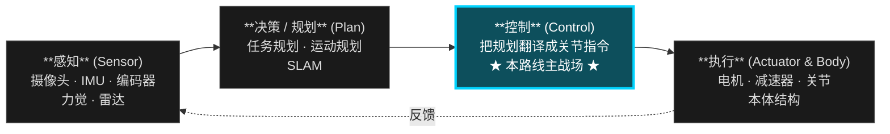
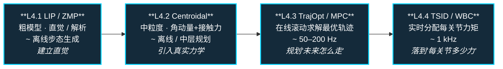

# 主路线：运动控制算法工程师成长路线

**摘要**：从 L−1 全景到 L7 出口的单一主线，串通人形 / 双足运动控制：L−1 建立机器人技术栈全景心智地图与必备术语，L0–L3 打底（数学、运动学、动力学、控制基础），L4 拿下传统控制主干（LIP/ZMP → Centroidal → MPC → TSID/WBC），L5 接上 RL/IL 扩展层，L6 完成 sim2real 闭环，L7 把全栈视角与 2024–2026 前沿地图交回给你。

## 三句话先懂这条路线（极简版）

1. **先把传统控制主干打通**：LIP/ZMP → Centroidal → MPC → TSID/WBC。
2. **再把学习方法接上去**：RL/IL 用来补能力，不是替代控制结构。
3. **每一层都要有可运行输出**：代码、实验记录、失败复盘，缺一不可。

## 先看哪里（导航）

- 想 **30 秒先理解整个机器人技术栈**：跳到 [L−1 序言](#l1-序言机器人技术栈全景--怎么读这条路线)。
- 想 **最短可执行路径**：跳到 [最小可执行学习路径（90 天版本）](#最小可执行学习路径90-天版本)。
- 想 **完整路线**：按 L−1 → L0 → … → L7 依次阅读。
- 想 **走纵深**（各自独立路线页）：
  - [如果目标是 RL 运动控制](depth-rl-locomotion.md)
  - [如果目标是模仿学习与技能迁移](depth-imitation-learning.md)
  - [如果目标是安全控制](depth-safe-control.md)
  - [如果目标是接触丰富的操作任务](depth-contact-manipulation.md)

---

## L−1 序言：机器人技术栈全景 & 怎么读这条路线

**这一节是给完全没看过机器人的读者准备的"软着陆台阶"。** 资深读者可以直接跳到 [L0 数学与编程基础](#l0-数学与编程基础) 或 [最小可执行学习路径](#最小可执行学习路径90-天版本)。

### 30 秒看懂"一台机器人在干嘛"

把任何机器人——扫地机、机械臂、自动驾驶、人形——拆开看，都在循环跑同一个 4 步：

- **感知**：摄像头 / IMU / 编码器 / 力觉 / 雷达 → 让机器人知道"自己在哪、世界长什么样"。
- **决策 / 规划**：高层任务规划、运动规划、SLAM → 决定"要去哪、走哪条路"。
- **控制**：把规划目标变成关节级指令 → 决定"每个关节这一毫秒该出多少力 / 转多少角度"。
- **执行**：电机、减速器、关节、本体结构 → 把指令变成机械运动。

> **本路线只钻第三个盒子：控制。** 其它三盒在 [L7 出口层](#l7-出口从运动控制看整个机器人技术栈) 集中扫盲，给你进入对应子专题的入口。

### 为什么以"人形 / 双足"为主载体

人形 = **高自由度**（20+ 关节）+ **浮动基**（没固定在地面）+ **接触切换**（脚要轮流着地）+ **强不稳定**（重心永远想往外跑）。
学会人形控制，迁移到机械臂、四足、轮式底盘几乎都是降难度，反之不成立。所以人形是当下的"最佳教学载体"。

### 三种读者的不同读法

| 你是谁 | 推荐读法 | 不需要做什么 |
|--------|---------|------------|
| **完全外行**（想搞懂术语，能和工程师对话）| 只读每一 L 的"场景隐喻 / 学完能做什么 / 推荐读什么"和本节"必备术语速查" | 不需要写一行代码、不需要做练习 |
| **想入行**（程序员 / 在校生）| 跟 [最小可执行 90 天路径](#最小可执行学习路径90-天版本) → 再按 L0 → L7 全程走，每一层都做"推荐做什么" | 不需要先读完所有论文 |
| **资深从业者**（有相关经验、查漏补缺）| 直接跳 L4 / L5，重点看每层的"常见误区 / 自测题"；用 [可选纵深](#depth-optional-index) 切入研究方向 | 不需要重读 L0–L2 基础 |

### 怎么用每一层（页面格式说明）

每一个 L（除 L−1 / L7 外）都遵循同一套格式：

1. **场景隐喻** — 一句话比喻，给完全外行用
2. **为什么存在 / 上一层的局限** — 解释这一层为何不可跳过
3. **前置知识 → 核心问题 → 推荐做什么 → 推荐读什么 → 学完输出什么** — 工程化执行清单
4. **常见误区 + 自测题** — 给资深读者快速校准

### 资深读者 skip-to 矩阵

如果你已经在工作中接触过机器人控制，根据你能回答出的问题，可以直接跳到对应 L。**点击下面的按钮直达对应章节：**

<a class="btn-secondary" href="#l1-机器人学骨架" style="flex-direction:column; padding:14px 18px; text-align:center; border-radius:14px; line-height:1.5;"><strong>我会 NumPy，不懂 SE(3)</strong>→ L1 机器人学骨架</a>
<a class="btn-secondary" href="#l2-动力学与刚体建模" style="flex-direction:column; padding:14px 18px; text-align:center; border-radius:14px; line-height:1.5;"><strong>会 Pinocchio FK / Jacobian，不熟 RNEA / CRBA / ABA</strong>→ L2 动力学与刚体建模</a>
<a class="btn-secondary" href="#l4-人形运动控制主干" style="flex-direction:column; padding:14px 18px; text-align:center; border-radius:14px; line-height:1.5;"><strong>会固定基逆动力学，浮动基没碰过</strong>→ L4 人形运动控制主干</a>
<a class="btn-secondary" href="#l41-lip--zmp" style="flex-direction:column; padding:14px 18px; text-align:center; border-radius:14px; line-height:1.5;"><strong>熟 LQR / MPC，没系统学 LIP / Centroidal / WBC</strong>→ L4.1 LIP / ZMP</a>
<a class="btn-secondary" href="#l52-rl-在人形运动控制里的应用" style="flex-direction:column; padding:14px 18px; text-align:center; border-radius:14px; line-height:1.5;"><strong>会 IsaacLab PPO，不知如何和传统控制结合</strong>→ L5.2 RL 在人形运动控制里的应用</a>
<a class="btn-secondary" href="#l6-综合实战" style="flex-direction:column; padding:14px 18px; text-align:center; border-radius:14px; line-height:1.5;"><strong>跑通仿真 RL，没做过 sim2real 部署</strong>→ L6 综合实战</a>
<a class="btn-secondary" href="#l7-出口从运动控制看整个机器人技术栈" style="flex-direction:column; padding:14px 18px; text-align:center; border-radius:14px; line-height:1.5;"><strong>做过运动控制，想看当下机器人 AI 全景</strong>→ L7 出口与前沿地图</a>

**两条主线不要混着学：**
- **传统控制主线（L0–L4 + L6）：** OCP → LIP/ZMP → Centroidal → MPC → TSID/WBC → State Estimation → Sim2Real
- **Learning-based 主线（L5）：** RL 基础 → locomotion RL → imitation learning / motion prior → teacher-student
- 优先把传统主线学通，再把 RL / IL 当作扩展层接上去；否则容易只会调超参数、不理解控制结构为什么这样设计。

### 必备术语速查（外行先建立"听到能对上号"的肌肉记忆）

**控制层：**

- **DOF / 自由度**：机器人能独立运动的方向数。人形 ≈ 25 DOF。
- **关节力矩**：关节里电机出的"扭力"。控制最终都要变成"每个关节出多少力矩"。
- **正运动学（FK）/ 逆运动学（IK）**：FK = 知道关节角 → 算末端在哪；IK = 想让末端到哪 → 反推关节角。
- **雅可比矩阵**：FK 的"微分版"，把关节速度映射到末端速度。
- **动力学**：研究力 / 力矩与运动的关系；正动力学 = 力 → 加速度，逆动力学 = 加速度 → 力。
- **浮动基（Floating Base）**：底座不固定。人形躯干就是浮动基。
- **接触切换（Contact Switch）**：脚什么时候着地、什么时候离地，是人形控制核心难点。
- **质心（CoM）/ 质心动力学**：机器人整体重心位置和动量，平衡控制的核心变量。
- **ZMP（零力矩点）/ 支撑多边形**：脚和地面接触区域内的特殊点；ZMP 留在支撑多边形里 → 不摔。
- **DCM / Capture Point**：从 ZMP 推广出来的平衡判据，回答"我现在踩到哪就能立刻停下来"。
- **MPC（模型预测控制）**：在线滚动求解未来几秒的最优控制问题。
- **WBC / TSID（全身控制）**：把上层规划目标同时翻译成所有关节力矩，处理优先级和约束。
- **PID / LQR**：两种最经典的反馈控制器。

**学习与仿真层：**

- **RL（强化学习）/ PPO**：让机器人在仿真里反复试错 → 学到一个策略；PPO 是当前最常用的 RL 算法。
- **IL（模仿学习）/ BC（行为克隆）**：让机器人从人类示范数据里学。
- **Motion Retargeting**：把人类动作重定向到机器人骨架。
- **Sim2Real**：仿真训练的策略迁移到真机的过程；通常会出现"sim2real gap"。
- **Domain Randomization (DR)**：仿真里随机化各种参数，提升策略真机鲁棒性。
- **Isaac Gym / Isaac Lab / MuJoCo**：当下 RL 仿真两大主流引擎。
- **Pinocchio / Crocoddyl / TSID**：当下传统控制最常用的 C++/Python 库。
- **URDF / MJCF**：描述机器人结构的标准文件格式。

**系统与前沿层（会反复听到的词）：**

- **ROS / ROS2**：机器人软件的"操作系统"和消息中间件。
- **SLAM**：同时定位与建图，让机器人知道"我在哪 + 周围长什么样"。
- **VLA（Vision-Language-Action）**：把视觉、语言、动作统一进一个大模型的最新方向（如 Google RT-2、π0）。
- **Foundation Model for Robots**：大规模预训练 + 微调的机器人通用模型。
- **Teacher-Student**：用一个"看得见所有信息"的 teacher 训练只看真实传感器的 student，sim2real 常用技巧。

> 这些术语在后面每一层会反复出现。**外行只需先建立"听到能对上号"的肌肉记忆**，不必现在搞懂细节。

### 一本贯穿全程的教材：Modern Robotics

[Modern Robotics（Lynch & Park）](../wiki/entities/modern-robotics-book.md) 是本路线 L0–L4 的"语法书"。**它不教人形 locomotion，但它把'位姿 / 速度 / 力 / 动力学'用统一的 twist / screw / wrench 语言讲清楚了。** 后面每一层下面的"推荐读什么"里会指给你具体章节，这里先说一遍它在全程的位置，避免每一层重复引用：

| Modern Robotics 章节 | 接到本路线哪一层 |
|--------------------|----------------|
| Ch 2–3：Configuration Space / Rigid-Body Motions | L0–L1（SE(3) 字母表） |
| Ch 4–6：Forward / Velocity / Inverse Kinematics | L1 |
| Ch 5、Ch 8：Statics / Dynamics of Open Chains | L2 |
| Ch 9：Trajectory Generation | L3 / L4.3 |
| Ch 11：Robot Control | L3 / L4.4 |

> Ch 7（Force Control）、Ch 10（Motion Planning）也很有价值，但相对偏离本路线主干，作为可选。

---

## 最小可执行学习路径（90 天版本）

如果你希望“少而精、尽快跑起来”，可以先只做这 5 件事：

1. 跑通一个 [Locomotion](../wiki/tasks/locomotion.md) 仿真环境（站立 + 前进）。  
2. 实现一个倒立摆 [LQR](../wiki/formalizations/lqr.md) 或简单 [MPC](../wiki/methods/model-predictive-control.md)。  
3. 跑通一个最小 [Whole-Body Control](../wiki/concepts/whole-body-control.md) / [TSID](../wiki/concepts/tsid.md) 示例。  
4. 用 PPO 训练一个基础策略，并阅读 [WBC vs RL](../wiki/comparisons/wbc-vs-rl.md) 做方法取舍。  
5. 完成一次最小 [Sim2Real](../wiki/concepts/sim2real.md) checklist（哪怕只在仿真内做 domain randomization 对比）。  

> 完成这 5 件事后，再回到 L0-L6 补理论，会更快理解“为什么要学这些”。

---

## L0 数学与编程基础

**这条不需要深入，但不能跳过。**

> **场景隐喻：** 你刚拿到一台机器人，但连"它的胳膊指哪个方向"都没法用代码描述——L0 给你"机器人世界的最底层词汇表"：向量、矩阵、旋转、变换。

> **这一层为什么存在：** 之后每一层的公式都把"位姿 / 速度 / 力"当作黑话。没有 L0，每读一行公式都要现场查。

**本阶段入口：** [SE(3) 表示](../wiki/formalizations/se3-representation.md)、[Pinocchio](../wiki/entities/pinocchio.md)、[Crocoddyl](../wiki/entities/crocoddyl.md)（Modern Robotics 在 L−1 已介绍，下方"推荐读什么"会指出具体章节）。

### 前置知识
- 高中数学 + 一点微积分直觉
- 会写 Python（能读、能改、能跑通）

### 核心问题
- 线性代数在机器人里到底怎么用（矩阵、向量、变换）
- 优化问题的直觉是什么

### 推荐做什么
- 把 Python / NumPy / Pinocchio 环境的代码跑通一套
- 不用刷题，但要有手感和直觉
- 用 Modern Robotics 配套 Python 库跑通 `MatrixExp3`、`MatrixExp6`、`FKinSpace` 这类最小函数，确认自己能把矩阵指数和刚体位姿变换连起来

### 推荐读什么
- 《Linear Algebra Done Right》（不用全看，只看核心直觉）
- 3Blue1Brown 的线性代数视频（强烈推荐）
- [Modern Robotics](../wiki/entities/modern-robotics-book.md) Ch 2-3：Configuration Space、Rigid-Body Motions
- [SE(3) 表示](../wiki/formalizations/se3-representation.md)（本仓库）
- [Pinocchio](../wiki/entities/pinocchio.md)（本仓库）

### 学完输出什么
- 能用 NumPy 写简单矩阵运算
- 能跑通一个机械臂正运动学 Demo

### 自测题（学完应能答出）
- 旋转矩阵 \(R\) 为什么不能直接做加法 / 插值？想插值两个朝向你会用什么替代？
- 给定 SE(3) 元素 \(g = (R, p)\)，向量 \(v\) 在新坐标系下表示是什么形式？
- 矩阵指数 \(\exp([\omega]_\times)\) 和欧拉角 / 四元数描述旋转，分别的优劣是什么？

---

## L1 机器人学骨架

**这条是所有后续内容的基座，跳过后面一定会补。**

> **场景隐喻：** 你盯着机器人胳膊关节角度的变化，能不能马上脑补出末端走出的轨迹？L1 教你这个翻译器：关节空间 ↔ 任务空间。

> **上一层的局限：** L0 让你能写矩阵运算，但还不知道"机器人的关节角"和"末端位姿"是什么映射；L1 把这个翻译器搭起来。

**本阶段入口：** [Humanoid Robot](../wiki/entities/humanoid-robot.md)、[Pinocchio](../wiki/entities/pinocchio.md)、[Floating Base Dynamics](../wiki/concepts/floating-base-dynamics.md)。

**这一层建议分三步走，不要一口气啃完：**

1. **L1.1 SE(3)、旋转与刚体变换** — 把"位姿"用数学描述清楚（旋转矩阵、齐次变换、Twist / Screw Axis、矩阵指数 / PoE）。这是后面所有内容的字母表。
2. **L1.2 正逆运动学（FK / IK）** — 关节角 ↔ 末端位姿。先用 PoE 公式手写 FK 验证 Pinocchio 的输出再说。
3. **L1.3 雅可比与速度运动学** — 关节速度 ↔ 末端速度，space Jacobian 与 body Jacobian 的区别；这是 L4 任务空间控制的入门钥匙。

> 上述三步在本文档下方"推荐做什么 / 推荐读什么 / 学完输出什么"里**统一列出**——不必拆三份执行清单，只需在心里按这个顺序推进。

### 前置知识
- L0 内容
- 刚体在三维空间里怎么旋转、怎么描述朝向

### 核心问题
- 机器人每个关节的角度和末端执行器位置是什么关系
- 怎么用数学描述这件事
- 正逆运动学是什么
- 为什么 twist、screw axis、PoE 比只记 D-H 参数更适合接后面的 Pinocchio / TSID / WBC

### 推荐做什么
- 用 Pinocchio 或 Robotics Toolbox 建模一个简单机械臂
- 写出正运动学和逆运动学代码
- 理解雅可比矩阵是什么
- 用 Modern Robotics 的 PoE 公式手写一个 2-3 自由度机械臂的 `FKinSpace` / `JacobianSpace`，再和 Pinocchio 输出对齐

### 推荐读什么
- [Modern Robotics](../wiki/entities/modern-robotics-book.md) Ch 4-6：Forward Kinematics、Velocity Kinematics、Inverse Kinematics
- [斯坦福《机器人学导论》(B站)](https://www.bilibili.com/video/BV17T421k78T/)
- 跑通 Pinocchio 官方 Tutorial
- [Humanoid Robot](../wiki/entities/humanoid-robot.md)（本仓库）
- [Floating Base Dynamics](../wiki/concepts/floating-base-dynamics.md)（本仓库）

### 学完输出什么
- 能自己建模一个简单机器人并计算正逆运动学
- 能解释雅可比矩阵在机器人里是什么、有什么用
- 能区分 space Jacobian 与 body Jacobian，并知道它们在任务空间控制里如何进入速度/力映射

### 自测题（学完应能答出）
- 给定 space Jacobian \(J_s\)，怎么算 body Jacobian \(J_b\)？两者在任务空间速度控制里的应用差别在哪？
- 6 自由度机械臂的 IK 一般有几组解？"肘部上 / 肘部下"是怎么来的？
- PoE 公式相比 D-H 参数最大的工程优势是什么？为什么 Pinocchio / TSID 都建立在 twist / screw 上？

---

## L2 动力学与刚体建模

**从运动学到动力学，是控制机器人最重要的跳跃。**

> **场景隐喻：** 你给机器人一个力矩，它会怎么动？L2 把"几何空间"升级成"力学空间"——从描述位姿过渡到描述运动和力的因果关系。

> **上一层的局限：** L1 运动学只回答"关节角速度 ↔ 末端速度"是怎么映射的，但不能回答"加多大力矩才能让它产生这个加速度"。没有动力学，你只能做位置控制，碰到接触、高速运动、力交互就崩。

**本阶段入口：** [Floating Base Dynamics](../wiki/concepts/floating-base-dynamics.md)、[Centroidal Dynamics](../wiki/concepts/centroidal-dynamics.md)、[Contact Dynamics](../wiki/concepts/contact-dynamics.md)、[Contact Wrench Cone](../wiki/formalizations/contact-wrench-cone.md)。

**这一层建议分两步走：**

1. **L2.1 单刚体 / 固定基开链动力学** — 质量矩阵 \(M(q)\)、科里奥利 / 重力项、正逆动力学（RNEA / CRBA / ABA）。先把 Pinocchio 的 API 跑通，对照 Modern Robotics Ch 8 验证。
2. **L2.2 浮动基与接触动力学** — 把固定基的方法推广到没有固定底座 + 间歇接触的人形机器人。重点：浮动基状态表示、接触约束如何写成 Jacobian、Centroidal Momentum Matrix 的物理意义。

> 重要：进 L4 前 L2.2 必须懂，否则 LIP / Centroidal MPC / WBC 全是"魔法"。

### 前置知识
- L1 内容（运动学）
- 一点微积分和常微分方程直觉

### 核心问题
- 关节力矩怎么驱动机器人运动
- 质量矩阵、重力项、科里奥利项是什么
- 浮动基系统（人形机器人的躯干）为什么不能用固定基方法
- wrench、Jacobian transpose、虚功原理如何把任务空间力映射到关节力矩

### 推荐做什么
- 用 Pinocchio 写一个单刚体动力学正逆动力学 Demo
- 理解 centroidal dynamics 的基本形式
- 理解浮动基系统的状态表示问题
- 用 Modern Robotics Ch 8 的开链动力学接口跑一遍 `InverseDynamics` / `MassMatrix` / `ForwardDynamics`，再对照 Pinocchio 的 RNEA / CRBA / ABA

### 推荐读什么
- [Modern Robotics](../wiki/entities/modern-robotics-book.md) Ch 5、Ch 8：Statics、Dynamics of Open Chains
- Featherstone 《Robot Dynamics》相关章节
- Pinocchio 文档的 Centroidal 部分
- [Floating Base Dynamics](../wiki/concepts/floating-base-dynamics.md)（本仓库）
- [Centroidal Dynamics](../wiki/concepts/centroidal-dynamics.md)（本仓库）
- [Contact Dynamics](../wiki/concepts/contact-dynamics.md)（本仓库）

### 学完输出什么
- 能解释正逆动力学在机器人控制里的作用
- 能理解 centroidal dynamics 为什么重要
- 对"这个力矩能让机器人产生什么运动"有直觉
- 能把"任务空间力 / 接触 wrench → 关节力矩"的关系写成 Jacobian transpose 形式

### 自测题（学完应能答出）
- 写出固定基开链机器人动力学方程标准形式，分别解释 \(M(q)\)、\(C(q,\dot q)\dot q\)、\(g(q)\) 的物理意义。
- 为什么浮动基系统的状态需要 \((q, \dot q, \text{base pose}, \text{base vel})\) 而不能只用 \((q, \dot q)\)？
- 给定接触点 Jacobian \(J_c\) 和接触力 \(f_c\)，从接触力到关节力矩的映射是什么？为什么这是 WBC 的核心一步？
- RNEA / CRBA / ABA 分别求什么、计算复杂度差异在哪？Pinocchio 里典型一个 1 kHz 控制循环你会用哪个？

---

## L3 控制基础与最优化

**没有控制理论，后面的 MPC / WBC / RL 全都接不上。**

> **场景隐喻：** 你已经能算"力矩 ↔ 加速度"了，但现在的问题是：具体每一时刻该输出多少力矩，机器人才能**按你想的**轨迹运动？L3 把"算力矩"升级成"在线决策力矩"。

> **上一层的局限：** L2 动力学告诉你"输入力矩 → 输出加速度"的物理关系，但不告诉你"现在该输入多少力矩"——这是控制器的工作。L3 是 L4 所有方法（LIP / MPC / WBC）的底层语法。

**本阶段入口：** [Optimal Control](../wiki/concepts/optimal-control.md)、[LQR](../wiki/formalizations/lqr.md)、[Model Predictive Control](../wiki/methods/model-predictive-control.md)、[HQP](../wiki/concepts/hqp.md)、[Trajectory Optimization](../wiki/methods/trajectory-optimization.md)。

### 前置知识
- L2 内容（动力学）
- 一点数值优化直觉

### 核心问题
- PID / LQR / MPC 分别在解决什么问题
- QP（二次规划）是什么，为什么在机器人控制里到处都是
- 最优控制的核心思想是什么
- 轨迹生成、反馈控制和约束优化分别处在控制栈的哪一层

### 推荐做什么
- 用 Python 写一个倒立摆的 LQR 控制器
- 用 qpOASES 或 OSQP 跑一个简单 QP
- 理解 MPC 的滚动时域思想
- 复现 Modern Robotics Ch 9 的三次/五次时间缩放轨迹，并给一个机械臂末端轨迹加 PD / computed torque tracking

### 推荐读什么
- [Modern Robotics](../wiki/entities/modern-robotics-book.md) Ch 9、Ch 11：Trajectory Generation、Robot Control
- [Underactuated Robotics](https://arxiv.org/abs/1709.10219)（TEDRAKE）
- 《Robotics: Modelling, Planning and Control》- Siciliano 相关章节
- [LQR](../wiki/formalizations/lqr.md)（本仓库）
- [Optimal Control](../wiki/concepts/optimal-control.md)（本仓库）
- [Model Predictive Control (MPC)](../wiki/methods/model-predictive-control.md)（本仓库）
- [Whole-Body Control](../wiki/concepts/whole-body-control.md)（本仓库）

### 学完输出什么
- 能解释 LQR 和 MPC 的区别
- 能理解 QP 在 WBC 里是解决什么问题的
- 能自己搭一个简单模型的 MPC
- 能说明 computed torque、PD、阻抗控制与后续 WBC 任务控制之间的关系

### 自测题（学完应能答出）
- LQR 和 MPC 在什么情况下解出来的控制律完全等价？哪些条件破坏后必须用 MPC？
- 给一个 QP 问题，怎么判断它是不是凸的？为什么 WBC 强烈倾向于凸 QP？
- HQP（Hierarchical QP）的"优先级"是怎么从数学上实现的（提示：null-space projection）？
- 阻抗控制和导纳控制的本质区别是什么？什么时候用前者、什么时候用后者？

---

## L4 人形运动控制主干

**这是本路线的核心，也是当前项目的技术栈主干。**

> **场景隐喻：** 你已经能给机械臂做位置控制，但人形机器人没有固定底座、还要随时切换支撑脚——L4 教你把"通用控制理论"重新组织成"专门给人形用"的分层方法链。

> **上一层的局限：** L3 的方法（PID / LQR / MPC / QP）在固定基机器人上很直接，但人形是浮动基 + 间歇接触 + 高维欠驱动，不能直接套；需要专门的简化模型（LIP / Centroidal）和分层结构（MPC + WBC）。

**本阶段入口：** [LIP / ZMP](../wiki/concepts/lip-zmp.md)、[Capture Point / DCM](../wiki/concepts/capture-point-dcm.md)、[Centroidal Dynamics](../wiki/concepts/centroidal-dynamics.md)、[Trajectory Optimization](../wiki/methods/trajectory-optimization.md)、[MPC](../wiki/methods/model-predictive-control.md)、[TSID](../wiki/concepts/tsid.md)、[Whole-Body Control](../wiki/concepts/whole-body-control.md)。

### L4.0 桥段：怎么把 L1–L3 串成 L4 的方法链

L4 是本路线最陡的台阶。**进入 L4.1 前先建立一个"为什么是这个顺序"的心智模型，比直接看每个子方法重要得多。**

人形控制的核心矛盾是：**全身动力学维度太高、非线性强、接触切换密集**——直接拿 L3 学到的通用 LQR / MPC 套不上去。解决方式不是发明新数学，而是按"模型从粗到细、控制从慢到快"两条轴拆分：

| 轴 | 含义 | 实例 |
|---|---|---|
| **模型粒度** | 用多少状态变量描述机器人 | LIP（3 维）→ Centroidal（6 维 momentum + 接触力）→ 全身动力学（n+6 维） |
| **控制频率** | 在哪个时间尺度上做决策 | Footstep / 高层规划（1–10 Hz）→ MPC（50–200 Hz）→ WBC（1 kHz）|

L4 的方法链就是把这两条轴**串联**起来：

学每个子方法时，始终用三件事检查自己是否真的学懂：

1. **原理**：这个方法的状态、约束、目标函数分别是什么
2. **最小代码**：能不能用一个小例子把核心 loop 跑通
3. **局限性**：什么情况下会失效，为什么还需要下一层方法接上来

**Modern Robotics 在 L4 的位置：**

- Ch 3–5 提供任务空间位姿、twist、Jacobian、wrench 的统一语言
- Ch 8 解释开链动力学，帮助理解 Pinocchio / TSID 中的逆动力学项
- Ch 9 解释轨迹生成，是 MPC / trajectory optimization 的低维入口
- Ch 11 解释 computed torque、motion control、force control，是理解 WBC 任务层的前置材料

> Modern Robotics 本身不是人形 locomotion 教材，不会直接教 LIP/ZMP、centroidal MPC 或浮动基接触切换；它更像是这条主路线的"语法书"。学 L4 时遇到坐标变换、Jacobian、wrench、逆动力学不清楚，就回到对应章节补。

#### 方法谱系对比表（L4 + L5 一览）

这张表回答"这些名词到底是什么关系、各自适用于哪个场景"。**外行能从这里建立第一手心智地图，资深读者能用来核对自己的分类。**

| 方法 | 状态 / 模型粒度 | 主要约束 | 求解器 | 典型频率 | 典型用途 | 典型局限 |
|------|---------------|---------|--------|---------|---------|---------|
| **PID** | 关节角误差 | — | 解析 | 1 kHz+ | 单关节闭环、基础保底 | 不能处理耦合 / 多约束 |
| **LQR** | 线性化状态空间 | — | Riccati 方程 | 100 Hz+ | 平衡控制 baseline、教学 | 模型必须线性化 |
| **LIP / ZMP** | CoM 3 维 + ZMP | 支撑多边形 | Preview Control / 解析 | 离线 / 100 Hz | 平地步态、平衡判据 | 忽略角动量、忽略高度变化 |
| **Capture Point / DCM** | CoM + 散度型动量 | 支撑多边形 | 解析 | 100 Hz | 实时平衡判据、足端落点决策 | 同 LIP 假设 |
| **Centroidal Dynamics** | CoM 动量 6D + 接触力 | 接触力 cone | QP / NLP | 50–200 Hz | 中层 MPC 模型 | 仍非全身，需配 WBC |
| **Trajectory Optimization** | 全身状态轨迹 | 全动力学 + 接触 | DDP / iLQR / IPOPT | 离线 / 慢 | 离线生成参考轨迹 / 跑酷 | 不实时、初值敏感 |
| **MPC** | 简化模型 / Centroidal | 全约束 | OSQP / qpOASES / Crocoddyl | 50–500 Hz | 在线步态 + 接触力规划 | 模型简化误差、实时性挑战 |
| **TSID / WBC** | 全身关节加速度 | 接触 + 关节限位 + 任务优先级 | HQP / 多层 QP | 1 kHz | 把 MPC 参考落到每个关节力矩 | 依赖准确动力学 |
| **PPO**（RL）| 神经网络策略 | reward + curriculum + DR | 梯度 + 仿真数据 | 训练慢 / 部署快 | 端到端步态、跑酷、复杂地形 | sim2real gap、不可解释 |
| **BC / IL** | 神经网络策略 | 监督数据 | SGD | 训练慢 / 部署快 | 操作、复杂动作迁移 | compounding error |
| **DAgger** | BC + 交互式查询 | 同 BC + 在线纠错 | SGD + 仿真查询 | 训练慢 | 缓解 BC compounding | 需要可查询的 expert |
| **AMP / Motion Prior** | RL + 对抗判别器 | reward + style 判别 | 梯度 + 对抗 | 训练慢 / 部署快 | 风格化动作、模仿 MoCap | 数据采集成本高 |
| **Diffusion Policy** | 神经网络生成 action 序列 | 监督数据 | 去噪 | 训练慢 / 部署中等 | 多模态操作、抓取 | 推理延迟、训练数据要求高 |

**怎么读这张表**：
- 上半（PID → WBC）= model-based，从粗到细、从慢到快依次叠
- 下半（PPO 起）= learning-based，通常补 model-based 难处理的部分（高维、难显式建模、风格化）
- 实际系统通常 **混合使用**：MPC + WBC + RL 策略 prior + IL 数据初始化

### L4.1 LIP / ZMP

> **场景隐喻：** 想象你在走钢丝——身体重心必须始终在脚下不大的支撑面内才不会摔倒。LIP/ZMP 就是把这件事数学化。

> **上一层的局限：** L3 给了你 LQR / MPC 这些通用工具，但人形动力学几十个状态变量、非线性强，直接套太重。LIP / ZMP 是一个**极度简化的模型**（把整机当成"会走的倒立摆"），让你用最少假设理解步行和平衡。

**前置知识：** [L2 动力学与刚体建模](#l2-动力学与刚体建模) + [L3 控制基础与最优化](#l3-控制基础与最优化)

**核心问题：** 双足机器人怎么在地上走而不倒

**推荐做什么：**
- 实现一个最简单的 ZMP 步态生成
- 用 LIP 模型生成质心轨迹

**推荐读什么：**
- Kajita et al., "Biped walking pattern generation by using preview control of zero-moment point"
- [LIP / ZMP](../wiki/concepts/lip-zmp.md)（本仓库）
- [Capture Point / DCM](../wiki/concepts/capture-point-dcm.md)（本仓库）
- [ZMP / LIP 形式化](../wiki/formalizations/zmp-lip.md)（本仓库）

**学完输出什么：**
- 能解释 ZMP 和支撑多边形的关系
- 能用 LIP 模型生成简单步行轨迹

**自测题：**
- LIP 模型为什么需要假设 CoM 高度固定？这个假设在跳跃 / 上下楼梯时失效成什么样？
- 走路过程中 ZMP 何时会离开支撑多边形？工程上你怎么从数据里发现这件事？
- DCM / Capture Point 相比 ZMP 多解决了什么问题？

---

### L4.2 Centroidal Dynamics

> **场景隐喻：** LIP 把人形当成一根"会走路的杆子"。但实际上挥手、扭腰、抬腿都会产生角动量，杆子模型解释不了——L4.2 给你一个"既不太重又不太轻"的中间模型。

> **上一层的局限：** L4.1 的 LIP 简化了角动量、忽略了腿摆动质量、把支撑多边形当静态约束；真机走起来这些都不能忽略。Centroidal Dynamics 把整机投影到 6D 的 CoM 动量空间——比 LIP 更精确，又比全身动力学简单。

**前置知识：** [L4.1 LIP / ZMP](#l41-lip--zmp)

**核心问题：** LIP 简化太狠了，真实人形平衡和接触力怎么描述

**推荐做什么：**
- 用 centroidal dynamics 建模人形机器人
- 理解 centroidal momentum matrix 是什么

**推荐读什么：**
- Orin et al., "Centroidal dynamics of a humanoid robot"
- [Centroidal Dynamics](../wiki/concepts/centroidal-dynamics.md)（本仓库）
- [Contact Dynamics](../wiki/concepts/contact-dynamics.md)（本仓库）

**学完输出什么：**
- 能解释 centroidal dynamics 和 LIP 的区别
- 理解线动量、角动量在平衡控制里的作用

**自测题：**
- Centroidal Momentum Matrix \(A_g(q)\) 的维度是多少？它的零空间在物理上意味着什么？
- 为什么 Centroidal Dynamics 是 "model order reduction" 的一种？它损失了原始全身动力学的什么信息？
- 在 MPC 里使用 Centroidal Dynamics vs 全身动力学，求解延迟会差多少量级？

---

### L4.3 Trajectory Optimization / MPC

> **场景隐喻：** 上一秒看见脚滑——能不能预判未来 2 秒该往哪儿踩、并实时改步态？MPC 就是这件事的数学化：把"未来一小段时间窗"做成一个滚动求解的优化问题。

> **上一层的局限：** L4.2 的 Centroidal Dynamics 给了你一组方程，但**用这些方程在线规划 CoM 轨迹和接触力**还需要再加一层优化（Trajectory Optimization 或 MPC）。这就是从"模型"到"控制器"的过渡。

**前置知识：** [L4.2 Centroidal Dynamics](#l42-centroidal-dynamics) + [L3 控制基础与最优化](#l3-控制基础与最优化)

**核心问题：** 整段质心轨迹和接触力怎么规划，MPC 在线怎么做

**推荐做什么：**
- 用 CasADi 或 Crocoddyl 实现一个 centroidal MPC
- 在仿真里跑通一个双足行走 MPC

**推荐读什么：**
- "Convex MPC for Bipedal Locomotion" (Bellicoso et al.)
- [Trajectory Optimization](../wiki/methods/trajectory-optimization.md)（本仓库）
- [Model Predictive Control (MPC)](../wiki/methods/model-predictive-control.md)（本仓库）
- [MPC 调参指南](../wiki/queries/mpc-tuning-guide.md)（本仓库）
- [MPC 求解器选型](../wiki/queries/mpc-solver-selection.md)（本仓库）

**学完输出什么：**
- 能实现一个简化版的 centroidal MPC
- 能解释预测时域、代价函数设计、约束处理的思路

**自测题：**
- 给一个 MPC 跑不稳的现象（例如步态发抖），你的第一手排查顺序是什么？
- Trajectory Optimization 和 MPC 的关键区别是什么？为什么人形里这两个名词经常混用？
- Convex MPC 和 Nonlinear MPC 各适合什么任务？接触切换怎么处理？

---

### L4.4 TSID / Whole-Body Control

> **场景隐喻：** MPC 已经告诉你"CoM 要在哪里、足端要到哪里、躯干姿态怎么变"——但人形 25 个关节里，谁先动谁后动？谁让位给安全约束？WBC 是这个仲裁器，每个控制周期都解一个 QP / HQP 来分配每个关节的力矩。

> **上一层的局限：** L4.3 的 MPC 输出的是 CoM / 接触力 / 末端任务参考，**不直接告诉你每个关节出多少力矩**。WBC 就是把上层规划"落到下层执行"的最后一步。

**前置知识：** [L4.3 Trajectory Optimization / MPC](#l43-trajectory-optimization--mpc)

**核心问题：** 上层规划出来的参考轨迹，怎么变成每个关节该出的力

**推荐做什么：**
- 用 TSID 库实现一个全身任务控制器
- 同时处理躯干稳住、足端跟踪、接触约束

**推荐读什么：**
- Del Prete et al., "Prioritized motion-force control of constrained fully-actuated robots"
- [TSID](../wiki/concepts/tsid.md)（本仓库）
- [TSID Formulation](../wiki/formalizations/tsid-formulation.md)（本仓库）
- [Whole-Body Control](../wiki/concepts/whole-body-control.md)（本仓库）
- [WBC 实现指南](../wiki/queries/wbc-implementation-guide.md)（本仓库）
- [WBC 调参指南](../wiki/queries/wbc-tuning-guide.md)（本仓库）

**学完输出什么：**
- 能用 TSID 框架实现一个多层优先级 WBC
- 能解释任务空间目标怎么映射到关节力矩

**自测题：**
- TSID 的 QP 里典型有哪些约束（等式 / 不等式各写 2 条）？目标函数通常长什么样？
- 当上层 MPC 输出的 CoM 参考与 WBC 的接触约束冲突时，会发生什么？怎么用任务优先级处理？
- 阻抗控制为什么常常放在 WBC 任务里的较高优先级层？

---

## L5 强化学习与模仿学习

**学完 L4 后，你应该已经对 model-based control 有了完整理解。L5 是另一条路：learning-based。**

> **场景隐喻：** L4 是"我已经知道物理 + 知道目标"去算控制律；L5 反过来——让机器人**自己试出来**（RL）或**模仿人学出来**（IL）一个策略。

> **上一层的局限：** L4 的传统控制需要准确建模 + 显式目标函数；对接触切换密集、目标难写成代价函数的任务（跑、跳、复杂地形、操作），开发周期长。RL / IL 用数据补这一段——但不能替代 L4 的结构理解，否则你只会调超参数。

**本阶段入口：** [Reinforcement Learning](../wiki/methods/reinforcement-learning.md)、[Policy Optimization](../wiki/methods/policy-optimization.md)、[PPO vs SAC](../wiki/comparisons/ppo-vs-sac.md)、[Imitation Learning](../wiki/methods/imitation-learning.md)、[Behavior Cloning](../wiki/methods/behavior-cloning.md)、[DAgger](../wiki/methods/dagger.md)、[Motion Retargeting](../wiki/concepts/motion-retargeting.md)。

这一阶段最容易踩的坑，是把 RL / IL 当成“跳过建模”的捷径。更稳的学习方式是：
- 把 RL / IL 看成**能力扩展层**，不是替代所有控制结构的万能钥匙
- 始终追问：这个策略学到的是高层决策、低层 tracking，还是把两者混在一起了
- 遇到 sim2real、接触切换、可解释性问题时，回到 L4 的模型与约束视角重新审题

### L5.1 强化学习基础

> **场景隐喻：** 把机器人扔进仿真器，给它定一个奖励规则（"前进 +1，摔倒 -10"），让它反复试错——它能学出一个策略。L5.1 教你这套"试错训练"框架。

> **上一层的局限：** L4 方法都依赖精确动力学 + 显式目标；当模型不准、或目标难写成代价函数时，RL 用数据驱动绕开建模。

**前置知识：** L2 + L3 内容（优化直觉）

**核心问题：** RL 怎么让人形机器人自己学会走路

**推荐做什么：**
- 用 PPO 在简单环境（gymnasium）里训一个策略
- 理解 reward shaping、policy gradient、value function 的意义

**推荐读什么：**
- Spinning Up (OpenAI)
- [Reinforcement Learning](../wiki/methods/reinforcement-learning.md)（本仓库）
- [Policy Optimization](../wiki/methods/policy-optimization.md)（本仓库）
- [PPO vs SAC](../wiki/comparisons/ppo-vs-sac.md)（本仓库）

**学完输出什么：**
- 能解释 PPO 的核心思路
- 能设计一个简单的 RL reward 并训练

**自测题：**
- 解释 PPO 的 clipping 机制为什么能避免 policy 更新过大；clip 阈值太大 / 太小分别会出什么问题？
- 同样数据量下 on-policy（PPO）和 off-policy（SAC）哪个样本效率高？为什么人形 RL 主流仍用 PPO？
- 给一个 reward 函数（前进项 + 平衡项 + 平滑项），如果机器人学到"小跳着前进"而不是"走路"，你会怎么改 reward？

---

### L5.2 RL 在人形运动控制里的应用

> **场景隐喻：** 通用 RL 算法直接套到人形上往往学不会——需要给它"合适的奖励 / 观测 / 动作空间 + 一堆训练 trick"。L5.2 是把 L5.1 的玩具环境落到真人形 locomotion 的工程细节。

> **上一层的局限：** L5.1 让你在 CartPole 上跑通 PPO；人形 25 DOF + 浮动基的状态空间维度高几个量级，需要 reward shaping、curriculum、early termination、特权信息、teacher-student 等专门技巧。

**前置知识：** L5.1 + L4.3/4.4

**核心问题：** RL 怎么和 MPC / WBC 结合，sim2real 怎么做到

**推荐做什么：**
- 用 IsaacGym / IsaacLab 训练一个人形行走策略
- 尝试 RL + WBC 的组合框架

**推荐读什么：**
- "DeepMimic" (Peng et al.)
- "AMP: Adversarial Motion Priors"
- legged_gym / IsaacGymEnvs
- [legged_gym](../wiki/entities/legged-gym.md)（本仓库）
- [Isaac Gym / Isaac Lab](../wiki/entities/isaac-gym-isaac-lab.md)（本仓库）
- [WBC vs RL](../wiki/comparisons/wbc-vs-rl.md)（本仓库）
- [MPC vs RL](../wiki/comparisons/mpc-vs-rl.md)（本仓库）
- [Query：开源运动控制项目导航](../wiki/queries/open-source-motion-control-projects.md)（本仓库）

**学完输出什么：**
- 能在仿真里训练一个人形行走 RL 策略
- 能解释 RL 和 WBC 各自的优势和局限

**自测题：**
- 人形 RL 通常用 position / velocity / torque 中哪种 action space？为什么 IsaacLab 默认选这种？
- "Privileged information"（特权信息）在 teacher-student 中具体是什么？为什么 student 拿不到？
- AMP / DeepMimic 这类 motion prior 方法和纯 PPO 比，最大的工程优势是什么？

---

### L5.3 模仿学习

> **场景隐喻：** 与其让机器人反复试错，不如让它"看人怎么做"——MoCap、遥操作数据进来，机器人直接输出相似动作。

> **上一层的局限：** 纯 RL 在复杂动作（跳舞、操作、跑酷）上探索成本极高、reward 极难写。IL 用人类示范数据给一个**好起点**；但 IL 本身有 compounding error，通常要叠 RL 或 DAgger 才稳。

**前置知识：** L5.1

**核心问题：** 用人类动作数据教机器人做动作

**推荐做什么：**
- 用 MoCap 数据做 motion retargeting
- 尝试 Behavior Cloning + DAgger

**推荐读什么：**
- "ASE: Adversarial Skill Embeddings"
- "DeepMimic"
- [Imitation Learning](../wiki/methods/imitation-learning.md)（本仓库）
- [Behavior Cloning](../wiki/methods/behavior-cloning.md)（本仓库）
- [DAgger](../wiki/methods/dagger.md)（本仓库）
- [Motion Retargeting](../wiki/concepts/motion-retargeting.md)（本仓库）

**学完输出什么：**
- 能把一段 MoCap 数据迁移到人形机器人上
- 能解释 DAgger 为什么比纯 BC 更好

**自测题：**
- BC 的 compounding error 在数学上意味着什么（提示：状态分布漂移）？
- DAgger 为什么能缓解 compounding error？需要付出什么额外代价？
- Motion Retargeting 时，骨骼比例不同 + 关节限位不同分别会造成什么问题？工程上如何缓解？

---

## L6 综合实战

**到这里，你应该已经对运动控制和学习两条路都有理解了。最后一步是让它们真正串起来。**

> **场景隐喻：** 仿真里走得再好看，真机上摔得最惨——L6 教你怎么填这个"仿真到现实"的鸿沟。

> **上一层的局限：** L4 / L5 都在仿真里假设理想：传感器无噪声、执行器无延迟、动力学完全已知。真机里这三条全都不成立，需要 system identification + domain randomization + teacher-student 等专门桥接技术。

**本阶段入口：** [Sim2Real](../wiki/concepts/sim2real.md)、[System Identification](../wiki/concepts/system-identification.md)、[Domain Randomization](../wiki/concepts/domain-randomization.md)、[Sim2Real Checklist](../wiki/queries/sim2real-checklist.md)、[部署检查清单](../wiki/queries/sim2real-deployment-checklist.md)、[机器人策略调试手册](../wiki/queries/robot-policy-debug-playbook.md)。

### 前置知识
- L4 全流程
- L5 RL 和 IL 的基本操作

### 核心问题
- 怎么从训练到部署形成闭环
- 怎么把仿真训练结果迁移到真实机器人
- 怎么设计一个完整的 RL + WBC pipeline

### 推荐做什么
- 设计并训练一个完整的人形 RL + WBC pipeline
- 做一次 sim2real 迁移
- 调 domain randomization 参数观察效果

### 推荐读什么
- [Sim2Real](../wiki/concepts/sim2real.md)（本仓库）
- [System Identification](../wiki/concepts/system-identification.md)（本仓库）
- [Domain Randomization](../wiki/concepts/domain-randomization.md)（本仓库）
- [Sim2Real Checklist](../wiki/queries/sim2real-checklist.md)（本仓库）
- [Sim2Real 部署检查清单](../wiki/queries/sim2real-deployment-checklist.md)（本仓库）
- [机器人策略调试手册](../wiki/queries/robot-policy-debug-playbook.md)（本仓库）

### 学完输出什么
- 一个能跑的人形 RL 策略（仿真内）
- 一次 sim2real 迁移实验记录
- 对整个 pipeline 的理解文档

### 自测题（学完应能答出）
- 给定一个仿真训好的 PPO 策略，列出真机部署前必须做的 5 件事。
- Domain Randomization 范围选过大 / 过小分别会出什么问题？你怎么定 DR 边界？
- 执行器延迟在 sim2real 里为什么对 RL 策略的破坏性比对传统 MPC 更大？

---

## L7 出口：从运动控制看整个机器人技术栈

**这一层不教你写代码，它的目的是：在你已经看完 L0–L6 后，给你"机器人全栈"的最后一块拼图，让你能和这个领域任何方向的工程师对话。**

读到这里，你已经知道"控制盒子"在做什么。本节给出 [L−1 30 秒全景图](#30-秒看懂一台机器人在干嘛) 里其它三盒，以及当下 2024–2026 真正最活跃的几个方向。每块都不深入，只给：**它是什么 → 和运动控制怎么接 → 推荐 1 个入口页**。

### L7.1 感知层（Perception / SLAM / 状态估计）

**它是什么**：让机器人从摄像头 / IMU / 雷达 / 编码器 / 力觉等传感器中估出"自身位姿 + 世界几何 + 物体属性"。核心子领域：
- **State Estimation**：融合 IMU + 编码器 + 视觉，估出机器人本体在世界里的 6D 位姿与速度。
- **SLAM**：同时建图 + 定位，让机器人在未知环境里也知道自己在哪。
- **3D 感知 / 物体识别 / 语义分割**：把 RGB-D / 点云变成"地上有个箱子、距我 0.5 m"。

**和运动控制怎么接**：
- 运动控制需要 **准确的本体状态**（关节角、躯干位姿、足端是否着地）。状态估计差一点，下游 WBC / MPC 全乱套。L4 的 TSID / WBC 实际上严重依赖一个低延迟的状态估计器。
- 真机 sim2real（L6）gap 一大半来自 **执行器模型不准** + **状态估计噪声**。

**入口页**：[State Estimation](../wiki/concepts/state-estimation.md) · [SLAM (本仓库相关)](../wiki/tasks/locomotion.md)

### L7.2 决策与规划层（Motion Planning / Task Planning）

**它是什么**：在感知建好的地图上，回答"先去哪、再去哪、用什么动作过去"。核心子领域：
- **Motion Planning**：A* / RRT / RRT* / CHOMP / TrajOpt → 给出无碰撞轨迹。
- **Task Planning / HTN / PDDL**：把"把杯子放到桌上"分解成"接近 → 抓 → 移动 → 放"。
- **Footstep Planning**（人形特有）：决定下一步落点、步态时序。

**和运动控制怎么接**：
- 规划层给 **参考轨迹**（足端位置、CoM 轨迹、关节目标），下游 L4 的 MPC / WBC 负责跟踪。
- L4.3 的 trajectory optimization 跟传统 motion planning 有大量交叠，区别在 **是否带动力学约束** 和 **是否在线求解**。

**入口页**：[Trajectory Optimization](../wiki/methods/trajectory-optimization.md) · [Locomotion 任务地图](../wiki/tasks/locomotion.md)

### L7.3 操作层（Manipulation / Grasping）

**它是什么**：手 / 末端执行器与物体的精细交互，包括抓取、放置、装配、双臂协同、接触丰富的精细操作（拧螺丝、插拔）。

**和运动控制怎么接**：
- 操作和 locomotion 共享 **同一套阻抗控制 / WBC / 接触建模**基础。
- 现代 contact-rich manipulation 主流走 **模仿学习路线**（ACT / Diffusion Policy），但底层力控仍来自传统控制；这就是为什么 L4 的 WBC 在操作任务里也是基石。

**入口页**：[Manipulation 任务地图](../wiki/tasks/manipulation.md) · [接触丰富操作纵深路线](depth-contact-manipulation.md)

### L7.4 系统与软件栈（ROS / 中间件 / 部署）

**它是什么**：把上述所有模块连起来跑在一台真机上需要的工程基础设施。
- **ROS / ROS2**：机器人最常用的消息中间件、节点抽象、launch 系统。
- **Real-time control loop**：低延迟（1–2 kHz）实时控制循环、与高层规划（10–100 Hz）之间的多速率通信。
- **仿真器**：MuJoCo / Isaac Sim / Gazebo / Drake，各有适用场景。
- **硬件抽象**：URDF / MJCF / 真实驱动器接口、CAN / EtherCAT。

**和运动控制怎么接**：
- L4 的 TSID / WBC 通常运行在 **实时进程**（1 kHz），上层 MPC 跑在 **非实时进程**（50–500 Hz），由 ROS2 / shared memory 通信。理解这层架构才能解释"为什么一个看似能跑的算法上真机就崩"。
- L6 的 sim2real 整链路依赖 URDF / 控制器 / 通信延迟的对齐。

**入口页**：[Pinocchio](../wiki/entities/pinocchio.md) · [Isaac Gym / Isaac Lab](../wiki/entities/isaac-gym-isaac-lab.md)

### L7.5 2024–2026 前沿地图（你会反复看到的关键词）

近三年机器人 AI 正在快速重塑，下面这几个方向并行推进；它们不是替代 L4 的传统控制，而是 **在传统控制之上叠了一层"通用化 / 端到端"**：

| 方向 | 关键问题 | 代表工作 / 关键词 | 本仓库入口 |
|------|---------|----------------|-----------|
| **Humanoid Foundation Model** | 一个大模型驱动多种人形机器人 | GR00T (NVIDIA), Helix (Figure), Astribot | [Locomotion 任务地图](../wiki/tasks/locomotion.md) |
| **VLA（Vision-Language-Action）** | 用语言指令驱动机器人完成操作 | RT-2, OpenVLA, π0, Pi-0.5 | [Imitation Learning](../wiki/methods/imitation-learning.md) |
| **World Model for Robotics** | 让机器人在"想象的世界"里训练 | Dreamer-V3, UniSim, GAIA-1 | （扩展阅读） |
| **大规模 Teacher-Student**| 用特权 teacher 训 student，实现 sim2real | "Learning to Walk in Minutes"、ANYmal、Unitree 等 | [Sim2Real](../wiki/concepts/sim2real.md) |
| **AMP / Motion Prior** | 用对抗式损失把 MoCap 动作蒸馏到 RL 策略 | AMP, ASE, CALM, PHC | [模仿学习纵深路线](depth-imitation-learning.md) |
| **End-to-End Locomotion**| 视觉 + 本体观测 → 关节动作的端到端 RL | Extreme Parkour, ANYmal Parkour, DreamWaQ | [RL 纵深路线](depth-rl-locomotion.md) |
| **Whole-Body Loco-Manipulation** | 走着同时操作（搬箱子、推门）| HumanPlus, OmniH2O, OKAMI | [Manipulation 任务地图](../wiki/tasks/manipulation.md) |
| **Tactile / 力觉闭环** | 高频触觉反馈用于精细装配 | DIGIT, GelSight 系列 | （扩展阅读） |

> 这一节不展开任何一个方向——它们随便一个都够再开一条主线。读到这里，你已经能 **听懂每一条** 在解决什么问题，这就是 L7 的目的。

### 学完这条路线，你能做到的事

回到 L−1 的"三种读者"视角：

- **外行**：能在饭桌上说出"人形机器人为什么走起来这么难"、"VLA 和 PPO 是不同层的东西"、"sim2real gap 主要来自哪里"。
- **想入行**：手上至少有一个能在仿真里跑通 PPO + WBC 的项目，可以面试机器人控制 / 仿真岗位。
- **资深从业者**：把零散经验串成一条心智索引，知道每个新论文该挂在 L0–L7 的哪里、和你已知方法的对接点是哪里。

---

## 可选纵深（独立路线页）

主路线偏向"先稳住一条主干"，但实际研究方向往往要继续深入某一个子专题。下面四条纵深路径**各自是独立的 roadmap 页面**，从主路线的某个阶段衔接出去：

| 纵深路径 | 适合谁 | 主线衔接点 |
|---------|------|-----------|
| [如果目标是 RL 运动控制](depth-rl-locomotion.md) | 想用 RL 让人形走起来、不愿从头啃控制理论 | L3 → L5.2 |
| [如果目标是模仿学习与技能迁移](depth-imitation-learning.md) | 想从人类演示数据驱动机器人技能 | L5.3 之后 |
| [如果目标是安全控制（CLF / CBF / Safe RL）](depth-safe-control.md) | 想给 WBC / MPC / RL 加可证明的安全约束 | L4.4 / L5 任意 |
| [如果目标是接触丰富的操作任务](depth-contact-manipulation.md) | 想做装配、插拔、双臂协同等精细接触 | L4.4 / L5.3 之后 |

每条纵深页都有自己的 Stage 0–N 划分，可以独立阅读；遇到理论卡点再回主路线对应章节补。

## 常见卡点

### 1. 学了一堆理论，不知道怎么串起来
解决思路：按上面 L0 → L6 的顺序走，每个阶段都有输出物，不要只看不练。

### 2. RL 训练不稳定，不知道怎么调
解决思路：从 IL 初始化 RL 起步（先给一个好的 policy prior），比纯 RL 从零训稳得多。

### 3. 不知道自己的模型对不对
解决思路：先用 WBC / MPC 这类 model-based 方法做 baseline，RL 结果要有对比才知道好不好。

### 4. Sim2Real 差距太大
解决思路：先做好 System Identification，再用 Domain Randomization 扩大扰动范围，最后考虑在线自适应。

### 5. Modern Robotics 看完了，但不知道和人形控制怎么接
解决思路：参见 [L−1 的"Modern Robotics 在本路线扮演什么角色"](#一本贯穿全程的教材modern-robotics)。MR 是数学语言 + 固定基机器人基础；真正进入人形后还要补 [Floating Base Dynamics](../wiki/concepts/floating-base-dynamics.md)、[Centroidal Dynamics](../wiki/concepts/centroidal-dynamics.md)、[Contact Dynamics](../wiki/concepts/contact-dynamics.md) 和 [Whole-Body Control](../wiki/concepts/whole-body-control.md)。

---

## 和其他页面的关系

- 本路线是 `Robotics_Notebooks` 当前最核心的执行入口
- 传统机器人学主教材：[Modern Robotics](../wiki/entities/modern-robotics-book.md)
- 更详细的阶段参考：[Humanoid Control Roadmap](../wiki/roadmaps/humanoid-control-roadmap.md)
- 实战经验补充：[Query：人形机器人运动控制 Know-How](../wiki/queries/humanoid-motion-control-know-how.md)
- 可选纵深路线页：
  - [如果目标是 RL 运动控制](depth-rl-locomotion.md)
  - [如果目标是模仿学习与技能迁移](depth-imitation-learning.md)
  - [如果目标是安全控制](depth-safe-control.md)
  - [如果目标是接触丰富的操作任务](depth-contact-manipulation.md)
- 技术栈地图参考：[tech-map/dependency-graph.md](../tech-map/dependency-graph.md)
