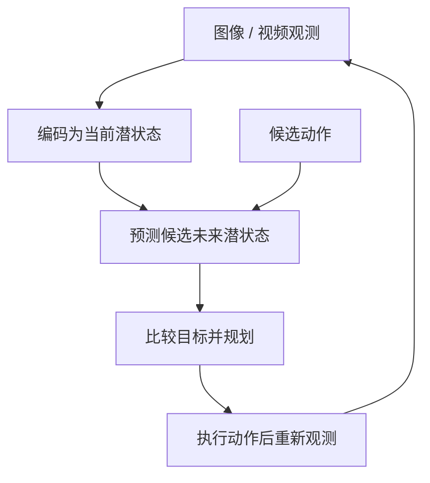

# JEPA, from language models to world models（VideoDB）

> 来源归档（blog / VideoDB Labs）

- **标题：** JEPA, from language models to world models
- **类型：** blog / technical essay
- **作者：** Sankalp Nagaonkar、Ashutosh Trivedi（页面署名）；文末引用格式列 S. Nagaonkar
- **发布：** 2026-07-07
- **原文：** <https://www.videodb.io/blog/jepa-from-language-models-to-world-models>
- **入库日期：** 2026-10-06
- **一句话说明：** 从 next-token prediction 与 latent prediction 的差异出发，讨论 JEPA 如何与视频表征、动作条件世界模型、分层规划连接；属于观点型技术长文，核心实验证据应回到各篇论文。
- **归档说明：** 此处是结构化摘要和来源映射，不复制原文全文；文章中的预测、观点和论文实验结果分开记录。

## 文章脉络

文章把两类学习目标作对照：语言模型根据上下文预测下一个 token；JEPA 类方法让上下文表征预测另一个视图、缺失区域或未来状态的目标表征。文章进一步提出，面向具身系统时，还需要预测“给定动作会发生什么”，并可用长短时域模型分层产生子目标。

这不是 JEPA 所有模型都具备的能力。V-JEPA 2.1 主要是视频表征学习，VL-JEPA 主要做视觉到文本语义嵌入预测；动作条件动力学与闭环规划要看 LeWorldModel、HWM 等具体系统。

## 关键观点与核对边界

| 主题 | 文章观点 | 一手来源及边界 |
|------|----------|----------------|
| 预测目标 | JEPA 在 latent space 预测目标表征，不以逐像素重建为必要目标 | 通用框架描述；不能据此推断每个 JEPA 都是可控世界模型 |
| 表征坍塌 | 目标编码器、stop-gradient、EMA、方差/分布正则等约束用于避免无信息的常量表征 | LeJEPA 的 SIGReg 是具体方法之一，不代表 JEPA 唯一解法 |
| 行动后果 | 若要支持控制，未来表征应以动作作为条件 | LeWorldModel 与 HWM 是文中讨论的具体例子；视觉表征本身不自动带来 agency |
| 长时程规划 | 用高层时域预测给出 latent subgoal，低层规划器追踪子目标，可缓解单层长 rollout 的误差和搜索成本 | HWM 在特定 Franka、Push-T 与 maze 设定下报告提升，不等于普遍真机成功保证 |
| 潜空间风险 | 过度压缩、忽略控制相关变量、错误的距离几何、训练分布之外的动作都会让规划失效 | 属于文章归纳的开放问题；需要在目标机器人、动作空间和任务上验证 |

## 对机器人学习的阅读结论

- **先分清三层：** 表征预测、动作条件状态转移、在预测模型中搜索/执行动作。它们不是同一个能力。
- **检查是否可控：** 观察论文的 predictor 是否接收动作、动作是否覆盖实际部署范围、评测是否闭环执行，以及模型误差是否影响任务完成。
- **看分层规划的实证范围：** HWM 的真实机械臂实验使用 Franka，并以单张目标图像作目标输入；其他任务包括 Push-T 和迷宫仿真。不要将论文数字直接外推到人形机器人。
- **语言的角色：** 文章主张语言可以作为指令和解释接口，状态预测与规划则可由视觉/动作潜变量承载；这是架构观点，不是已被统一架构验证的结论。

## 引用论文与站内节点

文章引用了 8 篇论文。已有站内详情页的工作直接复用；缺失的工作在本次一并建立独立页面，保持论文与文章节点不重复。

| 引用 | 工作 | 站内状态 |
|------|------|----------|
| [1] | [Semantic Tube Prediction](../../wiki/entities/paper-semantic-tube-prediction.md) | 本次新建 |
| [2] | [When Does LeJEPA Learn a World Model?](../../wiki/entities/paper-when-does-lejepa-learn-world-model.md) | 本次新建 |
| [3] | [LeJEPA](../../wiki/entities/paper-lejepa.md) | 已有详情页 |
| [4] | [V-JEPA 2.1](../../wiki/entities/paper-sa-2603-14482-v-jepa-2-1-unlocking-dense-features-in-video-sel.md) | 已有索引页 |
| [5] | [LeWorldModel](../../wiki/entities/paper-lewm.md) | 已有详情页 |
| [6] | [Hierarchical Planning with Latent World Models（HWM）](../../wiki/entities/paper-hwm-latent-world-model-planning.md) | 本次新建 |
| [7] | [From Tokens to Thoughts](../../wiki/entities/paper-from-tokens-to-thoughts.md) | 本次新建 |
| [8] | [VL-JEPA](../../wiki/entities/paper-vl-jepa.md) | 本次新建 |

## 对 wiki 的映射

- [VideoDB 长文实体页](../../wiki/entities/article-videodb-jepa-world-models.md)
- [LeJEPA](../../wiki/entities/paper-lejepa.md) 与 [LeWorldModel](../../wiki/entities/paper-lewm.md) 是站内已有详情页，本次不重复创建。
