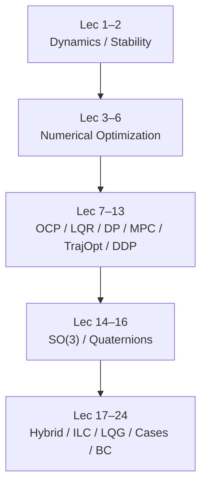

# Optimal Control 2025 — CMU 16-745（YouTube 播放列表）

> 来源归档（ingest）

- **标题：** Optimal Control 2025
- **类型：** course / video（完整学期录像播放列表）
- **课程代号：** CMU 16-745 — *Optimal Control and Reinforcement Learning*
- **主讲：** Zachary Manchester（Robotic Exploration Lab）
- **机构：** 卡内基梅隆大学机器人研究所（CMU RI）；录像发布频道标注 [MIT Robotic Exploration Lab](https://www.youtube.com/@roboticexplorationlab)
- **课程站：** <https://optimalcontrol.ri.cmu.edu/>
- **Lectures 页：** <https://optimalcontrol.ri.cmu.edu/lectures/>
- **链接：** <https://www.youtube.com/playlist?list=PLZnJoM76RM6IAJfMXd1PgGNXn3dxhkVgI>
- **Playlist ID：** `PLZnJoM76RM6IAJfMXd1PgGNXn3dxhkVgI`
- **学期：** Spring 2025（列表中 Lecture 8 / 13 标题标注 2024，为复用上年录像）
- **入库日期：** 2026-08-09
- **一句话说明：** Zac Manchester 主讲的 CMU 最优控制与强化学习公开录像全集（24 讲，约 **29.3 小时**）：从动力学与数值优化，经 Pontryagin / LQR / DP / 凸 MPC / TrajOpt / DDP，到旋转、混杂系统、ILC、LQG、步行案例、凸松弛火箭着陆、驾驶博弈与行为克隆。

## 为什么值得保留

- **运动控制 L3–L4 一手视频课**：与本库 [Optimal Control](../../wiki/concepts/optimal-control.md)、[LQR/iLQR](../../wiki/methods/lqr-ilqr.md)、[MPC](../../wiki/methods/model-predictive-control.md)、[Trajectory Optimization](../../wiki/methods/trajectory-optimization.md) 直接同构，比散落外链更适合作为完整学习入口。
- **官方材料三角齐全**：YouTube 录像 + 课程站 slides/notes + GitHub [`Optimal-Control-16-745`](https://github.com/Optimal-Control-16-745) 讲义 notebook（作业仓同组织）。
- **纠正历史误挂**：仓库旧笔记曾把本 playlist 误写成 Tedrake / MIT Underactuated；本条以 **CMU 16-745 / Manchester** 为准（Underactuated 仍见 [`mit_underactuated_kalman_lqr.md`](./mit_underactuated_kalman_lqr.md)）。

## 抓取与字幕说明（入库日）

| 通道 | 结果 |
|------|------|
| **yt-dlp `--flat-playlist`** | 成功枚举 24 条：index / video id / duration / title |
| **yt-dlp 单视频元数据 / 字幕** | 本机 IP 触发 YouTube「Sign in to confirm you’re not a bot」；未抽字幕全文 |
| **oEmbed** | 可用：频道名 `MIT Robotic Exploration Lab`，Lecture 1 标题核验通过 |
| **课程站 Lectures 页** | **权威目录来源**：各讲 video 链均带本 playlist；notebook 链至 `Optimal-Control-16-745/lecture-notebooks` |
| **结论** | 本条以 **播放列表目录 + 课程站大纲** 归纳；非字幕转写。后续可按讲回填章节时间戳 |

## 播放列表目录（2026-08-09 检索）

| # | 标题（YouTube） | 时长（约） | Video ID |
|---|-----------------|-----------|----------|
| 1 | Lecture 1: Intro and Dynamics Review | 1:15:47 | `SvAYJC7jug8` |
| 2 | Lecture 2: Equilibria, Stability, and Discrete-Time Dynamics | 1:13:36 | `_Swoo8n7DFM` |
| 3 | Lecture 3: Optimization Pt. 1 | 1:16:09 | `f7yF0KOV-sI` |
| 4 | Lecture 4: Optimization Pt. 2 | 1:14:44 | `lIuPIlDxLNU` |
| 5 | Lecture 5: Optimization Pt. 3 | 1:18:41 | `bsBXk17rff4` |
| 6 | Lecture 6: Regularization, Merit Functions, and Control History | 1:17:27 | `8N10U68kS5M` |
| 7 | Lecture 7: Deterministic Optimal Control and Pontryagin | 1:10:40 | `ZoLmQB6C7WU` |
| 8 | Lecture 8: The Linear Quadratic Regulator Three Ways（标题标注 2024） | 1:15:40 | `9_je9YOKtew` |
| 9 | Lecture 9: Controllability and Dynamic Programming | 1:21:27 | `RtGsW12LRjk` |
| 10 | Lecture 10: Convex Model-Predictive Control | 1:15:56 | `J7lh-uF3wlY` |
| 11 | Lecture 11: Nonlinear Trajectory Optimization | 1:16:58 | `ERGKQ2ieYW8` |
| 12 | Lecture 12: Differential Dynamic Programming | 1:03:55 | `JFiIZ8Iwj6Y` |
| 13 | Lecture 13: Direct Trajectory Optimization（标题标注 2024） | 1:17:35 | `8VZ0MZ_JpgE` |
| 14 | Lecture 14: Intro to 3D Rotations | 1:17:42 | `x5DJ8yh-674` |
| 15 | Lecture 15: Optimizing Rotations | 1:09:11 | `bR6xadliH-c` |
| 16 | Lecture 16: LQR with Quaternions and Quadrotors | 1:05:22 | `1sKMUrS4Mvk` |
| 17 | Lecture 17: Hybrid Systems and Legged Robots | 1:12:41 | `QLyXkH4Jx1I` |
| 18 | Lecture 18: Iterative Learning Control | 1:11:38 | `vbW5G5GydDU` |
| 19 | Lecture 19: Stochastic Optimal Control and LQG | 1:02:00 | `FDZcYgEz5Qo` |
| 20 | Lecture 20: How to Walk | 1:01:01 | `6mLonLAOpps` |
| 21 | Lecture 21: Kalman Filters and Duality | 1:17:59 | `1g43SBF8BTI` |
| 22 | Lecture 22: Convex Relaxation and Landing Rockets | 1:14:40 | `RWffWQ2NtCA` |
| 23 | Lecture 23: Autonomous Driving and Game Theory | 1:12:10 | `avbwgAsjAn8` |
| 24 | Lecture 24: Data-Driven Control and Behavior Cloning | 1:16:10 | `fnajY4Ip13w` |

**合计：** 24 讲，约 **29 h 19 min**（105 549 s）。

## 主题模块（按课程站 + 播放列表）

| 模块 | 讲次 | 核心主题 | Wiki 映射 |
|------|------|----------|-----------|
| Dynamics | 1–2 | 连续/离散动力学、平衡点与稳定性 | [optimal-control](../../wiki/concepts/optimal-control.md) |
| Optimization | 3–6 | 无约束/约束优化、正则与 merit、控制史 | [numerical-optimization-curriculum](../../wiki/entities/numerical-optimization-curriculum.md)、[constrained-optimization](../../wiki/concepts/constrained-optimization.md) |
| Classical OCP | 7–9 | Pontryagin、LQR 三视角、可控性与 DP | [lqr](../../wiki/formalizations/lqr.md)、[lqr-ilqr](../../wiki/methods/lqr-ilqr.md)、[bellman-equation](../../wiki/formalizations/bellman-equation.md) |
| Online / Offline Traj | 10–13 | 凸 MPC、非线性 TrajOpt、DDP、直接法/配点 | [model-predictive-control](../../wiki/methods/model-predictive-control.md)、[trajectory-optimization](../../wiki/methods/trajectory-optimization.md) |
| Attitude | 14–16 | 三维旋转、姿态优化、四元数 LQR / 四旋翼 | [lqr](../../wiki/formalizations/lqr.md) |
| Special + Cases | 17–24 | 混杂/足式、ILC、LQG、步行、KF 对偶、凸松弛着陆、驾驶博弈、行为克隆 | [robot-control-paradigm-receding-horizon-ilc](../../wiki/overview/robot-control-paradigm-receding-horizon-ilc.md)、[kalman-filter](../../wiki/formalizations/kalman-filter.md)、[convex-relaxation-robotics](../../wiki/methods/convex-relaxation-robotics.md)、[imitation-learning](../../wiki/methods/imitation-learning.md)、[locomotion](../../wiki/tasks/locomotion.md) |

## 配套材料（开源核查）

| 项 | 状态（截至入库日） |
|----|-------------------|
| **课程站** | 已开源访问：大纲、lectures、background、日历 |
| **YouTube 播放列表** | 已公开 24 讲 |
| **讲义 notebook** | [`Optimal-Control-16-745/lecture-notebooks`](https://github.com/Optimal-Control-16-745/lecture-notebooks)（课程站按讲链接；另有 2021–2024 年度仓） |
| **作业分发** | 同 GitHub org（学生作业仓多为私有/课内）；公开 notebook 可复现算法演示 |
| **结论** | **已开源（教材侧）**：录像 + notebook + 课程站；非单一「论文项目页」，详见 [`sources/repos/optimal_control_16_745.md`](../repos/optimal_control_16_745.md) |

## 对 wiki 的映射

- [`wiki/entities/cmu-optimal-control-curriculum.md`](../../wiki/entities/cmu-optimal-control-curriculum.md) — **父节点**（本播放列表策展）
- [`wiki/concepts/optimal-control.md`](../../wiki/concepts/optimal-control.md)
- [`wiki/methods/lqr-ilqr.md`](../../wiki/methods/lqr-ilqr.md)
- [`wiki/methods/model-predictive-control.md`](../../wiki/methods/model-predictive-control.md)
- [`wiki/methods/trajectory-optimization.md`](../../wiki/methods/trajectory-optimization.md)
- [`wiki/entities/numerical-optimization-curriculum.md`](../../wiki/entities/numerical-optimization-curriculum.md)
- [`roadmap/motion-control.md`](../../roadmap/motion-control.md) — L3 控制基础入口
- 课程站归档：[`sources/sites/cmu_optimal_control_16_745.md`](../sites/cmu_optimal_control_16_745.md)
- 代码组织归档：[`sources/repos/optimal_control_16_745.md`](../repos/optimal_control_16_745.md)
- 旧资源树（部分讲笔记）：[`resources/theory/Optimal Control (CMU 16-745) 2025/`](../../resources/theory/Optimal%20Control%20(CMU%2016-745)%202025/)

## 推荐继续阅读（外部）

- [CMU 16-745 课程主页](https://optimalcontrol.ri.cmu.edu/)
- [2025 Lectures](https://optimalcontrol.ri.cmu.edu/lectures/)
- [YouTube: Optimal Control 2025](https://www.youtube.com/playlist?list=PLZnJoM76RM6IAJfMXd1PgGNXn3dxhkVgI)
- [Optimal-Control-16-745（GitHub org）](https://github.com/Optimal-Control-16-745)
- [Background 预习材料](https://optimalcontrol.ri.cmu.edu/background/)（线代 / 线性系统 / Nocedal–Wright / Boyd）
