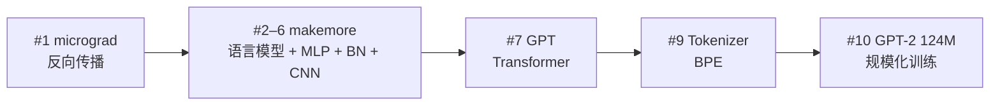

# Neural Networks: Zero to Hero — Andrej Karpathy（YouTube 播放列表）

> 来源归档

- **标题：** Neural Networks: Zero to Hero
- **类型：** course / video
- **讲师：** Andrej Karpathy — <https://karpathy.ai/zero-to-hero.html>
- **链接：** <https://www.youtube.com/playlist?list=PLAqhIrjkxbuWI23v9cThsA9GvCAUhRvKZ>
- **Playlist ID：** `PLAqhIrjkxbuWI23v9cThsA9GvCAUhRvKZ`
- **配套仓库：** <https://github.com/karpathy/nn-zero-to-hero>
- **入库日期：** 2026-07-12
- **一句话说明：** 从 **micrograd 手推反向传播** 到 **makemore 语言建模**、MLP/BatchNorm/WaveNet，再到 **从零写 GPT、BPE 分词器、复现 GPT-2（124M）** 的免费视频课；10 集共约 **19.4 小时**，边讲边写 PyTorch，是机器人研究者补 Transformer/GPT 实现直觉的 **技术轨** 标杆。

## 为什么值得保留

- **VLA / 策略网络前置课**：以语言建模为主线教 **张量、autograd、训练环、Transformer**——技能可直接迁移到 [VLA](../../wiki/methods/vla.md) 动作头与 [Transformer](../../wiki/concepts/transformer.md) 骨干（见 [`roadmap/depth-vla.md`](../../roadmap/depth-vla.md) Stage 0）。
- **与 Raschka 书/课互补**：Zero to Hero 偏 **视频驱动、手搓最小实现**；[LLMs-from-scratch（Raschka）](../../wiki/entities/llms-from-scratch-raschka.md) 偏 **结构化教材 + 完整训练环**——可按习惯二选一或交叉。
- **配套代码三角**：每讲对应 [`nn-zero-to-hero`](../repos/nn-zero-to-hero.md) 内 notebook，并链到 **micrograd / makemore / minbpe / nanoGPT** 等独立 pet project 仓库。

## 播放列表目录（2026-07-12 检索）

| # | 标题 | 时长（约） | Video ID | 配套代码 |
|---|------|-----------|----------|----------|
| 1 | The spelled-out intro to neural networks and backpropagation: building micrograd | 2 h 26 min | `VMj-3S1tku0` | [micrograd](https://github.com/karpathy/micrograd) |
| 2 | The spelled-out intro to language modeling: building makemore | 1 h 58 min | `PaCmpygFfXo` | [makemore](https://github.com/karpathy/makemore) |
| 3 | Building makemore Part 2: MLP | 1 h 16 min | `TCH_1BHY58I` | makemore |
| 4 | Building makemore Part 3: Activations & Gradients, BatchNorm | 1 h 56 min | `P6sfmUTpUmc` | makemore |
| 5 | Building makemore Part 4: Becoming a Backprop Ninja | 1 h 55 min | `q8SA3rM6ckI` | makemore（手推 BP 练习） |
| 6 | Building makemore Part 5: Building a WaveNet | 56 min | `t3YJ5hKiMQ0` | makemore（树状 CNN / WaveNet 直觉） |
| 7 | Let's build GPT: from scratch, in code, spelled out. | 1 h 56 min | `kCc8FmEb1nY` | [nanoGPT](https://github.com/karpathy/nanoGPT) |
| 8 | State of GPT \| BRK216HFS | 43 min | `bZQun8Y4L2A` | 演讲（非编码课） |
| 9 | Let's build the GPT Tokenizer | 2 h 14 min | `zduSFxRajkE` | [minBPE](https://github.com/karpathy/minbpe) |
| 10 | Let's reproduce GPT-2 (124M) | 4 h 1 min | `l8pRSuU81PU` | nanoGPT / [llm.c](https://github.com/karpathy/llm.c) |

**合计：** 约 19 h 24 min（#1–#7 + #9–#10 为编码主线；#8 为 GPT 栈背景演讲）。

## 学习路径（讲者设计意图）

- **#1**：标量 autograd → 理解 `loss.backward()` 在算什么。
- **#2–6**：bigram → MLP → 诊断激活/梯度 → **手推整图 BP** → WaveNet 式层次 CNN。
- **#7–10**：Attention is All You Need 路线 → 分词 → 124M 级预训练复现。

## 对 wiki 的映射

- [`wiki/entities/andrej-karpathy.md`](../../wiki/entities/andrej-karpathy.md)
- [`wiki/concepts/backpropagation.md`](../../wiki/concepts/backpropagation.md)
- [`wiki/concepts/transformer.md`](../../wiki/concepts/transformer.md)
- [`wiki/concepts/deep-learning-foundations.md`](../../wiki/concepts/deep-learning-foundations.md)
- [`wiki/entities/llms-from-scratch-raschka.md`](../../wiki/entities/llms-from-scratch-raschka.md)
- [`roadmap/depth-vla.md`](../../roadmap/depth-vla.md) — Stage 0 可选技术轨前置
- 配套仓：[`sources/repos/nn-zero-to-hero.md`](../repos/nn-zero-to-hero.md)

## 推荐继续阅读（外部）

- [karpathy.ai/zero-to-hero.html](https://karpathy.ai/zero-to-hero.html) — 官方课程页
- [nn-zero-to-hero（GitHub）](https://github.com/karpathy/nn-zero-to-hero) — 各讲 notebook 归档
- [Build a Large Language Model (From Scratch) — Raschka](https://github.com/rasbt/LLMs-from-scratch) — 结构化教材路线
