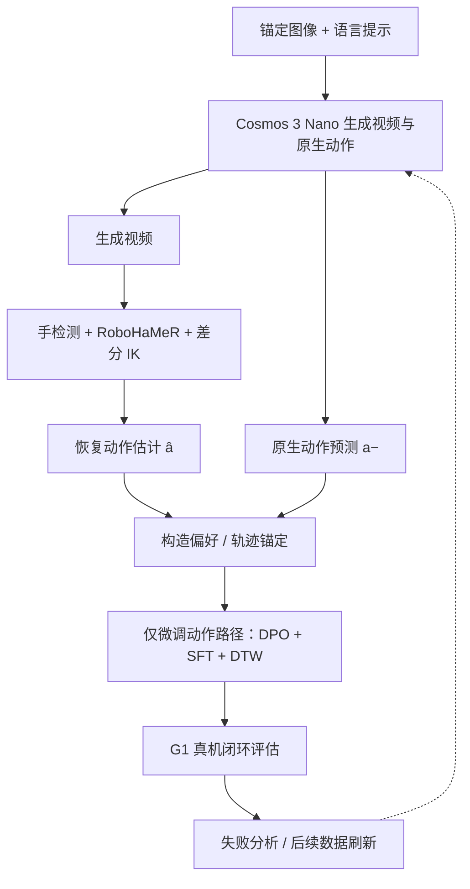
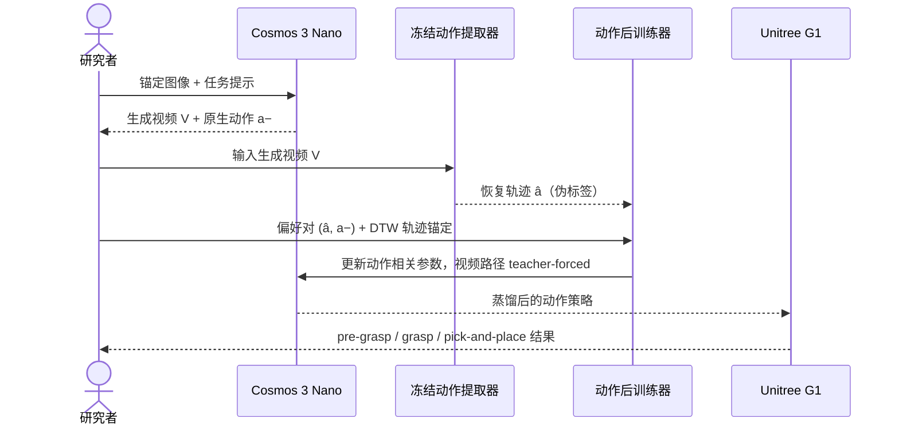

# AutodidactWAM: Cross-Modal Self-Distillation from Generated Video to Robot Actions (arXiv:2610.08119)

> 来源归档（ingest）

- **标题：** AutodidactWAM: Cross-Modal Self-Distillation from Generated Video to Robot Actions
- **类型：** paper / world-action model / humanoid loco-manipulation
- **arXiv：** <https://arxiv.org/abs/2610.08119>（PDF：<https://arxiv.org/pdf/2610.08119>；HTML：<https://arxiv.org/html/2610.08119>）
- **作者：** Sergei Kurchev, Iaroslav Kolomiets, Miguel Altamirano Cabrera, Artem Lykov, Dzmitry Tsetserukou
- **机构：** Skolkovo Institute of Science and Technology（Skoltech）；MWS R&D Center
- **投稿状态：** arXiv 预印本；论文注明 submitted to ICRA 2027（非已接收）
- **版本 / 日期：** v1，2026-10-06
- **官方项目页 / 代码：** arXiv 记录未列出项目页或代码仓库；本归档不推定其不存在
- **一句话说明：** 让 humanoid world-action model 从自身生成的视频中提取手部运动伪标签，用这些伪标签校正原生动作分支；在 Unitree G1 + BrainCo 五指手的单臂桌面 Oreo 拾取放置任务上，以生成视频、冻结动作提取器与小规模真机试验验证跨模态自蒸馏可行性。

## 摘要级要点

- **问题：** 视频生成看起来合理，不代表同一模型输出的动作能让机器人执行。作者观察到视频分支预测的接触和抓取视觉上可信，但动作分支存在系统性目标偏差。
- **核心做法：** 用模型生成的视频作为其动作分支的跨模态监督来源：冻结手部检测、RoboHaMeR 手姿估计与差分逆运动学（IK），从生成视频恢复动作轨迹估计，再与原生动作预测构造偏好对。
- **训练：** 视频路径 teacher-forced 并保持冻结，只微调动作相关张量 / LoRA；比较 SFT 重标注和 Diffusion-DPO，混合 DPO + SFT + DTW 轨迹锚定在所试设置中效果最好。
- **关键边界：** “自蒸馏阶段无新增任务专用遥操作”不等于整个系统零遥操作：初始 G1 embodiment 适配使用了作者的混合遥操作语料。
- **真机范围：** G1 右臂与五指手、桌面单任务；训练对象 Oreo 包装，另用粉色抗压玩具和蓝球作 held-out 物体；每对象 / 条件 N=20 的 pilot。
- **重要结果：** 原生动作基线在 Oreo 上的完整拾取放置约 10%（抽取器重放约 75%，但它不是蒸馏策略）；DPO+SFT+DTW 蒸馏策略完整任务约 20%，held-out 粉色玩具约 30%，蓝球约 10%。不要把“抽取器重放”成功率误当作训练后策略成功率。
- **局限：** 伪标签继承视觉生成伪影和提取器域偏差；仅一个任务与训练对象、单臂配置和小样本 pilot，不能据此声称通用 humanoid 操纵泛化。

## 方法要点（按论文）

1. **Embodiment adaptation：** 将 Cosmos 3 Nano 通过 LoRA 适配到 Unitree G1 与 BrainCo 五指手；以混合 G1 遥操作数据完成初始动作空间适配。
2. **合成场景与视频生成：** 从少量 G1 手部桌面锚帧、Oreo 包装图像与不同物体放置组成场景，并用语言模型生成 / 改写任务提示，采样视频与模型原生动作。
3. **动作恢复：** 冻结检测器与 RoboHaMeR 从生成帧估计手部姿态，结合差分 IK 得到动作估计 â。动作估计器用约 30k 合成渲染样本训练，不使用 teleoperation ground-truth 标签进行这一步的蒸馏目标构造。
4. **偏好构造：** 将恢复轨迹 â 视为相对偏好的动作候选，将同一视频生成过程的原生动作预测视为较差候选；这属于由冻结提取器定义的偏好，不是独立真值。
5. **动作专属后训练：** 冻结 / teacher-force 视频路径，更新动作侧参数。论文比较预训练、提取轨迹、SFT、Flow-DPO 与 DPO+SFT+DTW；DTW 项为 Cartesian 轨迹锚定。
6. **闭环验证：** 将动作模型部署到真实 G1，测 pre-grasp、grasp 与 full pick-and-place。论文强调离线偏好验证准确率高并不保证闭环成功；单独 Flow-DPO 的真机完整任务成功率为 0。

### 训练与部署的概念流程

### 一次自蒸馏迭代中的角色

## 真机结果摘要

以下是论文 pilot 表格的成功比例；每个对象 / 条件 N=20，因此单次结果变化 5 个百分点。抽取器轨迹是上游生成的可执行动作估计，不是策略训练方法。

| 条件 | Oreo 训练对象：pre-grasp / grasp / 完整任务 | 粉色玩具：完整任务 | 蓝球：完整任务 |
|---|---:|---:|---:|
| 预训练原生动作 | 20% / 10% / 0% | 10% | 10% |
| 提取动作估计（重放） | 95% / 80% / 75% | 30% | 20% |
| SFT | 70% / 15% / 10% | 20% | 10% |
| Flow-DPO | 0% / 0% / 0% | 0% | 0% |
| DPO + SFT + DTW | 90% / 30% / 20% | 30% | 10% |

表格中的验证是单任务、小样本真机 pilot，不是统计充分的泛化结论。作者还报告预训练模型在全部三对象上的平均完整任务成功率约 7%；此汇总与表内各对象取整比例的平均口径略有差别，应保留作者原文口径并避免过度精确解读。

## 解释与工程启示

- **视频–动作一致性需要可执行检查：** 视频分支与动作头会出现模态内不一致；视觉逼真度不能代替真实机器人闭环测量。
- **伪标签质量成为瓶颈：** 视觉提取器既提供规模化监督，也定义了“偏好”的偏差。接触遮挡、手部重建误差或生成视频的物理伪影都会传入动作目标。
- **约束动作更新以保留视频能力：** 冻结并 teacher-force 视频路径，减少自蒸馏对已有视频生成行为的扰动。
- **偏好优化需有轨迹锚点：** 论文中单独 Flow-DPO 离线验证指标并未转化为真机成功；混合 SFT 与 DTW 轨迹约束的结果更稳，但仍有显著任务 / 对象差异。
- **适用前提：** 需要先有可生成目标 embodiment 视频与动作的模型，以及适配该 embodiment 的遥操作数据；方法减少的是蒸馏阶段新增任务专属演示需求。

## 局限与待验证项

- 单一训练任务 / Oreo 物体，单臂桌面环境；held-out 物体仍是相近的抓取放置流程。
- 每个对象 / 条件仅 20 次，结果粒度粗，随机波动可能较大。
- 自举目标依赖手部检测、RoboHaMeR 与差分 IK；域偏差、遮挡和生成伪影可能形成 reward hacking。
- 尚未验证跨任务、跨机器人、跨手部形态或更广对象类别迁移。
- 论文没有提供项目页或代码仓库链接；复现细节以论文描述为限。

## 参考来源

- Kurchev et al., [AutodidactWAM（arXiv:2610.08119）](https://arxiv.org/abs/2610.08119) — 摘要、方法、实验与局限。
- [arXiv HTML 全文](https://arxiv.org/html/2610.08119) — 可检索全文。

## 关联页面

- [Cosmos 3](./cosmos-3.md) — 作为视频 / 动作生成骨干的相关平台实体
- [World Action Models](../concepts/world-action-models.md) — 视频预测与动作控制的联合建模
- [Manipulation](../tasks/manipulation.md) — 论文真机任务背景
- [Sim2Real](../concepts/sim2real.md) — 从模型输出到真实机器人闭环的验证边界
