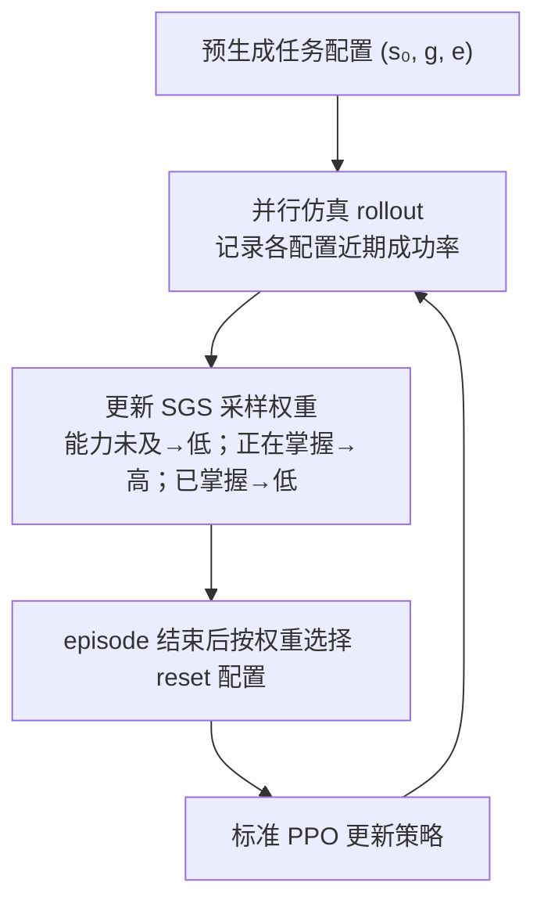

# A Balanced Data Diet: Addressing the Exploration Bottleneck in Mega-Scale RL for Robot Control

> 来源归档（ingest · arXiv v1）

- **类型：** paper / reinforcement learning / robot locomotion / contact-rich manipulation / sim-to-real
- **版本：** arXiv:2610.12465v1，2026-10-08
- **作者：** Octi Zhang, Mateo Guaman Castro, Patrick Yin, Ignacio Dagnino, Abhishek Gupta, Rosario Scalise, Byron Boots
- **单位：** University of Washington；NVIDIA（官网作者脚注）
- **会议：** CoRL 2026（arXiv comments 与项目页均标注 CoRL 2026）
- **论文：** [arXiv abstract](https://arxiv.org/abs/2610.12465) · [HTML](https://arxiv.org/html/2610.12465v1) · [PDF](https://arxiv.org/pdf/2610.12465v1)
- **项目页：** [SGS](https://sgs-rl.github.io/)
- **代码状态：** 项目页标为 **Code (coming soon)**；截至 2026-10-10 未提供官方仓库 URL，故不登记为已开源。
- **入库日期：** 2026-10-10
- **一句话说明：** Success-Guided Sampling（SGS）不改 PPO 更新本身，而根据每个任务配置近期成功率自适应调整 reset 采样权重，把大规模并行仿真中的训练预算集中到当前策略“正在学、但尚未掌握”的难度区域。

## 摘要与主要贡献

论文指出：大量并行环境并不自动带来更多有效学习信号。若对任务配置均匀采样，训练会持续抽到策略早已掌握的简单配置，以及当前能力下几乎不可能成功的极难配置。SGS 根据策略在配置上的成功率动态调度采样，让模拟 RL 批次更多落在能力边界附近。

作者在最高 $2^{20}$（超过一百万）并行环境下评测复杂四足多地形 locomotion 与接触丰富装配；进一步把 manipulation policy 蒸馏为 RGB 输入策略，在真实硬件上零样本迁移。具体硬件视频、平台型号和各任务细节以项目页及论文正文为准。

## 方法摘录

1. **保留普通 PPO。** policy、rollout、transition buffer 与 PPO 更新流程维持标准做法；改变的是 episode 结束后的任务配置 reset 分布。
2. **离线固定配置集合。** 预先生成大量任务配置。项目页将配置定义为三元组 $ (s_0,g,e) $：机器人初始状态、目标、环境（例如地形或场景布局）。
3. **按成功率调整采样。** 每个配置维护近期成功历史；失败率很高时权重低，策略开始取得进展但尚未稳定成功时权重上升，掌握后再下降。它不是简单地只抽“失败案例”，而是强调可学的能力前沿。
4. **任务覆盖。** 项目页展示 ANYmal C/D 多地形 locomotion；UR5e / Franka 的 nut-on-bolt、rod-in-hole、gear-mesh、BNC / waterproof connector 等装配任务。装配配置混合 reaching、stable-grasp、near-goal 等 reset 策略。
5. **视觉 sim-to-real。** 训练在仿真进行；manipulation policy 蒸馏为 RGB-based policy 后在真实 UR5e 上执行。项目页展示 nut、rod、gear mesh 等演示。

### 训练采样逻辑

## 关键实验与评测

官网给出的多地形 locomotion（ANYmal D）成功率，均为三种子均值 ± 95% 置信区间：

| 并行环境数 | SGS | PLR | Uniform | Linear curriculum |
|---:|---:|---:|---:|---:|
| 4K | 0.46 ± 0.02 | 0.00 ± 0.00 | 0.00 ± 0.00 | 0.00 ± 0.00 |
| 32K | 0.49 ± 0.11 | 0.13 ± 0.01 | 0.42 ± 0.04 | 0.32 ± 0.03 |
| 256K | 0.72 ± 0.05 | 0.55 ± 0.14 | 0.00 ± 0.00 | 0.00 ± 0.00 |
| 1M | 0.73 ± 0.01 | 0.54 ± 0.13 | 0.00 ± 0.00 | 0.00 ± 0.00 |

官网给出的 Franka nut-and-bolt manipulation 成功率：

| 并行环境数 | SGS | PLR | Uniform |
|---:|---:|---:|---:|
| 4K | 0.00 ± 0.01 | 0.00 ± 0.00 | 0.00 ± 0.00 |
| 32K | 0.06 ± 0.01 | 0.00 ± 0.00 | 0.00 ± 0.00 |
| 256K | 0.10 ± 0.14 | 0.02 ± 0.04 | 0.01 ± 0.04 |
| 1M | 0.70 ± 0.19 | 0.05 ± 0.11 | 0.06 ± 0.13 |

注意：项目页明确列出的是 Franka nut-and-bolt 的规模结果；不能把该表误读成所有装配任务的统一成功率。论文完整实验、配置与统计口径请以 arXiv 原文为准。

## 对 wiki 的映射

- SGS 单一项目实体：[paper-sgs-2610-12465.md](../../wiki/entities/paper-sgs-2610-12465.md)
- 官方项目页归档：[sgs-rl-github-io.md](../sites/sgs-rl-github-io.md)

## 原始入口

- arXiv:2610.12465v1：题名、作者、摘要、提交日期与论文正文。
- SGS 官方项目页：任务配置定义、采样机制图示、官网公开的成功率表、机器人与演示范围、代码发布状态。
