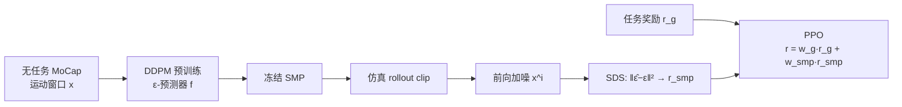

# SMP: Reusable Score-Matching Motion Priors for Physics-Based Character Control（arXiv:2512.03028）

> 来源归档（ingest · 论文摘录）

- **标题：** SMP: Reusable Score-Matching Motion Priors for Physics-Based Character Control
- **类型：** paper / physics-based character control / motion prior / diffusion / reinforcement learning
- **arXiv abs：** <https://arxiv.org/abs/2512.03028>
- **arXiv HTML（v3）：** <https://arxiv.org/html/2512.03028v3>
- **PDF：** <https://arxiv.org/pdf/2512.03028>
- **项目页：** <https://yxmu.foo/smp-page/>
- **演示视频：** <https://youtu.be/jBA2tWk6vzU>
- **官方代码：** [xbpeng/MimicKit](https://github.com/xbpeng/MimicKit)（`docs/README_SMP.md`）
- **期刊标注：** ACM TOG（预印本阶段以 arXiv 为主）
- **入库日期：** 2026-04-28（初版）；2026-05-27（扩写完整摘录）
- **一句话说明：** 在无任务耦合的 MoCap 上预训练**运动扩散模型**并冻结，用 **SDS** 把 ε-预测误差变成可复用的 **SMP 奖励**；下游 RL **不再需要原始数据集**，并可经 **风格条件 / 组合** 派生百种风格先验，质量对标 **AMP** 类对抗模仿。

## 作者与机构（以 arXiv v3 为准）

Yuxuan Mu、Ziyu Zhang、Yi Shi、Dun Yang（Simon Fraser University）；Minami Matsumoto、Kotaro Imamura、Michael Taylor（Sony Interactive Entertainment）；Guy Tevet（Stanford）；Chuan Guo（Snap）；Chang Shu、Pengcheng Xi（National Research Council Canada）；**Xue Bin Peng**（SFU / NVIDIA）。

## 摘要级要点

- **问题：** 对抗式运动先验（如 [AMP](amp.md)）通常与**每个新策略联合训练**判别器，且下游任务往往要**长期保留参考 MoCap**；先验的**模块化**与**跨任务复用**受限。
- **主张：** 理想先验应 **Modular**（独立的质量目标，策略训练期不依赖原始数据）且 **Reusable**（冻结后可用于多任务、多策略，无需再训先验）。
- **方法：** **Score-Matching Motion Priors (SMP)** — 先在无任务数据上训练 **motion diffusion**，冻结后用 **Score Distillation Sampling (SDS)** 将策略 rollout 的 motion clip 与参考分布对齐；配合 **ESM**、**GSI** 等设计稳定 PPO。
- **结果：** 仿真人形多任务上运动质量**可比 SOTA 对抗模仿**；大规模 **100 风格** 通用先验可 **prompt / guidance** 为风格专用先验，并可 **组合** 出数据集中不存在的新风格；附录含 **Unitree G1** 真机部署。

## 与 AMP / 跟踪 / 扩散规划的定位

| 路线 | 机制 | 数据在 RL 阶段 | 典型局限 |
|------|------|----------------|----------|
| **DeepMimic 类跟踪** | 逐帧模仿参考 clip | 需要 clip / 重定向 | 难偏离参考完成新任务 |
| **AMP / GAIL** | 判别器匹配分布 | 常需 expert + policy 对抗更新 | 每换策略常重训先验；需留数据集 |
| **扩散作 planner** | 生成目标轨迹 + 低级跟踪 | 规划器与控制器分层 | 非「可插拔奖励模块」 |
| **SMP（本文）** | 冻结扩散 + SDS 奖励 | **可完全丢弃** MoCap | 预训练与 RL 两阶段；先验算力大于 AMP |

## 方法管线（三阶段）

1. **先验预训练：** 在长度 \(H\) 的 motion clip \(\mathbf{x}=(\mathbf{s}_{t-H+2},\ldots,\mathbf{s}_{t+1})\) 上训练 DDPM（simple loss \(\|\epsilon - f(\mathbf{x}^i)\|^2\)）。
2. **冻结复用：** 策略训练时**不再更新** \(f\)，也**无需读取**原始 MoCap。
3. **策略优化：** 将 SDS 误差映射为 \([0,1]\) 奖励，与任务奖励加权组合（论文默认**加性**；工程复现可见乘性变体，见 [smp_suz_tsinghua.md](../repos/smp_suz_tsinghua.md)）。

## 核心机制摘录

### SMP 奖励（Eq. 7）

对策略产生的 clip 加噪得 \(\mathbf{x}^i\)，冻结网络预测 \(\hat{\epsilon}=f(\mathbf{x}^i)\)：

\[
r^{\mathrm{smp}} = \exp\left(- w_s \|\hat{\epsilon} - \epsilon\|_2^2 \right)
\]

- 与原始 SDS 损失同形，但用 **exp** 压到 RL 友好区间（作者报告比裸 SDS 更稳）。
- 不要求逐帧复现某条参考，而是匹配**分布特征**（与 AMP 同属 distribution matching，但无对抗训练）。

### Ensemble Score-Matching（ESM，§5.1）

- **动机：** 单随机扩散 timestep \(i\) 会使 \(r^{\mathrm{smp}}\) **方差极大**（高噪声时 ε 易预测 → 误差小但信息量低；低噪声时敏感抖动）。
- **做法：** 在固定集合 \(\mathbb{K}=\{22,15,8\}\) 上聚合 SDS（论文实验默认；高噪声侧重 OOD 纠正，低噪声细化细节）。
- **效果：** 降低 value / advantage 估计噪声，训练更稳。

### Generative State Initialization（GSI，§5.2）

- **对比 RSI：** 从数据集随机抽参考帧初始化，仍依赖保留 MoCap。
- **GSI：** 用**冻结 prior 采样** motion window，末帧作仿真初态；探索更贴近自然流形，且**无需**原始数据集。
- 可与**组合风格先验**联用，为新风格策略提供高质量初态。

### 风格先验与组合（§8 等）

- 在 **100 类风格** 大规模数据上训练**条件扩散** → 单一通用 SMP。
- **Repurpose：** 通过 style label / guidance **无需重训权重** 即得风格专用静止奖励模型。
- **Composition：** 混合不同风格先验（论文示例：如 “Airplane” + “HighKnees” → 新滑稽步态；或 “GracefulArms” + locomotion prior → 带手臂姿态的行走）。
- 数据集中**不存在**的行为风格也可通过组合先验探索出来。

## 模型与训练实现要点（§6–7）

| 模块 | 要点 |
|------|------|
| **Motion 表示** | 根位置/旋转（6D 旋转）、关节、末端等；clip 为固定窗口特征 |
| **扩散实现** | DDPM + ε-预测；与 score-based 多噪声级思想一致 |
| **策略** | MLP actor-critic；观测含历史；PPO |
| **总奖励** | \(r_t = w_g r_t^g + w^{\mathrm{smp}} r_t^{\mathrm{smp}}\)（任务与先验**加性**，权重需调） |
| **算力对比（作者报告）** | 同采样量约 **600M samples：SMP ~11.5h vs AMP ~6.2h**（SMP 先验模型更大，含 100 风格） |

## 评测任务（§7–8，仿真人形）

- **速度跟踪 / 步态：** 目标速度约 \([1.2, 6.8]\,\mathrm{m/s}\)，可涌现走/跑切换。
- **转向 / 对准后前进：** 学习对准再 jog、侧向步态等。
- **落点 / 路径：** 跟踪空间目标（含 dodge、跳跃等**未在参考库出现**的技能，Figure 5）。
- **足球_striker、搬运 (Object Carry)、起身 (Getup)**：SMP 与任务奖励组合；Table 3 报告 carry / getup 指标。
- **单 clip 模仿 benchmark（§8.6）：** 无 \(r^g\) 时与 AMP / ASE 等对比。
- **与 AMP 对比（§8.1 等）：** 多任务上 **normalized return** 与运动质量相当；纯任务奖励（\(w^g=1\)）基线明显更不自然。

## 机器人部署（§11 / Fig. 11）

- **Unitree G1** 人形：在仿真训练的控制器经适配后上真机，复现自然 locomotion 类行为（细节与 sim2real 修改见论文 **Robotic Deployment** 与附录）。
- 知识库工程向复现另见：[smp_suz_tsinghua.md](../repos/smp_suz_tsinghua.md) → [SMP on G1（mjlab）](../../wiki/entities/smp-g1-mjlab.md)。

## 局限与讨论（索引级）

- **两阶段成本：** 需先训扩散先验，再 RL；单任务 wall-clock 常高于 AMP。
- **奖励调参：** \(w^{\mathrm{smp}}\)、SDS 归一化、\(\mathbb{K}\) 选择仍影响稳定性（附录含消融）。
- **与 SMILING 等：** 本文强调 **task-agnostic** 先验 + **冻结** + **ESM/GSI**，而非每任务重训扩散控制器。

## 对 wiki 的映射

| 主题 | 目标页面 |
|------|----------|
| 方法归纳 | [wiki/methods/smp.md](../../wiki/methods/smp.md) |
| MimicKit 官方实现 | [wiki/entities/mimickit.md](../../wiki/entities/mimickit.md) |
| G1 + mjlab 课程复现 | [wiki/entities/smp-g1-mjlab.md](../../wiki/entities/smp-g1-mjlab.md) |
| AMP 对照 | [wiki/methods/amp-reward.md](../../wiki/methods/amp-reward.md)、[wiki/entities/amp-mjlab.md](../../wiki/entities/amp-mjlab.md) |
| 先验变体选型 | [wiki/comparisons/amp-add-smp-motion-prior-variants.md](../../wiki/comparisons/amp-add-smp-motion-prior-variants.md) |
| AMP 综述策展（03/19） | [wiki/methods/smp.md](../../wiki/methods/smp.md) |
| 人形 AMP 总览 | [wiki/overview/humanoid-amp-motion-prior-survey.md](../../wiki/overview/humanoid-amp-motion-prior-survey.md) |
| 方法选型 query | [wiki/queries/humanoid-motion-tracking-method-selection.md](../../wiki/queries/humanoid-motion-tracking-method-selection.md) |

## 参考来源（原始）

- arXiv:2512.03028v3 HTML / PDF（本文摘录编译自摘要、§1–8 及方法公式）
- 项目页与 MimicKit 仓库 README_SMP
- 微信公众号 AMP 专题策展：[humanoid_amp_survey_03_smp_reusable_score_matching_motion_priors_for_ph.md](humanoid_amp_survey_03_smp_reusable_score_matching_motion_priors_for_ph.md)
