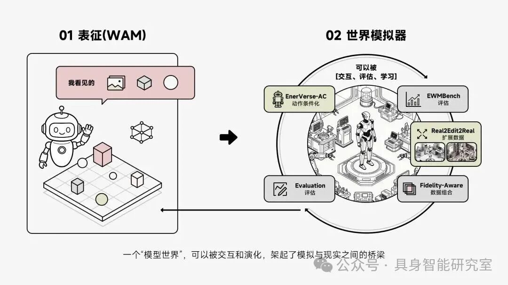
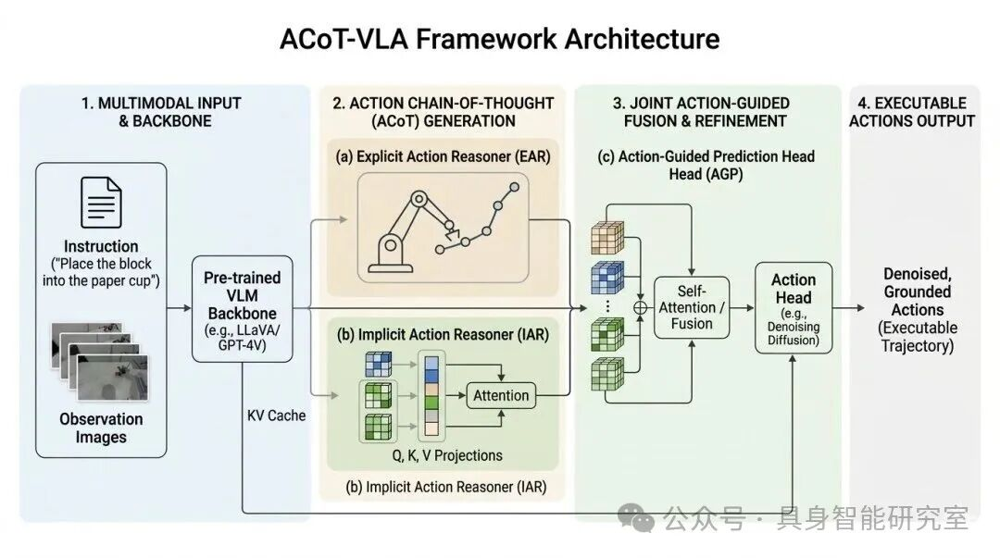
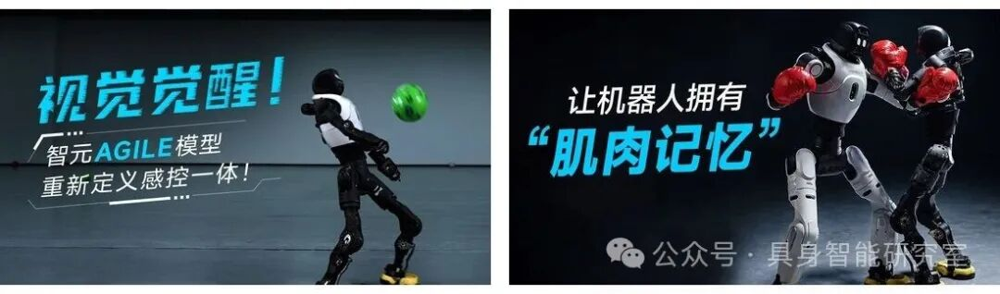

# 智元这轮发布怎么看？五个开源项目和两个能力底座，正在把机器人落地链路拆开

读者交流入口

添加作者备注「具身求职帮帮群 / 运动控制算法交流群」。

|  |  |
| --- | --- |
| 作者微信 作者微信 | Haley 商务合作 Haley 商务合作 |

项目地图

|  |  |
| --- | --- |
| 数据入口 | AGIBOT WORLD 2026 |
| 仿真训练与评测 | Genie Sim 3.0 |
| 世界模型 | GE-Sim 2.0 |
| 语义到动作执行 | GO-2 |
| 运动小脑 | BFM-2 |
| 感控闭环 | AGILE |
| 应用编排与交付 | Genie Studio Agent |

项目 01

## AGIBOT WORLD 2026：数据入口

真实场景、多模态采集、模仿学习数据

AGIBOT WORLD 2026 ：**机器人学习用的数据，到底离真实世界有多近？**

**🔗 AGIBOT WORLD 2026 项目链接：** https://agibot-world.com https://huggingface.co/datasets/agibot-world/AgiBotWorld2026

智元说这个数据集基于 **100% 真实环境采集**，覆盖商业空间、酒店餐饮、家居、安防、工业物流等场景。真实场景并不干净，会有遮挡、杂乱、光照变化、动态干扰，也会有大量非标准操作。机器人以后真要进现场，这些因素很难绕开。

**AGIBOT WORLD 2026 真实场景数据采集示例。**

数据采集本身包含的不止视频。AGIBOT WORLD 2026 使用智元新一代精灵G2机器人，结合 **Swift Picker 夹爪、OmniHand 五指灵巧手、多视角 RGB(D)、触觉、LiDAR、IMU、全身关节状态和力传感器** 等多模态数据。

这里还有 **全身控制、超视距遥操作、力控采集**。这会让数据里留下更完整的执行痕迹：手臂怎么动，身体怎么参与，接触发生在哪里，力反馈怎么变化，失败之后又怎么调整。

对机器人训练来说，错误和修正有时比干净成功样本更接近真实能力。

第一期开源主题是 **模仿学习**。智元也提到自由采集范式，采集员可以根据真实场景灵活设计操作流程，减少固定脚本带来的僵硬感。真实任务没有标准考卷，机器人以后也不会总是在标准答案里工作。

所以 AGIBOT WORLD 2026 这件事，数据不能只看越多越好，也要能反映真实部署里的物理过程。

项目 02

## Genie Sim 3.0：仿真训练与评测

把场景生成接到训练、评测和在线微调

Genie Sim 3.0 处理的是另一个现实问题：真机训练很贵，也慢。每一次试错都可能带来设备损耗、现场调试成本和安全风险。

**🔗 Genie Sim 3.0 项目链接：** https://agibot-world.com/genie-sim https://github.com/AgibotTech/genie\_sim

它的核心能力是 **自然语言或图片生成三维世界**。用户可以用一句话或一张图生成可交互、可漫游、可训练的三维场景，还能输出 RGB、深度、激光雷达等多模态数据。

**Genie Sim 3.0 的自然语言生成三维场景能力。**

我觉得这里真正要看的，是它有没有进入训练和评测流程。Genie Sim 3.0 提供 Genie Sim Benchmark，把机器人核心能力拆成五类：**指令跟随、空间理解、操作执行、扰动适应、Sim2Real 迁移**。

材料里还写到，它支持 RLinf 强化学习框架，并提供并行仿真、标准 Gym 接口和在线微调能力。也就是说，Genie Sim 3.0 想把 **训练、评测、后训练** 连到同一个平台里。

仿真平台的价值，最后要落到能不能减少真机试错。

材料提到相同模型在仿真环境与真实世界评测差异小于 10%。这个指标很关键，但我会等更多任务验证。Sim2Real 一直是机器人仿真的硬问题，单次结果不能替代长期稳定性。

项目 03

## Genie Envisioner 2.0：世界模型

让模型世界能响应动作并进入训练闭环

Genie Envisioner World Simulator 2.0，也就是 GE-Sim 2.0，讲的是世界模型。它和 Genie Sim 3.0 相关，但关注点更靠近模型本身。

**🔗 Genie Envisioner World Simulator 2.0 项目链接：** https://ge-sim-v2.github.io/

智元把世界模型拆成两条线：一条是 **世界动作模型**，关注动作如何改变世界；一条是 **世界模拟器**，关注能不能构建可交互、可推演、可训练的环境。

**从世界动作模型到世界模拟器，智元把世界模型推向可交互训练环境。**

GE-Sim 2.0 强调 **动作条件世界建模**。机器人做出动作之后，模型世界要根据动作生成后续环境变化。材料还提到分钟级长时序推演、多视角 3D 一致性、本体状态建模，以及接近实时运行。

它还有一个比较重要的设计：内置 **通用奖励模型**，可以基于文本对生成状态进行自动评估和优化。这个方向会把世界模型从未来画面预测，往训练闭环继续推进。

材料里的 **Eval in WM、RL in WM、Teleoperation in WM**，分别对应在世界模型里评测、强化学习和遥操作。这个设想很强，但要求也高。世界模型需要同时处理动作响应、物理一致性、语义稳定和长时序可靠性。

我现在对 GE-Sim 2.0 的态度会偏谨慎。它指向一个机器人训练场，但训练场能不能替代足够多的真实交互，后面还要看迁移效果。

项目 04 ·

## GO-2： 执行基座

把语义规划转成更接近可执行的动作序列

GO-2 是这组发布里最像基座模型的项目。它关心机器人理解一句话之后，怎样把任务继续执行下去。

**🔗 GO-2 相关论文与项目链接：** https://arxiv.org/abs/2601.11404 https://libra-vla.github.io/

材料里把这个问题叫语义-运动鸿沟。机器人可能知道杯子在哪里，也知道要靠近、抓取、放置。真机执行时，视觉偏差、轨迹漂移、接触不稳、物体滑落，都会把任务打断。

GO-2 的核心设计是 **动作思维链** 和 **异步双系统**。动作思维链把推理过程放进动作空间，先生成结构化动作序列，让规划更接近可执行形式。异步双系统把低频规划和高频执行分开，慢系统生成高层动作意图，快系统根据视觉观测持续对齐、修正和执行。

**GO-2 中动作思维链与执行头的整体架构。**

材料里还提到 GO-2 在 LIBERO、LIBERO-Plus、VLABench 和 Genie Sim 3.0 Benchmark 等多个基准上取得领先结果。在 Genie Sim 3.0 的 Sim-to-Real 评测中，只用仿真数据训练后，真实环境平均成功率达到 **82.9%**，高于 π0.5 的 **77.5%**。

我觉得 GO-2 值得看，是因为它把可执行性放进了模型设计里。

机器人落地经常卡在规划到动作之间的接口。GO-2 正是在处理这一段。

项目 05

## BFM-2： 运动小脑

关注动作之间的过渡和动态闭环

BFM-2 的重点在运动控制。公开视频标题把它称为下一代小脑，让机器人拥有肌肉记忆。简介里提到它是 **二阶段 Motion-Between 运控基座模型**，可以在静态、预设动作或随机输入等状态下，自主完成高稳定性的动作插值和动态任务闭环。

**🔗 BFM-2 运控基座模型视频：** https://www.bilibili.com/video/BV1ZzGe6oEmk/

这里没有公开字幕，所以我只能基于标题和简介判断，不能过度展开。BFM-2 对应的是具身智能里的运动底座。

很多人形机器人系统会把高层规划写得很完整，但身体层面仍然容易出问题。动作之间怎么衔接，随机输入状态下怎么保持稳定，动态任务中怎么形成连续闭环，这些更像小脑要解决的事。

BFM-2 让我关注的一点，是它强调 **不同状态之间的稳定过渡**。单个动作做出来当然重要，但机器人真正运行时，经常难在动作和动作之间。

项目 06 ·

## AGILE：感控闭环

让视觉继续往下进入控制过程

AGILE 的视频标题是视觉觉醒，强调感控一体。公开视频简介里提到，智元发布 AGILE 感控一体模型，让灵犀 X2 通过视觉觉醒能力实现感知与控制融合。

**🔗 AGILE 感控一体模型视频：** https://www.bilibili.com/video/BV1SmGD6xEPS/

这里也没有公开字幕，所以我只基于标题和简介做保守判断。AGILE 关心的是视觉如何进入控制闭环。

**AGILE 感控一体模型与 BFM-2 运控基座模型的视频封面。**

机器人看到东西只是第一步。看见之后，控制策略能不能及时变化，能不能根据视觉反馈调整身体和末端动作，这些会直接影响真实任务里的连续执行。

如果 BFM-2 更偏运动小脑，AGILE 更接近 **眼睛到身体之间的闭环接口**。这个接口打通之后，机器人对环境变化的反应才会更自然一些。

项目 07 ·

## Genie Studio Agent：应用交付

把机器人能力封装成可编排、可部署流程

Genie Studio Agent 是最偏产业化的项目。它关心的是机器人能力如何被企业用户配置、部署、运行和维护。

**🔗 Genie Studio Agent 发布文章：** https://mp.weixin.qq.com/s/Ha9\_0TLyVtec-cL4WqFAbA

它把视觉感知、运动控制、导航规划、VLA、强化学习工具链等能力封装成模块，通过零代码或低代码方式编排机器人作业流程。这个项目没有单个模型那么显眼，但我觉得它离现场很近。

工业现场常见的问题是，demo 能跑，复制很难。今天这个工位可以，明天换一个料架、一个物体、一个节拍，流程就要重新调。部署前能不能仿真预演，上线后能不能持续监控，异常之后能不能断点恢复，这些决定了机器人能不能被当作生产工具使用。

材料里提到半导体封测 Tray 盘上下料、汽车零部件安全带卷收器上料等案例。更值得看的地方，是平台里放进了 **任务编排、仿真验证、视觉感知、运动控制、强化学习优化、异常恢复和集群监管**。

Genie Studio Agent 解决的其实是交付问题：机器人能力怎样从实验演示变成可复用流程。

这层如果做得足够稳，机器人应用对高度定制项目的依赖会下降，类似场景之间也更容易复制。

## 最后简单总结一下

把这些项目拆开看，会更清楚一些。

|  |  |
| --- | --- |
| AGIBOT WORLD 2026 | 处理真实数据入口 |
| Genie Sim 3.0 | 处理仿真、训练和评测 |
| GE-Sim 2.0 | 把世界模型推向可交互训练环境 |
| GO-2 | 处理语义规划到动作执行的接口 |
| BFM-2 / AGILE | 分别补运动控制、视觉控制闭环 |
| Genie Studio Agent | 把能力往应用编排和工程交付上推 |

智元这次发布就是几个底层模块一起往前推。数据、仿真、世界模型、VLA、运控、部署工具，每一层虽然都还没有完全闭合，但方向已经比较清楚，后续需要继续优化和完善。

单个 demo 很容易让人兴奋。底座建设慢一些，也更难立刻讲清楚。
