# 重磅整理！161篇论文带你看人形机器人移动操作的十个方向和技术版图全景

本文系统地将 161 篇人形机器人移动操作论文分为十个大类。

1. **运控基座与通用全身跟踪：**底层身体控制、运动跟踪、抗扰动与通用动作执行。
2. **上半身中心控制与移动操作接口：**手臂、躯干、根部和末端执行器之间的协同控制。
3. **视觉感知驱动的人形移动操作：**用视觉完成目标定位、场景理解和操作闭环。
4. **生成式运动、语言控制与轨迹规划：**从语言、目标或条件输入生成全身动作和轨迹。
5. **动捕、人类视频与交互动作规划：**把人类动作数据转成机器人可用的运动和交互先验。
6. **任务型移动操作与接触闭环：**面向开门、推物、搬运、触碰等具体接触任务。
7. **数据采集与遥操作系统：**解决人形机器人训练数据如何高效采集。
8. **硬件平台、感知配置与部署扩展：**关注机器人本体、传感器和真实部署系统。
9. **人形 VLA、世界模型与通用操作：**把视觉、语言、动作和世界建模接到人形机器人执行层。
10. **从人类第一视角视频学习：**利用人类 egocentric 视频学习操作经验和行为先验。

我更想按人形机器人能力形成的顺序来整理：先看运控的底层身体怎么稳住，再看全身控制怎么接上移动操作；然后看视觉、语言、轨迹生成和人类示范怎么进入系统；再往后，是数据采集、硬件部署，以及 VLA 和世界模型这些更上层的通用能力。

## 01运控基座与通用全身跟踪

这一组对应人形机器人的身体底座：动作重定向、运动跟踪、通用全身控制、抗扰恢复和行为基座模型

### 001 Agility Meets Stability｜具有异构数据的多样化人形控制

📌 论文基本信息

📝 **原文题目：** Agility Meets Stability: Versatile Humanoid Control with Heterogeneous Data

🏫 **机构：** The University of Hong Kong、NVIDIA、Tsinghua University

🔗 **项目链接：** https://opendrivelab.com/AMS/

📅 **发表日期：** 2026年3月3日

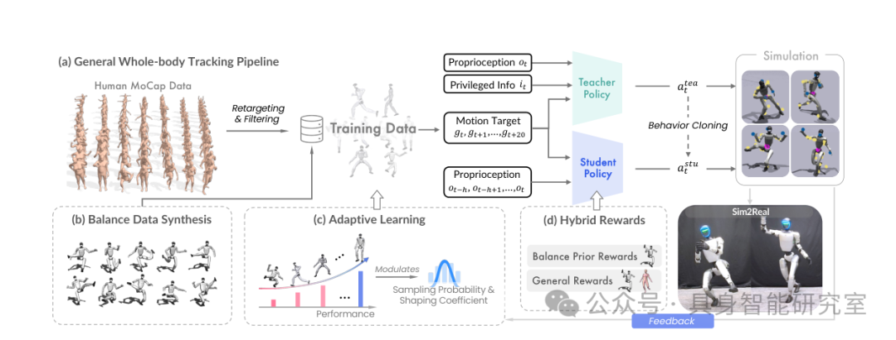

**算法实现总结：**Agility Meets Stability 把本体状态与关节序列、人类视频/动捕轨迹、仿真交互数据转成可跟踪的身体目标，并通过异构动捕与合成平衡数据、混合奖励与动态采样、分层技能/专家策略训练或组合全身策略，最终输出全身轨迹/动作序列、低层控制器目标。关键点是把敏捷动捕和合成平衡样本放进同一策略，但用混合奖励分别约束动作跟踪与极端平衡。

### 002 Any2Any｜用于人形全身跟踪的高效跨实体传输

📌 论文基本信息

📝 **原文题目：** Any2Any: Efficient Cross-Embodiment Transfer for Humanoid Whole-Body Tracking

🔗 **项目链接：** https://any2any.top/

📅 **发表日期：** 2026年6月18日

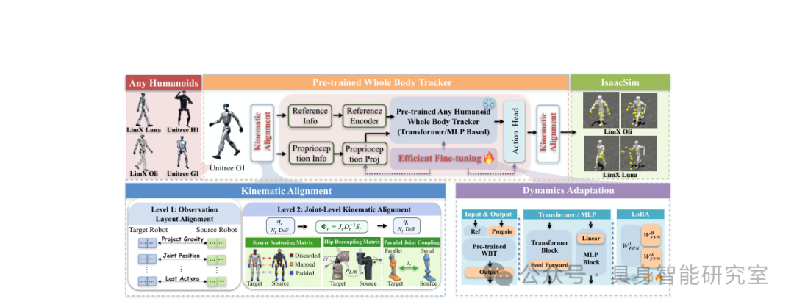

**算法实现总结：**Any2Any 把视觉、状态和动作数据转成可跟踪的身体目标，并通过源/目标机器人运动学对齐、PEFT 动力学适配、全身控制器/WBC/MPC训练或组合全身策略，最终输出全身轨迹/动作序列、低层控制器目标。关键点是先对齐源/目标机器人的状态和动作空间，再只微调动力学敏感模块，尽量保留原策略的运动先验。

### 003 BFM-Zero｜使用无监督强化学习的人形控制的即时行为基础模型

📌 论文基本信息

📝 **原文题目：** BFM-Zero: A Promptable Behavioral Foundation Model for Humanoid Control Using Unsupervised Reinforcement Learning

🏫 **机构：** Carnegie Mellon University、Meta、aWork done during internships at Carnegie Mellon University. The authors are now with Tsinghua University

🔗 **项目链接：** https://lecar-lab.github.io/BFM-Zero/

📅 **发表日期：** 2025年11月6日

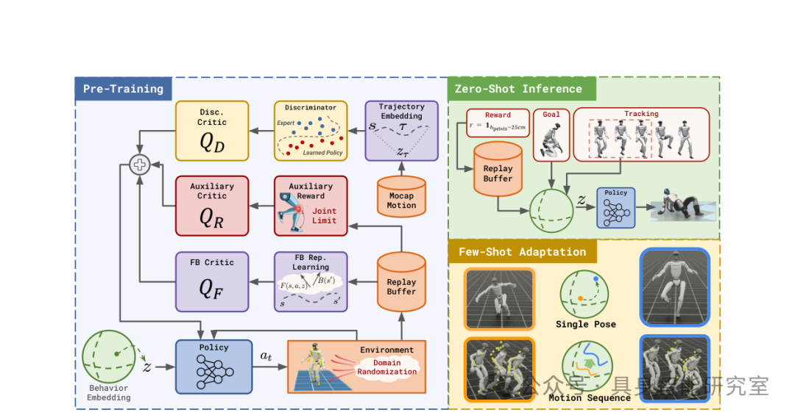

**算法实现总结：**BFM-Zero 把本体状态与关节序列、仿真交互数据、接触力/触觉信号转成可跟踪的身体目标，并通过PPO/RL 策略训练、分层技能/专家策略、闭环纠错/人类干预训练或组合全身策略，最终输出全身轨迹/动作序列、低层控制器目标。关键点是把任务拆成可路由的技能或专家策略，再用高层模块在执行中选择和组合。

### 004 BeyondMimic｜从运动跟踪到通过引导扩散的多样化人形控制

📌 论文基本信息

📝 **原文题目：** BeyondMimic: From Motion Tracking to Versatile Humanoid Control via Guided Diffusion

🏫 **机构：** University of California, Berkeley, CA , USA、Stanford University, Stanford, CA , USA

🔗 **项目链接：** https://github.com/unitreerobotics/unitree\_rl\_lab

📅 **发表日期：** 2025年11月13日

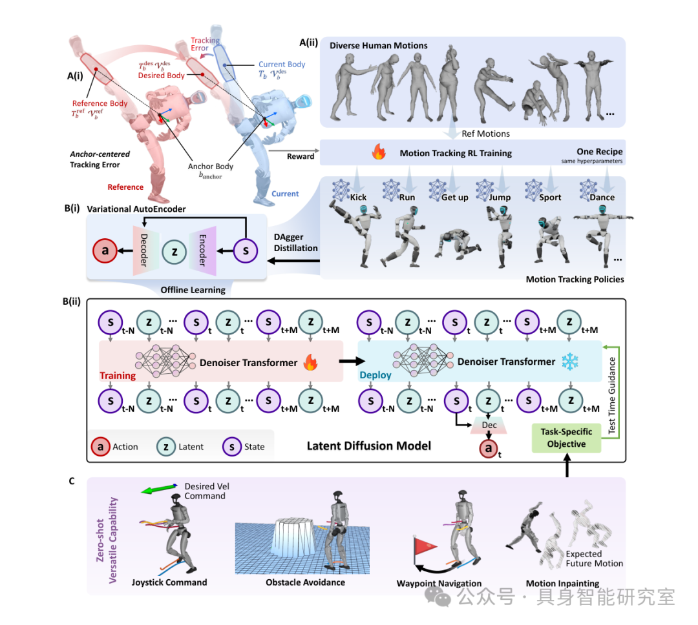

**算法实现总结：**BeyondMimic 把人类视频/动捕轨迹转成可跟踪的身体目标，并通过ACT/行为克隆模仿学习、扩散策略/流匹配、分层技能/专家策略训练或组合全身策略，最终输出全身轨迹/动作序列、低层控制器目标。关键点是把动作生成看成条件生成问题，用扩散或流匹配在多模态动作分布里采样可执行轨迹。

### 005 CHIP｜通过事后扰动实现人形控制的自适应合规性

📌 论文基本信息

📝 **原文题目：** CHIP: Adaptive Compliance for Humanoid Control through Hindsight Perturbation

🏫 **机构：** NVIDIA、Stanford University

🔗 **项目链接：** https://nvlabs.github.io/CHIP/

📅 **发表日期：** 2026年2月9日

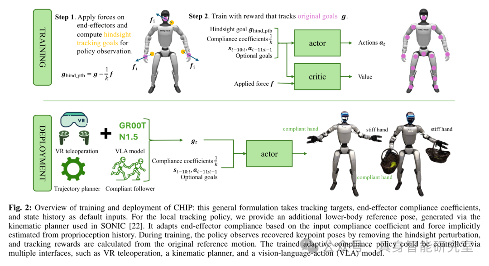

**算法实现总结：**CHIP 把本体状态与关节序列、接触力/触觉信号转成可跟踪的身体目标，并通过扩散策略/流匹配、分层技能/专家策略训练或组合全身策略，最终输出全身轨迹/动作序列、末端执行器/腕手目标、低层控制器目标。关键点是把动作生成看成条件生成问题，用扩散或流匹配在多模态动作分布里采样可执行轨迹。

### 006 CLONE｜用于长时程任务的闭环全身人形远程操作

📌 论文基本信息

📝 **原文题目：** CLONE: Closed-Loop Whole-Body Humanoid Teleoperation for Long-Horizon Tasks

🏫 **机构：** School of Computer Science and Technology, Beijing Institute of Technology、State Key Laboratory of General Artificial Intelligence, BIGAI、School of Psychological and Cognitive Sciences, Peking University、Institute for Artificial Intelligence, Peking University

🔗 **项目链接：** https://humanoid-clone.github.io/

📅 **发表日期：** 2025年8月30日

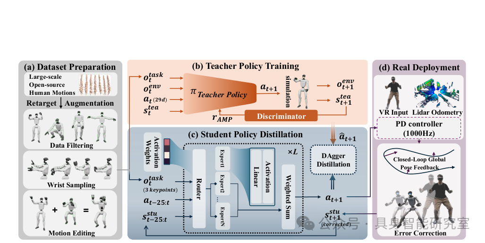

**算法实现总结：**CLONE 主要解决数据闭环：用遥操作/外骨骼数据采集人类操作和机器人状态，再通过分层技能/专家策略、闭环纠错/人类干预转成可训练、可复用的全身轨迹/动作序列、低层控制器目标。关键点是把任务拆成可路由的技能或专家策略，再用高层模块在执行中选择和组合。

### 007 ExBody2｜高级表现力人形全身控制

📌 论文基本信息

📝 **原文题目：** ExBody2: Advanced Expressive Humanoid Whole-Body Control

🏫 **机构：** UC San Diego、UC Berkeley、MIT

🔗 **项目链接：** https://exbody2.github.io

📅 **发表日期：** 2025年3月12日

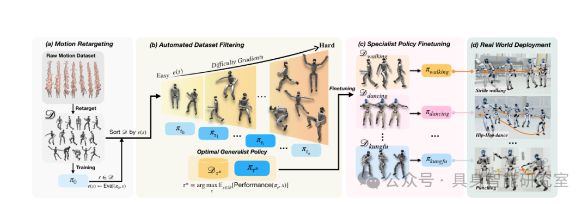

**算法实现总结：**ExBody2 把本体状态与关节序列、人类视频/动捕轨迹转成可跟踪的身体目标，并通过异构动捕与合成平衡数据、教师-学生知识迁移、IK/动作重定向训练或组合全身策略，最终输出全身轨迹/动作序列、低层控制器目标。关键点是用特权信息训练教师策略，再把能力蒸馏到只能使用部署观测的学生策略。

### 008 FRoM-W1｜通过语言指令实现通用人形全身控制

📌 论文基本信息

📝 **原文题目：** FRoM-W1: Towards General Humanoid Whole-Body Control with Language Instructions

🏫 **机构：** Fudan University、Shanghai Innovation Institute

🔗 **项目链接：** https://openmoss.github.io/FRoM-W1

📅 **发表日期：** 2026年1月19日

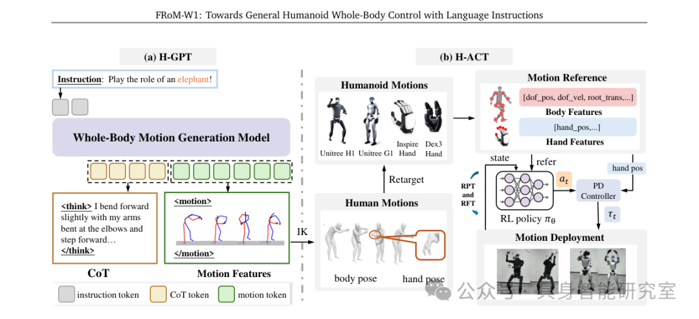

**算法实现总结：**FRoM-W1 把语言指令、本体状态与关节序列、仿真交互数据转成可跟踪的身体目标，并通过PPO/RL 策略训练、ACT/行为克隆模仿学习、VLM 语义规划/路由训练或组合全身策略，最终输出全身轨迹/动作序列、低层控制器目标。关键点是把示范轨迹压成可监督的动作预测问题，再通过动作 chunk 或闭环执行降低时序抖动。

### 009 GMT｜用于人形全身控制的通用运动跟踪

📌 论文基本信息

📝 **原文题目：** GMT: General Motion Tracking for Humanoid Whole-Body Control

🏫 **机构：** UC San Diego、Simon Fraser University

🔗 **项目链接：** https://gmt-humanoid.github.io

📅 **发表日期：** 2025年9月4日

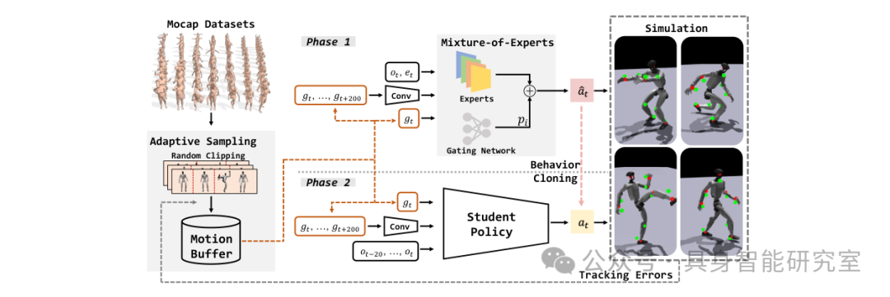

**算法实现总结：**GMT 把本体状态与关节序列、仿真交互数据转成可跟踪的身体目标，并通过扩散策略/流匹配、分层技能/专家策略训练或组合全身策略，最终输出全身轨迹/动作序列、低层控制器目标。关键点是把动作生成看成条件生成问题，用扩散或流匹配在多模态动作分布里采样可执行轨迹。

### 010 HOVER｜用于人形机器人的多样化神经全身控制器

📌 论文基本信息

📝 **原文题目：** HOVER: Versatile Neural Whole-Body Controller for Humanoid Robots

🔗 **项目链接：** https://hover-versatile-humanoid.github.io

📅 **发表日期：** 2025年3月6日

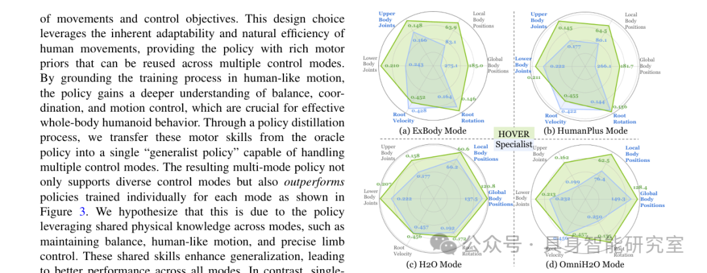

**算法实现总结：**HOVER 先从本体状态与关节序列恢复场景、目标或运动表征，再用教师-学生知识迁移、全身控制器/WBC/MPC、分层技能/专家策略生成全身轨迹/动作序列、低层控制器目标。关键点是用特权信息训练教师策略，再把能力蒸馏到只能使用部署观测的学生策略。

### 011 HoloMotion｜全身人形控制的基础模型

📌 论文基本信息

📝 **原文题目：** HoloMotion-1 Technical Report

🏫 **机构：** Horizon Robotics

🔗 **项目链接：** https://horizonrobotics.github.io/robot\_lab/holomotion

📅 **发表日期：** 2026年5月19日

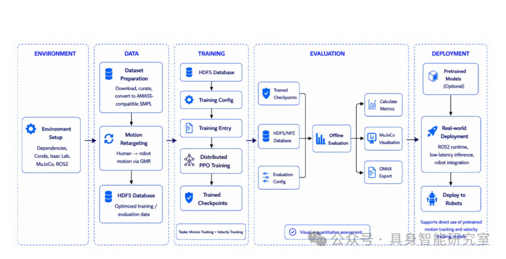

**算法实现总结：**HoloMotion 把人类视频/动捕轨迹转成可跟踪的身体目标，并通过异构动捕与合成平衡数据、扩散策略/流匹配、MM-DiT/Transformer 动作头训练或组合全身策略，最终输出全身轨迹/动作序列、低层控制器目标。关键点是把动作生成看成条件生成问题，用扩散或流匹配在多模态动作分布里采样可执行轨迹。

### 012 HumanPlus｜人形影子和模仿人类

📌 论文基本信息

📝 **原文题目：** HumanPlus: Humanoid Shadowing and Imitation from Humans

🏫 **机构：** HumanPlus: Humanoid Shadowing and Imitation、project co-leads、Stanford University

🔗 **项目链接：** https://humanoid-ai.github.io

📅 **发表日期：** 2024年6月15日

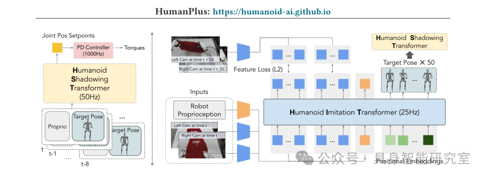

**算法实现总结：**HumanPlus 主要解决数据闭环：用相机图像/多视角观测、本体状态与关节序列、人类视频/动捕轨迹采集人类操作和机器人状态，再通过PPO/RL 策略训练、ACT/行为克隆模仿学习、分层技能/专家策略转成可训练、可复用的全身轨迹/动作序列、低层控制器目标。关键点是把任务拆成可路由的技能或专家策略，再用高层模块在执行中选择和组合。

### 013 KungfuBot2｜学习人形全身控制的多样化运动技能

📌 论文基本信息

📝 **原文题目：** KungfuBot2: Learning Versatile Motion Skills for Humanoid Whole-Body Control

🔗 **项目链接：** https://kungfubot2-humanoid.github.io

📅 **发表日期：** 2025年9月20日

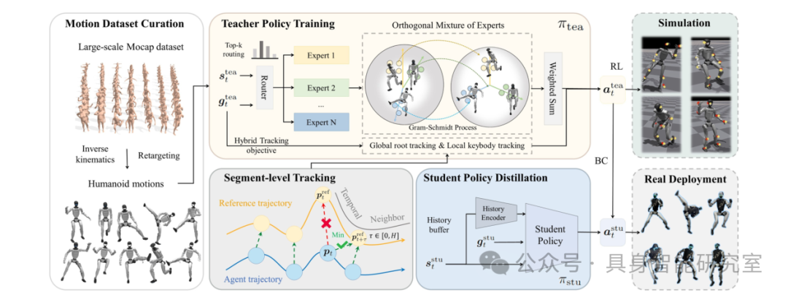

**算法实现总结：**KungfuBot2 把本体状态与关节序列、人类视频/动捕轨迹、仿真交互数据转成可跟踪的身体目标，并通过教师-学生知识迁移、ACT/行为克隆模仿学习、IK/动作重定向训练或组合全身策略，最终输出全身轨迹/动作序列、低层控制器目标。关键点是用特权信息训练教师策略，再把能力蒸馏到只能使用部署观测的学生策略。

### 014 MOSAIC｜通过快速残差适应，弥合通用人形运动跟踪和远程操作中的模拟与现实世界的差距

📌 论文基本信息

📝 **原文题目：** MOSAIC: Bridging the Sim-to-Real Gap in Generalist Humanoid Motion Tracking and Teleoperation with Rapid Residual Adaptation

🏫 **机构：** Technical University of Munich, Munich, Germany、Tsinghua University, Beijing, China、Nanjing University, Suzhou, China、IO-AI.TECH, Shenzhen, China

🔗 **项目链接：** https://baai-humanoid.github.io/MOSAIC/

📅 **发表日期：** 2026年2月11日

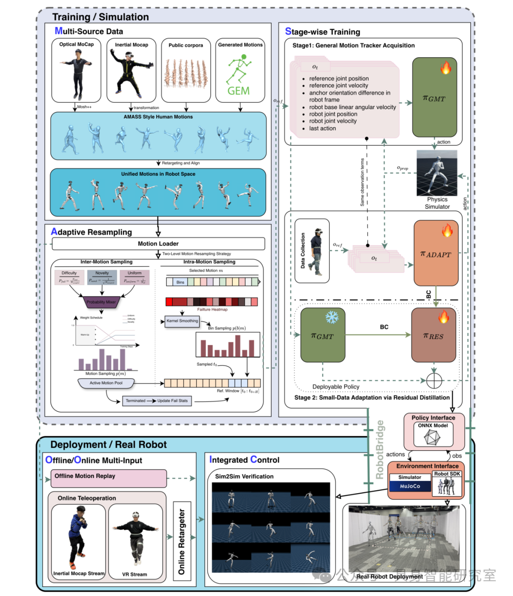

**算法实现总结：**MOSAIC 主要解决数据闭环：用本体状态与关节序列、遥操作/外骨骼数据、仿真交互数据采集人类操作和机器人状态，再通过扩散策略/流匹配转成可训练、可复用的全身轨迹/动作序列、低层控制器目标。关键点是把动作生成看成条件生成问题，用扩散或流匹配在多模态动作分布里采样可执行轨迹。

### 015 Make Tracking Easy｜用于人形全身控制的神经运动重定向

📌 论文基本信息

📝 **原文题目：** Make Tracking Easy: Neural Motion Retargeting for Humanoid Whole-body Control

🏫 **机构：** Nanjing University、Huawei Technologies

🔗 **项目链接：** https://nju3dv-humanoidgroup.github.io/nmr.github.io/

📅 **发表日期：** 2026年4月30日

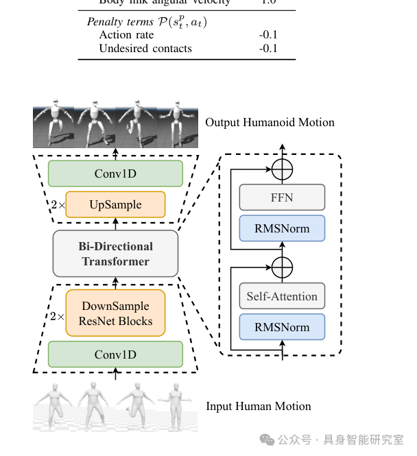

**算法实现总结：**Make Tracking Easy 把本体状态与关节序列、接触力/触觉信号转成可跟踪的身体目标，并通过PPO/RL 策略训练、ACT/行为克隆模仿学习、扩散策略/流匹配训练或组合全身策略，最终输出全身轨迹/动作序列、低层控制器目标、地形/场景表征。关键点是把动作生成看成条件生成问题，用扩散或流匹配在多模态动作分布里采样可执行轨迹。

### 016 OmniH2O｜通用灵巧的人对人全身远程操作和学习

📌 论文基本信息

📝 **原文题目：** OmniH2O: Universal and Dexterous Human-to- Humanoid Whole-Body Teleoperation and Learning

🏫 **机构：** Carnegie Mellon University、Shanghai Jiao Tong University

🔗 **项目链接：** https://anonymous-omni-h2o.github.io/

📅 **发表日期：** 2024年6月13日

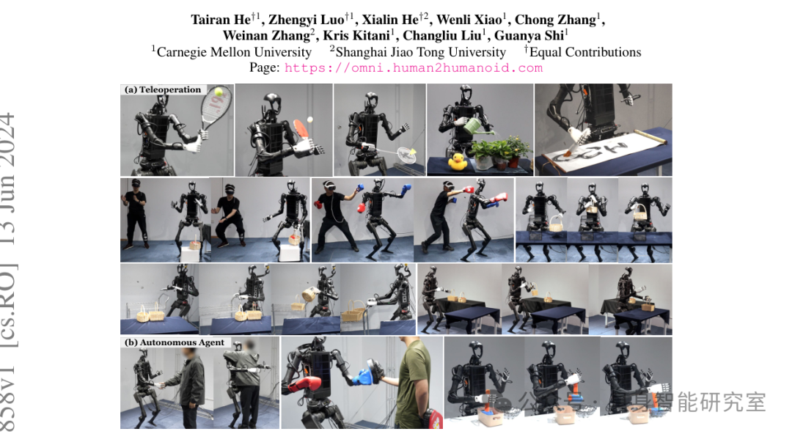

**算法实现总结：**OmniH2O 主要解决数据闭环：用语言指令、相机图像/多视角观测、人类视频/动捕轨迹采集人类操作和机器人状态，再通过教师-学生知识迁移、PPO/RL 策略训练、ACT/行为克隆模仿学习转成可训练、可复用的全身轨迹/动作序列、低层控制器目标。关键点是用特权信息训练教师策略，再把能力蒸馏到只能使用部署观测的学生策略。

### 017 OmniRetarget｜人形全身移动操作和场景交互的交互保存数据生成

📌 论文基本信息

📝 **原文题目：** OmniRetarget: Interaction-Preserving Data Generation for Humanoid Whole-Body Loco-Manipulation and Scene Interaction

🏫 **机构：** Amazon FAR (Frontier AI & Robotics)、MIT、UC Berkeley、Stanford University

🔗 **项目链接：** https://omniretarget.github.io

📅 **发表日期：** 2026年6月15日

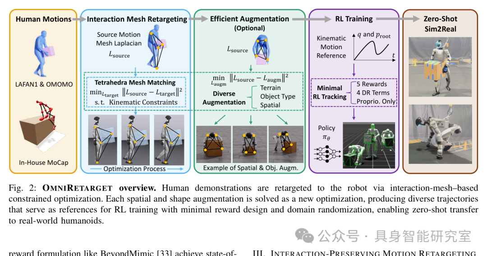

**算法实现总结：**OmniRetarget 先从本体状态与关节序列、人类视频/动捕轨迹、接触力/触觉信号恢复场景、目标或运动表征，再用PPO/RL 策略训练、ACT/行为克隆模仿学习、IK/动作重定向生成全身轨迹/动作序列、低层控制器目标、地形/场景表征。关键点是把任务拆成可路由的技能或专家策略，再用高层模块在执行中选择和组合。

### 018 Retargeting｜Matters 人形机器人的通用运动重定向

📌 论文基本信息

📝 **原文题目：** Retargeting Matters: General Motion Retargeting for Humanoid Motion Tracking

🏫 **机构：** Stanford University

🔗 **项目链接：** https://jaraujo98.github.io/retargeting\_matters

📅 **发表日期：** 2025年10月2日

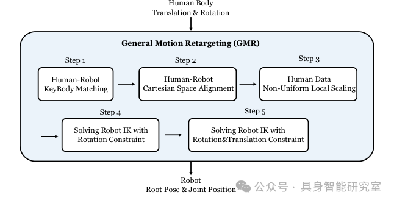

**算法实现总结：**Retargeting 主要解决数据闭环：用人类视频/动捕轨迹、遥操作/外骨骼数据、接触力/触觉信号采集人类操作和机器人状态，再通过PPO/RL 策略训练、IK/动作重定向、分层技能/专家策略转成可训练、可复用的全身轨迹/动作序列、低层控制器目标。关键点是把任务拆成可路由的技能或专家策略，再用高层模块在执行中选择和组合。

### 019 SONIC｜超大运动跟踪，实现自然人形全身控制

📌 论文基本信息

📝 **原文题目：** SONIC: Supersizing Motion Tracking for Natural Humanoid Whole-Body Control

🏫 **机构：** NVIDIA

🔗 **项目链接：** https://nvlabs.github.io/GEAR-SONIC/

📅 **发表日期：** 2026年5月21日

**算法实现总结：**SONIC 的实现路径是先把人类视频/动捕轨迹、遥操作/外骨骼数据编码成多模态表征，再用AMP/运动先验、VLA 多模态动作模型预测全身轨迹/动作序列、低层控制器目标。关键点是保留 VLM 的语义理解，同时增加机器人状态和动作头，避免只停留在语言规划。

### 020 TWIST2｜可扩展、便携式、整体的人形数据收集系统

📌 论文基本信息

📝 **原文题目：** TWIST2: Scalable, Portable, and Holistic Humanoid Data Collection System

🏫 **机构：** Stanford University、UC Berkeley、CMU

🔗 **项目链接：** https://twist-data.github.io

📅 **发表日期：** 2025年11月4日

**算法实现总结：**TWIST2 的实现路径是先把相机图像/多视角观测、人类视频/动捕轨迹、遥操作/外骨骼数据编码成多模态表征，再用ACT/行为克隆模仿学习、VLA 多模态动作模型、全身控制器/WBC/MPC预测全身轨迹/动作序列、低层控制器目标。关键点是保留 VLM 的语义理解，同时增加机器人状态和动作头，避免只停留在语言规划。

### 021 TWIST｜遥控全身模仿系统

📌 论文基本信息

📝 **原文题目：** TWIST: Teleoperated Whole-Body Imitation System

🏫 **机构：** TWIST: Teleoperated Whole-Body Imitation System、Stanford University、Simon Fraser University ∗Equal Contribution †Equal Advising

🔗 **项目链接：** https://humanoid-teleop.github.io

📅 **发表日期：** 2025年5月5日

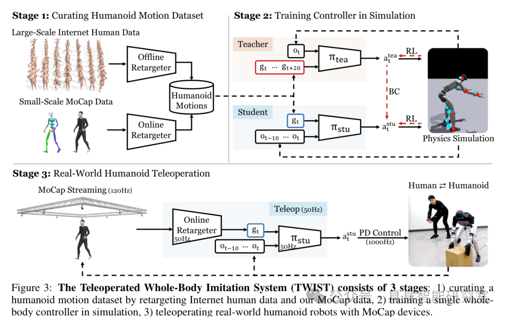

**算法实现总结：**TWIST 主要解决数据闭环：用人类视频/动捕轨迹、遥操作/外骨骼数据、接触力/触觉信号采集人类操作和机器人状态，再通过异构动捕与合成平衡数据、PPO/RL 策略训练、ACT/行为克隆模仿学习转成可训练、可复用的全身轨迹/动作序列、低层控制器目标。关键点是把任务拆成可路由的技能或专家策略，再用高层模块在执行中选择和组合。

### 022 TextOp｜实时交互式文本驱动的仿人机器人运动生成和控制

📌 论文基本信息

📝 **原文题目：** TextOp: Real-time Interactive Text-Driven Humanoid Robot Motion Generation and Control

🏫 **机构：** Institute of Artificial Intelligence (TeleAI), China Telecom、Shanghai Jiao Tong University、East China University of Science and Technology

🔗 **项目链接：** https://text-op.github.io/

📅 **发表日期：** 2026年2月7日

**算法实现总结：**TextOp 主要解决数据闭环：用语言指令、遥操作/外骨骼数据采集人类操作和机器人状态，再通过扩散策略/流匹配、全身控制器/WBC/MPC转成可训练、可复用的全身轨迹/动作序列、低层控制器目标。关键点是把动作生成看成条件生成问题，用扩散或流匹配在多模态动作分布里采样可执行轨迹。

### 023 UniAct｜人形机器人的统一运动生成和动作流

📌 论文基本信息

📝 **原文题目：** UniAct: Unified Motion Generation and Action Streaming for Humanoid Robots

🏫 **机构：** Institute for AI, Peking University、Beijing Institute for General Artificial Intelligence (BIGAI)、School of Psychological and Cognitive Sciences, Peking University、School of Computer Science, Peking University

🔗 **项目链接：** https://jnnan.github.io/uniact/

📅 **发表日期：** 2025年12月30日

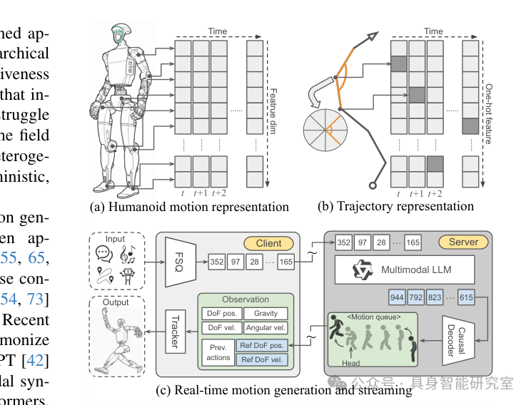

**算法实现总结：**UniAct 把语言指令转成可跟踪的身体目标，并通过策略网络和控制模块训练或组合全身策略，最终输出全身轨迹/动作序列、低层控制器目标。关键点是把策略网络和控制模块放在同一条训练/部署链路里，减少高层目标到低层动作之间的断点。

### 024 UniTracker｜学习仿人机器人通用全身运动跟踪器

📌 论文基本信息

📝 **原文题目：** UniTracker: Learning Universal Whole-Body Motion Tracker for Humanoid Robots

🏫 **机构：** Shanghai Jiao Tong Univeristy、Shanghai Artificial Intelligence Laboratory、Shanghai Innovation Institute、Peking University

🔗 **项目链接：** https://yinkangning0124.github.io/Humanoid-UniTracker/

📅 **发表日期：** 2025年9月18日

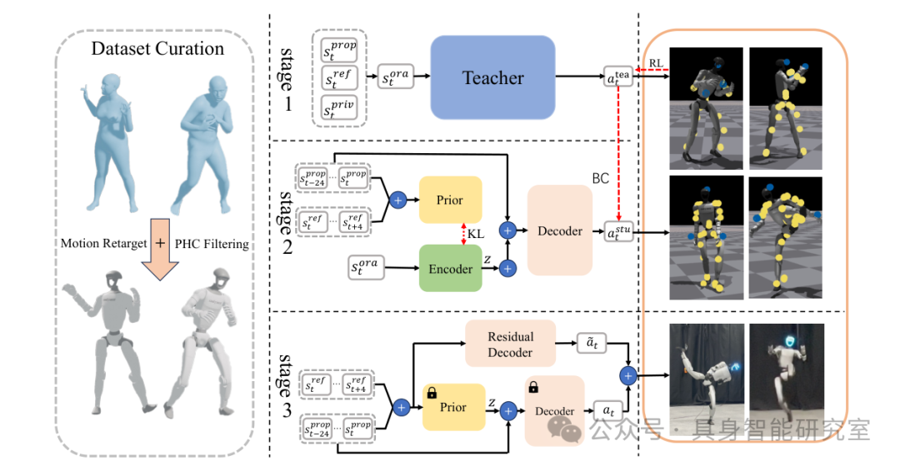

**算法实现总结：**UniTracker 把相机图像/多视角观测、本体状态与关节序列、仿真交互数据转成可跟踪的身体目标，并通过教师-学生知识迁移、PPO/RL 策略训练、扩散策略/流匹配训练或组合全身策略，最终输出全身轨迹/动作序列、低层控制器目标。关键点是用特权信息训练教师策略，再把能力蒸馏到只能使用部署观测的学生策略。

### 025 人形操作接口｜基于机器人无关示范的人形全身操作

📌 论文基本信息

📝 **原文题目：** Humanoid Manipulation Interface: Humanoid Whole-Body Manipulation from Robot-Free Demonstrations

🏫 **机构：** ∗Equal contribution、Tsinghua University、Shanghai Qi Zhi Institute、Spirit.AI

🔗 **项目链接：** https://humanoid-manipulation-interface.github.io

📅 **发表日期：** 2026年2月12日

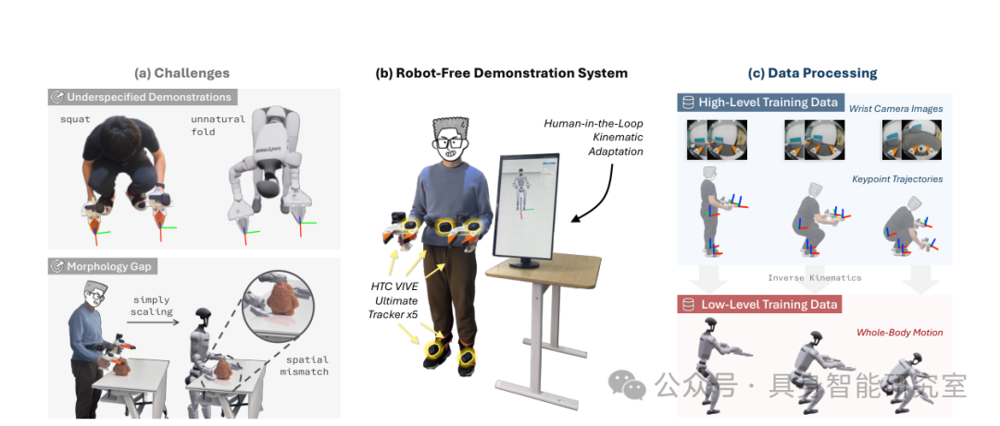

**算法实现总结：**这篇工作主要解决数据闭环：用人类视频/动捕轨迹、遥操作/外骨骼数据、接触力/触觉信号采集人类操作和机器人状态，再通过PPO/RL 策略训练、分层技能/专家策略转成可训练、可复用的全身轨迹/动作序列、低层控制器目标。关键点是把任务拆成可路由的技能或专家策略，再用高层模块在执行中选择和组合。

### 026 人形机器人富有表现力的全身控制

📌 论文基本信息

📝 **原文题目：** Expressive Whole-Body Control for Humanoid Robots

🏫 **机构：** UC San Diego

🔗 **项目链接：** https://expressive-humanoid.github.io

📅 **发表日期：** 2024年3月6日

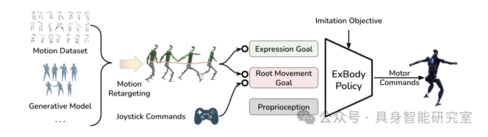

**算法实现总结：**这篇工作把本体状态与关节序列、人类视频/动捕轨迹、仿真交互数据转成可跟踪的身体目标，并通过异构动捕与合成平衡数据、PPO/RL 策略训练、ACT/行为克隆模仿学习训练或组合全身策略，最终输出全身轨迹/动作序列、低层控制器目标。关键点是把示范轨迹压成可监督的动作预测问题，再通过动作 chunk 或闭环执行降低时序抖动。

### 027 人形机器人行为基础模型

📌 论文基本信息

📝 **原文题目：** Behavior Foundation Model for Humanoid Robots

🏫 **机构：** Peking University、The Chinese University of Hong Kong, Shenzhen、Shanghai Jiaotong University、Fudan University

🔗 **项目链接：** https://bfm4humanoid.github.io

📅 **发表日期：** 2025年9月17日

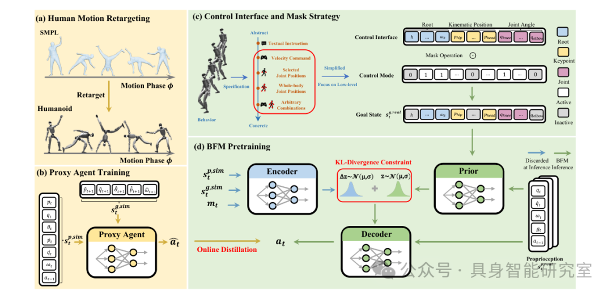

**算法实现总结：**这篇工作主要解决数据闭环：用本体状态与关节序列、遥操作/外骨骼数据、仿真交互数据采集人类操作和机器人状态，再通过教师-学生知识迁移、扩散策略/流匹配、全身控制器/WBC/MPC转成可训练、可复用的全身轨迹/动作序列、低层控制器目标。关键点是用特权信息训练教师策略，再把能力蒸馏到只能使用部署观测的学生策略。

### 028 从专家到通用：走向人形机器人的通用全身控制

📌 论文基本信息

📝 **原文题目：** From Experts to a Generalist: Toward General Whole-Body Control for Humanoid Robots

🏫 **机构：** Peking University

🔗 **项目链接：** https://beingbeyond.github.io/BumbleBee/

📅 **发表日期：** 2025年9月2日

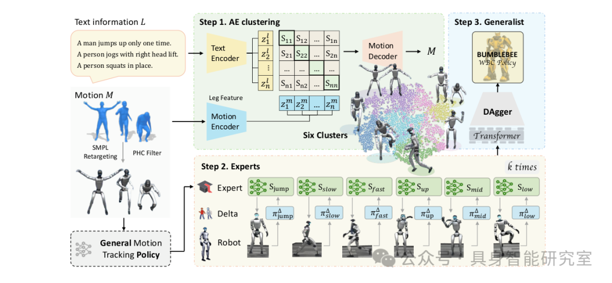

**算法实现总结：**这篇工作把相机图像/多视角观测、本体状态与关节序列、仿真交互数据转成可跟踪的身体目标，并通过世界模型/视频预测、全身控制器/WBC/MPC训练或组合全身策略，最终输出全身轨迹/动作序列、低层控制器目标。关键点是把世界模型/视频预测、全身控制器/WBC/MPC放在同一条训练/部署链路里，减少高层目标到低层动作之间的断点。

### 029 学习人对人的实时全身远程操作

📌 论文基本信息

📝 **原文题目：** Learning Human-to-Humanoid Real-Time Whole-Body Teleoperation

🏫 **机构：** Carnegie Mellon University

🔗 **项目链接：** https://human2humanoid.com

📅 **发表日期：** 2024年3月7日

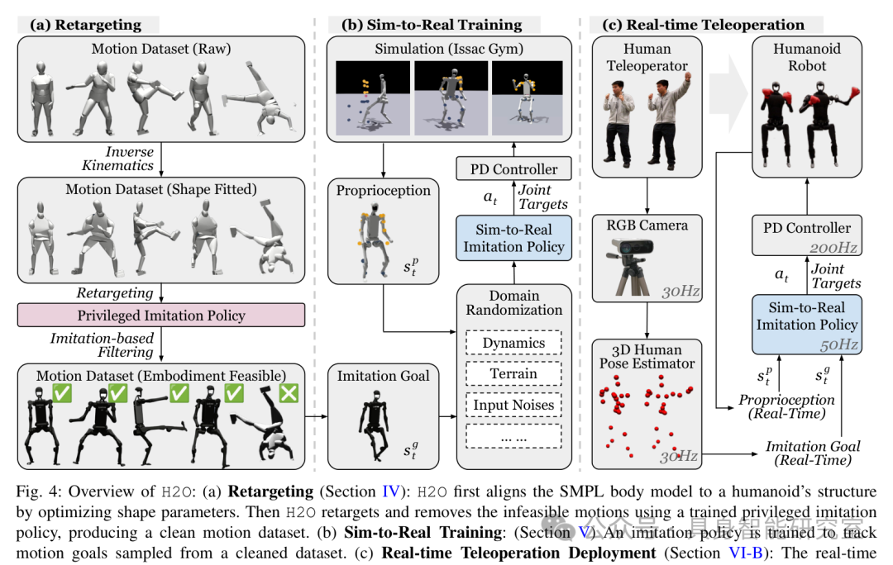

**算法实现总结：**这篇工作主要解决数据闭环：用相机图像/多视角观测、本体状态与关节序列、人类视频/动捕轨迹采集人类操作和机器人状态，再通过IK/动作重定向转成可训练、可复用的全身轨迹/动作序列、低层控制器目标。关键点是把IK/动作重定向放在同一条训练/部署链路里，减少高层目标到低层动作之间的断点。

### 030 跟踪任何干扰下的任何动作

📌 论文基本信息

📝 **原文题目：** Track Any Motions under Any Disturbances

🔗 **项目链接：** https://zzk273.github.io/Any2Track/

📅 **发表日期：** 2025年9月30日

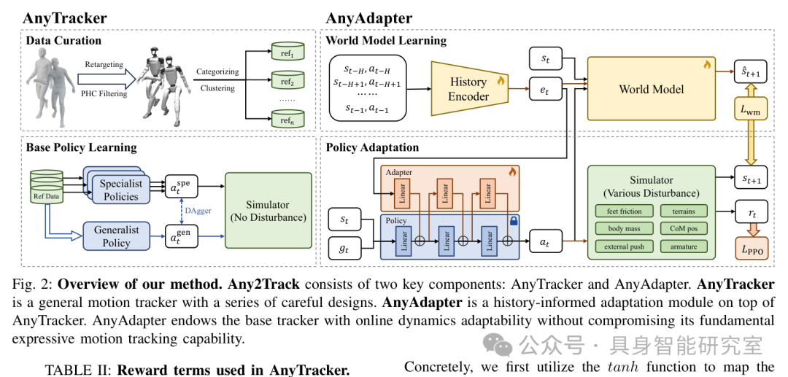

**算法实现总结：**这篇工作先从仿真交互数据、接触力/触觉信号恢复场景、目标或运动表征，再用扩散策略/流匹配生成全身轨迹/动作序列、低层控制器目标。关键点是把动作生成看成条件生成问题，用扩散或流匹配在多模态动作分布里采样可执行轨迹。

### 031 鲁棒且通用的人形运动跟踪

📌 论文基本信息

📝 **原文题目：** Robust and Generalized Humanoid Motion Tracking

🔗 **项目链接：** https://zeonsunlightyu.github.io/

📅 **发表日期：** 2026年1月30日

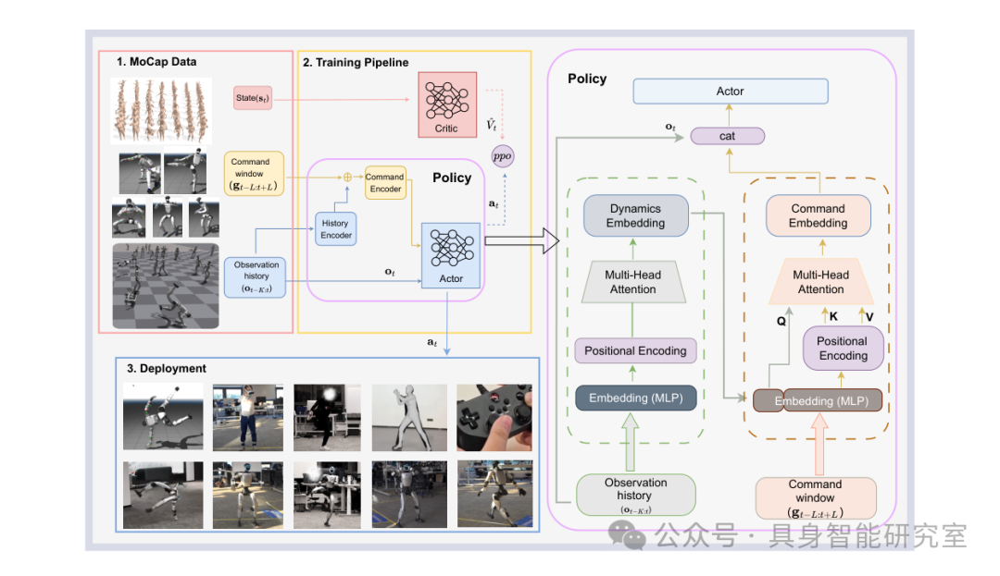

**算法实现总结：**这篇工作主要解决数据闭环：用本体状态与关节序列、人类视频/动捕轨迹、遥操作/外骨骼数据采集人类操作和机器人状态，再通过教师-学生知识迁移、ACT/行为克隆模仿学习、扩散策略/流匹配转成可训练、可复用的全身轨迹/动作序列、低层控制器目标。关键点是用特权信息训练教师策略，再把能力蒸馏到只能使用部署观测的学生策略。

## 02上半身中心控制与移动操作接口

这一组更靠近移动操作接口：手、臂、腰、根节点和末端执行器如何一起接住任务目标。

### 032 AMO｜超灵巧人形全身控制的自适应运动优化

📌 论文基本信息

📝 **原文题目：** AMO: Adaptive Motion Optimization for Hyper-Dexterous Humanoid Whole-Body Control

🏫 **机构：** UC San Diego

🔗 **项目链接：** https://amo-humanoid.github.io/

📅 **发表日期：** 2025年5月6日

**算法实现总结：**AMO 把本体状态与关节序列、仿真交互数据、接触力/触觉信号转成可跟踪的身体目标，并通过PPO/RL 策略训练、ACT/行为克隆模仿学习、全身控制器/WBC/MPC训练或组合全身策略，最终输出全身轨迹/动作序列、低层控制器目标。关键点是把示范轨迹压成可监督的动作预测问题，再通过动作 chunk 或闭环执行降低时序抖动。

### 033 CEER｜兼容的末端执行器和根控制作为分层人形移动操作的统一接口

📌 论文基本信息

📝 **原文题目：** CEER: Compliant End-Effector and Root Control as a Unified Interface for Hierarchical Humanoid Loco-Manipulation

🔗 **项目链接：** https://robotproject8.github.io/ceer\_page/

📅 **发表日期：** 2026年5月19日

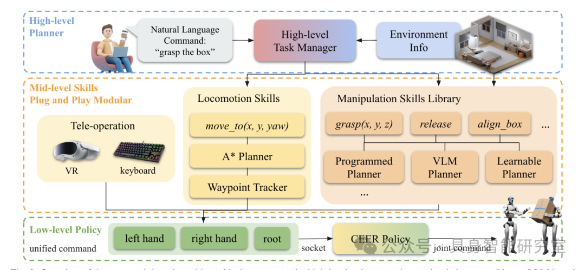

**算法实现总结：**CEER 主要解决数据闭环：用本体状态与关节序列、遥操作/外骨骼数据、仿真交互数据采集人类操作和机器人状态，再通过教师-学生知识迁移、全身控制器/WBC/MPC、分层技能/专家策略转成可训练、可复用的全身轨迹/动作序列、末端执行器/腕手目标、低层控制器目标。关键点是用特权信息训练教师策略，再把能力蒸馏到只能使用部署观测的学生策略。

### 034 COLA｜学习人机协调以协作搬运物体

📌 论文基本信息

📝 **原文题目：** Learning Human-Humanoid Coordination for Collaborative Object Carrying

🏫 **机构：** Department of Electrical and Electronic Engineering, the University of Hong Kong、State Key Laboratory of General Artificial Intelligence, BIGAI、School of Computer Science and Technology, Beijing Institute of Technology、Yuanpei College, Peking University

🔗 **项目链接：** https://yushi-du.github.io/COLA/

📅 **发表日期：** 2025年10月16日

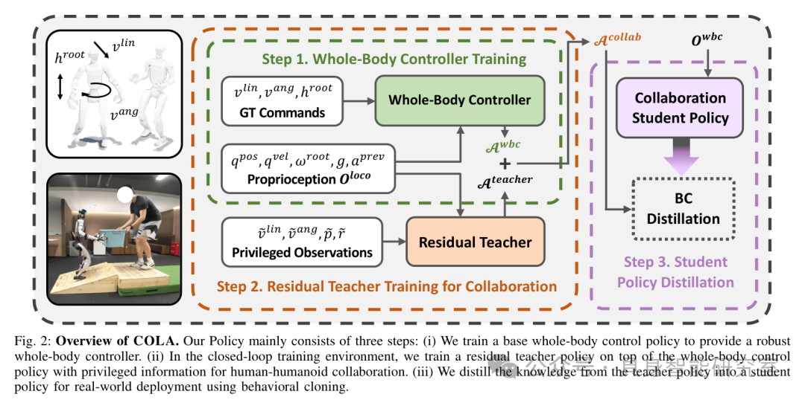

**算法实现总结：**COLA 先从本体状态与关节序列、人类视频/动捕轨迹、仿真交互数据恢复场景、目标或运动表征，再用PPO/RL 策略训练、世界模型/视频预测、闭环纠错/人类干预生成全身轨迹/动作序列、低层控制器目标。关键点是把PPO/RL 策略训练、世界模型/视频预测放在同一条训练/部署链路里，减少高层目标到低层动作之间的断点。

### 035 CoorDex｜协调身体和手的优先顺序以实现连续灵巧的人形移动操作

📌 论文基本信息

📝 **原文题目：** CoorDex: Coordinating Body and Hand Priors for Continuous Dexterous Humanoid Loco-Manipulation

🏫 **机构：** University of North Carolina at Chapel Hill、University of California, Berkeley

🔗 **项目链接：** https://skevinci.github.io/coordex/

📅 **发表日期：** 2026年6月22日

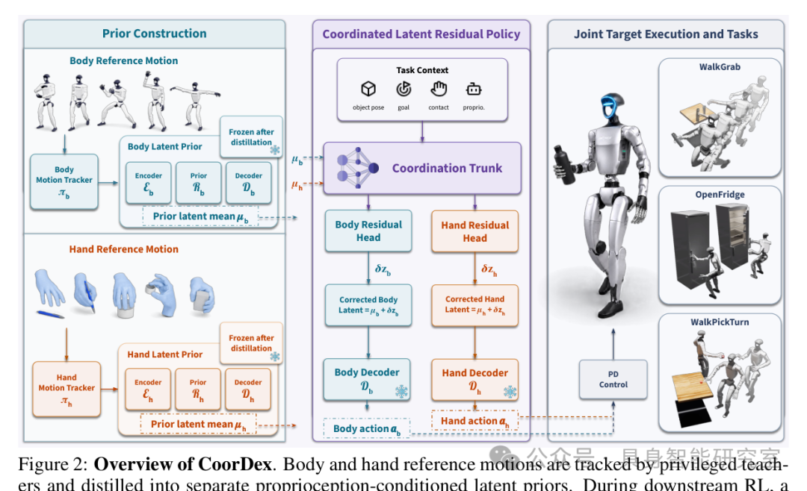

**算法实现总结：**CoorDex 把本体状态与关节序列、接触力/触觉信号转成可跟踪的身体目标，并通过PPO/RL 策略训练、扩散策略/流匹配、MM-DiT/Transformer 动作头训练或组合全身策略，最终输出全身轨迹/动作序列、低层控制器目标、地形/场景表征。关键点是把动作生成看成条件生成问题，用扩散或流匹配在多模态动作分布里采样可执行轨迹。

### 036 FALCON｜学习力自适应人形移动操作

📌 论文基本信息

📝 **原文题目：** FALCON: Learning Force-Adaptive Humanoid Loco-Manipulation

🏫 **机构：** Carnegie Mellon University

🔗 **项目链接：** https://lecar-lab.github.io/falcon-humanoid

📅 **发表日期：** 2025年11月16日

**算法实现总结：**FALCON 主要解决数据闭环：用本体状态与关节序列、遥操作/外骨骼数据、接触力/触觉信号采集人类操作和机器人状态，再通过全身控制器/WBC/MPC转成可训练、可复用的关节位置/力矩命令、全身轨迹/动作序列、末端执行器/腕手目标。关键点是把全身控制器/WBC/MPC放在同一条训练/部署链路里，减少高层目标到低层动作之间的断点。

### 037 HANDOFF｜通过精炼补充教师进行人形智能体任务空间全身控制

📌 论文基本信息

📝 **原文题目：** HANDOFF: Humanoid Agentic Task-Space Whole-Body Control via Distilled Complementary Teachers

🏫 **机构：** California Institute of Technology、The Institute for Human & Machine Cognition

🔗 **项目链接：** https://lzyang2000.github.io/HANDOFF/

📅 **发表日期：** 2026年6月9日

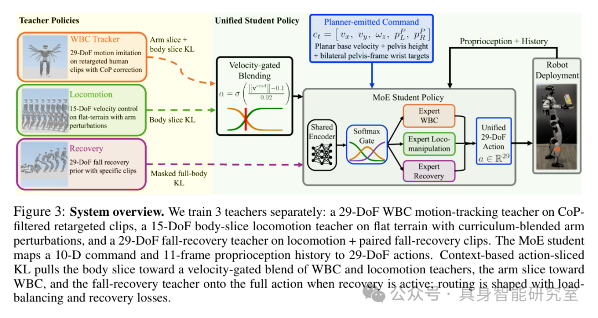

**算法实现总结：**HANDOFF 把本体状态与关节序列转成可跟踪的身体目标，并通过教师-学生知识迁移、扩散策略/流匹配、VLM 语义规划/路由训练或组合全身策略，最终输出全身轨迹/动作序列、低层控制器目标。关键点是用特权信息训练教师策略，再把能力蒸馏到只能使用部署观测的学生策略。

### 038 HEX｜用于跨实体全身操作的人形对齐专家

📌 论文基本信息

📝 **原文题目：** HEX: Humanoid-Aligned Experts for Cross-Embodiment Whole-Body Manipulation

🏫 **机构：** Beijing Innovation Center of Humanoid Robotics、Xi’an Jiaotong University、Nankai University、Peking University

🔗 **项目链接：** https://hex-humanoid.github.io/

📅 **发表日期：** 2026年5月19日

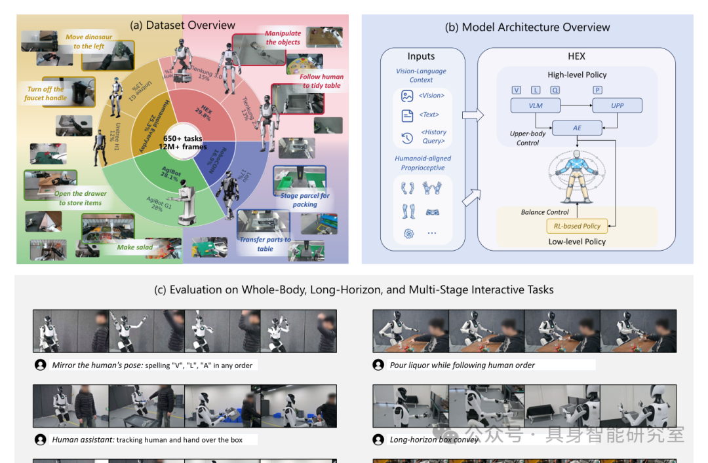

**算法实现总结：**HEX 的实现路径是先把本体状态与关节序列编码成多模态表征，再用PPO/RL 策略训练、VLA 多模态动作模型、VLM 语义规划/路由预测全身轨迹/动作序列、低层控制器目标。关键点是保留 VLM 的语义理解，同时增加机器人状态和动作头，避免只停留在语言规划。

### 039 HMC｜学习异构元控制以实现接触丰富的移动操作

📌 论文基本信息

📝 **原文题目：** HMC: Learning Heterogeneous Meta-Control for Contact-Rich Loco-Manipulation

🏫 **机构：** HMC: Learning Heterogeneous Meta-Control for Contact-Rich、UC San Diego

🔗 **项目链接：** https://loco-hmc.github.io

📅 **发表日期：** 2025年11月18日

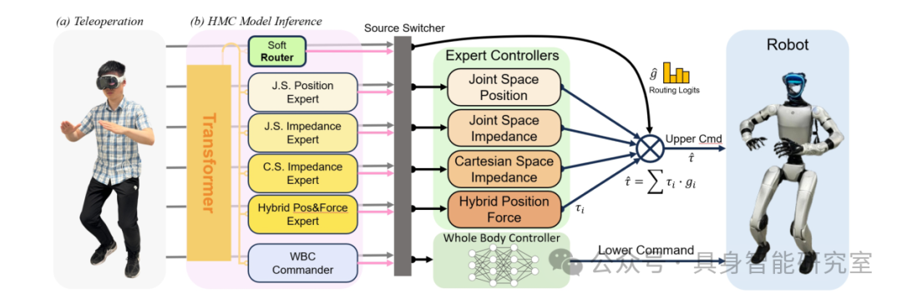

**算法实现总结：**HMC 主要解决数据闭环：用遥操作/外骨骼数据、接触力/触觉信号采集人类操作和机器人状态，再通过ACT/行为克隆模仿学习、分层技能/专家策略转成可训练、可复用的关节位置/力矩命令、全身轨迹/动作序列、低层控制器目标。关键点是把任务拆成可路由的技能或专家策略，再用高层模块在执行中选择和组合。

### 040 HOMIE｜具有同构外骨骼驾驶舱的人形移动操作

📌 论文基本信息

📝 **原文题目：** HOMIE: Humanoid Loco-Manipulation with Isomorphic Exoskeleton Cockpit

🏫 **机构：** Shanghai AI Laboratory、Multimedia Laboratory, The Chinese University of Hong Kong

🔗 **项目链接：** https://homietele.github.io/

📅 **发表日期：** 2025年4月28日

**算法实现总结：**HOMIE 主要解决数据闭环：用本体状态与关节序列、遥操作/外骨骼数据、仿真交互数据采集人类操作和机器人状态，再通过PPO/RL 策略训练、全身控制器/WBC/MPC转成可训练、可复用的全身轨迹/动作序列、低层控制器目标、地形/场景表征。关键点是把PPO/RL 策略训练、全身控制器/WBC/MPC放在同一条训练/部署链路里，减少高层目标到低层动作之间的断点。

### 041 HiWET｜用于长时程人形移动操作的分层世界坐标系末端执行器跟踪

📌 论文基本信息

📝 **原文题目：** HiWET: Hierarchical World-Frame End-Effector Tracking for Long-Horizon Humanoid Loco-Manipulation

🏫 **机构：** Shanghai Jiao Tong University、Shanghai Innovation Institute、Tongji University、Tsinghua University

📅 **发表日期：** 2026年2月6日

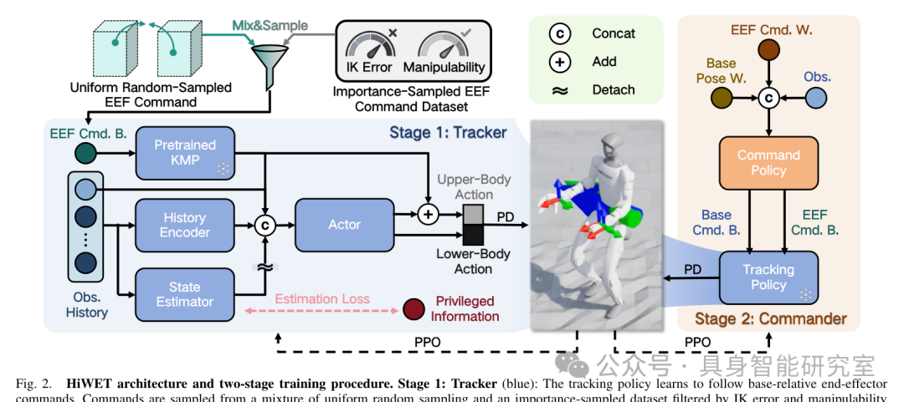

**算法实现总结：**HiWET 把本体状态与关节序列、仿真交互数据、接触力/触觉信号转成可跟踪的身体目标，并通过PPO/RL 策略训练、VLM 语义规划/路由、分层技能/专家策略训练或组合全身策略，最终输出全身轨迹/动作序列、末端执行器/腕手目标、低层控制器目标。关键点是把任务拆成可路由的技能或专家策略，再用高层模块在执行中选择和组合。

### 042 Hold｜My Beer 学习温和的人形运动和末端执行器稳定控制

📌 论文基本信息

📝 **原文题目：** Hold My Beer: Learning Gentle Humanoid Locomotion and End-Effector Stabilization Control

🏫 **机构：** Carnegie Mellon University

🔗 **项目链接：** https://lecar-lab.github.io/SoFTA/

📅 **发表日期：** 2025年6月3日

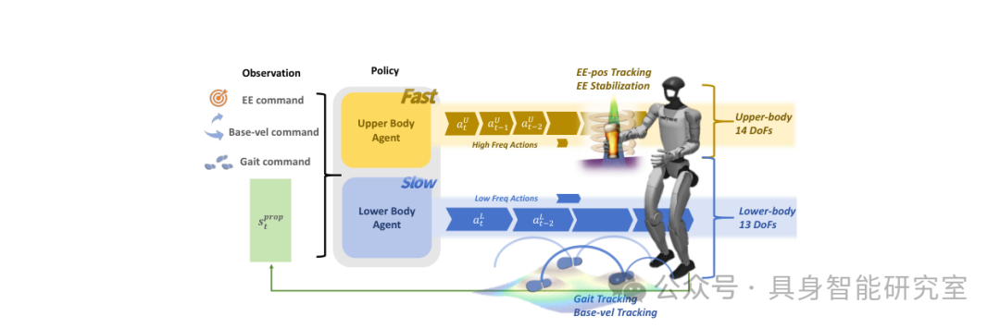

**算法实现总结：**Hold 先从相机图像/多视角观测恢复场景、目标或运动表征，再用ACT/行为克隆模仿学习生成全身轨迹/动作序列、末端执行器/腕手目标、低层控制器目标。关键点是把示范轨迹压成可监督的动作预测问题，再通过动作 chunk 或闭环执行降低时序抖动。

### 043 PILOT｜用于非结构化场景移动操作的感知集成低级控制器

📌 论文基本信息

📝 **原文题目：** PILOT: A Perceptive Integrated Low-level Controller for Loco-manipulation over Unstructured Scenes

📅 **发表日期：** 2026年1月24日

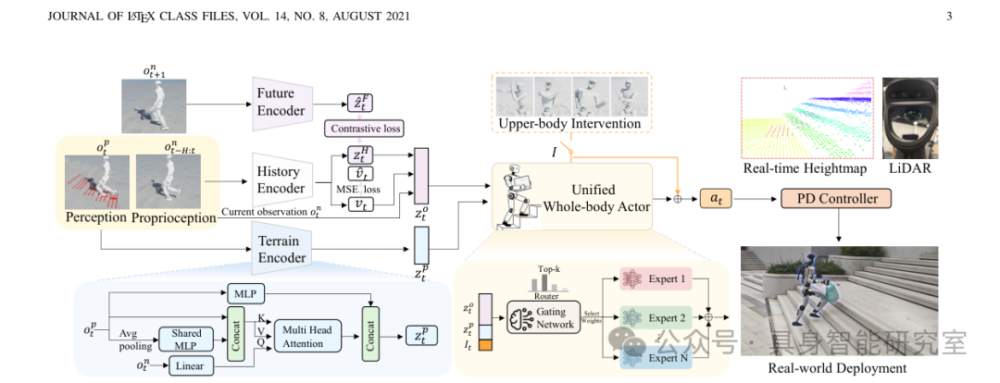

**算法实现总结：**PILOT 先从本体状态与关节序列、仿真交互数据、接触力/触觉信号恢复场景、目标或运动表征，再用PPO/RL 策略训练、全身控制器/WBC/MPC、分层技能/专家策略生成全身轨迹/动作序列、低层控制器目标、地形/场景表征。关键点是把任务拆成可路由的技能或专家策略，再用高层模块在执行中选择和组合。

### 044 RPL｜在具有挑战性的地形上学习鲁棒的人形感知运动

📌 论文基本信息

📝 **原文题目：** RPL: Learning Robust Humanoid Perceptive Locomotion on Challenging Terrains

🏫 **机构：** Carnegie Mellon University、Stanford University、UC Berkeley

🔗 **项目链接：** https://rpl-humanoid.github.io/

📅 **发表日期：** 2026年2月3日

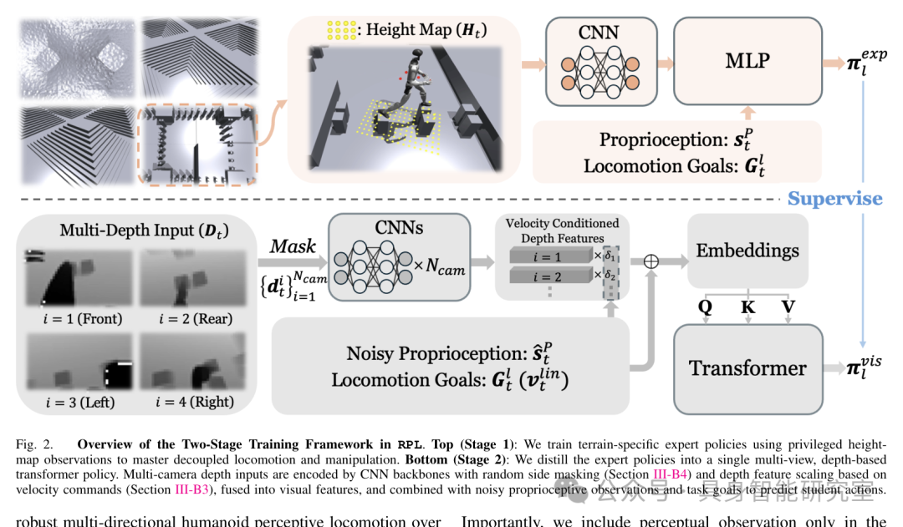

**算法实现总结：**RPL 先从相机图像/多视角观测、本体状态与关节序列、深度/点云/高度图恢复场景、目标或运动表征，再用下视深度相机和 U-Net 高度图重建、教师-学生知识迁移、世界模型/视频预测生成全身轨迹/动作序列、低层控制器目标、地形/场景表征。关键点是把地形重建、步态相位和全身姿态放进同一个控制回路，而不是把感知和运控拆成松散串联。

### 045 SplitAdapter｜通过因子化适应进行负载感知的人形移动操作

📌 论文基本信息

📝 **原文题目：** SplitAdapter: Load-Aware Humanoid Loco-Manipulation via Factorized Adaptation

🔗 **项目链接：** https://splitadapter.github.io/

📅 **发表日期：** 2026年6月2日

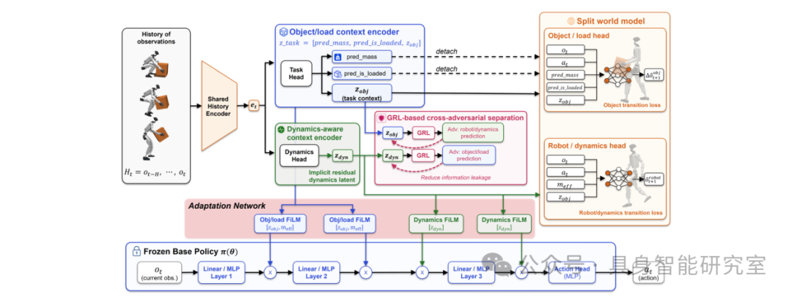

**算法实现总结：**SplitAdapter 把仿真交互数据转成可跟踪的身体目标，并通过PPO/RL 策略训练、扩散策略/流匹配、全身控制器/WBC/MPC训练或组合全身策略，最终输出全身轨迹/动作序列、低层控制器目标。关键点是把动作生成看成条件生成问题，用扩散或流匹配在多模态动作分布里采样可执行轨迹。

### 046 Sumo｜动态且可推广的全身移动操作

📌 论文基本信息

📝 **原文题目：** Sumo: Dynamic and Generalizable Whole-Body Loco-Manipulation

🏫 **机构：** MIT、RAI Institute、Cornell, \*Equal Contribution、This work was done in part during an internship at the RAI Institute

🔗 **项目链接：** https://sumo.rai-inst.com/

📅 **发表日期：** 2026年4月12日

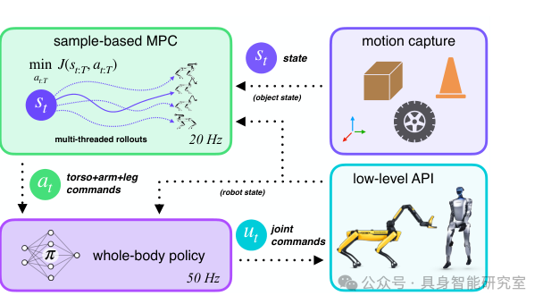

**算法实现总结：**Sumo 把本体状态与关节序列、仿真交互数据转成可跟踪的身体目标，并通过扩散策略/流匹配、全身控制器/WBC/MPC、分层技能/专家策略训练或组合全身策略，最终输出全身轨迹/动作序列、低层控制器目标。关键点是把动作生成看成条件生成问题，用扩散或流匹配在多模态动作分布里采样可执行轨迹。

### 047 Thor｜在强烈接触的环境中实现人类水平的全身反应

📌 论文基本信息

📝 **原文题目：** Thor: Towards Human-Level Whole-Body Reactions for Intense Contact-Rich Environments

🔗 **项目链接：** https://baai-aether.github.io/baai-thor/

📅 **发表日期：** 2025年11月5日

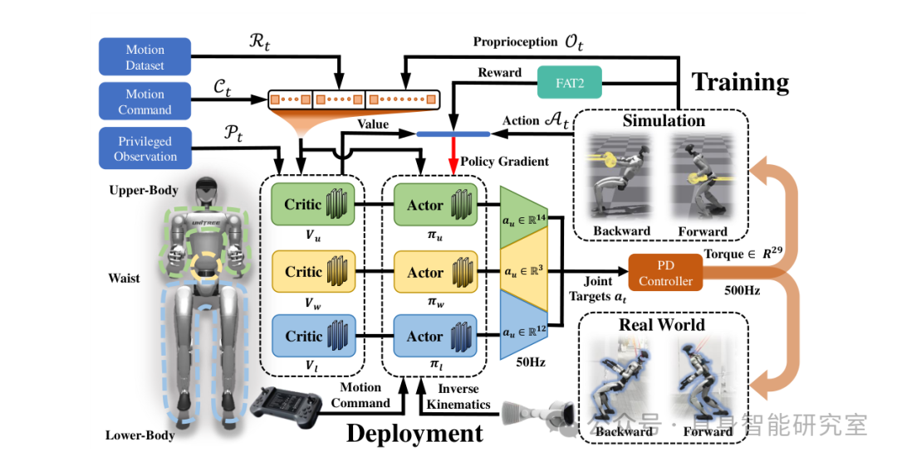

**算法实现总结：**Thor 把相机图像/多视角观测、本体状态与关节序列、接触力/触觉信号转成可跟踪的身体目标，并通过PPO/RL 策略训练、扩散策略/流匹配、全身控制器/WBC/MPC训练或组合全身策略，最终输出关节位置/力矩命令、全身轨迹/动作序列、低层控制器目标。关键点是把动作生成看成条件生成问题，用扩散或流匹配在多模态动作分布里采样可执行轨迹。

### 048 ULC｜用于人形移动操作的统一细粒度控制器

📌 论文基本信息

📝 **原文题目：** ULC: A Unified and Fine-Grained Controller for Humanoid Loco-Manipulation

🔗 **项目链接：** https://hellod035.github.io/ULC/

📅 **发表日期：** 2026年3月2日

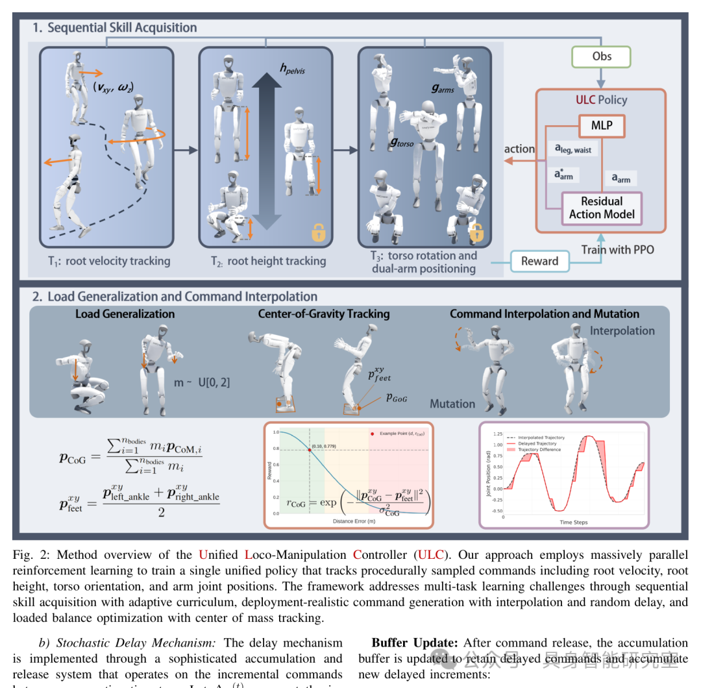

**算法实现总结：**ULC 把本体状态与关节序列、接触力/触觉信号转成可跟踪的身体目标，并通过PPO/RL 策略训练、全身控制器/WBC/MPC、分层技能/专家策略训练或组合全身策略，最终输出关节位置/力矩命令、全身轨迹/动作序列、低层控制器目标。关键点是把任务拆成可路由的技能或专家策略，再用高层模块在执行中选择和组合。

### 049 VIRAL｜大规模视觉模拟现实世界，用于人形移动操作

📌 论文基本信息

📝 **原文题目：** VIRAL: Visual Sim-to-Real at Scale for Humanoid Loco-Manipulation

🏫 **机构：** NVIDIA、CMU、UC Berkeley

🔗 **项目链接：** https://viral-humanoid.github.io

📅 **发表日期：** 2025年11月27日

**算法实现总结：**VIRAL 主要解决数据闭环：用相机图像/多视角观测、本体状态与关节序列、遥操作/外骨骼数据采集人类操作和机器人状态，再通过教师-学生知识迁移、ACT/行为克隆模仿学习、分层技能/专家策略转成可训练、可复用的全身轨迹/动作序列、低层控制器目标。关键点是用特权信息训练教师策略，再把能力蒸馏到只能使用部署观测的学生策略。

### 050 VOFA｜通过人形机器人的力自适应控制推动视觉对象目标

📌 论文基本信息

📝 **原文题目：** VOFA: Visual Object Goal Pushing with Force-Adaptive Control for Humanoids

🏫 **机构：** Department of Computer Science, The University of Texas at Austin

📅 **发表日期：** 2026年5月6日

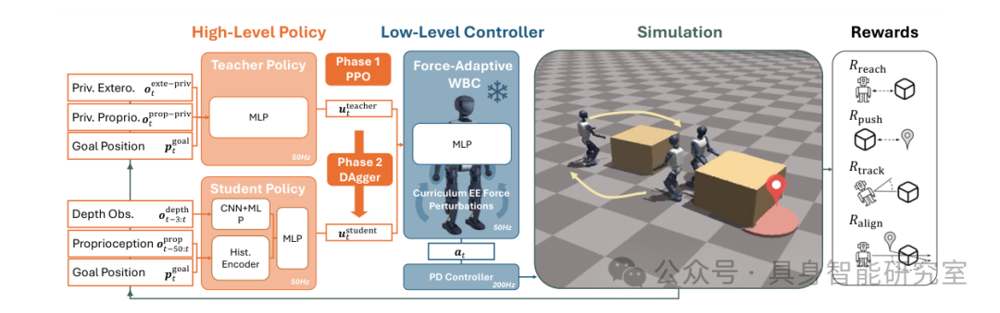

**算法实现总结：**VOFA 把相机图像/多视角观测、本体状态与关节序列、仿真交互数据转成可跟踪的身体目标，并通过扩散策略/流匹配、全身控制器/WBC/MPC、分层技能/专家策略训练或组合全身策略，最终输出全身轨迹/动作序列、低层控制器目标、导航/到达目标。关键点是把动作生成看成条件生成问题，用扩散或流匹配在多模态动作分布里采样可执行轨迹。

### 051 WholeBodyVLA｜迈向全身移动操作的统一潜在VLA

📌 论文基本信息

📝 **原文题目：** WholeBodyVLA: Towards Unified Latent VLA for Whole-Body Loco-Manipulation Control

🏫 **机构：** Fudan University、OpenDriveLab & MMLab at The University of Hong Kong

🔗 **项目链接：** https://opendrivelab.com/WholeBodyVLA

📅 **发表日期：** 2025年12月15日

**算法实现总结：**WholeBodyVLA 的实现路径是先把相机图像/多视角观测、遥操作/外骨骼数据编码成多模态表征，再用VLA 多模态动作模型预测全身轨迹/动作序列、低层控制器目标。关键点是保留 VLM 的语义理解，同时增加机器人状态和动作头，避免只停留在语言规划。

### 052 价值网络结构很重要｜人形移动操作中的双评论家与统一评论家

📌 论文基本信息

📝 **原文题目：** Critic Architecture Matters: Dual vs. Unified Critics for Humanoid Loco-Manipulation

🏫 **机构：** Department of Computer Engineering、C¸ ukurova University

📅 **发表日期：** 2026年6月10日

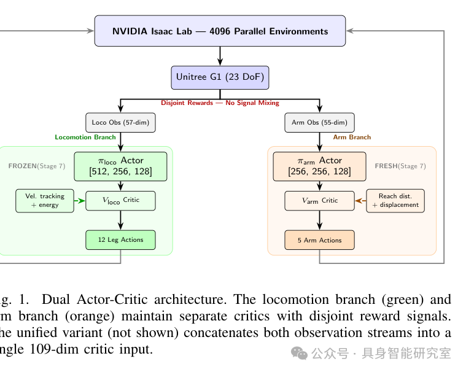

**算法实现总结：**这篇工作把相机图像/多视角观测、本体状态与关节序列、仿真交互数据转成可跟踪的身体目标，并通过PPO/RL 策略训练、扩散策略/流匹配训练或组合全身策略，最终输出全身轨迹/动作序列、低层控制器目标。关键点是把动作生成看成条件生成问题，用扩散或流匹配在多模态动作分布里采样可执行轨迹。

### 053 打开仿真到现实世界的人形像素到动作策略传输之门

📌 论文基本信息

📝 **原文题目：** Opening the Sim-to-Real Door for Humanoid Pixel-to-Action Policy Transfer

🏫 **机构：** NVIDIA、UC Berkeley、CMU

🔗 **项目链接：** https://doorman-humanoid.github.io/

📅 **发表日期：** 2025年11月30日

**算法实现总结：**这篇工作主要解决数据闭环：用相机图像/多视角观测、本体状态与关节序列、遥操作/外骨骼数据采集人类操作和机器人状态，再通过教师-学生知识迁移、全身控制器/WBC/MPC、闭环纠错/人类干预转成可训练、可复用的全身轨迹/动作序列、低层控制器目标。关键点是用特权信息训练教师策略，再把能力蒸馏到只能使用部署观测的学生策略。

### 054 用于人形策略学习的对抗性运动和运动模仿

📌 论文基本信息

📝 **原文题目：** Adversarial Locomotion and Motion Imitation for Humanoid Policy Learning

🏫 **机构：** Adversarial Locomotion and Motion Imitation for、Institute of Artificial Intelligence (TeleAI), China Telecom、ShanghaiTech University、University of Science and Technology of China

🔗 **项目链接：** https://almi-humanoid.github.io

📅 **发表日期：** 2025年10月26日

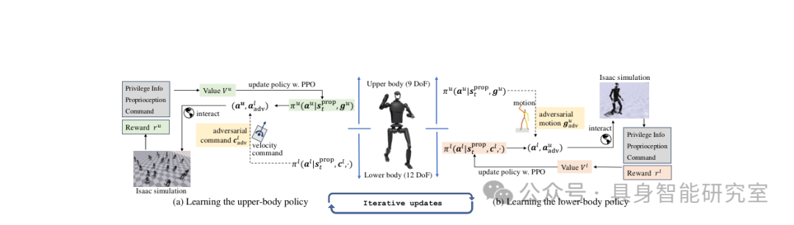

**算法实现总结：**这篇工作主要解决数据闭环：用本体状态与关节序列、遥操作/外骨骼数据、仿真交互数据采集人类操作和机器人状态，再通过扩散策略/流匹配、全身控制器/WBC/MPC转成可训练、可复用的关节位置/力矩命令、全身轨迹/动作序列、低层控制器目标。关键点是把动作生成看成条件生成问题，用扩散或流匹配在多模态动作分布里采样可执行轨迹。

### 055 用于跨人形运动的可扩展和通用全身控制

📌 论文基本信息

📝 **原文题目：** Scalable and General Whole-Body Control for Cross-Humanoid Locomotion

🔗 **项目链接：** https://xhugwbc.github.io

📅 **发表日期：** 2026年6月9日

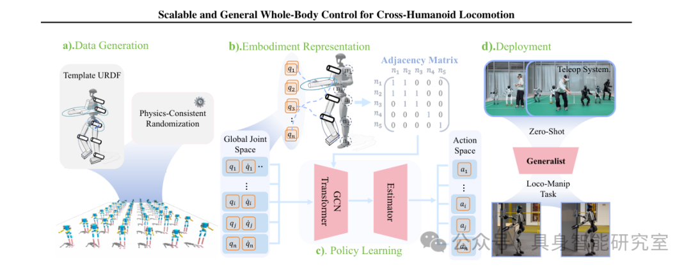

**算法实现总结：**这篇工作主要解决数据闭环：用相机图像/多视角观测、本体状态与关节序列、遥操作/外骨骼数据采集人类操作和机器人状态，再通过AMP/运动先验、全身控制器/WBC/MPC转成可训练、可复用的全身轨迹/动作序列、低层控制器目标。关键点是把AMP/运动先验、全身控制器/WBC/MPC放在同一条训练/部署链路里，减少高层目标到低层动作之间的断点。

## 03视觉感知驱动的人形移动操作

这一组强调视觉、本体状态、场景理解和全身控制之间的闭环。

### 056 AGILE｜人形移动操作学习的综合工作流程

📌 论文基本信息

📝 **原文题目：** AGILE: A Comprehensive Workflow for Humanoid Loco-Manipulation Learning

🔗 **项目链接：** https://github.com/nvidia-isaac/WBC-AGILE

📅 **发表日期：** 2026年3月20日

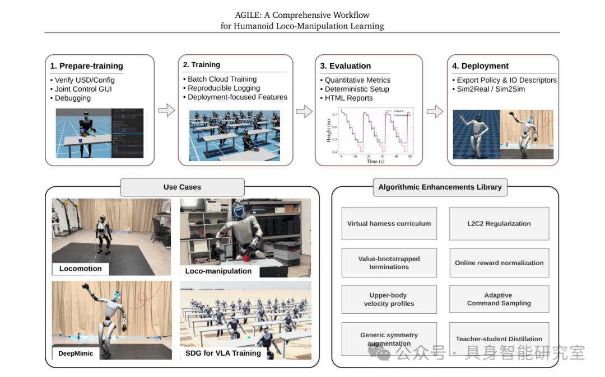

**算法实现总结：**AGILE 先从相机图像/多视角观测、本体状态与关节序列、仿真交互数据恢复场景、目标或运动表征，再用PPO/RL 策略训练、全身控制器/WBC/MPC、分层技能/专家策略生成低层控制器目标。关键点是把任务拆成可路由的技能或专家策略，再用高层模块在执行中选择和组合。

### 057 Being-0｜具有视觉语言模型和模块化技能的人形机器人智能体

📌 论文基本信息

📝 **原文题目：** Being-0: A Humanoid Robotic Agent with Vision-Language Models and Modular Skills

🏫 **机构：** FM and low-level skills, and () the Modular Skill Library for robust locomotion and dexterous manipulation. Together, these components

🔗 **项目链接：** https://beingbeyond.github.io/Being-0

📅 **发表日期：** 2025年5月11日

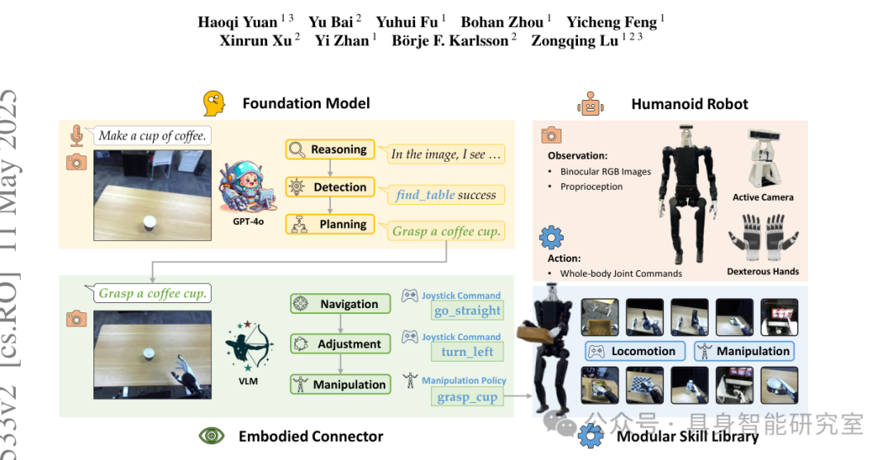

**算法实现总结：**Being-0 先从语言指令、相机图像/多视角观测恢复场景、目标或运动表征，再用VLM 语义规划/路由、分层技能/专家策略生成可执行动作命令。关键点是把任务拆成可路由的技能或专家策略，再用高层模块在执行中选择和组合。

### 058 Cybo-Waiter｜人形全身运动操作的物理智能体框架

📌 论文基本信息

📝 **原文题目：** Cybo-Waiter: A Physical Agentic Framework for Humanoid Whole-Body Locomotion-Manipulation

🏫 **机构：** Beihang University, Beijing, China、Tianjin University, Tianjin, China、University of Science and Technology of China, Hefei, China、Zhongguancun Institute of Artificial Intelligence, Beijing, China

📅 **发表日期：** 2026年3月11日

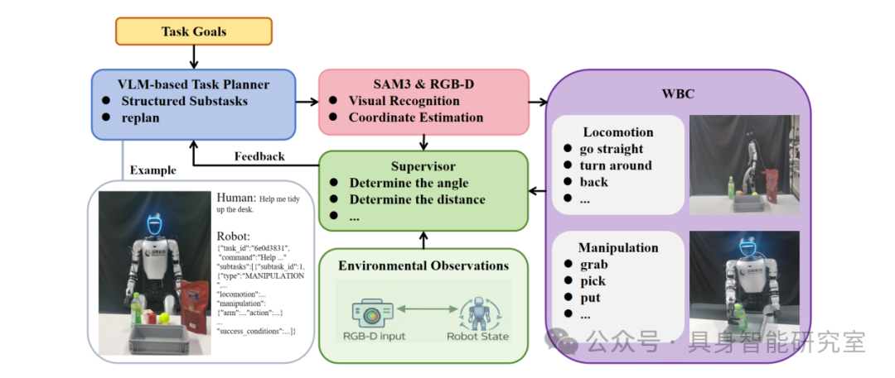

**算法实现总结：**Cybo-Waiter 先从语言指令、相机图像/多视角观测恢复场景、目标或运动表征，再用扩散策略/流匹配、VLM 语义规划/路由、闭环纠错/人类干预生成全身轨迹/动作序列。关键点是把动作生成看成条件生成问题，用扩散或流匹配在多模态动作分布里采样可执行轨迹。

### 059 DemoHLM｜从单一示范到通用人形移动操作

📌 论文基本信息

📝 **原文题目：** DemoHLM: From One Demonstration to Generalizable Humanoid Loco-Manipulation

🏫 **机构：** Peking University

🔗 **项目链接：** https://beingbeyond.github.io/DemoHLM/

📅 **发表日期：** 2025年10月13日

**算法实现总结：**DemoHLM 主要解决数据闭环：用相机图像/多视角观测、本体状态与关节序列、遥操作/外骨骼数据采集人类操作和机器人状态，再通过ACT/行为克隆模仿学习、全身控制器/WBC/MPC、闭环纠错/人类干预转成可训练、可复用的关节位置/力矩命令、全身轨迹/动作序列、低层控制器目标。关键点是把示范轨迹压成可监督的动作预测问题，再通过动作 chunk 或闭环执行降低时序抖动。

### 060 EgoHumanoid｜通过机器人无关的第一视角示范解锁野外移动操作

📌 论文基本信息

📝 **原文题目：** EgoHumanoid: Unlocking In-the-Wild Loco-Manipulation with Robot-Free Egocentric Demonstration

🏫 **机构：** The University of Hong Kong、Shanghai Innovation Institute、Beihang University、Robot teleoperation data collection is constrained to laboratory environment due to hardware and safety limitations, while in-

🔗 **项目链接：** https://github.com/NVlabs/GR00T-WholeBodyControl

📅 **发表日期：** 2026年6月4日

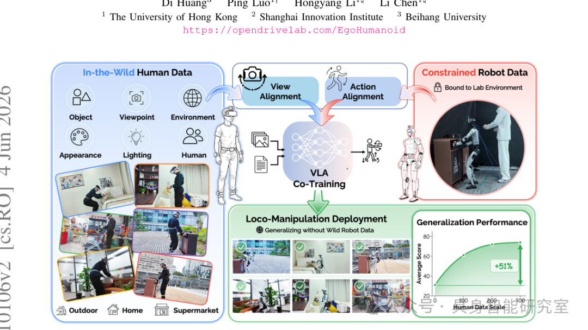

**算法实现总结：**EgoHumanoid 的实现路径是先把相机图像/多视角观测、人类视频/动捕轨迹、遥操作/外骨骼数据编码成多模态表征，再用ACT/行为克隆模仿学习、VLA 多模态动作模型预测地形/场景表征。关键点是保留 VLM 的语义理解，同时增加机器人状态和动作头，避免只停留在语言规划。

### 061 GRAIL｜从3D资产和视频先验生成人形移动操作

📌 论文基本信息

📝 **原文题目：** GRAIL: Generating Humanoid Loco-Manipulation from 3D Assets and Video Priors

🏫 **机构：** NVIDIA、UCLA

🔗 **项目链接：** https://research.nvidia.com/labs/dair/grail/

📅 **发表日期：** 2026年6月3日

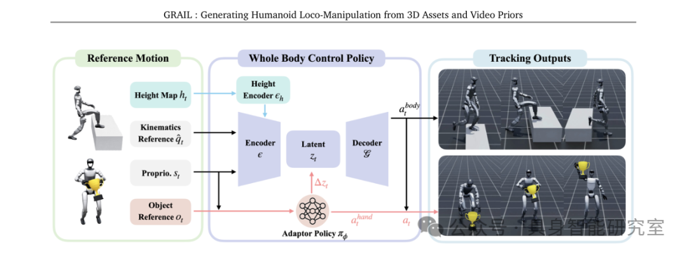

**算法实现总结：**GRAIL 先从相机图像/多视角观测、本体状态与关节序列、人类视频/动捕轨迹恢复场景、目标或运动表征，再用ACT/行为克隆模仿学习、扩散策略/流匹配、世界模型/视频预测生成末端执行器/腕手目标。关键点是把动作生成看成条件生成问题，用扩散或流匹配在多模态动作分布里采样可执行轨迹。

### 062 H2-COMPACT｜通过自适应接触轨迹策略进行人机协同操作

📌 论文基本信息

📝 **原文题目：** H2-COMPACT: Human–Humanoid Co-Manipulation via Adaptive Contact Trajectory Policies

🔗 **项目链接：** https://h2compact.github.io/h2compact/

📅 **发表日期：** 2025年5月23日

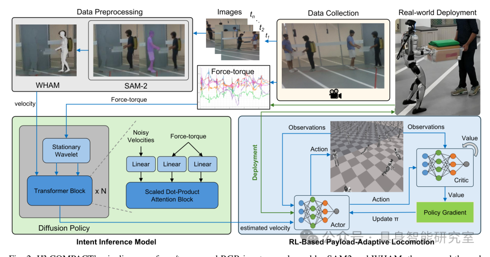

**算法实现总结：**H2-COMPACT 先从相机图像/多视角观测、本体状态与关节序列、仿真交互数据恢复场景、目标或运动表征，再用扩散策略/流匹配、分层技能/专家策略生成关节位置/力矩命令、全身轨迹/动作序列、地形/场景表征。关键点是把动作生成看成条件生成问题，用扩散或流匹配在多模态动作分布里采样可执行轨迹。

### 063 HALOMI｜通过人类示范的主动感知学习人形移动操作

📌 论文基本信息

📝 **原文题目：** HALOMI: Learning Humanoid Loco-Manipulation with Active Perception from Human Demonstrations

🏫 **机构：** Shanghai Jiao Tong University、University of Sussex、East China University of Science and Technology

🔗 **项目链接：** https://halomi-humanoid.github.io

📅 **发表日期：** 2026年6月17日

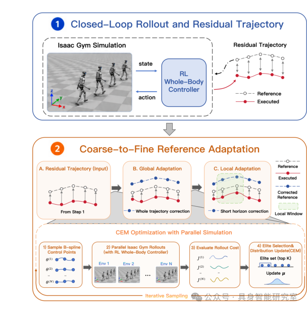

**算法实现总结：**HALOMI 先从相机图像/多视角观测恢复场景、目标或运动表征，再用ACT/行为克隆模仿学习、扩散策略/流匹配生成关节位置/力矩命令、全身轨迹/动作序列。关键点是把动作生成看成条件生成问题，用扩散或流匹配在多模态动作分布里采样可执行轨迹。

### 064 HMC｜学习异构元控制以实现接触丰富的移动操作

📌 论文基本信息

📝 **原文题目：** HMC: Learning Heterogeneous Meta-Control for Contact-Rich Loco-Manipulation

🏫 **机构：** HMC: Learning Heterogeneous Meta-Control for Contact-Rich、UC San Diego

🔗 **项目链接：** https://loco-hmc.github.io

📅 **发表日期：** 2025年11月18日

**算法实现总结：**HMC 主要解决数据闭环：用相机图像/多视角观测、遥操作/外骨骼数据、接触力/触觉信号采集人类操作和机器人状态，再通过ACT/行为克隆模仿学习、分层技能/专家策略转成可训练、可复用的关节位置/力矩命令。关键点是把任务拆成可路由的技能或专家策略，再用高层模块在执行中选择和组合。

### 065 HYPERmotion｜学习自主移动操作的混合行为规划

📌 论文基本信息

📝 **原文题目：** HYPERmotion: Learning Hybrid Behavior Planning for Autonomous Loco-manipulation

🔗 **项目链接：** https://hy-motion.github.io/

📅 **发表日期：** 2024年6月20日

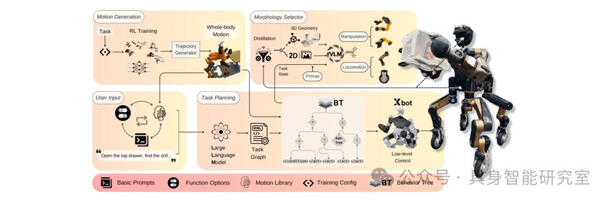

**算法实现总结：**HYPERmotion 先从语言指令、相机图像/多视角观测、本体状态与关节序列恢复场景、目标或运动表征，再用PPO/RL 策略训练、VLM 语义规划/路由、全身控制器/WBC/MPC生成可执行动作命令。关键点是把任务拆成可路由的技能或专家策略，再用高层模块在执行中选择和组合。

### 066 HiWET｜用于长时程人形移动操作的分层世界坐标系末端执行器跟踪

📌 论文基本信息

📝 **原文题目：** HiWET: Hierarchical World-Frame End-Effector Tracking for Long-Horizon Humanoid Loco-Manipulation

🏫 **机构：** Shanghai Jiao Tong University、Shanghai Innovation Institute、Tongji University、Tsinghua University

📅 **发表日期：** 2026年2月6日

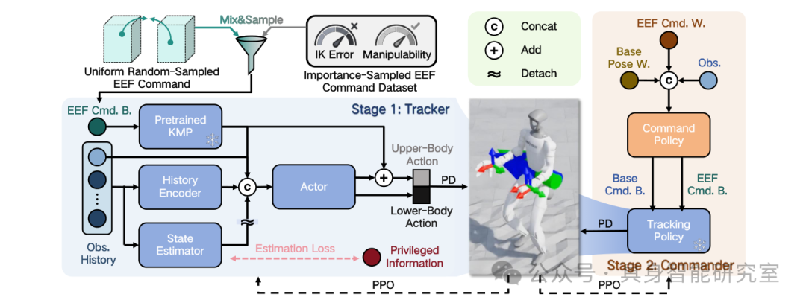

**算法实现总结：**HiWET 先从相机图像/多视角观测、本体状态与关节序列、仿真交互数据恢复场景、目标或运动表征，再用PPO/RL 策略训练、VLM 语义规划/路由、分层技能/专家策略生成末端执行器/腕手目标。关键点是把任务拆成可路由的技能或专家策略，再用高层模块在执行中选择和组合。

### 067 HumanoidExo｜通过可穿戴外骨骼进行可扩展的全身人形操作

📌 论文基本信息

📝 **原文题目：** HumanoidExo: Scalable Whole-Body Humanoid Manipulation via Wearable Exoskeleton

🏫 **机构：** National University of Defense Technology、tasks from limited data, and acquire new skills like walking

🔗 **项目链接：** https://humanoid-exo.github.io/

📅 **发表日期：** 2025年10月3日

**算法实现总结：**HumanoidExo 主要解决数据闭环：用相机图像/多视角观测、人类视频/动捕轨迹、遥操作/外骨骼数据采集人类操作和机器人状态，再通过扩散策略/流匹配、全身控制器/WBC/MPC、分层技能/专家策略转成可训练、可复用的全身轨迹/动作序列。关键点是把动作生成看成条件生成问题，用扩散或流匹配在多模态动作分布里采样可执行轨迹。

### 068 HumanoidMimicGen｜通过全身规划进行移动操作的数据生成

📌 论文基本信息

📝 **原文题目：** HumanoidMimicGen: Data Generation for Loco-Manipulation via Whole-Body Planning

🏫 **机构：** NVIDIA、The University of Texas at Austin

🔗 **项目链接：** https://humanoidmimicgen.github.io/

📅 **发表日期：** 2026年5月26日

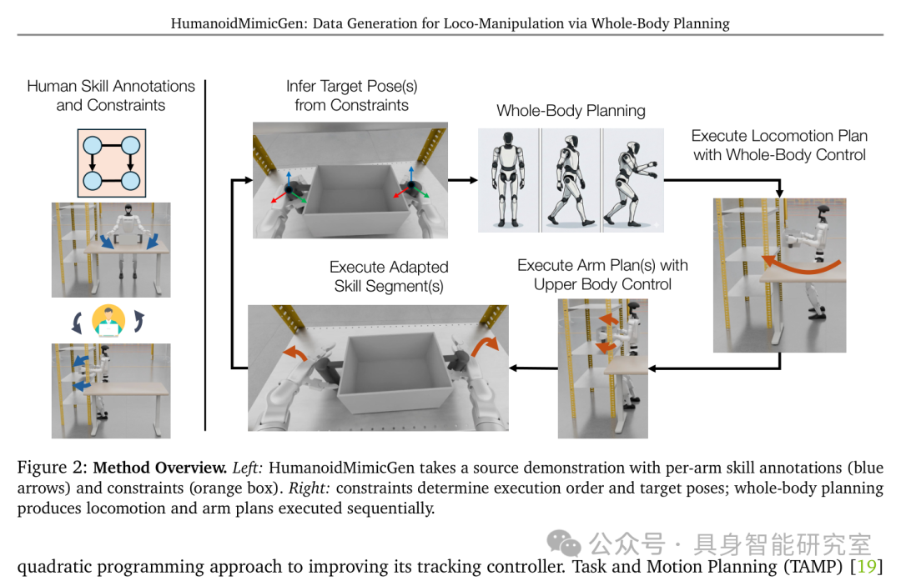

**算法实现总结：**HumanoidMimicGen 主要解决数据闭环：用相机图像/多视角观测、本体状态与关节序列、遥操作/外骨骼数据采集人类操作和机器人状态，再通过ACT/行为克隆模仿学习、分层技能/专家策略转成可训练、可复用的全身轨迹/动作序列。关键点是把任务拆成可路由的技能或专家策略，再用高层模块在执行中选择和组合。

### 069 Humanoid｜Everyday 用于开放世界人形操作的综合机器人数据集

📌 论文基本信息

📝 **原文题目：** Humanoid Everyday: A Comprehensive Robotic Dataset for Open-World Humanoid Manipulation

🏫 **机构：** University of Southern California、Toyota Research Institute

🔗 **项目链接：** https://humanoideveryday.github.io

📅 **发表日期：** 2026年6月17日

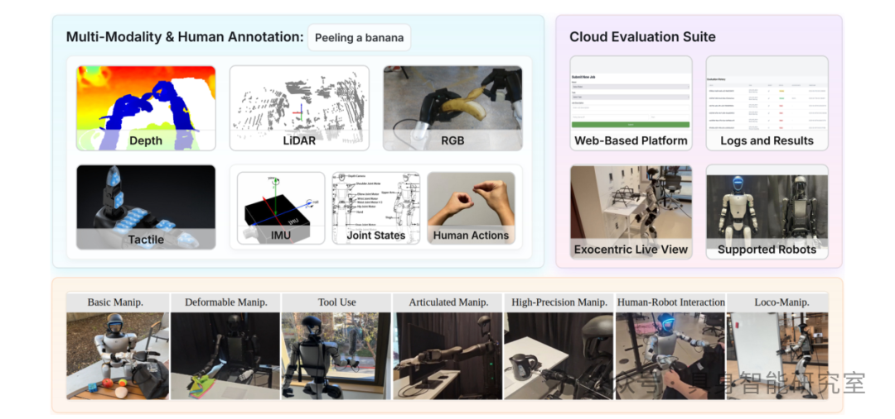

**算法实现总结：**Humanoid 主要解决数据闭环：用语言指令、相机图像/多视角观测、遥操作/外骨骼数据采集人类操作和机器人状态，再通过扩散策略/流匹配转成可训练、可复用的可执行动作命令。关键点是把动作生成看成条件生成问题，用扩散或流匹配在多模态动作分布里采样可执行轨迹。

### 070 OASIS｜从模拟数据收集到现实世界的人形移动操作

📌 论文基本信息

📝 **原文题目：** OASIS: From Simulation Data Collection to Real-World Humanoid Loco-Manipulation

🏫 **机构：** Institute of Artificial Intelligence (TeleAI), China Telecom、Fudan University、East China University of Science and Technology、Shanghai Jiao Tong University

🔗 **项目链接：** https://oasis-humanoid.github.io/

📅 **发表日期：** 2026年6月7日

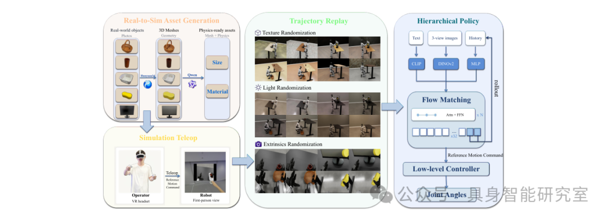

**算法实现总结：**OASIS 主要解决数据闭环：用相机图像/多视角观测、本体状态与关节序列、遥操作/外骨骼数据采集人类操作和机器人状态，再通过ACT/行为克隆模仿学习、分层技能/专家策略转成可训练、可复用的可执行动作命令。关键点是把任务拆成可路由的技能或专家策略，再用高层模块在执行中选择和组合。

### 071 OmniDP｜具有全方位3D感知的超视场大工作空间人形操控

📌 论文基本信息

📝 **原文题目：** OmniDP: Beyond-FOV Large-Workspace Humanoid Manipulation with Omnidirectional 3D Perception

📅 **发表日期：** 2026年3月6日

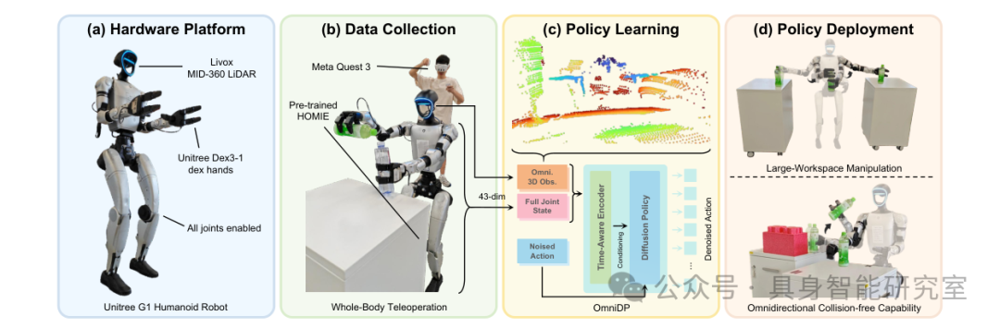

**算法实现总结：**OmniDP 主要解决数据闭环：用相机图像/多视角观测、本体状态与关节序列、遥操作/外骨骼数据采集人类操作和机器人状态，再通过策略网络和控制模块转成可训练、可复用的可执行动作命令。关键点是把策略网络和控制模块放在同一条训练/部署链路里，减少高层目标到低层动作之间的断点。

### 072 Opt2Skill｜模仿动态可行的全身轨迹以实现多样化人形移动操作

📌 论文基本信息

📝 **原文题目：** Opt2Skill: Imitating Dynamically-feasible Whole-Body Trajectories for Versatile Humanoid Loco-Manipulation

🏫 **机构：** IEEE ROBOTICS AND AUTOMATION LETTERS. PREPRINT VERSION. ACCEPTED SEPTEMBER、Opt、Skill: Imitating Dynamically-feasible Whole-Body Trajectories

🔗 **项目链接：** https://opt2skill.github.io

📅 **发表日期：** 2025年10月1日

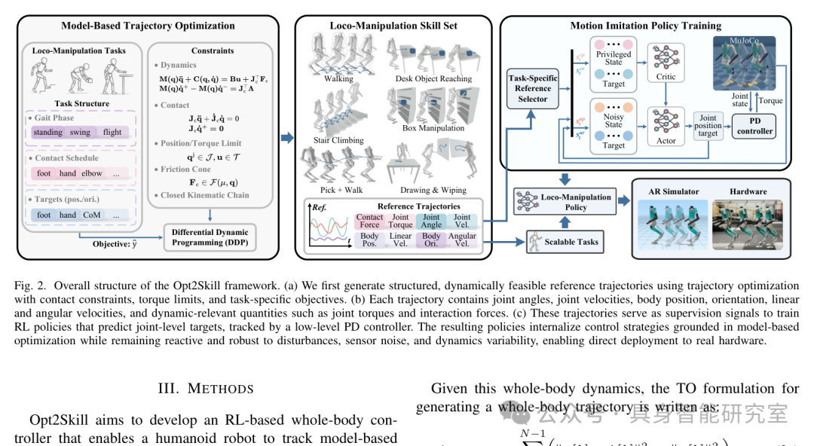

**算法实现总结：**Opt2Skill 先从相机图像/多视角观测、仿真交互数据、接触力/触觉信号恢复场景、目标或运动表征，再用PPO/RL 策略训练、ACT/行为克隆模仿学习、IK/动作重定向生成关节位置/力矩命令、全身轨迹/动作序列。关键点是把任务拆成可路由的技能或专家策略，再用高层模块在执行中选择和组合。

### 073 PhysHSI｜迈向现实世界的可推广和自然的人形场景交互系统

📌 论文基本信息

📝 **原文题目：** PhysHSI: Towards a Real-World Generalizable and Natural Humanoid-Scene Interaction System

🔗 **项目链接：** https://why618188.github.io/physhsi

📅 **发表日期：** 2025年10月13日

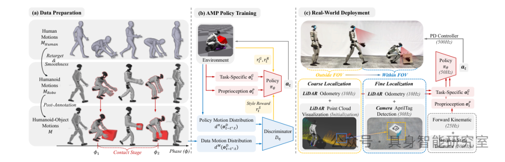

**算法实现总结：**PhysHSI 先从相机图像/多视角观测、本体状态与关节序列、深度/点云/高度图恢复场景、目标或运动表征，再用AMP/运动先验、DINO/视觉特征抽取生成地形/场景表征。关键点是把AMP/运动先验、DINO/视觉特征抽取放在同一条训练/部署链路里，减少高层目标到低层动作之间的断点。

### 074 Pro-HOI｜感知根引导的人形物体交互

📌 论文基本信息

📝 **原文题目：** Pro-HOI: Perceptive Root-guided Humanoid-Object Interaction

🏫 **机构：** Institute of Artificial Intelligence (TeleAI), China Telecom、Zhejiang University、University of Science and Technology of China、ShanghaiTech University

🔗 **项目链接：** https://pro-hoi.github.io/

📅 **发表日期：** 2026年3月1日

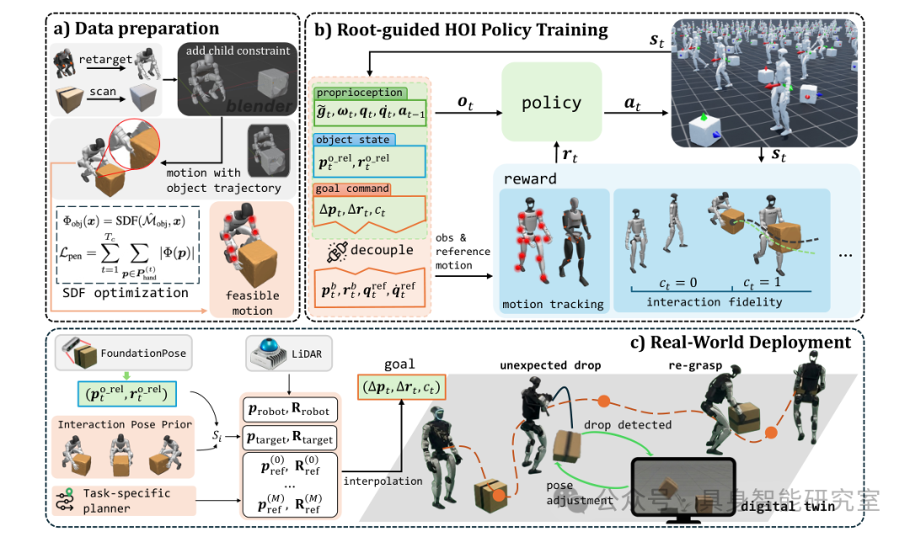

**算法实现总结：**Pro-HOI 先从相机图像/多视角观测、本体状态与关节序列、人类视频/动捕轨迹恢复场景、目标或运动表征，再用扩散策略/流匹配、IK/动作重定向、全身控制器/WBC/MPC生成全身轨迹/动作序列。关键点是把动作生成看成条件生成问题，用扩散或流匹配在多模态动作分布里采样可执行轨迹。

### 075 SIMPLE｜基于仿真的人形移动操作策略学习和评估

📌 论文基本信息

📝 **原文题目：** SIMPLE: Simulation-Based Policy Learning and Evaluation for Humanoid Loco-manipulation

🔗 **项目链接：** https://psi-lab.ai/SIMPLE

📅 **发表日期：** 2026年6月6日

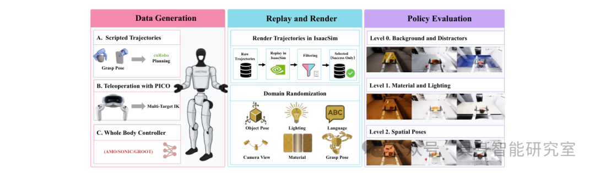

**算法实现总结：**SIMPLE 的实现路径是先把相机图像/多视角观测、本体状态与关节序列、遥操作/外骨骼数据编码成多模态表征，再用VLA 多模态动作模型、世界模型/视频预测预测全身轨迹/动作序列。关键点是让视频/世界模型提供可预测的物理先验，再由动作头把语义目标变成连续控制。

### 076 SUGAR｜可扩展的人类视频驱动的通用人形移动操作学习框架

📌 论文基本信息

📝 **原文题目：** SUGAR: A Scalable Human-Video-Driven Generalizable Humanoid Loco-Manipulation Learning Framework

🏫 **机构：** CFCS, School of Computer Science, Peking University、School of Computer Science and Engineering, Beihang University

🔗 **项目链接：** https://tianshuwu.github.io/sugar-humanoid/

📅 **发表日期：** 2026年5月19日

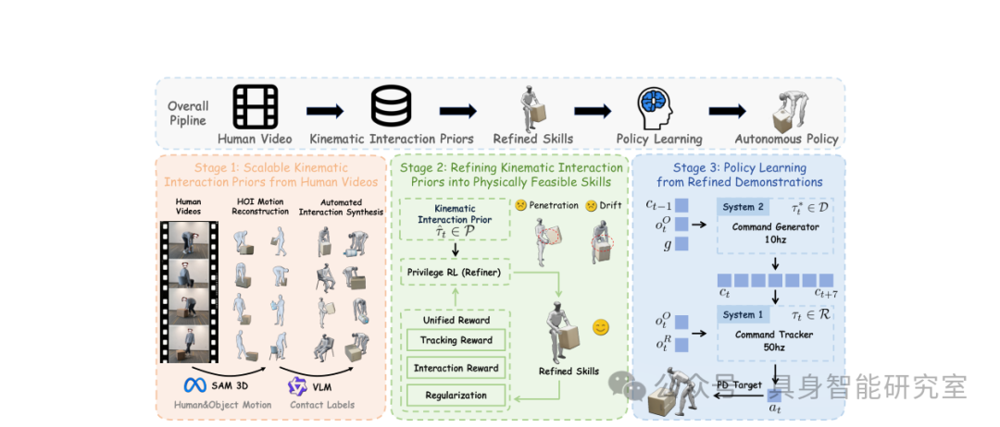

**算法实现总结：**SUGAR 主要解决数据闭环：用相机图像/多视角观测、本体状态与关节序列、人类视频/动捕轨迹采集人类操作和机器人状态，再通过AMP/运动先验、ACT/行为克隆模仿学习、扩散策略/流匹配转成可训练、可复用的可执行动作命令。关键点是把动作生成看成条件生成问题，用扩散或流匹配在多模态动作分布里采样可执行轨迹。

### 077 SkillBlender｜通过技能混合实现多样化人形全身移动操作

📌 论文基本信息

📝 **原文题目：** SkillBlender: Towards Versatile Humanoid Whole-Body Loco-Manipulation via Skill Blending

🏫 **机构：** University of Southern California、Stanford University、Peking University、University of California, Berkeley

🔗 **项目链接：** https://usc-gvl.github.io/SkillBlender-web/

📅 **发表日期：** 2025年6月11日

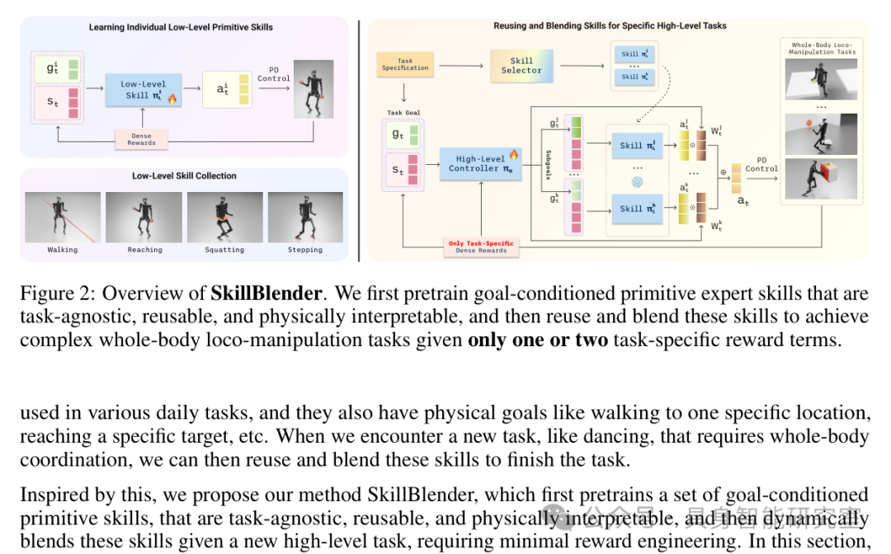

**算法实现总结：**SkillBlender 先从相机图像/多视角观测、本体状态与关节序列、接触力/触觉信号恢复场景、目标或运动表征，再用PPO/RL 策略训练、扩散策略/流匹配、全身控制器/WBC/MPC生成全身轨迹/动作序列。关键点是把动作生成看成条件生成问题，用扩散或流匹配在多模态动作分布里采样可执行轨迹。

### 078 StageACT｜鲁棒的人形开门的阶段条件模仿

📌 论文基本信息

📝 **原文题目：** StageACT: Stage-Conditioned Imitation for Robust Humanoid Door Opening

🏫 **机构：** StageACT: Stage-Conditioned Imitation for Robust

🔗 **项目链接：** https://icradooropen.github.io/icradooropen/

📅 **发表日期：** 2025年9月18日

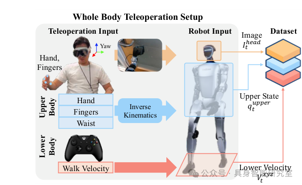

**算法实现总结：**StageACT 主要解决数据闭环：用相机图像/多视角观测、本体状态与关节序列、遥操作/外骨骼数据采集人类操作和机器人状态，再通过ACT/行为克隆模仿学习、扩散策略/流匹配、VLM 语义规划/路由转成可训练、可复用的可执行动作命令。关键点是把动作生成看成条件生成问题，用扩散或流匹配在多模态动作分布里采样可执行轨迹。

### 079 SynAgent｜通过单独与合作的智能体协同进行可推广的合作人形操作

📌 论文基本信息

📝 **原文题目：** SynAgent: Generalizable Cooperative Humanoid Manipulation via Solo-to-Cooperative Agent Synergy

🔗 **项目链接：** https://yw0208.github.io/synagent/

📅 **发表日期：** 2026年4月20日

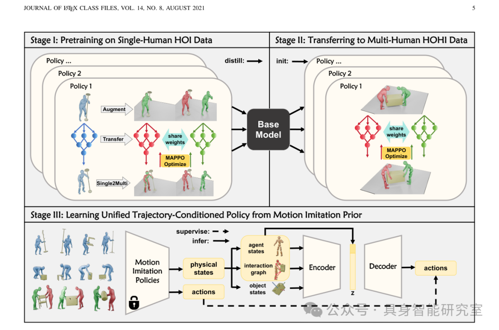

**算法实现总结：**SynAgent 先从相机图像/多视角观测恢复场景、目标或运动表征，再用教师-学生知识迁移、PPO/RL 策略训练、扩散策略/流匹配生成全身轨迹/动作序列、地形/场景表征。关键点是用特权信息训练教师策略，再把能力蒸馏到只能使用部署观测的学生策略。

### 080 TrajBooster｜通过以轨迹为中心的学习促进人形全身操作

📌 论文基本信息

📝 **原文题目：** TrajBooster: Boosting Humanoid Whole-Body Manipulation via Trajectory-Centric Learning

🏫 **机构：** Limited Teleoperation Data

🔗 **项目链接：** https://jiachengliu3.github.io/TrajBooster

📅 **发表日期：** 2026年3月19日

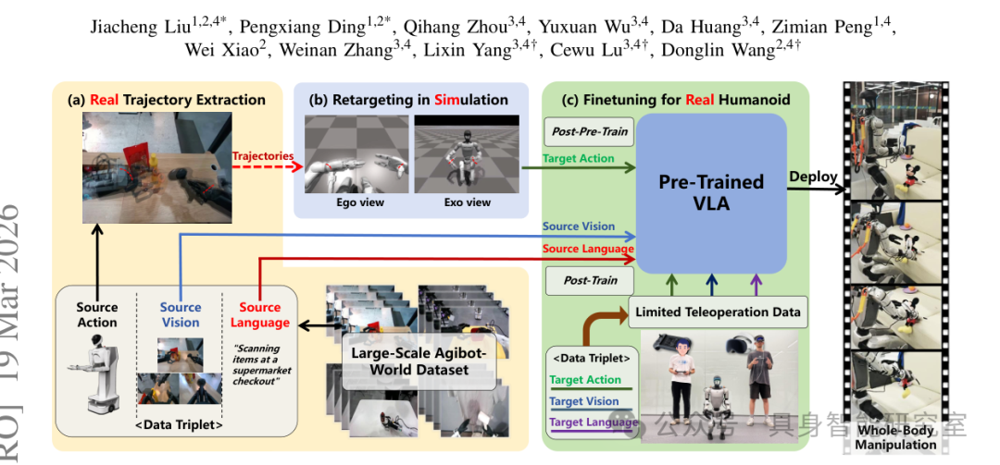

**算法实现总结：**TrajBooster 的实现路径是先把相机图像/多视角观测、本体状态与关节序列、遥操作/外骨骼数据编码成多模态表征，再用ACT/行为克隆模仿学习、VLA 多模态动作模型、IK/动作重定向预测全身轨迹/动作序列、末端执行器/腕手目标。关键点是保留 VLM 的语义理解，同时增加机器人状态和动作头，避免只停留在语言规划。

### 081 VIRAL｜大规模视觉模拟现实世界，用于人形移动操作

📌 论文基本信息

📝 **原文题目：** VIRAL: Visual Sim-to-Real at Scale for Humanoid Loco-Manipulation

🏫 **机构：** NVIDIA、CMU、UC Berkeley

🔗 **项目链接：** https://viral-humanoid.github.io

📅 **发表日期：** 2025年11月27日

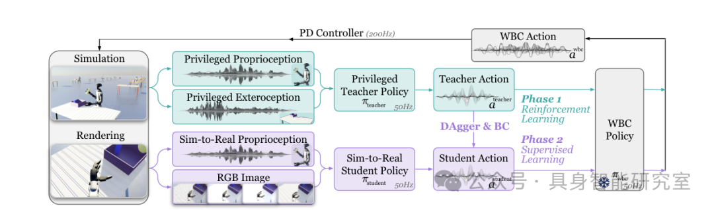

**算法实现总结：**VIRAL 主要解决数据闭环：用相机图像/多视角观测、本体状态与关节序列、遥操作/外骨骼数据采集人类操作和机器人状态，再通过教师-学生知识迁移、ACT/行为克隆模仿学习、分层技能/专家策略转成可训练、可复用的可执行动作命令。关键点是用特权信息训练教师策略，再把能力蒸馏到只能使用部署观测的学生策略。

### 082 VisualMimic｜通过运动跟踪和生成进行视觉人形移动操作

📌 论文基本信息

📝 **原文题目：** VisualMimic: Visual Humanoid Loco-Manipulation via Motion Tracking and Generation

🏫 **机构：** Stanford University

🔗 **项目链接：** https://visualmimic.github.io/

📅 **发表日期：** 2025年11月13日

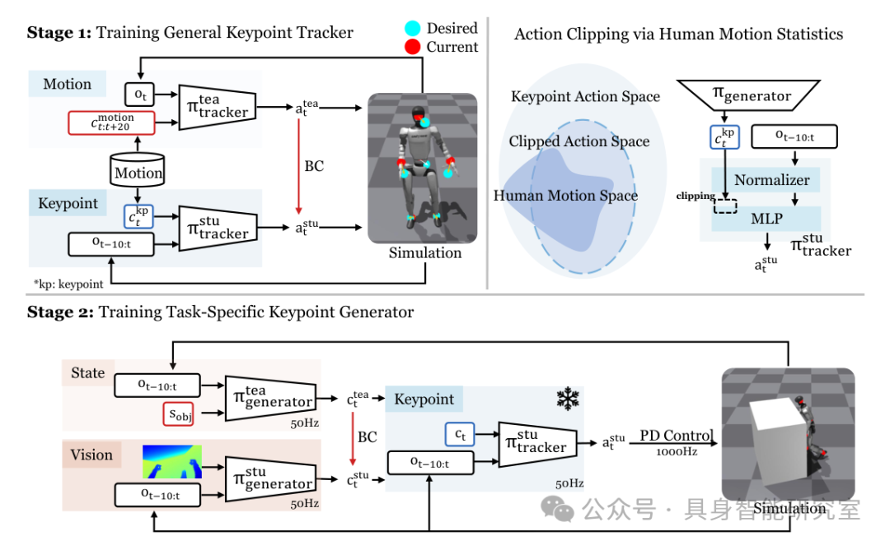

**算法实现总结：**VisualMimic 先从相机图像/多视角观测、本体状态与关节序列、人类视频/动捕轨迹恢复场景、目标或运动表征，再用教师-学生知识迁移、全身控制器/WBC/MPC生成可执行动作命令。关键点是用特权信息训练教师策略，再把能力蒸馏到只能使用部署观测的学生策略。

### 083 WholeBodyVLA｜迈向全身移动操作的统一潜在VLA

📌 论文基本信息

📝 **原文题目：** WholeBodyVLA: Towards Unified Latent VLA for Whole-Body Loco-Manipulation Control

🏫 **机构：** Fudan University、OpenDriveLab & MMLab at The University of Hong Kong

🔗 **项目链接：** https://opendrivelab.com/WholeBodyVLA

📅 **发表日期：** 2025年12月15日

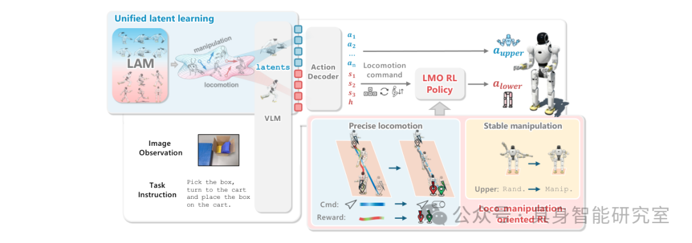

**算法实现总结：**WholeBodyVLA 的实现路径是先把相机图像/多视角观测、遥操作/外骨骼数据编码成多模态表征，再用VLA 多模态动作模型预测全身轨迹/动作序列。关键点是保留 VLM 的语义理解，同时增加机器人状态和动作头，避免只停留在语言规划。

### 084 人形操作接口｜基于机器人无关示范的人形全身操作

📌 论文基本信息

📝 **原文题目：** Humanoid Manipulation Interface: Humanoid Whole-Body Manipulation from Robot-Free Demonstrations

🏫 **机构：** ∗Equal contribution、Tsinghua University、Shanghai Qi Zhi Institute、Spirit.AI

🔗 **项目链接：** https://humanoid-manipulation-interface.github.io

📅 **发表日期：** 2026年2月12日

**算法实现总结：**这篇工作主要解决数据闭环：用相机图像/多视角观测、人类视频/动捕轨迹、遥操作/外骨骼数据采集人类操作和机器人状态，再通过PPO/RL 策略训练、分层技能/专家策略转成可训练、可复用的全身轨迹/动作序列。关键点是把任务拆成可路由的技能或专家策略，再用高层模块在执行中选择和组合。

### 085 人形机器人运动与操作｜控制规划和学习的进展与挑战

📌 论文基本信息

📝 **原文题目：** 人形机器人运动与操作

🏫 **机构：** Georgia Institute of Technology、The University of Southern California、Google DeepMind、The AI Institute

📅 **发表日期：** 2025年4月19日

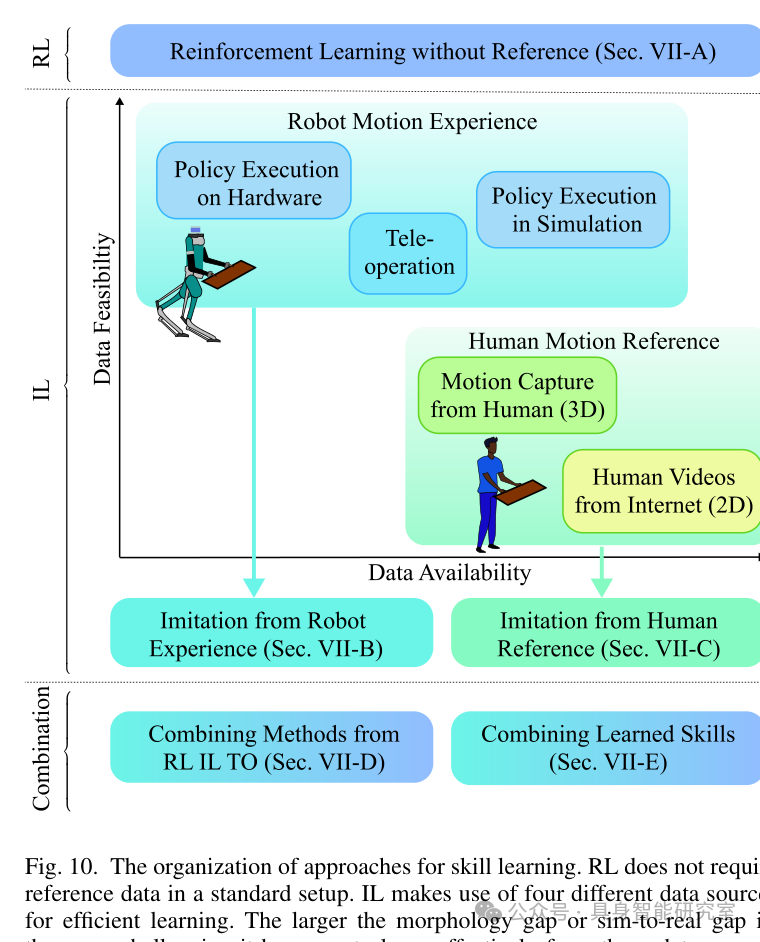

**算法实现总结：**这篇工作先从相机图像/多视角观测、本体状态与关节序列、接触力/触觉信号恢复场景、目标或运动表征，再用ACT/行为克隆模仿学习、扩散策略/流匹配、全身控制器/WBC/MPC生成可执行动作命令。关键点是把动作生成看成条件生成问题，用扩散或流匹配在多模态动作分布里采样可执行轨迹。

### 086 使用3D扩散策略的通用人形操作

📌 论文基本信息

📝 **原文题目：** Generalizable Humanoid Manipulation with 3D Diffusion Policies

🏫 **机构：** Stanford University、Simon Fraser University、CMU、imitation learning data and ) enable a full-sized humanoid robot to perform useful skills in diverse real-world environments

🔗 **项目链接：** https://humanoid-manipulation.github.io

📅 **发表日期：** 2025年9月9日

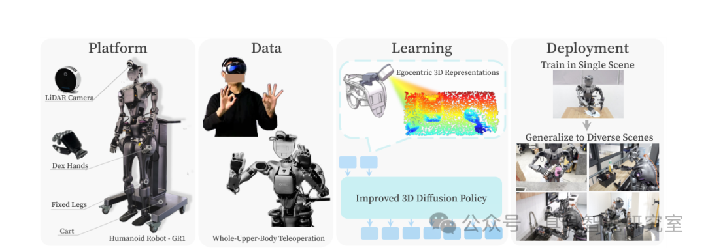

**算法实现总结：**使用3D扩散策略的通用人形操作 主要解决数据闭环：用相机图像/多视角观测、遥操作/外骨骼数据、深度/点云/高度图采集人类操作和机器人状态，再通过ACT/行为克隆模仿学习、扩散策略/流匹配、分层技能/专家策略转成可训练、可复用的可执行动作命令。关键点是把动作生成看成条件生成问题，用扩散或流匹配在多模态动作分布里采样可执行轨迹。

### 087 具有选择策略的协调人形操作

📌 论文基本信息

📝 **原文题目：** Coordinated Humanoid Manipulation with Choice Policies

🏫 **机构：** UC Berkeley

🔗 **项目链接：** https://choice-policy.github.io

📅 **发表日期：** 2025年12月31日

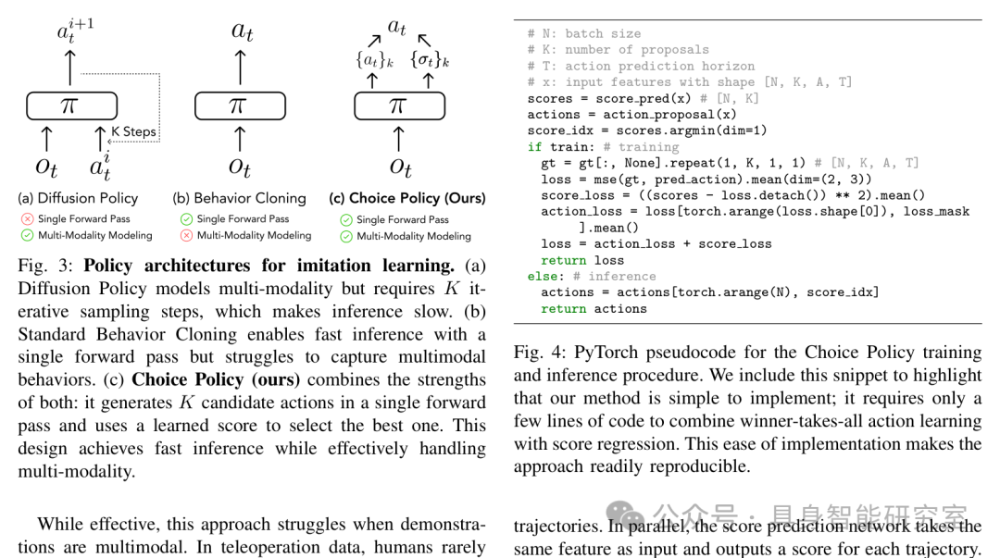

**算法实现总结：**这篇工作主要解决数据闭环：用相机图像/多视角观测、遥操作/外骨骼数据采集人类操作和机器人状态，再通过ACT/行为克隆模仿学习、扩散策略/流匹配转成可训练、可复用的可执行动作命令。关键点是把动作生成看成条件生成问题，用扩散或流匹配在多模态动作分布里采样可执行轨迹。

### 088 基于基础模型的自主人形抓取快速部署管道

📌 论文基本信息

📝 **原文题目：** A Rapid Deployment Pipeline for Autonomous Humanoid Grasping Based on Foundation Models

🏫 **机构：** reconstruction systems such as Meta SAM、D [] can gen-

🔗 **项目链接：** https://linqi-ye.github.io/video/

📅 **发表日期：** 2026年4月19日

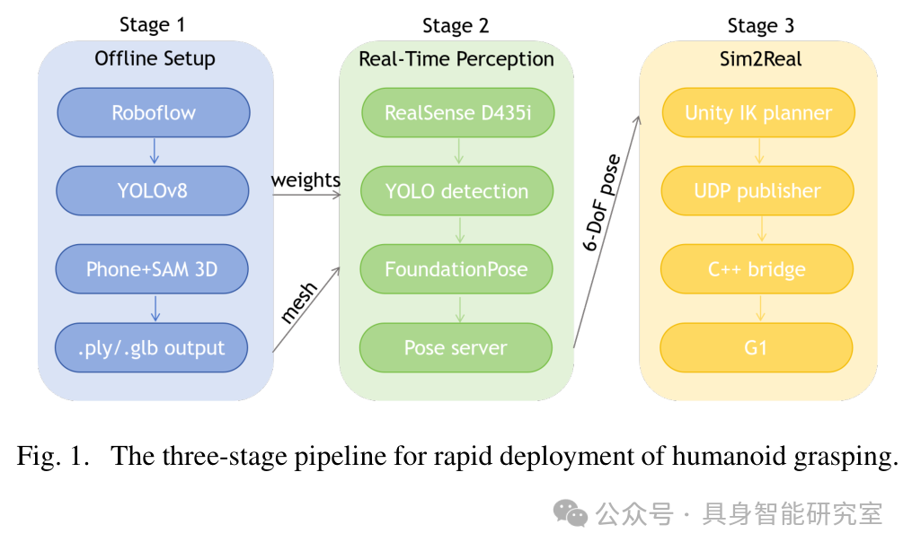

**算法实现总结：**这篇工作先从相机图像/多视角观测、本体状态与关节序列、深度/点云/高度图恢复场景、目标或运动表征，再用扩散策略/流匹配、IK/动作重定向生成关节位置/力矩命令、地形/场景表征。关键点是把动作生成看成条件生成问题，用扩散或流匹配在多模态动作分布里采样可执行轨迹。

### 089 打开仿真到现实世界的人形像素到动作策略传输之门

📌 论文基本信息

📝 **原文题目：** Opening the Sim-to-Real Door for Humanoid Pixel-to-Action Policy Transfer

🏫 **机构：** NVIDIA、UC Berkeley、CMU

🔗 **项目链接：** https://doorman-humanoid.github.io/

📅 **发表日期：** 2025年11月30日

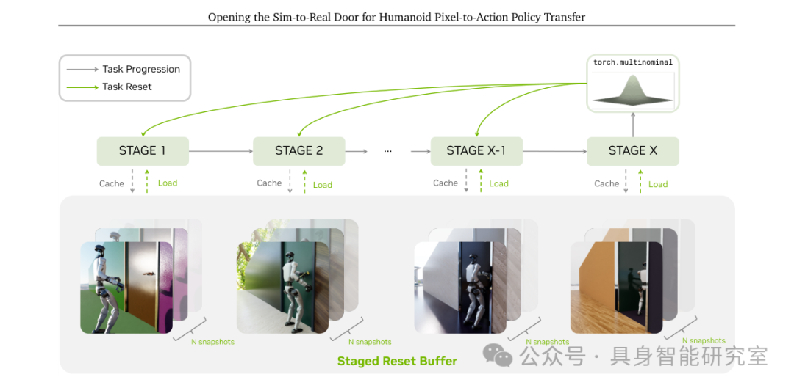

**算法实现总结：**这篇工作主要解决数据闭环：用相机图像/多视角观测、本体状态与关节序列、遥操作/外骨骼数据采集人类操作和机器人状态，再通过教师-学生知识迁移、全身控制器/WBC/MPC、闭环纠错/人类干预转成可训练、可复用的可执行动作命令。关键点是用特权信息训练教师策略，再把能力蒸馏到只能使用部署观测的学生策略。

### 090 通过带有多模态基础模型的具体行动链推理的人形智能体用于零样本移动操作

📌 论文基本信息

📝 **原文题目：** Ego-Vision World Model for Humanoid Contact Planning

🔗 **项目链接：** https://ego-vcp.github.io/

📅 **发表日期：** 2026年3月8日

**算法实现总结：**这篇工作先从相机图像/多视角观测、本体状态与关节序列、深度/点云/高度图恢复场景、目标或运动表征，再用PPO/RL 策略训练、扩散策略/流匹配、世界模型/视频预测生成低层控制器目标、地形/场景表征。关键点是把动作生成看成条件生成问题，用扩散或流匹配在多模态动作分布里采样可执行轨迹。

### 091 通过真实部署就绪的技能空间释放人形机器人的潜力

📌 论文基本信息

📝 **原文题目：** Unleashing Humanoid Reaching Potential via Real-world-Ready Skill Space

🏫 **机构：** IEEE ROBOTICS AND AUTOMATION LETTERS. PREPRINT VERSION. ACCEPTED NOVEMBER

🔗 **项目链接：** https://zzk273.github.io/R2S2/

📅 **发表日期：** 2025年12月18日

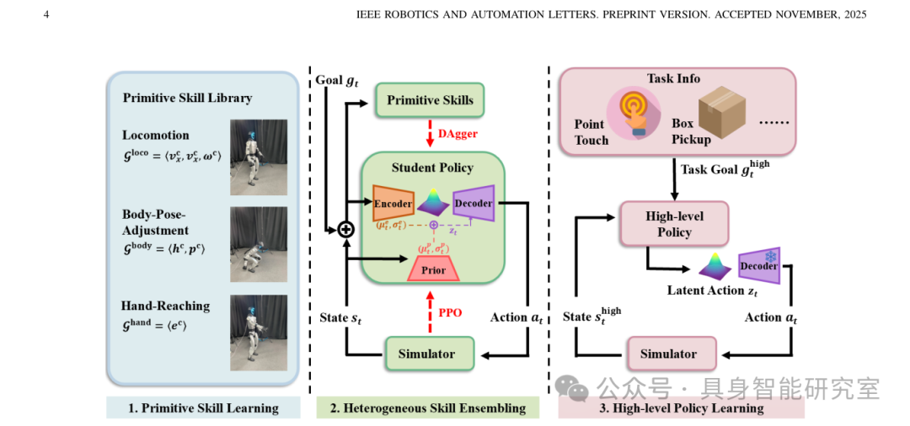

**算法实现总结：**这篇工作主要解决数据闭环：用相机图像/多视角观测、遥操作/外骨骼数据、仿真交互数据采集人类操作和机器人状态，再通过扩散策略/流匹配、全身控制器/WBC/MPC、分层技能/专家策略转成可训练、可复用的低层控制器目标。关键点是把动作生成看成条件生成问题，用扩散或流匹配在多模态动作分布里采样可执行轨迹。

### 092 通过触摸梦学习多样化人形操作

📌 论文基本信息

📝 **原文题目：** Learning Versatile Humanoid Manipulation with Touch Dreaming

🏫 **机构：** Carnegie Mellon University、UT Arlington、Bosch Center for AI、deformable objects (towel folding). B: mixed prehensile and non-prehensile manipulation for thin-profile rigid objects with limited grasp

🔗 **项目链接：** https://humanoid-touch-dream.github.io/

📅 **发表日期：** 2026年4月27日

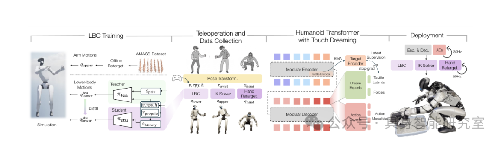

**算法实现总结：**这篇工作主要解决数据闭环：用相机图像/多视角观测、本体状态与关节序列、遥操作/外骨骼数据采集人类操作和机器人状态，再通过PPO/RL 策略训练、扩散策略/流匹配、MM-DiT/Transformer 动作头转成可训练、可复用的末端执行器/腕手目标、动作 chunk/token。关键点是把动作生成看成条件生成问题，用扩散或流匹配在多模态动作分布里采样可执行轨迹。

## 04生成式运动、语言控制与轨迹规划

这一组关注扩散、流匹配、语言条件和轨迹生成如何进入人形运动规划。

### 093 DreamControl｜通过引导扩散实现场景交互的仿人全身人形控制

📌 论文基本信息

📝 **原文题目：** DreamControl: Human-Inspired Whole-Body Humanoid Control for Scene Interaction via Guided Diffusion

🔗 **项目链接：** https://genrobo.github.io/DreamControl/

📅 **发表日期：** 2025年9月30日

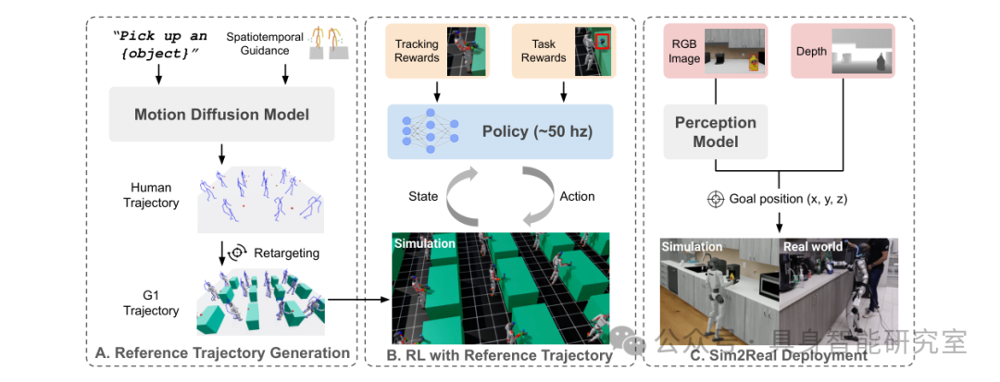

**算法实现总结：**DreamControl 先从本体状态与关节序列、人类视频/动捕轨迹、仿真交互数据恢复场景、目标或运动表征，再用PPO/RL 策略训练、扩散策略/流匹配、分层技能/专家策略生成全身轨迹/动作序列、地形/场景表征。关键点是把动作生成看成条件生成问题，用扩散或流匹配在多模态动作分布里采样可执行轨迹。

### 094 EMOTION｜通过上下文学习为人形机器人生成富有表现力的运动序列

📌 论文基本信息

📝 **原文题目：** EMOTION: Expressive Motion Sequence Generation for Humanoid Robots with In-Context Learning

📅 **发表日期：** 2024年10月30日

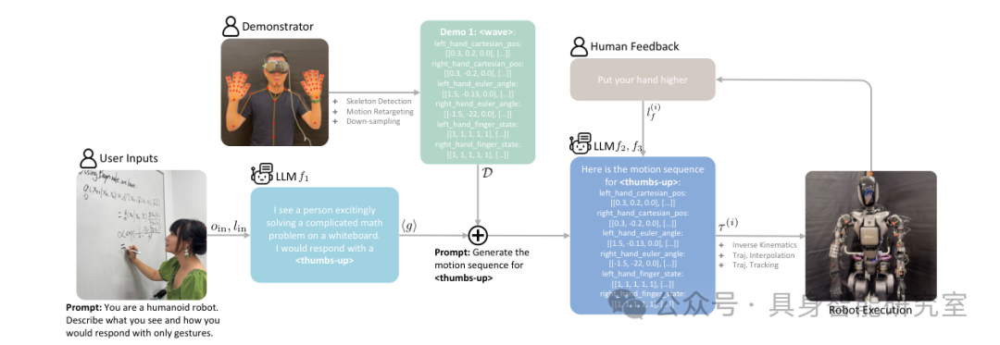

**算法实现总结：**EMOTION 先从视觉、状态和动作数据恢复场景、目标或运动表征，再用策略网络和控制模块生成全身轨迹/动作序列。关键点是把策略网络和控制模块放在同一条训练/部署链路里，减少高层目标到低层动作之间的断点。

### 095 EgoPriMo｜用于交互式人形控制的第一视角运动生成

📌 论文基本信息

📝 **原文题目：** EgoPriMo: Egocentric Motion Generation for Interactive Humanoid Control

🏫 **机构：** Tianjin University, Tianjin, China、Beihang University, Beijing, China、Zhongguancun Institute of Artificial Intelligence, Beijing, China

📅 **发表日期：** 2026年6月7日

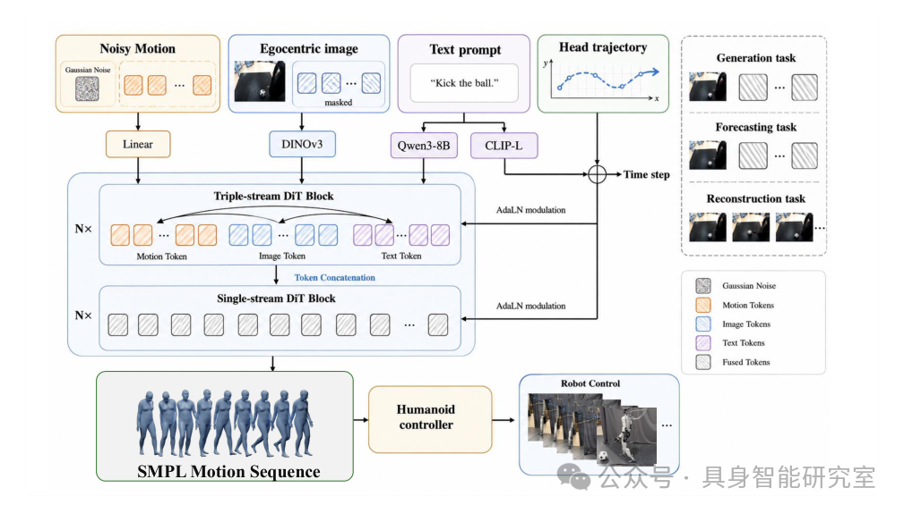

**算法实现总结：**EgoPriMo 的实现路径是先把语言指令、相机图像/多视角观测、本体状态与关节序列编码成多模态表征，再用AMP/运动先验、ACT/行为克隆模仿学习、扩散策略/流匹配预测全身轨迹/动作序列。关键点是保留 VLM 的语义理解，同时增加机器人状态和动作头，避免只停留在语言规划。

### 096 FRoM-W1｜通过语言指令实现通用人形全身控制

📌 论文基本信息

📝 **原文题目：** FRoM-W1: Towards General Humanoid Whole-Body Control with Language Instructions

🏫 **机构：** Fudan University、Shanghai Innovation Institute

🔗 **项目链接：** https://openmoss.github.io/FRoM-W1

📅 **发表日期：** 2026年1月19日

**算法实现总结：**FRoM-W1 先从语言指令、本体状态与关节序列、仿真交互数据恢复场景、目标或运动表征，再用PPO/RL 策略训练、ACT/行为克隆模仿学习、VLM 语义规划/路由生成全身轨迹/动作序列。关键点是把示范轨迹压成可监督的动作预测问题，再通过动作 chunk 或闭环执行降低时序抖动。

### 097 Harmon｜从语言描述生成人形机器人的全身运动

📌 论文基本信息

📝 **原文题目：** HARMON: Whole-Body Motion Generation of Humanoid Robots from Language Descriptions

🏫 **机构：** The University of Texas at Austin、NVIDIA Research

🔗 **项目链接：** https://ut-austin-rpl.github.io/Harmon/

📅 **发表日期：** 2024年10月16日

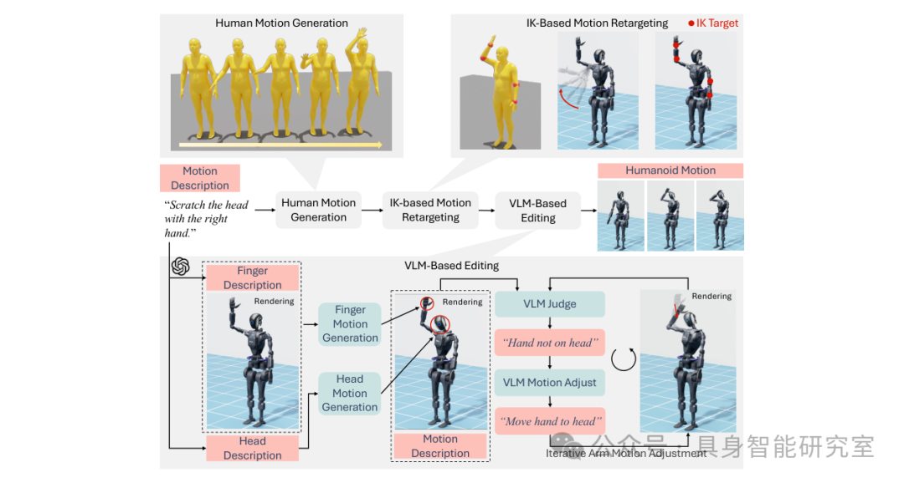

**算法实现总结：**Harmon 先从语言指令、本体状态与关节序列、人类视频/动捕轨迹恢复场景、目标或运动表征，再用AMP/运动先验、扩散策略/流匹配、VLM 语义规划/路由生成全身轨迹/动作序列。关键点是把动作生成看成条件生成问题，用扩散或流匹配在多模态动作分布里采样可执行轨迹。

### 098 LangWBC｜通过端到端学习进行语言指导的人形全身控制

📌 论文基本信息

📝 **原文题目：** LangWBC: Language-directed Humanoid Whole-Body Control via End-to-end Learning

🏫 **机构：** University of California, Berkeley

🔗 **项目链接：** https://LangWBC.github.io

📅 **发表日期：** 2025年4月30日

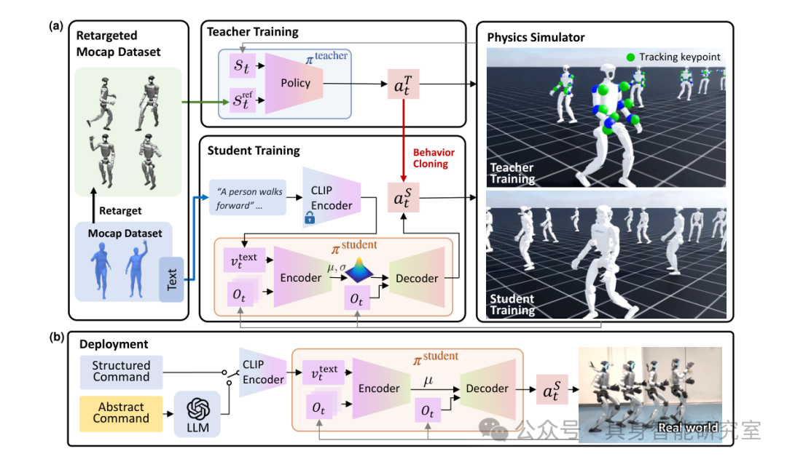

**算法实现总结：**LangWBC 先从语言指令、本体状态与关节序列、仿真交互数据恢复场景、目标或运动表征，再用教师-学生知识迁移、PPO/RL 策略训练、扩散策略/流匹配生成全身轨迹/动作序列、低层控制器目标。关键点是用特权信息训练教师策略，再把能力蒸馏到只能使用部署观测的学生策略。

### 099 MotionDisco｜用于极端人形移动操作的运动发现

📌 论文基本信息

📝 **原文题目：** MotionDisco: Motion Discovery for Extreme Humanoid Loco-Manipulation

🏫 **机构：** Technical University of Munich, Germany、New York University, USA、Carnegie Mellon University, USA

🔗 **项目链接：** https://atarilab.github.io/motiondisco.io/

📅 **发表日期：** 2026年6月4日

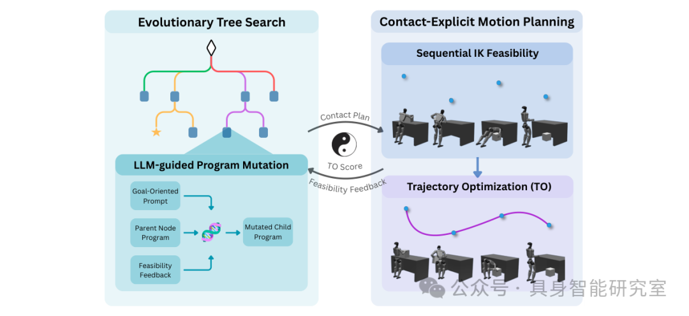

**算法实现总结：**MotionDisco 主要解决数据闭环：用遥操作/外骨骼数据、接触力/触觉信号采集人类操作和机器人状态，再通过ACT/行为克隆模仿学习、IK/动作重定向、分层技能/专家策略转成可训练、可复用的全身轨迹/动作序列。关键点是把任务拆成可路由的技能或专家策略，再用高层模块在执行中选择和组合。

### 100 MotionWAM｜迈向实时人形移动操作的基础世界行动模型

📌 论文基本信息

📝 **原文题目：** MotionWAM: Towards Foundation World Action Models for Real-Time Humanoid Loco-Manipulation

🏫 **机构：** Mondo Robotics、HKUST (GZ)、HKUST

🔗 **项目链接：** https://huggingface.co/collections/unitreerobotics/unifolm-wbt-dataset

📅 **发表日期：** 2026年6月8日

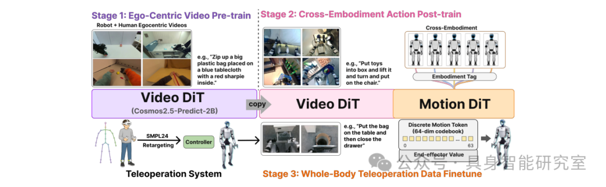

**算法实现总结：**MotionWAM 的实现路径是先把相机图像/多视角观测、本体状态与关节序列编码成多模态表征，再用ACT/行为克隆模仿学习、扩散策略/流匹配、VLA 多模态动作模型预测全身轨迹/动作序列、低层控制器目标、地形/场景表征。关键点是让视频/世界模型提供可预测的物理先验，再由动作头把语义目标变成连续控制。

### 101 OMG｜用于通用人形控制的全模态运动生成

📌 论文基本信息

📝 **原文题目：** OMG: Omni-Modal Motion Generation for Generalist Humanoid Control

🏫 **机构：** Tsinghua University

🔗 **项目链接：** https://tsinghua-mars-lab.github.io/OMG/

📅 **发表日期：** 2026年6月9日

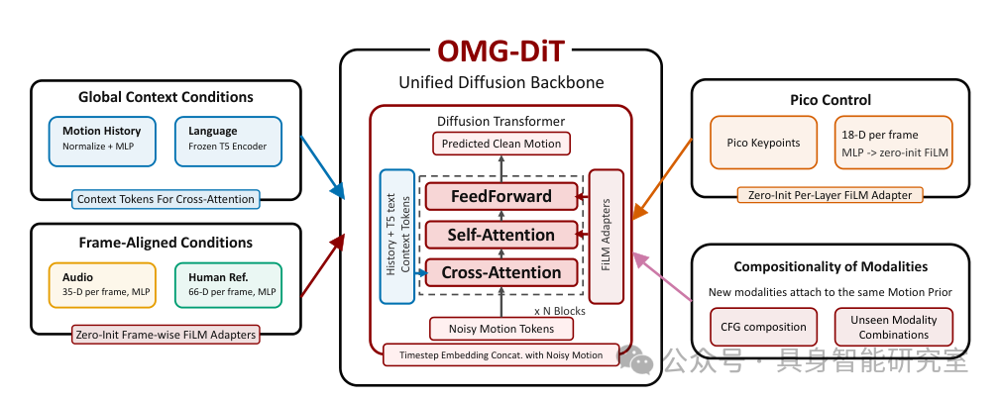

**算法实现总结：**OMG 先从本体状态与关节序列恢复场景、目标或运动表征，再用扩散策略/流匹配、VLM 语义规划/路由、全身控制器/WBC/MPC生成全身轨迹/动作序列、低层控制器目标、地形/场景表征。关键点是把动作生成看成条件生成问题，用扩散或流匹配在多模态动作分布里采样可执行轨迹。

### 102 Robot Motion Diffusion Model｜机器人角色的运动生成

📌 论文基本信息

📝 **原文题目：** Robot Motion Diffusion Model: Motion Generation for Robotic Characters

🔗 **项目链接：** https://la.disneyresearch.com/publication/robot-motion-diffusion-model-motion-generation-for-robotic-characters/

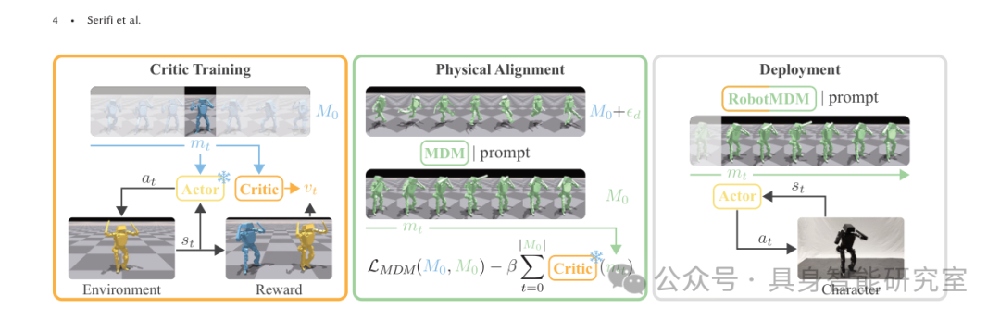

**算法实现总结：**Robot Motion Diffusion Model 先从本体状态与关节序列、仿真交互数据、接触力/触觉信号恢复场景、目标或运动表征，再用PPO/RL 策略训练、ACT/行为克隆模仿学习、扩散策略/流匹配生成全身轨迹/动作序列。关键点是把动作生成看成条件生成问题，用扩散或流匹配在多模态动作分布里采样可执行轨迹。

### 103 SONIC｜超大运动跟踪，实现自然人形全身控制

📌 论文基本信息

📝 **原文题目：** SONIC: Supersizing Motion Tracking for Natural Humanoid Whole-Body Control

🏫 **机构：** NVIDIA

🔗 **项目链接：** https://nvlabs.github.io/GEAR-SONIC/

📅 **发表日期：** 2026年5月21日

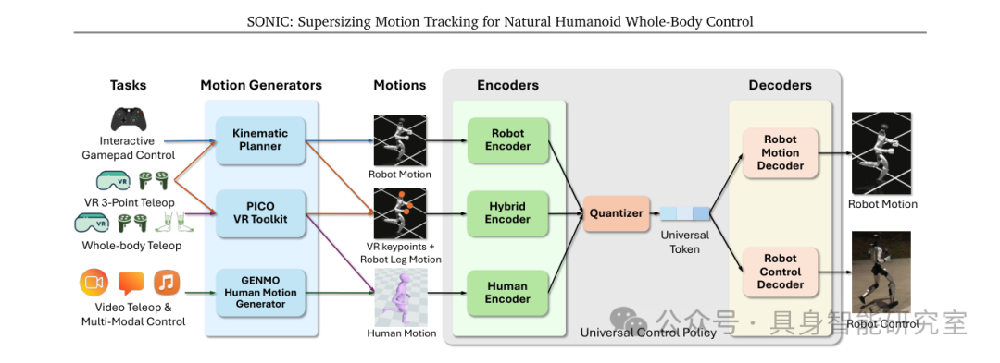

**算法实现总结：**SONIC 的实现路径是先把人类视频/动捕轨迹、遥操作/外骨骼数据编码成多模态表征，再用AMP/运动先验、VLA 多模态动作模型预测全身轨迹/动作序列。关键点是保留 VLM 的语义理解，同时增加机器人状态和动作头，避免只停留在语言规划。

### 104 SafeFlow｜通过物理引导整流流和选择性安全门控进行实时文本驱动的人形全身控制

📌 论文基本信息

📝 **原文题目：** SafeFlow: Real-Time Text-Driven Humanoid Whole-Body Control via Physics-Guided Rectified Flow and Selective Safety Gating

🔗 **项目链接：** https://hanbyelcho.info/safeflow/

📅 **发表日期：** 2026年3月25日

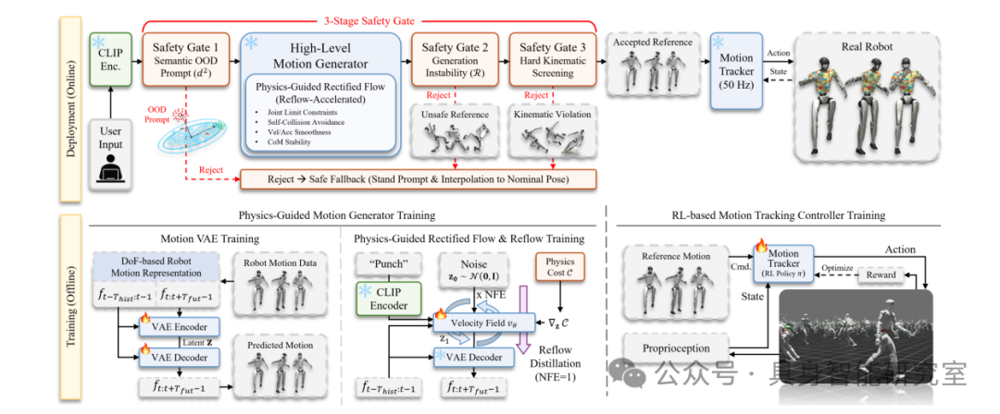

**算法实现总结：**SafeFlow 先从本体状态与关节序列恢复场景、目标或运动表征，再用扩散策略/流匹配、全身控制器/WBC/MPC、分层技能/专家策略生成全身轨迹/动作序列。关键点是把动作生成看成条件生成问题，用扩散或流匹配在多模态动作分布里采样可执行轨迹。

### 105 TextOp｜实时交互式文本驱动的仿人机器人运动生成和控制

📌 论文基本信息

📝 **原文题目：** TextOp: Real-time Interactive Text-Driven Humanoid Robot Motion Generation and Control

🏫 **机构：** Institute of Artificial Intelligence (TeleAI), China Telecom、Shanghai Jiao Tong University、East China University of Science and Technology

🔗 **项目链接：** https://text-op.github.io/

📅 **发表日期：** 2026年2月7日

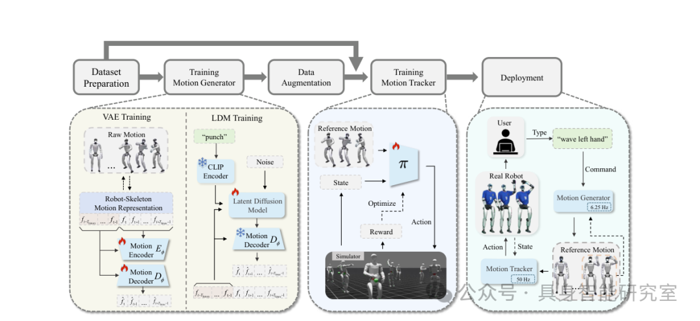

**算法实现总结：**TextOp 主要解决数据闭环：用语言指令、遥操作/外骨骼数据采集人类操作和机器人状态，再通过扩散策略/流匹配、全身控制器/WBC/MPC转成可训练、可复用的全身轨迹/动作序列。关键点是把动作生成看成条件生成问题，用扩散或流匹配在多模态动作分布里采样可执行轨迹。

### 106 从语言到运动｜通过动作潜变量指导实现免重定向人形控制

📌 论文基本信息

📝 **原文题目：** From Language to Locomotion: Retargeting-free Humanoid Control via Motion Latent Guidance

🏫 **机构：** University of Sydney, BAAI, Harbin Institute of Technology、Hong Kong University of Science and Technology, Shanghai Jiao Tong University、Peking University

🔗 **项目链接：** https://gentlefress.github.io/roboghost-proj/

📅 **发表日期：** 2025年10月17日

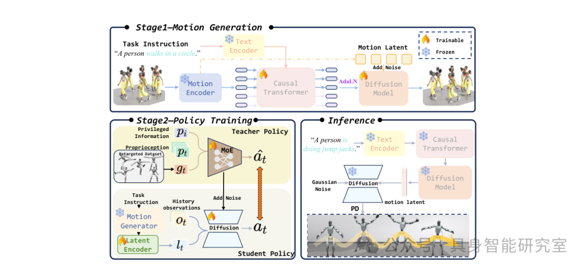

**算法实现总结：**这篇工作先从语言指令、相机图像/多视角观测、人类视频/动捕轨迹恢复场景、目标或运动表征，再用扩散策略/流匹配、MM-DiT/Transformer 动作头、IK/动作重定向生成全身轨迹/动作序列。关键点是把动作生成看成条件生成问题，用扩散或流匹配在多模态动作分布里采样可执行轨迹。

### 107 使用潜在扩散模型进行物理一致的人形移动操作

📌 论文基本信息

📝 **原文题目：** Physically Consistent Humanoid Loco-Manipulation using Latent Diffusion Models

📅 **发表日期：** 2025年4月23日

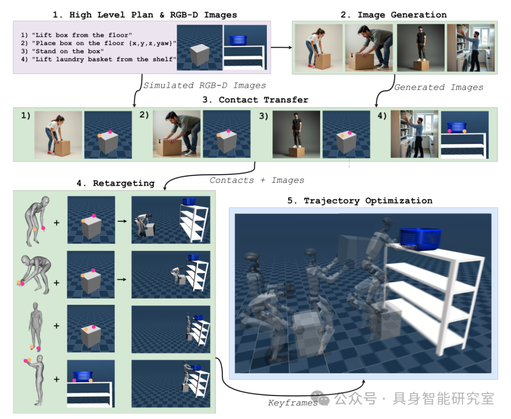

**算法实现总结：**这篇工作先从相机图像/多视角观测、本体状态与关节序列、仿真交互数据恢复场景、目标或运动表征，再用扩散策略/流匹配、VLM 语义规划/路由生成全身轨迹/动作序列。关键点是把动作生成看成条件生成问题，用扩散或流匹配在多模态动作分布里采样可执行轨迹。

### 108 揭示数据和模型扩展对人形机器人高级控制的影响

📌 论文基本信息

📝 **原文题目：** Unveiling the Impact of Data and Model Scaling on High-Level Control for Humanoid Robots

🏫 **机构：** Shanghai Jiao Tong University、Shanghai AI Laboratory、Zhejiang University、University of Michigan

🔗 **项目链接：** https://vfishc.github.io/schur/

📅 **发表日期：** 2025年12月7日

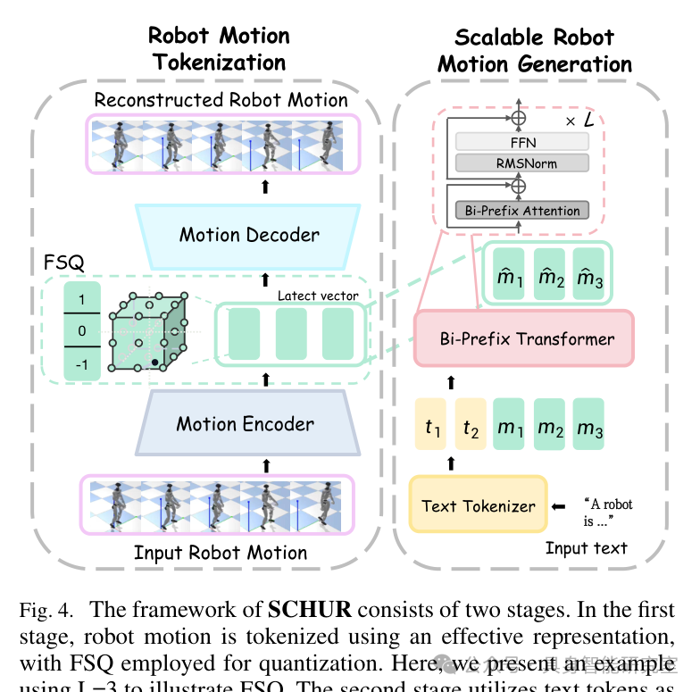

**算法实现总结：**这篇工作先从人类视频/动捕轨迹恢复场景、目标或运动表征，再用扩散策略/流匹配生成全身轨迹/动作序列。关键点是把动作生成看成条件生成问题，用扩散或流匹配在多模态动作分布里采样可执行轨迹。

## 05动捕、人类视频与交互动作规划

这一组从人类动作、动捕或视频出发，讨论如何变成机器人可跟踪、可交互的动作。

### 109 FALCON｜学习力自适应人形移动操作

📌 论文基本信息

📝 **原文题目：** FALCON: Learning Force-Adaptive Humanoid Loco-Manipulation

🏫 **机构：** Carnegie Mellon University

🔗 **项目链接：** https://lecar-lab.github.io/falcon-humanoid

📅 **发表日期：** 2025年11月16日

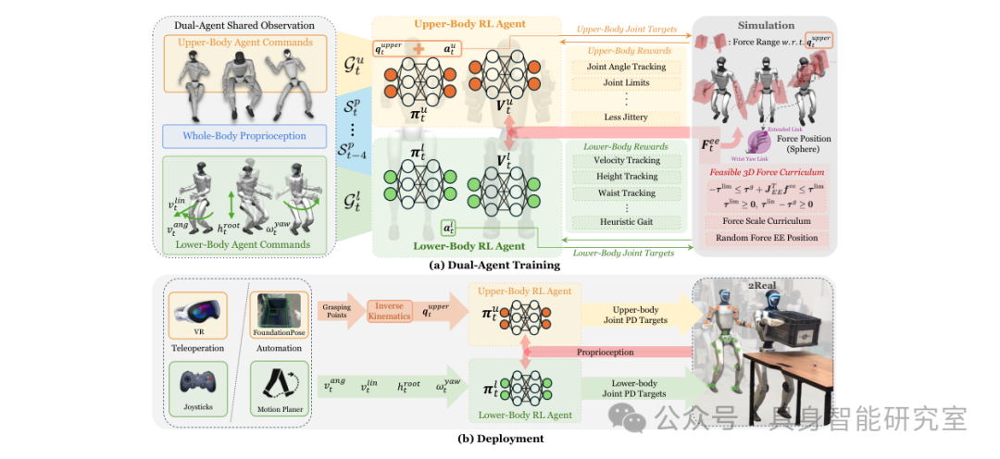

**算法实现总结：**FALCON 主要解决数据闭环：用本体状态与关节序列、人类视频/动捕轨迹、遥操作/外骨骼数据采集人类操作和机器人状态，再通过全身控制器/WBC/MPC转成可训练、可复用的关节位置/力矩命令、末端执行器/腕手目标。关键点是把全身控制器/WBC/MPC放在同一条训练/部署链路里，减少高层目标到低层动作之间的断点。

### 110 HDMI｜从人类视频中学习交互式人形全身控制

📌 论文基本信息

📝 **原文题目：** HDMI: Learning Interactive Humanoid Whole-Body Control from Human Videos

🔗 **项目链接：** https://hdmi-humanoid.github.io

📅 **发表日期：** 2025年9月27日

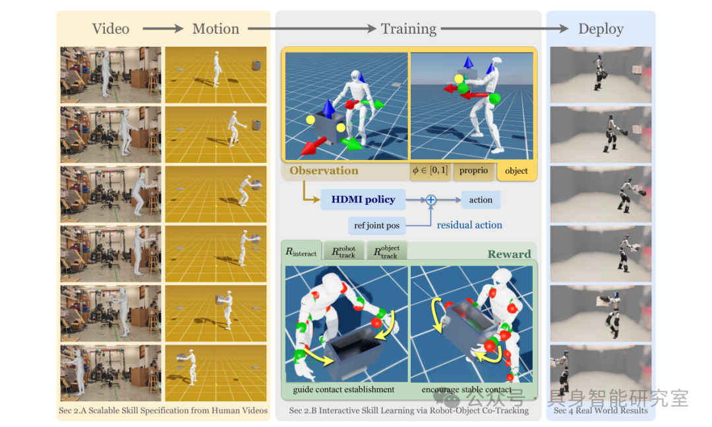

**算法实现总结：**HDMI 先从相机图像/多视角观测、本体状态与关节序列、人类视频/动捕轨迹恢复场景、目标或运动表征，再用IK/动作重定向、分层技能/专家策略生成全身轨迹/动作序列。关键点是把任务拆成可路由的技能或专家策略，再用高层模块在执行中选择和组合。

### 111 HITTER｜通过分层规划和学习的人形乒乓球机器人

📌 论文基本信息

📝 **原文题目：** HITTER: A HumanoId Table TEnnis Robot via Hierarchical Planning and Learning

🔗 **项目链接：** https://humanoid-table-tennis.github.io

📅 **发表日期：** 2025年9月4日

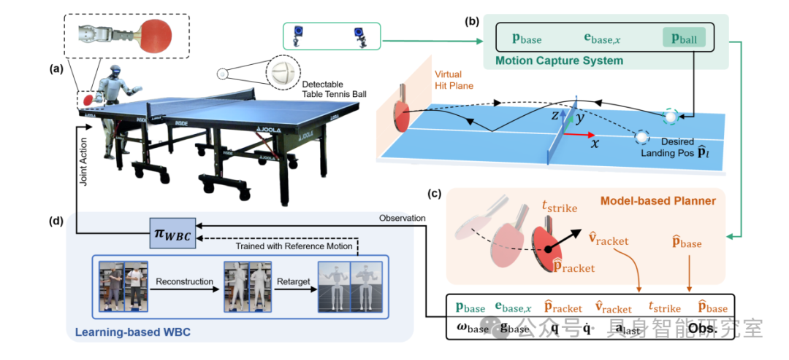

**算法实现总结：**HITTER 先从人类视频/动捕轨迹、接触力/触觉信号恢复场景、目标或运动表征，再用PPO/RL 策略训练、ACT/行为克隆模仿学习、全身控制器/WBC/MPC生成全身轨迹/动作序列、低层控制器目标。关键点是把任务拆成可路由的技能或专家策略，再用高层模块在执行中选择和组合。

### 112 HumanX｜从人类视频中走向敏捷和可推广的人形交互技能

📌 论文基本信息

📝 **原文题目：** HumanX: Toward Agile and Generalizable Humanoid Interaction Skills from Human Videos

🏫 **机构：** The Hong Kong University of Science and Technology、Shanghai AI Laboratory

🔗 **项目链接：** https://wyhuai.github.io/human-x/

📅 **发表日期：** 2026年2月2日

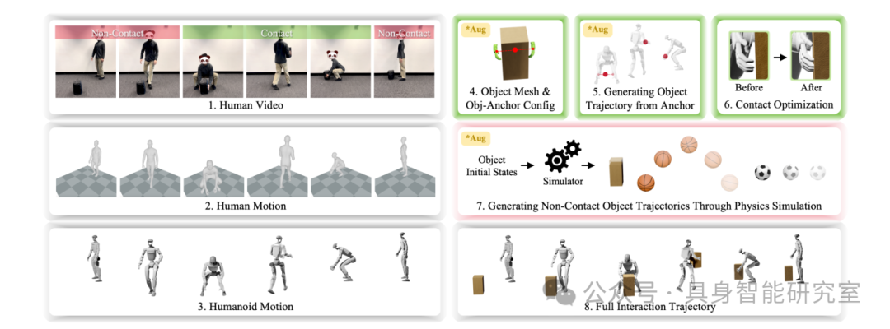

**算法实现总结：**HumanX 先从人类视频/动捕轨迹恢复场景、目标或运动表征，再用ACT/行为克隆模仿学习、IK/动作重定向、分层技能/专家策略生成可执行动作命令。关键点是把任务拆成可路由的技能或专家策略，再用高层模块在执行中选择和组合。

### 113 Humanoid｜Goalkeeper 从位置条件任务运动约束中学习

📌 论文基本信息

📝 **原文题目：** Humanoid Goalkeeper: Learning from Position Conditioned Task-Motion Constraints

🏫 **机构：** The University of Hong Kong、Shanghai AI Laboratory

🔗 **项目链接：** https://github.com/InternRobotics/Humanoid-Goalkeeper

📅 **发表日期：** 2026年3月14日

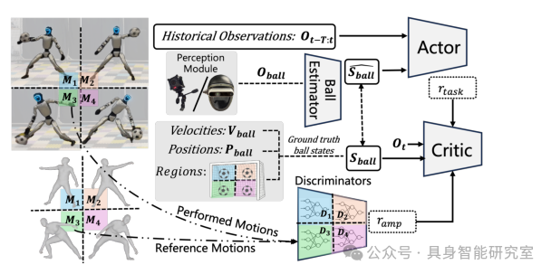

**算法实现总结：**Humanoid 主要解决数据闭环：用人类视频/动捕轨迹、遥操作/外骨骼数据、接触力/触觉信号采集人类操作和机器人状态，再通过PPO/RL 策略训练、AMP/运动先验、扩散策略/流匹配转成可训练、可复用的可执行动作命令。关键点是把动作生成看成条件生成问题，用扩散或流匹配在多模态动作分布里采样可执行轨迹。

### 114 OmniRetarget｜人形全身移动操作和场景交互的交互保存数据生成

📌 论文基本信息

📝 **原文题目：** OmniRetarget: Interaction-Preserving Data Generation for Humanoid Whole-Body Loco-Manipulation and Scene Interaction

🏫 **机构：** Amazon FAR (Frontier AI & Robotics)、MIT、UC Berkeley、Stanford University

🔗 **项目链接：** https://omniretarget.github.io

📅 **发表日期：** 2026年6月15日

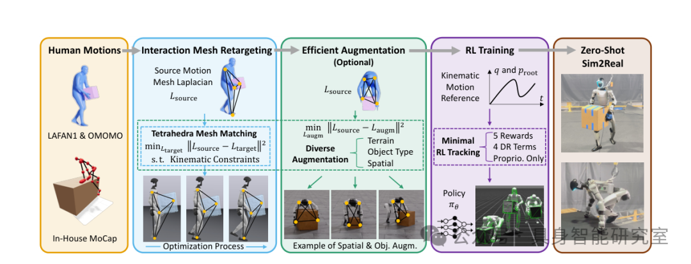

**算法实现总结：**OmniRetarget 先从本体状态与关节序列、人类视频/动捕轨迹、接触力/触觉信号恢复场景、目标或运动表征，再用PPO/RL 策略训练、ACT/行为克隆模仿学习、IK/动作重定向生成全身轨迹/动作序列、地形/场景表征。关键点是把任务拆成可路由的技能或专家策略，再用高层模块在执行中选择和组合。

### 115 ResMimic｜从一般运动跟踪到通过残差学习的人形全身移动操作

📌 论文基本信息

📝 **原文题目：** ResMimic: From General Motion Tracking to Humanoid Whole-body Loco-Manipulation via Residual Learning

🏫 **机构：** Amazon FAR (Frontier AI & Robotics)、Stanford University、UC Berkeley、CMU

🔗 **项目链接：** https://resmimic.github.io/

📅 **发表日期：** 2025年10月8日

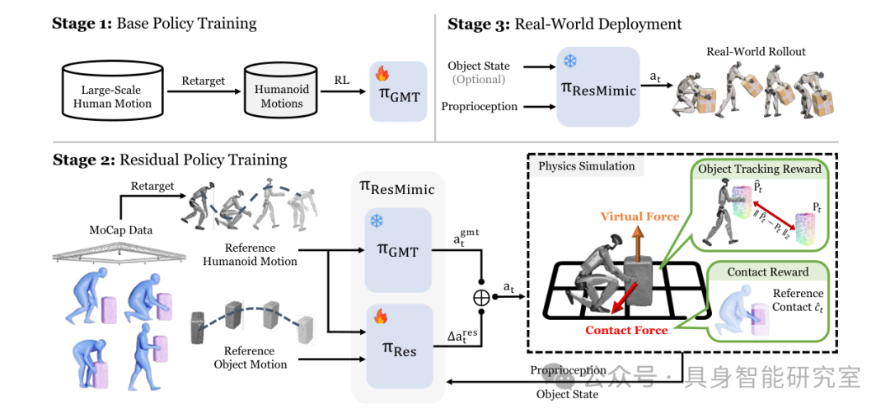

**算法实现总结：**ResMimic 先从本体状态与关节序列、人类视频/动捕轨迹、仿真交互数据恢复场景、目标或运动表征，再用策略网络和控制模块生成全身轨迹/动作序列。关键点是把策略网络和控制模块放在同一条训练/部署链路里，减少高层目标到低层动作之间的断点。

### 116 WoCoCo｜通过顺序接触学习全身人形控制

📌 论文基本信息

📝 **原文题目：** WoCoCo: Learning Whole-Body Humanoid Control with Sequential Contacts

🏫 **机构：** ETH Zurich、⋆Work was done at Carnegie Mellon University、Carnegie Mellon University

🔗 **项目链接：** https://lecar-lab.github.io/wococo/

📅 **发表日期：** 2024年11月7日

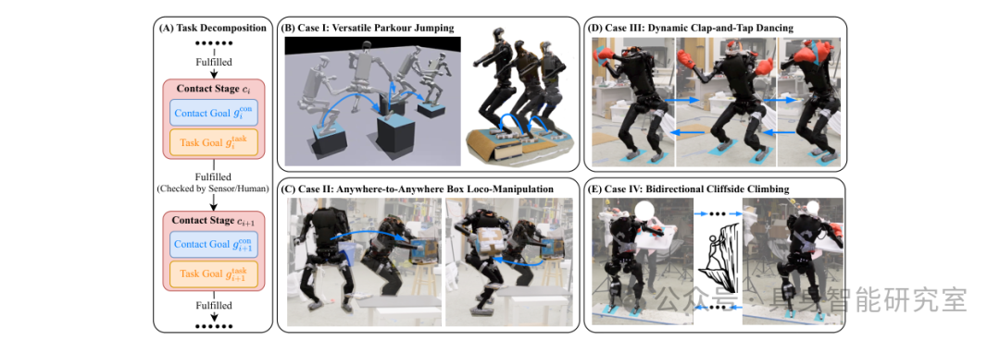

**算法实现总结：**WoCoCo 先从本体状态与关节序列、人类视频/动捕轨迹、仿真交互数据恢复场景、目标或运动表征，再用PPO/RL 策略训练、AMP/运动先验、扩散策略/流匹配生成全身轨迹/动作序列、末端执行器/腕手目标。关键点是把动作生成看成条件生成问题，用扩散或流匹配在多模态动作分布里采样可执行轨迹。

### 117 多阶段强化学习的人形全身羽毛球

📌 论文基本信息

📝 **原文题目：** Humanoid Whole-Body Badminton via Multi-Stage Reinforcement Learning

🔗 **项目链接：** https://humanoid-badminton.github.io/Humanoid-Whole-Body-Badminton-via-Multi-Stage-Reinforcement-Learning/

📅 **发表日期：** 2026年4月27日

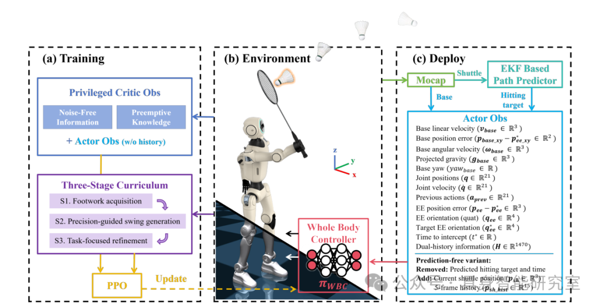

**算法实现总结：**这篇工作先从相机图像/多视角观测、本体状态与关节序列、人类视频/动捕轨迹恢复场景、目标或运动表征，再用PPO/RL 策略训练、AMP/运动先验、全身控制器/WBC/MPC生成全身轨迹/动作序列、低层控制器目标。关键点是把PPO/RL 策略训练、AMP/运动先验放在同一条训练/部署链路里，减少高层目标到低层动作之间的断点。

### 118 腿式机械手全身动态投掷

📌 论文基本信息

📝 **原文题目：** Whole-Body Dynamic Throwing with Legged Manipulators

📅 **发表日期：** 2025年4月1日

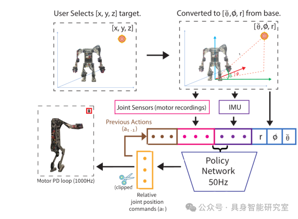

**算法实现总结：**这篇工作先从本体状态与关节序列、人类视频/动捕轨迹、仿真交互数据恢复场景、目标或运动表征，再用扩散策略/流匹配生成全身轨迹/动作序列。关键点是把动作生成看成条件生成问题，用扩散或流匹配在多模态动作分布里采样可执行轨迹。

### 119 迈向多样化人形乒乓球：具有预测增强的统一强化学习

📌 论文基本信息

📝 **原文题目：** PACE: Physics Augmentation for Coordinated End-to-end Reinforcement Learning toward Versatile Humanoid Table Tennis

🔗 **项目链接：** https://github.com/purdue-tracelab/TTRL-

📅 **发表日期：** 2026年3月21日

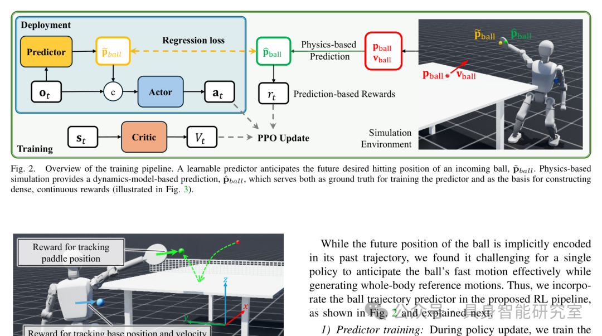

**算法实现总结：**这篇工作先从相机图像/多视角观测、本体状态与关节序列、人类视频/动捕轨迹恢复场景、目标或运动表征，再用PPO/RL 策略训练生成关节位置/力矩命令、地形/场景表征。关键点是把PPO/RL 策略训练放在同一条训练/部署链路里，减少高层目标到低层动作之间的断点。

## 06特殊任务、接触规划与视觉闭环

这一组覆盖足球、乒乓、接触规划、目标抓取等更具体的闭环任务。

### 120 GentleHumanoid｜学习上半身顺应性以进行丰富的人与物交互

📌 论文基本信息

📝 **原文题目：** GentleHumanoid: Learning Upper-body Compliance for Contact-rich Human and Object Interaction

🏫 **机构：** Stanford University、(b) handshaking with a N force limit, allowing the robot’s hand to move naturally with the human’s、(c) autonomous

🔗 **项目链接：** https://gentle-humanoid.axell.top/

📅 **发表日期：** 2025年11月6日

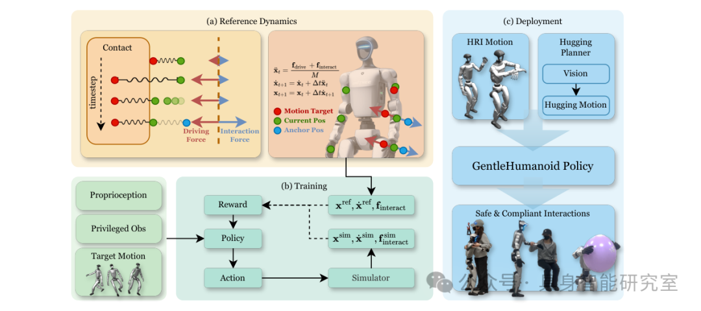

**算法实现总结：**GentleHumanoid 先从相机图像/多视角观测、本体状态与关节序列、人类视频/动捕轨迹恢复场景、目标或运动表征，再用PPO/RL 策略训练、全身控制器/WBC/MPC生成末端执行器/腕手目标。关键点是把PPO/RL 策略训练、全身控制器/WBC/MPC放在同一条训练/部署链路里，减少高层目标到低层动作之间的断点。

### 121 Humanoid-VLA｜通过视觉集成实现通用人形控制

📌 论文基本信息

📝 **原文题目：** Humanoid-VLA: Towards Universal Humanoid Control with Visual Integration

📅 **发表日期：** 2025年2月21日

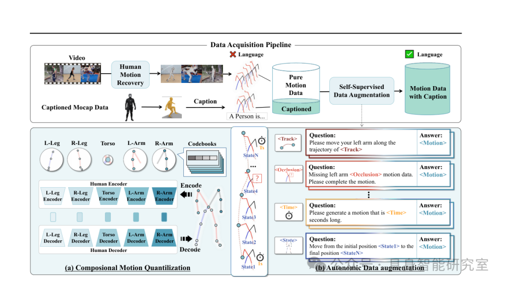

**算法实现总结：**Humanoid-VLA 的实现路径是先把相机图像/多视角观测、人类视频/动捕轨迹编码成多模态表征，再用扩散策略/流匹配、VLA 多模态动作模型、全身控制器/WBC/MPC预测全身轨迹/动作序列。关键点是保留 VLM 的语义理解，同时增加机器人状态和动作头，避免只停留在语言规划。

### 122 LeVERB｜具有潜在视觉语言指令的人形全身控制

📌 论文基本信息

📝 **原文题目：** LeVERB: Humanoid Whole-Body Control with Latent Vision-Language Instruction

🏫 **机构：** University of California Berkeley、Norwegian University of Science and Technology、Simon Fraser University、Carnegie Mellon University

🔗 **项目链接：** https://github.com/ember-lab-berkeley/LeVERB-Website

📅 **发表日期：** 2025年9月25日

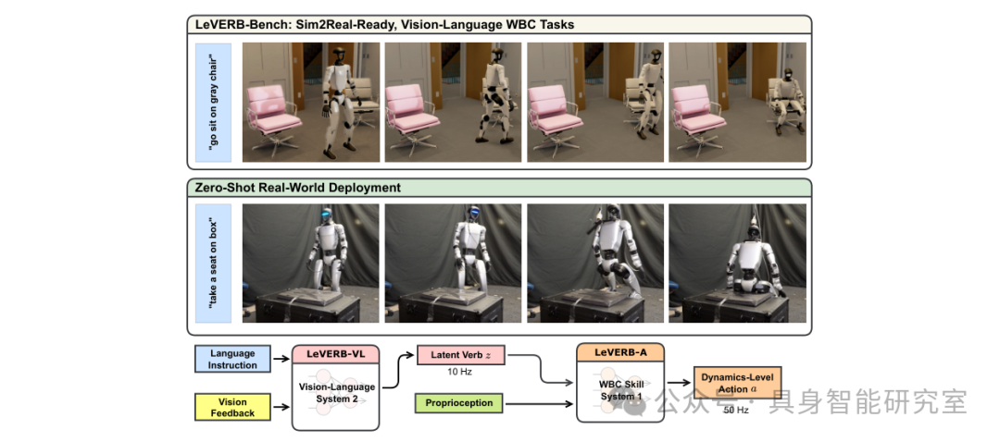

**算法实现总结：**LeVERB 的实现路径是先把语言指令、相机图像/多视角观测、仿真交互数据编码成多模态表征，再用ACT/行为克隆模仿学习、VLA 多模态动作模型、潜变量/动作 token预测全身轨迹/动作序列、动作 chunk/token、低层控制器目标。关键点是保留 VLM 的语义理解，同时增加机器人状态和动作头，避免只停留在语言规划。

### 123 从嘈杂的感官输入中学习人形足球机器人的敏捷前锋技能

📌 论文基本信息

📝 **原文题目：** Learning Agile Striker Skills for Humanoid Soccer Robots from Noisy Sensory Input

🏫 **机构：** Department of Computer Science, The University of Texas at Austin、Sony AI

🔗 **项目链接：** https://humanoidsoccer.github.io

📅 **发表日期：** 2026年5月10日

**算法实现总结：**这篇工作先从相机图像/多视角观测、本体状态与关节序列、仿真交互数据恢复场景、目标或运动表征，再用教师-学生知识迁移、PPO/RL 策略训练、全身控制器/WBC/MPC生成可执行动作命令。关键点是用特权信息训练教师策略，再把能力蒸馏到只能使用部署观测的学生策略。

### 124 学习人形机器人的足球技能：渐进式感知-行动框架

📌 论文基本信息

📝 **原文题目：** Learning Soccer Skills for Humanoid Robots: A Progressive Perception-Action Framework

🏫 **机构：** Institute of Artificial Intelligence (TeleAI), China Telecom、ShanghaiTech University、Zhejiang University、Shanghai Jiao Tong University

🔗 **项目链接：** https://soccer-humanoid.github.io/

📅 **发表日期：** 2026年2月5日

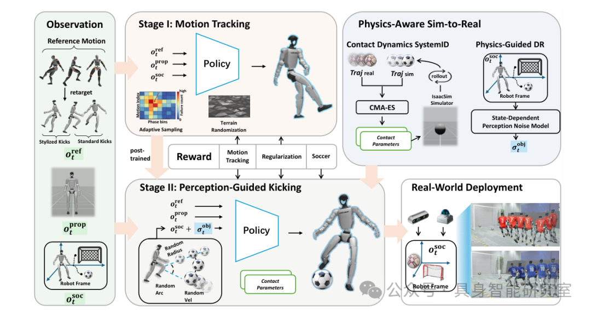

**算法实现总结：**这篇工作先从相机图像/多视角观测、人类视频/动捕轨迹、仿真交互数据恢复场景、目标或运动表征，再用扩散策略/流匹配、IK/动作重定向、分层技能/专家策略生成可执行动作命令。关键点是把动作生成看成条件生成问题，用扩散或流匹配在多模态动作分布里采样可执行轨迹。

### 125 学习人形机器人视觉驱动的反应式足球技能

📌 论文基本信息

📝 **原文题目：** Learning Agile Striker Skills for Humanoid Soccer Robots from Noisy Sensory Input

🏫 **机构：** Department of Computer Science, The University of Texas at Austin、Sony AI

🔗 **项目链接：** https://humanoidsoccer.github.io

📅 **发表日期：** 2026年5月10日

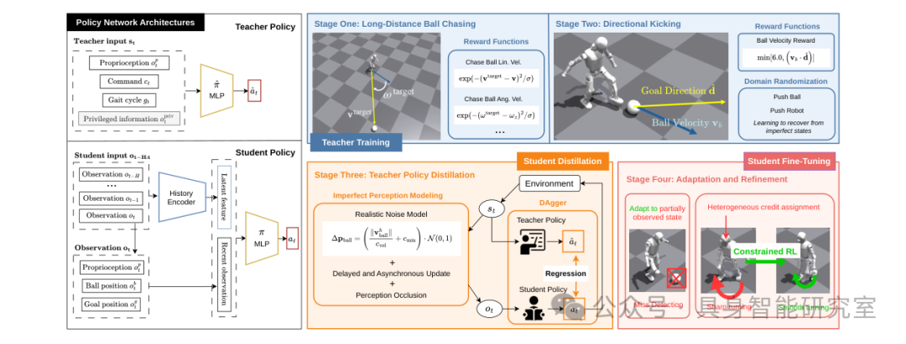

**算法实现总结：**这篇工作先从相机图像/多视角观测、本体状态与关节序列、仿真交互数据恢复场景、目标或运动表征，再用教师-学生知识迁移、PPO/RL 策略训练、全身控制器/WBC/MPC生成可执行动作命令。关键点是用特权信息训练教师策略，再把能力蒸馏到只能使用部署观测的学生策略。

### 126 手眼自主配送｜学习人形机器人导航运动和伸手

📌 论文基本信息

📝 **原文题目：** Hand-Eye Autonomous Delivery: Learning Humanoid Navigation, Locomotion and Reaching

🏫 **机构：** Stanford University

🔗 **项目链接：** https://tml.stanford.edu/HEAD/

📅 **发表日期：** 2025年8月7日

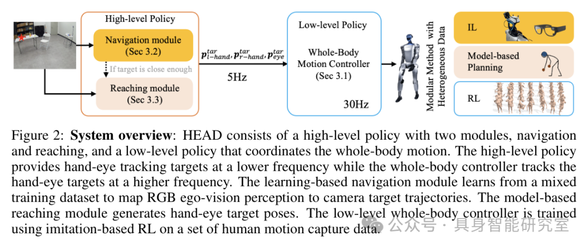

**算法实现总结：**这篇工作先从相机图像/多视角观测、本体状态与关节序列、人类视频/动捕轨迹恢复场景、目标或运动表征，再用异构动捕与合成平衡数据、全身控制器/WBC/MPC、分层技能/专家策略生成低层控制器目标、导航/到达目标。关键点是把任务拆成可路由的技能或专家策略，再用高层模块在执行中选择和组合。

### 127 用于人形接触规划的自我视觉世界模型

📌 论文基本信息

📝 **原文题目：** Ego-Vision World Model for Humanoid Contact Planning

🔗 **项目链接：** https://ego-vcp.github.io/

📅 **发表日期：** 2026年3月8日

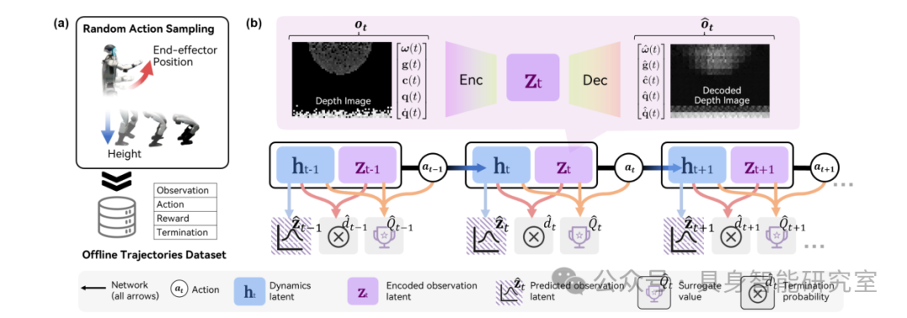

**算法实现总结：**这篇工作先从相机图像/多视角观测、本体状态与关节序列、深度/点云/高度图恢复场景、目标或运动表征，再用PPO/RL 策略训练、扩散策略/流匹配、世界模型/视频预测生成低层控制器目标、地形/场景表征。关键点是把动作生成看成条件生成问题，用扩散或流匹配在多模态动作分布里采样可执行轨迹。

## 07数据采集与遥操作系统

这一组关心数据从哪里来：遥操作、外骨骼、可穿戴设备和交互数据采集。

### 128 BifrostUMI｜连接机器人无关示范和人形全身操作

📌 论文基本信息

📝 **原文题目：** BifrostUMI: Bridging Robot-Free Demonstrations and Humanoid Whole-Body Manipulation

📅 **发表日期：** 2026年5月5日

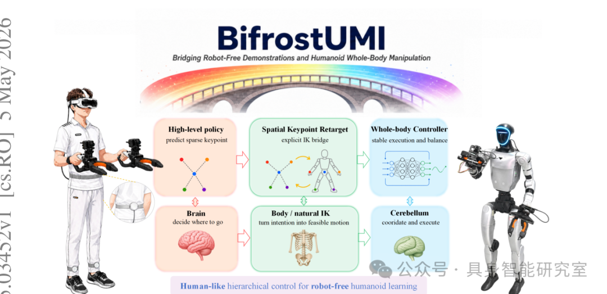

**算法实现总结：**BifrostUMI 主要解决数据闭环：用相机图像/多视角观测、本体状态与关节序列、遥操作/外骨骼数据采集人类操作和机器人状态，再通过ACT/行为克隆模仿学习、扩散策略/流匹配、DINO/视觉特征抽取转成可训练、可复用的全身轨迹/动作序列、低层控制器目标、地形/场景表征。关键点是把动作生成看成条件生成问题，用扩散或流匹配在多模态动作分布里采样可执行轨迹。

### 129 HOMIE｜具有同构外骨骼驾驶舱的人形移动操作

📌 论文基本信息

📝 **原文题目：** HOMIE: Humanoid Loco-Manipulation with Isomorphic Exoskeleton Cockpit

🏫 **机构：** Shanghai AI Laboratory、Multimedia Laboratory, The Chinese University of Hong Kong

🔗 **项目链接：** https://homietele.github.io/

📅 **发表日期：** 2025年4月28日

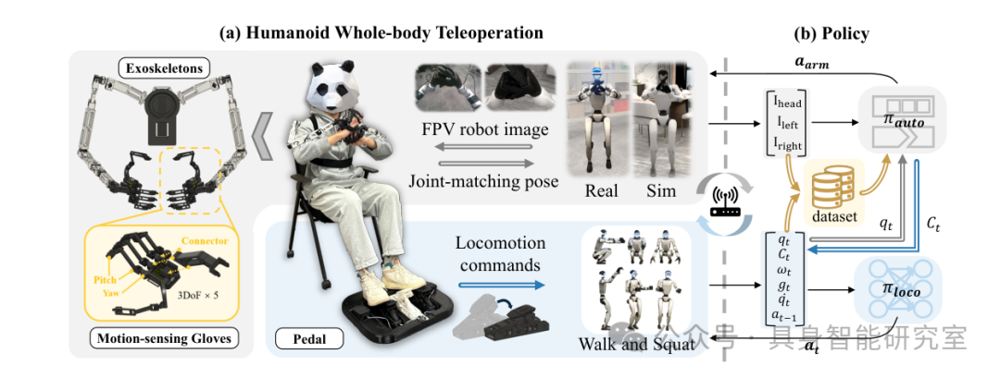

**算法实现总结：**HOMIE 主要解决数据闭环：用本体状态与关节序列、遥操作/外骨骼数据、仿真交互数据采集人类操作和机器人状态，再通过PPO/RL 策略训练、全身控制器/WBC/MPC转成可训练、可复用的地形/场景表征。关键点是把PPO/RL 策略训练、全身控制器/WBC/MPC放在同一条训练/部署链路里，减少高层目标到低层动作之间的断点。

### 130 HumanoidExo｜通过可穿戴外骨骼进行可扩展的全身人形操作

📌 论文基本信息

📝 **原文题目：** HumanoidExo: Scalable Whole-Body Humanoid Manipulation via Wearable Exoskeleton

🏫 **机构：** National University of Defense Technology、tasks from limited data, and acquire new skills like walking

🔗 **项目链接：** https://humanoid-exo.github.io/

📅 **发表日期：** 2025年10月3日

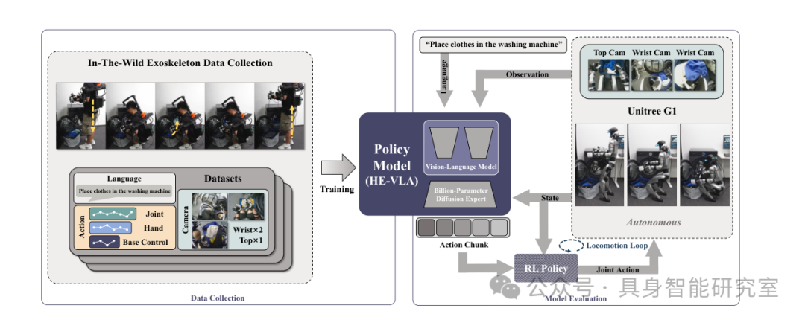

**算法实现总结：**HumanoidExo 主要解决数据闭环：用人类视频/动捕轨迹、遥操作/外骨骼数据采集人类操作和机器人状态，再通过扩散策略/流匹配、全身控制器/WBC/MPC、分层技能/专家策略转成可训练、可复用的全身轨迹/动作序列。关键点是把动作生成看成条件生成问题，用扩散或流匹配在多模态动作分布里采样可执行轨迹。

### 131 Open-TeleVision｜具有沉浸式主动视觉反馈的远程操作

📌 论文基本信息

📝 **原文题目：** Open-TeleVision: Teleoperation with Immersive Active Visual Feedback

🏫 **机构：** UC San Diego1、MIT2、San Diego、and GR- operator are at San Diego (approximately miles away). j: interactions with humans

🔗 **项目链接：** https://robot-tv.github.io/

📅 **发表日期：** 2024年7月8日

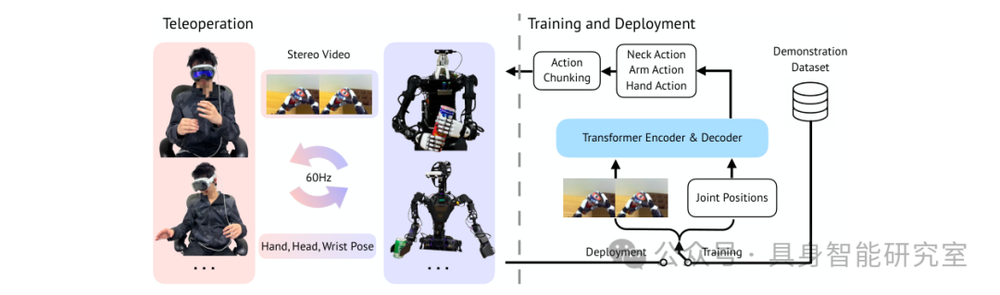

**算法实现总结：**Open-TeleVision 主要解决数据闭环：用相机图像/多视角观测、本体状态与关节序列、遥操作/外骨骼数据采集人类操作和机器人状态，再通过ACT/行为克隆模仿学习、扩散策略/流匹配、MM-DiT/Transformer 动作头转成可训练、可复用的关节位置/力矩命令、末端执行器/腕手目标、动作 chunk/token。关键点是把动作生成看成条件生成问题，用扩散或流匹配在多模态动作分布里采样可执行轨迹。

### 132 TWIST2｜可扩展、便携式、整体的人形数据收集系统

📌 论文基本信息

📝 **原文题目：** TWIST2: Scalable, Portable, and Holistic Humanoid Data Collection System

🏫 **机构：** Stanford University、UC Berkeley、CMU

🔗 **项目链接：** https://twist-data.github.io

📅 **发表日期：** 2025年11月4日

**算法实现总结：**TWIST2 的实现路径是先把相机图像/多视角观测、人类视频/动捕轨迹、遥操作/外骨骼数据编码成多模态表征，再用ACT/行为克隆模仿学习、VLA 多模态动作模型、全身控制器/WBC/MPC预测可执行动作命令。关键点是保留 VLM 的语义理解，同时增加机器人状态和动作头，避免只停留在语言规划。

### 133 TWIST｜遥控全身模仿系统

📌 论文基本信息

📝 **原文题目：** TWIST: Teleoperated Whole-Body Imitation System

🏫 **机构：** TWIST: Teleoperated Whole-Body Imitation System、Stanford University、Simon Fraser University ∗Equal Contribution †Equal Advising

🔗 **项目链接：** https://humanoid-teleop.github.io

📅 **发表日期：** 2025年5月5日

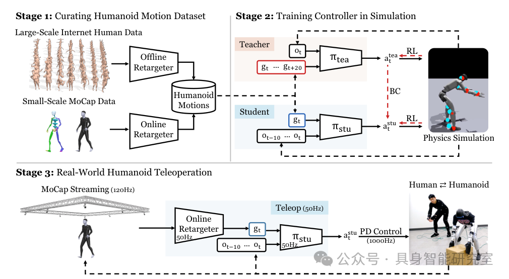

**算法实现总结：**TWIST 主要解决数据闭环：用人类视频/动捕轨迹、遥操作/外骨骼数据、接触力/触觉信号采集人类操作和机器人状态，再通过异构动捕与合成平衡数据、PPO/RL 策略训练、ACT/行为克隆模仿学习转成可训练、可复用的全身轨迹/动作序列、低层控制器目标。关键点是把任务拆成可路由的技能或专家策略，再用高层模块在执行中选择和组合。

### 134 WT-UMI｜通过力监督接触感知规划进行基于触觉的全身操作

📌 论文基本信息

📝 **原文题目：** WT-UMI: Tactile-based Whole-Body Manipulation via Force-Supervised Contact-Aware Planning

🔗 **项目链接：** https://wt-umi.github.io/WTUMI/

📅 **发表日期：** 2026年6月11日

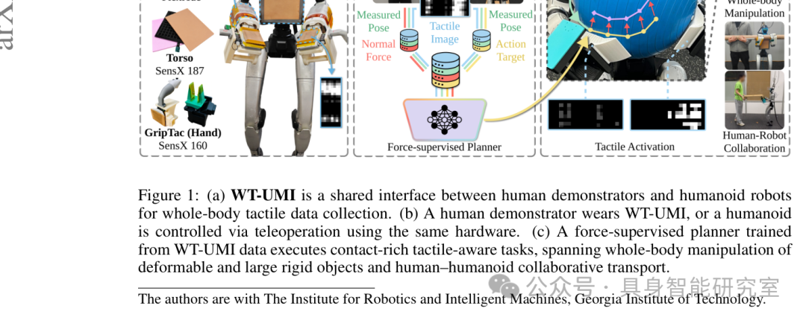

**算法实现总结：**WT-UMI 主要解决数据闭环：用相机图像/多视角观测、遥操作/外骨骼数据、接触力/触觉信号采集人类操作和机器人状态，再通过ACT/行为克隆模仿学习、扩散策略/流匹配转成可训练、可复用的全身轨迹/动作序列、末端执行器/腕手目标、动作 chunk/token。关键点是把动作生成看成条件生成问题，用扩散或流匹配在多模态动作分布里采样可执行轨迹。

## 08硬件平台、感知配置与部署扩展

这一组更偏平台能力：硬件配置、传感器布局、仿真平台和真实部署。

### 135 AMO｜超灵巧人形全身控制的自适应运动优化

📌 论文基本信息

📝 **原文题目：** AMO: Adaptive Motion Optimization for Hyper-Dexterous Humanoid Whole-Body Control

🏫 **机构：** UC San Diego

🔗 **项目链接：** https://amo-humanoid.github.io/

📅 **发表日期：** 2025年5月6日

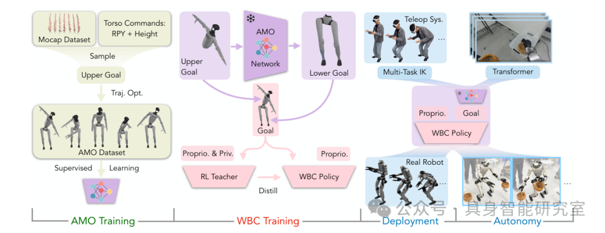

**算法实现总结：**AMO 把本体状态与关节序列、仿真交互数据、接触力/触觉信号转成可跟踪的身体目标，并通过PPO/RL 策略训练、ACT/行为克隆模仿学习、全身控制器/WBC/MPC训练或组合全身策略，最终输出全身轨迹/动作序列。关键点是把示范轨迹压成可监督的动作预测问题，再通过动作 chunk 或闭环执行降低时序抖动。

### 136 DemoHLM｜从单一示范到通用人形移动操作

📌 论文基本信息

📝 **原文题目：** DemoHLM: From One Demonstration to Generalizable Humanoid Loco-Manipulation

🏫 **机构：** Peking University

🔗 **项目链接：** https://beingbeyond.github.io/DemoHLM/

📅 **发表日期：** 2025年10月13日

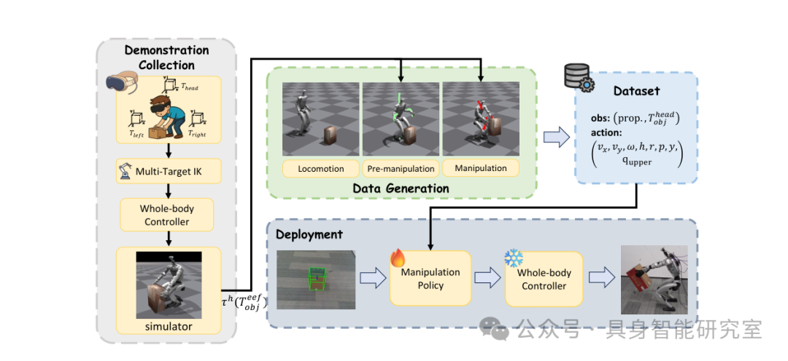

**算法实现总结：**DemoHLM 主要解决数据闭环：用相机图像/多视角观测、本体状态与关节序列、遥操作/外骨骼数据采集人类操作和机器人状态，再通过ACT/行为克隆模仿学习、全身控制器/WBC/MPC、闭环纠错/人类干预转成可训练、可复用的关节位置/力矩命令、全身轨迹/动作序列、低层控制器目标。关键点是把示范轨迹压成可监督的动作预测问题，再通过动作 chunk 或闭环执行降低时序抖动。

### 137 Gallant｜跨3D约束地形的基于体素网格的人形运动和本地导航

📌 论文基本信息

📝 **原文题目：** Gallant: Voxel Grid-based Humanoid Locomotion and Local-navigation across 3D Constrained Terrains

🏫 **机构：** Shanghai Artificial Intelligence Laboratory、The Chinese University of Hong Kong、University of Science and Technology of China、University of Tokyo

🔗 **项目链接：** https://gallantloco.github.io/

📅 **发表日期：** 2025年11月18日

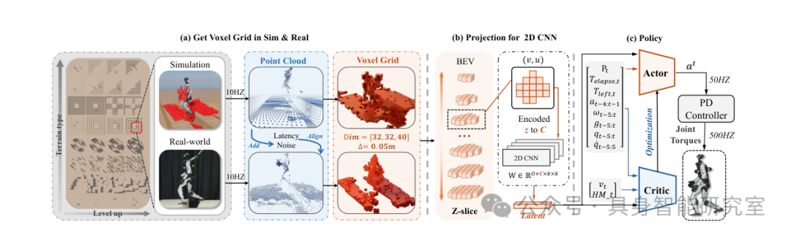

**算法实现总结：**Gallant 先从相机图像/多视角观测、本体状态与关节序列、深度/点云/高度图恢复场景、目标或运动表征，再用策略网络和控制模块生成地形/场景表征、导航/到达目标。关键点是把策略网络和控制模块放在同一条训练/部署链路里，减少高层目标到低层动作之间的断点。

### 138 Mobile-TeleVision｜用于人形全身控制的预测运动先验

📌 论文基本信息

📝 **原文题目：** Mobile-TeleVision: Predictive Motion Priors for Humanoid Whole-Body Control

🏫 **机构：** UC San Diego、MIT

🔗 **项目链接：** https://mobile-tv.github.io/

📅 **发表日期：** 2025年3月9日

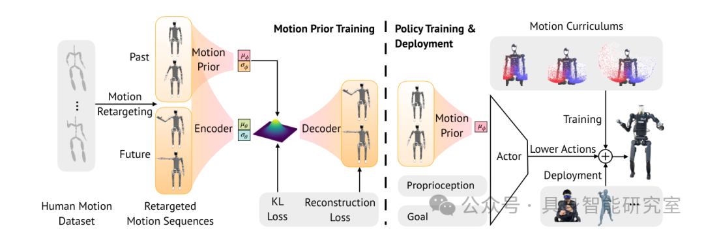

**算法实现总结：**Mobile-TeleVision 把本体状态与关节序列、人类视频/动捕轨迹、接触力/触觉信号转成可跟踪的身体目标，并通过PPO/RL 策略训练、AMP/运动先验、扩散策略/流匹配训练或组合全身策略，最终输出关节位置/力矩命令、全身轨迹/动作序列、地形/场景表征。关键点是把动作生成看成条件生成问题，用扩散或流匹配在多模态动作分布里采样可执行轨迹。

### 139 Open-TeleVision｜具有沉浸式主动视觉反馈的远程操作

📌 论文基本信息

📝 **原文题目：** Open-TeleVision: Teleoperation with Immersive Active Visual Feedback

🏫 **机构：** UC San Diego1、MIT2、San Diego、and GR- operator are at San Diego (approximately miles away). j: interactions with humans

🔗 **项目链接：** https://robot-tv.github.io/

📅 **发表日期：** 2024年7月8日

**算法实现总结：**Open-TeleVision 主要解决数据闭环：用相机图像/多视角观测、本体状态与关节序列、遥操作/外骨骼数据采集人类操作和机器人状态，再通过ACT/行为克隆模仿学习、扩散策略/流匹配、MM-DiT/Transformer 动作头转成可训练、可复用的关节位置/力矩命令、末端执行器/腕手目标、动作 chunk/token。关键点是把动作生成看成条件生成问题，用扩散或流匹配在多模态动作分布里采样可执行轨迹。

### 140 TWIST2｜可扩展、便携式、整体的人形数据收集系统

📌 论文基本信息

📝 **原文题目：** TWIST2: Scalable, Portable, and Holistic Humanoid Data Collection System

🏫 **机构：** Stanford University、UC Berkeley、CMU

🔗 **项目链接：** https://twist-data.github.io

📅 **发表日期：** 2025年11月4日

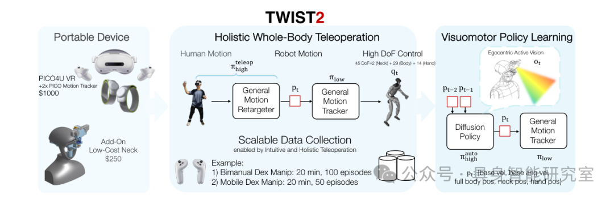

**算法实现总结：**TWIST2 的实现路径是先把相机图像/多视角观测、人类视频/动捕轨迹、遥操作/外骨骼数据编码成多模态表征，再用ACT/行为克隆模仿学习、VLA 多模态动作模型、全身控制器/WBC/MPC预测可执行动作命令。关键点是保留 VLM 的语义理解，同时增加机器人状态和动作头，避免只停留在语言规划。

### 141 ToddlerBot｜用于移动操作的开源ML兼容人形平台

📌 论文基本信息

📝 **原文题目：** ToddlerBot: Open-Source ML-Compatible Humanoid Platform for Loco-Manipulation

🏫 **机构：** Stanford University

🔗 **项目链接：** https://toddlerbot.github.io

📅 **发表日期：** 2025年10月6日

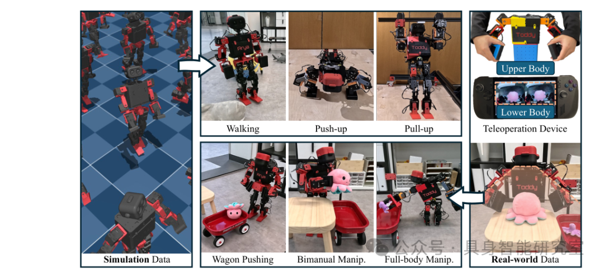

**算法实现总结：**ToddlerBot 主要解决数据闭环：用本体状态与关节序列、遥操作/外骨骼数据、仿真交互数据采集人类操作和机器人状态，再通过ACT/行为克隆模仿学习、扩散策略/流匹配、分层技能/专家策略转成可训练、可复用的地形/场景表征。关键点是把动作生成看成条件生成问题，用扩散或流匹配在多模态动作分布里采样可执行轨迹。

### 142 具有实时基础地形重建的步态自适应感知人形运动

📌 论文基本信息

📝 **原文题目：** Gait-Adaptive Perceptive Humanoid Locomotion with Real-Time Under-Base Terrain Reconstruction

🔗 **项目链接：** https://ga-phl.github.io/

📅 **发表日期：** 2025年12月8日

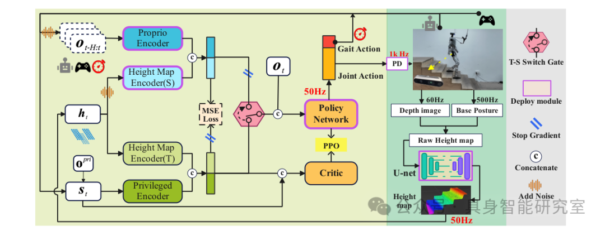

**算法实现总结：**这篇工作先从相机图像/多视角观测、本体状态与关节序列、深度/点云/高度图恢复场景、目标或运动表征，再用下视深度相机和 U-Net 高度图重建、步态相位/频率调节、教师-学生知识迁移生成关节位置/力矩命令、地形/场景表征。关键点是把地形重建、步态相位和全身姿态放进同一个控制回路，而不是把感知和运控拆成松散串联。

### 143 在人形操作的ACT模仿学习中，主动立体相机的性能优于多传感器设置

📌 论文基本信息

📝 **原文题目：** Active Stereo-Camera Outperforms Multi-Sensor Setup in ACT Imitation Learning for Humanoid Manipulation

🏫 **机构：** Imitation Learning for Humanoid Manipulation

🔗 **项目链接：** http://github.com/kuehnrobin/

📅 **发表日期：** 2026年3月30日

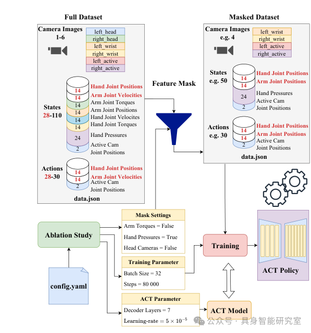

**算法实现总结：**在人形操作的ACT模仿学习中，主动立体相机的性能优于多传感器设置 把相机图像/多视角观测、本体状态与关节序列、接触力/触觉信号转成可跟踪的身体目标，并通过ACT/行为克隆模仿学习、MM-DiT/Transformer 动作头训练或组合全身策略，最终输出动作 chunk/token。关键点是把示范轨迹压成可监督的动作预测问题，再通过动作 chunk 或闭环执行降低时序抖动。

### 144 学习人对人的实时全身远程操作。

📌 论文基本信息

📝 **原文题目：** Open-TeleVision: Teleoperation with Immersive Active Visual Feedback

🏫 **机构：** UC San Diego1、MIT2、San Diego、and GR- operator are at San Diego (approximately miles away). j: interactions with humans

🔗 **项目链接：** https://robot-tv.github.io/

📅 **发表日期：** 2024年7月8日

**算法实现总结：**这篇工作主要解决数据闭环：用相机图像/多视角观测、本体状态与关节序列、遥操作/外骨骼数据采集人类操作和机器人状态，再通过ACT/行为克隆模仿学习、扩散策略/流匹配、MM-DiT/Transformer 动作头转成可训练、可复用的关节位置/力矩命令、全身轨迹/动作序列、末端执行器/腕手目标。关键点是把动作生成看成条件生成问题，用扩散或流匹配在多模态动作分布里采样可执行轨迹。

### 145 手眼自主配送｜学习人形机器人导航运动和伸手

📌 论文基本信息

📝 **原文题目：** Hand-Eye Autonomous Delivery: Learning Humanoid Navigation, Locomotion and Reaching

🏫 **机构：** Stanford University

🔗 **项目链接：** https://tml.stanford.edu/HEAD/

📅 **发表日期：** 2025年8月7日

**算法实现总结：**这篇工作先从相机图像/多视角观测、本体状态与关节序列、人类视频/动捕轨迹恢复场景、目标或运动表征，再用异构动捕与合成平衡数据、全身控制器/WBC/MPC、分层技能/专家策略生成低层控制器目标、地形/场景表征、导航/到达目标。关键点是把任务拆成可路由的技能或专家策略，再用高层模块在执行中选择和组合。

## 09人形 VLA、世界模型与通用操作

这一组进入 VLA 和世界模型：语言、视觉、状态与动作如何连成可执行策略。

### 146 AgiBot World Colosseo｜用于可扩展和智能具身系统的大规模操作平台

📌 论文基本信息

📝 **原文题目：** AgiBot World Colosseo: A Large-scale Manipulation Platform for Scalable and Intelligent Embodied Systems

🔗 **项目链接：** https://github.com/OpenDriveLab/AgiBot-World

📅 **发表日期：** 2025年8月4日

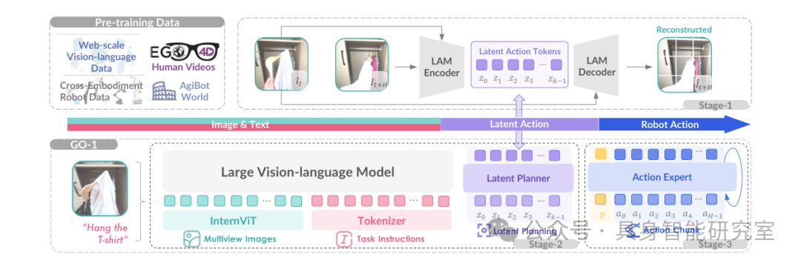

**算法实现总结：**AgiBot World Colosseo 的实现路径是先把语言指令、相机图像/多视角观测、本体状态与关节序列编码成多模态表征，再用VLM 语义规划/路由、潜变量/动作 token、MM-DiT/Transformer 动作头预测全身轨迹/动作序列、末端执行器/腕手目标、动作 chunk/token。关键点是把任务拆成可路由的技能或专家策略，再用高层模块在执行中选择和组合。

### 147 DIAL｜通过端到端VLA的潜在世界建模解耦意图和行动

📌 论文基本信息

📝 **原文题目：** DIAL: Decoupling Intent and Action via Latent World Modeling for End-to-End VLA

🏫 **机构：** The University of Hong Kong、XPENG Robotics、University of North Carolina at Chapel Hill、Limited Robot Data

🔗 **项目链接：** https://xpeng-robotics.github.io/dial

📅 **发表日期：** 2026年4月28日

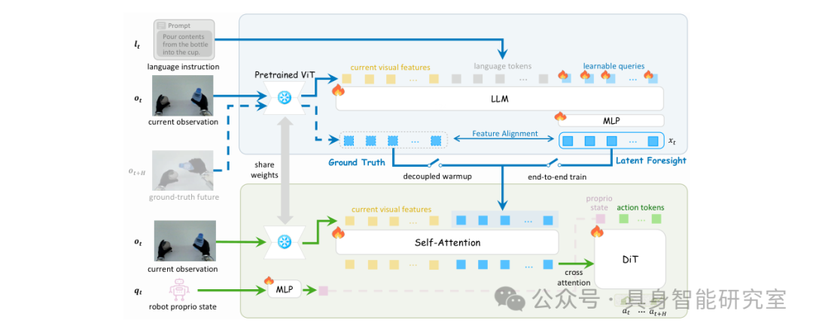

**算法实现总结：**DIAL 的实现路径是先把语言指令、相机图像/多视角观测、本体状态与关节序列编码成多模态表征，再用扩散策略/流匹配、VLA 多模态动作模型、VLM 语义规划/路由预测全身轨迹/动作序列、动作 chunk/token、地形/场景表征。关键点是让视频/世界模型提供可预测的物理先验，再由动作头把语义目标变成连续控制。

### 148 GR00T N1｜通用人形机器人的开放基础模型

📌 论文基本信息

📝 **原文题目：** GR00T N1: An Open Foundation Model for Generalist Humanoid Robots

🏫 **机构：** NVIDIA1

🔗 **项目链接：** https://huggingface.co/datasets/nvidia/PhysicalAI-Robotics-GR00T-X-Embodiment-Sim

📅 **发表日期：** 2025年3月27日

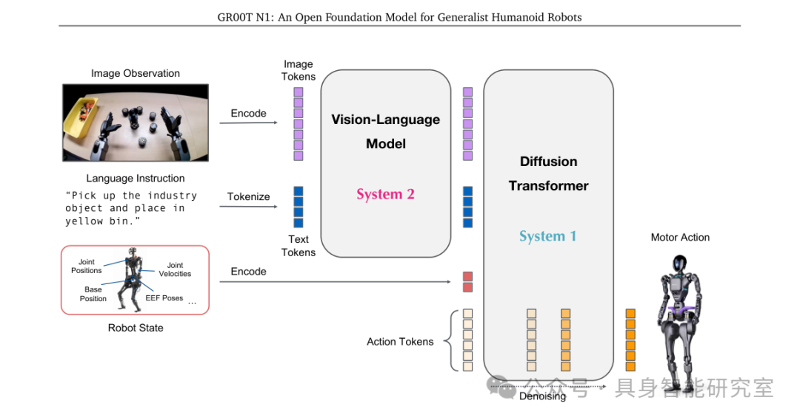

**算法实现总结：**GR00T N1 的实现路径是先把语言指令、相机图像/多视角观测、本体状态与关节序列编码成多模态表征，再用ACT/行为克隆模仿学习、扩散策略/流匹配、VLA 多模态动作模型预测可执行动作命令。关键点是保留 VLM 的语义理解，同时增加机器人状态和动作头，避免只停留在语言规划。

### 149 Gemini Robotics｜将人工智能带入物理世界

📌 论文基本信息

📝 **原文题目：** Gemini Robotics: Bringing AI into the Physical World

🏫 **机构：** Gemini Robotics: Bringing AI into the Physical、Gemini Robotics Team, Google DeepMind1、designed for robotics and built upon the foundation of Gemini .. We present Gemini Robotics, an、Robotics executes smooth and reactive movements to tackle a wide range of complex manipulation tasks

🔗 **项目链接：** https://deepmind.google/discover/blog/gemini-robotics-brings-ai-into-the-physical-world/

📅 **发表日期：** 2025年3月25日

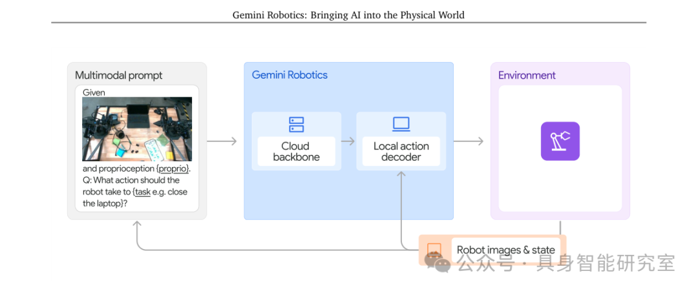

**算法实现总结：**Gemini Robotics 的实现路径是先把语言指令、相机图像/多视角观测编码成多模态表征，再用ACT/行为克隆模仿学习、扩散策略/流匹配、VLA 多模态动作模型预测全身轨迹/动作序列、动作 chunk/token。关键点是保留 VLM 的语义理解，同时增加机器人状态和动作头，避免只停留在语言规划。

### 150 Genie Envisioner｜机器人操作的统一世界基础平台

📌 论文基本信息

📝 **原文题目：** Genie Envisioner: A Unified World Foundation Platform for Robotic Manipulation

🔗 **项目链接：** https://genie-envisioner.github.io

📅 **发表日期：** 2025年11月4日

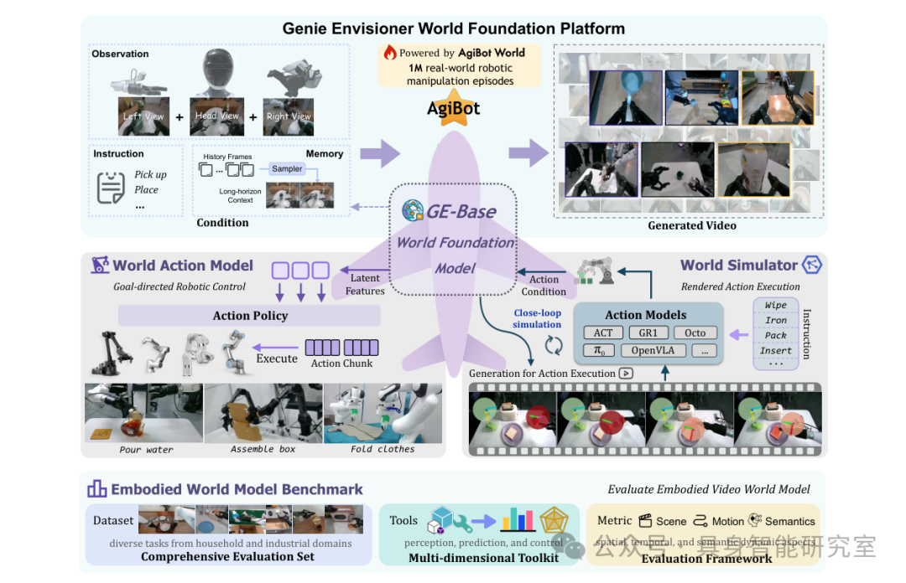

**算法实现总结：**Genie Envisioner 的实现路径是先把语言指令、相机图像/多视角观测、本体状态与关节序列编码成多模态表征，再用ACT/行为克隆模仿学习、扩散策略/流匹配、世界模型/视频预测预测地形/场景表征。关键点是把动作生成看成条件生成问题，用扩散或流匹配在多模态动作分布里采样可执行轨迹。

### 151 LEGS｜微调无TeleopVLA，用于体现高斯泼溅世界中的人形移动操作

📌 论文基本信息

📝 **原文题目：** LEGS: Fine-Tuning Teleop-Free VLAs for Humanoid Loco-manipulation in an Embodied Gaussian Splatting World

🏫 **机构：** Stanford University

🔗 **项目链接：** https://legsvla.github.io/

📅 **发表日期：** 2026年5月31日

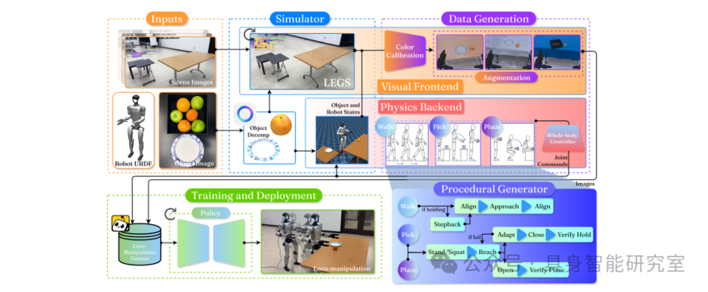

**算法实现总结：**LEGS 的实现路径是先把语言指令、相机图像/多视角观测、本体状态与关节序列编码成多模态表征，再用ACT/行为克隆模仿学习、VLA 多模态动作模型、世界模型/视频预测预测低层控制器目标、地形/场景表征。关键点是让视频/世界模型提供可预测的物理先验，再由动作头把语义目标变成连续控制。

### 152 LingBot-VLA｜务实的VLA基础模型

📌 论文基本信息

📝 **原文题目：** A Pragmatic VLA Foundation Model

🔗 **项目链接：** https://github.com/robbyant/lingbot-vla

📅 **发表日期：** 2026年6月15日

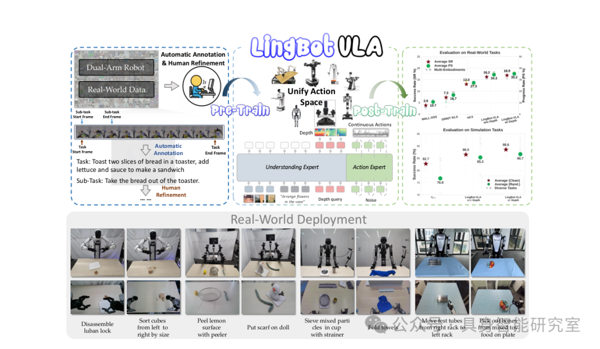

**算法实现总结：**LingBot-VLA 的实现路径是先把语言指令、相机图像/多视角观测编码成多模态表征，再用VLA 多模态动作模型、VLM 语义规划/路由预测可执行动作命令。关键点是保留 VLM 的语义理解，同时增加机器人状态和动作头，避免只停留在语言规划。

### 153 MetaWorld-X｜通过VLM协调的专家进行分层世界建模，用于人形移动操作

📌 论文基本信息

📝 **原文题目：** MetaWorld-X: Hierarchical World Modeling via VLM-Orchestrated Experts for Humanoid Loco-Manipulation

🏫 **机构：** MetaWorld-X: Hierarchical World Modeling via VLM-Orchestrated、tasks into human-motion-informed primitives and dynamically composes them via semantic routing

🔗 **项目链接：** https://syt2004.github.io/metaworldX/

📅 **发表日期：** 2026年3月9日

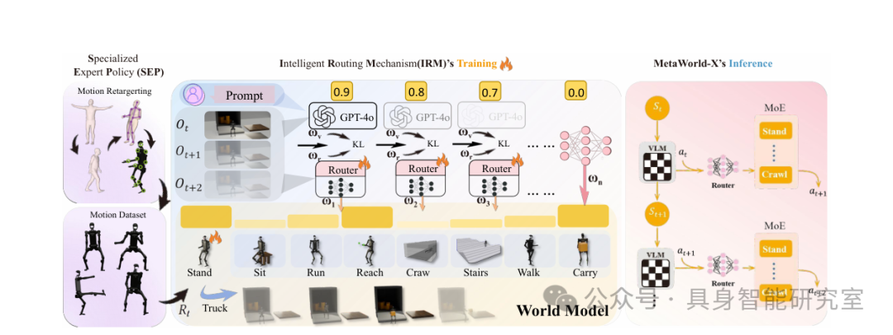

**算法实现总结：**MetaWorld-X 的实现路径是先把语言指令、相机图像/多视角观测、本体状态与关节序列编码成多模态表征，再用PPO/RL 策略训练、AMP/运动先验、VLM 语义规划/路由预测地形/场景表征。关键点是把任务拆成可路由的技能或专家策略，再用高层模块在执行中选择和组合。

### 154 OpenHLM｜全身人形移动操作的经验配方

📌 论文基本信息

📝 **原文题目：** OpenHLM: An Empirical Recipe for Whole-Body Humanoid Loco-Manipulation

🏫 **机构：** Tsinghua University、Shanghai Qi Zhi Institute、Spirit AI

🔗 **项目链接：** https://openhlm-project.github.io/

📅 **发表日期：** 2026年6月20日

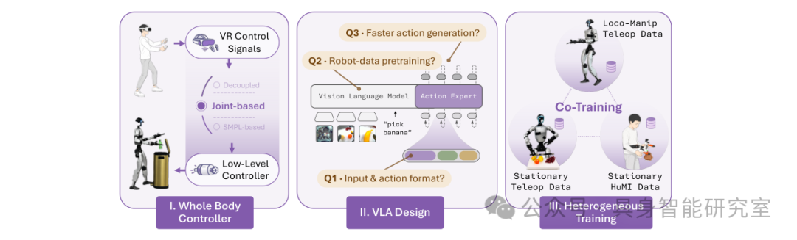

**算法实现总结：**OpenHLM 的实现路径是先把语言指令、相机图像/多视角观测、本体状态与关节序列编码成多模态表征，再用ACT/行为克隆模仿学习、扩散策略/流匹配、VLA 多模态动作模型预测全身轨迹/动作序列、低层控制器目标、地形/场景表征。关键点是保留 VLM 的语义理解，同时增加机器人状态和动作头，避免只停留在语言规划。

### 155 PhysiFlow｜通过多脑潜在流匹配和鲁棒跟踪实现物理感知的人形全身VLA

📌 论文基本信息

📝 **原文题目：** PhysiFlow: Physics-Aware Humanoid Whole-Body VLA via Multi-Brain Latent Flow Matching and Robust Tracking

📅 **发表日期：** 2026年3月5日

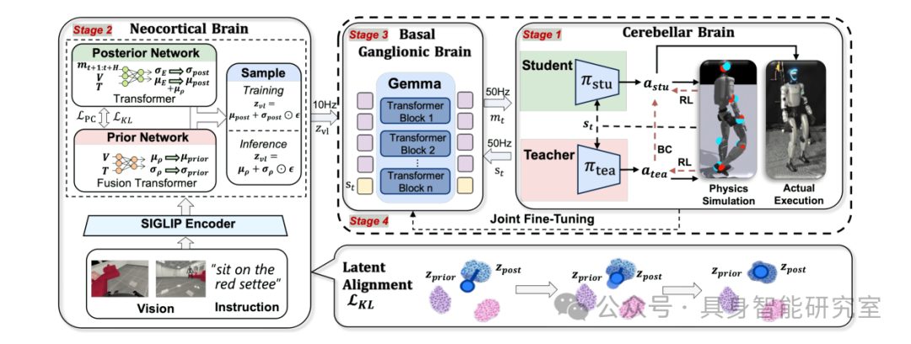

**算法实现总结：**PhysiFlow 的实现路径是先把语言指令、相机图像/多视角观测、本体状态与关节序列编码成多模态表征，再用扩散策略/流匹配、VLA 多模态动作模型、VLM 语义规划/路由预测全身轨迹/动作序列、动作 chunk/token。关键点是保留 VLM 的语义理解，同时增加机器人状态和动作头，避免只停留在语言规划。

### 156 Psi0｜面向通用人形移动操作的开放基础模型

📌 论文基本信息

📝 **原文题目：** $\Psi\_0$: An Open Foundation Model Towards Universal Humanoid Loco-Manipulation

🏫 **机构：** NVIDIA

🔗 **项目链接：** https://psi-lab.ai/Psi0

📅 **发表日期：** 2026年3月12日

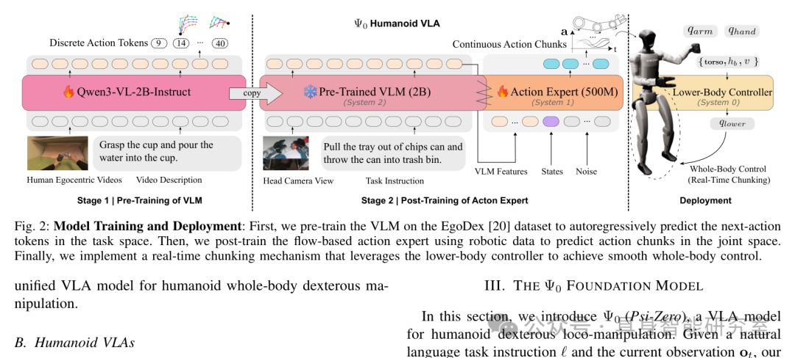

**算法实现总结：**Psi0 的实现路径是先把语言指令、相机图像/多视角观测、本体状态与关节序列编码成多模态表征，再用异构动捕与合成平衡数据、VLM 语义规划/路由、潜变量/动作 token预测动作 chunk/token。关键点是把异构动捕与合成平衡数据、VLM 语义规划/路由放在同一条训练/部署链路里，减少高层目标到低层动作之间的断点。

### 157 REFINE-DP｜通过强化学习对人形移动操作进行扩散策略微调

📌 论文基本信息

📝 **原文题目：** REFINE-DP: Diffusion Policy Fine-tuning for Humanoid Loco-manipulation via Reinforcement Learning

🏫 **机构：** IEEE ROBOTICS AND AUTOMATION LETTERS

🔗 **项目链接：** https://refine-dp.github.io/REFINE-DP/

📅 **发表日期：** 2026年3月17日

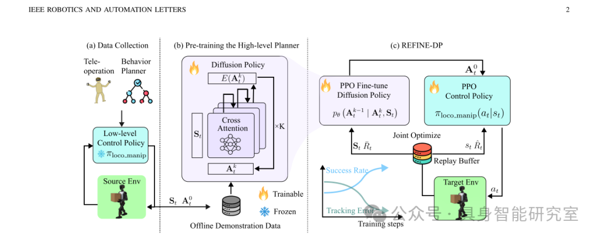

**算法实现总结：**REFINE-DP 的实现路径是先把语言指令、相机图像/多视角观测、本体状态与关节序列编码成多模态表征，再用PPO/RL 策略训练、ACT/行为克隆模仿学习、扩散策略/流匹配预测关节位置/力矩命令、低层控制器目标。关键点是把动作生成看成条件生成问题，用扩散或流匹配在多模态动作分布里采样可执行轨迹。

### 158 ROVE｜通过强化学习解锁人形操作的人类干预

📌 论文基本信息

📝 **原文题目：** ROVE: Unlocking Human Interventions for Humanoid Manipulation via Reinforcement Learning

🏫 **机构：** XPENG Robotics、Fudan University、The Chinese University of Hong Kong、Shanghai Jiao Tong University

🔗 **项目链接：** https://xpeng-robotics.github.io/rove

📅 **发表日期：** 2026年6月15日

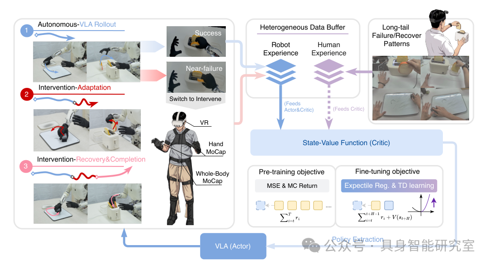

**算法实现总结：**ROVE 的实现路径是先把语言指令、相机图像/多视角观测、本体状态与关节序列编码成多模态表征，再用PPO/RL 策略训练、扩散策略/流匹配、VLA 多模态动作模型预测可执行动作命令。关键点是保留 VLM 的语义理解，同时增加机器人状态和动作头，避免只停留在语言规划。

### 159 世界行动模型是零样本策略

📌 论文基本信息

📝 **原文题目：** World Action Models are Zero-shot Policies

🏫 **机构：** NVIDIA

🔗 **项目链接：** https://dreamzero0.github.io

📅 **发表日期：** 2026年2月4日

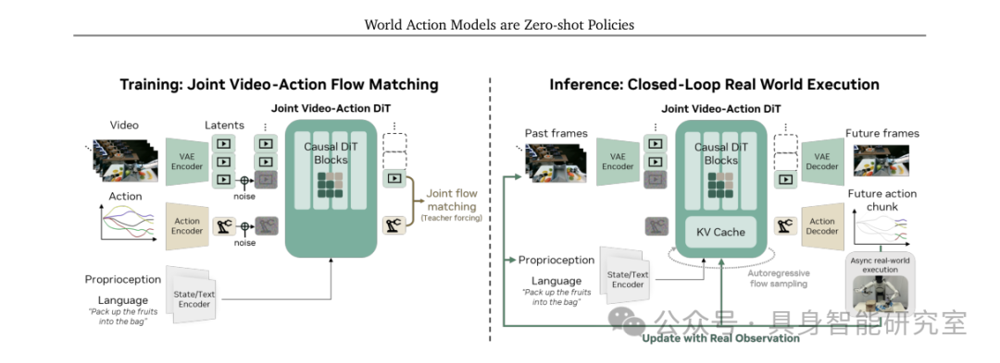

**算法实现总结：**这篇工作先把语言指令、相机图像/多视角观测、本体状态与关节序列编码成多模态表征，再用ACT/行为克隆模仿学习、扩散策略/流匹配、VLA 多模态动作模型预测动作 chunk/token。关键点是让视频/世界模型提供可预测的物理先验，再由动作头把语义目标变成连续控制。

### 160 通过主动空间大脑和通用动作小脑进行人形全身操作

📌 论文基本信息

📝 **原文题目：** Humanoid Whole-Body Manipulation via Active Spatial Brain and Generalizable Action Cerebellum

🏫 **机构：** School of Computer Science and Engineering, Sun Yat-sen University

🔗 **项目链接：** https://leungchaos.github.io/Humanoid-Whole-Body-Manipulation-via-Active-Spatial-Brain-and-Generalizable-Action-Cerebellum/

📅 **发表日期：** 2026年5月20日

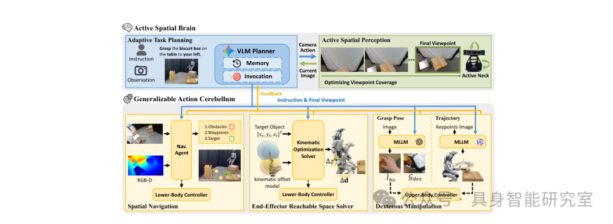

**算法实现总结：**这篇工作先把语言指令、相机图像/多视角观测编码成多模态表征，再用策略网络和控制模块预测全身轨迹/动作序列。关键点是把策略网络和控制模块放在同一条训练/部署链路里，减少高层目标到低层动作之间的断点。

## 10从人类第一视角视频学习

这一组聚焦第一视角人类视频如何迁移到双臂或人形机器人操作。

### 161 EgoVLA｜从第一视角的人类视频中学习视觉语言动作模型

📌 论文基本信息

📝 **原文题目：** EgoVLA: Learning Vision-Language-Action Models from Egocentric Human Videos

🏫 **机构：** UC San Diego、MIT、NVIDIA

🔗 **项目链接：** https://rchalyang.github.io/EgoVLA/

📅 **发表日期：** 2025年7月18日

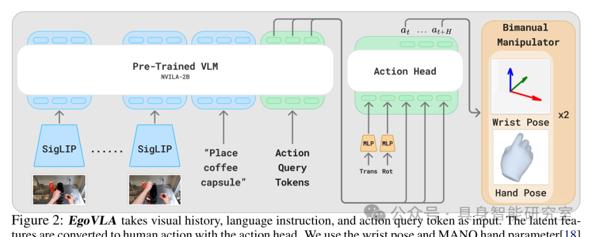

**算法实现总结：**EgoVLA 的实现路径是先把语言指令、相机图像/多视角观测、本体状态与关节序列编码成多模态表征，再用ACT/行为克隆模仿学习、VLA 多模态动作模型、潜变量/动作 token预测全身轨迹/动作序列、末端执行器/腕手目标。关键点是保留 VLM 的语义理解，同时增加机器人状态和动作头，避免只停留在语言规划。
