# Jason Peng：更灵活的运动技能学习

Xue Bin Peng现任西蒙弗雷泽大学（SFU）计算科学学院助理教授，同时担任NVIDIA兼职研究科学家。他在不列颠哥伦比亚大学（UBC）取得学士与硕士学位，随后于UC Berkeley获得博士学位，研究方向聚焦于计算机图形学与机器学习的交叉领域，核心是利用机器学习技术开发运动控制模型。

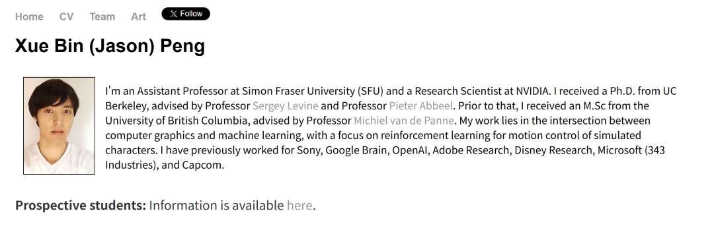

他的研究成果让仿真智能体和现实机器人能够重现人类及其他动物灵活多样的运动技能，涵盖双足/四足机器人 locomotion、场景交互、技能迁移等多个方向。凭借在该领域的突出贡献，他曾荣获ACM SIGGRAPH杰出博士论文奖、图形界面领域早期职业研究奖，其研究成果多次发表于SIGGRAPH、NeurIPS、ICML等国际顶级会议及期刊，兼具学术深度与工程应用价值。

人类凭借丰富多样的运动技能，能够完成诸多令人惊叹的灵活动作。近年来人形机器人领域发展迅速，已能复刻部分这类逼真且敏捷的行为，而强化学习与运动跟踪的结合是其中核心技术方案。这类基于强化学习的运动跟踪技术，虽能有效训练多种运动技能的控制器，但往往存在灵活性不足的问题，易过度拟合特定行为，难以适应复杂或全新任务。

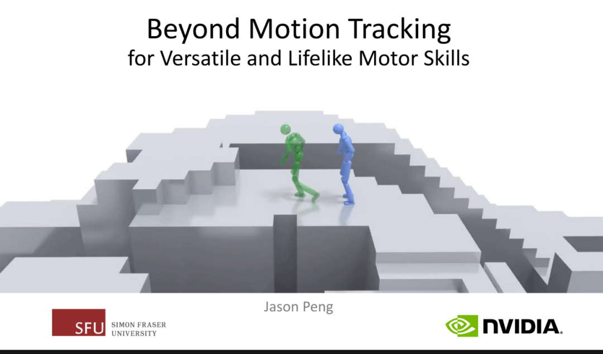

Xue Bin Peng的研究正是围绕这一痛点展开，他提出了更具通用性的运动模仿技术：一方面通过对抗性模仿学习构建灵活的模仿框架，让模型能够组合、适配已有行为以完成新任务；另一方面利用生成模型拓展运动数据集，通过数据增强让智能体获得更稳健、通用的行为能力，以应对多样的全新场景。

## 核心背景与现有方法

### 人形机器人运动控制的研究进展

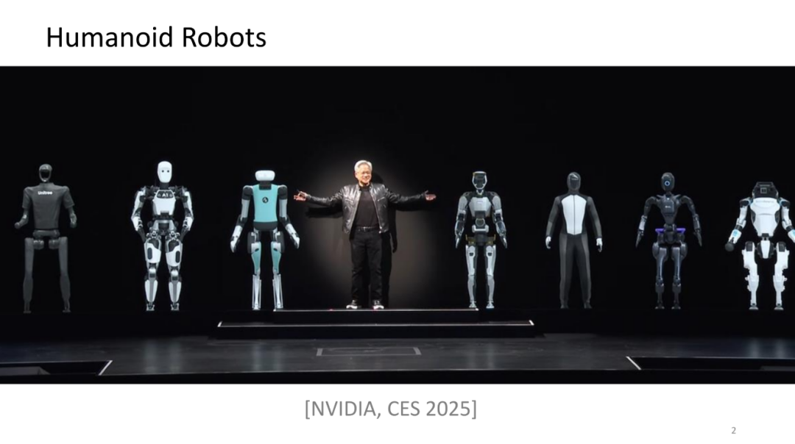

在过去几年里，人形机器人领域取得了飞速发展，几乎每周都会有新的演示视频发布，展示人形机器人执行各种极具灵活性和逼真度的运动技能。

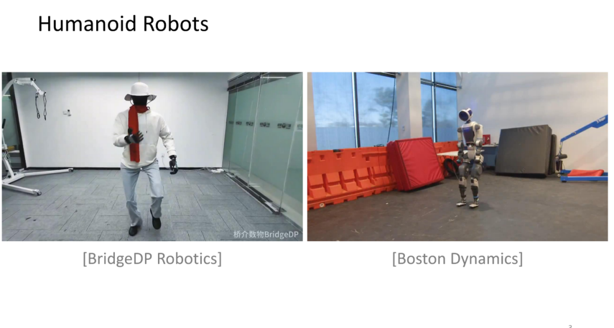

这些系统的实现离不开复杂的工程技术，但许多令人印象深刻的成果背后，都有一个共同的核心方案——**RL** 与**motion tracking** 的结合。

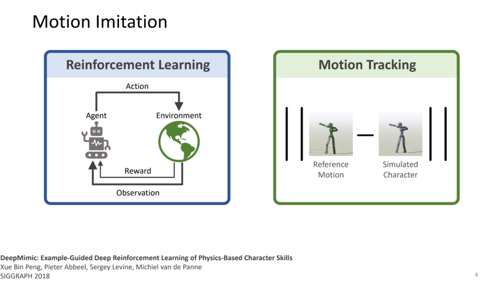

### 强化学习与运动跟踪的结合

强化学习与运动跟踪的组合已被证明是一种非常通用的方案，能够构建可重现多种运动技能的控制器。在今天的分享中，我将简要回顾这些基于强化学习的运动跟踪技术的工作原理，分析其局限性，以及我们如何超越运动跟踪，开发出更通用、更实用的控制器。

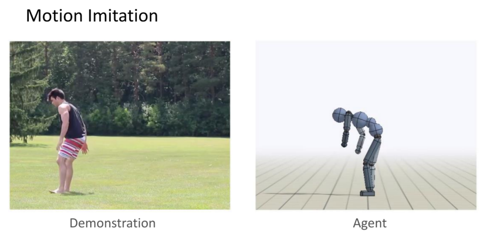

首先，假设我们有一个人形智能体，希望它能够以自然、类人的方式移动。目前最有效的方法是采用某种形式的**模仿学习（imitation learning）**：先记录人类演员的演示数据（通常以参考运动的形式呈现），然后构建一个控制器，通过模仿该参考运动来重现相应行为。

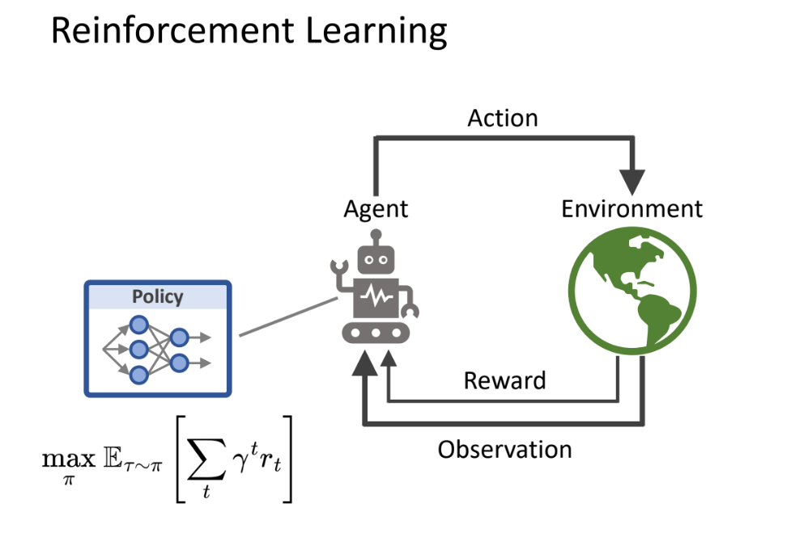

如今，越来越多的框架采用强化学习来构建这类控制器：智能体与环境交互以执行特定任务，在每个时间步，智能体观察环境状态，然后选择一个动作来影响环境；这个动作会导致环境状态发生变化，智能体随后会收到一个奖励信号，告知该动作在当前任务背景下的优劣。强化学习的目标是学习一个**policy**（通常以神经网络的形式），该策略能选择合适的动作，使智能体从环境中获得的累积奖励最大化。

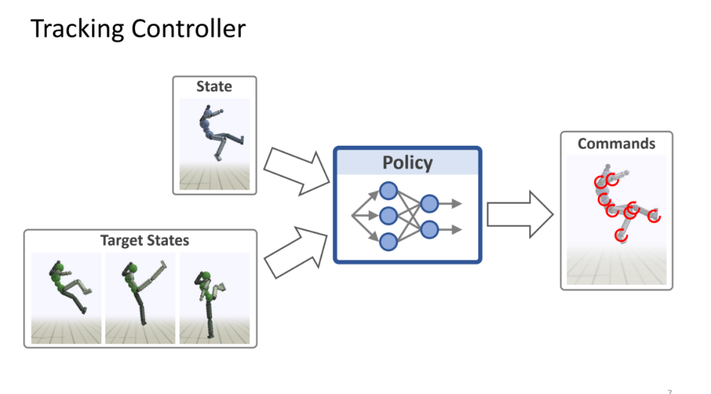

对于许多运动跟踪问题，我们通常将策略建模为**跟踪控制器（tracking controller）**，其输入包括智能体的状态以及参考运动中希望智能体模仿的目标状态序列，输出则是**电机指令（motor commands）**（如力矩或PD目标值），用于驱动智能体的身体运动。

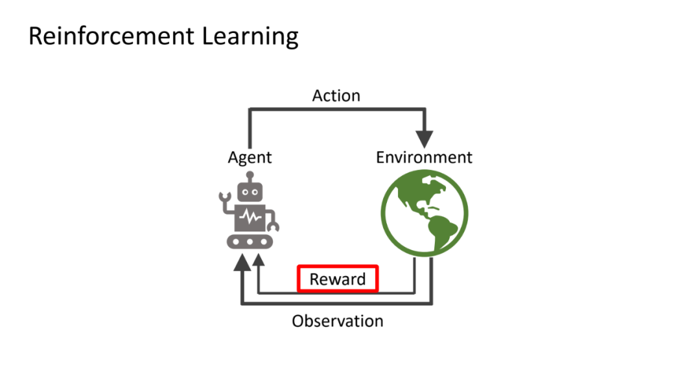

训练控制器的关键在于**reward function** 的设计。在大多数运动跟踪框架中，我们会使用一种相当直接的跟踪奖励函数，其核心是最小化参考运动与智能体实际运动之间的差异。参考运动会为每个时间步指定智能体应达到的目标状态，而策略的任务就是选择合适的动作序列，使智能体尽可能精确地跟踪该目标状态序列。此时，奖励可以通过计算每个时间步参考运动的目标状态与智能体实际状态之间的差异来简单获得。

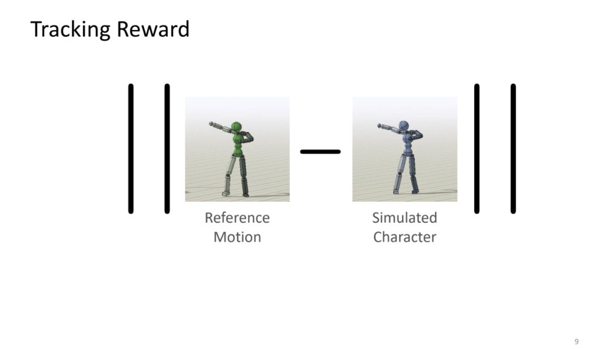

在我们早期的Deep Mimic研究中，我们已经证明，强化学习与运动跟踪的结合提供了一个非常通用的框架，能够重现多种运动技能。

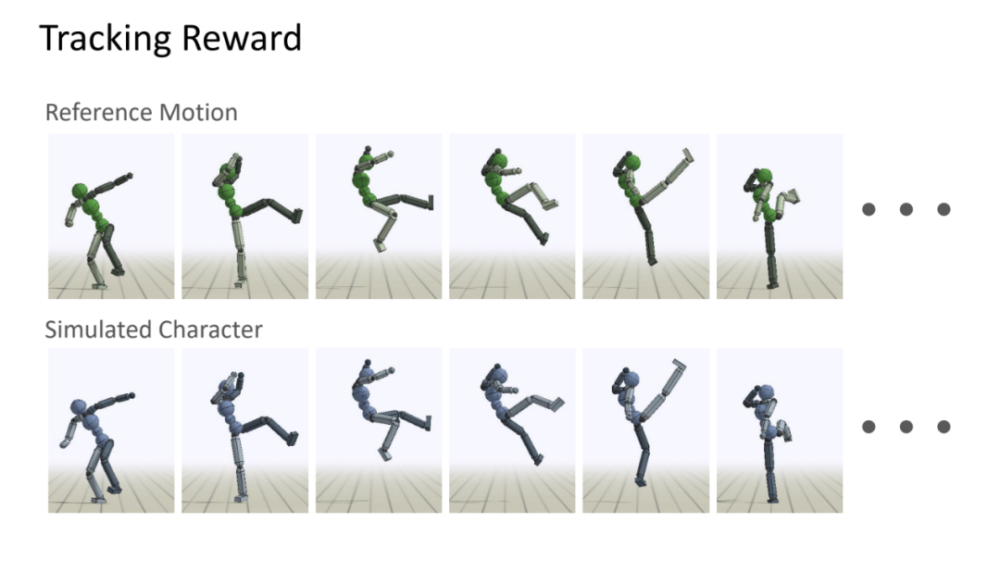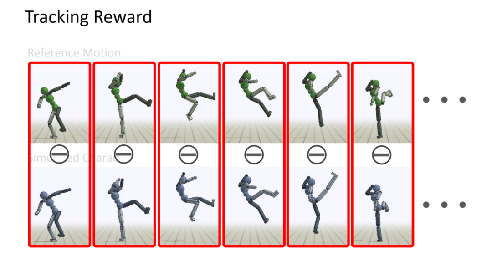

### 运动跟踪方法的局限性

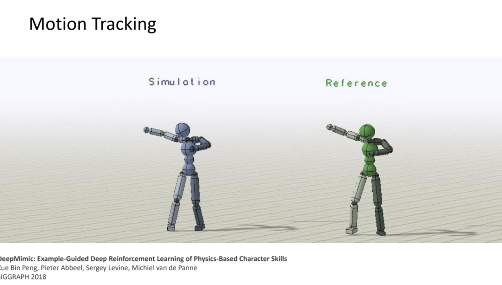

尽管这些运动跟踪方法能够实现多种技能，但它们存在一些主要局限性。其中一个局限性是，最终得到的跟踪控制器缺乏灵活性——这些控制器或多或少只能重复播放相同的运动，无法执行其他任务。某种程度上，你可以将这些跟踪控制器想象成高级的发条玩具：上紧发条后释放，它们只会一遍又一遍地重复相同的动作。

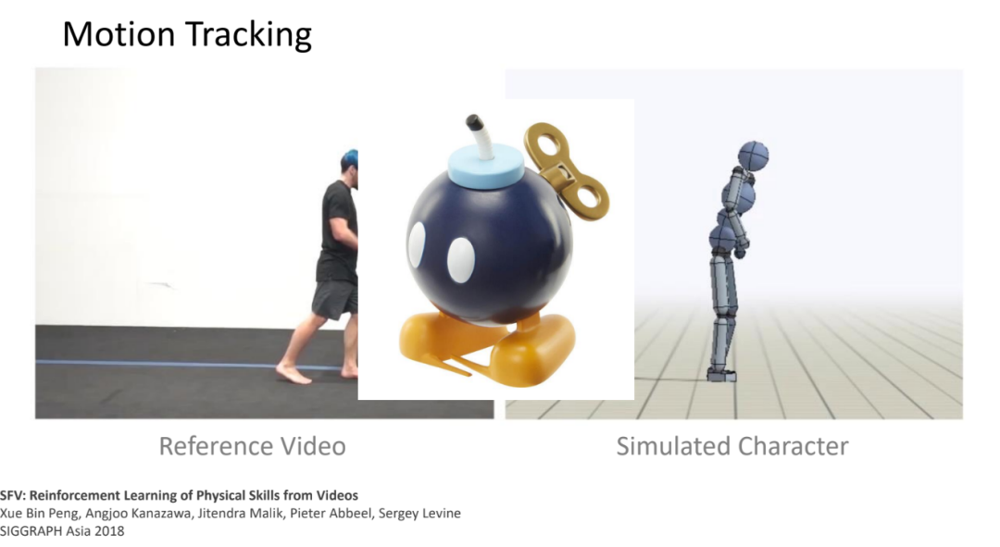

这对于展示人形机器人的能力来说非常出色，但如果希望智能体在现实世界中执行更实用的任务，仅靠运动跟踪可能就过于局限了。

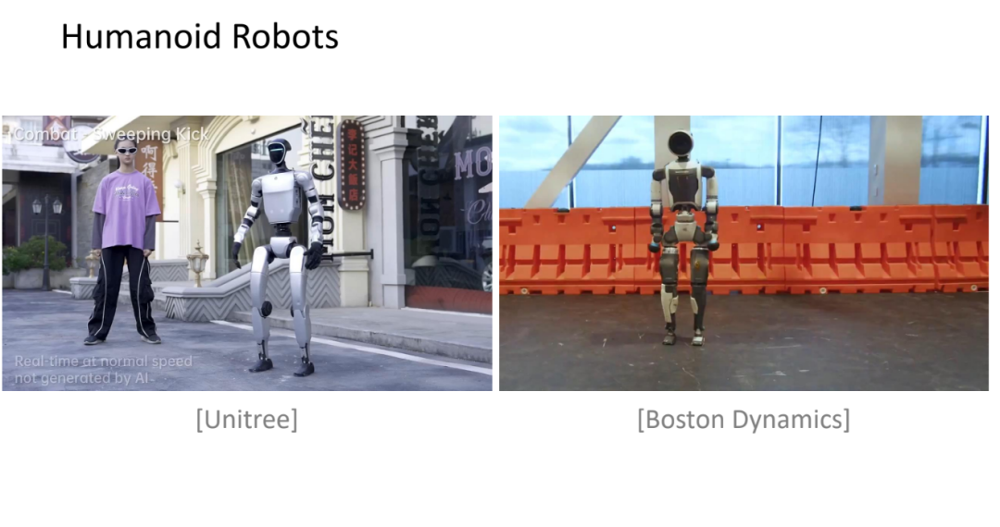

例如，假设有一个简单任务：让智能体走向一个物体并击打它。如果应用运动跟踪方法，我们首先需要录制一个参考运动，展示智能体如何走向目标并完成击打动作。如果有合适的参考运动，我们可以直接通过运动跟踪训练控制器来执行该任务。但如果任务发生轻微变化（比如目标位置移动了一点），原来的参考运动可能就不再适用，此时我们可能需要为这个略微不同的任务重新录制参考运动。

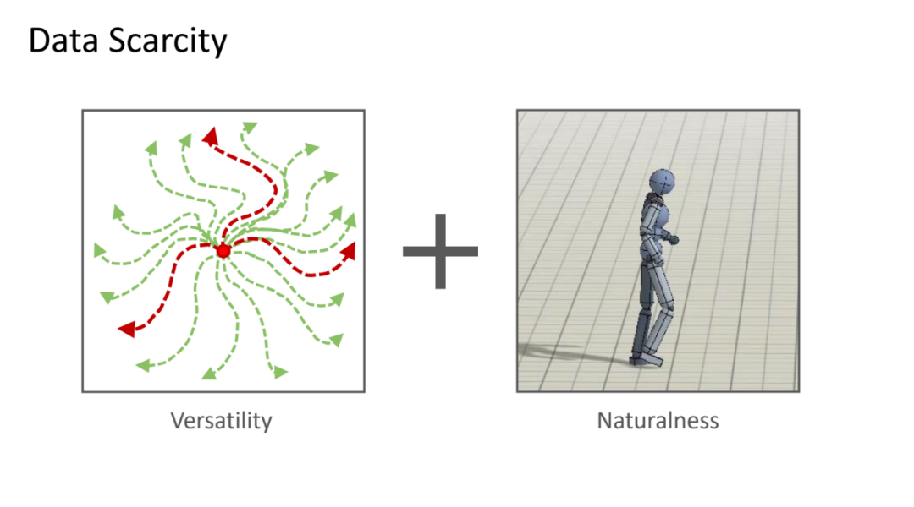

如果我们有大量的运动数据，能够覆盖任务的所有不同变体，这可能不是问题。但不幸的是，在许多运动控制问题中，我们往往处于**数据稀缺（data scarce）** 的场景：可能只有少数几个稀疏的示例，却需要训练出能够填补空白、执行任务所有变体的通用控制器。

此外，理想情况下，我们还希望控制器能够产生自然、逼真的行为——这对于计算机图形学和机器人技术的应用来说尤为重要。

## 进阶方法一：基于对抗性模仿学习的灵活目标设计

### 分布匹配目标替代逐帧跟踪

那么，如何训练这些更通用的控制器呢？一种思路是保留最初的运动跟踪目标，但将其替换为更通用的**distribution matching objective**：不再训练控制器逐帧精确跟踪参考运动，而是训练控制器匹配运动数据中观察到的行为分布。

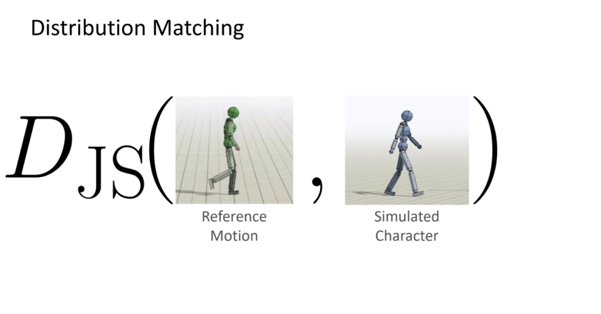

实现这种分布匹配目标的一种方法是使用**adversarial imitation learning**：通过一个对抗性判别器（adversarial discriminator）建模模仿目标，该判别器经过训练，能够判断输入的运动是来自运动数据集还是由智能体生成。而我们的控制器则被训练生成能够欺骗判别器的运动，使其认为这些运动来自原始数据集——这与GAN的基本架构大致相同。

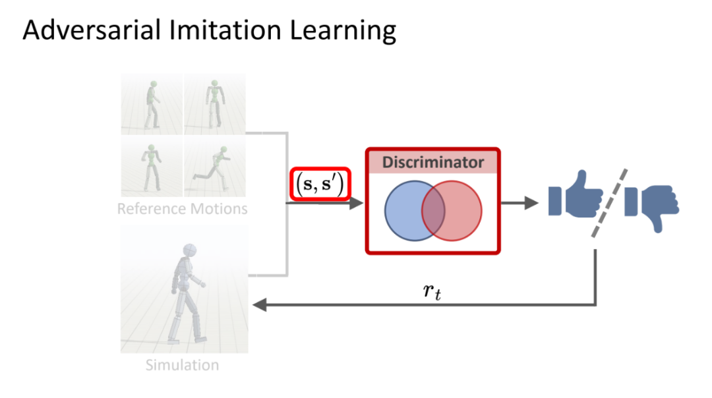

### 任务目标与风格目标的分解

通过这种对抗性模仿学习目标，我们可以构建一种更灵活的控制器训练方法。在这项研究中，我们的训练目标包含两个部分：

1. **task objective**：鼓励智能体执行特定的高层任务（如移动到目标位置或击打物体）；
2. **style objective**：通过对抗性判别器建模，鼓励智能体在执行任务时采用与运动数据集中观察到的类似的、自然逼真的行为。

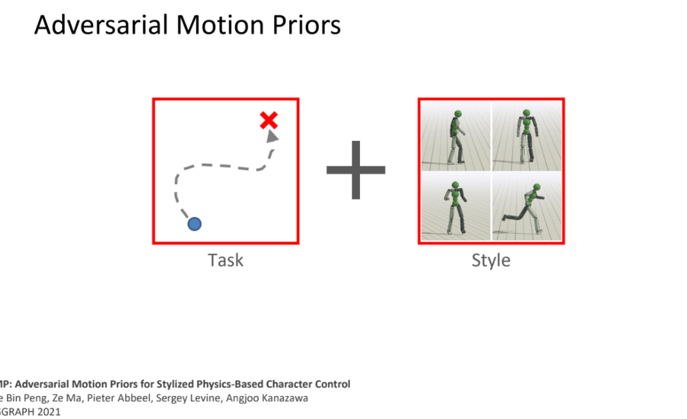

通过将任务与风格分离的目标设计，任务目标可推动智能体执行任务的所有变体，而风格目标则确保智能体在执行这些新任务时仍能保持自然逼真的行为。

### 应用案例展示

这就是我们采用的框架，下面看看这种方法的效果：

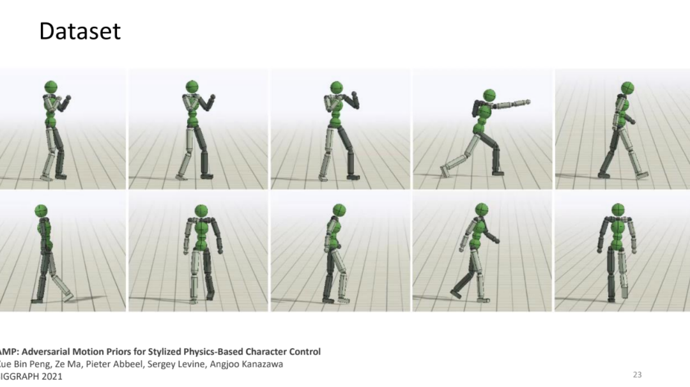

我们有一个包含多种击打和移动行为的数据集，通过该数据集训练判别器后，我们能够得到一个相当通用的控制器，它可以走向不同的目标并进行击打。需要注意的是，我们的数据集本身并不包含该任务的示例——没有任何运动数据展示角色走向目标并击打的动作，但通过对抗性判别器训练策略，策略获得了灵活性，能够将数据集中的不同行为组合起来，执行这个原本没有数据支持的新任务，而且我们也没有针对这些特定目标的击打运动片段。

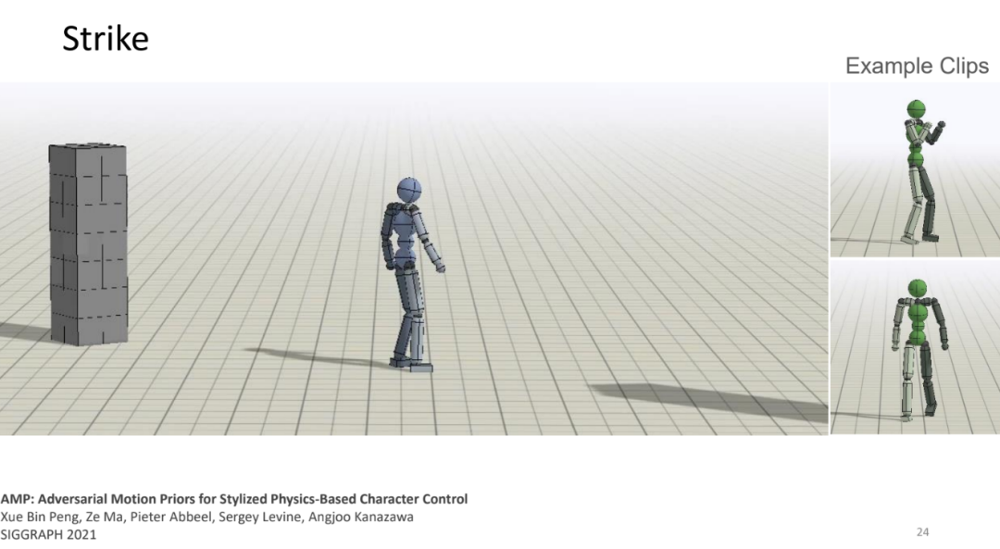

再看另一个不同的任务：我们使用包含多种移动行为的数据集，训练控制器将足球运球到目标位置。同样，数据集中没有任何角色运球的示例，但我们的模型能够重新利用和调整移动行为，以执行这个新任务。

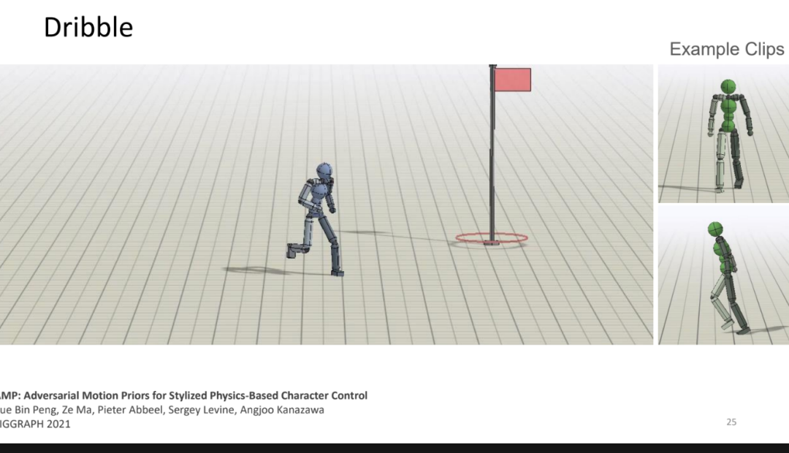

这种对抗性方法还有一个有趣的应用：训练控制器自动从大幅扰动中恢复。我们使用包含多种移动和起身行为的数据集训练控制器后，该控制器能够自动在不同的移动和起身行为之间切换——当角色摔倒时，它会自动执行起身动作，然后恢复到奔跑状态。这些不同技能的组合和排序是训练过程中自动涌现的，我们不需要高层规划器来告诉角色何时奔跑、何时起身，这种组合完全由对抗性目标自然驱动。

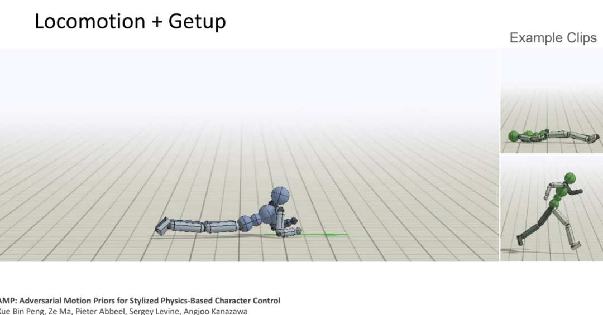

当我们尝试为更复杂的任务训练控制器时，这种更通用的模仿学习目标变得越来越重要——因为对于这些任务，收集足够多的运动数据来覆盖智能体可能需要执行的所有交互类型非常困难。例如，我们训练了一个控制器，使其能够与场景中的不同物体进行交互。对于这类场景交互任务，收集足够多的运动数据来覆盖智能体与所有可能物体的所有交互方式成本极高。

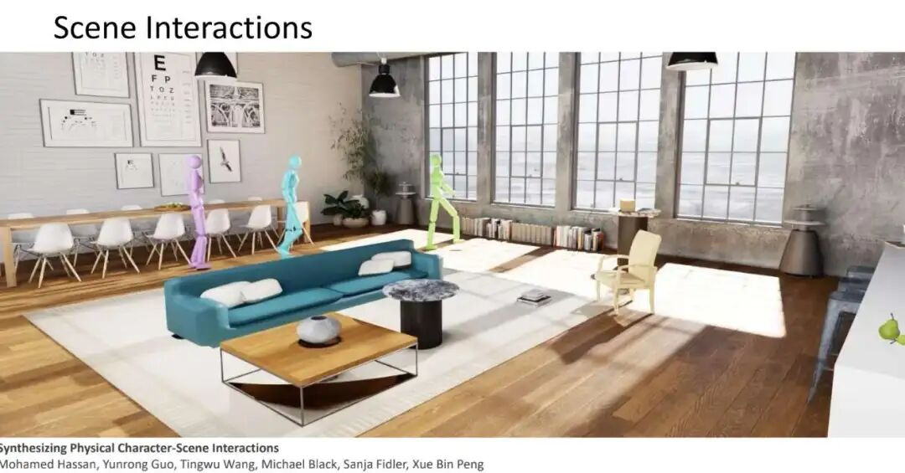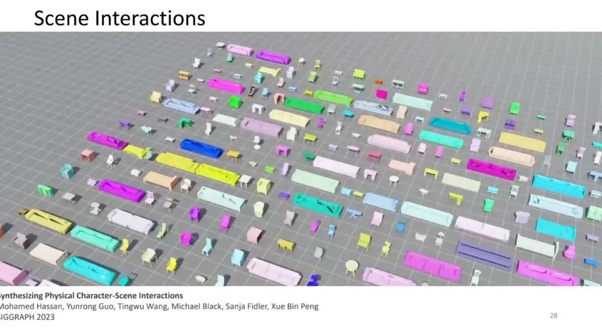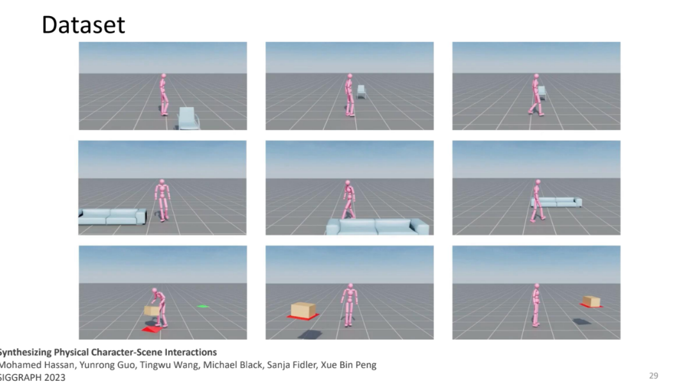

但通过对抗性模仿学习，我们可以从一个相当小的运动数据集（仅包含人类与不同物体交互的少数示例）出发，训练出一个更通用的控制器，使其能够从多种不同的初始配置开始与这些物体交互。例如，我们训练的控制器能够从多个不同的初始位置走向椅子并坐下，其中许多初始位置远远超出了原始训练数据的范围。同一个控制器还可以应用于走向并坐在各种不同的家具上（如椅子、凳子、沙发），其中许多家具也不在原始训练数据中，但对抗性学习过程赋予了智能体调整现有运动以适应这些新物体的灵活性。

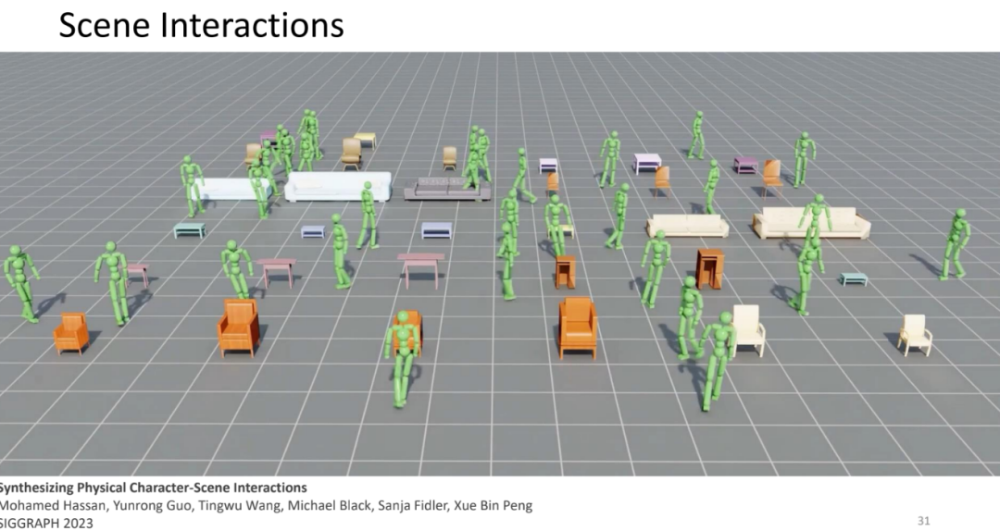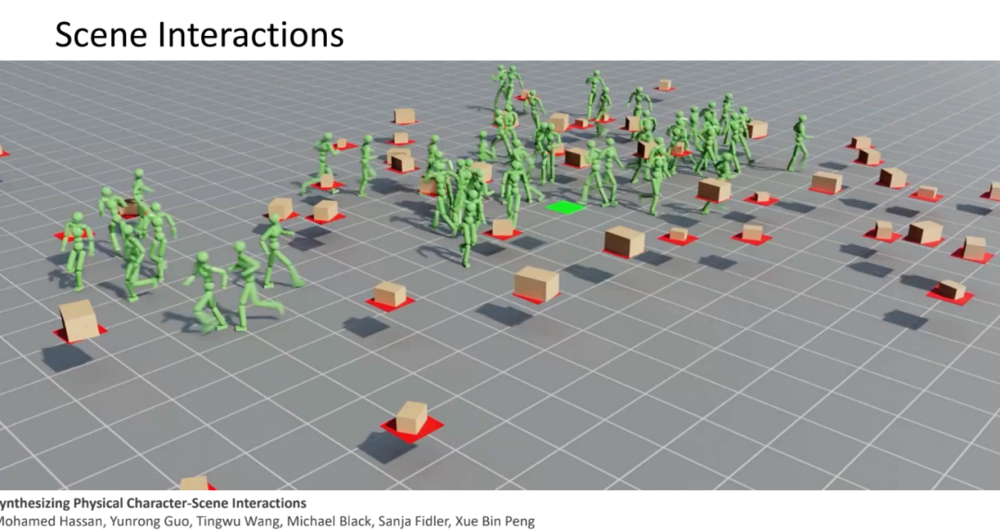

再看一个拾取和放置任务：角色需要拾取一个物体并将其移动到目标位置。同样，通过我们的方法，控制器能够处理来自多个不同位置的物体，以及不同大小和质量的物体——这些都远远超出了原始运动数据的范围。

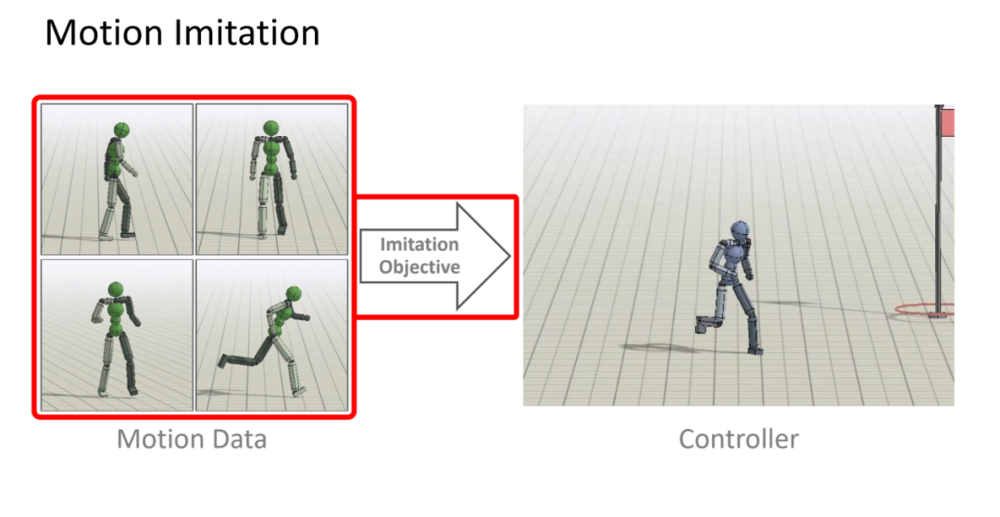

## 进阶方法二：基于生成模型与合成数据的数据集扩展

### 合成数据生成的核心思路

训练更通用控制器的另一种思路是使用更多的运动数据。如果运动控制中的许多挑战源于运动数据的稀缺，那么扩大运动数据集可能会解决很多问题。但正如我们之前提到的，对于许多应用来说，获取大量运动数据的成本相当高，因此仅通过录制数据来解决问题从长远来看可能并不具备可扩展性。

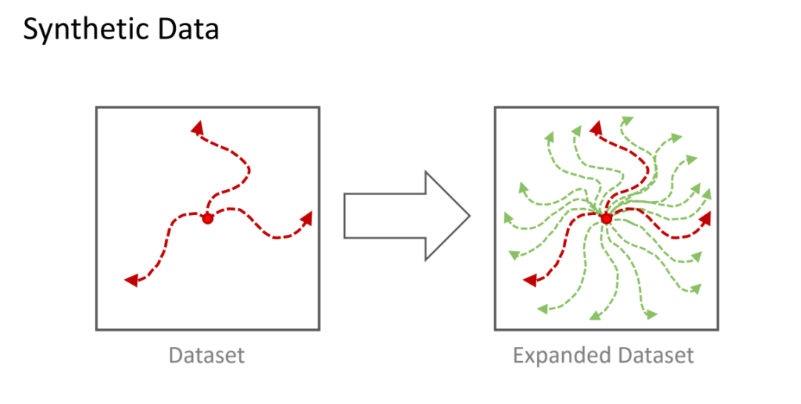

一种更经济的方法是利用**synthetic data**：从初始的小运动数据集出发，通过合成数据扩充该数据集，以填补空白，更好地覆盖智能体可能遇到的所有场景。

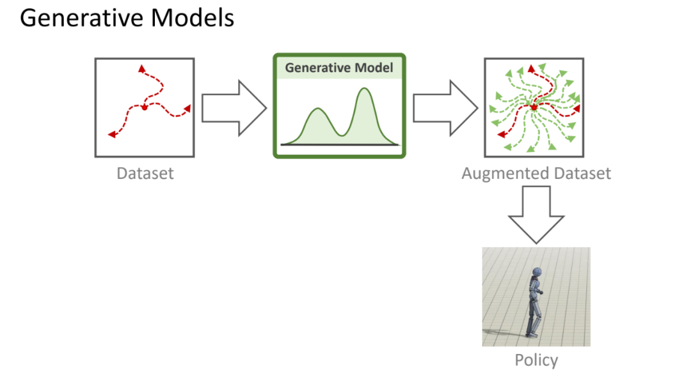

生成合成数据的一种方法是利用生成建模领域的现有成果：在初始运动数据集上训练一个生成模型，然后使用该生成模型生成新的合成数据，用于扩充原始数据集。你可以选择任何常用的生成模型，比如VAE、GAN、diffusion model等。生成大量合成数据后，我们可以用这些数据训练控制器，希望控制器能够获得更通用的行为，更好地覆盖任务的所有变体。

### 文本条件运动生成模型应用

例如，假设有一个简单的移动任务：让仿真角色移动到某个目标位置。我们可以训练一个运动生成模型，生成大量展示角色如何走向不同目标位置的移动行为。如果能够为该任务生成参考运动，我们就可以使用传统的运动跟踪方法，通过模仿特定的参考运动来训练控制器移动到目标位置。在这种情况下，生成模型实际上起到了运动规划器的作用，为角色生成执行任务不同变体的参考轨迹。

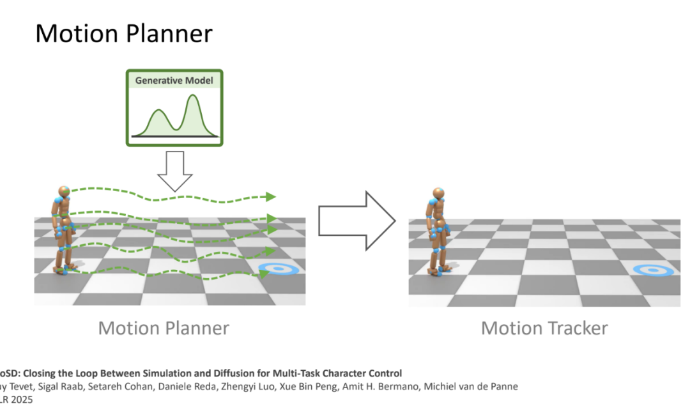

这是该框架的一个应用示例：我们训练了一个text-to-motion diffusion model，该模型能够根据特定的文本提示（如“慢跑”“跳跃”或“跳舞”）生成大量运动数据。通过将扩散模型与特定文本提示相结合，我们可以生成大量该特定行为的数据，然后使用这些数据训练控制器，以这些不同风格的行为移动到目标位置。

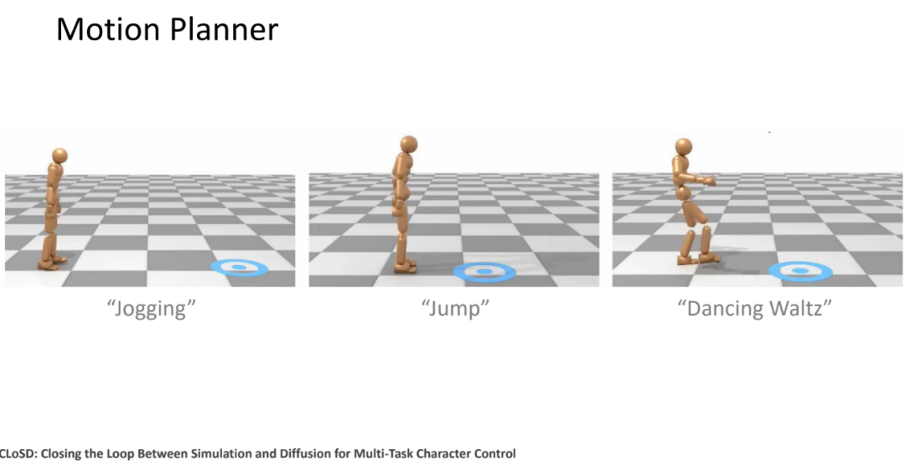

再看一个略微不同的任务变体：我们将模型与“推”“踢”“击打”等不同提示相结合，生成大量数据，训练控制器以不同方式击打物体。

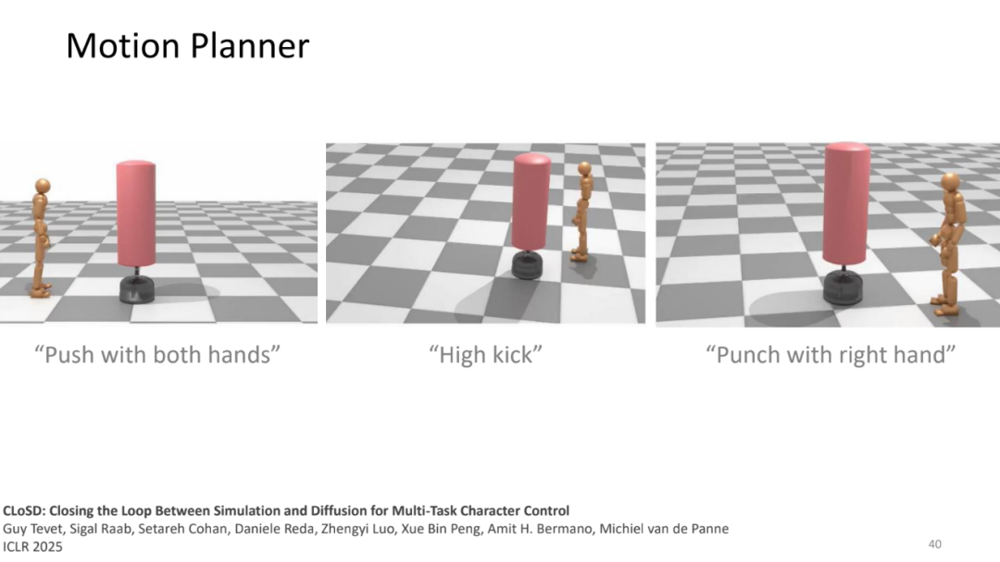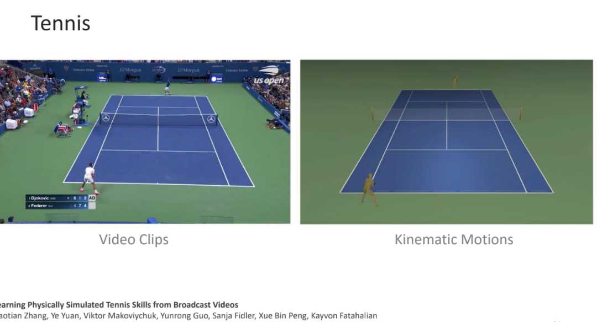

诚然，这些都是相对简单的任务，但类似的方法也可以应用于更复杂的领域。例如，我们从职业网球运动员的视频中重建了一些运动数据，利用这些运动数据训练了一个生成模型（此处为变分自编码器VAE），该模型能够生成大量网球运动。基于这个生成模型，我们可以训练一个底层跟踪控制器来模仿VAE生成的行为，从而让仿真角色能够进行网球运动——该仿真角色被训练将飞来的网球回击到对手场地的多个不同位置，并且在击球落点方面表现相当不错。

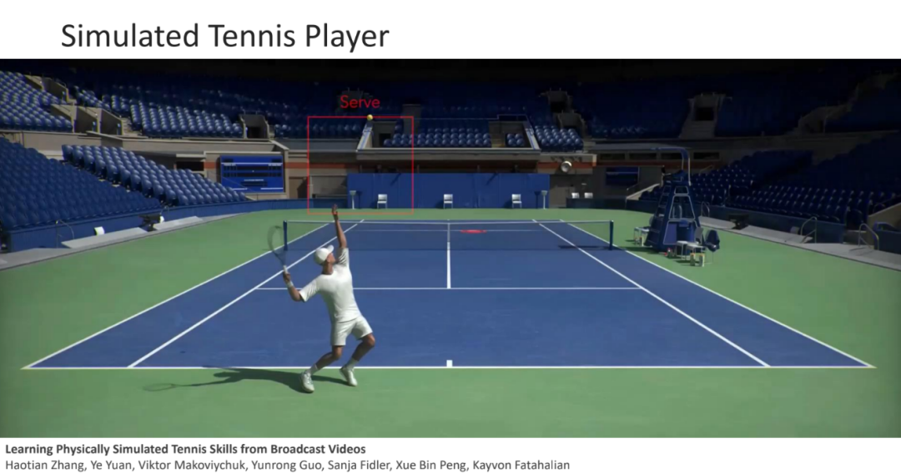

### 迭代式数据增强框架

如果有一个高效的生成模型，我们就可以用它生成大量运动数据，用于训练更通用的控制器。但这些生成模型的能力也有局限性：由于这些生成模型通常是在相对少量的运动数据上训练的，它们在泛化到与原始数据集差异很大的新场景时可能会遇到困难。

例如，我们训练了一个扩散模型来生成在不规则环境中移动的运动，但在这个案例中，角色奔跑的地形与原始数据集中的地形差异很大，导致生成模型难以泛化到这个新场景，生成的行为非常不真实（角色四处漂浮）。在这些运动上训练控制器可能不会得到很好的结果。

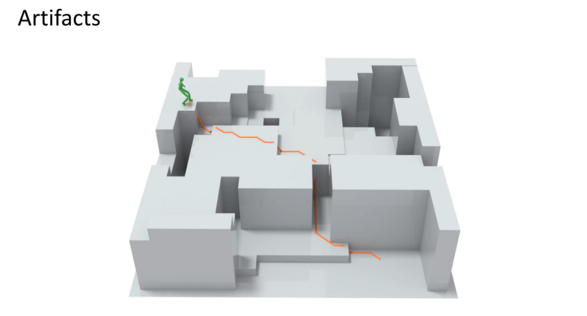

因此，要训练通用的控制器，我们也需要更高效、更通用的运动生成器。一个思路是：既然我们已经在使用合成数据训练控制器，为什么不也使用合成数据训练运动生成器呢？

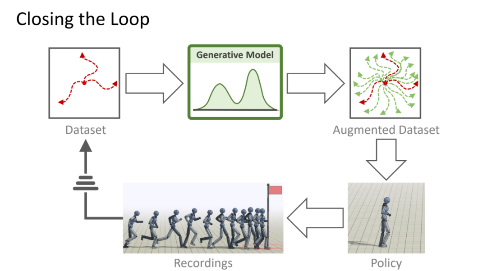

具体来说：

1. 从初始数据集出发，训练一个运动生成器；
2. 使用该生成器生成大量合成数据，用于训练控制器；
3. 训练控制器后，记录控制器产生的新运动，将这些运动作为额外训练数据反馈给生成模型（可能需要进行一些额外过滤，以去除存在严重缺陷的运动）。

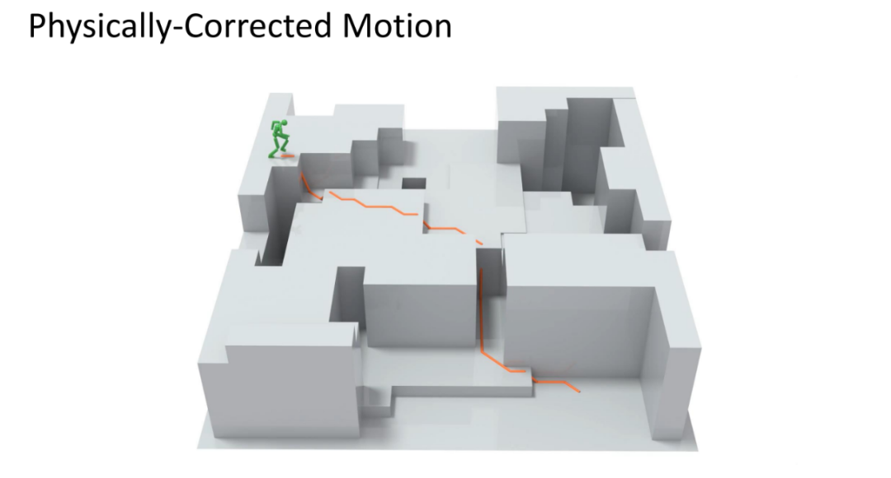

通过从物理仿真中记录运动，并将其作为额外数据训练生成模型，我们可以修正生成模型产生的一些物理上不合理的行为。这些经过物理修正的运动可以作为额外训练数据，训练运动生成模型在这些新环境中产生更符合物理规律的行为。

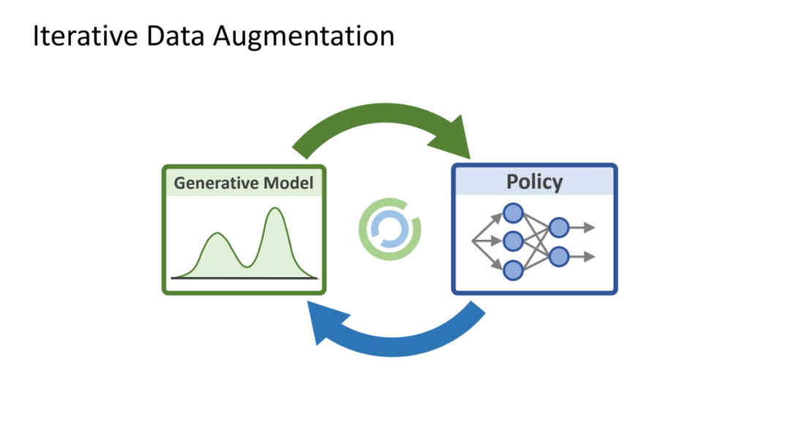

这就形成了一个**iterative data augmentation framework**：生成模型用于生成训练控制器的运动数据，而控制器反过来可以生成更多数据，以提升运动生成模型的能力。我们可以迭代重复这个循环，逐步扩大训练模型所需的运动数据量，同时迭代提升运动生成器和运动控制器的性能。

这就是我们框架的核心思想，下面看看其效果：

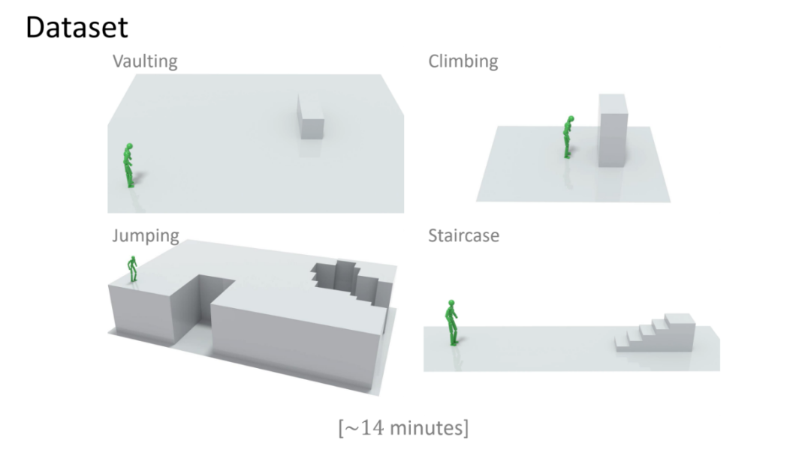

我们的初始运动数据集仅包含14分钟的不同移动行为，这些行为用于在不同的环境障碍物中穿行。基于这个小数据集，我们训练了一个运动扩散模型：对于一个新的地形，我们首先使用路径规划器生成一条穿过该环境的随机路径，然后沿着这条目标路径运行运动生成器，生成穿行该环境的参考运动。得到参考运动后，我们训练一个基于物理的跟踪器来模仿该参考运动，以穿过环境障碍物，然后将仿真中的运动记录下来，作为额外训练数据添加到运动生成器中。

分析该框架不同迭代阶段运动生成器的性能，我们可以看到明显的提升：

- 第一次迭代时，运动生成器仅使用初始运动数据集训练，难以跟随目标路径（角色容易在路径开始处卡住，无法取得太大进展）；
- 经过一次迭代后，运动生成器的性能有所提升，能够更好地跟随目标路径，但生成的运动仍存在一些明显的缺陷；
- 再经过几次迭代后，运动生成器变得更加高效，能够跟随目标路径，同时产生更符合物理规律的行为。

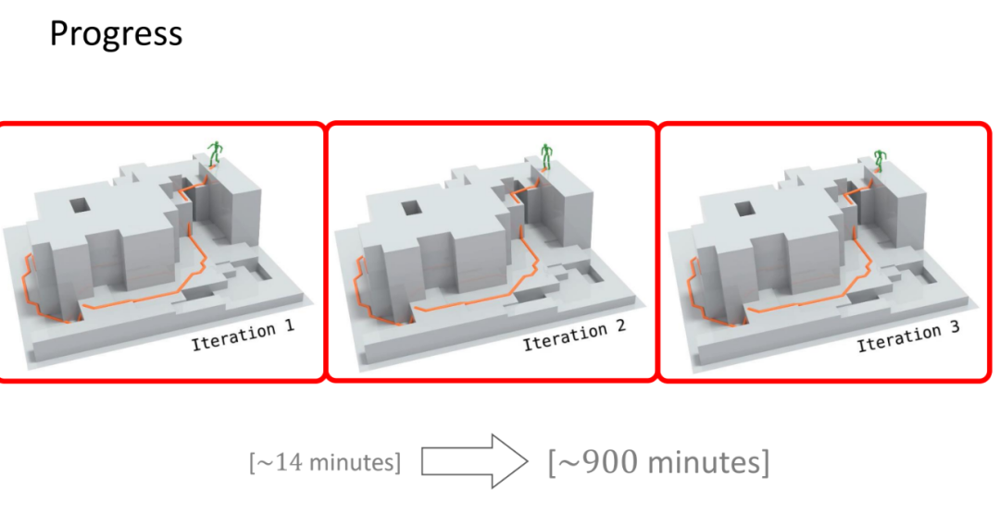

通过反复应用这个迭代框架，我们可以将初始的14分钟运动数据扩展到900多分钟，从而训练出一个更通用的控制器，能够在一些相当复杂的环境中穿行。

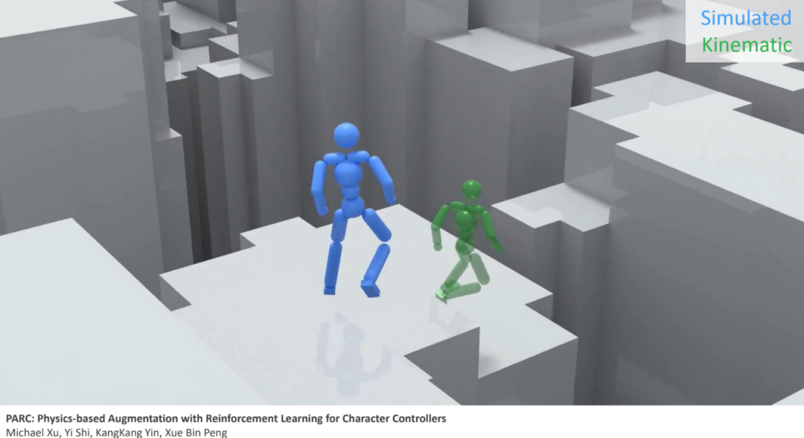

绿色角色代表运动生成器产生的运动学参考运动，蓝色角色是基于物理的仿真角色，其经过训练模仿参考运动，以在这些不规则环境中穿行。在这个案例中，仿真角色能够很好地越过一些相当复杂的环境障碍物，最终得到一个相当高效的控制器，能够在一些随机生成的复杂环境中穿行。

总的来说，角色能够稳定地越过各种不同的环境障碍物，但偶尔也会出现一些失误。

我们还可以分析该框架不同迭代阶段基于物理的控制器的行为，发现一些有趣的涌现行为。例如，角色发现了一种越过较大间隙的运动：跳到对面的边缘，抓住边缘后再爬上去——这种运动在原始数据集中并不存在，但我们的框架能够发现这种新的行为，以越过具有挑战性的障碍物。

再看另一个示例：控制器发现了一种新的行为，角色从高处的边缘跳下，抓住较低的边缘，然后再跳到地面上。这种行为如果让人类演员录制可能会相当危险，但我们的框架能够将数据集中的行为组合起来，创造出这种新的策略。

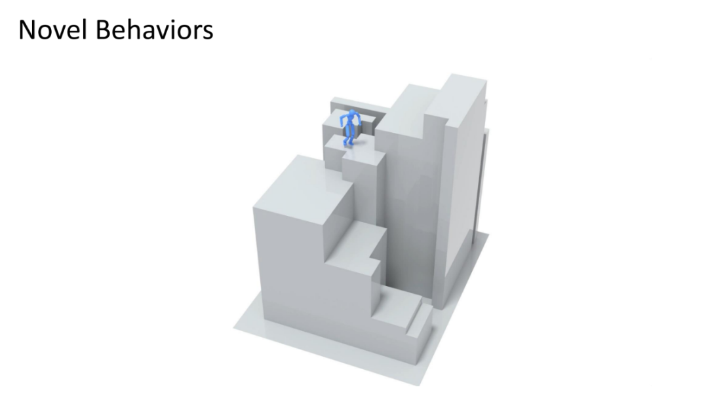

总结一下，针对有限数据集训练更通用控制器的两种方法：

1. 使用更灵活的目标（如对抗性模仿学习）；
2. 利用生成模型和合成数据扩展数据集。

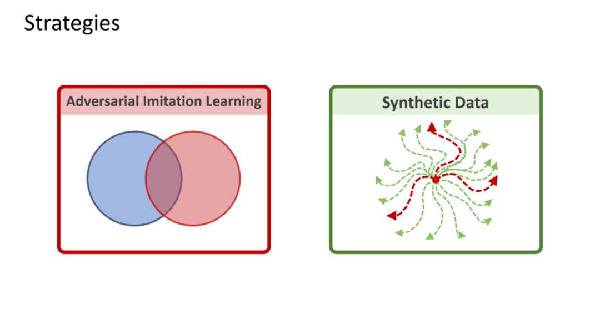

## 仿真到现实的部署挑战与进展

到目前为止，我展示的大部分成果主要来自仿真环境，但我们也在积极尝试将仿真中训练的控制器部署到现实世界的机器人上。例如，我们在一个规模相当不错的数据集上训练了一个运动跟踪控制器，然后将其部署到真实的G1机器人上，该机器人能够执行一些相当灵活的行为。尽管目前技术发展迅速，我们已经看到了更灵活、更动态的行为，但这些控制器并非总能正常工作——事实上，机器人仍然经常摔倒。

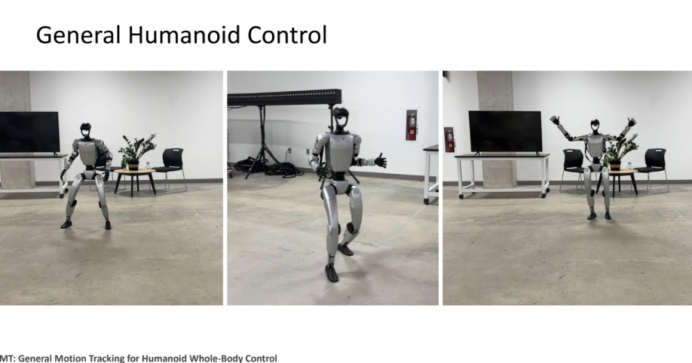

不过，这些跟踪控制器的改进速度非常快，我希望随着这些跟踪控制器的不断完善，它们能够提供一套通用的底层技能库，为构建更强大、更通用的人形机器人奠定基础。

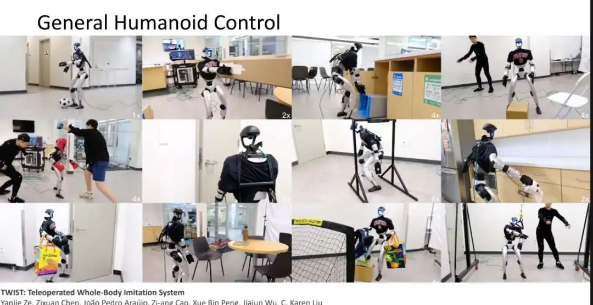

## 问答

### 问题1：在训练人形机器人并将其部署到现实世界时，需要注意哪些事项？或者说，人形机器人在现实世界中展现出了哪些你未曾预料到的行为？

答：我认为最大的问题始终是**sim-to-real gap**。在真实机器人上部署时，我们总会遇到电机方面的巨大差异，以及延迟带来的挑战。因此，任何能够通过适当的系统识别来减小仿真到现实差距的工作，都会让部署过程变得更加容易。

不幸的是，在真实机器人上部署并没有什么秘诀——需要注意很多细节，这些都是必须应对的工程挑战。

### 问题2：在处理仿真与现实之间的动态差异时，通常是使用启发式方法，还是有更正式的调整方法？

答：很遗憾，主要还是依赖启发式方法。我们目前并没有成熟的方法能够确保缩小仿真到现实的差距，更多的是进行domain randomization，观察真实机器人与仿真机器人在行为上的差异，然后调整仿真或随机化方案，以应对这些差异。因此，这在很大程度上更像是一门技艺，而非严格的科学。

### 问题3：我看到很多任务都是单个人类独自完成的，想知道模拟协作行为（如两个人在人行道上擦肩而过，或一个人向另一个人递东西）的难度有多大？需要哪些条件？

答：我认为主要的挑战在于缺乏运动数据。我们目前使用的大多数运动数据集通常只包含单个演员的动作，虽然现在开始出现一些包含多个角色交互的运动数据集，但规模仍然小得多。

从我的角度来看，应用于单个角色的方法同样可以应用于多个角色——在大多数情况下，可以将多个角色视为一个整体。因此，一旦这些多角色交互的数据集变得更加普及，我认为我们完全有能力训练用于多智能体交互的控制器。

### 问题4：你们通常使用哪些数据源？是自己采集的，还是来自在线视频或公开的运动捕捉数据集？

答：我们主要使用AMASS数据集，它是一个公开的运动捕捉数据集。

### 问题5：在仿真工作中，你们主要关注哪些方面？例如，是否考虑了动力学、驱动限制或过渡模型等？

答：问题的核心是我们在仿真中建模了哪些内容。当然，在仿真中我们可以考虑所有的机器人驱动因素，包括驱动限制，但如果给机器人提供无限的力矩输入（这在现实世界中是不可能的），那么在仿真中是可以实现的——这也是为什么将策略部署到真实机器人上会更具挑战性。

一般来说，我们会在仿真中设置力矩限制，所有角色也都有关节限制。但这也取决于仿真平台的支持——在这项研究中，我们使用的是Gym仿真平台，它不幸不支持球形关节的力矩限制，因此我们这个研究中的角色没有力矩限制。但在一些需要部署到真实机器人的研究中，我们会在机器人仿真中建模力矩限制和关节限制，这有助于缩小仿真到现实的差距，但仍然无法完全消除这种差距。

### 问题6：你们的工作重点是缩小仿真到现实的差距，还是更侧重于运动技能本身或迁移？

答：这取决于具体的项目。对于主要在仿真中进行的项目，我们不会过多关注仿真的真实性，而是专注于实现有趣的技能；但对于一些需要迁移到真实机器人的工作，我们会在仿真建模时更加谨慎。

### 问题7：在你们最新的PARC工作中，是否考虑了过滤生成器产生的低质量运动？还是只是单纯地将14分钟的演示数据扩展到900分钟？

答：在这个特定的框架中，一个容易被忽视的步骤是对运动数据进行过滤，以去除存在严重缺陷的合成数据。当从仿真器中生成运动并记录这些运动时，很可能会出现相当多的缺陷（如抖动或穿透），因此我们会使用一些启发式方法来过滤这些运动。

不过，这些启发式方法并不完美，因此我们反馈回去的一些合成数据仍然会包含这些缺陷——这导致PARC的最终结果中，运动仍然存在非常明显的缺陷，质量低于原始数据集。不幸的是，如果多次重复这个框架，运动质量可能会下降。未来一个有趣的研究方向是开发更好的启发式方法或过滤技术，以去除那些我们不希望保留的低质量运动。

### 问题8：过滤的标准是什么？如何平衡策略训练效果与参考数据质量？

答：过滤的标准包括：

1. 运动是否能够让策略从起点成功执行到终点；
2. 检测运动中的大幅抖动、不连续性；
3. 检测角色与环境之间的任何穿透。

如果参考运动质量低，控制器也会产生低质量的结果，因此我们会将这些低质量运动过滤掉，不添加到训练数据中。但需要确认的是，这些低质量数据是来自参考数据本身，而非策略训练不足。我们的做法是为控制器设置一个固定的训练样本量预算，训练完成后就停止——对于一些非常有挑战性的运动，策略可能没有足够的时间充分学习，但我们会对所有运动进行大致相同样本量的训练，以保证公平比较。

### 问题9：未来，很多团队可能会将大量参考运动编码到潜空间中，然后直接使用潜空间作为控制基于物理的策略的新接口。你认为这是一个有趣的方法或方向吗？

答：是的，我认为这是一个很有前景的方向。已有不少论文正是这样做的。其主要优势在于，不再需要依赖运动规划器来生成目标运动——通过潜变量模型，你实际上是在学习高层规划与底层跟踪器之间的通信接口，这可能比强制底层控制器始终跟随目标参考运动更加灵活。

需要注意的是，这需要end-to-end训练来实现这种通信机制——如果只是先训练编码器，然后不进行端到端训练，就无法获得这种能力。在我们之前关于潜变量模型的研究中，我们总是对整个模型进行端到端训练，因此潜变量表示是与策略一起学习的。

### 问题10：对于生成模型的训练数据，一种观点是尽可能多地纳入数据（即使包含一些轻微碰撞等低质量数据），认为生成器会学习到这些情况并泛化；另一种观点是严格过滤低质量数据，仅使用少量高质量数据集训练。你对此有何看法？

答：对我来说，我通常会确保初始运动数据的质量相当高——就像其他机器学习系统一样，“输入是垃圾，输出也是垃圾”（garbage in, garbage out）。如果运动数据中存在大量缺陷，控制器很可能会学习到一些不自然的行为（如频繁抖动或滑动）。

虽然有人认为，训练生成器后冻结它，底层控制器可以通过长时间的强化学习训练来修正这些不自然的指令，但实际上，控制器只能在一定程度上修正这些缺陷。如果生成器的运动中存在不自然的缺陷，仿真控制器仍然会尝试重现这些缺陷（例如，如果参考运动要求关节快速抖动，控制器就会这样做）。因此，进行一些数据筛选，确保数据集相对干净是很有必要的。

### 问题11：当控制器组合不同行为（如行走和击打示例）时，判别器的超参数敏感性如何？是否尝试过更大或更小的模型、不同的序列长度？这对行为拼接有何影响？

答：一般来说，这些对抗性设置可能相当敏感，因此需要仔细调整超参数。对于判别器，我们确实需要进行大量的超参数调优才能让其正常工作，但一旦找到一组好的超参数，就可以在多个不同任务中使用——在这些任务中，我们使用的是完全相同的超参数，并且它们的表现都相对不错。因此，关键在于找到一组可用于实验的初始良好参数。

这与其他机器学习问题类似，都需要确定合适的网络结构和参数，因此这个流程是相当一致的。此外，判别器确实是基于序列工作的——在这个特定示例中，判别器会查看10帧的序列。

### 问题12：目前，控制器的输入通常包括当前状态和目标状态，这自然假设策略是底层跟踪策略，并且需要分层架构（即需要运动规划器）。但人类的许多行为是下意识的（例如，快要摔倒时会下意识地迈出一步来保持平衡）。如何仅通过运动模仿学习到这类行为，真正超越运动跟踪？

答：总的来说，我更倾向于采用端到端的方法。目前很多人使用运动规划器和底层跟踪器的分层架构，主要是因为分开训练这些模块比端到端训练更容易。但就我而言，只要有可能，我更倾向于对这些模型进行端到端训练——这也是我们正在研究的方向。

一种不依赖运动跟踪器、实现端到端训练的方法是使用我们的对抗性模仿学习，它不局限于严格跟踪给定的参考运动；潜变量模型也是另一个示例。

### 问题13：是否会使用自适应采样来改变数据分布？例如，数据集中行走行为占比很高，而跳跃等更具挑战性的行为仅占2%，策略对行走的成功率为100%，对跳跃的成功率仅为6%，此时会如何处理？

答：如今，data reweighting几乎是大多数框架的标准做法。因此，当在大规模数据集上训练时，需要对数据进行一些重新平衡。对于我们来说，当扩展到大规模运动数据集时，我们会根据控制器在不同运动片段上的表现，采用自适应采样来对数据进行重加权——这现在已经是标准做法了。

### 问题14：如果未来考虑智能体与其他物体的交互，你的流程会发生什么变化？是否仍然是生成器和基于物理的策略循环？

答：未来，我们可能不会再单独设置运动生成器和基于物理的跟踪器，而是构建一个不依赖运动生成器和运动规划器的端到端模型。

至于物体交互，我认为只要有运动数据，我们使用的这些运动模仿技术可能仍然适用。最大的变化可能在于感知层面：如何表示物体的状态以及角色周围的环境。我们目前的大多数控制器主要依赖本体感受（proprioception），但对于更复杂的物体交互任务，可能需要将更多的视觉和感知能力融入模型中。除此之外，模仿参考运动的训练策略可能仍然保持相对相似。

归根结底，运动跟踪相当于运动控制领域的监督学习，我认为它在机器学习中不会很快消失。

### 问题15：是否会考虑生成器也生成物体的未来状态？

答：是的，我认为这是合理的。如果依赖运动规划器，那么运动规划器除了预测角色的状态外，可能还需要预测环境的未来状态。这样一来，生成器在某种程度上会天生具备物理感知能力——但这种物理感知能力仅限于它在运动数据集中能够观察到的内容。因此，仅在运动学运动数据上训练的运动规划器，可能不会像与仿真环境交互的基于物理的控制器那样具备强大的物理感知能力。

而扩展我们的PARC工作可能是一种让生成器更贴近物理世界的方法——如果使用来自物理仿真的数据训练运动生成器，它可能会变得更具物理感知能力。

### 问题16：这些策略对训练所用的运动数据的专用性如何？是否需要从AMASS中选择特定的运动，还是可以在AMASS的所有数据上训练策略？

答：这同样取决于具体的项目。对于这个特定的策略，我们精心挑选了一个包含多种移动技能的数据集（这个数据集甚至不是来自AMASS，而是来自SFU数据集）；但对于其他项目（如尝试在G1机器人上训练通用跟踪器），我们也会尝试扩展到AMASS的全部数据。因此，使用的运动数据量取决于特定项目的目标。

### 问题17：你使用运动生成系统生成更多训练数据，同时也展示了从视频中重建运动的示例（如网球相关研究）。你认为从视频中重建运动这条路的可行性如何？是否会因为视频生成的运动中存在太多噪声而难以实现？

答：我认为从视频中重建运动数据是一个非常有前景的方向，我们也有几篇论文正在尝试这样做。但我们一直面临的主要挑战有三个：

1. 基于视觉的姿态估计模型生成的运动质量，仍然远低于运动捕捉（mocap）获得的质量，往往包含大量缺陷；
2. 全局运动的估计不够可靠；
3. 从现实世界视频中重建的许多运动中，人类并非在完全平坦、空旷的环境中行走——环境中总会有其他物体和各种不规则因素。如果仅重建运动而不重建环境，这些运动往往无法使用（例如，角色可能看起来像是在半空中行走，你无法知道角色在踩踏什么或与什么交互）。

由于这些挑战，我们发现很难将视频模仿学习扩展到除特定任务领域之外的更广泛场景。但计算机视觉领域有很多工作正在改进这些运动重建和场景重建方法，Video Mimic就是一个示例，展示了当前最先进的方法能够实现的效果。我认为随着这些基于视觉的技术不断改进，视频最终将成为一种非常有价值的运动数据来源——我们可能还没有完全达到那个阶段，但这很可能只是时间问题。

### 问题18：你们使用的是具有特定尺寸和比例的人形机器人，处理具有不同比例、不同身高的人形机器人的难度有多大？

答：总的来说，难度并不是很大。已有相当多的现有研究尝试在具有不同形态的角色上训练通用控制器，并且效果相当不错。这本质上只是一个训练扩展的问题——你可以将morphology randomization视为仿真到现实迁移中应用的另一种领域随机化。因此，我认为这在很大程度上是可行的——事实上，已经有相关研究实现了这一点。

## 7. 结束语与致谢

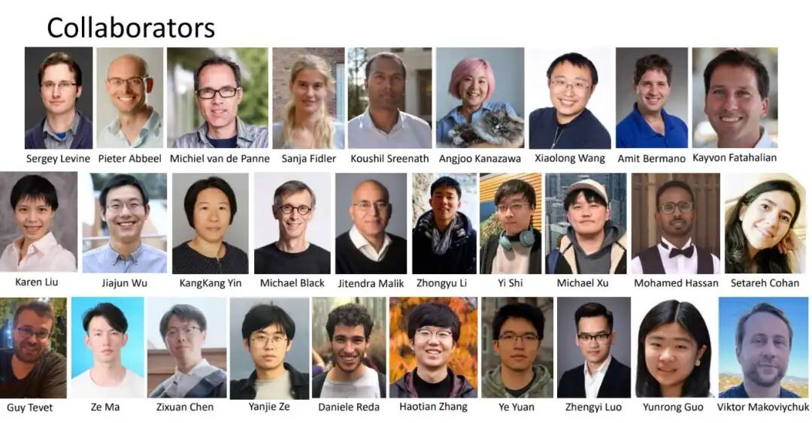

以上就是我今天想要分享的全部内容。我想借此机会感谢这些年来与我合作的所有合作者和学生——没有他们的辛勤工作，这些研究成果都无法实现。

完

---

欢迎“点赞”、“收藏”、“在看” 三连

可添加微信交流（备注 姓名+研究方向/业务方向）

