# 盘点 | VLN 领域最具影响力的 10 项代表性研究

导航图、深度、里程计全扔掉，VLN是怎么走到这一步的？

——VLN的"减负"史

2018年，CVPR Spotlight论文《Vision-and-Language Navigation》提出R2R数据集和Matterport3D模拟器，正式将视觉语言导航（VLN）确立为一个可量化、可复现的具身智能研究任务。

此后七年，这一领域经历了从离散图导航到连续空间探索、从单纯“抵达”到“找到并指认目标”、从RNN序列建模到Transformer预训练和大模型端到端决策的快速迭代。

本文从数据集、仿真平台、算法框架、Benchmark 四个维度，梳理了该领域自 2018 年以来【最具代表性的 10 项工作】。

注：综合参考 Google Scholar 引用量、社区影响力及技术路线代表性等。

**我们开设此账号，除了想要向各位对【具身智能】感兴趣的人传递前沿权威的知识讯息外，也想和大家一起见证它到底是泡沫还是又一场热浪？****欢迎关注****【深蓝具身智能】**👇

数据集与仿真平台

## R2R — VLN 任务的奠基性工作

- 论文题目：Vision-and-Language Navigation: Interpreting Visually-Grounded Navigation Instructions in Real Environments
- 研究团队：澳大利亚国立大学、阿德莱德大学等
- 发表：CVPR 2018
- Google Scholar 引用量：约 2,258 次
- 研究内容：

R2R（Room-to-Room ）是 VLN 领域的起点。论文同时贡献了三个核心要素：

基于 Matterport3D 真实室内扫描数据构建的导航图仿真平台、包含 21,567 条人工标注指令的 R2R 数据集，以及用于衡量导航成功率的评测 Benchmark。

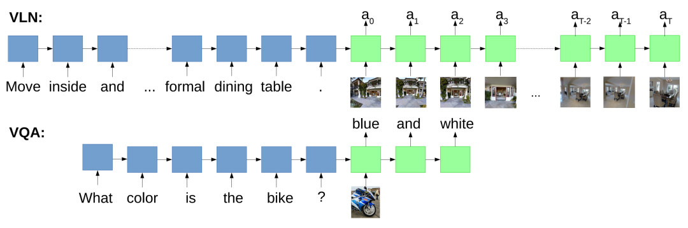

▲图 | R2R 论文中 VLN 与 VQA 任务的对比示意：VLN 智能体需在多步全景观测序列中逐步输出动作（上），与视觉问答任务的单步预测形成对比（下），体现了 VLN 任务的时序决策特性©【深蓝具身智能】编译

R2R 将导航任务形式化为"给定全景图序列和自然语言指令，预测下一步动作"，并提出了序列到序列基线模型（Seq2Seq）。

此后几乎所有 VLN 工作都在 R2R 数据集上进行评测，其导航图仿真器也成为后续大量工作的基础设施。

### VLN-CE — 连续环境中的视觉语言导航

- 论文题目：Beyond the Nav-Graph: Vision-and-Language Navigation in Continuous Environments
- 研究团队：俄勒冈州立大学、佐治亚理工学院、Facebook AI Research
- 发表：ECCV 2020
- Google Scholar 引用量：约 622 次

- 研究内容

R2R 中的智能体只能在预定义的离散导航图节点间跳转 ，与真实机器人的运动方式存在较大差距。

VLN-CE 基于 Habitat 仿真平台，将 VLN 任务迁移到连续三维环境，智能体需要通过前进、转向等底层动作在物理空间中移动，不再依赖预设的导航图。

这一设定大幅提升了任务难度，也使 VLN 研究向真实机器人部署迈近了一步。

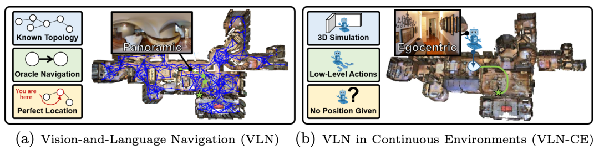

▲图 | VLN-CE 与传统 R2R 的设定对比：左侧为离散导航图模式（已知拓扑、全景视角、精确定位），右侧为连续环境模式（3D 仿真、底层动作、无精确位置），体现了两种设定在感知与控制层面的本质差异©【深蓝具身智能】编译

VLN-CE 同时提供了与 R2R 数据集对应的连续环境版本，成为后续连续环境 VLN 研究的标准 Benchmark。

### REVERIE — 高层指令下的远程目标定位导航

- 论文题目：REVERIE: Remote Embodied Visual Referring Expression in Real Indoor Environments
- 研究团队：Yuankai Qi, Qi Wu, Peter Anderson, Xin Wang 等
- 发表：CVPR 2020
- Google Scholar 引用量：约 584 次
- 研究内容：

R2R 的指令是详细的逐步描述（如"向左转 ，走过沙发，进入厨房"），而 REVERIE 提出了更具挑战性的高层指令设定：

指令仅描述目标物体和大致位置（如"去厨房，拿起炉灶旁的酒瓶"），智能体不仅需要导航到正确房间，还需要在到达后定位并识别目标物体。

REVERIE 数据集基于 Matterport3D，包含 90 栋建筑内的 10,567 个全景位置，标注了 4,140 个目标物体和 21,702 条人工众包指令，并为每个目标物体提供了边界框标注。

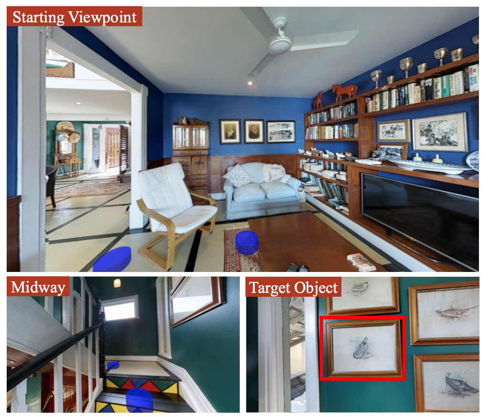

▲图3 | REVERIE 任务示例：智能体接收高层指令（如"去厨房找到炉灶旁的酒瓶"），需先完成远程导航，再在目标区域定位具体物体，任务同时包含导航路径标注和目标物体边界框标注©【深蓝具身智能】编译

该工作将 VLN 与视觉目标定位任务结合，推动了具身导航向更复杂指令理解方向的发展。

## 算法框架

### PREVALENT — VLN 预训练范式的开创性工作

- 论文题目：Towards Learning a Generic Agent for Vision-and-Language Navigation via Pre-training
- 研究团队：杜克大学、微软研究院
- 发表：CVPR 2020
- Google Scholar 引用量：约 438 次
- 研究内容：

此前的工作 ，VLN 模型通常从头训练，缺乏对视觉-语言对齐关系的充分学习。

PREVALENT 首次将预训练-微调范式引入 VLN 领域：

在大规模图像-文本-动作三元组数据上，通过掩码语言建模（Masked LM）和动作预测两个自监督任务对多模态 Transformer 进行预训练，再在下游 VLN 任务上微调。

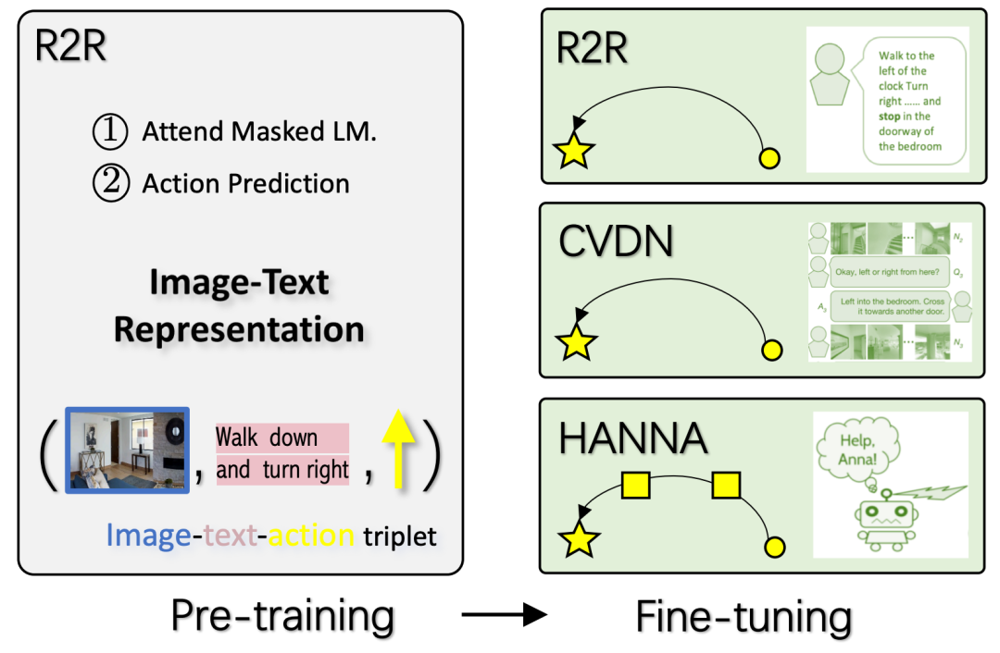

▲图4 | PREVALENT 预训练-微调范式：模型在图像-文本-动作三元组上进行自监督预训练，学习跨模态对齐表示，再在 R2R（域内任务）和 CVDN、HANNA（域外任务）上进行微调验证©【深蓝具身智能】编译

这一范式显著提升了模型的跨模态对齐能力，并为后续 VLN↻BERT、HAMT 等大量基于预训练的工作奠定了方法论基础。

### VLN↻BERT — 循环状态感知的跨模态 Transformer

- 论文题目：VLN↻BERT: A Recurrent Vision-and-Language BERT for Navigation
- 作者：澳大利亚国立大学、阿德莱德大学
- 发表：CVPR 2021
- Google Scholar 引用量：约 483 次
- 研究内容：

标准 BERT 模型处理的是静态序列 ，而 VLN 任务要求智能体在时序上逐步做出决策。

VLN↻BERT 的核心贡献是在多层 Transformer 中引入循环状态机制：

在每个时间步，模型维护一个状态 token，将历史信息压缩后与当前全景观测和语言指令一同输入 Transformer，输出下一步动作决策。

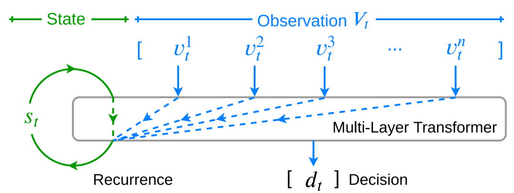

▲图 | VLN↻BERT 架构：状态 token 随时间步循环更新，与当前全景观测一同输入多层 Transformer，实现对部分可观测时序导航输入的建模©【深蓝具身智能】编译

这一设计使 BERT 能够处理部分可观测的时序导航输入，在 R2R、REVERIE 等多个 Benchmark 上取得了当时的最优性能，并成为后续大量工作的基础架构。

### HAMT — 将完整历史观测引入多模态 Transformer

- 论文题目：History Aware Multimodal Transformer for Vision-and-Language Navigation
- 研究团队：
- 发表：NeurIPS 2021
- Google Scholar 引用量：约 455 次
- 研究内容：法国国家信息与自动化研究所等

VLN↻BERT 通过单一状态 token 压缩历史信息 ，存在信息丢失的问题。

HAMT 提出了更完整的历史建模方案：使用层次化 Vision Transformer（ViT） 对历史全景观测序列进行编码，将完整的历史观测、历史动作序列和当前观测一同输入跨模态 Transformer 进行联合编码。

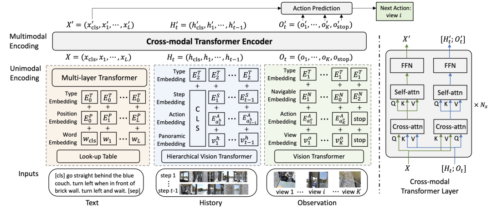

▲图 | HAMT 架构：模型对文本指令（Text）、完整历史观测（History）和当前全景观测（Observation）进行联合编码，通过跨模态 Transformer 预测下一步动作©【深蓝具身智能】编译

这一设计使模型能够在决策时充分利用过去所有时间步的视觉信息，在 R2R、REVERIE、CVDN 等多个 Benchmark 上均取得了当时的最优性能，成为历史感知 VLN 方法的重要参考工作。

### DUET — 双尺度图变换器实现全局规划与局部动作协同

- 论文题目：Think Global, Act Local: Dual-scale Graph Transformer for Vision-and-Language Navigation
- 研究团队：法国国家信息与自动化研究所等
- 发表：CVPR 2022
- Google Scholar 引用量：约 369 次
- 研究内容：

DUET 的核心思路是将导航过程分解为两个尺度：

在全局尺度上 ，模型在线构建拓扑地图，利用粗粒度图编码对所有已探索节点进行全局规划，预测下一个目标位置；

在局部尺度上，对当前节点的全景观测进行细粒度跨模态编码，生成精确的局部动作。两个尺度的表示通过动态融合机制结合，最终输出导航决策。

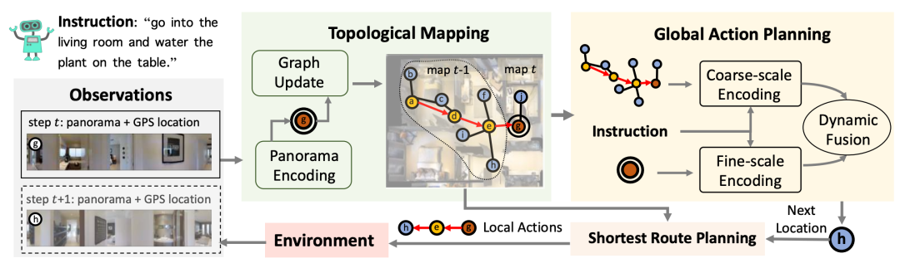

▲图 | DUET 框架：智能体在线构建拓扑地图（Topological Mapping），通过粗粒度编码进行全局动作规划（Global Action Planning），结合局部细粒度编码完成最终导航决策©【深蓝具身智能】编译

DUET 在 R2R、REVERIE、SOON 三个 Benchmark 上均达到了当时的最优性能，是 VLN 领域拓扑建图路线的代表性工作。

### ScaleVLN — 大规模数据生成推动性能上限

- 论文题目：Scaling Data Generation in Vision-and-Language Navigation
- 研究团队：澳大利亚国立大学、上海AI Lab
- 发表：ICCV 2023
- Google Scholar 引用量：约 185 次
- 研究内容：

VLN 模型的性能瓶颈在多大程度上来自训练数据规模不足？

为解决这一问题，ScaleVLN提出了一套自动化数据生成流程：利用 1,200+ 个真实三维场景（来自 HM3D 和 Gibson 数据集 ），通过路径采样、图像风格迁移（Co-Mod GAN）和自动指令生成，构建了包含 490 万条指令-轨迹对的大规模 VLN 数据集。

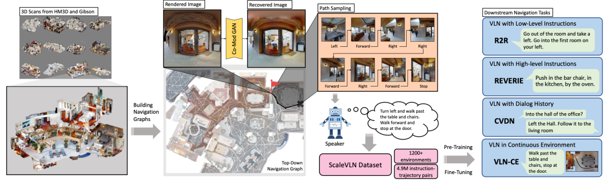

▲图 | ScaleVLN 数据生成流程：从 HM3D 和 Gibson 的 1,200+ 个三维场景中采样路径，经图像风格恢复和自动指令生成，构建大规模 VLN 训练数据，支持 R2R、REVERIE、CVDN、VLN-CE 等多个下游任务©【深蓝具身智能】编译

在此数据集上预训练后，R2R 测试集的成功率从此前最优的约 69% 提升至 80%，REVERIE 等其他 Benchmark 也取得了显著提升。

ScaleVLN 表明，数据规模扩展是提升 VLN 性能的有效路径之一。

### ETPNav — 连续环境中的在线拓扑规划导航

- 论文题目：ETPNav: Evolving Topological Planning for Vision-Language Navigation in Continuous Environments
- 研究团队：中国科学院大学
- 发表：IEEE TPAMI 2024
- Google Scholar 引用量：约 231 次
- 研究内容：

ETPNav 专注于连续环境（VLN-CE ）下的导航问题，提出了一个由三个模块串联的框架：

> 拓扑建图模块在导航过程中动态维护和更新拓扑图；
>
> 跨模态规划模块基于语言指令和当前拓扑图预测目标路径；
>
> 控制模块将规划路径转化为底层动作，并内置避障机制。

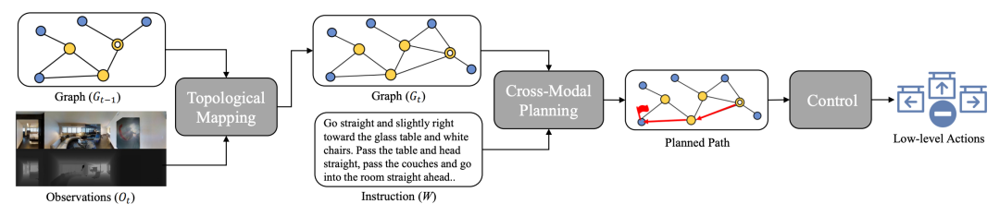

▲图9 | ETPNav 框架：拓扑建图（Topological Mapping）、跨模态规划（Cross-Modal Planning）和底层控制（Control）三模块串联，实现连续环境下的端到端导航©【深蓝具身智能】编译

ETPNav 在 R2R-CE 和 RxR-CE 两个连续环境 Benchmark 上分别取得了超过10% 和 20% 的性能提升，是连续环境 VLN 领域的重要基线工作之一。

### NaVid — 视频流驱动的大视觉语言模型导航

- 论文题目：NaVid: Video-based VLM Plans the Next Step for Vision-and-Language Navigation
- 研究团队：北京大学、BAAI等
- 发表：RSS 2024
- Google Scholar 引用量：约 324 次
- 研究内容：

NaVid 代表了 VLN 领域与大型视觉语言模型（VLM ）结合的方向。

与此前方法不同，NaVid 将导航历史建模为视频流输入，以 Vicuna-7B 为语言骨干，通过观测编码器将历史帧序列和当前帧压缩为 token 序列，与语言指令一同输入 VLM 预测下一步动作。

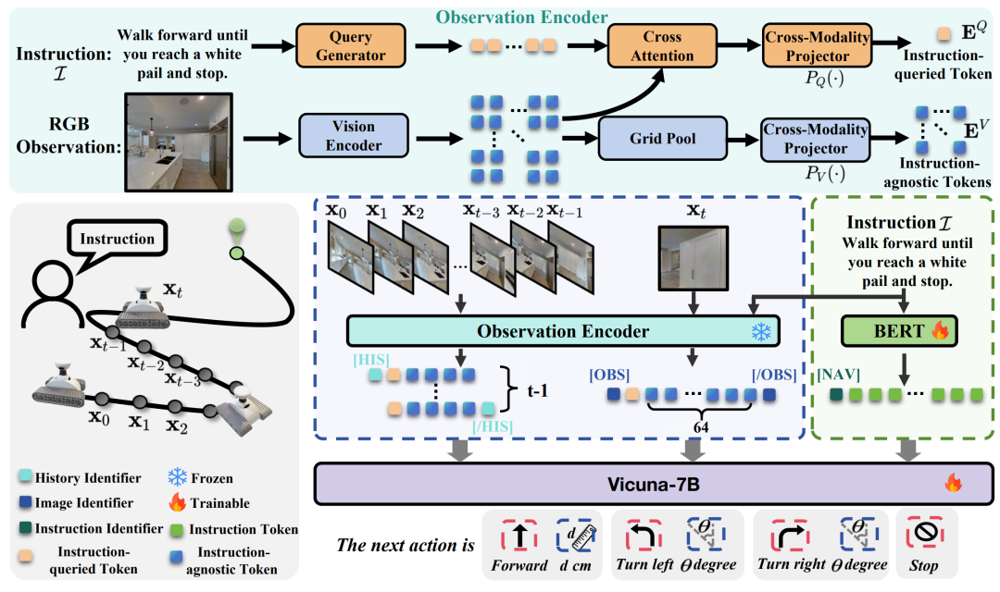

▲图10 | NaVid 架构：历史观测帧序列和当前帧经观测编码器压缩后，与语言指令一同输入 Vicuna-7B，直接输出前进距离、转向角度等底层导航动作©【深蓝具身智能】编译

NaVid 无需地图、里程计或深度传感器输入，仅依赖 RGB 视频流即可完成导航，并在仿真环境（VLN-CE）和真实机器人（Turtlebot4）上均验证了可行性，展示了 VLM 在具身导航任务中的 Sim2Real 迁移潜力。

## 一步步"减负"

从上述 10 项工作的演进脉络来看，VLN 领域大致经历了三个发展阶段。

- 第一阶段：任务定义与基础设施建设；
- 第二阶段：预训练范式和架构创新；
- 第三阶段：数据扩展和大模型融合。

从R2R建立第一个标准化基准，到NaVid仅凭单目RGB视频流实现领先性能，这之间贯穿着一条清晰的脉络：**逐步剥离导航任务中对显式辅助信号，如导航图、深度图、里程计的依赖，向更接近人类天然感知能力的端到端决策方向演进**。

下一阶段，如何将大型视觉语言模型的通用能力与导航任务的时序决策需求有效结合，同时降低对仿真环境的依赖、提升真实场景的泛化能力，仍是该领域的核心挑战。

相关阅读➡️[10年VLN之路：详解具身智能「视觉-语言-导航」三大技术拐点！](https://mp.weixin.qq.com/s?__biz=MzkwMDcyNDUzMQ==&mid=2247486817&idx=1&sn=39e5ea88bb60739f01c6ae02bbedafed&scene=21#wechat_redirect)

VLN系列课程➡️深蓝学院《视觉语言导航VLN：理论与实践》

## Ref :

1. Vision-and-Language Navigation: Interpreting visually-grounded navigation instructions in real environments（https://arxiv.org/abs/1711.07280）2. Beyond the Nav-Graph: Vision-and-Language Navigation in Continuous Environments（https://arxiv.org/pdf/2004.02857）3. REVERIE: Remote Embodied Visual Referring Expression in Real Indoor Environments（https://arxiv.org/pdf/1904.10151）4. Towards Learning a Generic Agent for Vision-and-Language Navigation via Pre-training（https://arxiv.org/pdf/2002.10638）5. VLN↻BERT: A Recurrent Vision-and-Language BERT for Navigation（https://arxiv.org/pdf/2011.13922）6. History Aware Multimodal Transformer for Vision-and-Language Navigation（https://arxiv.org/pdf/2110.13309）7. Think Global, Act Local: Dual-scale Graph Transformer for Vision-and-Language Navigation（https://arxiv.org/pdf/2202.11742）8. Scaling Data Generation in Vision-and-Language Navigation（https://arxiv.org/pdf/2307.15644）9. ETPNav: Evolving Topological Planning for Vision-Language Navigation in Continuous Environments（https://arxiv.org/pdf/2304.03047）10. NaVid: Video-based VLM Plans the Next Step for Vision-and-Language Navigation（https://arxiv.org/pdf/2402.15852）

编辑｜阿豹

审编｜具身君

 ****推荐阅读**
[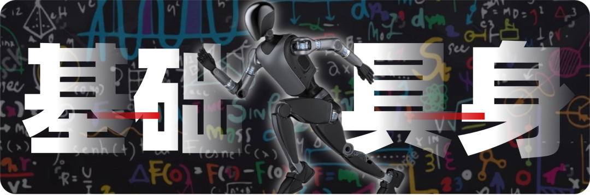](https://mp.weixin.qq.com/mp/appmsgalbum?__biz=MzkwMDcyNDUzMQ==&action=getalbum&album_id=4525948187102363653#wechat_redirect)

****

**【深蓝具身智能】****的原创内容均由作者团队倾注个人心血制作而成，希望各位遵守原创规则珍惜作者们的劳动成果；未经授权禁止任何机构或个人抓取本账号内容，进行洗稿/训练，否则侵权必究⚠️⚠️**

**投稿｜寻求合作｜研究工作推荐：私信点击【商务合作】**

点击❤收藏并推荐本文**
