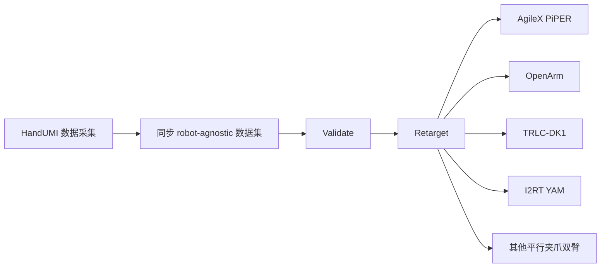

# HandUMI Software（robonet-ai/handumi-sw）

> 来源归档

- **标题：** HandUMI Software
- **类型：** repo
- **链接：** https://github.com/robonet-ai/handumi-sw
- **项目页：** https://robonet-ai.github.io/handumi-sw/
- **硬件仓：** https://github.com/BrikHMP18/HandUMI
- **Quest 应用：** https://github.com/robonet-ai/handumi-quest-app
- **机构：** RoboNet AI
- **许可证：** Apache-2.0
- **入库日期：** 2026-07-19
- **一句话说明：** 面向**平行夹爪双臂**的 HandUMI 无机器人示教软件栈：一次采集、校准与 QA 后，将同步数据重定向/回放到 AgileX PiPER、OpenArm、TRLC-DK1、I2RT YAM 等固定基座双臂，并导出 **LeRobot v3 兼容**数据集。
- **沉淀到 wiki：** [handumi](../../wiki/entities/handumi.md)

---

## 核心定位

[HandUMI](https://github.com/BrikHMP18/HandUMI) 是可穿戴手持示教接口；本仓 **handumi-sw** 提供其**同步数据采集、校准、验证、仿真/真机回放、遥操作与机器人重定向**软件。原始捕获保持 **robot-agnostic**；控制器到 TCP 的物理标定指纹写入数据集元数据，保证后续转换可复现。

官方 README 核心叙事：**Collect once, retarget to many robots** —— 无需为每台目标臂重新遥操作采集。

---

## 核心工作流（README 摘要）

---

## 支持范围（2026-07 项目页核查）

| 类别 | 内容 |
|------|------|
| **追踪** | PICO（XRoboToolkit）；Meta Quest（[handumi-quest-app](https://github.com/robonet-ai/handumi-quest-app)） |
| **目标双臂** | AgileX PiPER、OpenArm、TRLC-DK1、I2RT YAM（另列 Axol 仿真支持） |
| **真机遥操作** | AgileX PiPER、OpenArm（可选 backend） |
| **数据格式** | LeRobot-compatible synchronized captures |
| **开源状态** | **已开源** — 软件 Apache-2.0；数据集/硬件/头显应用/商标许可另计 |

---

## 安装与 CLI（README）

- 依赖：**uv** + Python **3.12+**
- 默认安装 PICO（XRoboToolkit）支持；`bash install.sh --skip-xrt` 可仅保留 Meta Quest 工作站
- 入口示例：`handumi-record --help`

---

## 对 wiki 的映射

- 实体页：[handumi](../../wiki/entities/handumi.md)
- 任务交叉：[teleoperation](../../wiki/tasks/teleoperation.md)、[bimanual-manipulation](../../wiki/tasks/bimanual-manipulation.md)
- 框架交叉：[lerobot](../../wiki/entities/lerobot.md)
- 谱系对照：[paper-bifrost-umi](../../wiki/entities/paper-bifrost-umi.md)、[paper-halomi-humanoid-loco-manipulation](../../wiki/entities/paper-halomi-humanoid-loco-manipulation.md)（人形/全身无机器人示范路线）
