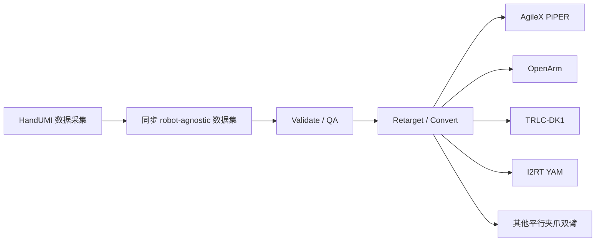

# HandUMI Software（robonet-ai/handumi-sw）

> 来源归档

- **标题：** HandUMI Software
- **类型：** repo
- **链接：** https://github.com/robonet-ai/handumi-sw
- **项目页 / 文档：** https://robonet-ai.github.io/handumi-sw/
- **硬件仓：** https://github.com/robonet-ai/handumi-hw（旧链 [BrikHMP18/HandUMI](https://github.com/BrikHMP18/HandUMI) 301 跳转）
- **Quest 应用：** https://github.com/robonet-ai/handumi-quest-app
- **机构：** RoboNet AI
- **许可证：** Apache-2.0（软件与文档）；数据集 / 硬件 / 头显应用 / 商标另计
- **包版本（pyproject）：** `handumi` 0.1.0；Python **≥3.12**；依赖钉 `lerobot[feetech]==0.5.1`
- **入库日期：** 2026-07-19
- **刷新日期：** 2026-07-27
- **一句话说明：** 面向**平行夹爪双臂**的 HandUMI 无机器人示教软件栈：一次采集、校准与 QA 后，将同步数据重定向/回放到 AgileX PiPER、OpenArm、TRLC-DK1、I2RT YAM 等固定基座双臂，并导出 **LeRobot v3 兼容**数据集。
- **沉淀到 wiki：** [handumi](../../wiki/entities/handumi.md)

---

## 核心定位

[HandUMI 硬件](./handumi-hw.md) 是可穿戴手持示教接口；本仓 **handumi-sw** 提供其**同步数据采集、校准、验证、仿真/真机回放、遥操作与机器人重定向**软件。原始捕获保持 **robot-agnostic**；控制器到 TCP 的物理标定指纹写入数据集元数据，保证后续转换可复现。

官方 README 核心叙事：**Collect once, retarget to many robots** —— 无需为每台目标臂重新遥操作采集。

文档站价值主张：双臂 + 平行夹爪是现实世界中开始创造价值的正确具身形态；HandUMI 帮助初创公司加速部署、帮助研究人员做更多实验。

---

## 核心工作流（README + 文档）


```mermaid
flowchart LR
    A[HandUMI 数据采集] --> B[同步 robot-agnostic 数据集]
    B --> C[Validate / QA]
    C --> D[Retarget / Convert]
    D --> E[AgileX PiPER]
    D --> F[OpenArm]
    D --> G[TRLC-DK1]
    D --> H[I2RT YAM]
    D --> I[其他平行夹爪双臂]
```

统一 CLI：`handumi`（短别名 `hu`）。典型命令：`handumi doctor`、`handumi setup`、`handumi record`、`handumi validate`、`handumi replay`、`handumi convert`、`handumi teleop` / `teleop-real`。

---

## 支持范围（2026-07-27 项目页 / README / docs 核查）

| 类别 | 内容 |
|------|------|
| **追踪** | PICO（XRoboToolkit）；Meta Quest（[handumi-quest-app](https://github.com/robonet-ai/handumi-quest-app)） |
| **目标双臂（README 主表）** | AgileX PiPER、OpenArm、TRLC-DK1、I2RT YAM |
| **仿真资产 / 配置另见** | Axol、Galaxea R1-Lite（`configs/robots/`、`assets/`；以文档与 YAML 为准） |
| **真机遥操作** | AgileX PiPER、OpenArm（可选 backend）；TRLC / Axol 等以仿真回放为主 |
| **数据格式** | LeRobot-compatible synchronized captures（钉 `lerobot==0.5.1`） |
| **开源状态** | **已开源** — 软件 Apache-2.0；硬件见 [handumi-hw](./handumi-hw.md) |

| 双臂平台 | 上游仓库 |
|----------|----------|
| AgileX PiPER | [agilexrobotics/piper_ros](https://github.com/agilexrobotics/piper_ros) |
| OpenArm | [enactic/openarm](https://github.com/enactic/openarm) |
| TRLC-DK1 | [robot-learning-co/trlc-dk1](https://github.com/robot-learning-co/trlc-dk1) |
| I2RT YAM | [i2rt-robotics/i2rt](https://github.com/i2rt-robotics/i2rt) |

---

## 安装与可选 profile（README / installation）

- 依赖：**uv** + Python **3.12+**
- `bash install.sh`（默认含 PICO/XRoboToolkit）；`--skip-xrt` 仅 Quest
- 可选 extras：`sim`、`piper`、`openarm`、`cuda`
- 也可：`pip install "handumi[sim,piper,openarm] @ git+https://github.com/robonet-ai/handumi-sw.git"`

```bash
git clone https://github.com/robonet-ai/handumi-sw.git
cd handumi-sw
bash install.sh
source .venv/bin/activate
cp configs/rig.example.yaml configs/rig.yaml   # install.sh 通常已生成
handumi doctor
handumi record --output-dir outputs/my-first-dataset --dry-run
```

---

## QA / 转换要点（docs/workflows/datasets）

- `handumi validate <dataset> --strict` → `meta/handumi_quality.json`（拒收跟踪丢失、同步错误、冻结位姿、过短 episode 等）
- `handumi convert … --robot <id>` 生成目标臂专用数据集，默认 `--retarget-mode auto`（有桌面标定则 `absolute-table`）
- 原始 `observation.state` / 相机 / Feetech / tracking 通道保留，便于换 embodiment 再验

---

## 对 wiki 的映射

- 实体页：[handumi](../../wiki/entities/handumi.md)
- 硬件 / Quest：[handumi-hw](./handumi-hw.md)、[handumi-quest-app](./handumi-quest-app.md)
- 文档站：[handumi-sw 站点](../sites/handumi-sw.md)
- 任务交叉：[teleoperation](../../wiki/tasks/teleoperation.md)、[bimanual-manipulation](../../wiki/tasks/bimanual-manipulation.md)
- 框架交叉：[lerobot](../../wiki/entities/lerobot.md)
- 谱系对照：[paper-bifrost-umi](../../wiki/entities/paper-bifrost-umi.md)、[paper-halomi-humanoid-loco-manipulation](../../wiki/entities/paper-halomi-humanoid-loco-manipulation.md)
