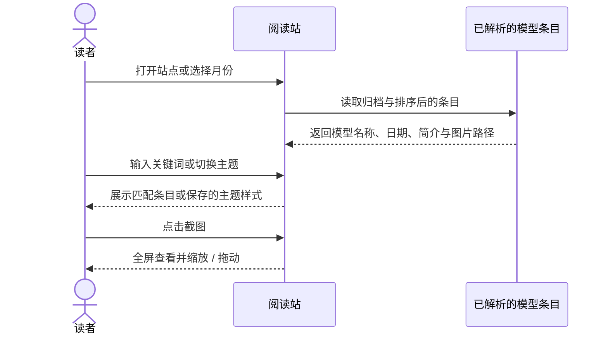

# Awesome Open LLMs — 开源模型月度追踪档案

> 来源归档（ingest）

- **项目：** Awesome Open LLMs · 开源模型追踪
- **代码：** <https://github.com/liucongg/awesome-open-llms>
- **在线阅读：** <https://awesome-open-llms.logcongcong.workers.dev/>
- **维护者：** README 标注由「刘聪 NLP」整理维护
- **类型：** 开源模型目录 / 月度发布追踪 / 静态阅读站
- **许可证：** 仓库声明 Apache License 2.0
- **核查日期：** 2026-10-09
- **README 归档范围：** 2025 年 6 月至 2026 年 9 月；当前可见最新月度文件为 `docs/2026/09.md`
- **一句话说明：** 以月度 Markdown 档案整理开源模型发布信息，并通过轻量 React/Vite 阅读站生成时间导航、模型搜索与截图浏览体验。

## 项目定位

Awesome Open LLMs 是中文开源模型信息档案，目标是把零散模型发布记录组织成可按月份回溯、可搜索的目录。每条记录通常包含模型名称、发布日期、发布机构、参数规模或能力特点，并在有配图时附上原始截图。

它属于**编辑策展型目录**，不是模型权重仓库、统一评测榜单或厂商官方发布源。README 提醒读者：能力、参数、许可证、可用范围和安全策略等时效信息应以模型官方仓库、技术报告和公告为准。

## 内容与产品结构

| 部分 | 用途 |
|---|---|
| `docs/YYYY/MM.md` | 按年份和月份保存模型条目；README 当前列出 2025-06 至 2026-09 |
| 条目正文 | 用日期、名称、机构与短描述记录发布信息；可附截图和相关文章 |
| 首页 | 展示最新收录与当月重点模型 |
| 阅读页 | 按月份浏览归档，支持名称、机构、参数规模和关键词全文搜索 |
| 截图查看器 | 支持全屏查看、滚轮 / 双指缩放与拖动 |
| 外观与导航 | 桌面 / 平板 / 手机响应式布局；浅色 / 深色主题偏好保存在当前浏览器 |
| 贡献入口 | Issue 和 Pull Request；建议贡献者提供模型名、发布日期、机构、官方链接、特点与截图来源 |

## 数据到界面的实现

仓库将 Markdown 作为主要内容源，而非另建数据库。阅读站在构建时用 Vite 的 `import.meta.glob` 导入 `docs/**/*.md`，`src/content.ts` 按约定格式解析日期、名称、描述和后续截图，再生成归档列表与全文搜索使用的 `allEntries`。

### 内容管线

当前解析器使用固定条目模式：`- **MM-DD · 名称** — 描述`；它会向后读取对应的首个 Markdown 图片行。新增内容若不符合这一行格式，可能不会被站点识别；图片路径也需遵循仓库已有的 `public/assets` 目录约定。这是贡献时优先检查的格式契约。

### 读者浏览时序

## 使用方式

1. **追踪近期发布：** 从首页最新条目与当月重点开始，再进入对应月份阅读详情。
2. **按线索检索：** 搜索模型名、机构、参数规模或技术关键词；适合发现候选模型，不适合替代原始模型卡的技术核验。
3. **回溯发布脉络：** 通过年月归档比较同一时期不同团队发布的模型。
4. **贡献更正：** 对遗漏、失效链接或错误条目提交 Issue / PR；提供官方链接与截图出处便于维护者复核。

本地开发入口按 `package.json`：`npm run dev` 启动 Vite 开发服务器，`npm run build` 执行 TypeScript 项目构建并生成静态站点，`npm run preview` 预览构建产物。

## 价值与边界

- **降低信息发现成本：** 月度视图使模型发布不再散落在社交媒体与公告中，读者能快速建立时间线。
- **易扩展、易贡献：** Markdown 条目降低编辑门槛；内容和展示代码分离，站点可从文档自动构建。
- **适合作为入口，不是证据终点：** 短描述和截图便于初筛，但参数、能力、许可、推理条件及安全限制应继续追溯官方来源。
- **策展带来覆盖与偏差：** 收录范围、重点模型选择和描述颗粒度由维护者决定；“月度重点”是编辑选择，不是客观排名。
- **内容需要持续校对：** 月度档案的准确性依赖贡献审核和官方来源核验；对模型更名、版本更新或撤回发布，静态旧条目可能过期。
- **权利边界：** 仓库采用 Apache-2.0，但模型截图、名称与商标属于各自权利人；仓库免责声明将截图用于信息整理、学习和研究，并提供移除联系渠道。

## 核查记录

- README 中文 / 英文版：项目定位、月度范围、功能、贡献方式、免责声明和许可证。
- `src/content.ts`：Markdown 条目的导入、匹配、日期解析、图片路径转换与排序。
- `src/App.tsx`：主页重点条目、导航、搜索快捷键、主题持久化等交互入口。
- `package.json`：Vite 开发、构建与预览脚本。
- GitHub 仓库元数据：公开仓库；许可证标记 Apache-2.0；项目描述为每月更新的开源模型汇总。

## 参考链接

- [GitHub 仓库](https://github.com/liucongg/awesome-open-llms)
- [在线阅读站](https://awesome-open-llms.logcongcong.workers.dev/)
- [README（中文）](https://github.com/liucongg/awesome-open-llms/blob/main/README.md)
- [README（English）](https://github.com/liucongg/awesome-open-llms/blob/main/README_EN.md)
- [月度内容解析器](https://github.com/liucongg/awesome-open-llms/blob/main/src/content.ts)
- [2026 年 9 月档案](https://github.com/liucongg/awesome-open-llms/blob/main/docs/2026/09.md)

## 关联页面

- [开源 LLM 与基础模型](../concepts/open-source-llms.md) — 可作为模型档案的技术分类背景
- [机器学习模型评测](../concepts/robot-learning-evaluation.md) — 区分信息目录与标准化评测
