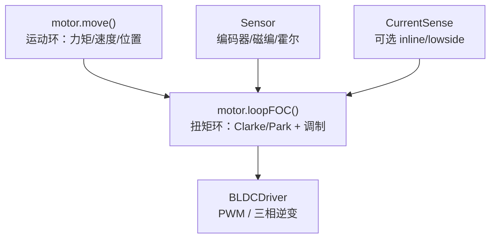

# SimpleFOC / Arduino-FOC

> 来源归档

- **标题：** SimpleFOC 项目与 Arduino-FOC 库
- **类型：** repo（生态：库 + 硬件参考设计 + 社区）
- **来源：**
  - 官网：<https://simplefoc.com/>
  - 文档：<https://docs.simplefoc.com/>
  - GitHub 组织：<https://github.com/simplefoc>
  - 主库：<https://github.com/simplefoc/Arduino-FOC>
  - 社区：<https://community.simplefoc.com/>
- **Stars / Forks（主库，2026-05）：** ~2.8k / 活跃贡献者 50+
- **入库日期：** 2026-05-26
- **一句话说明：** 面向爱好者与嵌入式开发者的跨平台开源 FOC（磁场定向控制）栈，用 Arduino/PlatformIO 抽象 BLDC/步进 + 传感器 + 驱动 + MCU，降低低功率关节/云台电机闭环门槛。
- **沉淀到 wiki：** [wiki/entities/simplefoc.md](../../wiki/entities/simplefoc.md)、[wiki/concepts/field-oriented-control.md](../../wiki/concepts/field-oriented-control.md)

---

## 为什么值得保留

- 机器人知识库已覆盖 **CANopen / EtherCAT / 厂商私有底软协议**（见 [motor_drive_firmware_bus_protocols 课程](../../sources/courses/motor_drive_firmware_bus_protocols.md)），但缺少「**MCU 上自研 FOC 电流环**」的入门到工程化参考；SimpleFOC 填补 DIY 关节、云台、小型执行器场景。
- 与 **Odrive / VESC / mjbots** 等高性能驱动器形成对照：SimpleFOC 强调跨平台、可读代码与教学文档，而非百安培级功率密度。
- 社区活跃（论坛 1500+、Discord 1000+），大量学生与创客项目可作为「低层执行器原型」案例。

## 项目定位（官网 / README 归纳）

| 维度 | 内容 |
|------|------|
| 目标 |  demystify FOC；支持尽可能多的 motor + sensor + driver + MCU 组合 |
| 库版本 | Arduino SimpleFOClibrary **v2.4.0**（2025 前后发布线） |
| 许可 | MIT（库与多数硬件设计开源） |
| 安装 | Arduino Library Manager、PlatformIO |
| 对标 | 文档中对比 Odrive、VESC、Trinamic、Infineon、Tinymovr、mjbots moteus 等（SimpleFOC 偏简易与组合广度） |

## 核心软件架构（Arduino-FOC）

库将硬件拆为可组合的 C++ 对象，典型控制链：

### 运动控制（Motion Control）

| 模式 | 需传感器 | 说明 |
|------|----------|------|
| `torque` | 是 | 直接力矩/电流目标 |
| `velocity` / `angle` | 是 | 闭环速度 / 位置（级联 PID） |
| `angle_nocascade` | 是 | 非级联位置控制 |
| `velocity_openloop` / `angle_openloop` | 否 | 开环，适合标定或极简硬件 |
| `custom` | 自定 | 实验性自定义运动环 |

运动环与扭矩环**正交**：可与 `foc_current`、电压模式、`estimated_current` 等任意组合；`motion_downsampling` 可降低运动环频率。

### 扭矩控制（Torque / FOC）

- **Clarke / Park** 将三相 \(abc\) → 旋转 \(dq\) 帧；\(i_d \approx 0\)、\(i_q\) 控力矩为高效工作点。
- v2.4 起支持 **estimated_current**（无电流采样时的模型估计）、多电机 low-side 电流采样（STM32 ADC）、ESP32 安全与定时对齐优化等。
- 对齐流程：转子–传感器 offset、电流采样相序（`align_current_sense` 示例）。

### 支持硬件（文档索引）

- **电机：** BLDC、步进（含 hybrid stepper 用三相驱动接法）
- **驱动板：** 官方 SimpleFOCShield v3.2、SimpleFOCMini v1.1；社区与 STM32 B-G431B-ESC1 等
- **传感器：** 增量/绝对编码器、磁编（AS5600 等）、霍尔、开环
- **MCU：** Arduino 全系、STM32、ESP32、Teensy、RP2040、SAMD、MBED（Portenta）、Silabs 等 15+ 架构

## 官方硬件（SimpleFOCBoards）

| 板卡 | 驱动芯片 | 电流 | 特点 |
|------|----------|------|------|
| SimpleFOCShield v3.2 | DRV8313 | ~2 A 连续 / 3 A 峰值 | Arduino 叠层、可选 inline 电流采样、堆叠双电机 |
| SimpleFOCMini v1.1 | DRV8313 | 同上 | 21×26 mm 低成本模块 |

设计文件在 EasyEDA 开源，JLCPCB 批量成本文档有标注；商店与自制指南见 docs。

## GitHub 组织内相关仓库（摘录）

| 仓库 | 用途 |
|------|------|
| [Arduino-FOC](https://github.com/simplefoc/Arduino-FOC) | 主库 |
| [Arduino-FOC-drivers](https://github.com/simplefoc/Arduino-FOC-drivers) | 额外驱动芯片支持 |
| [Arduino-SimpleFOCShield](https://github.com/simplefoc/Arduino-SimpleFOCShield) | Shield 硬件 |
| [SimpleFOCMini](https://github.com/simplefoc/SimpleFOCMini) | Mini 板硬件 |
| [SimpleFOCStudio](https://github.com/simplefoc/SimpleFOCStudio) | 串口/I2C 调参与监控 GUI |
| [simplefoc.github.io](https://github.com/simplefoc/simplefoc.github.io) | 文档站点源 |

## 核心摘录（对 wiki 的映射）

### 1) FOC 原理与坐标变换

- **要点：** 保持定子磁场与转子磁链 **90°** 关系以最大化力矩；Clarke（abc→αβ）、Park（αβ→dq）把交流量变为旋转系直流，便于 PI；逆变换 + SinePWM/SVPWM 输出相电压。
- **对 wiki 的映射：** [field-oriented-control](../../wiki/concepts/field-oriented-control.md)

### 2) 开源嵌入式 FOC 栈实体

- **要点：** SimpleFOC = 库 + 参考硬件 + 文档 + 社区；适合 gimbal、小型 BLDC、步进、教学与原型关节，**不替代** 工业 CiA402/EtherCAT 伺服栈。
- **对 wiki 的映射：** [simplefoc](../../wiki/entities/simplefoc.md)

### 3) 与机器人底软通信层的关系

- **要点：** 本库解决 **MCU 内电流/速度环**；整机多轴仍常通过 CAN/USB 把目标交给 **已有驱动器**（见 motor-drive 总览）。自研板可把 SimpleFOC 固件封成紧凑 CAN 帧，但协议需自行定义。
- **对 wiki 的映射：** [motor-drive-firmware-bus-protocols](../../wiki/overview/motor-drive-firmware-bus-protocols.md)

## 推荐继续阅读（外部）

- [Coordinate Transformations in FOC](https://docs.simplefoc.com/foc_theory) — 官方理论推导
- [Motion control](https://docs.simplefoc.com/motion_control) — 运动环 API
- [Theory corner](https://docs.simplefoc.com/theory_corner) — PID、滤波、对齐专题

## 当前提炼状态

- [x] 摘要与 wiki 实体/概念页映射
- [x] 与电机底软总览交叉引用
