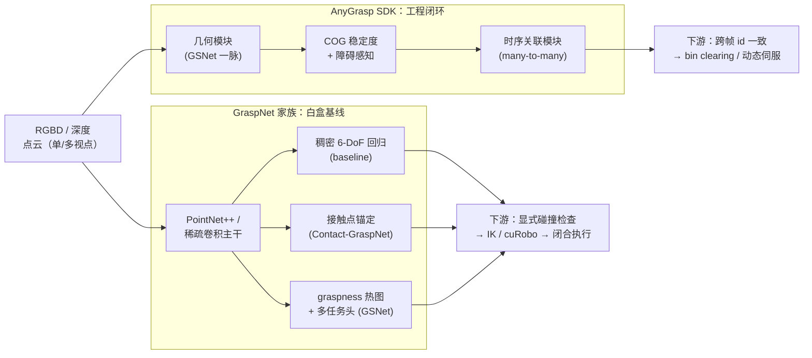

# AnyGrasp vs GraspNet：抓取检测家族选型对比

**背景**：在「点云 / RGBD → 6-DoF 抓取候选」这条链路上，最常被同时提及的是 **GraspNet 家族**（GraspNet-1Billion / Contact-GraspNet / GSNet/Graspness）与同源团队工程化产物 **AnyGrasp**。前者偏「**白盒基线 + 数据集 + 开源权重**」，后者偏「**预编译 SDK + 跨帧跟踪 + COG 稳定度**」。两者并非互斥替代关系，而是在「**复现成本、动态场景能力、License 与权重可得性**」三个维度上做不同取舍。

> **一句话区分**：**GraspNet** 是「**开放的基线 + 数据集生态**」，**AnyGrasp** 是「**收敛到工程闭环的 SDK**」——后者建立在前者的方法谱系上，叠加时序关联与稳定度评估，但权重以二进制 + License 分发。

---

## 一句话定义

| 路线 | 一句话 | 论文 / 仓库 |
|------|--------|-------------|
| **GraspNet-1Billion**（基线） | 在场景点云每个采样点回归 6-DoF 抓取参数 + 质量分数，附带百万级抓取标签的真实数据集与评测协议。 | Fang et al., CVPR 2020；[graspnet-baseline](https://github.com/graspnet/graspnet-baseline) ；数据集 <https://graspnet.net/datasets.html> |
| **Contact-GraspNet** | 把抓取参数压缩到**接触点**上：每个 3D 点回归基线方向 + 接近向量 + 抓取宽度，稠密预测稳定性提升。 | Sundermeyer et al., ICRA 2021；[arXiv:2103.14127](https://arxiv.org/abs/2103.14127) |
| **GSNet / Graspness** | 先学**抓取适宜度热图**对场景做体素级前景筛选，再在高 graspness 区域回归角度/宽度，降低候选预算。 | Wang et al., ICCV 2021；[graspness_unofficial](https://github.com/graspnet/graspness_unofficial) |
| **AnyGrasp**（SDK） | 在 GSNet 基础上叠加 **跨帧时序关联** 与 **COG 稳定度 + 障碍感知**，把抓取从单帧检测推到动态跟踪 + bin clearing。 | Fang et al., IEEE T-RO 2023；[arXiv:2212.08333](https://arxiv.org/abs/2212.08333) ；[anygrasp_sdk](https://github.com/graspnet/anygrasp_sdk) |

> 严格来说 **AnyGrasp 属于 GraspNet 家族第三代工程化代表**；本页用「AnyGrasp vs GraspNet」是工程选型常见的对位说法——**SDK 形态的 AnyGrasp** vs **开放基线的 GraspNet 家族（含 Contact-GraspNet / GSNet）**。

---

## 核心维度对比

| 维度 | **GraspNet 家族**（baseline / Contact-GraspNet / GSNet） | **AnyGrasp**（SDK） |
|------|--------------------------------------------------------|---------------------|
| **定位** | 论文 + 数据集 + 开源参考实现 | 商业可申请的 **预编译 SDK** + License |
| **输出表征** | 6-DoF（基线 / Contact-GraspNet）或 6-DoF + 开度（GSNet） | **7-DoF**（位姿 + 夹爪开度） + 跨帧关联 id |
| **典型输入** | RGBD / 点云单帧；多数 demo 默认结构光深度 | RGBD / 点云**多帧**（推荐用于动态/跟踪） |
| **训练数据** | **GraspNet-1Billion**（~9 万 RGBD、100 物体、百万级抓取标签） | GraspNet-1Billion + 扩展（**~144 物体、268 场景**）+ 相邻多视点关联监督 |
| **稠密度策略** | 全场景稠密回归（baseline）/ 接触点锚定（C-GN）/ graspness 热图筛选（GSNet） | **graspness + 障碍感知**，网络层面把碰撞抓取置零 |
| **跨帧能力** | ❌ 无（每帧独立） | ✅ many-to-many 时序关联，物体坐标系下保持 id |
| **稳定度建模** | 主要靠 antipodal 解析分数 + 网络打分 | 在网络中显式引入 **COG 相关稳定分数**（均匀密度近似） |
| **障碍 / 碰撞** | 输出后**显式**做碰撞过滤（cuRobo / MoveIt 等） | 网络内**隐式**置零无预置空间的抓取；仍建议下游补显式检查 |
| **权重 / 代码** | ✅ **完全开源**（baseline / C-GN / GSNet 第三方）；可白盒改造 | **预编译二进制**；权重不开源，需按机器特征填表申请 License |
| **部署延迟** | 取决于主干（PointNet++ / Minkowski），CPU/GPU 都可跑；Contact-GraspNet / GSNet 比 baseline 更快 | 单前向 ~数十 ms（GPU）；动态跟踪场景下整体延迟可控 |
| **开放词汇** | 与开放词汇分割（SAM / Grounded SAM 等）解耦，灵活拼接 | 同样可接分割掩码（`apply_object_mask` 开关） |
| **典型场景** | 学术复现、定制改造、白盒安全审计、研究新表征 | 工业 bin picking、移动抓取、动态目标跟踪原型 |
| **可复现性** | ✅ 高（公开权重 + 数据集 + 评测脚本） | ⚠️ 受限于 License；论文级数字需用官方 SDK 复现 |
| **工程依赖** | PyTorch / MinkowskiEngine / pointnet2 扩展（C-GN 需 TensorFlow 旧版本兼容） | PyTorch / MinkowskiEngine fork / pointnet2 扩展；CUDA 矩阵以 README Update 为准 |

---

## 数据流对比（Mermaid）

把两条路线放进同一张「点云 → 候选 → 下游执行」的坐标里，**误差修补与时序一致性**的处理位置是关键差异：



要点：
- **GraspNet 家族**留下「**单帧 → 显式后处理**」的清晰接缝，便于把碰撞检查 / IK / 触觉补救拼上去；
- **AnyGrasp** 把「稳定度评估 + 障碍打分 + 时序关联」三件事内化到网络里，**减少下游样板代码**，但牺牲白盒改造空间。

---

## 适用场景

### 选 GraspNet 家族（白盒基线）的场景

1. **需要可复现的研究基线**：论文实验、消融对照、新表征探索（如把 Contact-GraspNet 接 SAM 做开放词汇抓取）。
2. **想做白盒改造 / 安全审计**：定制损失、替换主干、加入触觉/力矩条件，或在工业场景里走合规审计。
3. **License 不可接受**：商业部署对二进制 + 注册流程有合规顾虑。
4. **预算紧 / 不需要跨帧**：静态桌面 bin picking、单次 pick-and-place，单帧检测足以覆盖。
5. **要在新机型 / 新主干上重训**：例如换 ConvNeXt-3D / FlashAttention 类骨干，或加入语言条件。

> **避坑**：GraspNet baseline / Contact-GraspNet 在**动态场景**上没有时序一致性保证——同一物体跨帧的最优抓取 id 可能漂移，需要自己加跟踪层（如基于 IoU / 视觉 reid / 物体 6D 位姿跟踪）。

### 选 AnyGrasp（SDK）的场景

1. **需要边走边抓 / 动态目标**：移动机械臂、运动中的物体、bin 倾倒过程——时序关联是刚需。
2. **生产级 bin clearing**：MPPH（mean picks per hour）有指标压力，工程化集成成本受限。
3. **不打算自训权重**：团队没有大规模 GPU / 没有真实抓取数据集采集能力，直接用官方 SDK 起步。
4. **可接受 License**：商业项目能完成填表申请，且接受机器绑定的合规流程。
5. **缩短工程链路**：希望网络里内置稳定度评估与障碍感知，减少下游显式后处理代码量。

> **避坑**：AnyGrasp 的**网络层障碍感知 ≠ 完整碰撞证明**——关键安全场景（人机协作、贵重物品搬运）仍应在抓取候选后保留**显式碰撞检查**与裕度设计；COG 稳定度建立在「**均匀密度刚体**」近似上，非均匀质量分布（不平衡杯子、半空容器）需另行校验。

### 何时**两者并用**

实际工程系统里，两者并不互斥：

- **训练阶段**：用 GraspNet baseline / Contact-GraspNet 做**消融与白盒分析**，验证新表征/主干。
- **部署阶段**：在动态/生产场景切换到 AnyGrasp SDK 直接复用工程闭环。
- **数据回流**：用 AnyGrasp 跑批量真机，把失败案例反哺到 GraspNet baseline 上做定向重训。

---

## 常见误判

1. **「AnyGrasp 一定比 GraspNet 强」**：维度不对。AnyGrasp 在**动态 / 时序 / SDK 工程化**上更强；GraspNet baseline / Contact-GraspNet 在**可复现性 / 白盒改造 / 开源生态**上更优。**「更新 ≠ 更适合你」**。
2. **「Contact-GraspNet 已经过时」**：错。Contact-GraspNet 的**接触点锚定**思路至今仍是稠密预测里训练最稳的路线之一，在 NVIDIA Isaac ROS 等工业落地里大量复用；GSNet / AnyGrasp 是另一条「graspness 热图」演化分支。
3. **「AnyGrasp 障碍感知就够了」**：错。网络内的障碍感知是**软打分**，不等价于完整的几何碰撞证明——保险/工业场景必须保留显式碰撞检查与机械臂可达性验证。
4. **「GraspNet-1Billion 训练数据已够大」**：相对学术够，相对真机不一定够。**100 物体、9 万 RGBD** 在**透明 / 反光 / 软体 / 薄片**这些长尾类上几乎不覆盖；这些类目无论用哪条路线都要**自采数据 + 数据增强**。
5. **「都是平行夹爪方法，灵巧手不可用」**：方向正确但表述不全。两者**默认**平行夹爪，但 GraspNet 数据 + Contact-GraspNet 思路常被改造去支持多指接触面分配（虽然产物已与原方法显著不同），见 [In-hand Reorientation](../methods/in-hand-reorientation.md)、[Contact-Rich Manipulation](../concepts/contact-rich-manipulation.md)。
6. **「SDK 黑盒，无法调」**：AnyGrasp SDK 暴露 `dense_grasp`、`apply_object_mask`、`collision_detection` 等关键开关；可通过分割掩码注入语义先验、通过工作区裁剪控制候选位置。**「黑盒」是相对模型权重而言的，不是端到端不可配置**。

---

## 决策矩阵

```
你的主要约束是什么？
│
├── 论文复现 / 消融 / 白盒改造 → GraspNet baseline / Contact-GraspNet / GSNet
├── 动态场景 / 移动抓取 / 跨帧 id 一致 → AnyGrasp（时序关联模块）
├── 商业合规 / License 不可接受 → GraspNet 家族 + 自己加跟踪
├── 工程化压力大、人力少 → AnyGrasp SDK（直接 dense_grasp + collision_detection）
├── 透明 / 反光 / 薄片长尾物体 → 都不够；先解决**深度采集**与自采数据
├── 多视点 / 移动相机融合 → 多视点点云融合 + AnyGrasp 时序，或 GraspNet baseline + 自定义跟踪
└── 想在新主干 / 新模态（触觉 / 力矩）上扩展 → GraspNet baseline 起步白盒迭代
```

---

## 评测指标视角

| 指标 | GraspNet 家族 | AnyGrasp | 备注 |
|------|--------------|----------|------|
| **AP / AP_seen / AP_similar / AP_novel** | ✅ 官方评测标准，论文必报 | ✅ 论文有报告，但 SDK 实际部署更看 MPPH | 离线匹配，不等价真机成功率 |
| **MPPH（mean picks per hour）** | 较少报 | ✅ 论文重点叙事（bin clearing） | 吞吐导向，工业最关心 |
| **跨帧 id 一致率** | ❌ 无 | ✅ 时序关联模块自带 | 动态场景必看 |
| **Top-K 物理成功率** | 仿真物理评测常用 | SDK demo 里有真机评测 | 比 AP 更接近部署 |

> **关键观察**：**AP 高不等于 MPPH 高**——AP 是单帧分数，MPPH 受候选排序、碰撞检查、夹爪闭合等**整段管线**影响。AnyGrasp 工程化的核心收益在 MPPH 这条线，而非 AP 这一项。

---

## 与其它对比页的区别

- 本页关注**两条抓取检测路线（开源基线 vs SDK 工程闭环）**的对比；
- [Query：抓取策略选型](../queries/grasp-policy-selection.md) 关注**更上层**「检测式 vs 几何启发式 vs 端到端策略」的三轴选型；
- [Grasp Pose Estimation](../methods/grasp-pose-estimation.md) 是**方法谱系总览**（GPD → GraspNet → Contact-GraspNet → GSNet/AnyGrasp 三代演进），本页是其中第二/第三代的横向对比；
- [Manipulation](../tasks/manipulation.md) 任务层总览，抓取检测是其感知子问题。

---

## 英文缩写速查

| 缩写 | 英文全称 | 简要说明 |
|------|----------|----------|
| DoF | Degrees of Freedom | 自由度，人形通常 20–50+ 关节 |
| SDK | Software Development Kit | 软件开发工具包 |
| CPU | Central Processing Unit | 中央处理器 |
| GPU | Graphics Processing Unit | 图形处理器，大规模并行仿真训练的算力基础 |
| CUDA | Compute Unified Device Architecture | NVIDIA GPU 通用并行计算平台 |
| IK | Inverse Kinematics | 满足末端/姿态约束求解关节角的运动学逆解 |
| Manipulation | Robot Manipulation | 抓取、移动、操作物体的任务总称 |
| API | Application Programming Interface | 应用程序编程接口 |

## 参考来源

- [sources/repos/anygrasp-sdk.md](../../sources/repos/anygrasp-sdk.md) — AnyGrasp / GraspNet 生态资料索引（SDK / 数据集 / API / 基线代码）。
- Fang H., Wang C., Gou M., Lu C. (2020). *GraspNet-1Billion: A Large-Scale Benchmark for General Object Grasping*. CVPR.
- Sundermeyer M., Mousavian A., Triebel R., Fox D. (2021). *Contact-GraspNet: Efficient 6-DoF Grasp Generation in Cluttered Scenes*. ICRA. — <https://arxiv.org/abs/2103.14127>
- Wang C., Fang H., Gou M., et al. (2021). *Graspness Discovery in Clutters for Fast and Accurate Grasp Detection*. ICCV.
- Fang H., et al. (2023). *AnyGrasp: Robust and Efficient Grasp Perception in Spatial and Temporal Domains*. IEEE T-RO. — <https://arxiv.org/abs/2212.08333>
- 项目页：<https://graspnet.net/>；数据集：<https://graspnet.net/datasets.html>；API：<https://github.com/graspnet/graspnetAPI>。
- 基线实现：[graspnet-baseline](https://github.com/graspnet/graspnet-baseline) ；GSNet 第三方：[graspness_unofficial](https://github.com/graspnet/graspness_unofficial) ；AnyGrasp SDK：<https://github.com/graspnet/anygrasp_sdk>。

---

## 关联页面

- [Grasp Pose Estimation（抓取位姿估计）](../methods/grasp-pose-estimation.md) — 三代抓取检测方法谱系总览。
- [AnyGrasp（抓取感知 SDK）](../entities/anygrasp.md) — SDK 形态与 License 申请细节。
- [ContactNet](../methods/contact-net.md) — 与 Contact-GraspNet 在「接触面预测」思路同源的相关方法。
- [Manipulation（操作任务）](../tasks/manipulation.md) — 抓取检测在操作闭环中的位置。
- [Query：抓取策略选型](../queries/grasp-policy-selection.md) — 三轴选型（物体已知度 / 候选稠密度 / 方法类型）与组合 pipeline 指南。
- [cuRobo（GPU 无碰撞运动生成）](../entities/curobo.md) — 抓取候选到无碰撞规划的下游求解器，常与本页两条路线下游对接。
- [Visual Servoing](../methods/visual-servoing.md) — 抓取最后几厘米的亚毫米级对齐方案。
- [Contact-Rich Manipulation](../concepts/contact-rich-manipulation.md) — 抓握后接触阶段的执行层。

---

## 推荐继续阅读

- Fang H. et al. *AnyGrasp* IEEE T-RO 2023 全文与官方 demo 视频集合（<https://graspnet.net/anygrasp.html>）。
- Sundermeyer M. et al. *Contact-GraspNet* arXiv 全文 + NVIDIA Isaac ROS Foundation Grasp 工程化叙事。
- GraspNet-1Billion 数据集论文与 graspnetAPI 评测脚本：理解 AP / AP_seen / AP_novel 的具体计算口径。

---

## 一句话记忆

> **GraspNet 是白盒基线 + 数据集生态，AnyGrasp 是叠加时序与稳定度的 SDK 工程闭环**——两者沿同一方法谱系展开，选型的真正分水岭是「**白盒改造 vs 工程化交付**」「**单帧 vs 动态跨帧**」「**完全开源 vs 二进制 License**」三对取舍。
