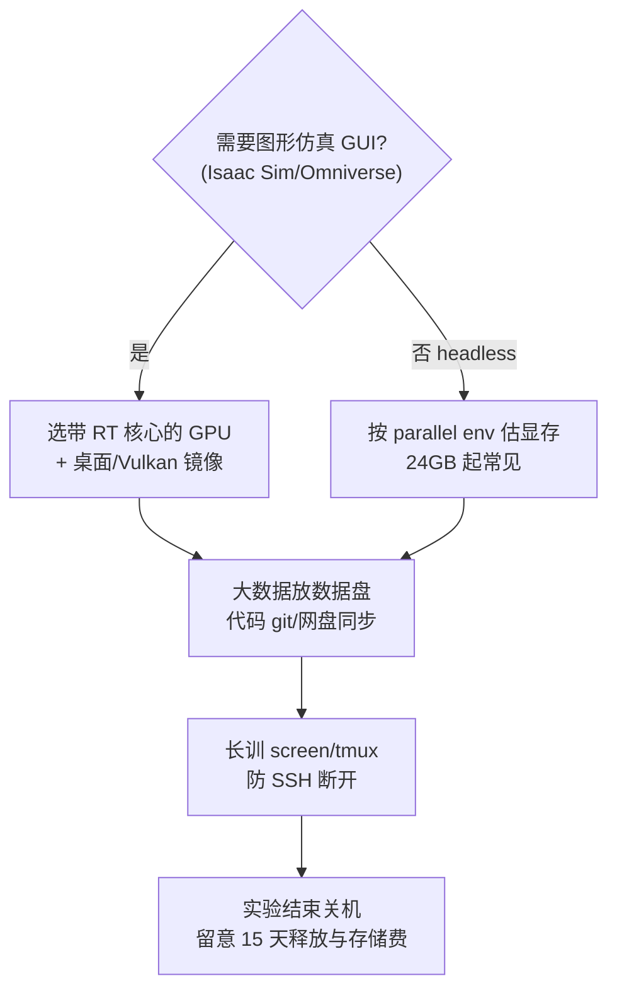

# AutoDL vs 算力自由（国内 GPU 云租卡选型）

个人或小团队跑 [Isaac Lab](../entities/isaac-lab.md)、mjlab、[PPO](../methods/reinforcement-learning.md) 等多卡实验时，本地算力不足常转向 **国内 GPU 容器云**。**AutoDL** 与 **算力自由（GPUFree）** 产品形态相近，但镜像生态、卡型供给与仿真指引不同。

## 英文缩写速查

| 缩写 | 英文全称 | 简要说明 |
|------|----------|----------|
| GPU | Graphics Processing Unit | 租用与计费核心 |
| RT | Ray Tracing | 图形仿真显示所需 NVIDIA 硬件能力 |
| RL | Reinforcement Learning | 两平台最主要高算力场景 |
| SSH | Secure Shell | 远程开发与训练入口 |
| IO | Input/Output | 数据盘吞吐影响 DataLoader |
| CUDA | Compute Unified Device Architecture | 镜像与框架版本对齐依据 |
| VNC | Virtual Network Computing | GPUFree 桌面仿真常用远程方案 |
| IDC | Internet Data Center | 机房区域与库存差异来源 |

## 核心特性对比

| 维度 | AutoDL | 算力自由（GPUFree） |
|------|--------|---------------------|
| **定位** | 老牌「炼丹」GPU 云，文档与社区体量大 | 2024 年起家的算力调度云，整合多 IDC |
| **实例形态** | Docker 容器，GPU 独占 | 同左 |
| **计费** | 运行中计费；关机停算力费 | 运行中计费（文档称按秒）；关机停算力费 |
| **数据保留** | 关机保留；连续关机 **15 天**释放 | 同左（按需/包月到期后 15 天） |
| **默认数据盘** | `/root/autodl-tmp`，50GB 起 | `/root/gpufree-data`，**100GB** 免费 |
| **跨实例共享** | `/root/autodl-fs` | `/root/gpufree-data/share` |
| **远程开发** | Jupyter、SSH、VSCode/PyCharm 文档齐全 | SSH、Jupyter；镜像可带 VNC 桌面 |
| **会员/活动** | 炼丹会员、学生认证 | 大赛镜像、L40 促销等 |
| **仿真指引** | GPU 文档偏训练算力 | **明确：仿真需 RT 核心；推荐 noVNC-vulkan** |
| **特色卡型** | 3090/4090/A100 等全谱系 | 主推 **L40/L40S-48G** 大显存 |
| **容器内 Docker** | 不支持（需裸金属） | 文档未强调；按容器云惯例通常同样受限 |

## 如何选型？

### 何时优先 AutoDL？

1. **第一次租国内云卡**：快速开始、GPU 选型、DALI、守护进程、公网网盘等文档链完整。
2. **依赖社区镜像**：希望直接选「PyTorch + CUDA x.y」成熟组合，减少自建环境。
3. **多卡经典配置**：文档对 4/8 卡 scale 与 CPU 配比有长期积累叙述。
4. **本库历史链接**：`sources/train.md` 等资源已指向 AutoDL 市场。

### 何时优先算力自由？

1. **48GB 显存刚需**：L40/L40S 适合 **超大 parallel env** 或大型 VLA checkpoint 微调。
2. **Isaac / Omniverse GUI 仿真**：官方写明避开无 **RT 核心** 的纯计算卡，并指向 **Vulkan 桌面镜像**。
3. **从镜像一键起仿真**：镜像市场可直达 ComfyUI、机器人仿真 VNC 等场景。
4. **数据盘默认更大**：100GB 免费数据盘对中等数据集更友好（仍须关注扩容价）。

### 机器人 RL 共同注意事项

| 检查项 | 说明 |
|--------|------|
| **显存** | headless RL：4090 24GB 常够用；大规模 Isaac Lab 考虑 A40/L40 48GB 或多卡 |
| **图形** | 带 GUI 的仿真：**RT 核心** + 远程桌面；纯 headless 训练可用计算卡 |
| **存储路径** | 勿把大数据写满系统盘；认清 `autodl-tmp` vs `gpufree-data` |
| **嵌套 Docker** | 两平台容器实例通常 **不能** 再跑 Docker；Isaac 复杂部署需验证或换裸金属/本地 |
| **实验追踪** | 云卡只解决算力；曲线与 checkpoint 管理仍用 [TensorBoard](../entities/tensorboard.md) / [W&B](../entities/weights-and-biases.md) |

## 与本库训练栈的关系

- **仿真框架选型**见 [simulator-selection-guide](../queries/simulator-selection-guide.md)；**租卡**解决的是「算力从哪来」，不替代框架决策。
- [训练栈分层地图](../overview/robot-training-stack-layers-technology-map.md) 强调闭环返工成本；云实例适合 **缩短单次实验墙钟**，但数据上传与环境冻结仍消耗工程时间。
- 与 NVIDIA 官方 [Physical AI Learning](../entities/nvidia-physical-ai-learning.md) 指向的 **Brev 云 GPU** 不同：AutoDL/GPUFree 面向 **国内访问与支付**，生态互补而非替代。

## 常见误区

- **「A100 一定最强」**：图形仿真可能 **无法显示**；headless 训练才是其强项。
- **「关机就完全不花钱」**：扩展存储按天计费；长期闲置应 **释放实例**。
- **「云 = 免运维」**：CUDA/驱动/框架版本仍须与本地仓库 README 对齐；迁移实例前备份 checkpoint。

## 关联页面

- [AutoDL](../entities/autodl.md)
- [算力自由](../entities/gpufree.md)
- [Isaac Lab](../entities/isaac-lab.md)
- [强化学习](../methods/reinforcement-learning.md)

## 推荐继续阅读

- [AutoDL GPU 选型](https://www.autodl.com/docs/gpu/)
- [算力自由快速开始](https://www.gpufree.cn/docs/guide/quick_start.html)

## 参考来源

- [AutoDL 官方文档](../../sources/sites/autodl.md)
- [算力自由官方文档](../../sources/sites/gpufree.md)
