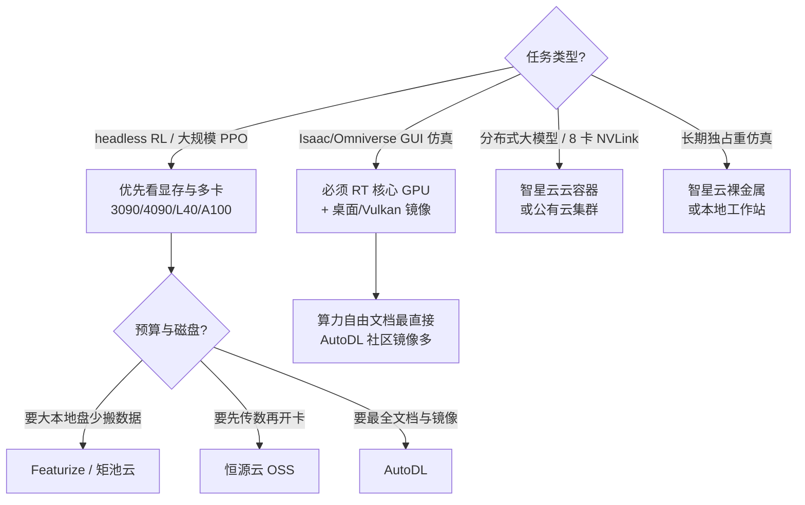

# 国内 GPU 云平台选型（机器人学习与仿真）

本地工作站不足以支撑 [Isaac Lab](../entities/isaac-lab.md)、mjlab 或多卡 [PPO](../methods/reinforcement-learning.md) 时，国内研究者常租用 **GPU 容器云/算力市场**。本页并列六类主流平台；**国外平台**见 [国外 GPU 云平台选型](international-gpu-cloud-platforms.md)。

## 英文缩写速查

| 缩写 | 英文全称 | 简要说明 |
|------|----------|----------|
| GPU | Graphics Processing Unit | 租用核心 |
| RT | Ray Tracing | 图形仿真/Omniverse 显示依赖 |
| RL | Reinforcement Learning | 最主要高算力场景 |
| OSS | Object Storage Service | 恒源云个人数据空间 |
| SSH | Secure Shell | 远程开发入口 |
| NVLink | NVIDIA NVLink | 智星云多卡容器互联 |
| VRAM | Video Random Access Memory | 选卡首要约束之一 |

## 平台速览

| 平台 | 实体页 | 定位关键词 |
|------|--------|------------|
| **AutoDL** | [autodl](../entities/autodl.md) | 文档最全、社区镜像、炼丹会员 |
| **算力自由** | [gpufree](../entities/gpufree.md) | L40/L40S 48GB；**仿真 RT 核心**官方提示 |
| **矩池云** | [matpool](../entities/matpool.md) | 高校渗透、**按分钟**计费、大磁盘 |
| **Featurize** | [featurize](../entities/featurize.md) | 在线实验室、**超大免费磁盘**、PRO 6000 96GB |
| **恒源云** | [gpushare](../entities/gpushare.md) | **OSS 先传后开实例**、包周灵活 |
| **智星云** | [ai-galaxy](../entities/ai-galaxy.md) | 云主机 + **裸金属** + **NVLink 容器** |

## 核心特性对比

| 维度 | AutoDL | 算力自由 | 矩池云 | Featurize | 恒源云 | 智星云 |
|------|--------|----------|--------|-----------|--------|--------|
| **实例形态** | Docker 容器 | Docker 容器 | GPU 主机/功能岛 | 在线实验室实例 | GPU 云主机 | 云主机/裸金属/容器 |
| **计费粒度** | 运行中（按秒级叙述） | 运行中按秒 | **按分钟** | 按量/包月 | 按量/包周/包月/包年 | 时/日/月 |
| **文档成熟度** | ★★★★★ | ★★★☆ | ★★★★ | ★★★☆ | ★★★★ | ★★★☆ |
| **数据盘路径** | `/root/autodl-tmp` | `/root/gpufree-data` | 机型 150–800GB+ | 450GB–1.2TB 级 | `/hy-tmp`（共享） | 依产品 |
| **系统盘** | ~30GB `/` | ~30GB `/` | ~30GB 级 | 含在大磁盘中 | **~20GB** `/` | 依产品 |
| **跨实例存储** | `autodl-fs` | `gpufree-data/share` | 专有云方案 | 30GB 长效云盘 | **OSS 个人数据** | AI 模型库挂载 |
| **关机保留** | 15 天释放 | 15 天释放 | 依产品 | 依产品 | **10 天释放** | 依合同 |
| **仿真 GUI 指引** | GPU 文档偏训练 | **明确 RT + noVNC-Vulkan** | 汽车仿真行业方案 | 需实测 | 未强调 | **裸金属→自动驾驶仿真** |
| **特色卡型** | 3090/4090/A100 全谱 | **L40/L40S 48G** | A100 80G 等 | **PRO 6000 96GB** | 3090/4090 等 | NVLink 8 卡池 |

## 如何选型？

### 按任务类型

### 场景对照表

| 你的情况 | 优先考虑 |
|----------|----------|
| 第一次租国内云卡、怕踩坑 | [AutoDL](../entities/autodl.md) |
| 具身仿真要开 Omniverse GUI | [算力自由](../entities/gpufree.md)（RT 指引）+ 实测镜像 |
| 高校短实验、按分钟控费 | [矩池云](../entities/matpool.md) |
| 数据集/checkpoint 想放一块大盘 | [Featurize](../entities/featurize.md) |
| 大数据集、想关机传 OSS | [恒源云](../entities/gpushare.md) |
| 自动驾驶级仿真或 8 卡 NVLink | [智星云](../entities/ai-galaxy.md) 裸金属/云容器 |
| 48GB 显存、企业级 L40 系列 | [算力自由](../entities/gpufree.md) 或智星云 A40/A6000 |

## 机器人 RL 共同工程清单

无论选哪家，建议统一检查：

1. **显存**：parallel env 数 × 观测维度；人形 Isaac Lab 常 24GB 起，拉满考虑 48GB 或多卡。
2. **图形 vs headless**：带 GUI 仿真 **不能** 默认租纯计算卡（A100/H100 等可能无显示能力）。
3. **嵌套 Docker**：多数容器实例 **不能再跑 Docker**；复杂 Omniverse 部署需验证或裸金属。
4. **存储路径**：弄清系统盘/数据盘/OSS，避免 conda 与数据集挤爆 `/`。
5. **自动释放**：关机 10–15 天策略各异；长期闲置须释放或备份。
6. **实验追踪**：租卡只解决算力；曲线与 checkpoint 仍用 [TensorBoard](../entities/tensorboard.md) / [W&B](../entities/weights-and-biases.md)。

## 常见误区

- **「平台榜第一名 = 你的最优解」**：竞价/活动价、区域库存、镜像版本差异很大，应用小额试跑验证。
- **「关机就不花钱」**：扩展存储、部分预留实例仍计费。
- **「云替代本地工程机」**：上传环境、驱动与 Isaac 版本对齐仍消耗大量墙钟；云适合 **算力_burst**，不是零摩擦。

## 关联页面

- 各平台实体：[AutoDL](../entities/autodl.md)、[算力自由](../entities/gpufree.md)、[矩池云](../entities/matpool.md)、[Featurize](../entities/featurize.md)、[恒源云](../entities/gpushare.md)、[智星云](../entities/ai-galaxy.md)
- [国外 GPU 云平台选型](international-gpu-cloud-platforms.md) — RunPod / Vast / Lambda / Colab / AWS / GCP
- [仿真器选型指南](../queries/simulator-selection-guide.md)
- [Isaac Lab](../entities/isaac-lab.md)

## 推荐继续阅读

- [AutoDL GPU 选型](https://www.autodl.com/docs/gpu/)
- [算力自由快速开始](https://www.gpufree.cn/docs/guide/quick_start.html)
- [恒源云快速开始](https://gpushare.com/docs/getting-started/quickstart/)

## 参考来源

- [AutoDL](../../sources/sites/autodl.md)
- [算力自由](../../sources/sites/gpufree.md)
- [矩池云](../../sources/sites/matpool.md)
- [Featurize](../../sources/sites/featurize.md)
- [恒源云](../../sources/sites/gpushare.md)
- [智星云](../../sources/sites/ai-galaxy.md)
