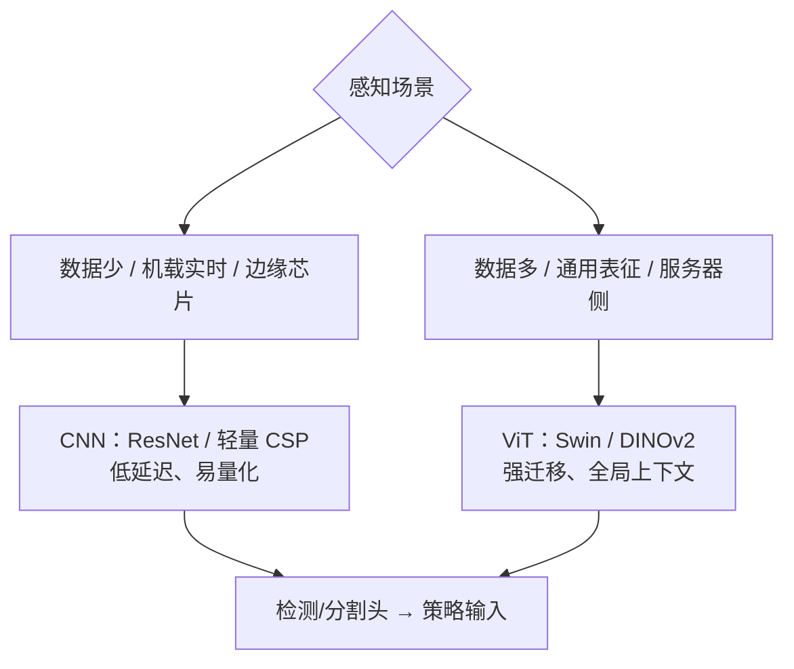

# CNN vs ViT 视觉骨干：归纳偏置与数据规模的取舍

## 一句话定义

**CNN 骨干**（以 [ResNet](../entities/paper-resnet-deep-residual-learning.md) 为代表）用 **卷积 + 残差** 自带 **局部性与平移等变** 的归纳偏置；**ViT 骨干** 把图像切成 patch token、用 **全局自注意力** 学习关系，归纳偏置弱但 **数据规模上限更高**。在机器人感知中，二者是 **检测头、分割头、策略/VLA 视觉塔** 的两条上游特征底座。

## 英文缩写速查

| 缩写 | 英文全称 | 简要说明 |
|------|----------|----------|
| CNN | Convolutional Neural Network | 卷积神经网络，自带局部归纳偏置 |
| ViT | Vision Transformer | 图像分块 + Transformer 全局注意力骨干 |
| FLOPs | Floating Point Operations | 计算量，衡量吞吐/能耗 |
| FPS | Frames Per Second | 机载感知实时性指标 |
| SSL | Self-Supervised Learning | 自监督预训练（如 MAE / DINOv2） |
| FPN | Feature Pyramid Network | 多尺度特征融合 neck |

## 比较对象

| 骨干族 | 代表 | 核心机制 | 典型角色 |
|--------|------|----------|----------|
| **CNN** | ResNet / ConvNeXt / CSP-轻量 | 卷积 + 残差 + 层次下采样 | 边缘实时检测、小数据微调 |
| **ViT** | ViT / Swin / DINOv2 | Patch token + 多头自注意力 | 大数据规模化、通用预训练表征 |

## 核心差异

| 维度 | CNN（ResNet 系） | ViT 系 |
|------|------------------|--------|
| 归纳偏置 | 强（局部性、平移等变） | 弱（位置全靠学习） |
| 数据量需求 | 中小数据即可收敛 | 小数据易欠拟合，需大数据/SSL 预训练 |
| 全局上下文 | 靠堆叠加深感受野，偏局部 | 浅层即获全局关系 |
| 分辨率/吞吐 | 卷积对分辨率线性友好 | 朴素注意力随 token 数 **二次** 增长 |
| 多尺度特征 | 天然层次金字塔（配 FPN 顺手） | 需 Swin/分层变体或专门 neck |
| 边缘部署 | 成熟（TensorRT/量化算子全） | 算子支持与延迟仍偏重 |
| 迁移/规模化 | 规模增益趋缓 | 数据/参数越大增益越显著 |

## 机器人感知中的取舍

- **机载实时检测**（[目标检测](../methods/object-detection.md)：球体/障碍/人）：优先 CNN——低延迟、量化算子成熟，分辨率提升代价可控。
- **通用预训练视觉表征**（冻结骨干喂策略）：ViT SSL（DINOv2 等）在跨场景迁移与全局语义上常更稳，契合 [视觉骨干](../concepts/vision-backbones.md) 的「预训练 → 下游」链条。
- **混合务实路线**：Swin/ConvNeXt 等把层次结构与（窗口）注意力结合，在精度—吞吐折中上常是工程默认选择。

## 常见误区或局限

- **误区：「ViT 全面取代 CNN。」** 小数据微调、边缘部署、触觉形变图等场景，CNN/混合架构仍是主力。
- **误区：「骨干越强，机器人策略越好。」** 仿真—真机 **视觉域差距**、相机标定与时序对齐常比换骨干更致命（参见 [视觉骨干](../concepts/vision-backbones.md) 误区）。
- **局限：** 两者输出多为 **2D 特征**；6DoF 抓取/空间操作仍需深度、位姿头或 3D 骨干补充。

## 关联页面

- [Vision Transformer（概念）](../concepts/vision-transformer.md)
- [视觉骨干（概念）](../concepts/vision-backbones.md)
- [目标检测（方法）](../methods/object-detection.md)
- [感知骨干/表征选型 Query](../queries/perception-backbone-selection.md)
- [ResNet（论文实体）](../entities/paper-resnet-deep-residual-learning.md)
- [YOLO v1（论文实体）](../entities/paper-yolo-unified-realtime-detection.md)

## 参考来源

- [wechat_human_five_vit_intro.md](../../sources/blogs/wechat_human_five_vit_intro.md) — human five《ViT入门》机制与微调实操归纳
- [ResNet 论文摘录（arXiv:1512.03385）](../../sources/papers/resnet_arxiv_1512_03385.md)
- [经典视觉骨干与检测文献簇](../../sources/papers/vision_backbone_detection_classics.md)

## 推荐继续阅读

- [ViT 论文（An Image is Worth 16x16 Words）](https://arxiv.org/abs/2010.11929)
- [Swin Transformer](https://arxiv.org/abs/2103.14030)
- [DINOv2 通用视觉特征](https://arxiv.org/abs/2304.07193)
