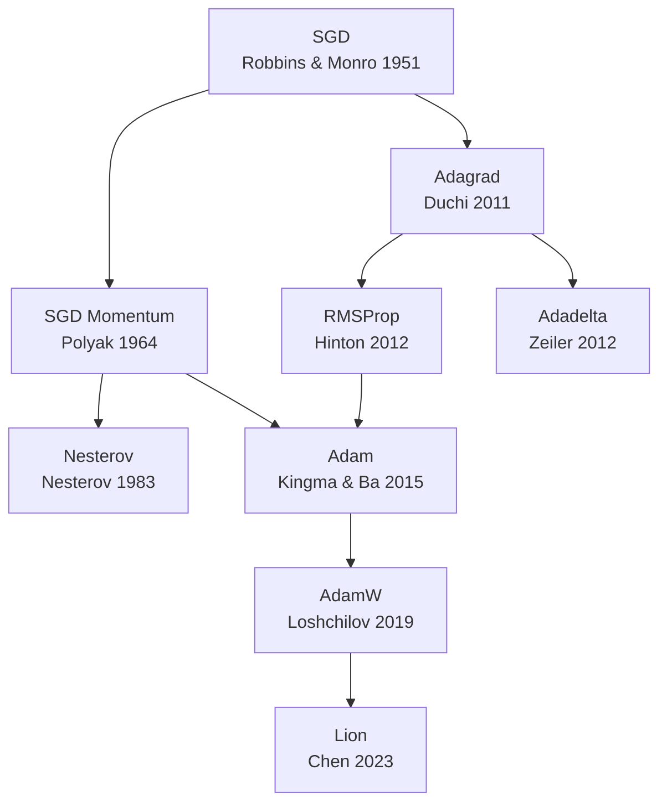

# Deep Learning Optimizers：选型对比

**背景**：[反向传播](../concepts/backpropagation.md) 算出梯度后，需用 **优化器** 决定如何更新参数。从经典 [SGD](../methods/sgd.md) 到现代 [AdamW](../methods/adamw.md) 与 [Lion](../methods/lion.md)，算法演进主线是：**加速收敛** → **per-parameter 自适应** → **正确正则化** → **降低内存/算力**。

## 一句话定位

> 小 CNN 用 SGD+Momentum；机器人 RL 默认 Adam；大模型预训练用 AdamW；内存紧再试 Lion——其余多为历史基线或教学对照。

---

## 优化器族谱

---

## 机制对照表

| 优化器 | 独立节点 | 一阶动量 | 二阶自适应 | 全局 LR | 权重衰减 | 一手出处 |
|--------|---------|---------|-----------|---------|---------|---------|
| [SGD](../methods/sgd.md) | ✓ | ✗ | ✗ | **必需** | 可选 L2 | Robbins & Monro 1951 |
| [SGD Momentum](../methods/sgd-momentum.md) | ✓ | ✓ | ✗ | **必需** | 可选 | Polyak 1964 |
| [Nesterov](../methods/nesterov-momentum.md) | ✓ | ✓（前瞻） | ✗ | **必需** | 可选 | Nesterov 1983 |
| [Adagrad](../methods/adagrad.md) | ✓ | ✗ | ✓（累积） | 必需 | 可选 | Duchi et al. 2011 |
| [RMSProp](../methods/rmsprop.md) | ✓ | ✗ | ✓（EMA） | 必需 | 可选 | Tieleman & Hinton 2012 |
| [Adadelta](../methods/adadelta.md) | ✓ | ✗ | ✓（无 LR） | **不需要** | 可选 | Zeiler 2012 |
| [Adam](../methods/adam.md) | ✓ | ✓ | ✓ | 必需 | L2 耦合 | Kingma & Ba 2015 |
| [AdamW](../methods/adamw.md) | ✓ | ✓ | ✓ | 必需 | **解耦 WD** | Loshchilov & Hutter 2019 |
| [Lion](../methods/lion.md) | ✓ | ✓ | sign 步长 | 必需（偏小） | 解耦 WD | Chen et al. 2023 |

---

## 机器人场景选型

| 场景 | 推荐起点 | 备选 | 避免 |
|------|---------|------|------|
| 仿真 RL（PPO/SAC） | [Adam](../methods/adam.md) | SGD+Momentum | 纯 SGD 无调度 |
| 视觉 backbone 预训练（ResNet 时代） | SGD+Momentum | Adam | Adagrad |
| VLA / Transformer 预训练微调 | [AdamW](../methods/adamw.md) | [Lion](../methods/lion.md) | Adam + 内联 L2 |
| 小数据 IL 微调 | AdamW（小 LR） | Adam | 大 LR + 无 WD |
| 稀疏手工特征 | [Adagrad](../methods/adagrad.md) | — | 长训深度 MLP 用 Adagrad |
| 内存/通信瓶颈 | Lion | AdamW 8-bit 变体 | 未验证的 exotic 优化器 |

---

## 超参敏感度（经验排序）

**低敏感（「开箱能用」）**：Adam、AdamW（默认 $\beta$ 下）

**中敏感**：SGD+Momentum（LR + schedule 关键）、Lion（LR 需相对 Adam 缩小）

**高敏感 / 易停滞**：纯 SGD、Adagrad（长训）、Adadelta

---

## 与 BP / 框架的关系

- 优化器 **不计算梯度**；[反向传播](../concepts/backpropagation.md) + 自动微分负责 $g_t$。
- [PyTorch](../entities/pytorch.md) `torch.optim.*` 与 `loss.backward()` 正交组合；换优化器通常 **不影响** 模型架构。
- [PPO](../methods/ppo.md) 等对 **同一 batch 多 epoch** 更新时，Adam 的动量状态在 epoch 间持续，需注意 `zero_grad(set_to_none=True)` 与梯度裁剪。

---

## 常见误区

| 误区 | 澄清 |
|------|------|
| 「Adam 永远优于 SGD」 | 部分视觉任务调优 SGD 泛化更好；RL 中 Adam 更常见因调参成本低 |
| 「Adam 加 weight_decay 等于 AdamW」 | Adam 的 `weight_decay` 参数在 PyTorch 中已映射为 AdamW 语义；概念上 L2-in-gradient 曾是不正确的 |
| 「换优化器能救活不收敛的模型」 | 先查 LR、初始化、梯度爆炸、奖励/损失设计 |
| 「Lion 已取代 AdamW」 | 证据集中在部分 CV/NLP benchmark；机器人栈尚未大规模迁移 |

---

## 关联页面

- [SGD](../methods/sgd.md) · [SGD Momentum](../methods/sgd-momentum.md) · [Nesterov](../methods/nesterov-momentum.md)
- [Adagrad](../methods/adagrad.md) · [RMSProp](../methods/rmsprop.md) · [Adadelta](../methods/adadelta.md)
- [Adam](../methods/adam.md) · [AdamW](../methods/adamw.md) · [Lion](../methods/lion.md)
- [深度学习基础](../concepts/deep-learning-foundations.md)
- [反向传播](../concepts/backpropagation.md)
- [PPO](../methods/ppo.md)

## 参考来源

- [Deep Learning Optimizers 论文摘录](../../sources/papers/deep_learning_optimizers.md)
- [Understanding Deep Learning (Prince, 2023)](../../sources/books/udl_book.md)
- [PyTorch 官方站点与文档索引](../../sources/repos/pytorch-official.md)

## 推荐继续阅读

- [Kingma & Ba, Adam (2015)](https://arxiv.org/abs/1412.6980)
- [Loshchilov & Hutter, AdamW (2019)](https://arxiv.org/abs/1711.05101)
- [Chen et al., Lion (2023)](https://arxiv.org/abs/2302.06675)
- [Bottou, SGD Tricks (2010)](https://leon.bottou.org/publications/pdf/tricks-2010.pdf)
