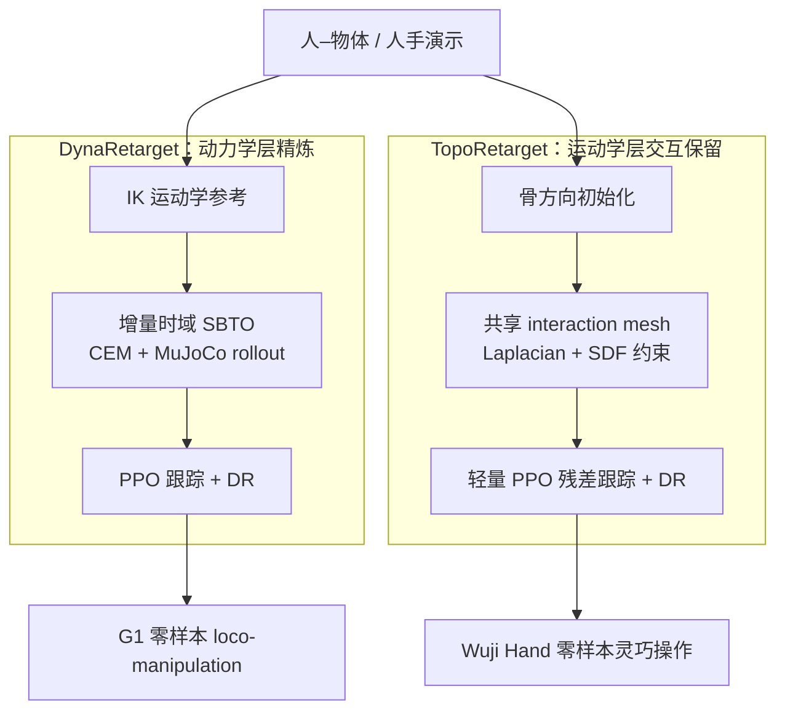

# DynaRetarget vs TopoRetarget：接触保真重定向两条路线对比

**背景**：把人–物体演示喂给机器人时，「像不像」往往不在关节角而在 **接触**——脚是否真踩实、指尖是否真贴物。2026 年两篇代表性工作分别从两端攻这道闸：[DynaRetarget](../methods/dynaretarget-sbto-motion-retargeting.md) 把误差修补放进 **动力学层**（采样式轨迹优化逼近 full-horizon 可行性），[TopoRetarget](../methods/toporetarget-interaction-preserving-dexterous-retargeting.md) 把误差修补放进 **运动学层**（显式保留 hand–object 交互拓扑），动力学一致性交给下游 RL。二者并非互斥，但在「**尺度、修补层、求解预算、目标任务**」四维上的取舍泾渭分明。

> **一句话区分**：DynaRetarget 是「**先 IK、再用 SBTO 把整段拉进动力学可行流形**」；TopoRetarget 是「**用 interaction mesh 把接触结构焊进运动学参考，动力学留给下游 RL/DR**」。

## 一句话定义

| 方法 | 一句话 | 论文 / 仓库 |
|------|--------|-------------|
| **DynaRetarget / SBTO** | IK 参考 → 增量时域 **SBTO**（CEM + MuJoCo rollout）精炼为动力学可行轨迹 → PPO 跟踪零样本上真机。 | [arXiv:2602.06827](https://arxiv.org/abs/2602.06827)；[Atarilab/sbto](https://github.com/Atarilab/sbto) |
| **TopoRetarget** | 共享拓扑 **interaction mesh** + 距离加权 **Laplacian** 优化保留手–物交互，配轻量 PPO 残差跟踪上灵巧手。 | [arXiv:2606.16272](https://arxiv.org/abs/2606.16272) |

## 英文缩写速查

| 缩写 | 英文全称 | 简要说明 |
|------|----------|----------|
| Retargeting | Motion Retargeting | 将人体/手部动作映射到目标机器人骨架 |
| SBTO | Sampling-Based Trajectory Optimization | DynaRetarget 核心：增量扩展时域的采样式轨迹优化 |
| IK | Inverse Kinematics | 运动学前端，产出 imperfect 参考 |
| CEM | Cross-Entropy Method | SBTO 默认采样分布更新器 |
| RL | Reinforcement Learning | 通过与环境交互最大化长期回报学习策略 |
| PPO | Proximal Policy Optimization | 两法下游跟踪共用的 on-policy 策略梯度算法 |
| DR | Domain Randomization | 训练随机化以 sim2real |
| SDF | Signed Distance Field | TopoRetarget 穿透检测与约束 |
| G1 | Unitree G1 Humanoid | DynaRetarget 主实验平台 |

## 核心维度对比

| 维度 | **DynaRetarget**（动力学层精炼） | **TopoRetarget**（运动学层交互保留） |
|------|----------------------------------|--------------------------------------|
| **目标尺度** | 人形全身 loco-manipulation（踢/搬/推/手递） | 灵巧手 in-hand 操作（转笔、魔方重定向） |
| **修补发生层** | 动力学：把整段轨迹优化到物理可行 | 运动学：保留接触拓扑，动力学留给下游 RL |
| **核心算法** | 增量时域 SBTO（CEM + partial rollout） | 共享拓扑 interaction mesh + Laplacian 能量 |
| **接触建模** | 仿真接触 + RL contact-match reward | interaction mesh 边集 + SDF 穿透软/硬约束 |
| **典型求解成本** | 重：约 20 s CPU / 1 s motion（112-core），SBTO_skip 约 0.96× SPIDER 仿真步 | 轻：约 **4.7 ms/帧** 实时运动学优化 |
| **物理一致性** | ✅ 重定向阶段即动力学可行 | ⚠️ 运动学接触保真，动力学靠下游 RL/DR |
| **下游 RL** | PPO（mjlab）+ DR，跟踪 SBTO 轨迹 | 轻量 PPO 残差跟踪 + 物体/执行器 DR |
| **代表结果** | OmniRetarget 285 motions：SBTO_skip **76.8%** vs SPIDER 37.9%；下游 RL 97% vs 79% | Pen-Spin RL **87.5%** vs OmniRetarget 46.9%；ContactPose 接触误差 **7.71 mm** |
| **真机** | Unitree G1 零样本多任务 | Wuji Hand 零样本转笔/魔方 |

## 数据流对比（Mermaid）



要点：DynaRetarget 在 **重定向阶段** 就把动力学可行性解决掉，代价是高算力；TopoRetarget 把重定向做轻、做实时，把动力学一致性下放到 **RL + DR** 这一层吸收。

## 适用场景

### 选 DynaRetarget 的场景

1. **人形全身 loco-manipulation**，需要脚步/接触在重定向阶段就动力学可行；
2. 上游有 kinematic-only 数据集（如 [OmniRetarget](../entities/paper-hrl-stack-03-omniretarget.md)）需做 **物理修补** 与质量/尺寸 **增广**；
3. 有 **大算力**（多核 CPU / GPU MuJoCo）可承担采样优化成本；
4. 希望下游 RL 吃到「物理一致」参考以提升零样本成功率。

> **避坑**：全 SBTO 成本约 SPIDER 的 3.3×；预算紧时优先 **SBTO_skip**（前缀缓存）。手–物接触突变或物体翻转时仍易失败。

### 选 TopoRetarget 的场景

1. **灵巧手 contact-rich** 技能（转笔、魔方），接触结构是核心任务信号；
2. 需要 **毫秒级实时** 重定向（遥操作、大规模参考生成），不宜跑重型采样优化；
3. 目标手/物体多变，希望同一组固定参数适配不同 embodiment 与尺度；
4. 可接受动力学一致性由 **下游 RL + DR** 兜底。

> **避坑**：对「应接触未接触」的虚拟接触需预处理；极端力控任务因缺动力学一致化仍需单独验证。

## 常见误判

1. **「二者二选一」**：错。一个面向 **全身 loco-manipulation**、一个面向 **灵巧手 in-hand**，任务域不同；真实系统可在不同肢段分别采用。
2. **「TopoRetarget 不做动力学 = 更弱」**：维度不同。它以 **实时 + 接触保真** 换取轻量，把动力学交给下游；DynaRetarget 以 **算力** 换取重定向阶段的动力学可行。
3. **「都和 SPIDER 一样」**：[SPIDER](../methods/spider-physics-informed-dexterous-retargeting.md) 用短视距 **SBMPC**；DynaRetarget 用 **增量 full-horizon SBTO**，TopoRetarget 根本停留在运动学层不重写控制序列。
4. **「成功率高 = 上真机就稳」**：两法的成功率多在仿真口径，sim-to-real gap 仍靠 DR / SysID / 下游 WBC 补强。

## 决策矩阵

```
你的主要约束是什么？
│
├── 人形全身 loco-manipulation + 要重定向阶段动力学可行 → DynaRetarget
├── 灵巧手 in-hand + 要毫秒级实时重定向 → TopoRetarget
├── 有 kinematic-only 大数据集要物理修补 / 增广 → DynaRetarget（SBTO_skip 控成本）
├── 接触结构是核心任务信号、物体/手多变 → TopoRetarget
├── 算力紧 / 无多核 CPU 集群 → TopoRetarget（轻量）或 DynaRetarget 仅用 SBTO_skip
└── 短视距采样 refinement 即可 → 评估 SPIDER 类 SBMPC 前端
```

## 与其它对比页的区别

- 本页对比 **两条接触保真重定向算法**（动力学层 SBTO vs 运动学层 interaction mesh）；
- [GMR vs NMR vs ReActor](./gmr-vs-nmr-vs-reactor.md) 在 **重定向方法谱系**（几何 / 监督学习 / 物理感知 RL）层面对比，抽象层更高；
- 二者可串联：GMR/IK 出初值 → DynaRetarget 或 TopoRetarget 做接触修补 → 下游 RL tracking。

## 参考来源

- [dynaretarget_arxiv_2602_06827.md](../../sources/papers/dynaretarget_arxiv_2602_06827.md) — DynaRetarget / SBTO 论文消化（增量时域、285 motions 结果）。
- [toporetarget_arxiv_2606_16272.md](../../sources/papers/toporetarget_arxiv_2606_16272.md) — TopoRetarget interaction mesh + Laplacian、ContactPose / Pen-Spin 结果。
- DynaRetarget：[arXiv:2602.06827](https://arxiv.org/abs/2602.06827)；项目页 <https://atarilab.github.io/dynaretarget.io/>；代码 <https://github.com/Atarilab/sbto>。
- TopoRetarget：[arXiv:2606.16272](https://arxiv.org/abs/2606.16272)；项目页 <https://tsinghua-mars-lab.github.io/toporetarget-web/>。

## 关联页面

- [Motion Retargeting（动作重定向）](../concepts/motion-retargeting.md) — 「运动学 vs 动力学」分层定义。
- [Motion Retargeting Pipeline（动作重定向流水线）](../concepts/motion-retargeting-pipeline.md) — 两法在「IK → 物理修补 → RL 跟踪」管线上的不同落点。
- [DynaRetarget / SBTO（增量采样式动力学重定向）](../methods/dynaretarget-sbto-motion-retargeting.md) — 动力学层方法细节。
- [TopoRetarget（交互保留灵巧重定向）](../methods/toporetarget-interaction-preserving-dexterous-retargeting.md) — 运动学层方法细节。
- [SPIDER（物理感知采样式灵巧重定向）](../methods/spider-physics-informed-dexterous-retargeting.md) — 短视距 SBMPC 对照基线。
- [OmniRetarget（人形交互保留重定向）](../entities/paper-hrl-stack-03-omniretarget.md) — 共享的 kinematic 参考数据源与对比基线。
- [Loco-Manipulation（移动操作）](../tasks/loco-manipulation.md) — DynaRetarget 任务域。
- [Manipulation（操作）](../tasks/manipulation.md) — TopoRetarget 任务域。
