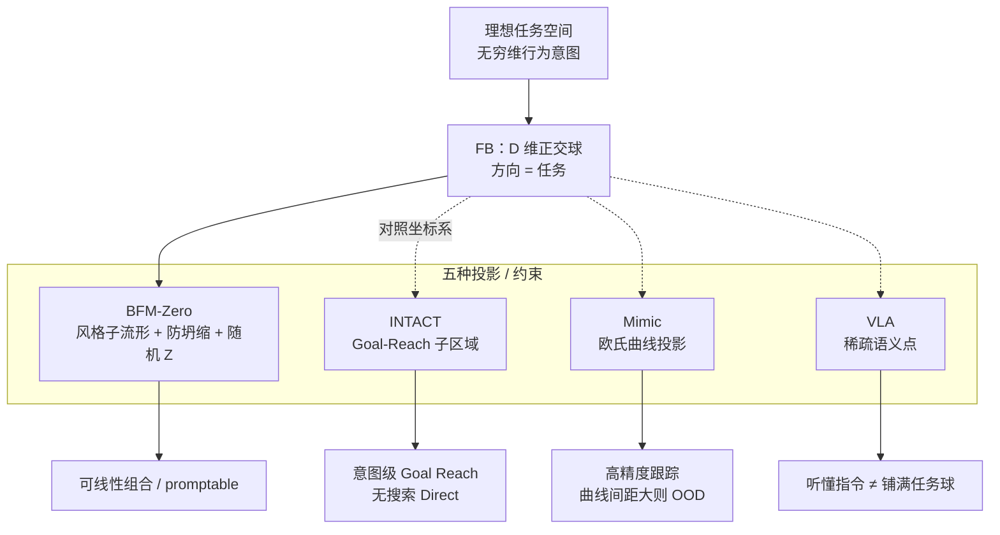

# FB / BFM-Zero / INTACT / Mimic / VLA：任务空间表征对比

**背景**：围绕 [RoboParty Lab](../entities/roboparty.md) 近期 [MimicLite](../entities/mimiclite.md)、[UFO](../entities/roboparty-ufo.md)（对接 [BFM-Zero](../entities/paper-bfm-zero.md)）与 [INTACT](../entities/paper-intact.md)，知乎专栏一文把 locomotion 跟踪与 manipulation 世界模型拉到同一问题：**latent / 任务空间该如何表征**。本页提炼其选型坐标——**不复述各论文实验表**，只保留「同一批 mocap / 交互，投影到不同坐标后，覆盖形状完全不同」这一可操作判断。

## 一句话定义

> **数据能铺开轨迹，但不能单独决定 Full cover：目标函数在什么空间上定义，决定学到的是可线性组合的任务球、Goal-Reach 子区域、欧氏跟踪曲线，还是语言条件下的稀疏语义点。**

## 英文缩写速查

| 缩写 | 英文全称 | 简要说明 |
|------|----------|----------|
| FB | Forward–Backward Representation | 无外在 reward 的转移表征；用 F/B 嵌入近似任务方向 |
| BFM | Behavior Foundation Model | 大规模行为先验，可 prompt 调用全身行为 |
| INTACT | INtent-To-ACTion | Goal/意图→动作的无搜索 JEPA 世界模型接口 |
| VLA | Vision-Language-Action | 视觉–语言条件化动作策略 |
| FSQ | Finite Scalar Quantization | SONIC 等用于约束离散任务隐空间的量化方案 |
| OOD | Out-of-Distribution | 训练分布外状态；跟踪曲线间距过大时常失效 |
| PPO | Proximal Policy Optimization | Mimic 类跟踪常用的 on-policy RL 优化器 |
| CEM | Cross-Entropy Method | 测试时动作搜索；INTACT 要削弱的对象 |

## 为什么重要

- **选型常被「再多采点数据」吸走注意力**；本文统一坐标系提醒：同一 LAFAN / 交互数据，在欧氏跟踪误差、Goal-Reach 意图、正交任务球上会学出完全不同的拼接与泛化行为。
- **把 RoboParty 三条工程线读通**：监督跟踪（MimicLite / SONIC 式 Mimic）、无监督 FB 控制（UFO / BFM-Zero）、意图→动作 WM（INTACT）——不是三条无关 demo，而是三种任务坐标赌注。
- **给 VLA / World Model 讨论一个可检验标准**：语义点是否铺开 ≠ 任务空间可组合；重建/短程预测 ≠ FB 式显式任务坐标。

## 核心维度对比

| 维度 | **FB 理论** | **BFM-Zero**（UFO 工程落点） | **INTACT** | **Mimic**（SONIC / MimicLite） | **VLA** |
|------|-------------|------------------------------|------------|--------------------------------|---------|
| **任务坐标形态** | \(D\) 维正交基底张成的球面（理想完整任务空间） | 同上，再被风格判别器压到**拟人子流形** | Goal-Reach **子区域**集合 | 欧氏空间跟踪**曲线**，投影到球上仍是曲线网 | 语言–视觉指令的**稀疏语义点** |
| **\(Z\) / 意图从哪来** | 理论基底；可由状态编码或目标诱导 | 轨迹嵌入 + **均匀随机采样**（off-policy） | **几乎只来自数据集**（local/global 意图网） | 隐式：参考轨迹本身；FSQ 等可离散化 | VLM 语义表征 + action head |
| **目标函数空间** | 可达性 / 未来访问分布（稳定收敛方向） | FB + 防坍缩正则（大权重）+ AMP 风格 | 意图→动作律；部署取条件均值（Direct） | **欧氏跟踪误差**（+ termination） | 预训练 CE/NLL；后训练 CE 或 diffusion/flow MSE |
| **未见 A→B 完整转移时** | 理论上可用中间状态组合（依赖球假设） | 随机 \(Z\) + 子流形约束增强拼接 | 通常**需要见过** A→B 路径 | 通常**需要见过**近似曲线；间距大即 OOD | 数据里没有对应语言条件行为则推不出 |
| **精度 vs 可组合** | \(D\) 维近似 + 时滞；组合性强 | 同左，精度换风格覆盖与 prompt 接口 | 意图级泛化（同意图多姿态）强于单轨迹 Mimic | **跟踪精度友好**；组合/转移弱 | 语义对齐宽则指令覆盖宽；动作仍绑数据条件 |
| **典型 OOD 失效** | 子空间坍缩到常走状态（需正则） | 风格外 / 正则不足时维度塌缩 | 未覆盖的跨区域 transition | 倒地却仍追跳舞参考 → 乱动或 termination | 换说法 / 换背景不会 |
| **站内锚点** | [BFM 分类 01](../overview/bfm-category-01-forward-backward-representation.md) | [paper-bfm-zero](../entities/paper-bfm-zero.md)、[UFO](../entities/roboparty-ufo.md) | [paper-intact](../entities/paper-intact.md) | [SONIC](../methods/sonic-motion-tracking.md)、[MimicLite](../entities/mimiclite.md) | [VLA](../methods/vla.md) |

## 流程总览：同一球面，五种投影

读图要点：

1. **BFM-Zero** 先承认 FB 球，再主动用数据+判别器切子流形，并用最大权重正则防止「只会走路」。
2. **INTACT** 不追求铺满奖励球，而把表征收成 Goal-Reach 可用；相对 Mimic 更像「学意图」而非「学一条轨迹」。
3. **Mimic / VLA** 在作者坐标系里同属「曲线或稀疏点」：OOD 分别表现为参考间距过大与换说法/换背景失效。
4. **World Model** 若只做重建或短程预测，仍未自动获得 FB 式可组合任务坐标——这是文中对「WM 理论上优于 VLA」的限定读法。

## Mimic 奖励梯度与 termination（选型细节）

文中对 Mimic 失效给了可操作机制（与「只怪数据不够」对照）：

| 设定 | 现象 | 机制读法 |
|------|------|----------|
| **关 termination** | 跟踪效果常明显变差 | OOD 样本污染梯度；倒地时「乱动」可比起身更快减小瞬时欧氏误差，而 FB 奖励的是未来稳定收敛方向 |
| **开 termination** | 可学会更多运动 | 阈值把有效误差压在梯度不消失的区间内，奖励信号更干净 |
| **FSQ / VQ codebook** | 同数据下泛化常优于普通 MLP Mimic | 离散码本更不易坍缩，任务隐空间投影面积更大 |

工程含义：做 [MimicLite](../entities/mimiclite.md) / [SONIC](../methods/sonic-motion-tracking.md) 迭代时，**termination 与隐空间正则是任务坐标问题，不只是超参调参**。

## 旁支：RL 为何比 MPC 更快啃下人形行走

同一篇文章把任务表征讨论接到接触动力学（与 [MPC vs RL](./mpc-vs-rl.md) 互补）：

| 侧面 | MPC | RL |
|------|-----|-----|
| 接触突变 | 需显式检测 / 规划 / 软接触或 LCP | 多样本期望把 0/1 接触平均成概率×力，梯度被平滑 |
| 代价 | 实时精确梯度与互补约束难 | sim2real gap；折现视野在 50 Hz、\(\gamma\sim0.98\)–\(0.99\) 时约 **1–2 s** |
| 对高频短窗 | 可显式建模 | 易被长程项与估计噪声淹没 |

结论对齐文末三问：**Robot（尤其人形）必须同时处理 Dynamic 与 Task**；只堆数据而不选任务坐标 / 不进接触闭环，仍会在拼接与带宽上失败。

## 怎么选（可操作）

| 你的主目标 | 更贴近的坐标 | 优先读 |
|------------|--------------|--------|
| 要 **prompt / 奖励方向可组合**，接受近似精度 | FB → BFM-Zero | [BFM-Zero](../entities/paper-bfm-zero.md)、[UFO](../entities/roboparty-ufo.md) |
| 要 **意图级 Goal Reach**、部署要毫秒级无搜索 | INTACT 式子空间 | [INTACT](../entities/paper-intact.md) |
| 要 **轨迹跟踪精度** 与小时级 infra 迭代 | Mimic + FSQ/termination 纪律 | [MimicLite](../entities/mimiclite.md)、[SONIC](../methods/sonic-motion-tracking.md) |
| 要 **语言接口**，并清楚其任务球仍稀疏 | VLA；OOD 勿只归因数据量 | [VLA](../methods/vla.md) |
| 要同时补 Dynamic | 接触平滑进策略或进闭环，而非只开环模仿 | [MPC vs RL](./mpc-vs-rl.md)、[Party OS 地图](../overview/roboparty-lab-party-os-technology-map.md) |

## 局限与风险

- 本页编译自**个人专栏洞察**，球面几何是统一读法而非各论文原文唯一表述；定量结论以各 arXiv 为准。
- 「FB 未见完整倒地爬起也能组合」是理论/机制叙事，真机仍受数据覆盖、风格子流形与 sim2real 约束。
- INTACT 训练/权重截至既有归档仍为 **Coming Soon**（文档仓）；勿把对比页当成可复现清单。
- VLA / WM 分野在快速演化；本页只固定「任务坐标是否可组合」这一评判轴。

## 关联页面

- [BFM-Zero（论文实体）](../entities/paper-bfm-zero.md)
- [INTACT（论文实体）](../entities/paper-intact.md)
- [MimicLite](../entities/mimiclite.md)
- [UFO（Roboparty）](../entities/roboparty-ufo.md)
- [SONIC 运动跟踪](../methods/sonic-motion-tracking.md)
- [VLA](../methods/vla.md)
- [Behavior Foundation Model](../concepts/behavior-foundation-model.md)
- [BFM 分类 01：Forward-backward 表征](../overview/bfm-category-01-forward-backward-representation.md)
- [RoboParty Lab / Party OS 技术地图](../overview/roboparty-lab-party-os-technology-map.md)
- [MPC vs RL](./mpc-vs-rl.md)
- [World-Action Models](../concepts/world-action-models.md)
- [具身大模型分类学选型闭环](../queries/embodied-fm-taxonomy-loop.md)
- [VLM/VLN/VLA/VLX/WM 分类](./vlm-vln-vla-vlx-world-model-taxonomy.md)

## 参考来源

- [zhihu_jagger_task_space_fb_bfm_intact_mimic_vla.md](../../sources/blogs/zhihu_jagger_task_space_fb_bfm_intact_mimic_vla.md) — 知乎专栏原文编译（<https://zhuanlan.zhihu.com/p/2066468645300180732>）
- [bfm_awesome_bfm_zero_arxiv_2511_04131.md](../../sources/papers/bfm_awesome_bfm_zero_arxiv_2511_04131.md)
- [intact_arxiv_2607_26056.md](../../sources/papers/intact_arxiv_2607_26056.md)
- [mimiclite.md](../../sources/repos/mimiclite.md)
- [roboparty_ufo.md](../../sources/repos/roboparty_ufo.md)
- [awesome_bfm_papers.md](../../sources/repos/awesome_bfm_papers.md)

## 推荐继续阅读

- [原文 · 知乎专栏](https://zhuanlan.zhihu.com/p/2066468645300180732)
- [BFM-Zero · arXiv:2511.04131](https://arxiv.org/abs/2511.04131)
- [INTACT · arXiv:2607.26056](https://arxiv.org/abs/2607.26056)
- [awesome-bfm-papers（FB / intrinsic reward 索引）](https://github.com/friedrichyuan/awesome-bfm-papers)
- [RoboParty Lab](https://lab.roboparty.com/)
